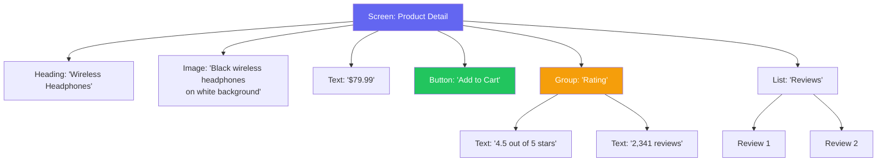

# Mobile Accessibility

::: tip Key Takeaway
- Accessibility is not optional — 15% of the world's population has some form of disability, and accessibility lawsuits against mobile apps increased 300% between 2018-2023 (Domino's, Target, Winn-Dixie all lost cases)
- Screen reader support requires semantic markup, not visual changes — add accessibility labels, roles, and hints to every interactive element, group related elements, and announce dynamic content changes
- Test with real screen readers (VoiceOver on iOS, TalkBack on Android), not just automated tools — automated tests catch contrast and label issues but miss navigation flow, gesture conflicts, and announcement timing problems
:::

Mobile accessibility means making your app usable by people with visual, motor, cognitive, and hearing disabilities. This includes people who are blind and use screen readers, people with low vision who need large text and high contrast, people with motor impairments who use switch controls or voice commands, and people who are deaf and need captions.

The business case is clear beyond compliance: accessible apps reach a larger market (1+ billion people with disabilities globally), improve usability for everyone (try using your phone with one hand while holding groceries), and perform better in app store rankings (Apple and Google both boost accessible apps in search results).

**Related**: [Mobile Testing](/mobile-engineering/mobile-testing) | [Mobile Architecture](/mobile-engineering/mobile-architecture) | [Mobile Engineering Overview](/mobile-engineering/)

---

## The Accessibility Tree

Every mobile app has an accessibility tree — a parallel representation of the UI that screen readers traverse instead of the visual layout. Elements that are not in this tree do not exist for screen reader users.



---

## Screen Reader Support

### React Native

```tsx
import { View, Text, TouchableOpacity, Image, AccessibilityInfo } from 'react-native';

function ProductCard({ product }: { product: Product }) {
  return (
    <TouchableOpacity
      // The entire card is one focusable element
      accessible={true}
      // Screen reader reads this instead of individual child elements
      accessibilityLabel={`${product.name}, ${formatPrice(product.price)}, ${product.rating} out of 5 stars, ${product.reviewCount} reviews`}
      accessibilityRole="button"
      accessibilityHint="Double tap to view product details"
      onPress={() => navigateToProduct(product.id)}
    >
      <Image
        source={{ uri: product.imageUrl }}
        // Decorative image — label is on the parent
        accessibilityElementsHidden={true}
        importantForAccessibility="no-hide-descendants"
      />
      <Text style={styles.name}>{product.name}</Text>
      <Text style={styles.price}>{formatPrice(product.price)}</Text>
      <RatingStars rating={product.rating} count={product.reviewCount} />
    </TouchableOpacity>
  );
}

// For elements that update dynamically
function CartBadge({ count }: { count: number }) {
  return (
    <View
      accessible={true}
      accessibilityLabel={`Cart, ${count} ${count === 1 ? 'item' : 'items'}`}
      accessibilityRole="button"
      // Announce changes to screen reader
      accessibilityLiveRegion="polite"
    >
      <CartIcon />
      {count > 0 && <Badge>{count}</Badge>}
    </View>
  );
}

// Custom accessibility actions
function SwipeableItem({ item, onDelete, onArchive }: Props) {
  return (
    <View
      accessible={true}
      accessibilityLabel={item.title}
      accessibilityActions={[
        { name: 'delete', label: 'Delete' },
        { name: 'archive', label: 'Archive' },
      ]}
      onAccessibilityAction={(event) => {
        switch (event.nativeEvent.actionName) {
          case 'delete':
            onDelete(item.id);
            break;
          case 'archive':
            onArchive(item.id);
            break;
        }
      }}
    >
      <Text>{item.title}</Text>
    </View>
  );
}

// Announce important changes
function CheckoutScreen() {
  const handleOrderPlaced = async () => {
    const order = await placeOrder();

    // Announce to screen reader users
    AccessibilityInfo.announceForAccessibility(
      `Order placed successfully. Order number ${order.id}. Estimated delivery ${order.estimatedDelivery}.`
    );
  };

  return (/* ... */);
}
```

### iOS (SwiftUI)

```swift
struct ProductCard: View {
    let product: Product

    var body: some View {
        Button(action: { navigateToProduct(product.id) }) {
            VStack(alignment: .leading) {
                AsyncImage(url: product.imageURL)
                    .accessibilityHidden(true)  // Decorative

                Text(product.name)
                    .font(.headline)

                Text(product.formattedPrice)
                    .font(.subheadline)

                HStack {
                    RatingStars(rating: product.rating)
                    Text("\(product.reviewCount) reviews")
                }
            }
        }
        // Combine all children into one accessibility element
        .accessibilityElement(children: .combine)
        .accessibilityLabel("\(product.name), \(product.formattedPrice)")
        .accessibilityValue("\(product.rating) out of 5 stars, \(product.reviewCount) reviews")
        .accessibilityHint("Opens product details")
        .accessibilityAddTraits(.isButton)
    }
}

// Dynamic content announcement
struct LiveScoreView: View {
    @State private var score: Score

    var body: some View {
        VStack {
            Text("\(score.homeTeam) \(score.homeScore) - \(score.awayScore) \(score.awayTeam)")
                .accessibilityLabel(
                    "\(score.homeTeam) \(score.homeScore), \(score.awayTeam) \(score.awayScore)"
                )
        }
        .onChange(of: score) { newScore in
            // Announce score changes
            UIAccessibility.post(
                notification: .announcement,
                argument: "Score update: \(newScore.homeTeam) \(newScore.homeScore), \(newScore.awayTeam) \(newScore.awayScore)"
            )
        }
    }
}

// Custom rotor actions
struct EmailRow: View {
    let email: Email

    var body: some View {
        VStack {
            Text(email.subject)
            Text(email.sender)
            Text(email.preview)
        }
        .accessibilityElement(children: .combine)
        .accessibilityCustomContent("From", email.sender)
        .accessibilityCustomContent("Date", email.formattedDate)
        .accessibilityAction(named: "Reply") {
            openReply(email)
        }
        .accessibilityAction(named: "Delete") {
            deleteEmail(email)
        }
        .accessibilityAction(named: "Flag") {
            flagEmail(email)
        }
    }
}
```

### Android (Jetpack Compose)

```kotlin
@Composable
fun ProductCard(product: Product, onClick: () -> Unit) {
    Card(
        modifier = Modifier
            .fillMaxWidth()
            .clickable(
                onClick = onClick,
                onClickLabel = "View product details"
            )
            .semantics(mergeDescendants = true) {
                contentDescription = "${product.name}, ${product.formattedPrice}, " +
                    "${product.rating} out of 5 stars, ${product.reviewCount} reviews"
            }
    ) {
        AsyncImage(
            model = product.imageUrl,
            contentDescription = null,  // Decorative — parent has description
        )

        Text(
            text = product.name,
            style = MaterialTheme.typography.headlineSmall
        )

        Text(
            text = product.formattedPrice,
            style = MaterialTheme.typography.bodyMedium
        )
    }
}

// Live region for dynamic updates
@Composable
fun CartBadge(count: Int) {
    Box(
        modifier = Modifier.semantics {
            contentDescription = "Cart, $count ${if (count == 1) "item" else "items"}"
            liveRegion = LiveRegionMode.Polite
        }
    ) {
        Icon(Icons.Default.ShoppingCart, contentDescription = null)
        if (count > 0) {
            Badge { Text(count.toString()) }
        }
    }
}

// Custom actions for screen readers
@Composable
fun SwipeableItem(item: ListItem, onDelete: () -> Unit, onArchive: () -> Unit) {
    Row(
        modifier = Modifier.semantics {
            customActions = listOf(
                CustomAccessibilityAction("Delete") {
                    onDelete()
                    true
                },
                CustomAccessibilityAction("Archive") {
                    onArchive()
                    true
                }
            )
        }
    ) {
        Text(item.title)
    }
}
```

---

## Dynamic Type & Text Scaling

Users can set their preferred text size in system settings. Your app must respect this setting.

```typescript
// React Native: Respecting system font scaling
import { PixelRatio, useWindowDimensions } from 'react-native';

// Allow text to scale with system settings
const styles = StyleSheet.create({
  // GOOD: Uses system font scaling
  body: {
    fontSize: 16,
    // React Native respects system font size by default
  },

  // BAD: Prevents text scaling (DON'T do this)
  // bodyFixed: {
  //   fontSize: 16,
  //   // maxFontSizeMultiplier={1} on Text blocks scaling
  // },
});

// Set reasonable limits to prevent layout breakage
function ScalableText({ children, style, maxScale = 2.0 }: Props) {
  return (
    <Text
      style={style}
      maxFontSizeMultiplier={maxScale}
      // Allow up to 2x scaling (200% of base)
      // Apple recommends supporting up to 310% for full Dynamic Type range
    >
      {children}
    </Text>
  );
}

// Adaptive layout that responds to text size
function AdaptiveProductCard({ product }: { product: Product }) {
  const fontScale = PixelRatio.getFontScale();

  // Switch to vertical layout when text is large
  const isLargeText = fontScale > 1.5;

  return (
    <View style={isLargeText ? styles.verticalCard : styles.horizontalCard}>
      <Image source={{ uri: product.imageUrl }} style={styles.thumbnail} />
      <View style={styles.info}>
        <Text style={styles.name}>{product.name}</Text>
        <Text style={styles.price}>{product.formattedPrice}</Text>
      </View>
    </View>
  );
}
```

```swift
// SwiftUI: Dynamic Type support
struct ProductCard: View {
    let product: Product
    @Environment(\.dynamicTypeSize) var dynamicTypeSize

    var body: some View {
        // Automatically switch layout for large text
        if dynamicTypeSize >= .accessibility1 {
            VStack(alignment: .leading) {
                productImage
                productInfo
            }
        } else {
            HStack {
                productImage
                productInfo
            }
        }
    }

    private var productImage: some View {
        AsyncImage(url: product.imageURL)
            .frame(
                width: dynamicTypeSize >= .accessibility1 ? nil : 100,
                height: 100
            )
    }

    private var productInfo: some View {
        VStack(alignment: .leading) {
            Text(product.name)
                .font(.headline)  // Automatically scales with Dynamic Type
            Text(product.formattedPrice)
                .font(.subheadline)
        }
    }
}
```

---

## Color Contrast & Visual Design

WCAG 2.1 AA requires a minimum contrast ratio of 4.5:1 for normal text and 3:1 for large text (18pt+).

| Element | Minimum Ratio (AA) | Minimum Ratio (AAA) | Common Failures |
|---------|-------------------|--------------------|--------------------|
| **Body text** | 4.5:1 | 7:1 | Light gray on white (#999 on #fff = 2.8:1) |
| **Large text** (18pt+) | 3:1 | 4.5:1 | |
| **UI components** (buttons, inputs) | 3:1 | N/A | Borderless inputs, ghost buttons |
| **Icons** (informational) | 3:1 | N/A | Light icons without labels |

```typescript
// Utility to check contrast ratio
function getContrastRatio(color1: string, color2: string): number {
  const l1 = getRelativeLuminance(color1);
  const l2 = getRelativeLuminance(color2);
  const lighter = Math.max(l1, l2);
  const darker = Math.min(l1, l2);
  return (lighter + 0.05) / (darker + 0.05);
}

// Design system colors that pass contrast checks
const colors = {
  // Text colors — all pass 4.5:1 on white
  textPrimary: '#1a1a1a',    // 16.6:1 on white
  textSecondary: '#4a4a4a',  // 8.6:1 on white
  textTertiary: '#6b6b6b',   // 5.5:1 on white — barely passes AA

  // DON'T use these for text on white:
  // textDanger: '#ff4444',   // 3.3:1 on white — FAILS
  textDanger: '#cc0000',      // 5.4:1 on white — passes

  // Interactive elements — 3:1 minimum
  buttonPrimary: '#1a73e8',   // 4.6:1 on white
  buttonDisabled: '#9e9e9e',  // 3.5:1 on white — passes 3:1 for UI components
};
```

### Supporting Dark Mode

```typescript
// React Native: theme-aware colors
import { useColorScheme } from 'react-native';

const lightTheme = {
  background: '#ffffff',
  surface: '#f5f5f5',
  textPrimary: '#1a1a1a',
  textSecondary: '#4a4a4a',
  border: '#e0e0e0',
  accent: '#1a73e8',
};

const darkTheme = {
  background: '#121212',
  surface: '#1e1e1e',
  textPrimary: '#e0e0e0',     // 13.3:1 on #121212
  textSecondary: '#a0a0a0',   // 6.3:1 on #121212
  border: '#333333',
  accent: '#8ab4f8',          // 8.8:1 on #121212
};

function useTheme() {
  const colorScheme = useColorScheme();
  return colorScheme === 'dark' ? darkTheme : lightTheme;
}
```

---

## Accessible Navigation

```typescript
// Focus management for screen transitions
import { useRef, useEffect } from 'react';
import { findNodeHandle, AccessibilityInfo } from 'react-native';

function SearchResultsScreen({ results }: { results: Product[] }) {
  const headerRef = useRef<Text>(null);

  useEffect(() => {
    // Move screen reader focus to the results heading
    // when new results load
    if (headerRef.current) {
      const node = findNodeHandle(headerRef.current);
      if (node) {
        AccessibilityInfo.setAccessibilityFocus(node);
      }
    }
  }, [results]);

  return (
    <View>
      <Text
        ref={headerRef}
        accessibilityRole="header"
        style={styles.heading}
      >
        {results.length} results found
      </Text>
      <FlatList
        data={results}
        renderItem={({ item }) => <ProductCard product={item} />}
      />
    </View>
  );
}

// Accessible modal
function AccessibleModal({ visible, onClose, title, children }: Props) {
  return (
    <Modal
      visible={visible}
      onRequestClose={onClose}
      // Focus is trapped inside the modal
      accessibilityViewIsModal={true}
    >
      <View style={styles.modal}>
        <View style={styles.header}>
          <Text
            accessibilityRole="header"
            style={styles.title}
          >
            {title}
          </Text>
          <TouchableOpacity
            onPress={onClose}
            accessibilityLabel="Close"
            accessibilityRole="button"
          >
            <CloseIcon />
          </TouchableOpacity>
        </View>
        {children}
      </View>
    </Modal>
  );
}
```

---

## Accessibility Testing

### Automated Testing

```typescript
// Jest + React Native Testing Library
import { render, screen } from '@testing-library/react-native';

describe('ProductCard Accessibility', () => {
  const product = {
    name: 'Wireless Headphones',
    price: 79.99,
    rating: 4.5,
    reviewCount: 2341,
    imageUrl: 'https://example.com/headphones.jpg',
  };

  it('has an accessible label', () => {
    render(<ProductCard product={product} />);
    expect(screen.getByLabelText(/wireless headphones/i)).toBeTruthy();
    expect(screen.getByLabelText(/\$79.99/)).toBeTruthy();
  });

  it('has button role', () => {
    render(<ProductCard product={product} />);
    expect(screen.getByRole('button')).toBeTruthy();
  });

  it('has a hint for screen readers', () => {
    render(<ProductCard product={product} />);
    expect(screen.getByA11yHint(/double tap/i)).toBeTruthy();
  });

  it('hides decorative images from screen readers', () => {
    render(<ProductCard product={product} />);
    const image = screen.queryByRole('image');
    // Decorative image should not be in accessibility tree
    expect(image).toBeNull();
  });
});
```

### Manual Testing Checklist

| Test | VoiceOver (iOS) | TalkBack (Android) |
|------|----------------|-------------------|
| **Enable** | Settings > Accessibility > VoiceOver | Settings > Accessibility > TalkBack |
| **Navigate forward** | Swipe right | Swipe right |
| **Navigate backward** | Swipe left | Swipe left |
| **Activate element** | Double tap | Double tap |
| **Scroll** | Three-finger swipe | Two-finger swipe |
| **Heading navigation** | Rotor > Headings | Reading controls > Headings |
| **Read all** | Two-finger swipe down | Three-finger tap then swipe right |

### Testing Protocol

1. Turn on the screen reader and close your eyes (seriously)
2. Navigate through every screen using only swipe gestures
3. For each element, verify: Can you understand what it is? Can you activate it? Does the announcement make sense?
4. Test error states — are error messages announced?
5. Test dynamic content — are loading states and updates announced?
6. Increase text size to maximum and verify layout does not break
7. Switch to high contrast mode and verify all text is readable

---

## When NOT to Over-Invest in Accessibility

Accessibility is always important, but the depth of investment should match your context:

- **Internal tools used by a known team.** Meet basic standards (labels, contrast) but do not spend weeks on screen reader optimization if no one on the team uses assistive technology. If someone does, then prioritize it.
- **Games with visual-only mechanics.** Some game mechanics are inherently visual. Do your best with audio cues and haptics, but accept that not every game can be fully accessible. Focus on menus, settings, and non-gameplay screens being accessible.
- **Very early prototypes.** Add accessibility labels as you build (it takes 30 seconds per element) but defer layout adaptation, custom rotor actions, and comprehensive testing until the feature is validated.

::: warning Common Misconceptions
**"Accessibility is for blind users only."** Screen reader users are a small percentage. The largest group of beneficiaries are people with low vision (need large text), motor impairments (need large touch targets), cognitive disabilities (need clear language and consistent navigation), and situational impairments (bright sunlight, one hand occupied, noisy environment). Good accessibility helps everyone.

**"If it passes automated tests, it's accessible."** Automated tools catch about 30% of accessibility issues (missing labels, contrast failures, missing roles). They cannot assess whether the navigation flow makes sense, whether announcements are useful, whether the reading order is logical, or whether custom interactions are discoverable. Manual testing with real assistive technology is essential.

**"Accessibility is expensive."** Adding accessibility from the start costs 5-10% more development time. Retrofitting an inaccessible app costs 10-50x more because every screen needs to be redesigned. The earlier you build it in, the cheaper it is.
:::

---

## Real-World Example: Airbnb

Airbnb's mobile app is widely recognized as one of the most accessible travel apps:

1. **Map accessibility**: Their map view provides an alternative list view for screen reader users, because interactive maps are nearly impossible to use with VoiceOver/TalkBack
2. **Photo descriptions**: Host photos have AI-generated descriptions for screen reader users (e.g., "bright living room with white sofa and floor-to-ceiling windows")
3. **Accessibility filters**: Users can filter listings by accessibility features (step-free access, wide doorways, roll-in shower)
4. **Dynamic type support**: The entire app adapts its layout for large text settings, switching from horizontal cards to vertical layouts
5. **Custom rotor actions**: In the listing detail screen, VoiceOver users can use rotor actions to jump between sections (Photos, Description, Amenities, Reviews)

---

::: details Quiz

**1. What is the difference between `accessibilityLabel` and `accessibilityHint`?**

`accessibilityLabel` describes WHAT the element is (e.g., "Add to cart button"). `accessibilityHint` describes WHAT WILL HAPPEN when the user interacts with it (e.g., "Adds this item to your shopping cart"). The label is always announced; the hint is announced after a brief pause and only if the user has not disabled hints in settings.

**2. Why should you use `accessibilityLiveRegion="polite"` instead of `"assertive"`?**

`polite` waits for the screen reader to finish its current announcement before announcing the new content. `assertive` interrupts the current announcement immediately. Use `polite` for most updates (cart count change, loading complete). Use `assertive` only for urgent information (error messages, security alerts). Overusing `assertive` is disorienting for screen reader users.

**3. What is the minimum contrast ratio for body text under WCAG 2.1 AA?**

4.5:1 for normal text (under 18pt/24px) and 3:1 for large text (18pt+ or 14pt+ bold). A common failure is using light gray text (#999999) on a white background, which has a contrast ratio of only 2.85:1.

**4. Why is `accessibilityViewIsModal={true}` important for modals?**

Without it, a screen reader user can swipe past the modal and access content behind it. This is confusing because the visual appearance suggests the modal is the only interactive surface. `accessibilityViewIsModal` tells the screen reader to restrict navigation to within the modal, matching the visual behavior.

:::

---

::: details Exercise

**Make this inaccessible form screen fully accessible:**

```tsx
// BEFORE: Inaccessible form
function LoginScreen() {
  const [email, setEmail] = useState('');
  const [password, setPassword] = useState('');
  const [error, setError] = useState('');

  return (
    <View>
      <Image source={require('./logo.png')} />
      <TextInput placeholder="Email" value={email} onChangeText={setEmail} />
      <TextInput placeholder="Password" value={password} onChangeText={setPassword} secureTextEntry />
      {error && <Text style={{ color: 'red' }}>{error}</Text>}
      <TouchableOpacity onPress={handleLogin}>
        <Text>Log In</Text>
      </TouchableOpacity>
      <TouchableOpacity onPress={handleForgotPassword}>
        <Text style={{ color: '#aaa' }}>Forgot password?</Text>
      </TouchableOpacity>
    </View>
  );
}
```

**Solution:**

```tsx
function LoginScreen() {
  const [email, setEmail] = useState('');
  const [password, setPassword] = useState('');
  const [error, setError] = useState('');
  const passwordRef = useRef<TextInput>(null);
  const errorRef = useRef<Text>(null);

  const handleLogin = async () => {
    try {
      await login(email, password);
    } catch (err) {
      const message = err.message || 'Login failed. Please try again.';
      setError(message);
      // Move screen reader focus to error message
      if (errorRef.current) {
        const node = findNodeHandle(errorRef.current);
        if (node) AccessibilityInfo.setAccessibilityFocus(node);
      }
    }
  };

  return (
    <View>
      {/* Decorative logo — hidden from screen reader */}
      <Image
        source={require('./logo.png')}
        accessibilityElementsHidden={true}
        importantForAccessibility="no-hide-descendants"
      />

      {/* Screen heading — helps screen reader users orient */}
      <Text
        accessibilityRole="header"
        style={styles.heading}
      >
        Log In
      </Text>

      {/* Email input with explicit label */}
      <Text nativeID="email-label">Email address</Text>
      <TextInput
        value={email}
        onChangeText={setEmail}
        accessibilityLabelledBy="email-label"
        accessibilityLabel="Email address"
        keyboardType="email-address"
        autoCapitalize="none"
        autoComplete="email"
        textContentType="emailAddress"
        returnKeyType="next"
        onSubmitEditing={() => passwordRef.current?.focus()}
        // Don't use placeholder as the only label
        placeholder="you@example.com"
      />

      {/* Password input */}
      <Text nativeID="password-label">Password</Text>
      <TextInput
        ref={passwordRef}
        value={password}
        onChangeText={setPassword}
        accessibilityLabelledBy="password-label"
        accessibilityLabel="Password"
        secureTextEntry
        autoComplete="password"
        textContentType="password"
        returnKeyType="done"
        onSubmitEditing={handleLogin}
        placeholder="Enter your password"
      />

      {/* Error message — announced immediately */}
      {error && (
        <Text
          ref={errorRef}
          accessibilityRole="alert"
          accessibilityLiveRegion="assertive"
          style={styles.error}  // Use textDanger (#cc0000) not #ff0000
        >
          {error}
        </Text>
      )}

      {/* Login button with clear role */}
      <TouchableOpacity
        onPress={handleLogin}
        accessibilityRole="button"
        accessibilityLabel="Log in"
        accessibilityState={{ disabled: !email || !password }}
        disabled={!email || !password}
        style={[
          styles.button,
          (!email || !password) && styles.buttonDisabled,
        ]}
      >
        <Text style={styles.buttonText}>Log In</Text>
      </TouchableOpacity>

      {/* Forgot password — proper contrast */}
      <TouchableOpacity
        onPress={handleForgotPassword}
        accessibilityRole="link"
        accessibilityLabel="Forgot password"
        accessibilityHint="Opens password reset screen"
      >
        {/* Changed from #aaa (fails contrast) to #4a4a4a (passes) */}
        <Text style={styles.link}>Forgot password?</Text>
      </TouchableOpacity>
    </View>
  );
}
```

Fixes applied:
1. Added heading role for orientation
2. Hidden decorative logo from accessibility tree
3. Added explicit labels via `accessibilityLabelledBy` (not just placeholder)
4. Error uses `role="alert"` and `liveRegion="assertive"` for immediate announcement
5. Focus moves to error on login failure
6. Added keyboard navigation flow (returnKeyType + onSubmitEditing)
7. Button has disabled state communicated to screen reader
8. "Forgot password" has sufficient contrast and proper role/hint
9. Added autoComplete and textContentType for password managers

:::

---

> *"Accessibility is not a feature. It is a quality characteristic, like performance or security. You would not ship an app without testing its performance. Do not ship one without testing its accessibility."*
