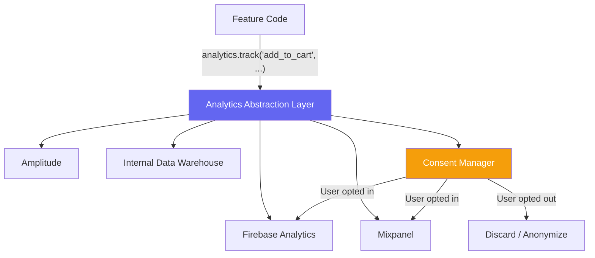
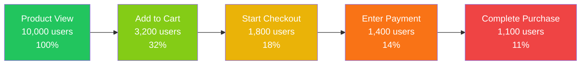
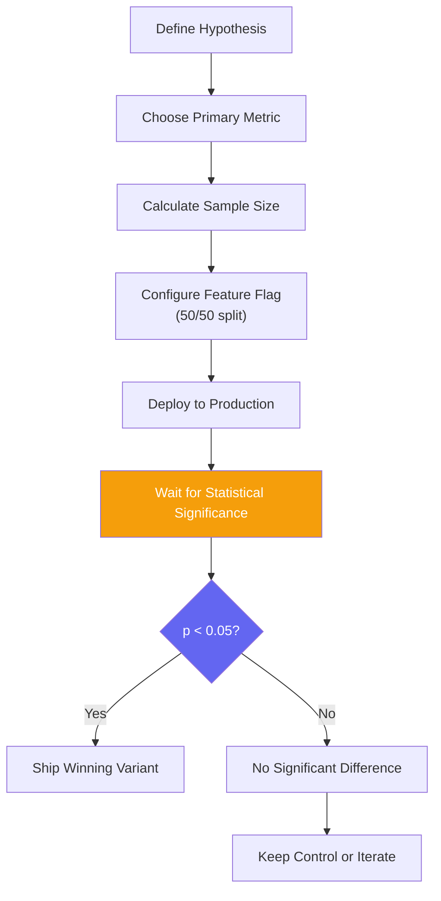

# Mobile Analytics

::: tip Key Takeaway
- Build an analytics abstraction layer from day one — it lets you swap providers (Firebase to Mixpanel to Amplitude) without touching feature code, and it enforces a consistent event taxonomy across your entire app
- Funnel analysis and cohort retention are the two most important analytics views for mobile — vanity metrics like DAU mean nothing without understanding where users drop off and whether they come back
- Mobile analytics must respect privacy regulations (GDPR, ATT on iOS) — you need opt-in consent flows, and you must handle the case where 40-60% of iOS users decline tracking
:::

Mobile analytics tells you what your users actually do, not what you hope they do. Without analytics, you are guessing. With bad analytics, you are confidently wrong. The difference between successful mobile products and failed ones often comes down to whether the team measured the right things and acted on the data.

The mobile analytics landscape is crowded — Firebase, Mixpanel, Amplitude, CleverTap, Adjust, Segment — and the temptation is to instrument everything. Resist that temptation. An app that tracks 500 events but nobody analyzes is worse than an app that tracks 20 events that drive weekly product decisions.

**Related**: [Deep Linking](/mobile-engineering/deep-linking) | [App Store Optimization](/mobile-engineering/app-store-optimization) | [Mobile Engineering Overview](/mobile-engineering/)

---

## Analytics Architecture



### The Analytics Abstraction Layer

This is the most important pattern in mobile analytics. Every analytics call in your app goes through this layer, never directly to a provider.

```typescript
// src/analytics/types.ts
export interface AnalyticsEvent {
  name: string;
  properties?: Record<string, string | number | boolean>;
  timestamp?: number;
}

export interface UserProperties {
  userId?: string;
  email?: string;
  plan?: 'free' | 'premium' | 'enterprise';
  signupDate?: string;
  platform?: 'ios' | 'android';
  appVersion?: string;
}

export interface AnalyticsProvider {
  initialize(): Promise<void>;
  track(event: AnalyticsEvent): void;
  identify(properties: UserProperties): void;
  screen(name: string, properties?: Record<string, string>): void;
  reset(): void;  // On logout
}

// src/analytics/providers/firebase.ts
import analytics from '@react-native-firebase/analytics';

export class FirebaseProvider implements AnalyticsProvider {
  async initialize() {
    await analytics().setAnalyticsCollectionEnabled(true);
  }

  track(event: AnalyticsEvent) {
    // Firebase has a 40-char event name limit and 500 event limit
    const sanitizedName = event.name.substring(0, 40);
    analytics().logEvent(sanitizedName, event.properties);
  }

  identify(properties: UserProperties) {
    if (properties.userId) {
      analytics().setUserId(properties.userId);
    }
    if (properties.plan) {
      analytics().setUserProperty('plan', properties.plan);
    }
  }

  screen(name: string, properties?: Record<string, string>) {
    analytics().logScreenView({
      screen_name: name,
      screen_class: name,
      ...properties,
    });
  }

  reset() {
    analytics().setUserId(null);
    analytics().resetAnalyticsData();
  }
}

// src/analytics/providers/mixpanel.ts
import { Mixpanel } from 'mixpanel-react-native';

export class MixpanelProvider implements AnalyticsProvider {
  private client: Mixpanel;

  constructor() {
    this.client = new Mixpanel('YOUR_MIXPANEL_TOKEN', true);
  }

  async initialize() {
    await this.client.init();
  }

  track(event: AnalyticsEvent) {
    this.client.track(event.name, event.properties);
  }

  identify(properties: UserProperties) {
    if (properties.userId) {
      this.client.identify(properties.userId);
    }
    this.client.getPeople().set(properties);
  }

  screen(name: string, properties?: Record<string, string>) {
    this.client.track('Screen View', { screen_name: name, ...properties });
  }

  reset() {
    this.client.reset();
  }
}

// src/analytics/analytics.ts
import { ConsentManager } from './consent';

class Analytics {
  private providers: AnalyticsProvider[] = [];
  private consent: ConsentManager;
  private queue: AnalyticsEvent[] = [];
  private initialized = false;

  constructor(consent: ConsentManager) {
    this.consent = consent;
  }

  addProvider(provider: AnalyticsProvider) {
    this.providers.push(provider);
  }

  async initialize() {
    await Promise.all(this.providers.map((p) => p.initialize()));
    this.initialized = true;
    // Flush queued events
    this.queue.forEach((event) => this.track(event.name, event.properties));
    this.queue = [];
  }

  track(name: string, properties?: Record<string, string | number | boolean>) {
    const event: AnalyticsEvent = {
      name,
      properties: {
        ...properties,
        timestamp: Date.now(),
        session_id: this.getSessionId(),
      },
    };

    if (!this.initialized) {
      this.queue.push(event);
      return;
    }

    if (!this.consent.hasAnalyticsConsent()) {
      return; // User declined tracking
    }

    this.providers.forEach((provider) => {
      try {
        provider.track(event);
      } catch (error) {
        console.warn(`Analytics provider failed:`, error);
        // Never let analytics crash the app
      }
    });
  }

  screen(name: string, properties?: Record<string, string>) {
    if (!this.consent.hasAnalyticsConsent()) return;
    this.providers.forEach((p) => p.screen(name, properties));
  }

  identify(properties: UserProperties) {
    if (!this.consent.hasAnalyticsConsent()) return;
    this.providers.forEach((p) => p.identify(properties));
  }

  reset() {
    this.providers.forEach((p) => p.reset());
  }

  private sessionId: string | null = null;
  private getSessionId(): string {
    if (!this.sessionId) {
      this.sessionId = `${Date.now()}-${Math.random().toString(36).substr(2, 9)}`;
    }
    return this.sessionId;
  }
}

// Singleton export
export const analytics = new Analytics(new ConsentManager());
```

---

## Event Taxonomy

A well-defined event taxonomy prevents the chaos of ad-hoc event naming. Define your events as a typed enum or constant map.

```typescript
// src/analytics/events.ts

// Use object_action naming convention (noun_verb)
export const Events = {
  // Onboarding
  ONBOARDING_STARTED: 'onboarding_started',
  ONBOARDING_STEP_COMPLETED: 'onboarding_step_completed',
  ONBOARDING_COMPLETED: 'onboarding_completed',
  ONBOARDING_SKIPPED: 'onboarding_skipped',

  // Authentication
  AUTH_SIGNUP_STARTED: 'auth_signup_started',
  AUTH_SIGNUP_COMPLETED: 'auth_signup_completed',
  AUTH_LOGIN_COMPLETED: 'auth_login_completed',
  AUTH_LOGOUT: 'auth_logout',

  // Product browsing
  PRODUCT_VIEWED: 'product_viewed',
  PRODUCT_SEARCHED: 'product_searched',
  PRODUCT_FILTERED: 'product_filtered',
  PRODUCT_SHARED: 'product_shared',

  // Cart
  CART_ITEM_ADDED: 'cart_item_added',
  CART_ITEM_REMOVED: 'cart_item_removed',
  CART_VIEWED: 'cart_viewed',

  // Checkout
  CHECKOUT_STARTED: 'checkout_started',
  CHECKOUT_SHIPPING_COMPLETED: 'checkout_shipping_completed',
  CHECKOUT_PAYMENT_COMPLETED: 'checkout_payment_completed',
  CHECKOUT_COMPLETED: 'checkout_completed',
  CHECKOUT_ABANDONED: 'checkout_abandoned',

  // Engagement
  REVIEW_SUBMITTED: 'review_submitted',
  WISHLIST_ITEM_ADDED: 'wishlist_item_added',
  NOTIFICATION_RECEIVED: 'notification_received',
  NOTIFICATION_TAPPED: 'notification_tapped',

  // Errors
  ERROR_API_FAILURE: 'error_api_failure',
  ERROR_PAYMENT_FAILURE: 'error_payment_failure',
  ERROR_CRASH: 'error_crash',
} as const;

// Typed event properties
export interface EventProperties {
  [Events.PRODUCT_VIEWED]: {
    product_id: string;
    product_name: string;
    category: string;
    price: number;
    source: 'search' | 'category' | 'recommendation' | 'deep_link';
  };
  [Events.CART_ITEM_ADDED]: {
    product_id: string;
    product_name: string;
    quantity: number;
    price: number;
    cart_total: number;
    cart_item_count: number;
  };
  [Events.CHECKOUT_COMPLETED]: {
    order_id: string;
    total: number;
    item_count: number;
    payment_method: 'card' | 'apple_pay' | 'google_pay';
    coupon_used: boolean;
    time_to_purchase_seconds: number;
  };
}

// Type-safe tracking function
export function trackEvent<K extends keyof EventProperties>(
  event: K,
  properties: EventProperties[K]
) {
  analytics.track(event, properties as Record<string, string | number | boolean>);
}

// Usage in component
trackEvent(Events.CART_ITEM_ADDED, {
  product_id: 'SKU-123',
  product_name: 'Wireless Headphones',
  quantity: 1,
  price: 79.99,
  cart_total: 159.98,
  cart_item_count: 3,
});
```

---

## Funnel Analysis

Funnels show you where users drop off in a multi-step process. Every mobile app has at least one critical funnel.



| Step Transition | Drop-off Rate | Industry Benchmark | Action |
|----------------|--------------|-------------------|--------|
| View → Add to Cart | 68% | 60-70% | Normal |
| Add to Cart → Checkout | 44% | 40-60% | Investigate |
| Checkout → Payment | 22% | 15-25% | Normal |
| Payment → Purchase | 21% | 10-20% | Slightly high — check payment errors |
| **Overall conversion** | **11%** | **2-5% (mobile)** | Good for e-commerce |

### Funnel Tracking Implementation

```typescript
// src/analytics/funnel.ts
class FunnelTracker {
  private funnelStarts: Map<string, number> = new Map();

  startFunnel(funnelName: string) {
    this.funnelStarts.set(funnelName, Date.now());
    analytics.track(`${funnelName}_started`, {
      funnel: funnelName,
    });
  }

  trackStep(funnelName: string, step: string, stepIndex: number) {
    const startTime = this.funnelStarts.get(funnelName);
    const elapsed = startTime ? Date.now() - startTime : null;

    analytics.track(`${funnelName}_step`, {
      funnel: funnelName,
      step,
      step_index: stepIndex,
      elapsed_ms: elapsed ?? 0,
    });
  }

  completeFunnel(funnelName: string, properties?: Record<string, any>) {
    const startTime = this.funnelStarts.get(funnelName);
    const totalTime = startTime ? Date.now() - startTime : null;

    analytics.track(`${funnelName}_completed`, {
      funnel: funnelName,
      total_time_ms: totalTime ?? 0,
      ...properties,
    });

    this.funnelStarts.delete(funnelName);
  }

  abandonFunnel(funnelName: string, lastStep: string) {
    const startTime = this.funnelStarts.get(funnelName);
    const elapsed = startTime ? Date.now() - startTime : null;

    analytics.track(`${funnelName}_abandoned`, {
      funnel: funnelName,
      last_step: lastStep,
      elapsed_ms: elapsed ?? 0,
    });

    this.funnelStarts.delete(funnelName);
  }
}

export const checkoutFunnel = new FunnelTracker();

// Usage in checkout flow
function CheckoutScreen() {
  useEffect(() => {
    checkoutFunnel.startFunnel('checkout');
    return () => {
      // If component unmounts without completing, it's an abandonment
      checkoutFunnel.abandonFunnel('checkout', 'shipping');
    };
  }, []);

  const onShippingComplete = () => {
    checkoutFunnel.trackStep('checkout', 'shipping', 1);
    navigation.navigate('Payment');
  };

  const onPaymentComplete = (orderId: string) => {
    checkoutFunnel.completeFunnel('checkout', {
      order_id: orderId,
      payment_method: selectedMethod,
    });
  };
}
```

---

## Cohort Analysis and Retention

Retention is the most important metric for mobile apps. If users do not come back, nothing else matters.

| Week | Cohort: Jan 1-7 | Cohort: Jan 8-14 | Cohort: Jan 15-21 |
|------|-----------------|-------------------|---------------------|
| Week 0 | 100% (5,000) | 100% (4,800) | 100% (5,200) |
| Week 1 | 42% | 45% | 48% |
| Week 2 | 28% | 30% | 33% |
| Week 4 | 18% | 20% | 24% |
| Week 8 | 12% | 14% | 18% |
| Week 12 | 9% | 11% | 15% |

The Jan 15-21 cohort shows improving retention, likely because a new onboarding flow shipped on Jan 14.

| App Category | Day 1 Retention | Day 7 | Day 30 | Source |
|-------------|----------------|-------|--------|--------|
| **Social** | 35-40% | 20-25% | 10-15% | Adjust benchmarks |
| **E-commerce** | 25-30% | 12-18% | 5-10% | |
| **Fintech** | 30-40% | 20-30% | 15-25% | |
| **Gaming** | 30-35% | 10-15% | 3-5% | |
| **Health/Fitness** | 25-30% | 15-20% | 8-12% | |

---

## A/B Testing with Feature Flags

A/B testing on mobile is harder than web because you cannot change the code after release. You must use feature flags evaluated at runtime.

```typescript
// src/features/featureFlags.ts
import remoteConfig from '@react-native-firebase/remote-config';

class FeatureFlags {
  private overrides: Map<string, string> = new Map();

  async initialize() {
    await remoteConfig().setDefaults({
      checkout_v2_enabled: false,
      new_onboarding_flow: false,
      recommendation_algorithm: 'collaborative',
      cart_badge_style: 'number',  // 'number' | 'dot'
    });

    await remoteConfig().setConfigSettings({
      minimumFetchIntervalMillis: __DEV__ ? 0 : 3600000,  // 1hr in prod
    });

    await remoteConfig().fetchAndActivate();
  }

  getBoolean(key: string): boolean {
    const override = this.overrides.get(key);
    if (override !== undefined) return override === 'true';
    return remoteConfig().getBoolean(key);
  }

  getString(key: string): string {
    const override = this.overrides.get(key);
    if (override !== undefined) return override;
    return remoteConfig().getString(key);
  }

  // For QA: override flags locally
  setOverride(key: string, value: string) {
    this.overrides.set(key, value);
  }

  clearOverrides() {
    this.overrides.clear();
  }
}

export const featureFlags = new FeatureFlags();

// A/B test tracking
function trackExperimentExposure(experimentName: string, variant: string) {
  analytics.track('experiment_exposure', {
    experiment: experimentName,
    variant,
  });
}

// Usage in a component
function CheckoutButton() {
  const isV2 = featureFlags.getBoolean('checkout_v2_enabled');

  useEffect(() => {
    trackExperimentExposure('checkout_v2', isV2 ? 'treatment' : 'control');
  }, [isV2]);

  if (isV2) {
    return <CheckoutV2Button />;
  }
  return <CheckoutV1Button />;
}
```

### Experiment Design



| Parameter | How to Determine | Example |
|-----------|-----------------|---------|
| **Primary metric** | One metric that directly measures the hypothesis | Checkout completion rate |
| **Minimum detectable effect** | Smallest change worth detecting | 5% relative improvement |
| **Sample size** | Statistical power calculator | ~3,000 per variant (for 80% power) |
| **Duration** | Sample size / daily traffic per variant | 7-14 days |
| **Guardrail metrics** | Metrics that should not degrade | Crash rate, app rating, support tickets |

---

## Privacy and Consent

### iOS App Tracking Transparency (ATT)

Since iOS 14.5, apps must request permission before tracking users across apps and websites. Roughly 75-80% of users opt out of tracking when shown the default ATT prompt.

```typescript
// src/analytics/consent.ts
import { check, request, PERMISSIONS, RESULTS } from 'react-native-permissions';
import { Platform } from 'react-native';
import { getTrackingStatus, requestTrackingPermission } from 'react-native-tracking-transparency';

export class ConsentManager {
  private analyticsConsent: boolean = false;
  private trackingConsent: boolean = false;

  async requestConsent(): Promise<{ analytics: boolean; tracking: boolean }> {
    // Step 1: Show your own pre-prompt explaining the value
    // (This is NOT the ATT dialog — it's your custom UI)
    const userAgreed = await this.showPrePrompt();

    if (!userAgreed) {
      this.analyticsConsent = false;
      this.trackingConsent = false;
      return { analytics: false, tracking: false };
    }

    // Step 2: Request ATT permission (iOS only)
    if (Platform.OS === 'ios') {
      const status = await requestTrackingPermission();
      this.trackingConsent = status === 'authorized';
    } else {
      // Android: no system-level ATT equivalent
      this.trackingConsent = true;
    }

    // Analytics consent (first-party data) is separate from tracking consent
    this.analyticsConsent = true;

    return {
      analytics: this.analyticsConsent,
      tracking: this.trackingConsent,
    };
  }

  hasAnalyticsConsent(): boolean {
    return this.analyticsConsent;
  }

  hasTrackingConsent(): boolean {
    return this.trackingConsent;
  }

  private async showPrePrompt(): Promise<boolean> {
    // Show a custom screen explaining WHY you track
    // "We use analytics to improve your experience and show relevant content"
    // This increases ATT opt-in rates from ~20% to ~40%
    return new Promise((resolve) => {
      // Your custom pre-prompt UI
      showConsentDialog({
        onAccept: () => resolve(true),
        onDecline: () => resolve(false),
      });
    });
  }
}
```

### GDPR-Compliant Analytics

```typescript
// For European users, you need explicit consent before ANY analytics
function determineConsentRequirements(userLocale: string): ConsentLevel {
  const gdprCountries = ['DE', 'FR', 'IT', 'ES', 'NL', 'BE', 'AT', 'PL', /* ... */];
  const userCountry = userLocale.split('-')[1]?.toUpperCase();

  if (gdprCountries.includes(userCountry)) {
    return 'explicit_opt_in';  // Must ask before tracking anything
  }
  if (userCountry === 'US') {
    // CCPA: opt-out model (track by default, allow opt-out)
    // But check state-specific laws (California, Virginia, Colorado, etc.)
    return 'opt_out';
  }
  return 'opt_out';  // Most other regions
}
```

---

## When NOT to Invest in Analytics

- **Day one of a prototype.** If you have zero users, analytics tells you nothing. Build the product, get users, then instrument. Console logs are fine for the first 100 users.
- **When you are not going to look at the data.** If no one on your team has a habit of checking dashboards or running analyses, analytics is wasted effort. Build the habit first with simple metrics (crash rate, DAU), then expand.
- **Custom analytics infrastructure** when a third-party tool works fine. Building your own event pipeline, storage, and query layer is a multi-month engineering project. Use Mixpanel, Amplitude, or PostHog unless you have specific requirements they cannot meet (data residency, extreme volume, custom ML models).

::: warning Common Misconceptions
**"More events = better analytics."** Over-instrumentation creates noise, increases payload size, and makes analysis harder. A lean event taxonomy with 30-50 well-defined events beats 500 ad-hoc events every time. If nobody looks at an event, delete it.

**"DAU is the most important metric."** DAU measures activity, not value. An app with 1 million DAU where 90% bounce after 10 seconds is less healthy than an app with 100,000 DAU where users spend 20 minutes daily. Combine DAU with retention, session duration, and core action frequency.

**"A/B testing is easy — just split traffic 50/50."** On mobile, you cannot change variants after release without feature flags. Users on old app versions will always see the control. You need to account for version fragmentation, and you need to wait for statistical significance before calling a winner — checking results daily and stopping early when it "looks good" leads to false positives.
:::

---

## Real-World Example: Duolingo

Duolingo runs one of the most sophisticated mobile analytics and experimentation platforms in the industry:

1. **40+ concurrent A/B tests** running at any time, each with clear primary metrics and guardrails
2. **Retention as the north star** — every experiment is evaluated primarily on its impact on D1, D7, and D14 retention
3. **Streak mechanism analytics** — they discovered that the streak (consecutive days of practice) is the strongest predictor of long-term retention, so they protect it aggressively (streak freezes, reminders)
4. **Push notification optimization** — A/B tested notification timing, copy, and frequency. Found that a single well-timed reminder at the user's habitual practice time outperforms multiple generic reminders
5. **Session-level funnel analysis** — they track not just "did the user complete a lesson" but every tap within a lesson to identify where learners struggle and where the UX causes confusion

---

::: details Quiz

**1. Why should you build an analytics abstraction layer instead of calling Firebase/Mixpanel directly?**

An abstraction layer lets you: (a) swap analytics providers without changing feature code, (b) send events to multiple providers simultaneously, (c) enforce consistent event naming and property schemas, (d) implement consent checks in one place, and (e) add event queuing for offline support. Without it, analytics calls are scattered throughout the codebase and tightly coupled to one provider.

**2. What is the difference between analytics consent and tracking consent on iOS?**

Analytics consent covers first-party data collection — recording what users do within your app. Tracking consent (ATT) covers cross-app tracking — linking user activity across different apps and websites for advertising purposes. You can collect first-party analytics without ATT consent. ATT only governs the IDFA (Identifier for Advertisers) and cross-app data sharing. Most analytics tools (Firebase, Mixpanel) work fine without ATT consent.

**3. Why is checking A/B test results daily and stopping when one variant "looks better" a bad practice?**

This is called "peeking" and it dramatically increases false positive rates. Statistical significance calculations assume you check results once after the full sample size is collected. Checking daily and stopping early when p < 0.05 can yield false positive rates of 30%+ instead of the expected 5%. Use sequential testing methods (like Bayesian analysis) if you need early stopping, or pre-commit to a fixed sample size and duration.

**4. What is a pre-prompt, and why does it increase ATT opt-in rates?**

A pre-prompt is a custom screen shown before the iOS ATT system dialog. It explains in your own words why tracking helps the user (e.g., "to show relevant content" or "to improve your experience"). Users who understand the value proposition opt in at higher rates (~40%) compared to seeing the system dialog cold (~20%). Apple allows pre-prompts as long as they don't mimic the system dialog or manipulate the user.

:::

---

::: details Exercise

**Design an analytics event taxonomy for a food delivery app. Define:**

1. At least 15 events covering the core user journey
2. Typed properties for each event
3. Two critical funnels
4. Three guardrail metrics for A/B testing

**Solution:**

```typescript
// Event taxonomy for food delivery app

export const DeliveryEvents = {
  // Discovery
  HOME_SCREEN_VIEWED: 'home_screen_viewed',
  RESTAURANT_SEARCHED: 'restaurant_searched',
  RESTAURANT_VIEWED: 'restaurant_viewed',
  CUISINE_FILTER_APPLIED: 'cuisine_filter_applied',
  MENU_ITEM_VIEWED: 'menu_item_viewed',

  // Ordering
  ITEM_ADDED_TO_CART: 'item_added_to_cart',
  ITEM_REMOVED_FROM_CART: 'item_removed_from_cart',
  ITEM_CUSTOMIZED: 'item_customized',
  CART_VIEWED: 'cart_viewed',
  PROMO_CODE_APPLIED: 'promo_code_applied',

  // Checkout
  CHECKOUT_STARTED: 'checkout_started',
  ADDRESS_SELECTED: 'address_selected',
  PAYMENT_METHOD_SELECTED: 'payment_method_selected',
  ORDER_PLACED: 'order_placed',
  ORDER_FAILED: 'order_failed',

  // Post-order
  ORDER_TRACKED: 'order_tracked',
  DELIVERY_COMPLETED: 'delivery_completed',
  RATING_SUBMITTED: 'rating_submitted',
  TIP_ADDED: 'tip_added',
  REORDER_TAPPED: 'reorder_tapped',
} as const;

// Typed properties
interface DeliveryEventProperties {
  [DeliveryEvents.RESTAURANT_VIEWED]: {
    restaurant_id: string;
    restaurant_name: string;
    cuisine: string;
    rating: number;
    delivery_time_estimate: number;
    distance_km: number;
    source: 'search' | 'recommendation' | 'cuisine_filter' | 'reorder';
  };
  [DeliveryEvents.ITEM_ADDED_TO_CART]: {
    restaurant_id: string;
    item_id: string;
    item_name: string;
    price: number;
    quantity: number;
    has_customizations: boolean;
    cart_total: number;
  };
  [DeliveryEvents.ORDER_PLACED]: {
    order_id: string;
    restaurant_id: string;
    total: number;
    item_count: number;
    delivery_fee: number;
    tip_amount: number;
    payment_method: 'card' | 'apple_pay' | 'google_pay' | 'cash';
    promo_applied: boolean;
    estimated_delivery_minutes: number;
    time_from_first_item_added_seconds: number;
  };
}

// Funnel 1: Order Funnel
// Home → Restaurant View → Add to Cart → Checkout → Order Placed
// This is the primary revenue funnel.
// Benchmark: 15-20% of restaurant views lead to add-to-cart,
// 50-60% of checkouts convert to placed orders.

// Funnel 2: Reorder Funnel
// Push Notification → App Open → Reorder Tap → Order Placed
// Reorders are the highest-margin orders (no discovery cost).
// Benchmark: 20-30% tap rate on reorder notifications,
// 60-70% of reorder taps convert to placed orders.

// Guardrail metrics for A/B testing:
// 1. App crash rate — must not increase. If a new feature
//    increases crashes by > 0.1%, kill the experiment.
// 2. Customer support ticket rate — proxy for user confusion.
//    If tickets increase > 10%, investigate immediately.
// 3. Average delivery rating — must stay above 4.2 stars.
//    A faster checkout that leads to incorrect orders is a net negative.
```

:::

---

> *"The purpose of analytics is not to produce dashboards. It is to produce decisions. If your analytics do not change what you build next, they are decoration."*
