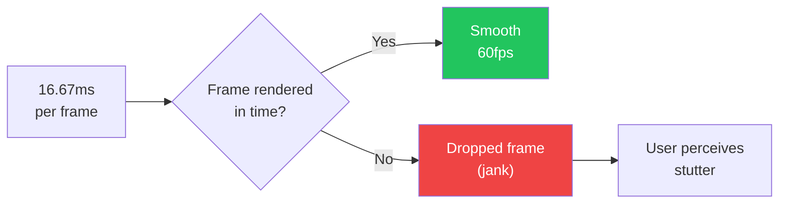

# Mobile Animations

::: tip Key Takeaway
- Animations must run on the UI thread (or a dedicated animation thread) to hit 60fps — any animation that touches the JavaScript thread in React Native or the main isolate in Flutter will jank when the app is doing other work
- React Native Reanimated 3 is the only serious animation library for React Native — it runs animations on the UI thread using worklets, which means your JS business logic cannot block animations
- Shared element transitions, spring physics, and gesture-driven animations are the three patterns that make mobile apps feel native — learn these three before worrying about complex choreography
:::

Animation is what separates a mobile app that feels like a website in a frame from one that feels like it belongs on the platform. When you tap a card and it expands into a full screen with a shared image transition, or when you pull down a list and it bounces with spring physics, or when you swipe to dismiss and the card follows your finger with velocity-matched easing — that is the feeling of a native app.

Bad animation is worse than no animation. An animation that drops frames (janks), starts late, or snaps to its final position is more jarring than a simple instant transition. If you cannot guarantee smooth animation, do not animate.

**Related**: [Mobile Performance](/mobile-engineering/mobile-performance) | [Mobile Accessibility](/mobile-engineering/mobile-accessibility) | [Mobile Engineering Overview](/mobile-engineering/)

---

## Why 60fps Matters



| Frame Rate | Frame Budget | Perception |
|-----------|-------------|------------|
| **60fps** | 16.67ms | Smooth, native feel |
| **30fps** | 33.33ms | Acceptable for some content, noticeable lag |
| **15fps** | 66.67ms | Clearly janky, app feels broken |
| **120fps** (ProMotion) | 8.33ms | Ultra-smooth, luxury feel |

---

## React Native Reanimated 3

Reanimated runs animations on the UI thread using worklets — small JavaScript functions compiled to run outside the React Native JS thread. This means your animations cannot be blocked by network requests, state updates, or heavy computations on the JS thread.

### Shared Values and Animated Styles

```typescript
import Animated, {
  useSharedValue,
  useAnimatedStyle,
  withSpring,
  withTiming,
  withDelay,
  withSequence,
  interpolate,
  Easing,
  runOnJS,
} from 'react-native-reanimated';

// Basic spring animation
function AnimatedCard({ item }: { item: Product }) {
  const scale = useSharedValue(1);
  const opacity = useSharedValue(1);

  const animatedStyle = useAnimatedStyle(() => ({
    transform: [{ scale: scale.value }],
    opacity: opacity.value,
  }));

  const handlePressIn = () => {
    scale.value = withSpring(0.95, {
      damping: 15,
      stiffness: 150,
    });
  };

  const handlePressOut = () => {
    scale.value = withSpring(1, {
      damping: 15,
      stiffness: 150,
    });
  };

  return (
    <Animated.View style={[styles.card, animatedStyle]}>
      <Pressable onPressIn={handlePressIn} onPressOut={handlePressOut}>
        <Text>{item.name}</Text>
      </Pressable>
    </Animated.View>
  );
}

// Staggered list entrance animation
function StaggeredList({ items }: { items: Product[] }) {
  return (
    <FlatList
      data={items}
      renderItem={({ item, index }) => (
        <StaggeredItem item={item} index={index} />
      )}
    />
  );
}

function StaggeredItem({ item, index }: { item: Product; index: number }) {
  const translateY = useSharedValue(50);
  const opacity = useSharedValue(0);

  useEffect(() => {
    // Stagger each item by 50ms
    translateY.value = withDelay(
      index * 50,
      withSpring(0, { damping: 20, stiffness: 90 })
    );
    opacity.value = withDelay(
      index * 50,
      withTiming(1, { duration: 300 })
    );
  }, []);

  const animatedStyle = useAnimatedStyle(() => ({
    transform: [{ translateY: translateY.value }],
    opacity: opacity.value,
  }));

  return (
    <Animated.View style={animatedStyle}>
      <ProductCard product={item} />
    </Animated.View>
  );
}
```

### Gesture-Driven Animations

```typescript
import { Gesture, GestureDetector } from 'react-native-gesture-handler';
import Animated, {
  useSharedValue,
  useAnimatedStyle,
  withSpring,
  withTiming,
  runOnJS,
  interpolate,
  Extrapolation,
} from 'react-native-reanimated';

// Swipe to dismiss card
function SwipeToDeleteCard({
  item,
  onDelete,
}: {
  item: CartItem;
  onDelete: (id: string) => void;
}) {
  const translateX = useSharedValue(0);
  const itemHeight = useSharedValue(80);
  const opacity = useSharedValue(1);

  const SWIPE_THRESHOLD = -120;

  const panGesture = Gesture.Pan()
    .activeOffsetX([-10, 10])
    .onUpdate((event) => {
      // Only allow left swipe
      translateX.value = Math.min(0, event.translationX);
    })
    .onEnd((event) => {
      if (translateX.value < SWIPE_THRESHOLD || event.velocityX < -500) {
        // Swipe threshold reached — animate out
        translateX.value = withTiming(-400, { duration: 200 });
        itemHeight.value = withTiming(0, { duration: 300, easing: Easing.inOut(Easing.ease) });
        opacity.value = withTiming(0, { duration: 200 }, () => {
          runOnJS(onDelete)(item.id);
        });
      } else {
        // Snap back
        translateX.value = withSpring(0, { damping: 20, stiffness: 200 });
      }
    });

  const cardStyle = useAnimatedStyle(() => ({
    transform: [{ translateX: translateX.value }],
    height: itemHeight.value,
    opacity: opacity.value,
  }));

  const deleteIconStyle = useAnimatedStyle(() => ({
    opacity: interpolate(
      translateX.value,
      [-120, -60, 0],
      [1, 0.5, 0],
      Extrapolation.CLAMP
    ),
  }));

  return (
    <View style={styles.container}>
      {/* Delete background */}
      <Animated.View style={[styles.deleteBackground, deleteIconStyle]}>
        <TrashIcon color="white" />
      </Animated.View>

      {/* Swipeable card */}
      <GestureDetector gesture={panGesture}>
        <Animated.View style={[styles.card, cardStyle]}>
          <Text>{item.name}</Text>
          <Text>{formatPrice(item.price)}</Text>
        </Animated.View>
      </GestureDetector>
    </View>
  );
}

// Bottom sheet with gesture
function BottomSheet({ children }: { children: React.ReactNode }) {
  const translateY = useSharedValue(0);
  const context = useSharedValue(0);

  const SNAP_POINTS = [0, -300, -600]; // Collapsed, half, full
  const MAX_TRANSLATE_Y = -600;

  const panGesture = Gesture.Pan()
    .onStart(() => {
      context.value = translateY.value;
    })
    .onUpdate((event) => {
      translateY.value = Math.max(
        MAX_TRANSLATE_Y,
        Math.min(0, context.value + event.translationY)
      );
    })
    .onEnd((event) => {
      // Snap to nearest point, considering velocity
      const velocity = event.velocityY;
      const projectedY = translateY.value + velocity * 0.1;

      let closest = SNAP_POINTS[0];
      let minDistance = Math.abs(projectedY - SNAP_POINTS[0]);

      for (const point of SNAP_POINTS) {
        const distance = Math.abs(projectedY - point);
        if (distance < minDistance) {
          minDistance = distance;
          closest = point;
        }
      }

      translateY.value = withSpring(closest, {
        damping: 20,
        stiffness: 150,
        velocity: velocity,
      });
    });

  const sheetStyle = useAnimatedStyle(() => ({
    transform: [{ translateY: translateY.value }],
  }));

  const backdropStyle = useAnimatedStyle(() => ({
    opacity: interpolate(
      translateY.value,
      [0, MAX_TRANSLATE_Y],
      [0, 0.5],
      Extrapolation.CLAMP
    ),
  }));

  return (
    <>
      <Animated.View style={[styles.backdrop, backdropStyle]} pointerEvents="none" />
      <GestureDetector gesture={panGesture}>
        <Animated.View style={[styles.sheet, sheetStyle]}>
          <View style={styles.handle} />
          {children}
        </Animated.View>
      </GestureDetector>
    </>
  );
}
```

---

## Lottie Animations

Lottie renders After Effects animations exported as JSON. It is the standard for micro-interactions, onboarding, loading states, and success animations.

```typescript
import LottieView from 'lottie-react-native';
import { useRef, useEffect } from 'react';

// Simple Lottie animation
function SuccessAnimation({ onComplete }: { onComplete: () => void }) {
  return (
    <LottieView
      source={require('./animations/success-check.json')}
      autoPlay
      loop={false}
      onAnimationFinish={onComplete}
      style={{ width: 200, height: 200 }}
    />
  );
}

// Controlled Lottie with progress
function PullToRefreshAnimation({ progress }: { progress: Animated.SharedValue<number> }) {
  const lottieRef = useRef<LottieView>(null);

  useAnimatedReaction(
    () => progress.value,
    (currentProgress) => {
      if (lottieRef.current) {
        // Map pull distance to animation progress
        runOnJS(setLottieProgress)(currentProgress);
      }
    }
  );

  function setLottieProgress(p: number) {
    lottieRef.current?.play(0, p * 60); // 60 frames total
  }

  return (
    <LottieView
      ref={lottieRef}
      source={require('./animations/pull-refresh.json')}
      autoPlay={false}
      loop={false}
      style={{ width: 60, height: 60 }}
    />
  );
}

// Interactive Lottie (e.g., like button)
function AnimatedLikeButton({ isLiked, onToggle }: Props) {
  const animationRef = useRef<LottieView>(null);

  useEffect(() => {
    if (isLiked) {
      animationRef.current?.play(0, 60);  // Play forward
    } else {
      animationRef.current?.play(60, 0);  // Play reverse
    }
  }, [isLiked]);

  return (
    <TouchableOpacity onPress={onToggle}>
      <LottieView
        ref={animationRef}
        source={require('./animations/heart-like.json')}
        autoPlay={false}
        loop={false}
        style={{ width: 50, height: 50 }}
      />
    </TouchableOpacity>
  );
}
```

---

## Shared Element Transitions

Shared element transitions make one element appear to fly from one screen to another. This is the signature animation of native mobile apps.

```typescript
// React Native Shared Element Transition (react-navigation v7+)
import { SharedTransition, withLayoutAnimation } from 'react-native-reanimated';

// Define the shared transition
const customTransition = SharedTransition.custom((values) => {
  'worklet';
  return {
    // Animate width, height, position, and border radius
    width: withSpring(values.targetWidth, { damping: 15 }),
    height: withSpring(values.targetHeight, { damping: 15 }),
    originX: withSpring(values.targetOriginX, { damping: 15 }),
    originY: withSpring(values.targetOriginY, { damping: 15 }),
    borderRadius: withTiming(values.targetBorderRadius, { duration: 300 }),
  };
});

// List screen with shared element source
function ProductListScreen() {
  return (
    <FlatList
      data={products}
      renderItem={({ item }) => (
        <Pressable onPress={() => navigation.navigate('ProductDetail', { id: item.id })}>
          <Animated.Image
            source={{ uri: item.imageUrl }}
            style={styles.thumbnail}
            // This tag links the element across screens
            sharedTransitionTag={`product-image-${item.id}`}
            sharedTransitionStyle={customTransition}
          />
          <Animated.Text
            sharedTransitionTag={`product-name-${item.id}`}
          >
            {item.name}
          </Animated.Text>
        </Pressable>
      )}
    />
  );
}

// Detail screen with shared element target
function ProductDetailScreen({ route }: Props) {
  const { id } = route.params;
  const product = useProduct(id);

  return (
    <ScrollView>
      <Animated.Image
        source={{ uri: product.imageUrl }}
        style={styles.heroImage}
        sharedTransitionTag={`product-image-${id}`}
        sharedTransitionStyle={customTransition}
      />
      <Animated.Text
        style={styles.title}
        sharedTransitionTag={`product-name-${id}`}
      >
        {product.name}
      </Animated.Text>
      <Text style={styles.description}>{product.description}</Text>
    </ScrollView>
  );
}
```

---

## Spring Physics

Springs are the foundation of natural-feeling animations. Unlike linear or eased timing, springs respond to velocity — they feel like they are connected to the user's finger.

```typescript
// Spring configuration guide
const springConfigs = {
  // Snappy button press — fast, slightly bouncy
  button: { damping: 15, stiffness: 150, mass: 1 },

  // Smooth card transition — gentle, no overshoot
  card: { damping: 20, stiffness: 90, mass: 1 },

  // Bouncy success animation — playful, visible overshoot
  celebration: { damping: 8, stiffness: 100, mass: 1 },

  // Heavy drawer slide — slow, weighted
  drawer: { damping: 30, stiffness: 60, mass: 2 },

  // Quick snap back — fast return to rest
  snapBack: { damping: 20, stiffness: 200, mass: 0.5 },
};
```

| Parameter | Effect | Low Value | High Value |
|-----------|--------|-----------|------------|
| **Damping** | How quickly motion decays | Bouncy, oscillates | Stiff, no overshoot |
| **Stiffness** | How fast the spring moves | Slow, gentle | Quick, snappy |
| **Mass** | Inertia of the element | Light, responsive | Heavy, slow to start/stop |

---

## 60fps Performance Tips

| Problem | Cause | Fix |
|---------|-------|-----|
| **JS thread blocked** | Heavy computation during animation | Move animation to UI thread (Reanimated worklets) |
| **Excessive re-renders** | Animated value triggers React re-render | Use `useAnimatedStyle` not inline styles |
| **Shadow rendering** | Box shadows are expensive | Use `elevation` on Android, simplify shadows on iOS |
| **Opacity on complex views** | Compositing entire subtree | Use `shouldRasterizeIOS` or `renderToHardwareTextureAndroid` |
| **Large images during animation** | Image decoding blocks UI thread | Preload and cache images before animating |
| **Layout thrashing** | `onLayout` called during animation | Use fixed dimensions, not `flex` during animation |

```typescript
// BAD: This runs on the JS thread
const [scale, setScale] = useState(1);
// Every frame triggers a React re-render!
Animated.timing(animatedScale, { toValue: 1.2, useNativeDriver: true })
  .start();

// GOOD: Runs on UI thread via Reanimated
const scale = useSharedValue(1);
scale.value = withSpring(1.2);
// Zero React re-renders during animation
```

```typescript
// Optimize heavy views during animation
function OptimizedCard({ isAnimating, children }: Props) {
  return (
    <Animated.View
      style={animatedStyle}
      // Rasterize to a bitmap during animation for better perf
      shouldRasterizeIOS={isAnimating}
      renderToHardwareTextureAndroid={isAnimating}
    >
      {children}
    </Animated.View>
  );
}
```

---

## When NOT to Animate

- **Loading states for fast operations.** If an API call consistently returns in under 200ms, showing a loading spinner animation is worse than a brief flash of content. Use a minimum display time or no loading state at all.
- **Every screen transition.** Excessive transitions slow down perceived navigation speed. If the user taps a tab in a tab bar, do not animate the content change — instant switch feels faster. Reserve transitions for drill-down navigation and modals.
- **When the user has "Reduce Motion" enabled.** Both iOS and Android have settings to reduce motion. Respect them by disabling or simplifying animations.

```typescript
import { AccessibilityInfo } from 'react-native';

function useReducedMotion(): boolean {
  const [reduced, setReduced] = useState(false);

  useEffect(() => {
    AccessibilityInfo.isReduceMotionEnabled().then(setReduced);
    const subscription = AccessibilityInfo.addEventListener(
      'reduceMotionChanged',
      setReduced
    );
    return () => subscription.remove();
  }, []);

  return reduced;
}

// Use in animations
function AnimatedCard() {
  const reducedMotion = useReducedMotion();

  const handlePress = () => {
    if (reducedMotion) {
      // Instant transition
      opacity.value = 0;
    } else {
      // Animated transition
      opacity.value = withTiming(0, { duration: 300 });
    }
  };
}
```

::: warning Common Misconceptions
**"The Animated API from React Native is fine."** The built-in Animated API has a fundamental limitation: `useNativeDriver: true` only works for `transform` and `opacity`. If you need to animate layout properties (width, height, borderRadius), the animation runs on the JS thread and will jank. Reanimated does not have this limitation.

**"Lottie is heavy."** Lottie files are typically 5-50 KB (JSON). The runtime overhead is minimal for most animations. What IS heavy is rendering many Lottie animations simultaneously or using Lottie for full-screen background animations. Use it for micro-interactions and loading states, not for every animation.

**"Spring animations are only for iOS."** Spring physics are platform-agnostic and feel natural on both iOS and Android. Google's Material Motion uses spring-based animations (they call them "emphasized" curves). Do not restrict springs to iOS — they make Android apps feel better too.
:::

---

## Real-World Example: Twitter/X

Twitter's mobile app uses animation extensively and effectively:

1. **Like animation**: Lottie animation of particles exploding from the heart icon — one of the most recognizable micro-interactions on mobile
2. **Pull-to-refresh**: Custom spring-based animation that compresses and bounces, giving physical feedback to the pull gesture
3. **Tweet compose**: The compose button springs out from the corner, and the compose sheet slides up with a spring physics curve
4. **Image viewer**: Shared element transition from the tweet's thumbnail to the full-screen image viewer, with gesture-driven dismissal (pinch to dismiss, drag down to dismiss)
5. **Tab transitions**: Tabs switch with a horizontal swipe gesture that follows the finger, with velocity-matched paging

---

::: details Quiz

**1. Why must animations run on the UI thread, not the JS thread?**

The JS thread handles business logic, state updates, and React renders. If an animation runs on the JS thread, any heavy computation (API response processing, list rendering, etc.) will block the animation, causing dropped frames. The UI thread handles rendering and is dedicated to drawing frames. Running animations on the UI thread (via Reanimated worklets or native drivers) ensures they never compete with business logic for CPU time.

**2. What is a worklet in React Native Reanimated?**

A worklet is a JavaScript function that is compiled and executed on the UI thread instead of the JS thread. Worklets are identified by the `'worklet'` directive (similar to `'use strict'`). They can access shared values and run animation logic without crossing the JS-to-native bridge. Functions called from worklets must also be worklets, or must be wrapped with `runOnJS()` to execute on the JS thread.

**3. When should you use spring animations vs timing animations?**

Use spring animations when the animation is responding to user interaction (press, gesture release, snap to position) because springs respond naturally to velocity and feel connected to the user's finger. Use timing animations for transitions that are not gesture-driven (fade in on load, staggered appearance, auto-play animations) where you need precise control over duration and easing.

**4. Why should you check `isReduceMotionEnabled`?**

Users with vestibular disorders, motion sensitivity, or certain cognitive disabilities can experience nausea, headaches, or disorientation from animations. Both iOS and Android provide a "Reduce Motion" setting. Your app should check this setting and either disable animations entirely or replace them with simpler alternatives (fade instead of slide, instant instead of spring).

:::

---

::: details Exercise

**Build a gesture-driven card stack (like Tinder) with React Native Reanimated:**

Requirements:
1. Cards stack with slight offset
2. Swipe left/right to dismiss
3. Velocity-aware — fast swipe dismisses even if threshold not reached
4. Next card scales up as current card moves away
5. Respects "Reduce Motion" setting

**Solution:**

```typescript
import { Gesture, GestureDetector } from 'react-native-gesture-handler';
import Animated, {
  useSharedValue,
  useAnimatedStyle,
  withSpring,
  withTiming,
  interpolate,
  runOnJS,
  Extrapolation,
} from 'react-native-reanimated';
import { useWindowDimensions } from 'react-native';

const SWIPE_THRESHOLD = 120;
const VELOCITY_THRESHOLD = 500;

function CardStack({ cards, onSwipe, reducedMotion }: Props) {
  const { width } = useWindowDimensions();

  return (
    <View style={styles.container}>
      {cards.slice(0, 3).reverse().map((card, index) => (
        <SwipeCard
          key={card.id}
          card={card}
          index={index}
          totalVisible={Math.min(cards.length, 3)}
          screenWidth={width}
          onSwipe={onSwipe}
          isTop={index === cards.length - 1 || index === 2}
          reducedMotion={reducedMotion}
        />
      ))}
    </View>
  );
}

function SwipeCard({
  card, index, totalVisible, screenWidth, onSwipe, isTop, reducedMotion
}: CardProps) {
  const translateX = useSharedValue(0);
  const translateY = useSharedValue(0);
  const rotation = useSharedValue(0);

  // The card behind scales up as the top card moves away
  const behindScale = useSharedValue(
    isTop ? 1 : 1 - (totalVisible - 1 - index) * 0.05
  );

  const panGesture = Gesture.Pan()
    .enabled(isTop)
    .onUpdate((event) => {
      translateX.value = event.translationX;
      translateY.value = event.translationY * 0.3; // Dampened vertical
      rotation.value = interpolate(
        event.translationX,
        [-screenWidth / 2, 0, screenWidth / 2],
        [-15, 0, 15],
        Extrapolation.CLAMP
      );
    })
    .onEnd((event) => {
      const shouldDismiss =
        Math.abs(translateX.value) > SWIPE_THRESHOLD ||
        Math.abs(event.velocityX) > VELOCITY_THRESHOLD;

      if (shouldDismiss) {
        const direction = translateX.value > 0 ? 'right' : 'left';
        const targetX = direction === 'right' ? screenWidth * 1.5 : -screenWidth * 1.5;

        if (reducedMotion) {
          translateX.value = targetX;
          runOnJS(onSwipe)(card.id, direction);
        } else {
          translateX.value = withTiming(targetX, { duration: 300 }, () => {
            runOnJS(onSwipe)(card.id, direction);
          });
          rotation.value = withTiming(
            direction === 'right' ? 30 : -30,
            { duration: 300 }
          );
        }
      } else {
        // Snap back
        if (reducedMotion) {
          translateX.value = 0;
          translateY.value = 0;
          rotation.value = 0;
        } else {
          translateX.value = withSpring(0, { damping: 20, stiffness: 200 });
          translateY.value = withSpring(0, { damping: 20, stiffness: 200 });
          rotation.value = withSpring(0, { damping: 20, stiffness: 200 });
        }
      }
    });

  const cardStyle = useAnimatedStyle(() => {
    if (isTop) {
      return {
        transform: [
          { translateX: translateX.value },
          { translateY: translateY.value },
          { rotate: `${rotation.value}deg` },
        ],
      };
    }

    // Cards behind scale up as top card moves away
    const progress = Math.abs(translateX.value) / screenWidth;
    const scale = interpolate(
      progress,
      [0, 0.5],
      [1 - (totalVisible - 1 - index) * 0.05, 1 - (totalVisible - 2 - index) * 0.05],
      Extrapolation.CLAMP
    );

    return {
      transform: [
        { scale },
        { translateY: (totalVisible - 1 - index) * 8 * (1 - progress) },
      ],
    };
  });

  // Like/dislike indicator
  const likeIndicatorStyle = useAnimatedStyle(() => ({
    opacity: interpolate(
      translateX.value,
      [0, SWIPE_THRESHOLD],
      [0, 1],
      Extrapolation.CLAMP
    ),
  }));

  const dislikeIndicatorStyle = useAnimatedStyle(() => ({
    opacity: interpolate(
      translateX.value,
      [-SWIPE_THRESHOLD, 0],
      [1, 0],
      Extrapolation.CLAMP
    ),
  }));

  return (
    <GestureDetector gesture={panGesture}>
      <Animated.View style={[styles.card, cardStyle]}>
        <Image source={{ uri: card.imageUrl }} style={styles.cardImage} />
        <Animated.View style={[styles.likeStamp, likeIndicatorStyle]}>
          <Text style={styles.stampText}>LIKE</Text>
        </Animated.View>
        <Animated.View style={[styles.dislikeStamp, dislikeIndicatorStyle]}>
          <Text style={styles.stampText}>NOPE</Text>
        </Animated.View>
        <View style={styles.cardInfo}>
          <Text style={styles.cardName}>{card.name}</Text>
          <Text style={styles.cardBio}>{card.bio}</Text>
        </View>
      </Animated.View>
    </GestureDetector>
  );
}
```

Key animation decisions:
- Vertical movement is dampened (0.3x) because the primary gesture is horizontal
- Velocity threshold allows fast flicks to dismiss without reaching position threshold
- Cards behind scale up as the top card moves, creating a "deck" feeling
- Rotation is proportional to horizontal displacement for a natural tilt
- Reduced motion mode uses instant position changes instead of springs
- Like/dislike indicators fade in proportional to swipe distance

:::

---

> *"The best animations are the ones users never notice — they just feel like the app is responding naturally. The worst animations are the ones that call attention to themselves."*
