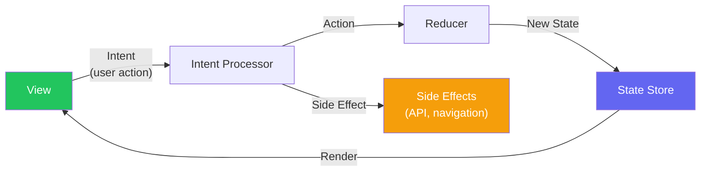
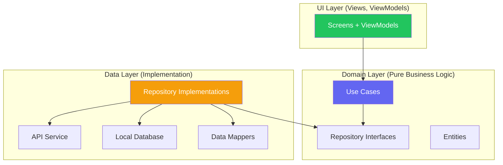
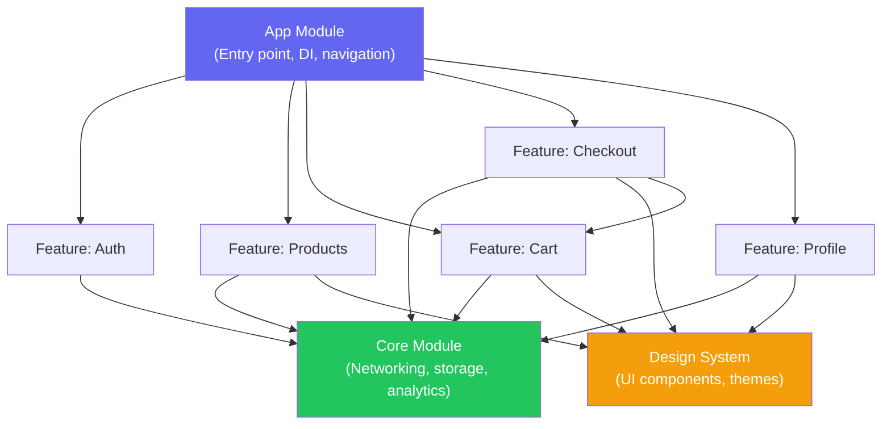

# Mobile Architecture Patterns

::: tip Key Takeaway
- MVVM with unidirectional data flow is the pragmatic default for most mobile apps — it balances testability, readability, and development speed better than MVC (too coupled) or Clean Architecture (too many layers for small teams)
- Modularization is the architecture decision that matters most at scale — feature modules with clear boundaries enable parallel development, faster builds, and independent testing, while a monolithic app module becomes a bottleneck once you exceed 5-6 developers
- Architecture is a team scaling strategy, not a technical purity exercise — choose the simplest pattern that lets your team ship features independently without stepping on each other
:::

Mobile architecture is about organizing code so that it remains testable, navigable, and changeable as the app grows. A solo developer building a simple app does not need Clean Architecture with five layers and dependency injection. A team of 30 building a super-app absolutely does. The right architecture depends on your team size, app complexity, and how fast the codebase is growing.

The wrong architecture decision is expensive because mobile apps cannot be refactored incrementally like web apps. On the web, you can rewrite one page at a time. On mobile, a navigation refactor or state management change touches every screen. Choose wisely early, because changing later costs months.

**Related**: [Mobile State Management](/mobile-engineering/mobile-state-management) | [Mobile Testing](/mobile-engineering/mobile-testing) | [Mobile Engineering Overview](/mobile-engineering/)

---

## Architecture Patterns Overview

```mermaid
graph TD
    subgraph "MVC"
        MV[Model] <-->|"Direct access"| MC[Controller / Activity]
        MC <-->|"Direct access"| MVW[View]
    end

    subgraph "MVVM"
        MM[Model] -->|"Data"| MVM[ViewModel]
        MVM -->|"Observable state"| MVV[View]
        MVV -->|"User actions"| MVM
    end

    subgraph "MVI"
        MI_M[Model] -->|"State"| MI_V[View]
        MI_V -->|"Intent"| MI_P[Processor]
        MI_P -->|"Reduce"| MI_M
    end

    subgraph "Clean Architecture"
        CA_UI[UI Layer] -->|"Uses"| CA_D[Domain Layer]
        CA_D -->|"Defines"| CA_R[Repository Interface]
        CA_DA[Data Layer] -->|"Implements"| CA_R
    end

    style MVC fill:#ef4444,color:#fff
    style MVVM fill:#22c55e,color:#fff
    style MVI fill:#6366f1,color:#fff
```



| Pattern | Testability | Complexity | Learning Curve | Best For |
|---------|------------|-----------|----------------|----------|
| **MVC** | Low | Low | Easy | Prototypes, simple apps |
| **MVP** | High | Medium | Medium | Legacy Android (pre-Compose) |
| **MVVM** | High | Medium | Medium | Most apps (SwiftUI, Compose, RN, Flutter) |
| **MVI** | Highest | High | Steep | Complex state (chat, real-time collaboration) |
| **Clean Architecture** | Highest | High | Steep | Large teams, long-lived apps |
| **TCA** (The Composable Architecture) | Highest | High | Steep | SwiftUI-first iOS apps |

---

## MVVM (Model-View-ViewModel)

MVVM is the dominant architecture for modern mobile apps. The View observes the ViewModel's state reactively. User actions flow from View to ViewModel as method calls. The ViewModel transforms data from the Model layer into display-ready state.

### React Native MVVM

```typescript
// src/features/products/ProductListViewModel.ts
import { useState, useEffect, useCallback } from 'react';
import { ProductRepository } from '../../data/repositories/ProductRepository';
import { Product } from '../../domain/models/Product';

interface ProductListState {
  products: Product[];
  isLoading: boolean;
  error: string | null;
  searchQuery: string;
  selectedCategory: string | null;
}

export function useProductListViewModel(repo: ProductRepository) {
  const [state, setState] = useState<ProductListState>({
    products: [],
    isLoading: true,
    error: null,
    searchQuery: '',
    selectedCategory: null,
  });

  const loadProducts = useCallback(async () => {
    setState((prev) => ({ ...prev, isLoading: true, error: null }));
    try {
      const products = await repo.getProducts({
        search: state.searchQuery || undefined,
        category: state.selectedCategory || undefined,
      });
      setState((prev) => ({ ...prev, products, isLoading: false }));
    } catch (err) {
      setState((prev) => ({
        ...prev,
        isLoading: false,
        error: err instanceof Error ? err.message : 'Failed to load products',
      }));
    }
  }, [state.searchQuery, state.selectedCategory, repo]);

  useEffect(() => {
    loadProducts();
  }, [loadProducts]);

  const setSearchQuery = useCallback((query: string) => {
    setState((prev) => ({ ...prev, searchQuery: query }));
  }, []);

  const setCategory = useCallback((category: string | null) => {
    setState((prev) => ({ ...prev, selectedCategory: category }));
  }, []);

  const retry = useCallback(() => {
    loadProducts();
  }, [loadProducts]);

  return {
    state,
    actions: { setSearchQuery, setCategory, retry },
  };
}

// src/features/products/ProductListScreen.tsx
import { useProductListViewModel } from './ProductListViewModel';
import { productRepository } from '../../data/repositories';

function ProductListScreen() {
  const { state, actions } = useProductListViewModel(productRepository);

  if (state.isLoading) return <LoadingSpinner />;
  if (state.error) {
    return <ErrorView message={state.error} onRetry={actions.retry} />;
  }

  return (
    <View>
      <SearchBar value={state.searchQuery} onChange={actions.setSearchQuery} />
      <CategoryFilter
        selected={state.selectedCategory}
        onSelect={actions.setCategory}
      />
      <FlatList
        data={state.products}
        renderItem={({ item }) => <ProductCard product={item} />}
        keyExtractor={(item) => item.id}
      />
    </View>
  );
}
```

### SwiftUI MVVM

```swift
// ProductListViewModel.swift
import SwiftUI
import Combine

@MainActor
class ProductListViewModel: ObservableObject {
    @Published var products: [Product] = []
    @Published var isLoading = false
    @Published var error: String?
    @Published var searchQuery = ""
    @Published var selectedCategory: String?

    private let repository: ProductRepository
    private var cancellables = Set<AnyCancellable>()

    init(repository: ProductRepository) {
        self.repository = repository

        // React to search query changes with debounce
        $searchQuery
            .debounce(for: .milliseconds(300), scheduler: RunLoop.main)
            .removeDuplicates()
            .sink { [weak self] _ in
                Task { await self?.loadProducts() }
            }
            .store(in: &cancellables)
    }

    func loadProducts() async {
        isLoading = true
        error = nil

        do {
            products = try await repository.getProducts(
                search: searchQuery.isEmpty ? nil : searchQuery,
                category: selectedCategory
            )
        } catch {
            self.error = error.localizedDescription
        }

        isLoading = false
    }

    func selectCategory(_ category: String?) {
        selectedCategory = category
        Task { await loadProducts() }
    }
}

// ProductListView.swift
struct ProductListView: View {
    @StateObject private var viewModel: ProductListViewModel

    init(repository: ProductRepository) {
        _viewModel = StateObject(wrappedValue: ProductListViewModel(repository: repository))
    }

    var body: some View {
        Group {
            if viewModel.isLoading {
                ProgressView()
            } else if let error = viewModel.error {
                ErrorView(message: error) {
                    Task { await viewModel.loadProducts() }
                }
            } else {
                List(viewModel.products) { product in
                    ProductRow(product: product)
                }
                .searchable(text: $viewModel.searchQuery)
            }
        }
        .task {
            await viewModel.loadProducts()
        }
    }
}
```

### Jetpack Compose MVVM

```kotlin
// ProductListViewModel.kt
class ProductListViewModel(
    private val repository: ProductRepository,
    private val savedStateHandle: SavedStateHandle
) : ViewModel() {

    private val _uiState = MutableStateFlow(ProductListUiState())
    val uiState: StateFlow<ProductListUiState> = _uiState.asStateFlow()

    private val searchQuery = savedStateHandle.getStateFlow("search", "")

    init {
        // React to search query changes
        viewModelScope.launch {
            searchQuery
                .debounce(300)
                .distinctUntilChanged()
                .collectLatest { query ->
                    loadProducts(query, _uiState.value.selectedCategory)
                }
        }
    }

    fun onSearchQueryChanged(query: String) {
        savedStateHandle["search"] = query
    }

    fun onCategorySelected(category: String?) {
        _uiState.update { it.copy(selectedCategory = category) }
        viewModelScope.launch {
            loadProducts(searchQuery.value, category)
        }
    }

    fun retry() {
        viewModelScope.launch {
            loadProducts(searchQuery.value, _uiState.value.selectedCategory)
        }
    }

    private suspend fun loadProducts(search: String?, category: String?) {
        _uiState.update { it.copy(isLoading = true, error = null) }

        repository.getProducts(search = search, category = category)
            .onSuccess { products ->
                _uiState.update { it.copy(products = products, isLoading = false) }
            }
            .onFailure { error ->
                _uiState.update { it.copy(error = error.message, isLoading = false) }
            }
    }
}

data class ProductListUiState(
    val products: List<Product> = emptyList(),
    val isLoading: Boolean = true,
    val error: String? = null,
    val searchQuery: String = "",
    val selectedCategory: String? = null
)

// ProductListScreen.kt
@Composable
fun ProductListScreen(viewModel: ProductListViewModel = hiltViewModel()) {
    val uiState by viewModel.uiState.collectAsStateWithLifecycle()

    when {
        uiState.isLoading -> LoadingIndicator()
        uiState.error != null -> ErrorScreen(
            message = uiState.error!!,
            onRetry = viewModel::retry
        )
        else -> {
            Column {
                SearchBar(
                    query = uiState.searchQuery,
                    onQueryChange = viewModel::onSearchQueryChanged
                )
                LazyColumn {
                    items(uiState.products) { product ->
                        ProductCard(product = product)
                    }
                }
            }
        }
    }
}
```

---

## MVI (Model-View-Intent)

MVI enforces unidirectional data flow. All user actions are modeled as Intents, which are processed by a reducer to produce a new State. This makes the state transitions explicit and the entire flow predictable, debuggable, and replayable.



```typescript
// MVI implementation for a chat feature
// This pattern shines in complex, stateful features like chat

// 1. Define all possible states
interface ChatState {
  messages: Message[];
  isLoading: boolean;
  error: string | null;
  inputText: string;
  isTyping: boolean;
  connectionStatus: 'connected' | 'disconnected' | 'reconnecting';
}

// 2. Define all possible intents (user actions + system events)
type ChatIntent =
  | { type: 'LOAD_MESSAGES' }
  | { type: 'SEND_MESSAGE'; text: string }
  | { type: 'SET_INPUT'; text: string }
  | { type: 'MESSAGE_RECEIVED'; message: Message }
  | { type: 'TYPING_INDICATOR'; isTyping: boolean }
  | { type: 'CONNECTION_CHANGED'; status: 'connected' | 'disconnected' | 'reconnecting' }
  | { type: 'DELETE_MESSAGE'; messageId: string }
  | { type: 'RETRY_FAILED_MESSAGE'; messageId: string };

// 3. Pure reducer — no side effects, easily testable
function chatReducer(state: ChatState, intent: ChatIntent): ChatState {
  switch (intent.type) {
    case 'LOAD_MESSAGES':
      return { ...state, isLoading: true, error: null };

    case 'SEND_MESSAGE':
      const optimisticMessage: Message = {
        id: `temp-${Date.now()}`,
        text: intent.text,
        sender: 'me',
        status: 'sending',
        timestamp: Date.now(),
      };
      return {
        ...state,
        messages: [...state.messages, optimisticMessage],
        inputText: '',
      };

    case 'MESSAGE_RECEIVED':
      return {
        ...state,
        messages: [...state.messages, intent.message],
        isLoading: false,
      };

    case 'SET_INPUT':
      return { ...state, inputText: intent.text };

    case 'TYPING_INDICATOR':
      return { ...state, isTyping: intent.isTyping };

    case 'CONNECTION_CHANGED':
      return { ...state, connectionStatus: intent.status };

    case 'DELETE_MESSAGE':
      return {
        ...state,
        messages: state.messages.filter((m) => m.id !== intent.messageId),
      };

    case 'RETRY_FAILED_MESSAGE':
      return {
        ...state,
        messages: state.messages.map((m) =>
          m.id === intent.messageId ? { ...m, status: 'sending' as const } : m
        ),
      };

    default:
      return state;
  }
}

// 4. Side effect handler — separate from reducer
async function handleSideEffects(
  intent: ChatIntent,
  dispatch: (intent: ChatIntent) => void,
  services: { api: ChatApi; ws: WebSocketService }
) {
  switch (intent.type) {
    case 'LOAD_MESSAGES':
      try {
        const messages = await services.api.getMessages();
        messages.forEach((msg) =>
          dispatch({ type: 'MESSAGE_RECEIVED', message: msg })
        );
      } catch (error) {
        // dispatch error intent
      }
      break;

    case 'SEND_MESSAGE':
      try {
        await services.api.sendMessage(intent.text);
      } catch (error) {
        // Mark message as failed
      }
      break;
  }
}
```

---

## Clean Architecture

Clean Architecture separates an app into three layers with strict dependency rules: the inner layers know nothing about the outer layers.



```
src/
├── domain/                    # Pure business logic — no framework imports
│   ├── entities/
│   │   ├── Product.ts
│   │   ├── Order.ts
│   │   └── User.ts
│   ├── repositories/          # Interfaces only
│   │   ├── ProductRepository.ts
│   │   └── OrderRepository.ts
│   └── usecases/
│       ├── GetProductsUseCase.ts
│       ├── PlaceOrderUseCase.ts
│       └── ApplyDiscountUseCase.ts
│
├── data/                      # Implementation of domain interfaces
│   ├── api/
│   │   ├── ApiClient.ts
│   │   ├── ProductApi.ts
│   │   └── OrderApi.ts
│   ├── database/
│   │   ├── ProductDao.ts
│   │   └── OrderDao.ts
│   ├── mappers/
│   │   ├── ProductMapper.ts   # API response → domain entity
│   │   └── OrderMapper.ts
│   └── repositories/
│       ├── ProductRepositoryImpl.ts
│       └── OrderRepositoryImpl.ts
│
├── presentation/              # UI layer
│   ├── screens/
│   │   ├── ProductList/
│   │   │   ├── ProductListScreen.tsx
│   │   │   └── ProductListViewModel.ts
│   │   └── Checkout/
│   │       ├── CheckoutScreen.tsx
│   │       └── CheckoutViewModel.ts
│   └── components/
│       ├── ProductCard.tsx
│       └── ErrorView.tsx
│
└── di/                        # Dependency injection
    └── container.ts
```

```typescript
// domain/usecases/PlaceOrderUseCase.ts
// This use case has ZERO framework imports — pure TypeScript
export class PlaceOrderUseCase {
  constructor(
    private productRepo: ProductRepository,
    private orderRepo: OrderRepository,
    private paymentService: PaymentService
  ) {}

  async execute(params: PlaceOrderParams): Promise<Order> {
    // 1. Validate the cart
    const products = await Promise.all(
      params.items.map((item) => this.productRepo.getById(item.productId))
    );

    const unavailable = products.filter((p) => !p.isAvailable);
    if (unavailable.length > 0) {
      throw new ProductUnavailableError(unavailable.map((p) => p.name));
    }

    // 2. Calculate totals (business logic that should NOT live in a ViewModel)
    const subtotal = params.items.reduce((sum, item) => {
      const product = products.find((p) => p.id === item.productId)!;
      return sum + product.price * item.quantity;
    }, 0);

    const discount = params.promoCode
      ? await this.calculateDiscount(params.promoCode, subtotal)
      : 0;

    const tax = (subtotal - discount) * 0.08;  // 8% tax
    const total = subtotal - discount + tax + params.shippingCost;

    // 3. Process payment
    const paymentResult = await this.paymentService.charge({
      amount: total,
      currency: 'USD',
      paymentMethodId: params.paymentMethodId,
    });

    if (!paymentResult.success) {
      throw new PaymentFailedError(paymentResult.error);
    }

    // 4. Create the order
    return this.orderRepo.create({
      items: params.items,
      subtotal,
      discount,
      tax,
      total,
      paymentId: paymentResult.transactionId,
      shippingAddress: params.shippingAddress,
    });
  }

  private async calculateDiscount(code: string, subtotal: number): Promise<number> {
    // Business rule: promo codes have minimum order amounts
    const promo = await this.orderRepo.getPromoCode(code);
    if (!promo || promo.expired) throw new InvalidPromoError(code);
    if (subtotal < promo.minimumOrder) {
      throw new MinimumOrderError(promo.minimumOrder);
    }
    return promo.type === 'percentage'
      ? subtotal * (promo.value / 100)
      : promo.value;
  }
}
```

---

## Coordinator / Router Pattern

The Coordinator pattern separates navigation logic from screens. Screens do not know about other screens — they report events to the coordinator, which decides where to navigate next. This is critical for deep linking, A/B testing different flows, and reusing screens in different contexts.

```typescript
// src/navigation/coordinators/CheckoutCoordinator.ts
import { NavigationContainerRef } from '@react-navigation/native';

export class CheckoutCoordinator {
  constructor(
    private navigation: NavigationContainerRef<any>,
    private analytics: AnalyticsService,
    private featureFlags: FeatureFlags
  ) {}

  start(cartItems: CartItem[]) {
    this.analytics.trackFunnelStart('checkout');

    if (this.featureFlags.getBoolean('express_checkout_enabled')) {
      // A/B test: skip shipping for saved addresses
      this.navigation.navigate('ExpressCheckout', { items: cartItems });
    } else {
      this.navigation.navigate('ShippingAddress', { items: cartItems });
    }
  }

  onShippingComplete(address: Address, items: CartItem[]) {
    this.analytics.trackFunnelStep('checkout', 'shipping_completed');
    this.navigation.navigate('PaymentMethod', { address, items });
  }

  onPaymentComplete(paymentMethod: PaymentMethod, address: Address, items: CartItem[]) {
    this.analytics.trackFunnelStep('checkout', 'payment_completed');
    this.navigation.navigate('OrderReview', { paymentMethod, address, items });
  }

  onOrderPlaced(order: Order) {
    this.analytics.trackFunnelComplete('checkout', { orderId: order.id });
    // Reset the checkout stack and navigate to confirmation
    this.navigation.reset({
      index: 0,
      routes: [
        { name: 'Home' },
        { name: 'OrderConfirmation', params: { orderId: order.id } },
      ],
    });
  }

  onCancel() {
    this.analytics.trackFunnelAbandon('checkout');
    this.navigation.goBack();
  }
}
```

---

## Modularization

Modularization is the most impactful architecture decision for scaling teams. Instead of one monolithic app module, you split the codebase into feature modules with clear interfaces.



| Module Type | Contains | Can Depend On | Example |
|------------|---------|---------------|---------|
| **App** | Entry point, DI wiring, navigation graph | Everything | `app/` |
| **Feature** | Screens, ViewModels, feature-specific models | Core, Design System, other features (sparingly) | `features/checkout/` |
| **Core** | Networking, storage, analytics, auth | Nothing (or only domain) | `core/` |
| **Design System** | Shared UI components, themes, icons | Nothing | `design-system/` |
| **Domain** | Business entities, interfaces, use cases | Nothing | `domain/` |

### Benefits at Scale

| Metric | Monolith (1 module) | Modularized (10+ modules) |
|--------|-------------------|--------------------------|
| **Build time (incremental)** | Rebuilds everything | Only changed module + dependents |
| **Test isolation** | Run all tests | Run only affected module tests |
| **Team independence** | Merge conflicts, stepping on toes | Parallel development |
| **Code ownership** | Unclear | Module = team |
| **Feature flag kill switch** | Complex | Swap module implementation |

---

## When NOT to Use Heavy Architecture

- **Solo developer, app under 20 screens.** MVVM without formal Clean Architecture layers is plenty. Adding use cases and repository interfaces for a simple app creates unnecessary boilerplate.
- **Prototypes and MVPs.** Speed matters more than structure. Write the simplest code that works, validate the product, then refactor. Many apps die before they need Clean Architecture.
- **Modularization for a 3-person team.** Module boundaries add coordination overhead (API contracts, versioning, CI configuration). A team of 3 can manage a monolithic module with good folder structure.
- **MVI for simple CRUD apps.** The reducer boilerplate in MVI is justified for complex, stateful features (chat, collaborative editing). For a settings screen or a profile page, MVVM is simpler and sufficient.

::: warning Common Misconceptions
**"Clean Architecture means three layers."** Clean Architecture is a principle (dependency rule: inner layers don't know about outer layers), not a specific number of layers. You can have two layers or five layers. The key constraint is that domain logic has no framework dependencies.

**"ViewModels should be thin."** The "thin ViewModel" advice comes from web MVC where controllers were doing too much. In mobile MVVM, the ViewModel is where your presentation logic lives — formatting dates, combining data sources, handling loading states. A ViewModel with 200 lines of presentation logic is fine. What should NOT be in the ViewModel is business logic (calculations, validation rules) — that belongs in use cases or domain services.

**"Modularization requires a mono-repo tool."** You can modularize a mobile app using standard project structure (Gradle modules for Android, Swift packages or Xcode project references for iOS, yarn workspaces for React Native). Tools like Bazel or Tuist help at massive scale (100+ modules) but are overkill for most teams.
:::

---

## Real-World Example: Uber

Uber's rider app is one of the most complex mobile applications in production, with hundreds of engineers contributing to a single codebase. Their architecture evolved through several phases:

1. **2012-2015: Monolithic MVC.** Single massive app module, God ViewControllers with 5,000+ lines. Build times exceeded 20 minutes. Engineers constantly blocked each other.

2. **2016-2018: RIBs Architecture (Router, Interactor, Builder).** Uber created RIBs, an open-source architecture framework that enforces strict module boundaries. Each feature is a "RIB" with its own router (navigation), interactor (business logic), and builder (dependency injection). RIBs compose into a tree that mirrors the app's logical structure.

3. **2019-present: RIBs + modularization.** Feature teams own individual RIBs as separate modules. Build times dropped from 20 minutes to under 5 minutes for incremental builds. Teams can develop, test, and deploy features independently.

Key lessons from Uber's journey:
- They did NOT start with RIBs. They started with MVC and refactored when the pain became unbearable.
- Build time was the forcing function for modularization, not architectural purity.
- The biggest benefit was team independence, not code quality.

Square (now Block) followed a similar trajectory with their Workflow architecture for the Square Point of Sale app.

---

::: details Quiz

**1. What is the main difference between MVVM and MVI?**

In MVVM, the View can call multiple methods on the ViewModel (setSearchQuery, setCategory, retry), and the ViewModel exposes multiple observable properties. In MVI, the View emits typed Intents (sealed classes/discriminated unions), and the state is a single immutable object updated by a pure reducer function. MVI enforces stricter unidirectional data flow — there is exactly one state object and one way to modify it.

**2. Why does the domain layer in Clean Architecture have zero framework dependencies?**

If the domain layer depends on UIKit, SwiftUI, or React Native, it cannot be tested without those frameworks, reused across platforms, or compiled independently. Framework independence means domain logic is pure functions and interfaces that can be tested with simple unit tests, no mocking framework needed. It also means you could theoretically reuse the domain layer if you switched UI frameworks.

**3. When does modularization become worthwhile?**

Modularization becomes worthwhile when: (a) build times are painful (>5 minutes for incremental builds), (b) merge conflicts are frequent because multiple engineers touch the same files, (c) the team exceeds 5-6 developers working on the same app, or (d) you need to enforce code ownership boundaries. Below these thresholds, the overhead of module boundaries, API contracts, and CI configuration outweighs the benefits.

**4. Why did Uber create the RIBs architecture instead of using standard MVVM?**

Standard MVVM does not enforce strict boundaries between features. In a 200-engineer codebase, engineers were importing classes from other features, creating hidden dependencies. RIBs enforces isolation through its builder pattern — a RIB can only access dependencies explicitly provided by its parent builder. This architectural enforcement is what enabled team independence at Uber's scale.

:::

---

::: details Exercise

**Refactor a monolithic e-commerce screen into Clean Architecture layers. Given this all-in-one component, extract domain logic, data access, and presentation into separate layers:**

```typescript
// BEFORE: Everything in one component
function ProductScreen({ productId }) {
  const [product, setProduct] = useState(null);
  const [loading, setLoading] = useState(true);

  useEffect(() => {
    fetch(`https://api.myapp.com/products/${productId}`)
      .then(res => res.json())
      .then(data => {
        setProduct({
          ...data,
          formattedPrice: `$${(data.price_cents / 100).toFixed(2)}`,
          isOnSale: data.discount_percent > 0,
          salePrice: data.discount_percent > 0
            ? `$${(data.price_cents * (1 - data.discount_percent / 100) / 100).toFixed(2)}`
            : null
        });
        setLoading(false);
      });
  }, [productId]);

  return loading ? <Spinner /> : <ProductView product={product} />;
}
```

**Solution:**

```typescript
// 1. DOMAIN LAYER — pure business logic, zero imports

// domain/entities/Product.ts
export interface Product {
  id: string;
  name: string;
  priceCents: number;
  discountPercent: number;
  imageUrl: string;
  category: string;
}

// domain/repositories/ProductRepository.ts
export interface ProductRepository {
  getById(id: string): Promise<Product>;
}

// domain/usecases/GetProductUseCase.ts
export class GetProductUseCase {
  constructor(private repo: ProductRepository) {}

  async execute(id: string): Promise<Product> {
    const product = await this.repo.getById(id);
    if (!product) throw new Error(`Product ${id} not found`);
    return product;
  }
}

// domain/utils/pricing.ts
export function calculateSalePrice(priceCents: number, discountPercent: number): number {
  return Math.round(priceCents * (1 - discountPercent / 100));
}

export function formatCents(cents: number): string {
  return `$${(cents / 100).toFixed(2)}`;
}

export function isOnSale(discountPercent: number): boolean {
  return discountPercent > 0;
}


// 2. DATA LAYER — API implementation

// data/api/ProductApi.ts
interface ProductApiResponse {
  id: string;
  name: string;
  price_cents: number;      // snake_case from API
  discount_percent: number;
  image_url: string;
  category: string;
}

// data/mappers/ProductMapper.ts
import { Product } from '../../domain/entities/Product';

export function mapApiToProduct(response: ProductApiResponse): Product {
  return {
    id: response.id,
    name: response.name,
    priceCents: response.price_cents,
    discountPercent: response.discount_percent,
    imageUrl: response.image_url,
    category: response.category,
  };
}

// data/repositories/ProductRepositoryImpl.ts
import { ProductRepository } from '../../domain/repositories/ProductRepository';
import { mapApiToProduct } from '../mappers/ProductMapper';

export class ProductRepositoryImpl implements ProductRepository {
  constructor(private apiClient: ApiClient) {}

  async getById(id: string): Promise<Product> {
    const response = await this.apiClient.get(`/products/${id}`);
    return mapApiToProduct(response);
  }
}


// 3. PRESENTATION LAYER — ViewModel + View

// presentation/ProductViewModel.ts
import { GetProductUseCase } from '../../domain/usecases/GetProductUseCase';
import { formatCents, calculateSalePrice, isOnSale } from '../../domain/utils/pricing';

interface ProductViewState {
  name: string;
  formattedPrice: string;
  isOnSale: boolean;
  salePrice: string | null;
  imageUrl: string;
  isLoading: boolean;
  error: string | null;
}

export function useProductViewModel(productId: string, useCase: GetProductUseCase) {
  const [state, setState] = useState<ProductViewState>({
    name: '', formattedPrice: '', isOnSale: false,
    salePrice: null, imageUrl: '', isLoading: true, error: null,
  });

  useEffect(() => {
    useCase.execute(productId)
      .then((product) => {
        setState({
          name: product.name,
          formattedPrice: formatCents(product.priceCents),
          isOnSale: isOnSale(product.discountPercent),
          salePrice: isOnSale(product.discountPercent)
            ? formatCents(calculateSalePrice(product.priceCents, product.discountPercent))
            : null,
          imageUrl: product.imageUrl,
          isLoading: false,
          error: null,
        });
      })
      .catch((err) => {
        setState((prev) => ({ ...prev, isLoading: false, error: err.message }));
      });
  }, [productId]);

  return state;
}

// presentation/ProductScreen.tsx
function ProductScreen({ productId }: { productId: string }) {
  const state = useProductViewModel(productId, getProductUseCase);

  if (state.isLoading) return <Spinner />;
  if (state.error) return <ErrorView message={state.error} />;
  return <ProductView {...state} />;
}
```

Key improvements:
- Business logic (pricing calculations) is in the domain layer with no framework dependencies — easily unit testable
- API response mapping is isolated — if the API response shape changes, only the mapper changes
- The ViewModel contains presentation logic only — formatting, combining state
- The View is a pure function of state — zero logic

:::

---

> *"Architecture is not about making the code pretty. It is about making it possible for the next engineer to understand what you built, change it without breaking it, and ship their feature without waiting for you."*
