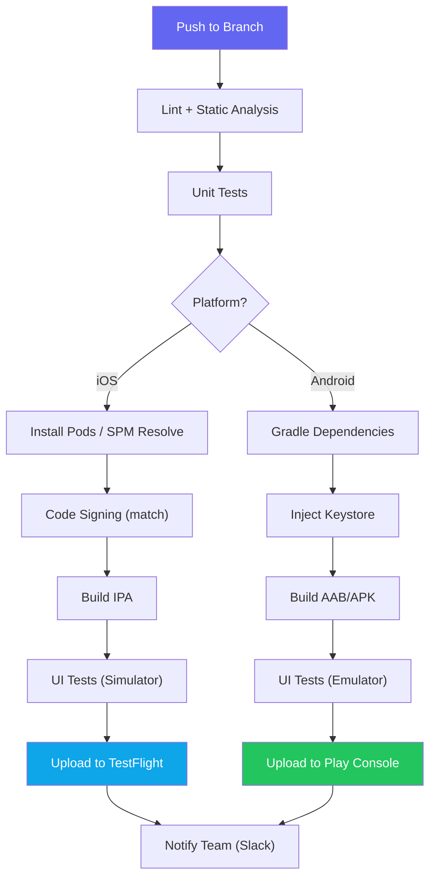
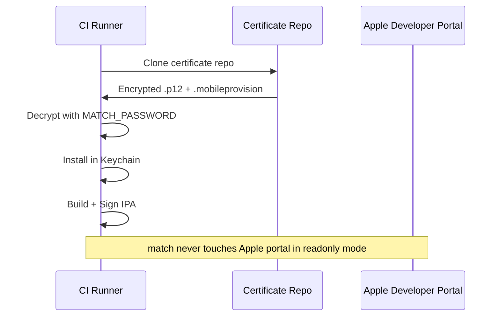
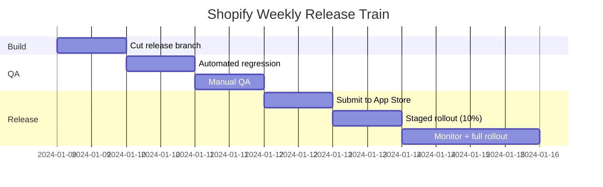
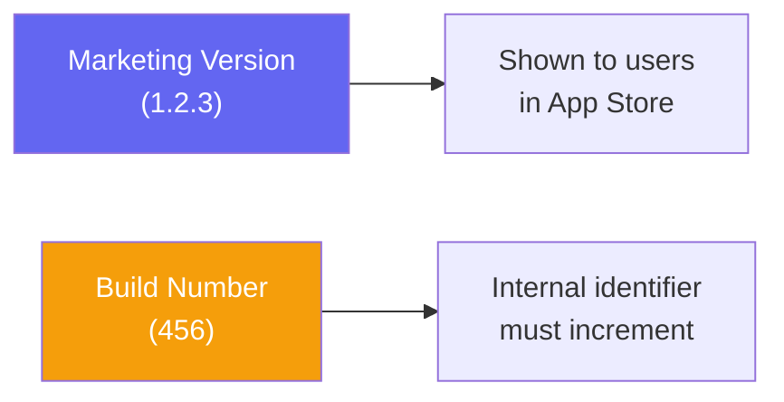

# Mobile CI/CD

::: tip Key Takeaway
- Mobile CI/CD is fundamentally harder than web CI/CD because of code signing, platform-specific build tools, and app store review gates that cannot be bypassed
- Fastlane remains the most battle-tested tool for automating iOS and Android builds, signing, screenshots, and distribution — use it even if your CI is GitHub Actions or Bitrise
- Code signing is the single biggest source of CI failures in mobile — automate it with `match` (iOS) and environment-variable-injected keystores (Android) from day one
:::

Mobile CI/CD is where every mobile team eventually hits a wall. Your build works on your machine but fails in CI because a provisioning profile expired, a certificate was revoked, or the Gradle daemon ran out of memory on an undersized runner. Web developers push to main and see their changes live in seconds. Mobile developers push to main and wait 25 minutes for a build, then wait 24 hours for App Store review.

The complexity is real: iOS builds require macOS runners (you cannot build an IPA on Linux), code signing involves cryptographic certificates that expire and must be synchronized across developers and CI machines, and Android keystores must be kept secret because losing your upload key means losing your app listing forever.

**Related**: [Mobile Testing](/mobile-engineering/mobile-testing) | [Mobile Deployment](/mobile-engineering/mobile-deployment) | [Mobile Engineering Overview](/mobile-engineering/)

---

## The Mobile Build Pipeline



| Stage | iOS Time | Android Time | Common Failures |
|-------|----------|-------------|-----------------|
| **Dependency install** | 2-5 min (CocoaPods) | 1-3 min (Gradle) | Network timeouts, version conflicts |
| **Code signing** | 30s-2 min | 10s | Expired certs, wrong profile, missing keystore |
| **Build** | 5-15 min | 3-10 min | OOM, Swift compiler timeout, Gradle daemon crash |
| **Unit tests** | 1-5 min | 1-5 min | Flaky async tests |
| **UI tests** | 10-30 min | 10-30 min | Simulator boot failure, test flakiness |
| **Upload** | 2-5 min | 1-3 min | API token expired, network timeout |
| **Total** | 20-60 min | 15-50 min | — |

---

## Fastlane: The Foundation

Fastlane is the standard automation toolkit for mobile builds. It handles code signing, building, testing, screenshots, and distribution. Even if you use GitHub Actions or Bitrise as your CI runner, Fastlane should be doing the actual work inside those runners.

### Fastlane Setup

```ruby
# Gemfile
source "https://rubygems.org"

gem "fastlane", "~> 2.220"
gem "cocoapods", "~> 1.15"

# Plugins
plugins_path = File.join(File.dirname(__FILE__), 'fastlane', 'Pluginfile')
eval_gemfile(plugins_path) if File.exist?(plugins_path)
```

```ruby
# fastlane/Pluginfile
gem 'fastlane-plugin-firebase_app_distribution'
gem 'fastlane-plugin-versioning'
```

### iOS Fastfile

```ruby
# fastlane/Fastfile
default_platform(:ios)

platform :ios do
  before_all do
    setup_ci if ENV['CI']
  end

  desc "Run unit tests"
  lane :test do
    scan(
      project: "MyApp.xcodeproj",
      scheme: "MyApp",
      device: "iPhone 15",
      clean: true,
      code_coverage: true,
      output_directory: "./test_results",
      result_bundle: true
    )
  end

  desc "Build and upload to TestFlight"
  lane :beta do
    # Sync code signing certificates
    match(
      type: "appstore",
      app_identifier: "com.company.myapp",
      readonly: is_ci
    )

    # Increment build number using CI build number
    increment_build_number(
      build_number: ENV['GITHUB_RUN_NUMBER'] || latest_testflight_build_number + 1
    )

    # Build the IPA
    build_app(
      project: "MyApp.xcodeproj",
      scheme: "MyApp",
      configuration: "Release",
      export_method: "app-store",
      export_options: {
        provisioningProfiles: {
          "com.company.myapp" => "match AppStore com.company.myapp"
        }
      }
    )

    # Upload to TestFlight
    upload_to_testflight(
      skip_waiting_for_build_processing: true,
      apple_id: "1234567890"
    )

    # Notify the team
    slack(
      message: "New iOS beta uploaded to TestFlight!",
      slack_url: ENV['SLACK_WEBHOOK_URL'],
      payload: {
        "Build Number" => get_build_number,
        "Version" => get_version_number,
        "Git Commit" => last_git_commit[:abbreviated_commit_hash]
      }
    )
  end

  desc "Deploy to App Store"
  lane :release do
    match(type: "appstore", readonly: true)

    build_app(
      project: "MyApp.xcodeproj",
      scheme: "MyApp",
      configuration: "Release",
      export_method: "app-store"
    )

    upload_to_app_store(
      submit_for_review: true,
      automatic_release: false,
      phased_release: true,
      submission_information: {
        add_id_info_uses_idfa: false
      },
      precheck_include_in_app_purchases: false
    )
  end

  desc "Upload dSYMs to Crashlytics"
  lane :upload_symbols do
    download_dsyms(version: "latest")
    upload_symbols_to_crashlytics
    clean_build_artifacts
  end
end
```

### Android Fastfile

```ruby
platform :android do
  desc "Run unit tests"
  lane :test do
    gradle(
      task: "testReleaseUnitTest",
      flags: "--no-daemon --max-workers=2"
    )
  end

  desc "Build and upload to Play Console internal track"
  lane :beta do
    # Increment version code
    android_set_version_code(
      version_code: ENV['GITHUB_RUN_NUMBER'].to_i
    )

    # Build the AAB (Android App Bundle)
    gradle(
      task: "bundleRelease",
      properties: {
        "android.injected.signing.store.file" => ENV['KEYSTORE_PATH'],
        "android.injected.signing.store.password" => ENV['KEYSTORE_PASSWORD'],
        "android.injected.signing.key.alias" => ENV['KEY_ALIAS'],
        "android.injected.signing.key.password" => ENV['KEY_PASSWORD']
      }
    )

    # Upload to Play Console internal testing track
    upload_to_play_store(
      track: "internal",
      aab: lane_context[SharedValues::GRADLE_AAB_OUTPUT_PATH],
      json_key: ENV['PLAY_STORE_JSON_KEY'],
      skip_upload_metadata: true,
      skip_upload_images: true,
      skip_upload_screenshots: true
    )
  end

  desc "Promote internal to production with staged rollout"
  lane :release do
    upload_to_play_store(
      track: "internal",
      track_promote_to: "production",
      rollout: "0.1",  # Start at 10%
      json_key: ENV['PLAY_STORE_JSON_KEY']
    )
  end
end
```

---

## Code Signing Automation

Code signing is the hardest part of mobile CI/CD. Here is how to automate it properly on both platforms.

### iOS: Fastlane Match

Match stores your certificates and provisioning profiles in a private Git repository (or Google Cloud Storage / S3) and syncs them across all developers and CI machines. This eliminates the "it works on my machine" problem.

```ruby
# fastlane/Matchfile
git_url("https://github.com/company/ios-certificates.git")
storage_mode("git")

type("appstore")
app_identifier(["com.company.myapp", "com.company.myapp.widgets"])
username("ci@company.com")

# For CI environments
readonly(true) if ENV['CI']
```

```bash
# Initial setup — run once on a developer machine
fastlane match init
fastlane match development
fastlane match appstore

# On CI — read-only mode
fastlane match appstore --readonly
```



### Android: Keystore Management

```yaml
# .github/workflows/android.yml (excerpt)
- name: Decode Keystore
  run: |
    echo "$KEYSTORE_BASE64" | base64 --decode > $RUNNER_TEMP/release.keystore
  env:
    KEYSTORE_BASE64: ${{ secrets.KEYSTORE_BASE64 }}

- name: Build Release AAB
  run: |
    ./gradlew bundleRelease \
      -Pandroid.injected.signing.store.file=$RUNNER_TEMP/release.keystore \
      -Pandroid.injected.signing.store.password=${{ secrets.KEYSTORE_PASSWORD }} \
      -Pandroid.injected.signing.key.alias=${{ secrets.KEY_ALIAS }} \
      -Pandroid.injected.signing.key.password=${{ secrets.KEY_PASSWORD }}
```

::: danger Never Commit Your Keystore
If you lose your Android upload keystore, you lose the ability to update your app on the Play Store. Google introduced Play App Signing to mitigate this — Google holds the app signing key and you hold an upload key. If you lose the upload key, Google support can help you reset it. **Always enroll in Play App Signing.**
:::

---

## GitHub Actions for Mobile

### iOS Workflow

```yaml
# .github/workflows/ios.yml
name: iOS Build & Deploy

on:
  push:
    branches: [main, develop]
  pull_request:
    branches: [main]

concurrency:
  group: ios-${{ github.ref }}
  cancel-in-progress: true

env:
  DEVELOPER_DIR: /Applications/Xcode_15.2.app/Contents/Developer

jobs:
  test:
    runs-on: macos-14  # M1 runner — 2-3x faster than Intel
    timeout-minutes: 30
    steps:
      - uses: actions/checkout@v4

      - name: Cache CocoaPods
        uses: actions/cache@v4
        with:
          path: Pods
          key: pods-${{ hashFiles('Podfile.lock') }}

      - name: Cache DerivedData
        uses: actions/cache@v4
        with:
          path: ~/Library/Developer/Xcode/DerivedData
          key: derived-${{ hashFiles('**/*.swift', '**/*.xcodeproj/**') }}

      - name: Install Dependencies
        run: |
          bundle install
          bundle exec pod install

      - name: Run Tests
        run: bundle exec fastlane ios test

      - name: Upload Test Results
        if: always()
        uses: actions/upload-artifact@v4
        with:
          name: test-results
          path: test_results/

  deploy-testflight:
    needs: test
    if: github.ref == 'refs/heads/main'
    runs-on: macos-14
    timeout-minutes: 45
    steps:
      - uses: actions/checkout@v4

      - name: Install Dependencies
        run: |
          bundle install
          bundle exec pod install

      - name: Setup SSH for Match
        uses: webfactory/ssh-agent@v0.9.0
        with:
          ssh-private-key: ${{ secrets.MATCH_DEPLOY_KEY }}

      - name: Deploy to TestFlight
        run: bundle exec fastlane ios beta
        env:
          MATCH_PASSWORD: ${{ secrets.MATCH_PASSWORD }}
          APP_STORE_CONNECT_API_KEY_ID: ${{ secrets.ASC_KEY_ID }}
          APP_STORE_CONNECT_API_ISSUER_ID: ${{ secrets.ASC_ISSUER_ID }}
          APP_STORE_CONNECT_API_KEY: ${{ secrets.ASC_API_KEY }}
          SLACK_WEBHOOK_URL: ${{ secrets.SLACK_WEBHOOK_URL }}
```

### Android Workflow

```yaml
# .github/workflows/android.yml
name: Android Build & Deploy

on:
  push:
    branches: [main, develop]
  pull_request:
    branches: [main]

concurrency:
  group: android-${{ github.ref }}
  cancel-in-progress: true

jobs:
  test:
    runs-on: ubuntu-latest
    timeout-minutes: 20
    steps:
      - uses: actions/checkout@v4

      - name: Set up JDK 17
        uses: actions/setup-java@v4
        with:
          distribution: 'temurin'
          java-version: '17'

      - name: Cache Gradle
        uses: actions/cache@v4
        with:
          path: |
            ~/.gradle/caches
            ~/.gradle/wrapper
          key: gradle-${{ hashFiles('**/*.gradle*', '**/gradle-wrapper.properties') }}

      - name: Run Unit Tests
        run: ./gradlew testReleaseUnitTest --no-daemon

      - name: Run Lint
        run: ./gradlew lintRelease --no-daemon

      - name: Upload Reports
        if: always()
        uses: actions/upload-artifact@v4
        with:
          name: reports
          path: app/build/reports/

  deploy-internal:
    needs: test
    if: github.ref == 'refs/heads/main'
    runs-on: ubuntu-latest
    timeout-minutes: 30
    steps:
      - uses: actions/checkout@v4

      - name: Set up JDK 17
        uses: actions/setup-java@v4
        with:
          distribution: 'temurin'
          java-version: '17'

      - name: Decode Keystore
        run: echo "${{ secrets.KEYSTORE_BASE64 }}" | base64 -d > $RUNNER_TEMP/release.keystore

      - name: Create Play Store Key
        run: echo '${{ secrets.PLAY_STORE_JSON_KEY }}' > $RUNNER_TEMP/play-key.json

      - name: Deploy to Internal Track
        run: bundle exec fastlane android beta
        env:
          KEYSTORE_PATH: ${{ runner.temp }}/release.keystore
          KEYSTORE_PASSWORD: ${{ secrets.KEYSTORE_PASSWORD }}
          KEY_ALIAS: ${{ secrets.KEY_ALIAS }}
          KEY_PASSWORD: ${{ secrets.KEY_PASSWORD }}
          PLAY_STORE_JSON_KEY: ${{ runner.temp }}/play-key.json
```

### React Native Workflow

```yaml
# .github/workflows/react-native.yml
name: React Native CI

on:
  push:
    branches: [main, develop]
  pull_request:

jobs:
  js-checks:
    runs-on: ubuntu-latest
    timeout-minutes: 10
    steps:
      - uses: actions/checkout@v4
      - uses: actions/setup-node@v4
        with:
          node-version: 20
          cache: 'yarn'

      - run: yarn install --frozen-lockfile
      - run: yarn lint
      - run: yarn typecheck
      - run: yarn test --coverage

  ios:
    needs: js-checks
    runs-on: macos-14
    timeout-minutes: 45
    steps:
      - uses: actions/checkout@v4
      - uses: actions/setup-node@v4
        with:
          node-version: 20
          cache: 'yarn'

      - run: yarn install --frozen-lockfile

      - name: Cache Pods
        uses: actions/cache@v4
        with:
          path: ios/Pods
          key: pods-${{ hashFiles('ios/Podfile.lock') }}

      - run: cd ios && pod install

      - name: Build iOS
        run: bundle exec fastlane ios beta
        env:
          MATCH_PASSWORD: ${{ secrets.MATCH_PASSWORD }}

  android:
    needs: js-checks
    runs-on: ubuntu-latest
    timeout-minutes: 30
    steps:
      - uses: actions/checkout@v4
      - uses: actions/setup-node@v4
        with:
          node-version: 20
          cache: 'yarn'
      - uses: actions/setup-java@v4
        with:
          distribution: 'temurin'
          java-version: '17'

      - run: yarn install --frozen-lockfile
      - run: bundle exec fastlane android beta
        env:
          KEYSTORE_PATH: ${{ runner.temp }}/release.keystore
```

---

## Bitrise Configuration

Bitrise is a mobile-first CI/CD platform used by companies like Buffer, Virgin Atlantic, and Grindr. It provides macOS build machines, code signing management, and mobile-specific steps out of the box.

```yaml
# bitrise.yml
format_version: "13"
default_step_lib_source: https://github.com/bitrise-io/bitrise-steplib.git

workflows:
  deploy-ios:
    steps:
      - activate-ssh-key:
          run_if: '{{getenv "SSH_RSA_PRIVATE_KEY" | ne ""}}'
      - git-clone: {}
      - cache-pull: {}

      - cocoapods-install:
          inputs:
            - podfile_path: ios/Podfile

      - certificate-and-profile-installer: {}

      - xcode-build-for-test:
          inputs:
            - project_path: ios/MyApp.xcworkspace
            - scheme: MyApp

      - xcode-test:
          inputs:
            - project_path: ios/MyApp.xcworkspace
            - scheme: MyApp
            - simulator_device: iPhone 15

      - xcode-archive:
          inputs:
            - project_path: ios/MyApp.xcworkspace
            - scheme: MyApp
            - export_method: app-store

      - deploy-to-itunesconnect-deliver:
          inputs:
            - ipa_path: "$BITRISE_IPA_PATH"

      - cache-push:
          inputs:
            - cache_paths: |
                ios/Pods
                ~/Library/Developer/Xcode/DerivedData

      - slack:
          inputs:
            - webhook_url: "$SLACK_WEBHOOK"
            - channel: "#mobile-releases"
```

---

## Build Caching Strategies

Build caching is critical for mobile CI because builds are slow. A cold React Native iOS build can take 30+ minutes. With proper caching, you can cut that to 10-15 minutes.

| Cache Target | Key | Typical Size | Time Saved |
|-------------|-----|-------------|------------|
| **CocoaPods** | `Podfile.lock` hash | 200-500 MB | 2-5 min |
| **Gradle** | `*.gradle*` + wrapper hash | 300-800 MB | 1-3 min |
| **DerivedData** (Xcode) | Swift source hash | 1-5 GB | 5-15 min |
| **node_modules** | lockfile hash | 200-500 MB | 1-2 min |
| **Carthage** | `Cartfile.resolved` hash | 100-300 MB | 3-10 min |
| **SPM** | `Package.resolved` hash | 100-500 MB | 1-5 min |

```yaml
# Effective Gradle caching in GitHub Actions
- name: Cache Gradle
  uses: actions/cache@v4
  with:
    path: |
      ~/.gradle/caches
      ~/.gradle/wrapper
      ~/.gradle/configuration-cache
    key: gradle-${{ runner.os }}-${{ hashFiles('**/*.gradle*', '**/gradle-wrapper.properties', '**/buildSrc/**') }}
    restore-keys: |
      gradle-${{ runner.os }}-

# Gradle build with caching flags
- name: Build
  run: |
    ./gradlew assembleRelease \
      --build-cache \
      --configuration-cache \
      --parallel \
      --no-daemon \
      --max-workers=2 \
      -Dorg.gradle.jvmargs="-Xmx4g -XX:+UseParallelGC"
```

::: warning DerivedData Cache Invalidation
Caching Xcode's DerivedData directory is powerful but fragile. Xcode uses content hashing internally, and a stale DerivedData cache can cause bizarre build failures that work locally but fail in CI. If you see unexplainable build errors, clear the DerivedData cache first. Some teams skip DerivedData caching entirely and rely only on CocoaPods/SPM caching.
:::

---

## App Store Connect API

Apple introduced the App Store Connect API (JWT-based) to replace the old session-based authentication. This is essential for CI because session cookies expire and require manual 2FA re-authentication.

```ruby
# fastlane/Appfile
app_identifier("com.company.myapp")

# Use API Key instead of Apple ID + password
# This never expires and doesn't require 2FA
json_key_file = ENV['APP_STORE_CONNECT_API_KEY_PATH']
```

```ruby
# Generate an App Store Connect API Key:
# 1. Go to App Store Connect > Users and Access > Keys
# 2. Generate a new key with "App Manager" role
# 3. Download the .p8 file (you can only download it ONCE)
# 4. Note the Key ID and Issuer ID

# In Fastfile:
lane :beta do
  api_key = app_store_connect_api_key(
    key_id: ENV['ASC_KEY_ID'],
    issuer_id: ENV['ASC_ISSUER_ID'],
    key_content: ENV['ASC_API_KEY'],      # Base64 .p8 contents
    is_key_content_base64: true,
    in_house: false
  )

  pilot(
    api_key: api_key,
    ipa: "./build/MyApp.ipa",
    skip_waiting_for_build_processing: true
  )
end
```

---

## Real-World Pipeline: Shopify

Shopify's mobile team (Shop app, Shopify POS, Shopify Inbox) runs one of the largest mobile CI/CD operations in the industry. Key aspects of their approach:

1. **Trunk-based development** — all mobile engineers merge to main daily, with feature flags controlling what users see
2. **Automated releases on a train schedule** — a new build is cut every Tuesday, tested Wednesday-Thursday, submitted Friday
3. **Tophat builds** — every PR generates installable builds (via Firebase App Distribution) so reviewers can test changes on real devices
4. **Merge queues** — PRs enter a merge queue that runs full CI before merging, preventing broken main
5. **Build time monitoring** — they track P50 and P95 build times and have an SLO of under 15 minutes for PR checks



Airbnb, Uber, and Lyft use similar release train models, though Uber releases twice per week for their rider app.

---

## When NOT to Use Complex CI/CD

Not every mobile project needs a sophisticated pipeline. You are over-engineering if:

- **You are a solo developer or a team of 2-3.** Manual builds from Xcode/Android Studio and direct TestFlight uploads are fine. The overhead of maintaining CI configuration exceeds the time saved.
- **Your app changes infrequently.** If you release once a month, a manual process is perfectly reasonable.
- **You are in the prototype phase.** Do not spend a week setting up CI before you have validated the product idea. Ship manually, learn, then automate.
- **Your CI budget is zero.** macOS runners are expensive ($0.08/min on GitHub Actions, vs $0.008/min for Linux). If your iOS build takes 30 minutes, that is $2.40 per build. At 10 builds per day, you are spending $500/month just on iOS CI.

::: warning Common Misconceptions
**"CI/CD means zero manual steps."** In practice, every mobile team has manual steps. App Store review is manual. Setting up new test devices for ad-hoc distribution is manual. Responding to app review rejections is manual. The goal is to automate the repetitive, error-prone parts (building, signing, uploading) not to achieve full automation.

**"We need E2E tests in CI to be safe."** E2E tests in mobile CI are expensive, slow, and flaky. Many successful apps (Spotify, Shopify) rely primarily on unit tests and integration tests in CI, with E2E tests running on a separate schedule or only before releases.

**"Fastlane is the only option."** Fastlane is the most popular, but `xcodebuild` and `gradle` CLI commands work fine for simple setups. Bitrise, AppCenter (deprecated), and Codemagic have their own abstractions. Use what your team can maintain.
:::

---

## Versioning Strategy



```ruby
# Automated versioning in Fastlane
lane :bump_version do |options|
  bump_type = options[:type] || "patch"  # major, minor, patch

  # iOS
  increment_version_number(bump_type: bump_type)
  increment_build_number(
    build_number: ENV['CI_BUILD_NUMBER'] || latest_testflight_build_number + 1
  )

  # Commit the version bump
  commit_version_bump(
    message: "chore: bump version to #{get_version_number} (#{get_build_number})",
    force: true
  )
end
```

| Strategy | Approach | Used By |
|----------|---------|---------|
| **CI build number** | Build number = CI run number | Most teams |
| **Git commit count** | Build number = `git rev-list --count HEAD` | Simple, monotonic |
| **Timestamp** | Build number = `yyyyMMddHHmm` | Avoids conflicts |
| **CalVer** | Version = `2024.01.3` (year.week.build) | Spotify, some Google apps |
| **SemVer** | Version = `major.minor.patch` | Most common for user-facing version |

---

## Monitoring Build Health

Track these metrics to keep your CI healthy:

| Metric | Target | Red Flag |
|--------|--------|----------|
| **PR check time** | < 15 min | > 25 min |
| **Full build time** | < 30 min | > 45 min |
| **Flaky test rate** | < 2% | > 5% |
| **CI success rate** | > 95% | < 90% |
| **Time to deploy** (merge to TestFlight) | < 1 hour | > 3 hours |

```typescript
// Example: Build metrics webhook handler
interface BuildMetric {
  workflow: string;
  platform: 'ios' | 'android';
  duration_seconds: number;
  status: 'success' | 'failure';
  commit_sha: string;
  branch: string;
  failure_reason?: string;
}

// Track in your observability platform (Datadog, Grafana)
async function recordBuildMetric(metric: BuildMetric) {
  await fetch('https://api.datadoghq.com/api/v2/series', {
    method: 'POST',
    headers: {
      'DD-API-KEY': process.env.DD_API_KEY!,
      'Content-Type': 'application/json',
    },
    body: JSON.stringify({
      series: [{
        metric: 'mobile.ci.build_duration',
        type: 'gauge',
        points: [{ timestamp: Math.floor(Date.now() / 1000), value: metric.duration_seconds }],
        tags: [
          `platform:${metric.platform}`,
          `workflow:${metric.workflow}`,
          `status:${metric.status}`,
          `branch:${metric.branch}`,
        ],
      }],
    }),
  });
}
```

---

::: details Quiz

**1. Why can't you build iOS apps on Linux CI runners?**

iOS apps must be compiled with Xcode, which only runs on macOS. The Apple toolchain (Swift compiler, code signing tools, `xcodebuild`) is macOS-exclusive. This is why iOS CI requires macOS runners, which are significantly more expensive than Linux runners.

**2. What is the purpose of Fastlane Match?**

Match stores iOS code signing certificates and provisioning profiles in a shared repository (Git, S3, or GCS) so that all developers and CI machines use the same credentials. It eliminates code signing conflicts and the "it works on my machine" problem. In CI, it runs in `readonly` mode to avoid accidentally revoking certificates.

**3. Why should you enroll in Google Play App Signing?**

If you lose your Android app signing keystore and are NOT enrolled in Play App Signing, you permanently lose the ability to update your app. With Play App Signing, Google holds the app signing key and you use an upload key. If you lose the upload key, Google can reset it. This is a one-way safety net.

**4. What is a release train, and why do large mobile teams use it?**

A release train is a fixed-schedule release cadence (e.g., every Tuesday). It decouples "code is ready" from "code ships." Feature flags control what users see, and the train goes out on schedule regardless of which features are complete. This reduces coordination overhead, makes releases predictable, and forces the team to keep main always releasable.

**5. Why is DerivedData caching risky in iOS CI?**

Xcode's DerivedData contains incremental build artifacts with content-based hashes. A stale cache can cause build failures that don't reproduce locally because the cache has artifacts from a different branch or Xcode version. Many teams skip DerivedData caching and only cache CocoaPods/SPM dependencies.

:::

---

::: details Exercise

**Build a GitHub Actions workflow for a React Native app that:**

1. Runs JS lint, typecheck, and unit tests on every PR (Linux runner)
2. On merge to `main`, builds both iOS and Android
3. Uploads iOS to TestFlight and Android to Play Console internal track
4. Sends a Slack notification on success or failure
5. Caches `node_modules`, CocoaPods, and Gradle dependencies

**Solution:**

```yaml
name: React Native CI/CD

on:
  push:
    branches: [main]
  pull_request:
    branches: [main]

concurrency:
  group: ${{ github.workflow }}-${{ github.ref }}
  cancel-in-progress: true

jobs:
  js-checks:
    runs-on: ubuntu-latest
    timeout-minutes: 10
    steps:
      - uses: actions/checkout@v4
      - uses: actions/setup-node@v4
        with:
          node-version: 20
          cache: 'yarn'
      - run: yarn install --frozen-lockfile
      - run: yarn lint
      - run: yarn typecheck
      - run: yarn test --coverage --forceExit

  build-ios:
    needs: js-checks
    if: github.event_name == 'push' && github.ref == 'refs/heads/main'
    runs-on: macos-14
    timeout-minutes: 45
    steps:
      - uses: actions/checkout@v4
      - uses: actions/setup-node@v4
        with:
          node-version: 20
          cache: 'yarn'
      - uses: ruby/setup-ruby@v1
        with:
          ruby-version: '3.2'
          bundler-cache: true

      - run: yarn install --frozen-lockfile

      - name: Cache Pods
        uses: actions/cache@v4
        with:
          path: ios/Pods
          key: pods-${{ hashFiles('ios/Podfile.lock') }}

      - run: cd ios && bundle exec pod install

      - name: Setup SSH for Match
        uses: webfactory/ssh-agent@v0.9.0
        with:
          ssh-private-key: ${{ secrets.MATCH_DEPLOY_KEY }}

      - name: Build and Upload to TestFlight
        run: bundle exec fastlane ios beta
        env:
          MATCH_PASSWORD: ${{ secrets.MATCH_PASSWORD }}
          ASC_KEY_ID: ${{ secrets.ASC_KEY_ID }}
          ASC_ISSUER_ID: ${{ secrets.ASC_ISSUER_ID }}
          ASC_API_KEY: ${{ secrets.ASC_API_KEY }}

      - name: Notify Slack (Success)
        if: success()
        run: |
          curl -X POST "$SLACK_WEBHOOK" \
            -H 'Content-Type: application/json' \
            -d '{"text":"iOS build deployed to TestFlight from commit ${{ github.sha }}"}'
        env:
          SLACK_WEBHOOK: ${{ secrets.SLACK_WEBHOOK_URL }}

      - name: Notify Slack (Failure)
        if: failure()
        run: |
          curl -X POST "$SLACK_WEBHOOK" \
            -H 'Content-Type: application/json' \
            -d '{"text":"iOS build FAILED. Check: ${{ github.server_url }}/${{ github.repository }}/actions/runs/${{ github.run_id }}"}'
        env:
          SLACK_WEBHOOK: ${{ secrets.SLACK_WEBHOOK_URL }}

  build-android:
    needs: js-checks
    if: github.event_name == 'push' && github.ref == 'refs/heads/main'
    runs-on: ubuntu-latest
    timeout-minutes: 30
    steps:
      - uses: actions/checkout@v4
      - uses: actions/setup-node@v4
        with:
          node-version: 20
          cache: 'yarn'
      - uses: actions/setup-java@v4
        with:
          distribution: 'temurin'
          java-version: '17'
      - uses: ruby/setup-ruby@v1
        with:
          ruby-version: '3.2'
          bundler-cache: true

      - run: yarn install --frozen-lockfile

      - name: Cache Gradle
        uses: actions/cache@v4
        with:
          path: |
            ~/.gradle/caches
            ~/.gradle/wrapper
          key: gradle-${{ hashFiles('android/**/*.gradle*', 'android/gradle-wrapper.properties') }}

      - name: Decode Keystore
        run: echo "${{ secrets.KEYSTORE_BASE64 }}" | base64 -d > $RUNNER_TEMP/release.keystore

      - name: Build and Upload to Play Console
        run: bundle exec fastlane android beta
        env:
          KEYSTORE_PATH: ${{ runner.temp }}/release.keystore
          KEYSTORE_PASSWORD: ${{ secrets.KEYSTORE_PASSWORD }}
          KEY_ALIAS: ${{ secrets.KEY_ALIAS }}
          KEY_PASSWORD: ${{ secrets.KEY_PASSWORD }}
          PLAY_STORE_JSON_KEY: ${{ secrets.PLAY_STORE_JSON_KEY }}

      - name: Notify Slack
        if: always()
        run: |
          STATUS="${{ job.status }}"
          curl -X POST "$SLACK_WEBHOOK" \
            -H 'Content-Type: application/json' \
            -d "{\"text\":\"Android build ${STATUS}. Commit: ${{ github.sha }}\"}"
        env:
          SLACK_WEBHOOK: ${{ secrets.SLACK_WEBHOOK_URL }}
```

Key decisions in this solution:
- JS checks run on cheap Linux runners and gate both platform builds
- iOS and Android builds run in parallel (they don't depend on each other)
- `concurrency` with `cancel-in-progress` prevents wasted CI minutes on superseded pushes
- Slack notifications cover both success and failure cases
- Timeout values are generous but bounded to prevent runaway builds

:::

---

> *"The best mobile CI/CD pipeline is one your team trusts enough to let it deploy to production without manual intervention — but has enough guardrails that it won't ship a broken build."*
