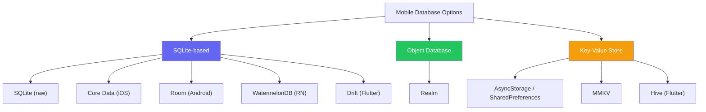
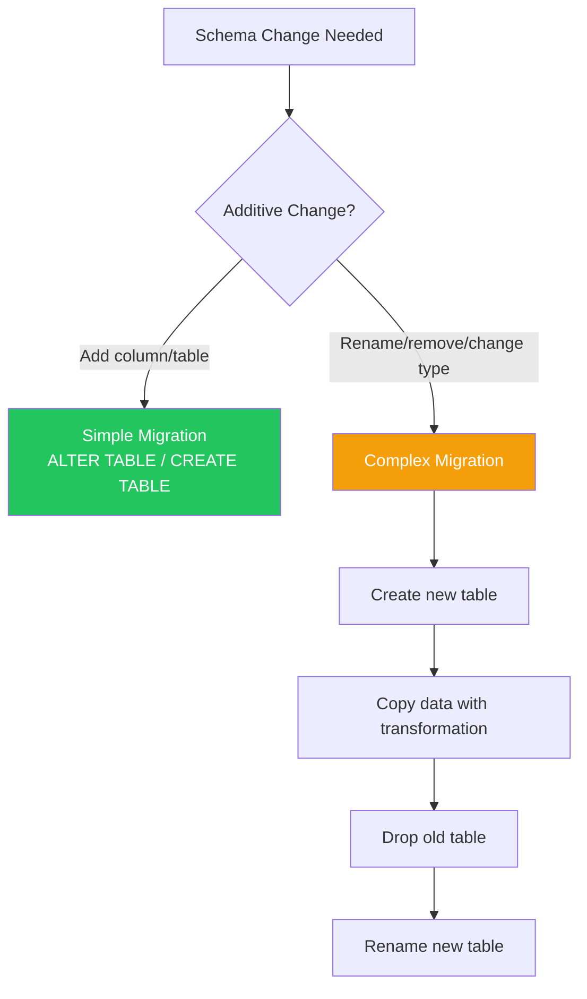

# Mobile Databases

::: tip Key Takeaway
- SQLite is the foundation of almost every mobile database (Core Data, Room, WatermelonDB all use SQLite under the hood) — understanding SQLite's capabilities and limitations matters more than learning any specific ORM
- WatermelonDB is the best choice for React Native apps that need to handle thousands of records with fast queries because it runs queries on a separate thread and lazy-loads results, unlike Realm or AsyncStorage which block the JS thread
- Encrypt your database if it stores any user data — SQLCipher for SQLite, Realm's built-in encryption, or platform-level encryption are all straightforward to implement and essential for passing security audits
:::

Every non-trivial mobile app needs local data storage. The question is not whether to store data locally, but how much, in what format, and how to keep it synchronized with the server. The difference between a fast, offline-capable app and a slow, always-loading app is often just the database layer.

Mobile databases face constraints that server databases do not: the database runs on a single device with limited memory, queries must return in milliseconds (not seconds) to avoid UI jank, the database file must survive app updates and OS migrations, and the database must handle concurrent reads from the UI thread and writes from background sync without corruption.

**Related**: [Offline-First](/mobile-engineering/offline-first) | [Mobile Networking](/mobile-engineering/mobile-networking) | [Mobile Performance](/mobile-engineering/mobile-performance)

---

## Database Comparison



| Database | Platform | Type | Performance | Offline Sync | Encryption | Best For |
|----------|----------|------|------------|-------------|------------|----------|
| **SQLite (raw)** | All | Relational | Excellent | Manual | SQLCipher | Full control |
| **Core Data** | iOS only | ORM over SQLite | Excellent | CloudKit | Built-in | Native iOS |
| **Room** | Android only | ORM over SQLite | Excellent | Manual | SQLCipher | Native Android |
| **WatermelonDB** | React Native | ORM over SQLite | Excellent | Built-in | SQLCipher | Large RN apps |
| **Realm** | All | Object DB | Good | Atlas Sync | Built-in | Quick setup |
| **MMKV** | All | Key-Value | Blazing fast | No | No | Small data, preferences |
| **Hive** | Flutter | Key-Value / Box | Very good | No | AES | Flutter preferences |
| **Drift** | Flutter | ORM over SQLite | Excellent | Manual | SQLCipher | Flutter SQL |
| **AsyncStorage** | React Native | Key-Value | Slow | No | No | Simple settings only |

---

## WatermelonDB (React Native)

WatermelonDB is purpose-built for React Native apps with thousands of records. It runs SQLite queries on a separate native thread, lazy-loads records, and provides an observable system for reactive UI updates.

```typescript
// database/schema.ts
import { appSchema, tableSchema } from '@nozbe/watermelondb';

export const schema = appSchema({
  version: 3,
  tables: [
    tableSchema({
      name: 'products',
      columns: [
        { name: 'name', type: 'string' },
        { name: 'description', type: 'string' },
        { name: 'price_cents', type: 'number' },
        { name: 'category_id', type: 'string', isIndexed: true },
        { name: 'image_url', type: 'string', isOptional: true },
        { name: 'is_available', type: 'boolean' },
        { name: 'created_at', type: 'number' },
        { name: 'updated_at', type: 'number' },
      ],
    }),
    tableSchema({
      name: 'orders',
      columns: [
        { name: 'user_id', type: 'string', isIndexed: true },
        { name: 'status', type: 'string', isIndexed: true },
        { name: 'total_cents', type: 'number' },
        { name: 'shipping_address', type: 'string' },
        { name: 'placed_at', type: 'number' },
        { name: 'updated_at', type: 'number' },
      ],
    }),
    tableSchema({
      name: 'order_items',
      columns: [
        { name: 'order_id', type: 'string', isIndexed: true },
        { name: 'product_id', type: 'string', isIndexed: true },
        { name: 'quantity', type: 'number' },
        { name: 'price_cents', type: 'number' },
      ],
    }),
  ],
});

// database/models/Product.ts
import { Model, Q } from '@nozbe/watermelondb';
import { field, date, relation, children, lazy } from '@nozbe/watermelondb/decorators';

export class Product extends Model {
  static table = 'products';

  @field('name') name!: string;
  @field('description') description!: string;
  @field('price_cents') priceCents!: number;
  @field('category_id') categoryId!: string;
  @field('image_url') imageUrl!: string | null;
  @field('is_available') isAvailable!: boolean;
  @date('created_at') createdAt!: Date;
  @date('updated_at') updatedAt!: Date;

  // Relations
  @relation('categories', 'category_id') category: any;
  @children('order_items') orderItems: any;

  // Computed properties
  get formattedPrice(): string {
    return `$${(this.priceCents / 100).toFixed(2)}`;
  }

  // Lazy queries — only executed when accessed
  @lazy availableInOrders = this.collections
    .get<OrderItem>('order_items')
    .query(Q.where('product_id', this.id));
}

// database/models/Order.ts
export class Order extends Model {
  static table = 'orders';
  static associations = {
    order_items: { type: 'has_many' as const, foreignKey: 'order_id' },
  };

  @field('user_id') userId!: string;
  @field('status') status!: 'pending' | 'confirmed' | 'shipped' | 'delivered';
  @field('total_cents') totalCents!: number;
  @field('shipping_address') shippingAddress!: string;
  @date('placed_at') placedAt!: Date;
  @date('updated_at') updatedAt!: Date;

  @children('order_items') items: any;
}

// database/index.ts
import { Database } from '@nozbe/watermelondb';
import SQLiteAdapter from '@nozbe/watermelondb/adapters/sqlite';
import { schema } from './schema';
import { migrations } from './migrations';
import { Product, Order, OrderItem } from './models';

const adapter = new SQLiteAdapter({
  schema,
  migrations,
  dbName: 'myapp',
  // Enable SQLCipher encryption
  jsi: true,  // Use JSI for better performance
  onSetUpError: (error) => {
    // Database is corrupted — this happens in production
    // Strategy: delete and recreate, or restore from backup
    console.error('Database setup error:', error);
  },
});

export const database = new Database({
  adapter,
  modelClasses: [Product, Order, OrderItem],
});
```

### Querying with WatermelonDB

```typescript
import { Q } from '@nozbe/watermelondb';
import { withObservables } from '@nozbe/watermelondb/react';

// Reactive query — component re-renders when data changes
const enhance = withObservables(['category'], ({ database, category }) => ({
  products: database.collections
    .get<Product>('products')
    .query(
      Q.where('category_id', category.id),
      Q.where('is_available', true),
      Q.sortBy('name', Q.asc),
    )
    .observe(),
}));

function ProductList({ products }: { products: Product[] }) {
  return (
    <FlatList
      data={products}
      renderItem={({ item }) => <ProductCard product={item} />}
      keyExtractor={(item) => item.id}
    />
  );
}

export default enhance(ProductList);

// Complex queries
async function getRecentOrders(userId: string, limit: number = 20) {
  return database.collections
    .get<Order>('orders')
    .query(
      Q.where('user_id', userId),
      Q.sortBy('placed_at', Q.desc),
      Q.take(limit),
    )
    .fetch();
}

async function searchProducts(query: string) {
  return database.collections
    .get<Product>('products')
    .query(
      Q.or(
        Q.where('name', Q.like(`%${Q.sanitizeLikeString(query)}%`)),
        Q.where('description', Q.like(`%${Q.sanitizeLikeString(query)}%`)),
      ),
      Q.where('is_available', true),
    )
    .fetch();
}

// Batch writes — much faster than individual writes
async function syncProducts(serverProducts: ServerProduct[]) {
  await database.write(async () => {
    const productsCollection = database.collections.get<Product>('products');
    const batch: any[] = [];

    for (const sp of serverProducts) {
      const existing = await productsCollection.find(sp.id).catch(() => null);

      if (existing) {
        batch.push(
          existing.prepareUpdate((product) => {
            product.name = sp.name;
            product.priceCents = sp.price_cents;
            product.isAvailable = sp.is_available;
          })
        );
      } else {
        batch.push(
          productsCollection.prepareCreate((product) => {
            product._raw.id = sp.id;
            product.name = sp.name;
            product.description = sp.description;
            product.priceCents = sp.price_cents;
            product.categoryId = sp.category_id;
            product.imageUrl = sp.image_url;
            product.isAvailable = sp.is_available;
          })
        );
      }
    }

    await database.batch(...batch);
  });
}
```

---

## Room (Android)

Room is Google's official SQLite ORM for Android, part of Jetpack. It provides compile-time SQL verification, migration support, and seamless integration with Kotlin Coroutines and Flow.

```kotlin
// Entity
@Entity(
    tableName = "products",
    indices = [
        Index(value = ["category_id"]),
        Index(value = ["name"])
    ]
)
data class ProductEntity(
    @PrimaryKey val id: String,
    val name: String,
    val description: String,
    @ColumnInfo(name = "price_cents") val priceCents: Int,
    @ColumnInfo(name = "category_id") val categoryId: String,
    @ColumnInfo(name = "image_url") val imageUrl: String?,
    @ColumnInfo(name = "is_available") val isAvailable: Boolean,
    @ColumnInfo(name = "created_at") val createdAt: Long,
    @ColumnInfo(name = "updated_at") val updatedAt: Long
)

// DAO
@Dao
interface ProductDao {
    @Query("SELECT * FROM products WHERE is_available = 1 ORDER BY name ASC")
    fun getAllAvailable(): Flow<List<ProductEntity>>

    @Query("SELECT * FROM products WHERE category_id = :categoryId AND is_available = 1")
    fun getByCategory(categoryId: String): Flow<List<ProductEntity>>

    @Query("SELECT * FROM products WHERE id = :id")
    suspend fun getById(id: String): ProductEntity?

    @Query("""
        SELECT * FROM products
        WHERE (name LIKE '%' || :query || '%' OR description LIKE '%' || :query || '%')
        AND is_available = 1
        ORDER BY name ASC
    """)
    fun search(query: String): Flow<List<ProductEntity>>

    @Insert(onConflict = OnConflictStrategy.REPLACE)
    suspend fun upsert(products: List<ProductEntity>)

    @Delete
    suspend fun delete(product: ProductEntity)

    @Query("DELETE FROM products WHERE updated_at < :cutoff")
    suspend fun deleteStale(cutoff: Long)
}

// Database
@Database(
    entities = [ProductEntity::class, OrderEntity::class, OrderItemEntity::class],
    version = 3,
    exportSchema = true  // Export schema for migration testing
)
@TypeConverters(Converters::class)
abstract class AppDatabase : RoomDatabase() {
    abstract fun productDao(): ProductDao
    abstract fun orderDao(): OrderDao

    companion object {
        fun create(context: Context): AppDatabase {
            return Room.databaseBuilder(
                context.applicationContext,
                AppDatabase::class.java,
                "myapp.db"
            )
                .addMigrations(MIGRATION_1_2, MIGRATION_2_3)
                .fallbackToDestructiveMigration()  // Only for development
                .build()
        }
    }
}

// Migration
val MIGRATION_2_3 = object : Migration(2, 3) {
    override fun migrate(db: SupportSQLiteDatabase) {
        db.execSQL("ALTER TABLE products ADD COLUMN image_url TEXT")
        db.execSQL("CREATE INDEX IF NOT EXISTS index_products_name ON products(name)")
    }
}

// Repository using Room
class ProductRepository(private val dao: ProductDao, private val api: ProductApi) {

    fun getProducts(categoryId: String? = null): Flow<List<Product>> {
        val dbFlow = if (categoryId != null) {
            dao.getByCategory(categoryId)
        } else {
            dao.getAllAvailable()
        }

        return dbFlow.map { entities ->
            entities.map { it.toDomain() }
        }
    }

    // Offline-first: return cache immediately, refresh in background
    suspend fun refreshProducts() {
        try {
            val serverProducts = api.getProducts()
            dao.upsert(serverProducts.map { it.toEntity() })
        } catch (e: Exception) {
            // Failed to refresh — stale cache is better than no data
        }
    }
}
```

---

## Drift (Flutter)

Drift (formerly Moor) is the most feature-rich SQLite ORM for Flutter.

```dart
// database/tables.dart
import 'package:drift/drift.dart';

class Products extends Table {
  TextColumn get id => text()();
  TextColumn get name => text().withLength(min: 1, max: 200)();
  TextColumn get description => text()();
  IntColumn get priceCents => integer()();
  TextColumn get categoryId => text().named('category_id')();
  TextColumn get imageUrl => text().nullable().named('image_url')();
  BoolColumn get isAvailable => boolean().withDefault(const Constant(true))();
  DateTimeColumn get createdAt => dateTime()();
  DateTimeColumn get updatedAt => dateTime()();

  @override
  Set<Column> get primaryKey => {id};
}

class Orders extends Table {
  TextColumn get id => text()();
  TextColumn get userId => text().named('user_id')();
  TextColumn get status => text()();
  IntColumn get totalCents => integer().named('total_cents')();
  DateTimeColumn get placedAt => dateTime()();

  @override
  Set<Column> get primaryKey => {id};
}

// database/database.dart
@DriftDatabase(tables: [Products, Orders, OrderItems])
class AppDatabase extends _$AppDatabase {
  AppDatabase() : super(_openConnection());

  @override
  int get schemaVersion => 3;

  @override
  MigrationStrategy get migration => MigrationStrategy(
    onCreate: (Migrator m) => m.createAll(),
    onUpgrade: (Migrator m, int from, int to) async {
      if (from < 2) {
        await m.addColumn(products, products.imageUrl);
      }
      if (from < 3) {
        await m.createIndex(
          Index('idx_products_category', 'CREATE INDEX idx_products_category ON products(category_id)')
        );
      }
    },
  );

  // Queries
  Stream<List<Product>> watchProducts({String? categoryId}) {
    final query = select(products)
      ..where((p) => p.isAvailable.equals(true));

    if (categoryId != null) {
      query.where((p) => p.categoryId.equals(categoryId));
    }

    query.orderBy([(p) => OrderingTerm.asc(p.name)]);

    return query.watch();
  }

  Future<void> upsertProducts(List<ProductsCompanion> data) async {
    await batch((batch) {
      batch.insertAllOnConflictUpdate(products, data);
    });
  }
}
```

---

## Encryption at Rest

### SQLCipher

```typescript
// WatermelonDB with SQLCipher (React Native)
const adapter = new SQLiteAdapter({
  schema,
  migrations,
  dbName: 'myapp_encrypted',
  jsi: true,
  // SQLCipher encryption key — derive from user's password or device key
  // Do NOT hardcode this
});

// For raw SQLite with encryption
import SQLite from 'react-native-sqlite-storage';

const db = await SQLite.openDatabase({
  name: 'myapp.db',
  key: await getEncryptionKey(), // From Keychain/Keystore
  location: 'default',
});
```

```kotlin
// Room with SQLCipher (Android)
import net.sqlcipher.database.SupportFactory

fun createEncryptedDatabase(context: Context, passphrase: ByteArray): AppDatabase {
    val factory = SupportFactory(passphrase)

    return Room.databaseBuilder(
        context,
        AppDatabase::class.java,
        "myapp_encrypted.db"
    )
        .openHelperFactory(factory)
        .build()
}

// Derive the passphrase from Android Keystore
suspend fun getDatabasePassphrase(context: Context): ByteArray {
    val keystore = KeystoreEncryption()
    val stored = SecurePrefs.getEncryptedDatabaseKey()

    return if (stored != null) {
        keystore.decrypt(stored.iv, stored.ciphertext)
    } else {
        // First launch: generate and store a random key
        val key = ByteArray(32).also { SecureRandom().nextBytes(it) }
        val (iv, encrypted) = keystore.encrypt(key)
        SecurePrefs.saveEncryptedDatabaseKey(iv, encrypted)
        key
    }
}
```

---

## Database Migration Strategies



| Migration Type | Risk | Strategy |
|---------------|------|----------|
| **Add column** | Low | `ALTER TABLE ... ADD COLUMN` |
| **Add table** | Low | `CREATE TABLE` |
| **Add index** | Low | `CREATE INDEX` |
| **Rename column** | Medium | SQLite < 3.25: create new table + copy data. SQLite >= 3.25: `ALTER TABLE RENAME COLUMN` |
| **Change column type** | High | Create new table, copy with CAST, drop old, rename |
| **Remove column** | Medium | Create new table without column, copy data, drop old, rename |
| **Data transformation** | High | Application-level migration in transaction |

```typescript
// WatermelonDB migrations
import { schemaMigrations, addColumns, createTable } from '@nozbe/watermelondb/Schema/migrations';

export const migrations = schemaMigrations({
  migrations: [
    {
      toVersion: 2,
      steps: [
        addColumns({
          table: 'products',
          columns: [
            { name: 'image_url', type: 'string', isOptional: true },
          ],
        }),
      ],
    },
    {
      toVersion: 3,
      steps: [
        createTable({
          name: 'favorites',
          columns: [
            { name: 'product_id', type: 'string', isIndexed: true },
            { name: 'user_id', type: 'string', isIndexed: true },
            { name: 'created_at', type: 'number' },
          ],
        }),
      ],
    },
  ],
});
```

---

## Performance Optimization

| Optimization | Impact | Implementation |
|-------------|--------|----------------|
| **Index frequently queried columns** | 10-100x faster reads | `CREATE INDEX` on WHERE/JOIN columns |
| **Batch writes** | 10-50x faster inserts | Wrap in transaction / use batch API |
| **WAL mode** | Better concurrent read/write | `PRAGMA journal_mode=WAL` |
| **Lazy loading** | Faster initial render | Query only what the screen needs |
| **Query on background thread** | No UI jank | Use Coroutines/Worklets/Isolates |
| **Limit result sets** | Lower memory usage | Use `LIMIT` and pagination |
| **Avoid `SELECT *`** | Less data transfer | Select only needed columns |

```sql
-- Enable WAL mode (do this once on database creation)
PRAGMA journal_mode=WAL;

-- Optimize for mobile: smaller cache, lower memory usage
PRAGMA cache_size=-2000;  -- 2MB cache (negative = KB)
PRAGMA mmap_size=268435456;  -- Memory-map 256MB for faster reads
PRAGMA synchronous=NORMAL;  -- Good balance of safety and speed
```

---

## When NOT to Use a Database

- **Fewer than 100 records.** If your data fits comfortably in memory, use MMKV (React Native) or SharedPreferences/Hive (Flutter). The overhead of a SQLite database is not justified for small amounts of data.
- **Simple key-value storage.** User preferences, feature flags, cached tokens — use MMKV (fastest), Hive, or EncryptedSharedPreferences. Do not use a relational database for non-relational data.
- **Data that changes every few seconds.** Real-time data (stock tickers, live chat) should stay in memory with an observable state store (Zustand, Riverpod). Writing to SQLite every second creates unnecessary I/O.
- **Large binary files.** Images, videos, and PDFs should be stored in the file system, not in the database. Store the file path in the database, not the file itself.

::: warning Common Misconceptions
**"Realm is faster than SQLite."** In benchmarks, Realm and SQLite are comparable for most operations. SQLite is faster for complex queries (JOINs, aggregations). Realm is faster for simple object reads. The real difference is in the API: Realm is easier to use for object-oriented data, SQLite gives you more query power.

**"AsyncStorage is fine for React Native."** AsyncStorage stores data as serialized JSON strings in an unencrypted SQLite database. Reading 1,000 records requires deserializing the entire JSON blob. For anything beyond simple settings, use WatermelonDB or MMKV. MMKV is 30x faster than AsyncStorage for key-value operations.

**"You don't need migrations for mobile databases."** Migrations are critical for mobile because you cannot control when users update their app. Version 1 users will open version 3 and the database must migrate seamlessly through each schema version. Test migrations from every released version to the current version.
:::

---

## Real-World Example: Notion

Notion's mobile app is one of the most database-intensive consumer apps:

1. **SQLite for all content** — every page, block, database row, and property is stored in a local SQLite database for offline access
2. **Custom sync engine** — Notion built a custom CRDT-based sync engine that writes operations to a log and replays them on the server, allowing offline editing with conflict resolution
3. **Lazy loading** — opening a page only loads the visible blocks; scrolling down triggers lazy loading of deeper content from the local database
4. **Background sync** — changes are queued and synced when connectivity is available, with visual indicators showing sync status
5. **Database size management** — they periodically compact the database and prune old versions of blocks to keep the database file manageable

The Notion mobile team reported reducing page load times by 50% after moving from network-first to local-first data loading.

---

::: details Quiz

**1. Why does WatermelonDB outperform Realm for large datasets in React Native?**

WatermelonDB runs all SQLite queries on a native thread (via JSI), separate from the React Native JS thread. Results are lazy-loaded — the query returns immediately with observable proxies, and actual data is fetched only when a component accesses a property. Realm in React Native blocks the JS thread during queries and eagerly loads all result objects. For 10,000+ records, WatermelonDB's lazy loading is dramatically faster for initial render.

**2. What is WAL mode and why should you enable it?**

WAL (Write-Ahead Logging) is a SQLite journaling mode where writes go to a separate log file instead of modifying the main database file directly. This allows concurrent readers and writers — readers see a consistent snapshot while a writer is modifying data. Without WAL, a write operation blocks all readers. WAL mode is essential for mobile apps where background sync writes data while the UI reads it.

**3. Why should you NOT store the database encryption key in the database?**

That would be like locking your front door and leaving the key under the doormat. The encryption key must be stored in platform secure storage (iOS Keychain with `kSecAttrAccessibleAfterFirstUnlock` or Android Keystore) so it is hardware-protected and not accessible to other apps or to users with physical device access.

**4. How should you handle a database corruption in production?**

Database corruption happens in production (power loss during write, OS bugs, storage hardware failures). Your recovery strategy should be: (1) detect corruption on startup (open failure), (2) attempt to recover data using `PRAGMA integrity_check` and export what you can, (3) delete and recreate the database, (4) re-sync from the server if available, (5) log the incident for monitoring. WatermelonDB's `onSetUpError` callback handles this.

:::

---

::: details Exercise

**Design a local database schema for an e-commerce app that supports:**

1. Product catalog with categories
2. Shopping cart that persists across sessions
3. Order history with line items
4. User favorites
5. Full-text search on product names and descriptions

**Solution:**

```typescript
// WatermelonDB Schema
import { appSchema, tableSchema } from '@nozbe/watermelondb';

export const schema = appSchema({
  version: 1,
  tables: [
    tableSchema({
      name: 'categories',
      columns: [
        { name: 'name', type: 'string' },
        { name: 'slug', type: 'string', isIndexed: true },
        { name: 'parent_id', type: 'string', isOptional: true, isIndexed: true },
        { name: 'image_url', type: 'string', isOptional: true },
        { name: 'sort_order', type: 'number' },
      ],
    }),

    tableSchema({
      name: 'products',
      columns: [
        { name: 'name', type: 'string' },
        { name: 'description', type: 'string' },
        { name: 'price_cents', type: 'number' },
        { name: 'compare_at_price_cents', type: 'number', isOptional: true },
        { name: 'category_id', type: 'string', isIndexed: true },
        { name: 'sku', type: 'string', isIndexed: true },
        { name: 'image_url', type: 'string', isOptional: true },
        { name: 'is_available', type: 'boolean' },
        { name: 'stock_count', type: 'number' },
        { name: 'rating', type: 'number' },
        { name: 'review_count', type: 'number' },
        // For full-text search: denormalized searchable text
        { name: 'search_text', type: 'string' },
        { name: 'server_updated_at', type: 'number', isIndexed: true },
      ],
    }),

    // Cart persists across sessions
    tableSchema({
      name: 'cart_items',
      columns: [
        { name: 'product_id', type: 'string', isIndexed: true },
        { name: 'quantity', type: 'number' },
        { name: 'added_at', type: 'number' },
        // Snapshot price at time of adding (in case price changes)
        { name: 'price_snapshot_cents', type: 'number' },
      ],
    }),

    tableSchema({
      name: 'orders',
      columns: [
        { name: 'server_id', type: 'string', isIndexed: true },
        { name: 'status', type: 'string', isIndexed: true },
        { name: 'subtotal_cents', type: 'number' },
        { name: 'discount_cents', type: 'number' },
        { name: 'tax_cents', type: 'number' },
        { name: 'shipping_cents', type: 'number' },
        { name: 'total_cents', type: 'number' },
        { name: 'placed_at', type: 'number', isIndexed: true },
        { name: 'shipping_address_json', type: 'string' },
      ],
    }),

    tableSchema({
      name: 'order_items',
      columns: [
        { name: 'order_id', type: 'string', isIndexed: true },
        { name: 'product_id', type: 'string', isIndexed: true },
        { name: 'product_name', type: 'string' }, // Snapshot
        { name: 'quantity', type: 'number' },
        { name: 'price_cents', type: 'number' }, // Snapshot
      ],
    }),

    tableSchema({
      name: 'favorites',
      columns: [
        { name: 'product_id', type: 'string', isIndexed: true },
        { name: 'added_at', type: 'number' },
      ],
    }),
  ],
});

// Full-text search implementation
// WatermelonDB uses LIKE queries. For true FTS, use raw SQL:
async function searchProducts(query: string): Promise<Product[]> {
  const sanitized = Q.sanitizeLikeString(query);
  return database.collections
    .get<Product>('products')
    .query(
      Q.where('search_text', Q.like(`%${sanitized}%`)),
      Q.where('is_available', true),
      Q.sortBy('rating', Q.desc),
      Q.take(50),
    )
    .fetch();
}

// When inserting products, build the search_text field:
function buildSearchText(product: ServerProduct): string {
  return `${product.name} ${product.description} ${product.category_name}`
    .toLowerCase();
}
```

Key design decisions:
- Cart items snapshot the price at time of adding (prices can change between adding and checkout)
- Order items snapshot product name and price (the product may be deleted later)
- `search_text` is a denormalized field for fast LIKE queries without JOINs
- `server_updated_at` on products enables efficient delta sync (only fetch products updated since last sync)
- Favorites are a separate table, not a boolean on products, to support easy counting and ordering

:::

---

> *"A mobile database should be invisible. If the user notices it loading, it is too slow. If the user loses data, it is broken. The best database layer is one the user never thinks about."*
