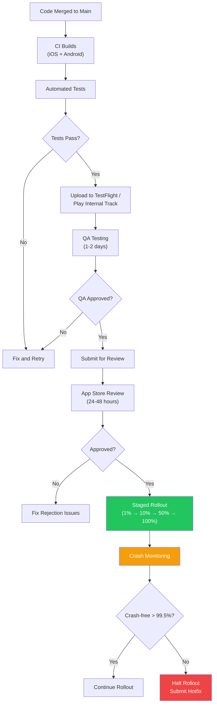
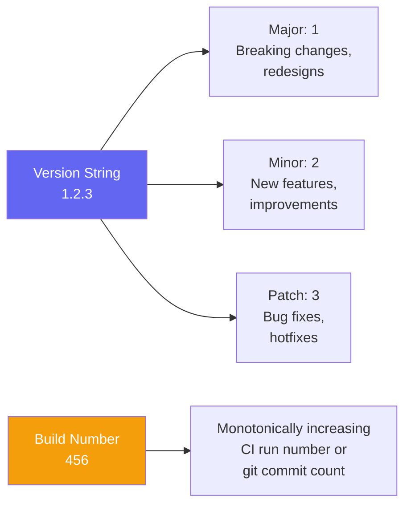

# Mobile Deployment

::: tip Key Takeaway
- OTA updates (CodePush for React Native, Shorebird for Flutter) let you push JavaScript/Dart code changes instantly without app store review — use them for bug fixes and feature flag changes, not for major feature launches
- Staged rollouts are your safety net — never go from 0% to 100%; release to 1% first, monitor crash rates for 24 hours, then expand to 10%, 25%, 50%, 100% over several days
- Crash monitoring (Sentry, Crashlytics) is the most important production infrastructure for mobile — you cannot see your users' errors unless you instrument, and a crash-free rate below 99.5% should trigger an immediate investigation
:::

Mobile deployment is the process of getting your built app into users' hands and keeping it running smoothly after release. Unlike web deployment where you push to a server and everyone sees the new version immediately, mobile deployment involves app store review, phased rollouts, version coexistence (users on different versions for months), and the inability to roll back a released version.

The stakes are higher too. A broken web deployment is fixed with a revert and a 5-minute deploy. A broken mobile deployment means submitting a hotfix, waiting 24-48 hours for review, and hoping users update. During that window, your crash-free rate tanks, your app store rating drops, and your support inbox fills up.

**Related**: [Mobile CI/CD](/mobile-engineering/mobile-cicd) | [Mobile Analytics](/mobile-engineering/mobile-analytics) | [Mobile Engineering Overview](/mobile-engineering/)

---

## The Deployment Pipeline



---

## OTA Updates

### CodePush (React Native)

CodePush (now part of Microsoft App Center's successor, or use EAS Update from Expo) lets you push JavaScript bundle updates directly to users without going through app store review. The native container stays the same; only the JS code changes.

```typescript
// React Native CodePush integration
import codePush from 'react-native-code-push';

// Wrap your root component
const codePushOptions = {
  // Check for updates on app resume (not just launch)
  checkFrequency: codePush.CheckFrequency.ON_APP_RESUME,
  // Install updates when the app returns to foreground
  installMode: codePush.InstallMode.ON_NEXT_RESUME,
  // For critical fixes: install immediately
  // installMode: codePush.InstallMode.IMMEDIATE,
  mandatoryInstallMode: codePush.InstallMode.IMMEDIATE,
  // Minimum time between checks (seconds)
  minimumBackgroundDuration: 60 * 5, // 5 minutes
};

function App() {
  return (
    <NavigationContainer>
      <RootStack />
    </NavigationContainer>
  );
}

export default codePush(codePushOptions)(App);

// Manual update check with progress
async function checkForUpdate() {
  try {
    const update = await codePush.checkForUpdate();

    if (!update) return; // Already on latest

    if (update.isMandatory) {
      // Force update — show blocking modal
      await update.download((progress) => {
        const percent = Math.round(
          (progress.receivedBytes / progress.totalBytes) * 100
        );
        showUpdateProgress(percent);
      });
      codePush.restartApp();
    } else {
      // Optional update — install silently on next restart
      const newPackage = await update.download();
      await newPackage.install(codePush.InstallMode.ON_NEXT_RESTART);
    }
  } catch (error) {
    // CodePush failure should never crash the app
    console.warn('CodePush update check failed:', error);
  }
}
```

### EAS Update (Expo)

```typescript
// For Expo apps — EAS Update is the modern CodePush alternative
import * as Updates from 'expo-updates';

async function checkForExpoUpdate() {
  if (__DEV__) return; // Skip in development

  try {
    const update = await Updates.checkForUpdateAsync();

    if (update.isAvailable) {
      await Updates.fetchUpdateAsync();
      // Ask the user before reloading
      Alert.alert(
        'Update Available',
        'A new version is available. Restart to apply?',
        [
          { text: 'Later', style: 'cancel' },
          {
            text: 'Restart',
            onPress: () => Updates.reloadAsync(),
          },
        ]
      );
    }
  } catch (error) {
    // Silent failure — never block the app
    console.warn('Update check failed:', error);
  }
}

// Publish an update from CLI:
// eas update --branch production --message "Fix checkout crash"
```

### Shorebird (Flutter)

Shorebird enables OTA updates for Flutter apps, similar to CodePush for React Native.

```dart
// Flutter with Shorebird
import 'package:shorebird_code_push/shorebird_code_push.dart';

class UpdateChecker {
  final shorebirdCodePush = ShorebirdCodePush();

  Future<void> checkForUpdate() async {
    final isUpdateAvailable =
        await shorebirdCodePush.isNewPatchAvailableForDownload();

    if (isUpdateAvailable) {
      await shorebirdCodePush.downloadUpdateIfAvailable();
      // Update will be applied on next app restart
    }
  }

  // Check current patch number
  Future<int?> currentPatchNumber() async {
    return await shorebirdCodePush.currentPatchNumber();
  }
}

// Publish from CLI:
// shorebird patch android --release-version 1.2.3
// shorebird patch ios --release-version 1.2.3
```

### OTA Update Rules

| Rule | Reason |
|------|--------|
| **Never change native code via OTA** | OTA can only update JS/Dart bundles. Native changes require a store release |
| **Always have a rollback plan** | If a CodePush update breaks the app, push a rollback immediately |
| **Test OTA updates in staging first** | Deploy to a staging channel, verify, then promote to production |
| **Do not use OTA for major feature launches** | Apple prohibits using OTA to "significantly change" the app's functionality |
| **Version-lock OTA updates** | An OTA update for v1.5 should not be applied to v1.4 (binary mismatch) |

---

## Staged Rollouts

### iOS Phased Release

```
App Store Connect → Your App → Version → Release Options

Phased Release Schedule (Apple-defined):
Day 1: 1% of users
Day 2: 2% of users
Day 3: 5% of users
Day 4: 10% of users
Day 5: 20% of users
Day 6: 50% of users
Day 7: 100% of users

You can:
- Pause the rollout at any percentage
- Resume a paused rollout
- Release to all users immediately

You CANNOT:
- Roll back to a previous version
- Choose custom percentages
```

### Google Play Staged Rollout

```
Play Console → Your App → Release → Production

Google allows custom percentages:
Stage 1: 1%   → Monitor for 24 hours
Stage 2: 5%   → Monitor for 24 hours
Stage 3: 10%  → Monitor for 24 hours
Stage 4: 25%  → Monitor for 24 hours
Stage 5: 50%  → Monitor for 24 hours
Stage 6: 100% → Full release

You can:
- Set any percentage (0.1% to 100%)
- Halt the rollout (stops new users from getting the update)
- Resume at any time

You CANNOT:
- Roll back to a previous version (halt + submit hotfix)
```

```ruby
# Automated staged rollout with Fastlane
lane :staged_release do |options|
  percentage = options[:percentage] || 10

  # Android: set rollout percentage
  upload_to_play_store(
    track: 'production',
    rollout: (percentage / 100.0).to_s,
    json_key: ENV['PLAY_STORE_JSON_KEY'],
    skip_upload_aab: true,
    skip_upload_metadata: true
  )

  # iOS: phased release is set in App Store Connect
  # Use deliver to configure it:
  deliver(
    phased_release: true,
    submit_for_review: false,
    automatic_release: false
  )
end

# Check crash rate before expanding
lane :check_and_expand_rollout do
  crash_rate = fetch_crash_rate_from_sentry()

  if crash_rate < 0.005  # 0.5% crash rate threshold
    current = get_current_rollout_percentage()
    next_stage = get_next_stage(current)

    staged_release(percentage: next_stage)
    slack(message: "Rollout expanded to #{next_stage}%. Crash rate: #{crash_rate * 100}%")
  else
    slack(message: "Rollout HALTED. Crash rate: #{crash_rate * 100}% exceeds threshold.")
  end
end
```

---

## Crash Monitoring

### Sentry (React Native)

```typescript
// App startup — initialize Sentry
import * as Sentry from '@sentry/react-native';

Sentry.init({
  dsn: 'https://xxxxx@sentry.io/123456',
  environment: __DEV__ ? 'development' : 'production',
  release: `com.myapp@${getVersion()}+${getBuildNumber()}`,
  dist: getBuildNumber(),

  // Performance monitoring
  tracesSampleRate: 0.2,  // Sample 20% of transactions

  // Session tracking for crash-free rate
  enableAutoSessionTracking: true,
  sessionTrackingIntervalMillis: 30000,

  // Breadcrumbs for debugging
  enableAutoPerformanceTracing: true,
  attachStacktrace: true,

  beforeSend(event) {
    // Strip PII
    if (event.user) {
      delete event.user.email;
      delete event.user.ip_address;
    }
    return event;
  },
});

// Wrap navigation for automatic screen tracking
const routingInstrumentation = new Sentry.ReactNavigationInstrumentation();

function App() {
  const navigation = useNavigationContainerRef();

  return (
    <Sentry.ErrorBoundary fallback={<CrashScreen />}>
      <NavigationContainer
        ref={navigation}
        onReady={() => {
          routingInstrumentation.registerNavigationContainer(navigation);
        }}
      >
        <RootStack />
      </NavigationContainer>
    </Sentry.ErrorBoundary>
  );
}

// Manual error capture with context
async function placeOrder(cart: CartItem[]) {
  try {
    const order = await apiClient.post('/orders', { items: cart });
    return order;
  } catch (error) {
    Sentry.captureException(error, {
      tags: {
        feature: 'checkout',
        payment_method: selectedPaymentMethod,
      },
      extra: {
        cart_items: cart.length,
        cart_total: calculateTotal(cart),
      },
    });
    throw error;
  }
}

// Custom performance monitoring
async function loadProductCatalog() {
  const transaction = Sentry.startTransaction({
    name: 'load_product_catalog',
    op: 'db.query',
  });

  const span = transaction.startChild({
    op: 'db.query',
    description: 'fetch products from WatermelonDB',
  });

  const products = await database.collections
    .get('products')
    .query()
    .fetch();

  span.finish();
  transaction.finish();

  return products;
}
```

### Firebase Crashlytics (Native)

```kotlin
// Android: Crashlytics setup
import com.google.firebase.crashlytics.FirebaseCrashlytics

class MyApplication : Application() {
    override fun onCreate() {
        super.onCreate()

        val crashlytics = FirebaseCrashlytics.getInstance()

        // Set user identifier (not PII)
        crashlytics.setUserId(getUserIdHash())

        // Custom keys for filtering in dashboard
        crashlytics.setCustomKey("app_version", BuildConfig.VERSION_NAME)
        crashlytics.setCustomKey("build_number", BuildConfig.VERSION_CODE)
        crashlytics.setCustomKey("user_plan", getUserPlan())

        // Disable for debug builds
        crashlytics.setCrashlyticsCollectionEnabled(!BuildConfig.DEBUG)
    }
}

// Log non-fatal errors
fun handleApiError(error: Exception, endpoint: String) {
    FirebaseCrashlytics.getInstance().apply {
        setCustomKey("api_endpoint", endpoint)
        recordException(error)
    }
}
```

### Crash Rate Targets

| Metric | Target | Red Flag | Action |
|--------|--------|----------|--------|
| **Crash-free users** | > 99.5% | < 99% | Halt rollout, investigate |
| **Crash-free sessions** | > 99.8% | < 99.5% | Investigate top crashes |
| **ANR rate** (Android) | < 0.5% | > 1% | Profile main thread |
| **Hang rate** (iOS) | < 1% | > 2% | Profile main thread |
| **Fatal crash rate** | < 0.1% | > 0.5% | Emergency hotfix |

---

## Versioning Strategy



```typescript
// Version management utility
const AppVersion = {
  // Displayed to users
  displayVersion: '1.2.3',  // Set in native project files

  // Internal build identifier
  buildNumber: 456,  // Auto-incremented by CI

  // Used for API compatibility
  apiVersion: 'v2',

  // Used for OTA update targeting
  nativeBinaryVersion: '1.2.0',  // Only changes with native code changes

  // Full version string for crash reports
  fullVersion: '1.2.3 (456)',

  // Minimum server-supported version
  // Server returns this in API responses
  // App shows force-update screen if below
  minimumSupportedVersion: '1.1.0',
};
```

### Force Update Flow

```typescript
// Check if the app version is still supported
async function checkVersionSupport() {
  try {
    const response = await fetch('https://api.myapp.com/config');
    const config = await response.json();

    const currentVersion = getAppVersion();  // e.g., "1.2.3"
    const minimumVersion = config.minimum_app_version;  // e.g., "1.3.0"

    if (isVersionLessThan(currentVersion, minimumVersion)) {
      // Show force update screen
      showForceUpdateScreen({
        currentVersion,
        requiredVersion: minimumVersion,
        updateUrl: Platform.select({
          ios: config.app_store_url,
          android: config.play_store_url,
        }),
      });
    }
  } catch {
    // If we can't check, don't block the user
  }
}

function isVersionLessThan(current: string, minimum: string): boolean {
  const [aMajor, aMinor, aPatch] = current.split('.').map(Number);
  const [bMajor, bMinor, bPatch] = minimum.split('.').map(Number);

  if (aMajor !== bMajor) return aMajor < bMajor;
  if (aMinor !== bMinor) return aMinor < bMinor;
  return aPatch < bPatch;
}
```

---

## App Store Submission Checklist

| Check | iOS | Android |
|-------|-----|---------|
| **App icon** | 1024x1024 PNG, no alpha, no rounded corners | 512x512 PNG |
| **Screenshots** | 6.7", 6.5", 5.5", iPad Pro (if universal) | Phone + 7"/10" tablet (if applicable) |
| **Privacy policy URL** | Required | Required |
| **App Review notes** | Demo credentials, test instructions | N/A |
| **IDFA usage declaration** | Required if using IDFA | N/A |
| **Export compliance** | Encryption declaration | N/A |
| **Content rating** | Age rating questionnaire | Content rating questionnaire |
| **In-app purchases** | Configure in App Store Connect | Configure in Play Console |
| **Signing** | Valid distribution cert + provisioning profile | Valid upload keystore |
| **Build** | IPA via `xcodebuild` or Fastlane | AAB (not APK) via `./gradlew bundleRelease` |

### Common App Review Rejections

| Rejection Reason | Frequency | How to Avoid |
|-----------------|-----------|--------------|
| **Guideline 2.1: Crashes/bugs** | Most common | Test on physical devices, not just simulator |
| **Guideline 4.0: Design minimum** | Common | Complete all features, no placeholder content |
| **Guideline 5.1.1: Data collection** | Common | Declare all tracking, privacy labels accurate |
| **Guideline 3.1.1: IAP required** | Common | Use IAP for digital goods, not Stripe |
| **Guideline 2.3: Metadata** | Common | Screenshots match actual app, no misleading text |
| **Guideline 4.3: Spam** | Occasional | App must be meaningfully different from existing apps |

---

## When NOT to Invest in Complex Deployment

- **Solo developer, monthly releases.** Manual upload from Xcode/Android Studio is fine. The overhead of CI/CD, staged rollouts, and automated crash monitoring exceeds the benefit at this scale.
- **Internal enterprise apps.** Use TestFlight (up to 10,000 users) or Play Internal Track for distribution. Skip app store review entirely by using enterprise distribution (Apple Business Manager, Android managed Google Play).
- **Pre-launch beta.** Ship fast and broken via TestFlight/Internal Track. Do not optimize your deployment pipeline until you have validated the product.

::: warning Common Misconceptions
**"OTA updates mean you never need app store releases."** OTA can only update JavaScript/Dart code. Any change to native modules, permissions, new native dependencies, or native configuration requires a full app store release. Most apps need a store release at least monthly.

**"You can roll back a mobile release."** You cannot. On iOS, you can halt a phased release (stopping new users from getting the update) but users who already have it are stuck. On Android, you can halt a staged rollout but cannot revert. Your only option is to submit a hotfix version and wait for review.

**"100% crash-free is achievable."** It is not. Even perfectly written apps crash due to OS bugs, OOM kills, and hardware failures. Industry benchmarks for "healthy" apps are 99.5%+ crash-free users. Obsessing over the last 0.5% is diminishing returns — focus on the top 3 crash signatures.

**"Staged rollouts are only for big apps."** Even apps with 1,000 users benefit from staged rollouts. A crash-causing release that hits 100% of users simultaneously means 100% of users have a bad experience and your crash rate spikes overnight. At 1%, only 10 users are affected, giving you time to detect and fix.
:::

---

## Real-World Example: Uber

Uber's mobile deployment process handles one of the most critical mobile apps in the world (people rely on it for transportation):

1. **Release train**: New release cut every Tuesday, submitted Friday, with a 2-week staged rollout
2. **Feature flags**: Every feature ships behind a flag. The release train goes out on schedule regardless of which features are complete. Flags are toggled server-side.
3. **Canary releases**: 0.1% of users get the new version first. Crash rate and performance metrics are compared against the previous version.
4. **Automated rollout expansion**: If crash metrics are within thresholds, the rollout automatically expands. If they exceed thresholds, the rollout halts and pages the on-call engineer.
5. **Rollback via feature flags**: Instead of rolling back the entire release, Uber disables the problematic feature flag, leaving the rest of the release intact.
6. **Multi-version support**: The Uber API supports the current version and at least 2 previous versions simultaneously, because some users never update.

---

::: details Quiz

**1. What is the difference between CodePush and a regular app store update?**

CodePush pushes only the JavaScript bundle (the business logic and UI code) directly to users' devices without app store review. The native binary (compiled Swift/Kotlin/C++ code, native modules, app icons, permissions) stays the same. A regular app store update replaces the entire app binary including native code. CodePush updates are instant; store updates take 24-48 hours for review.

**2. Why should you never go from 0% to 100% in a rollout?**

A crash or critical bug that affects 100% of users simultaneously means: (a) every user has a bad experience at the same time, (b) your crash-free rate drops dramatically, which can affect your app store ranking, (c) your support inbox is flooded, and (d) your only fix is a hotfix that takes 24-48 hours for review. Staged rollouts limit the blast radius so you can detect issues affecting a small percentage of users before they affect everyone.

**3. What crash-free rate should trigger an investigation?**

Below 99.5% for crash-free users, or below 99.8% for crash-free sessions. Industry benchmarks for healthy apps are above these thresholds. A sudden drop (even if still above threshold) is also worth investigating, as it may indicate a regression. The absolute threshold matters less than the trend — a drop from 99.9% to 99.6% is a clear signal even though 99.6% sounds high.

**4. Can you use OTA updates to bypass App Store review for a major feature launch?**

No. Apple's guidelines explicitly state that OTA updates (CodePush, EAS Update) must not "significantly change" the app's functionality. Using OTA to launch a major new feature risks app removal. OTA should be used for bug fixes, minor UI tweaks, content updates, and feature flag changes. Major features should go through the normal app store review process.

:::

---

::: details Exercise

**Design a release management workflow for a team of 8 building a fintech app. Include:**

1. Branch strategy
2. QA process
3. Rollout stages with specific criteria for advancement
4. Crash monitoring thresholds
5. Hotfix process

**Solution:**

```
BRANCH STRATEGY
- main: always releasable, protected branch
- develop: integration branch for current sprint
- feature/*: individual feature branches (off develop)
- release/1.x.x: release branches (off develop, merged to main)
- hotfix/1.x.x: emergency fix branches (off main)

Flow:
1. Features merge to develop throughout the sprint
2. End of sprint: cut release/1.x.x from develop
3. QA tests on the release branch
4. Release branch merges to main AND back to develop
5. Hotfixes branch from main, merge to main AND develop

QA PROCESS
1. Feature PR: author self-tests + code review
2. Develop branch: automated regression tests (CI)
3. Release branch: QA team tests for 2 business days
   - Test on: iPhone 15, iPhone SE, Pixel 8, Galaxy S23
   - Test: all payment flows, biometric auth, offline mode
   - For fintech: test with sandbox bank accounts
4. Release candidate signed off by QA lead + product owner

ROLLOUT STAGES

Stage 1: Internal (TestFlight + Internal Track)
  Duration: 2 days
  Criteria: Team tests + automated smoke tests pass
  Who gets it: Engineering + QA team (~30 people)

Stage 2: Beta (External TestFlight + Closed Testing)
  Duration: 2 days
  Criteria: Zero P0 bugs, crash-free > 99.9%
  Who gets it: Beta testers (~500 people)

Stage 3: Canary (1% production)
  Duration: 24 hours minimum
  Criteria to advance:
    - Crash-free users > 99.5%
    - No P0 or P1 bugs reported
    - API error rate within baseline (+/- 5%)
    - Payment success rate within baseline
  Monitor: Sentry crashes, Datadog API metrics, support tickets

Stage 4: Limited (10% production)
  Duration: 24 hours minimum
  Same advancement criteria as Stage 3

Stage 5: Expanded (50% production)
  Duration: 24 hours minimum
  Same criteria, also check:
    - App store rating not declining
    - Support ticket volume not spiking

Stage 6: Full (100% production)
  Rollout complete. Continue monitoring for 72 hours.

CRASH MONITORING THRESHOLDS
  Green: crash-free > 99.5%    → Continue rollout
  Yellow: crash-free 99.0-99.5% → Pause rollout, investigate
  Red: crash-free < 99.0%      → Halt rollout, page on-call

  For fintech-specific:
  - Payment failure rate > 2% above baseline → Halt immediately
  - Auth failure rate > 1% above baseline → Halt immediately
  - Data inconsistency detected → Halt + escalate to engineering lead

HOTFIX PROCESS
  1. P0 bug identified in production
  2. On-call engineer confirms and creates hotfix/* branch from main
  3. Fix implemented, reviewed (expedited review), merged to main
  4. CI builds immediately, QA does targeted testing (1-2 hours)
  5. Submit to App Store with "expedited review" request
  6. CodePush the JS fix immediately (if applicable) for users
     who can receive OTA updates
  7. iOS review typically 2-24 hours for expedited requests
  8. Staged rollout (1% → 100% in 24 hours, not 7 days)
  9. Hotfix branch merged back to develop
  10. Post-mortem within 48 hours
```

:::

---

> *"The release process should be boring. If releasing to production feels exciting, your monitoring is not good enough."*
