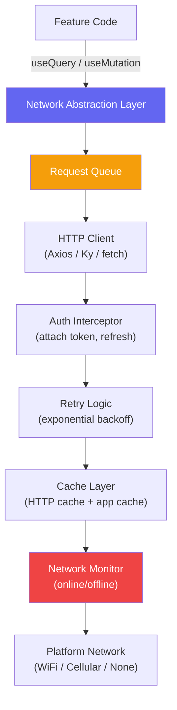
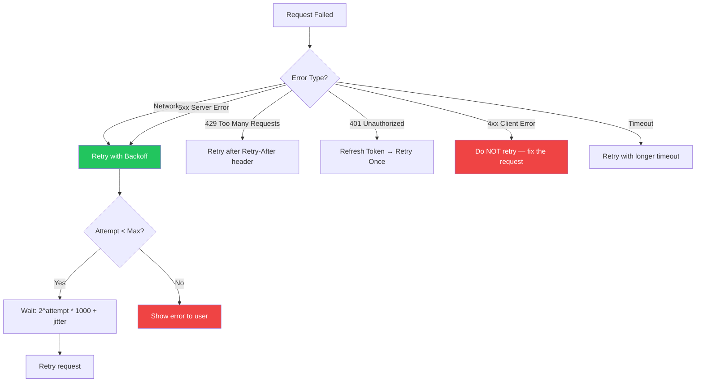

# Mobile Networking

::: tip Key Takeaway
- Mobile networks are fundamentally unreliable — design every network call with the assumption that it will fail, be slow, or be interrupted by a tunnel, elevator, or airplane mode toggle
- Implement exponential backoff with jitter for retries, HTTP caching for reads, and an offline queue for writes — these three patterns handle 90% of mobile networking problems
- GraphQL is particularly well-suited for mobile because it lets you fetch exactly the data you need in one request, reducing over-fetching on bandwidth-constrained connections and eliminating multiple round trips
:::

Mobile networking is web networking on hard mode. Your users are on subway platforms with 1 bar of signal, switching between WiFi and cellular mid-request, and entering tunnels that drop connections entirely. A network layer that works flawlessly on a developer's desk with gigabit WiFi will fall apart in the real world if it does not account for these conditions.

The cost of a network failure is also higher on mobile. A failed request on a web page is an error banner the user can ignore. A failed request on a mobile app can block the entire screen, stall a checkout flow, or lose unsaved data. Your network layer must be resilient by design, not by hope.

**Related**: [Offline-First](/mobile-engineering/offline-first) | [Mobile Security](/mobile-engineering/mobile-security) | [Mobile Performance](/mobile-engineering/mobile-performance)

---

## The Mobile Network Stack



---

## REST on Mobile

```typescript
// src/network/apiClient.ts
import NetInfo from '@react-native-community/netinfo';

interface RequestConfig {
  method: 'GET' | 'POST' | 'PUT' | 'PATCH' | 'DELETE';
  path: string;
  body?: unknown;
  headers?: Record<string, string>;
  timeout?: number;
  retries?: number;
  cache?: 'no-cache' | 'force-cache' | 'network-first' | 'cache-first';
}

interface ApiResponse<T> {
  data: T;
  status: number;
  headers: Headers;
  cached: boolean;
}

class ApiClient {
  private baseUrl: string;
  private authToken: string | null = null;
  private refreshPromise: Promise<string> | null = null;

  constructor(baseUrl: string) {
    this.baseUrl = baseUrl;
  }

  setAuthToken(token: string) {
    this.authToken = token;
  }

  async request<T>(config: RequestConfig): Promise<ApiResponse<T>> {
    const {
      method,
      path,
      body,
      headers = {},
      timeout = 30000,
      retries = 3,
      cache = 'network-first',
    } = config;

    // Check network state
    const netState = await NetInfo.fetch();
    if (!netState.isConnected && method === 'GET' && cache !== 'no-cache') {
      return this.getFromCache<T>(path);
    }

    // Build request
    const url = `${this.baseUrl}${path}`;
    const requestHeaders: Record<string, string> = {
      'Content-Type': 'application/json',
      'Accept': 'application/json',
      ...headers,
    };

    if (this.authToken) {
      requestHeaders['Authorization'] = `Bearer ${this.authToken}`;
    }

    // Execute with retry
    return this.executeWithRetry<T>(
      url,
      {
        method,
        headers: requestHeaders,
        body: body ? JSON.stringify(body) : undefined,
      },
      { retries, timeout, cache, path }
    );
  }

  private async executeWithRetry<T>(
    url: string,
    init: RequestInit,
    options: { retries: number; timeout: number; cache: string; path: string }
  ): Promise<ApiResponse<T>> {
    let lastError: Error | null = null;

    for (let attempt = 0; attempt <= options.retries; attempt++) {
      try {
        const controller = new AbortController();
        const timeoutId = setTimeout(() => controller.abort(), options.timeout);

        const response = await fetch(url, {
          ...init,
          signal: controller.signal,
        });

        clearTimeout(timeoutId);

        // Handle 401 — token refresh
        if (response.status === 401) {
          const newToken = await this.refreshToken();
          if (newToken) {
            (init.headers as Record<string, string>)['Authorization'] = `Bearer ${newToken}`;
            continue; // Retry with new token
          }
          throw new AuthError('Session expired');
        }

        if (!response.ok) {
          throw new ApiError(response.status, await response.text());
        }

        const data = await response.json();

        // Cache successful GET responses
        if (init.method === 'GET') {
          this.saveToCache(options.path, data, response.headers);
        }

        return { data, status: response.status, headers: response.headers, cached: false };

      } catch (error) {
        lastError = error as Error;

        // Don't retry on client errors (4xx) except 401 and 429
        if (error instanceof ApiError && error.status >= 400 && error.status < 500
            && error.status !== 429) {
          throw error;
        }

        // Don't retry on auth errors
        if (error instanceof AuthError) throw error;

        // Wait before retry with exponential backoff + jitter
        if (attempt < options.retries) {
          const delay = this.calculateBackoff(attempt);
          await this.sleep(delay);
        }
      }
    }

    // All retries exhausted — try cache as last resort for GETs
    if (init.method === 'GET') {
      try {
        return await this.getFromCache<T>(options.path);
      } catch {
        // Cache miss too
      }
    }

    throw lastError || new Error('Request failed');
  }

  private calculateBackoff(attempt: number): number {
    // Exponential backoff: 1s, 2s, 4s, 8s... with jitter
    const baseDelay = Math.pow(2, attempt) * 1000;
    const jitter = Math.random() * 1000;
    return Math.min(baseDelay + jitter, 30000); // Cap at 30s
  }

  private async refreshToken(): Promise<string | null> {
    // Deduplicate concurrent refresh requests
    if (this.refreshPromise) return this.refreshPromise;

    this.refreshPromise = (async () => {
      try {
        const refreshToken = await SecureStorage.getRefreshToken();
        if (!refreshToken) return null;

        const response = await fetch(`${this.baseUrl}/auth/refresh`, {
          method: 'POST',
          headers: { 'Content-Type': 'application/json' },
          body: JSON.stringify({ refresh_token: refreshToken }),
        });

        if (!response.ok) return null;

        const { access_token, refresh_token } = await response.json();
        this.authToken = access_token;
        await SecureStorage.saveTokens(access_token, refresh_token);
        return access_token;
      } finally {
        this.refreshPromise = null;
      }
    })();

    return this.refreshPromise;
  }

  // Simple in-memory + AsyncStorage cache
  private cache = new Map<string, { data: any; timestamp: number; maxAge: number }>();

  private async saveToCache(key: string, data: any, headers: Headers) {
    const cacheControl = headers.get('cache-control');
    const maxAge = this.parseCacheMaxAge(cacheControl) || 300; // Default 5 min

    this.cache.set(key, { data, timestamp: Date.now(), maxAge: maxAge * 1000 });
  }

  private async getFromCache<T>(key: string): Promise<ApiResponse<T>> {
    const entry = this.cache.get(key);
    if (!entry) throw new Error('Cache miss');

    const isStale = Date.now() - entry.timestamp > entry.maxAge;
    // Return stale data rather than nothing — stale is better than empty
    return {
      data: entry.data,
      status: 200,
      headers: new Headers(),
      cached: true,
    };
  }

  private parseCacheMaxAge(cacheControl: string | null): number | null {
    if (!cacheControl) return null;
    const match = cacheControl.match(/max-age=(\d+)/);
    return match ? parseInt(match[1], 10) : null;
  }

  private sleep(ms: number): Promise<void> {
    return new Promise((resolve) => setTimeout(resolve, ms));
  }
}

export const apiClient = new ApiClient('https://api.myapp.com/v1');
```

---

## GraphQL on Mobile

GraphQL is a particularly good fit for mobile because:
1. **No over-fetching**: Request exactly the fields you need, saving bandwidth
2. **Single request**: Fetch data from multiple entities in one round trip
3. **Typed schema**: Generate TypeScript/Swift/Kotlin types from the schema
4. **Persisted queries**: Send a hash instead of the full query string to save bytes

```typescript
// Apollo Client setup for React Native
import { ApolloClient, InMemoryCache, createHttpLink, from } from '@apollo/client';
import { setContext } from '@apollo/client/link/context';
import { RetryLink } from '@apollo/client/link/retry';
import { onError } from '@apollo/client/link/error';
import { persistCache, AsyncStorageWrapper } from 'apollo3-cache-persist';
import AsyncStorage from '@react-native-async-storage/async-storage';

// 1. Cache with persistence (survives app restart)
const cache = new InMemoryCache({
  typePolicies: {
    Product: {
      keyFields: ['id'],
      fields: {
        // Merge paginated results
        reviews: {
          keyArgs: ['productId'],
          merge(existing = { edges: [] }, incoming) {
            return {
              ...incoming,
              edges: [...existing.edges, ...incoming.edges],
            };
          },
        },
      },
    },
  },
});

// Persist cache to AsyncStorage for instant app launch
await persistCache({
  cache,
  storage: new AsyncStorageWrapper(AsyncStorage),
  maxSize: 1048576 * 10, // 10 MB
  trigger: 'background', // Persist when app backgrounds
});

// 2. Auth link
const authLink = setContext(async (_, { headers }) => {
  const token = await SecureStorage.getAuthToken();
  return {
    headers: {
      ...headers,
      authorization: token ? `Bearer ${token}` : '',
    },
  };
});

// 3. Retry link with exponential backoff
const retryLink = new RetryLink({
  delay: {
    initial: 1000,
    max: 30000,
    jitter: true,
  },
  attempts: {
    max: 3,
    retryIf: (error) => {
      // Retry on network errors and 5xx
      return !!error && (!error.statusCode || error.statusCode >= 500);
    },
  },
});

// 4. Error handling link
const errorLink = onError(({ graphQLErrors, networkError, operation }) => {
  if (graphQLErrors) {
    graphQLErrors.forEach(({ message, locations, path, extensions }) => {
      if (extensions?.code === 'UNAUTHENTICATED') {
        // Trigger token refresh
        refreshTokenAndRetry(operation);
      }
      console.warn(`GraphQL error: ${message}, path: ${path}`);
    });
  }

  if (networkError) {
    console.warn(`Network error: ${networkError.message}`);
    // Could show "offline mode" banner
  }
});

// 5. HTTP link with persisted queries
const httpLink = createHttpLink({
  uri: 'https://api.myapp.com/graphql',
  useGETForQueries: false,
  // Persisted queries: send hash instead of full query
  // Reduces request size significantly on mobile
});

const client = new ApolloClient({
  link: from([errorLink, retryLink, authLink, httpLink]),
  cache,
  defaultOptions: {
    watchQuery: {
      // Show cached data immediately, then update when network responds
      fetchPolicy: 'cache-and-network',
      nextFetchPolicy: 'cache-first',
    },
  },
});
```

```typescript
// Using the GraphQL client in a component
import { gql, useQuery } from '@apollo/client';

const GET_PRODUCT = gql`
  query GetProduct($id: ID!) {
    product(id: $id) {
      id
      name
      description
      price
      images {
        url
        alt
      }
      reviews(first: 10) {
        edges {
          node {
            id
            rating
            comment
            author {
              name
              avatarUrl
            }
          }
        }
        pageInfo {
          hasNextPage
          endCursor
        }
      }
    }
  }
`;

function ProductScreen({ productId }: { productId: string }) {
  const { data, loading, error, refetch } = useQuery(GET_PRODUCT, {
    variables: { id: productId },
    // Show stale cache data while fetching fresh data
    returnPartialData: true,
  });

  if (loading && !data) return <LoadingSpinner />;
  if (error && !data) return <ErrorView onRetry={refetch} />;

  // data might be from cache (stale) while a network request is in flight
  return <ProductView product={data.product} isStale={loading} />;
}
```

---

## Retry Strategies



| Error Type | Status | Retry? | Backoff | Max Retries |
|-----------|--------|--------|---------|-------------|
| **Network error** | N/A | Yes | Exponential + jitter | 3-5 |
| **Timeout** | N/A | Yes | Linear (increase timeout) | 2 |
| **Server error** | 500-599 | Yes | Exponential + jitter | 3 |
| **Rate limited** | 429 | Yes | Use `Retry-After` header | 3 |
| **Auth expired** | 401 | Once | Refresh token, then retry | 1 |
| **Client error** | 400-499 | No | — | 0 |

### Why Jitter Matters

Without jitter, all clients that fail simultaneously will retry simultaneously, creating a "thundering herd" that overloads the server again.

```typescript
// BAD: All clients retry at exactly the same time
const delay = Math.pow(2, attempt) * 1000;
// attempt 0: all retry after exactly 1000ms
// attempt 1: all retry after exactly 2000ms

// GOOD: Each client retries at a slightly different time
const delay = Math.pow(2, attempt) * 1000 + Math.random() * 1000;
// attempt 0: clients retry between 1000-2000ms (spread out)
// attempt 1: clients retry between 2000-3000ms (spread out)
```

---

## Background Sync and Offline Queue

When the user performs a write action (place order, send message, submit form) while offline, queue the action and execute it when connectivity returns.

```typescript
// src/network/offlineQueue.ts
import AsyncStorage from '@react-native-async-storage/async-storage';
import NetInfo from '@react-native-community/netinfo';

interface QueuedRequest {
  id: string;
  method: string;
  path: string;
  body: string;
  headers: Record<string, string>;
  createdAt: number;
  retryCount: number;
  maxRetries: number;
}

class OfflineQueue {
  private queue: QueuedRequest[] = [];
  private processing = false;
  private readonly STORAGE_KEY = 'offline_queue';

  constructor() {
    this.loadFromStorage();
    this.startNetworkListener();
  }

  async enqueue(request: Omit<QueuedRequest, 'id' | 'createdAt' | 'retryCount'>): Promise<string> {
    const id = `${Date.now()}-${Math.random().toString(36).substr(2, 9)}`;
    const entry: QueuedRequest = {
      ...request,
      id,
      createdAt: Date.now(),
      retryCount: 0,
    };

    this.queue.push(entry);
    await this.saveToStorage();

    // Try to process immediately if online
    const netState = await NetInfo.fetch();
    if (netState.isConnected) {
      this.processQueue();
    }

    return id;
  }

  private startNetworkListener() {
    NetInfo.addEventListener((state) => {
      if (state.isConnected && this.queue.length > 0) {
        this.processQueue();
      }
    });
  }

  private async processQueue() {
    if (this.processing || this.queue.length === 0) return;
    this.processing = true;

    // Process in FIFO order
    while (this.queue.length > 0) {
      const request = this.queue[0];

      try {
        const response = await fetch(`${API_BASE}${request.path}`, {
          method: request.method,
          headers: request.headers,
          body: request.body,
        });

        if (response.ok) {
          // Success — remove from queue
          this.queue.shift();
          await this.saveToStorage();
          this.emitEvent('request_completed', { id: request.id });
        } else if (response.status >= 400 && response.status < 500) {
          // Client error — remove from queue, do not retry
          this.queue.shift();
          await this.saveToStorage();
          this.emitEvent('request_failed_permanent', {
            id: request.id,
            status: response.status,
          });
        } else {
          // Server error — increment retry count
          request.retryCount++;
          if (request.retryCount >= request.maxRetries) {
            this.queue.shift();
            this.emitEvent('request_failed_permanent', { id: request.id });
          } else {
            // Wait before next attempt
            await this.sleep(Math.pow(2, request.retryCount) * 1000);
          }
          await this.saveToStorage();
        }
      } catch {
        // Network error — stop processing, wait for connectivity
        break;
      }
    }

    this.processing = false;
  }

  getQueueSize(): number {
    return this.queue.length;
  }

  getPendingRequests(): QueuedRequest[] {
    return [...this.queue];
  }

  private async loadFromStorage() {
    const stored = await AsyncStorage.getItem(this.STORAGE_KEY);
    if (stored) this.queue = JSON.parse(stored);
  }

  private async saveToStorage() {
    await AsyncStorage.setItem(this.STORAGE_KEY, JSON.stringify(this.queue));
  }

  private emitEvent(type: string, data: any) {
    // EventEmitter pattern for UI updates
  }

  private sleep(ms: number): Promise<void> {
    return new Promise((resolve) => setTimeout(resolve, ms));
  }
}

export const offlineQueue = new OfflineQueue();
```

---

## WebSockets on Mobile

WebSockets on mobile require special handling because connections drop frequently as users move between networks.

```typescript
// src/network/websocket.ts
class MobileWebSocket {
  private ws: WebSocket | null = null;
  private url: string;
  private reconnectAttempts = 0;
  private maxReconnectAttempts = 10;
  private heartbeatInterval: ReturnType<typeof setInterval> | null = null;
  private listeners = new Map<string, Set<(data: any) => void>>();

  constructor(url: string) {
    this.url = url;
  }

  connect() {
    if (this.ws?.readyState === WebSocket.OPEN) return;

    this.ws = new WebSocket(this.url);

    this.ws.onopen = () => {
      this.reconnectAttempts = 0;
      this.startHeartbeat();
      this.emit('connected', null);
    };

    this.ws.onmessage = (event) => {
      const message = JSON.parse(event.data);

      if (message.type === 'pong') return; // Heartbeat response

      this.emit(message.type, message.data);
    };

    this.ws.onclose = (event) => {
      this.stopHeartbeat();
      this.emit('disconnected', { code: event.code, reason: event.reason });

      // Auto-reconnect unless intentionally closed
      if (event.code !== 1000) {
        this.scheduleReconnect();
      }
    };

    this.ws.onerror = () => {
      // onerror is always followed by onclose, so reconnect happens there
    };
  }

  send(type: string, data: any) {
    if (this.ws?.readyState !== WebSocket.OPEN) {
      // Queue message for when connection is restored
      // Or throw so the caller can handle it
      throw new Error('WebSocket not connected');
    }

    this.ws.send(JSON.stringify({ type, data, timestamp: Date.now() }));
  }

  on(event: string, callback: (data: any) => void) {
    if (!this.listeners.has(event)) {
      this.listeners.set(event, new Set());
    }
    this.listeners.get(event)!.add(callback);

    return () => {
      this.listeners.get(event)?.delete(callback);
    };
  }

  disconnect() {
    this.stopHeartbeat();
    this.reconnectAttempts = this.maxReconnectAttempts; // Prevent reconnect
    this.ws?.close(1000, 'Client disconnect');
  }

  private startHeartbeat() {
    // Send ping every 30 seconds to keep connection alive
    // Mobile OS can close idle connections
    this.heartbeatInterval = setInterval(() => {
      if (this.ws?.readyState === WebSocket.OPEN) {
        this.ws.send(JSON.stringify({ type: 'ping' }));
      }
    }, 30000);
  }

  private stopHeartbeat() {
    if (this.heartbeatInterval) {
      clearInterval(this.heartbeatInterval);
      this.heartbeatInterval = null;
    }
  }

  private scheduleReconnect() {
    if (this.reconnectAttempts >= this.maxReconnectAttempts) {
      this.emit('reconnect_failed', null);
      return;
    }

    const delay = Math.min(
      Math.pow(2, this.reconnectAttempts) * 1000 + Math.random() * 1000,
      30000
    );

    this.reconnectAttempts++;
    setTimeout(() => this.connect(), delay);
  }

  private emit(event: string, data: any) {
    this.listeners.get(event)?.forEach((cb) => cb(data));
  }
}
```

---

## Network-Aware UI

```typescript
// src/hooks/useNetworkStatus.ts
import { useEffect, useState } from 'react';
import NetInfo, { NetInfoState } from '@react-native-community/netinfo';

interface NetworkStatus {
  isConnected: boolean;
  type: 'wifi' | 'cellular' | 'none' | 'unknown';
  isExpensive: boolean; // true for cellular (user may be on limited data)
  downlinkMbps: number | null;
}

export function useNetworkStatus(): NetworkStatus {
  const [status, setStatus] = useState<NetworkStatus>({
    isConnected: true,
    type: 'unknown',
    isExpensive: false,
    downlinkMbps: null,
  });

  useEffect(() => {
    const unsubscribe = NetInfo.addEventListener((state: NetInfoState) => {
      setStatus({
        isConnected: state.isConnected ?? false,
        type: state.type === 'wifi' ? 'wifi'
            : state.type === 'cellular' ? 'cellular'
            : state.type === 'none' ? 'none' : 'unknown',
        isExpensive: state.type === 'cellular',
        downlinkMbps: state.details && 'cellularGeneration' in state.details
          ? estimateBandwidth(state.details.cellularGeneration)
          : null,
      });
    });

    return unsubscribe;
  }, []);

  return status;
}

function estimateBandwidth(generation: string | null): number | null {
  switch (generation) {
    case '2g': return 0.1;
    case '3g': return 2;
    case '4g': return 20;
    case '5g': return 100;
    default: return null;
  }
}

// Usage: adapt behavior to network conditions
function ImageGallery({ images }: { images: ImageData[] }) {
  const network = useNetworkStatus();

  // On slow connections, load thumbnails instead of full images
  const imageSize = network.isExpensive || (network.downlinkMbps && network.downlinkMbps < 5)
    ? 'thumbnail'
    : 'full';

  // Show offline banner
  if (!network.isConnected) {
    return (
      <View>
        <OfflineBanner />
        <CachedImageGallery images={images} />
      </View>
    );
  }

  return (
    <FlatList
      data={images}
      renderItem={({ item }) => (
        <Image
          source={{ uri: item.urls[imageSize] }}
          style={styles.image}
        />
      )}
    />
  );
}
```

---

## When NOT to Build Custom Networking

- **You are building a standard CRUD app.** Use TanStack Query (React Native) or Riverpod (Flutter) with their built-in caching, retries, and background refresh. Do not build a custom network layer.
- **You don't need offline support.** If your app is useless without a connection (video streaming, real-time gaming), skip the offline queue entirely. Show a "no connection" screen and wait.
- **Your team does not have a backend engineer to coordinate with.** Proper caching (ETags, Cache-Control) and GraphQL require backend cooperation. Building client-side workarounds for a poorly designed API is a losing battle.

::: warning Common Misconceptions
**"Retry everything 3 times."** Retrying POST requests that modify server state can cause duplicate orders, duplicate payments, or duplicate messages. Only retry idempotent requests (GET, PUT, DELETE) automatically. For non-idempotent requests (POST), use idempotency keys so the server can deduplicate.

**"GraphQL is always better than REST for mobile."** GraphQL adds client complexity (query construction, cache normalization, code generation). If your app has simple data needs and a well-designed REST API with proper pagination and field selection, REST is simpler and sufficient. GraphQL shines when you have complex, nested data requirements or many different screens needing different subsets of the same entities.

**"WebSockets are the best way to get real-time updates."** Server-Sent Events (SSE) are simpler and sufficient for one-way real-time updates (live scores, stock prices, notifications). WebSockets add bidirectional complexity that you only need for chat, collaborative editing, or gaming. Also consider polling for low-frequency updates — a 30-second poll is simpler and more reliable than maintaining a persistent connection.
:::

---

## Real-World Example: Instagram

Instagram's mobile networking layer handles some of the highest traffic volumes on mobile:

1. **Prefetching**: When you scroll through the feed, Instagram prefetches images and data for posts that are about to become visible, making scroll feel instant
2. **Adaptive quality**: Image quality is dynamically adjusted based on network speed. On slow connections, you see lower-resolution images that load faster
3. **Priority queuing**: Not all requests are equal. Feed loading gets higher priority than analytics events. User-visible requests preempt background requests
4. **Connection reuse**: HTTP/2 multiplexing allows multiple requests to share a single TCP connection, reducing connection setup latency on mobile where every round trip is expensive
5. **Persistent GraphQL queries**: Instead of sending full GraphQL queries over the wire, Instagram sends a hash that maps to a pre-registered query on the server, dramatically reducing request payload size

---

::: details Quiz

**1. Why is exponential backoff with jitter better than fixed-interval retries?**

Fixed-interval retries cause the "thundering herd" problem: when a server recovers from an outage, all clients that were retrying simultaneously hit the server at the same time, potentially causing another outage. Exponential backoff spreads retries over increasing intervals, and jitter adds randomness so clients retry at different times, distributing the load.

**2. Why should you NOT automatically retry POST requests?**

POST requests are typically non-idempotent — they create new resources. If a POST request times out but the server actually processed it, an automatic retry will create a duplicate (double order, double payment). Use idempotency keys to make POST requests safe to retry, or only retry after confirming the original request failed with a server error (not a timeout).

**3. What does `cache-and-network` fetch policy mean in Apollo Client?**

Apollo first returns cached data immediately (so the UI renders instantly with stale data), then sends a network request in the background. When the network response arrives, it updates the cache and re-renders the UI with fresh data. This gives you instant UI rendering plus eventual consistency.

**4. Why are heartbeat messages important for mobile WebSocket connections?**

Mobile operating systems aggressively close idle network connections to save battery. A WebSocket connection with no traffic for 60+ seconds may be silently closed by the OS or by intermediary network equipment (NATs, proxies, load balancers). Sending periodic heartbeat/ping messages keeps the connection alive by proving it is still in use.

:::

---

::: details Exercise

**Build a React Native hook that provides automatic retry, offline fallback, and loading/error states for API calls:**

**Solution:**

```typescript
import { useState, useEffect, useCallback, useRef } from 'react';
import NetInfo from '@react-native-community/netinfo';

interface UseApiOptions<T> {
  fetcher: () => Promise<T>;
  cacheKey?: string;
  retries?: number;
  enabled?: boolean;
  staleTime?: number; // ms before refetching
}

interface UseApiResult<T> {
  data: T | null;
  isLoading: boolean;
  error: string | null;
  isStale: boolean;
  isOffline: boolean;
  refetch: () => void;
}

function useApi<T>(options: UseApiOptions<T>): UseApiResult<T> {
  const {
    fetcher,
    cacheKey,
    retries = 3,
    enabled = true,
    staleTime = 5 * 60 * 1000,
  } = options;

  const [data, setData] = useState<T | null>(null);
  const [isLoading, setIsLoading] = useState(true);
  const [error, setError] = useState<string | null>(null);
  const [isStale, setIsStale] = useState(false);
  const [isOffline, setIsOffline] = useState(false);
  const lastFetchTime = useRef(0);
  const mountedRef = useRef(true);

  useEffect(() => {
    return () => { mountedRef.current = false; };
  }, []);

  const fetchData = useCallback(async () => {
    if (!enabled) return;

    setIsLoading(true);
    setError(null);

    // Check network
    const netState = await NetInfo.fetch();
    setIsOffline(!netState.isConnected);

    if (!netState.isConnected) {
      // Try cache
      if (cacheKey) {
        const cached = await loadFromCache<T>(cacheKey);
        if (cached && mountedRef.current) {
          setData(cached);
          setIsStale(true);
          setIsLoading(false);
          return;
        }
      }
      if (mountedRef.current) {
        setError('No internet connection');
        setIsLoading(false);
      }
      return;
    }

    // Fetch with retry
    let lastErr: Error | null = null;
    for (let attempt = 0; attempt <= retries; attempt++) {
      try {
        const result = await fetcher();
        if (!mountedRef.current) return;

        setData(result);
        setIsStale(false);
        setIsLoading(false);
        lastFetchTime.current = Date.now();

        // Save to cache
        if (cacheKey) saveToCache(cacheKey, result);
        return;
      } catch (err) {
        lastErr = err as Error;
        if (attempt < retries) {
          await sleep(Math.pow(2, attempt) * 1000 + Math.random() * 500);
        }
      }
    }

    // All retries failed — try cache
    if (cacheKey) {
      const cached = await loadFromCache<T>(cacheKey);
      if (cached && mountedRef.current) {
        setData(cached);
        setIsStale(true);
        setIsLoading(false);
        return;
      }
    }

    if (mountedRef.current) {
      setError(lastErr?.message || 'Request failed');
      setIsLoading(false);
    }
  }, [fetcher, cacheKey, retries, enabled]);

  useEffect(() => {
    fetchData();
  }, [fetchData]);

  // Refetch when coming back online
  useEffect(() => {
    const unsubscribe = NetInfo.addEventListener((state) => {
      const connected = state.isConnected ?? false;
      setIsOffline(!connected);
      if (connected && isStale) {
        fetchData();
      }
    });
    return unsubscribe;
  }, [isStale, fetchData]);

  return {
    data,
    isLoading,
    error,
    isStale,
    isOffline,
    refetch: fetchData,
  };
}

// Usage
function ProductList() {
  const { data, isLoading, error, isStale, isOffline, refetch } = useApi({
    fetcher: () => apiClient.request<Product[]>({ method: 'GET', path: '/products' }),
    cacheKey: 'products',
    retries: 3,
    staleTime: 5 * 60 * 1000,
  });

  return (
    <View>
      {isOffline && <OfflineBanner />}
      {isStale && <StaleBanner onRefresh={refetch} />}
      {isLoading && !data && <Spinner />}
      {error && !data && <ErrorView message={error} onRetry={refetch} />}
      {data && <ProductGrid products={data} />}
    </View>
  );
}
```

:::

---

> *"On mobile, the network is not a pipe — it is a weather system. Some days are clear, some are stormy, and you must build for both."*
