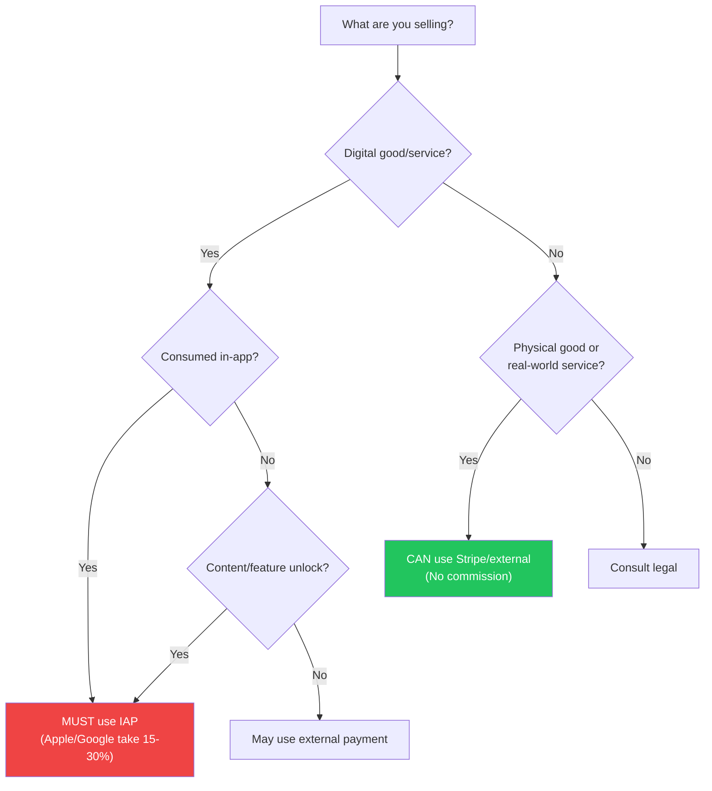
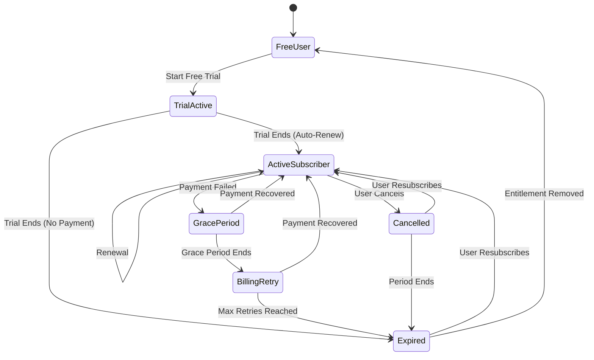

# Mobile Payments

::: tip Key Takeaway
- Apple and Google take a 15-30% commission on in-app purchases and mandate their payment systems for digital goods/services — you cannot use Stripe or your own payment processor for subscriptions, premium features, or virtual currency within the app
- RevenueCat abstracts the massive complexity of cross-platform subscription management — it handles receipt validation, subscription status, grace periods, billing retries, and cross-platform entitlements so you do not have to build this yourself
- Subscription management is orders of magnitude more complex than one-time purchases — you must handle renewals, cancellations, grace periods, billing retries, upgrades, downgrades, offer codes, introductory pricing, and platform differences between iOS and Android
:::

Mobile payments are the most legally, technically, and financially complex part of mobile development. The app stores enforce strict rules about when you must use their in-app purchase (IAP) systems (and pay their commission) versus when you can use a third-party processor like Stripe. Getting this wrong can result in app rejection, removal from the store, or legal action.

The technical complexity is equally daunting. iOS and Android have completely different billing APIs with different receipt formats, different subscription lifecycles, and different error handling. Testing payments requires sandbox environments that behave differently from production. And subscription management introduces state machines that would make any backend engineer weep.

**Related**: [Mobile Security](/mobile-engineering/mobile-security) | [Mobile Deployment](/mobile-engineering/mobile-deployment) | [Mobile Analytics](/mobile-engineering/mobile-analytics)

---

## When to Use What Payment System



| Product Type | Payment System | Commission | Examples |
|-------------|---------------|------------|---------|
| **Digital subscriptions** | IAP required | 15-30% | Spotify Premium, Headspace, Netflix |
| **Virtual currency** | IAP required | 15-30% | Gems, coins, credits |
| **Premium features** | IAP required | 15-30% | Pro upgrade, dark mode unlock |
| **Digital content** | IAP required | 15-30% | E-books, music, courses |
| **Physical goods** | Stripe/external | 0% store commission | Amazon, Shopify, food delivery |
| **Real-world services** | Stripe/external | 0% store commission | Uber rides, Airbnb bookings |
| **Person-to-person** | Stripe/external | 0% store commission | Venmo, PayPal |

::: danger The Reader App Exception
"Reader apps" (apps that provide access to previously purchased content like Netflix, Kindle, Spotify) can link to their website for account creation and subscription management since the 2022 Apple settlement. However, the rules are complex and platform-specific. Consult Apple and Google's current developer guidelines before implementing external payment links.
:::

---

## iOS In-App Purchase (StoreKit 2)

StoreKit 2 (introduced iOS 15) dramatically simplified iOS payments with async/await APIs and server-side receipt validation.

```swift
import StoreKit

// Define your products
enum ProductID: String, CaseIterable {
    case monthlyPremium = "com.myapp.premium.monthly"
    case yearlyPremium = "com.myapp.premium.yearly"
    case lifetimePremium = "com.myapp.premium.lifetime"
    case gemPack100 = "com.myapp.gems.100"
}

class StoreManager: ObservableObject {
    @Published var products: [Product] = []
    @Published var purchasedProductIDs: Set<String> = []
    @Published var isLoading = false

    private var transactionListener: Task<Void, Error>?

    init() {
        // Listen for transactions (renewals, revocations, etc.)
        transactionListener = listenForTransactions()
        Task { await loadProducts() }
        Task { await updatePurchasedProducts() }
    }

    deinit {
        transactionListener?.cancel()
    }

    // Load products from App Store Connect
    func loadProducts() async {
        isLoading = true
        do {
            let productIDs = ProductID.allCases.map(\.rawValue)
            products = try await Product.products(for: Set(productIDs))
            products.sort { $0.price < $1.price }
        } catch {
            print("Failed to load products: \(error)")
        }
        isLoading = false
    }

    // Purchase a product
    func purchase(_ product: Product) async throws -> Transaction? {
        let result = try await product.purchase()

        switch result {
        case .success(let verification):
            let transaction = try checkVerified(verification)
            await transaction.finish()
            await updatePurchasedProducts()
            return transaction

        case .userCancelled:
            return nil

        case .pending:
            // Ask-to-Buy (Family Sharing) — transaction needs parental approval
            return nil

        @unknown default:
            return nil
        }
    }

    // Restore purchases
    func restorePurchases() async {
        try? await AppStore.sync()
        await updatePurchasedProducts()
    }

    // Check current entitlements
    func updatePurchasedProducts() async {
        var purchased: Set<String> = []

        for await result in Transaction.currentEntitlements {
            if case .verified(let transaction) = result {
                purchased.insert(transaction.productID)
            }
        }

        await MainActor.run {
            purchasedProductIDs = purchased
        }
    }

    // Listen for transaction updates (renewals, revocations)
    private func listenForTransactions() -> Task<Void, Error> {
        Task.detached {
            for await result in Transaction.updates {
                if case .verified(let transaction) = result {
                    await transaction.finish()
                    await self.updatePurchasedProducts()
                }
            }
        }
    }

    private func checkVerified<T>(_ result: VerificationResult<T>) throws -> T {
        switch result {
        case .unverified(_, let error):
            throw error
        case .verified(let value):
            return value
        }
    }

    // Check subscription status
    func subscriptionStatus() async -> Product.SubscriptionInfo.Status? {
        guard let product = products.first(where: {
            $0.id == ProductID.monthlyPremium.rawValue ||
            $0.id == ProductID.yearlyPremium.rawValue
        }) else { return nil }

        return try? await product.subscription?.status.first
    }
}

// SwiftUI integration
struct PaywallView: View {
    @StateObject private var store = StoreManager()

    var body: some View {
        VStack(spacing: 20) {
            Text("Upgrade to Premium")
                .font(.title)

            ForEach(store.products) { product in
                ProductButton(product: product) {
                    Task {
                        try? await store.purchase(product)
                    }
                }
            }

            Button("Restore Purchases") {
                Task { await store.restorePurchases() }
            }
            .foregroundColor(.secondary)
        }
    }
}
```

---

## Google Play Billing

```kotlin
import com.android.billingclient.api.*

class BillingManager(
    private val context: Context,
    private val onPurchaseUpdated: (List<Purchase>) -> Unit
) {
    private var billingClient: BillingClient? = null

    fun initialize() {
        billingClient = BillingClient.newBuilder(context)
            .setListener { billingResult, purchases ->
                if (billingResult.responseCode == BillingClient.BillingResponseCode.OK) {
                    purchases?.let { onPurchaseUpdated(it) }
                }
            }
            .enablePendingPurchases()
            .build()

        billingClient?.startConnection(object : BillingClientStateListener {
            override fun onBillingSetupFinished(result: BillingResult) {
                if (result.responseCode == BillingClient.BillingResponseCode.OK) {
                    // Billing client is ready
                    queryProducts()
                }
            }

            override fun onBillingServiceDisconnected() {
                // Retry connection
                initialize()
            }
        })
    }

    fun queryProducts() {
        val params = QueryProductDetailsParams.newBuilder()
            .setProductList(
                listOf(
                    QueryProductDetailsParams.Product.newBuilder()
                        .setProductId("premium_monthly")
                        .setProductType(BillingClient.ProductType.SUBS)
                        .build(),
                    QueryProductDetailsParams.Product.newBuilder()
                        .setProductId("premium_yearly")
                        .setProductType(BillingClient.ProductType.SUBS)
                        .build(),
                    QueryProductDetailsParams.Product.newBuilder()
                        .setProductId("gem_pack_100")
                        .setProductType(BillingClient.ProductType.INAPP)
                        .build()
                )
            )
            .build()

        billingClient?.queryProductDetailsAsync(params) { result, productDetails ->
            if (result.responseCode == BillingClient.BillingResponseCode.OK) {
                // Store product details for display
            }
        }
    }

    fun purchaseSubscription(
        activity: Activity,
        productDetails: ProductDetails,
        offerToken: String
    ) {
        val params = BillingFlowParams.newBuilder()
            .setProductDetailsParamsList(
                listOf(
                    BillingFlowParams.ProductDetailsParams.newBuilder()
                        .setProductDetails(productDetails)
                        .setOfferToken(offerToken)
                        .build()
                )
            )
            .build()

        billingClient?.launchBillingFlow(activity, params)
    }

    // Acknowledge purchases (required within 3 days)
    suspend fun acknowledgePurchase(purchase: Purchase) {
        if (!purchase.isAcknowledged) {
            val params = AcknowledgePurchaseParams.newBuilder()
                .setPurchaseToken(purchase.purchaseToken)
                .build()

            billingClient?.acknowledgePurchase(params) { result ->
                if (result.responseCode == BillingClient.BillingResponseCode.OK) {
                    // Purchase acknowledged
                }
            }
        }
    }

    // Verify purchase on your server
    suspend fun verifyPurchase(purchase: Purchase): Boolean {
        val response = apiClient.post("/payments/verify", mapOf(
            "purchase_token" to purchase.purchaseToken,
            "product_id" to purchase.products.first(),
            "platform" to "android"
        ))
        return response.isSuccessful
    }
}
```

---

## RevenueCat: Cross-Platform Subscription Management

RevenueCat is used by over 30,000 apps including VSCO, Notion (partial), and PhotoRoom. It abstracts the enormous complexity of cross-platform subscription management.

```typescript
// React Native with RevenueCat
import Purchases, {
  PurchasesPackage,
  CustomerInfo,
  LOG_LEVEL,
} from 'react-native-purchases';

// Initialize on app startup
async function initializePurchases() {
  Purchases.setLogLevel(LOG_LEVEL.DEBUG);

  if (Platform.OS === 'ios') {
    await Purchases.configure({ apiKey: 'appl_XXXXXXXX' });
  } else {
    await Purchases.configure({ apiKey: 'goog_XXXXXXXX' });
  }

  // Identify the user (for cross-platform entitlements)
  const { isAnonymous } = await Purchases.getCustomerInfo();
  if (isAnonymous && currentUserId) {
    await Purchases.logIn(currentUserId);
  }
}

// Paywall component
function usePaywall() {
  const [offerings, setOfferings] = useState<PurchasesOffering | null>(null);
  const [isPremium, setIsPremium] = useState(false);
  const [isLoading, setIsLoading] = useState(true);

  useEffect(() => {
    async function load() {
      // Get available products
      const offerings = await Purchases.getOfferings();
      setOfferings(offerings.current);

      // Check current entitlements
      const customerInfo = await Purchases.getCustomerInfo();
      setIsPremium(customerInfo.entitlements.active['premium'] !== undefined);

      setIsLoading(false);
    }

    load();

    // Listen for purchase updates
    Purchases.addCustomerInfoUpdateListener((info) => {
      setIsPremium(info.entitlements.active['premium'] !== undefined);
    });
  }, []);

  const purchase = async (pkg: PurchasesPackage) => {
    try {
      const { customerInfo } = await Purchases.purchasePackage(pkg);
      if (customerInfo.entitlements.active['premium']) {
        return { success: true };
      }
      return { success: false, error: 'Entitlement not active' };
    } catch (error: any) {
      if (error.userCancelled) {
        return { success: false, cancelled: true };
      }
      return { success: false, error: error.message };
    }
  };

  const restore = async () => {
    try {
      const customerInfo = await Purchases.restorePurchases();
      setIsPremium(customerInfo.entitlements.active['premium'] !== undefined);
      return isPremium;
    } catch (error) {
      return false;
    }
  };

  return { offerings, isPremium, isLoading, purchase, restore };
}

// Paywall screen
function PaywallScreen() {
  const { offerings, isPremium, isLoading, purchase, restore } = usePaywall();

  if (isLoading) return <LoadingSpinner />;
  if (isPremium) return <PremiumActiveScreen />;
  if (!offerings) return <ErrorScreen message="Unable to load pricing" />;

  return (
    <View style={styles.container}>
      <Text style={styles.title}>Unlock Premium</Text>

      {offerings.availablePackages.map((pkg) => (
        <TouchableOpacity
          key={pkg.identifier}
          style={styles.packageButton}
          onPress={() => purchase(pkg)}
        >
          <Text style={styles.packageTitle}>{pkg.product.title}</Text>
          <Text style={styles.packagePrice}>{pkg.product.priceString}</Text>
          {pkg.product.introPrice && (
            <Text style={styles.trialText}>
              {pkg.product.introPrice.periodNumberOfUnits}-
              {pkg.product.introPrice.periodUnit.toLowerCase()} free trial
            </Text>
          )}
        </TouchableOpacity>
      ))}

      <TouchableOpacity onPress={restore} style={styles.restoreButton}>
        <Text style={styles.restoreText}>Restore Purchases</Text>
      </TouchableOpacity>

      <Text style={styles.legal}>
        Payment will be charged to your App Store / Google Play account.
        Subscriptions auto-renew unless cancelled at least 24 hours before
        the current period ends.
      </Text>
    </View>
  );
}
```

---

## Subscription Lifecycle



| State | iOS Behavior | Android Behavior | Your App Should |
|-------|-------------|-----------------|-----------------|
| **Trial** | Free period, auto-renews | Free period, auto-renews | Full premium access |
| **Active** | Subscription is current | Subscription is current | Full premium access |
| **Grace period** | 6-16 days of access after failed payment | 7-30 days | Continue premium access |
| **Billing retry** | Up to 60 days of retry | Up to 30 days | Can restrict or continue |
| **Cancelled** | Access until period end | Access until period end | Premium until expiry date |
| **Expired** | No active subscription | No active subscription | Revert to free tier |
| **Refunded** | Transaction reversed | Transaction reversed | Revoke access immediately |

---

## Server-Side Receipt Validation

Never trust the client alone for purchase verification. Always validate on your server.

```typescript
// Server-side receipt validation (Node.js)
import { AppStoreServerAPI, Environment } from '@apple/app-store-server-library';

class ReceiptValidator {
  private appleApi: AppStoreServerAPI;

  constructor() {
    this.appleApi = new AppStoreServerAPI(
      process.env.APPLE_PRIVATE_KEY!,
      process.env.APPLE_KEY_ID!,
      process.env.APPLE_ISSUER_ID!,
      process.env.APPLE_BUNDLE_ID!,
      Environment.PRODUCTION
    );
  }

  // Validate iOS receipt
  async validateAppleTransaction(transactionId: string): Promise<SubscriptionStatus> {
    const statuses = await this.appleApi.getAllSubscriptionStatuses(transactionId);

    for (const group of statuses.data) {
      for (const item of group.lastTransactions) {
        if (item.status === 1) { // Active
          const info = await this.appleApi.getTransactionInfo(item.originalTransactionId);
          return {
            isActive: true,
            expiresAt: new Date(info.signedTransactionInfo.expiresDate),
            productId: info.signedTransactionInfo.productId,
            originalTransactionId: item.originalTransactionId,
          };
        }
      }
    }

    return { isActive: false };
  }

  // Validate Android receipt
  async validateGooglePurchase(
    purchaseToken: string,
    subscriptionId: string
  ): Promise<SubscriptionStatus> {
    const auth = new google.auth.GoogleAuth({
      keyFile: process.env.GOOGLE_SERVICE_ACCOUNT_KEY,
      scopes: ['https://www.googleapis.com/auth/androidpublisher'],
    });

    const androidpublisher = google.androidpublisher({
      version: 'v3',
      auth,
    });

    const response = await androidpublisher.purchases.subscriptionsv2.get({
      packageName: 'com.company.myapp',
      token: purchaseToken,
    });

    const subscription = response.data;
    const isActive = subscription.subscriptionState === 'SUBSCRIPTION_STATE_ACTIVE';

    return {
      isActive,
      expiresAt: subscription.lineItems?.[0]?.expiryTime
        ? new Date(subscription.lineItems[0].expiryTime)
        : null,
      productId: subscriptionId,
    };
  }
}
```

---

## Stripe for Physical Goods

For physical goods and real-world services, use Stripe directly (no app store commission).

```typescript
// React Native Stripe integration
import { useStripe } from '@stripe/stripe-react-native';

function CheckoutScreen({ cartTotal }: { cartTotal: number }) {
  const { initPaymentSheet, presentPaymentSheet } = useStripe();

  const handleCheckout = async () => {
    // 1. Create payment intent on your server
    const response = await apiClient.post('/payments/create-intent', {
      amount: cartTotal,
      currency: 'usd',
    });

    const { clientSecret, ephemeralKey, customerId } = response.data;

    // 2. Initialize the payment sheet
    const { error: initError } = await initPaymentSheet({
      merchantDisplayName: 'MyApp Store',
      paymentIntentClientSecret: clientSecret,
      customerEphemeralKeySecret: ephemeralKey,
      customerId: customerId,
      applePay: {
        merchantCountryCode: 'US',
      },
      googlePay: {
        merchantCountryCode: 'US',
        testEnv: __DEV__,
      },
      defaultBillingDetails: {
        name: user.name,
        email: user.email,
      },
    });

    if (initError) {
      Alert.alert('Error', initError.message);
      return;
    }

    // 3. Present the payment sheet
    const { error: presentError } = await presentPaymentSheet();

    if (presentError) {
      if (presentError.code === 'Canceled') return;
      Alert.alert('Payment failed', presentError.message);
      return;
    }

    // 4. Payment successful
    await createOrder();
    navigation.navigate('OrderConfirmation');
  };

  return (
    <Button title={`Pay $${(cartTotal / 100).toFixed(2)}`} onPress={handleCheckout} />
  );
}
```

---

## When NOT to Use In-App Purchases

- **Physical goods e-commerce** — Amazon, Shopify stores, food delivery. Use Stripe or your own payment processor. The app stores do not take a commission on physical goods.
- **SaaS products where sign-up happens on the web** — If users subscribe on your website, they do not need to repurchase through IAP. You can check their web subscription status in the app.
- **B2B enterprise apps** — Enterprise customers pay via invoices, not IAP. Apple and Google have enterprise distribution mechanisms that bypass the store.
- **Peer-to-peer payments** — Venmo, PayPal, money transfer apps are exempt from IAP requirements.

::: warning Common Misconceptions
**"Apple takes 30% of everything."** Apple takes 30% in year one, dropping to 15% in year two for subscriptions (Small Business Program). Developers earning under $1M/year pay 15% from the start. Google has similar thresholds. For physical goods and real-world services, the commission is 0%.

**"You can just link to your website for payment."** In most cases, no. Apple prohibits "anti-steering" — you cannot tell users to go to your website to pay a lower price. The 2022 settlement allows a single link to your website for account management in "reader apps" (Netflix, Spotify), but the rules are narrow and regularly updated. Check current guidelines.

**"RevenueCat is only for subscriptions."** RevenueCat handles one-time purchases (consumable and non-consumable) as well as subscriptions. It provides the same cross-platform entitlement management and receipt validation for all purchase types.

**"Testing with real money is the only way to test."** Both iOS and Android provide sandbox environments for testing purchases without real charges. iOS uses sandbox Apple ID accounts, Android uses test license accounts. Always test the full purchase flow in sandbox before going live.
:::

---

## Real-World Example: Spotify

Spotify's payment strategy is one of the most analyzed in the industry:

1. **No in-app purchase on iOS** — Spotify refused to pay Apple's 30% commission on subscriptions. Instead, they directed users to subscribe on the web. This led to a years-long antitrust battle.
2. **EU Digital Markets Act (2024)** — In the EU, Spotify can now offer alternative payment methods in-app and link to their website for subscription, following new regulations.
3. **Google Play billing** — Spotify does offer subscription through Google Play Billing in some regions, paying the 15% commission (year 2+ rate).
4. **Revenue optimization** — Spotify offers different pricing tiers, family plans, student discounts, and annual plans to maximize lifetime value. They A/B test pricing and paywall design continuously.
5. **Grace periods** — Spotify gives 7 days of premium access after a failed payment, reducing involuntary churn by an estimated 15%.

---

::: details Quiz

**1. When must you use Apple/Google's in-app purchase system vs a third-party payment processor?**

You MUST use IAP for digital goods and services consumed within the app: subscriptions to app features, virtual currency, premium content unlocks, and digital content (e-books within a reading app). You CAN use a third-party processor for physical goods (e-commerce), real-world services (ride-sharing, food delivery), peer-to-peer payments, and in some cases "reader apps" that provide access to content purchased elsewhere.

**2. What happens if you don't acknowledge a Google Play purchase within 3 days?**

Google automatically refunds the purchase. This is a common bug in Android billing implementations — the developer processes the purchase but forgets to call `acknowledgePurchase()`. The user gets their money back and loses access, creating confusion and support tickets. Always acknowledge purchases immediately after verification.

**3. Why is server-side receipt validation important?**

Client-side receipt data can be spoofed by jailbroken devices, modified APKs, or man-in-the-middle proxies. Without server-side validation, a user could fake a purchase receipt and gain premium access for free. Server-side validation verifies the receipt directly with Apple/Google's servers, ensuring the transaction is legitimate.

**4. What is the difference between consumable and non-consumable in-app purchases?**

Consumable purchases are used once and can be repurchased (e.g., virtual currency, extra lives, boosts). Non-consumable purchases are permanent and can be restored on any device (e.g., ad removal, lifetime premium, level packs). Non-consumable purchases must support the "Restore Purchases" button.

:::

---

::: details Exercise

**Implement a paywall with RevenueCat that:**

1. Shows monthly and yearly pricing
2. Highlights the savings on the yearly plan
3. Supports a 7-day free trial on the yearly plan
4. Handles purchase errors gracefully
5. Shows a "Restore Purchases" option

**Solution:**

```typescript
import React, { useState, useEffect } from 'react';
import { View, Text, TouchableOpacity, Alert, ActivityIndicator } from 'react-native';
import Purchases, { PurchasesPackage } from 'react-native-purchases';

function Paywall({ onClose, onPurchaseSuccess }: PaywallProps) {
  const [packages, setPackages] = useState<PurchasesPackage[]>([]);
  const [isLoading, setIsLoading] = useState(true);
  const [isPurchasing, setIsPurchasing] = useState(false);
  const [selectedPackage, setSelectedPackage] = useState<string | null>(null);

  useEffect(() => {
    loadOfferings();
  }, []);

  async function loadOfferings() {
    try {
      const offerings = await Purchases.getOfferings();
      if (offerings.current) {
        setPackages(offerings.current.availablePackages);
        // Pre-select yearly (best value)
        const yearly = offerings.current.availablePackages.find(
          (p) => p.packageType === 'ANNUAL'
        );
        if (yearly) setSelectedPackage(yearly.identifier);
      }
    } catch (error) {
      Alert.alert('Error', 'Unable to load pricing. Please try again.');
    } finally {
      setIsLoading(false);
    }
  }

  async function handlePurchase() {
    const pkg = packages.find((p) => p.identifier === selectedPackage);
    if (!pkg) return;

    setIsPurchasing(true);
    try {
      const { customerInfo } = await Purchases.purchasePackage(pkg);
      if (customerInfo.entitlements.active['premium']) {
        onPurchaseSuccess();
      }
    } catch (error: any) {
      if (!error.userCancelled) {
        Alert.alert(
          'Purchase Failed',
          error.message || 'Something went wrong. You were not charged.'
        );
      }
    } finally {
      setIsPurchasing(false);
    }
  }

  async function handleRestore() {
    setIsPurchasing(true);
    try {
      const customerInfo = await Purchases.restorePurchases();
      if (customerInfo.entitlements.active['premium']) {
        Alert.alert('Restored', 'Your premium subscription has been restored.');
        onPurchaseSuccess();
      } else {
        Alert.alert('No Subscription Found', 'No active subscription was found for this account.');
      }
    } catch {
      Alert.alert('Error', 'Unable to restore purchases.');
    } finally {
      setIsPurchasing(false);
    }
  }

  function calculateSavings(monthly: PurchasesPackage, yearly: PurchasesPackage): string {
    const monthlyAnnual = monthly.product.price * 12;
    const yearlyPrice = yearly.product.price;
    const savings = Math.round(((monthlyAnnual - yearlyPrice) / monthlyAnnual) * 100);
    return `Save ${savings}%`;
  }

  if (isLoading) return <ActivityIndicator size="large" />;

  const monthly = packages.find((p) => p.packageType === 'MONTHLY');
  const yearly = packages.find((p) => p.packageType === 'ANNUAL');

  return (
    <View style={styles.container}>
      <TouchableOpacity onPress={onClose} style={styles.closeButton}>
        <Text>Close</Text>
      </TouchableOpacity>

      <Text style={styles.title}>Unlock Everything</Text>
      <Text style={styles.subtitle}>
        Get unlimited access to all premium features
      </Text>

      {/* Yearly plan — highlighted */}
      {yearly && (
        <TouchableOpacity
          style={[
            styles.planCard,
            selectedPackage === yearly.identifier && styles.planCardSelected,
          ]}
          onPress={() => setSelectedPackage(yearly.identifier)}
        >
          {monthly && (
            <View style={styles.savingsBadge}>
              <Text style={styles.savingsText}>
                {calculateSavings(monthly, yearly)}
              </Text>
            </View>
          )}
          <Text style={styles.planTitle}>Yearly</Text>
          <Text style={styles.planPrice}>{yearly.product.priceString}/year</Text>
          {yearly.product.introPrice && (
            <Text style={styles.trialText}>
              Includes {yearly.product.introPrice.periodNumberOfUnits}-day free trial
            </Text>
          )}
          {monthly && (
            <Text style={styles.perMonth}>
              {yearly.product.currencyCode}{' '}
              {(yearly.product.price / 12).toFixed(2)}/month
            </Text>
          )}
        </TouchableOpacity>
      )}

      {/* Monthly plan */}
      {monthly && (
        <TouchableOpacity
          style={[
            styles.planCard,
            selectedPackage === monthly.identifier && styles.planCardSelected,
          ]}
          onPress={() => setSelectedPackage(monthly.identifier)}
        >
          <Text style={styles.planTitle}>Monthly</Text>
          <Text style={styles.planPrice}>{monthly.product.priceString}/month</Text>
        </TouchableOpacity>
      )}

      {/* Purchase button */}
      <TouchableOpacity
        style={[styles.purchaseButton, isPurchasing && styles.purchaseButtonDisabled]}
        onPress={handlePurchase}
        disabled={isPurchasing || !selectedPackage}
      >
        {isPurchasing ? (
          <ActivityIndicator color="white" />
        ) : (
          <Text style={styles.purchaseButtonText}>
            {yearly?.product.introPrice && selectedPackage === yearly.identifier
              ? 'Start Free Trial'
              : 'Subscribe Now'}
          </Text>
        )}
      </TouchableOpacity>

      {/* Restore */}
      <TouchableOpacity onPress={handleRestore} disabled={isPurchasing}>
        <Text style={styles.restoreText}>Restore Purchases</Text>
      </TouchableOpacity>

      {/* Legal */}
      <Text style={styles.legal}>
        Subscription auto-renews unless cancelled at least 24 hours before
        the current period ends. Manage subscriptions in your device settings.
      </Text>
    </View>
  );
}
```

Key decisions:
- Yearly plan is pre-selected and highlighted (higher LTV)
- Savings badge shows percentage saved vs monthly
- Free trial text appears when available
- Per-month equivalent shown for yearly plan
- Error handling distinguishes user cancellation from real errors
- Legal text is required by Apple/Google guidelines
- Restore Purchases button is required by Apple

:::

---

> *"Mobile payments are a trust exercise. The user is giving you their money through a tiny screen while standing in a coffee shop. Every error message, every loading state, every confirmation must reinforce that their money is safe."*
