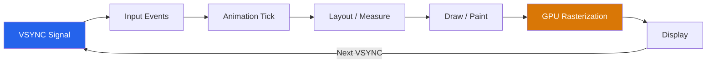
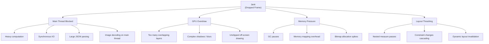
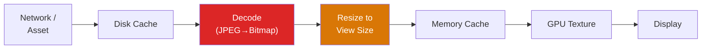
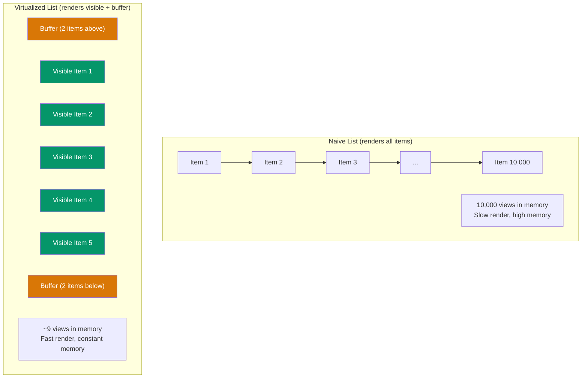
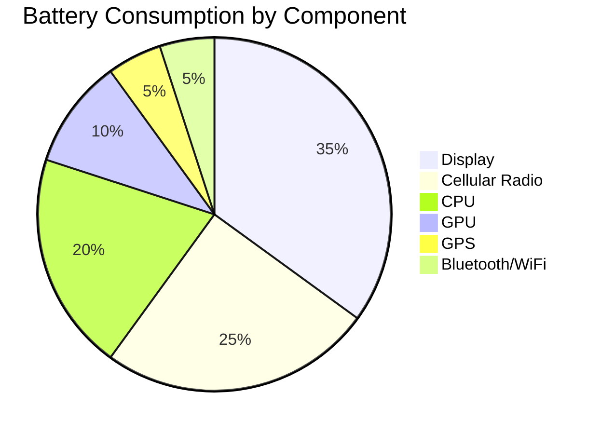
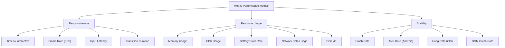

# Mobile Performance

Mobile performance is not web performance on a smaller screen. The constraints are fundamentally different: you are fighting a battery, a thermal throttle, a cellular radio, a process killer, and a GPU that shares its memory with the CPU. A web app that leaks memory gets a tab refresh. A mobile app that leaks memory gets killed by the OS, losing user state without warning.

This page covers the full spectrum of mobile performance: frame rendering, memory management, image pipelines, list virtualization, startup optimization, battery efficiency, and the tools to diagnose every category of performance problem.

**Related**: [Mobile Engineering Overview](/mobile-engineering/) | [React Native Deep Dive](/mobile-engineering/react-native) | [Flutter Architecture](/mobile-engineering/flutter) | [Web Performance](/frontend-engineering/web-performance)

---

## The 60fps Contract

Mobile users expect 60fps (16.67ms per frame). High-refresh-rate devices expect 120fps (8.33ms per frame). Any frame that takes longer than this budget produces visible jank.

```mermaid
gantt
    title Frame Budget at 60fps (16.67ms total)
    dateFormat X
    axisFormat %L ms

    section Ideal Frame
    Input handling        :0, 2
    Layout/measure        :2, 4
    Draw/paint            :4, 8
    GPU render            :8, 12
    Buffer swap           :12, 14
    Headroom              :14, 16

    section Janky Frame
    Input handling        :0, 2
    Expensive layout      :2, 10
    Draw/paint            :10, 16
    GPU render (overflow) :16, 22
    MISSED VSYNC          :milestone, 16, 0
```



### Understanding the Frame Pipeline



| Phase | Budget | What Happens |
|-------|--------|-------------|
| **Input** | ~1ms | Touch events dispatched to handlers |
| **Animation** | ~1ms | Animated values calculated for this frame |
| **Layout** | ~3ms | View hierarchy measured and positioned |
| **Draw** | ~4ms | Display lists / render commands generated |
| **GPU** | ~4ms | Shaders execute, pixels rasterized |
| **Buffer swap** | ~1ms | Frame buffer presented to display |
| **Headroom** | ~3ms | Safety margin for variance |

::: danger Thermal Throttling Destroys Performance
Mobile CPUs and GPUs aggressively throttle when the device heats up. An app that runs at 60fps for the first 5 minutes may drop to 30fps after sustained use — not because your code changed, but because the hardware reduced its clock speed. Always test performance after 10+ minutes of sustained use, especially on mid-range devices.
:::

---

## Jank Detection

### What Causes Jank



### React Native Jank Profiling

```typescript
// Enable the React Native Performance Monitor
import { PerformanceObserver, performance } from 'perf_hooks';

// Custom frame tracking in development
if (__DEV__) {
  let lastFrameTime = performance.now();
  const frameCallback = () => {
    const now = performance.now();
    const frameDuration = now - lastFrameTime;

    if (frameDuration > 16.67) {
      console.warn(
        `Dropped frame: ${frameDuration.toFixed(1)}ms ` +
        `(${Math.floor(frameDuration / 16.67)} frames dropped)`
      );
    }

    lastFrameTime = now;
    requestAnimationFrame(frameCallback);
  };
  requestAnimationFrame(frameCallback);
}

// Measure render performance of specific components
import { Profiler } from 'react';

function onRenderCallback(
  id: string,
  phase: 'mount' | 'update',
  actualDuration: number,
  baseDuration: number,
  startTime: number,
  commitTime: number
) {
  if (actualDuration > 16) {
    console.warn(
      `[Perf] ${id} ${phase}: ${actualDuration.toFixed(1)}ms ` +
      `(base: ${baseDuration.toFixed(1)}ms)`
    );
  }
}

function App() {
  return (
    <Profiler id="ProductList" onRender={onRenderCallback}>
      <ProductList />
    </Profiler>
  );
}
```

### Flutter Jank Profiling

```dart
import 'dart:developer';
import 'dart:ui';

// Enable Flutter's frame timing overlay
void main() {
  // In debug mode, shows frame rendering times
  debugPrintBeginFrameBanner = true;
  debugPrintEndFrameBanner = true;

  runApp(const MyApp());
}

// Custom frame callback for monitoring
class FrameMonitor {
  void start() {
    SchedulerBinding.instance.addTimingsCallback(_onFrameTimings);
  }

  void _onFrameTimings(List<FrameTiming> timings) {
    for (final timing in timings) {
      final buildDuration = timing.buildDuration.inMilliseconds;
      final rasterDuration = timing.rasterDuration.inMilliseconds;
      final totalDuration = timing.totalSpan.inMilliseconds;

      if (totalDuration > 16) {
        Timeline.instantSync('Jank detected', arguments: {
          'build_ms': buildDuration.toString(),
          'raster_ms': rasterDuration.toString(),
          'total_ms': totalDuration.toString(),
        });
      }
    }
  }
}
```

---

## Memory Management

Mobile devices have far less memory than desktops, and the OS aggressively kills background apps to reclaim memory. Understanding mobile memory management is critical for preventing crashes and maintaining smooth performance.

### Memory Hierarchy

| Memory Type | iOS Limit | Android Limit | Recovery |
|-------------|-----------|---------------|----------|
| **Physical RAM** | 4-8 GB (shared with OS) | 4-12 GB (shared) | App killed |
| **Per-app limit** | ~1.5 GB (varies by device) | ~256 MB - 512 MB (heap) | OOM crash |
| **Image memory** | Counted in app limit | Counted in app limit + native heap | Texture eviction |
| **GPU memory** | Shared with CPU | Shared with CPU | Frame drops |

### Common Memory Leaks

::: code-group

```typescript
// React Native: Common memory leak patterns

// LEAK: Event listener not cleaned up
function LocationTracker() {
  useEffect(() => {
    const subscription = Location.watchPositionAsync(
      { accuracy: Location.Accuracy.High },
      (location) => {
        updateMap(location);
      }
    );

    // FIX: Always clean up subscriptions
    return () => {
      subscription.then((sub) => sub.remove());
    };
  }, []);
}

// LEAK: Closure retaining large data
function ImageProcessor() {
  const [images, setImages] = useState<Uint8Array[]>([]);

  const processAll = useCallback(() => {
    // This closure captures `images` — if images is large,
    // the old array stays in memory until the callback is GC'd
    images.forEach((img) => processImage(img));
  }, [images]);  // Re-create when images changes to release old reference
}

// LEAK: Timer not cleared
function PollingComponent() {
  useEffect(() => {
    const interval = setInterval(() => {
      fetchUpdates();
    }, 5000);

    return () => clearInterval(interval);  // CRITICAL: clear on unmount
  }, []);
}
```

```dart
// Flutter: Common memory leak patterns

// LEAK: AnimationController not disposed
class AnimatedWidget extends StatefulWidget {
  @override
  State<AnimatedWidget> createState() => _AnimatedWidgetState();
}

class _AnimatedWidgetState extends State<AnimatedWidget>
    with SingleTickerProviderStateMixin {
  late final AnimationController _controller;

  @override
  void initState() {
    super.initState();
    _controller = AnimationController(
      vsync: this,
      duration: const Duration(milliseconds: 300),
    );
  }

  @override
  void dispose() {
    _controller.dispose();  // CRITICAL: prevents ticker leak
    super.dispose();
  }

  @override
  Widget build(BuildContext context) => /* ... */;
}

// LEAK: Stream subscription not cancelled
class DataListener extends StatefulWidget {
  @override
  State<DataListener> createState() => _DataListenerState();
}

class _DataListenerState extends State<DataListener> {
  late final StreamSubscription _subscription;

  @override
  void initState() {
    super.initState();
    _subscription = dataStream.listen((data) {
      setState(() { /* update */ });
    });
  }

  @override
  void dispose() {
    _subscription.cancel();  // CRITICAL
    super.dispose();
  }

  @override
  Widget build(BuildContext context) => /* ... */;
}
```

:::

::: warning Android Low Memory Killer
Android's Low Memory Killer (LMK) assigns an `oom_adj_score` to each process. When memory is scarce, processes with the highest score are killed first. Background apps get a high score. If your app uses excessive memory even while backgrounded (e.g., holding large bitmaps in memory), it will be killed more aggressively, leading to a poor user experience when the user returns.
:::

---

## Image Optimization

Images are the #1 source of memory issues and the #1 opportunity for performance improvement in most mobile apps.

### Image Pipeline



### Memory Cost of Images

| Image Dimensions | Color Depth | Memory (Uncompressed) |
|-----------------|-------------|----------------------|
| 1080 x 1920 (Full HD) | RGBA (4 bytes/pixel) | 7.9 MB |
| 2160 x 3840 (4K) | RGBA (4 bytes/pixel) | 31.6 MB |
| 4000 x 3000 (Camera photo) | RGBA (4 bytes/pixel) | 45.8 MB |
| 512 x 512 (Thumbnail) | RGBA (4 bytes/pixel) | 1.0 MB |

::: danger A Single Unresized Photo Can Use 46 MB
A 12MP camera photo decoded at full resolution uses ~46 MB of memory — for a single image. If your list displays 10 photos without downsampling, that is 460 MB of memory, which will crash on most Android devices. Always resize images to match their display size before decoding.
:::

### Image Optimization Strategies

::: code-group

```typescript
// React Native: Use expo-image for optimal loading
import { Image } from 'expo-image';

function ProductImage({ uri, width, height }: ImageProps) {
  return (
    <Image
      source={{ uri }}
      style={{ width, height }}
      // Request image at exact display size (accounts for pixel density)
      contentFit="cover"
      // Blurhash placeholder — no layout shift
      placeholder={{ blurhash: 'LEHV6nWB2yk8pyo0adR*.7kCMdnj' }}
      // Aggressive caching
      cachePolicy="memory-disk"
      // Progressive loading
      transition={200}
      // Recycle textures when scrolled off screen
      recyclingKey={uri}
    />
  );
}
```

```dart
// Flutter: Proper image caching and sizing
import 'package:cached_network_image/cached_network_image.dart';

class OptimizedImage extends StatelessWidget {
  final String url;
  final double width;
  final double height;

  const OptimizedImage({
    super.key,
    required this.url,
    required this.width,
    required this.height,
  });

  @override
  Widget build(BuildContext context) {
    final pixelRatio = MediaQuery.devicePixelRatioOf(context);

    return CachedNetworkImage(
      imageUrl: url,
      width: width,
      height: height,
      fit: BoxFit.cover,
      // Request image at device pixel size, not logical size
      memCacheWidth: (width * pixelRatio).toInt(),
      memCacheHeight: (height * pixelRatio).toInt(),
      placeholder: (context, url) => const ShimmerPlaceholder(),
      errorWidget: (context, url, error) => const Icon(Icons.error),
    );
  }
}
```

:::

---

## List Virtualization

Lists are the most common UI pattern in mobile apps. Naive implementations that render all items at once will crash on large datasets.

### How Virtualization Works



### React Native FlatList Optimization

```typescript
import { FlatList, View, Text } from 'react-native';
import { memo, useCallback } from 'react';
import { FlashList } from '@shopify/flash-list';

const ITEM_HEIGHT = 80;

// Memoized item component prevents unnecessary re-renders
const ListItem = memo(function ListItem({ item }: { item: DataItem }) {
  return (
    <View style={[styles.item, { height: ITEM_HEIGHT }]}>
      <Text style={styles.title}>{item.title}</Text>
      <Text style={styles.subtitle}>{item.subtitle}</Text>
    </View>
  );
});

function OptimizedList({ data }: { data: DataItem[] }) {
  const renderItem = useCallback(
    ({ item }: { item: DataItem }) => <ListItem item={item} />,
    []
  );

  const keyExtractor = useCallback((item: DataItem) => item.id, []);

  const getItemLayout = useCallback(
    (_: any, index: number) => ({
      length: ITEM_HEIGHT,
      offset: ITEM_HEIGHT * index,
      index,
    }),
    []
  );

  // FlashList is 5-10x faster than FlatList for large lists
  return (
    <FlashList
      data={data}
      renderItem={renderItem}
      keyExtractor={keyExtractor}
      estimatedItemSize={ITEM_HEIGHT}
      // Performance tuning
      drawDistance={200}  // How far ahead to render (in pixels)
      overrideItemLayout={(layout, item, index) => {
        layout.size = ITEM_HEIGHT;
      }}
    />
  );
}
```

::: tip FlashList vs FlatList
Shopify's `FlashList` is a drop-in replacement for `FlatList` that uses cell recycling (like Android's RecyclerView) instead of unmounting/remounting components. This makes it 5-10x faster for large lists. If your app has lists with more than 100 items, switch to `FlashList`.
:::

### Flutter ListView Optimization

```dart
// For large lists, ALWAYS use ListView.builder (not ListView with children)
class OptimizedProductList extends StatelessWidget {
  final List<Product> products;

  const OptimizedProductList({super.key, required this.products});

  @override
  Widget build(BuildContext context) {
    return ListView.builder(
      // Only builds visible items + buffer
      itemCount: products.length,
      // Fixed extent allows Flutter to skip measurement
      itemExtent: 80.0,
      // Cache items beyond the viewport
      cacheExtent: 200.0,
      // addAutomaticKeepAlives: false reduces memory for off-screen items
      addAutomaticKeepAlives: false,
      addRepaintBoundaries: true,
      itemBuilder: (context, index) {
        return ProductTile(product: products[index]);
      },
    );
  }
}

// For heterogeneous lists with sections
class SectionedList extends StatelessWidget {
  final List<Section> sections;

  const SectionedList({super.key, required this.sections});

  @override
  Widget build(BuildContext context) {
    return CustomScrollView(
      slivers: [
        const SliverAppBar(title: Text('Products'), floating: true),
        for (final section in sections) ...[
          SliverPersistentHeader(
            pinned: true,
            delegate: SectionHeaderDelegate(section.title),
          ),
          SliverList.builder(
            itemCount: section.items.length,
            itemBuilder: (context, index) =>
                ProductTile(product: section.items[index]),
          ),
        ],
      ],
    );
  }
}
```

---

## Startup Time Optimization

App startup time directly impacts user retention. Studies show that 25% of users abandon an app if it takes more than 3 seconds to load.

### Startup Phases

```mermaid
gantt
    title Mobile App Startup Timeline
    dateFormat X
    axisFormat %L ms

    section iOS
    Process creation          :0, 50
    dylib loading             :50, 200
    Runtime init              :200, 300
    Main function             :300, 350
    UIKit init                :350, 500
    First frame               :500, 700
    Data fetch                :700, 1200
    Interactive               :1200, 1500

    section Android
    Process fork (zygote)     :0, 30
    Class loading             :30, 200
    Application.onCreate      :200, 400
    Activity.onCreate         :400, 600
    First layout              :600, 800
    First draw                :800, 1000
    Data fetch                :1000, 1500
    Interactive               :1500, 1800
```



### Optimization Strategies

| Strategy | Impact | Effort | Platform |
|----------|--------|--------|----------|
| **Reduce bundle size** | High | Low | Both |
| **Lazy load screens** | Medium | Low | Both |
| **Defer non-critical initialization** | High | Medium | Both |
| **Use precompiled bytecode (Hermes)** | High | Low | React Native |
| **Tree-shake unused code** | Medium | Low | Flutter |
| **Prefetch data with splash screen** | Medium | Medium | Both |
| **Avoid synchronous I/O in init** | High | Medium | Both |
| **Use static splash screen** | Low | Low | Both |
| **Inline critical data in bundle** | Medium | High | Both |

::: code-group

```typescript
// React Native: Deferred initialization pattern
import { InteractionManager, AppState } from 'react-native';

class AppInitializer {
  static async initialize() {
    // CRITICAL: Do these immediately
    await this.initializeAuth();
    await this.initializeNavigation();

    // DEFERRED: Wait until first frame is rendered
    InteractionManager.runAfterInteractions(() => {
      this.initializeAnalytics();
      this.initializeCrashReporting();
      this.prefetchCriticalData();
      this.registerBackgroundTasks();
    });

    // LAZY: Only when app is idle
    requestIdleCallback(() => {
      this.warmImageCache();
      this.syncOfflineQueue();
      this.checkForUpdates();
    });
  }
}
```

```dart
// Flutter: Deferred initialization
void main() async {
  WidgetsFlutterBinding.ensureInitialized();

  // CRITICAL: Must happen before first frame
  await Firebase.initializeApp();
  await HiveDatabase.initialize();

  runApp(const MyApp());

  // DEFERRED: After first frame renders
  WidgetsBinding.instance.addPostFrameCallback((_) async {
    await AnalyticsService.initialize();
    await CrashReporting.initialize();
    await RemoteConfig.fetchAndActivate();
  });
}
```

:::

---

## Battery Optimization

Mobile users are acutely aware of battery drain. An app that drains battery quickly gets uninstalled.

### Battery Drain Sources



| Activity | Battery Impact | Mitigation |
|----------|---------------|------------|
| **Continuous GPS tracking** | Very High | Use significant location changes instead of continuous |
| **Frequent network requests** | High | Batch requests, use exponential backoff |
| **Background processing** | High | Use platform APIs (BGTaskScheduler, WorkManager) |
| **Keeping screen on** | Very High | Only when genuinely needed (maps, video) |
| **Wake locks** | High | Time-bounded, release immediately when done |
| **Continuous animations** | Medium | Pause when app is backgrounded |
| **Polling** | Medium-High | Replace with push notifications or WebSocket |

::: warning Radio State Machine
The cellular radio has three states: **idle** (low power), **connected** (full power), and a **tail state** (intermediate power for ~10 seconds after transmission). A single small network request forces the radio from idle to connected, then keeps it in the tail state for 10 seconds, consuming power even after the request completes. Batch your network requests to avoid repeatedly triggering this state transition.
:::

```typescript
// React Native: Battery-conscious network batching
class NetworkBatcher {
  private queue: NetworkRequest[] = [];
  private batchTimer: NodeJS.Timeout | null = null;
  private readonly BATCH_INTERVAL = 30000; // 30 seconds
  private readonly MAX_BATCH_SIZE = 20;

  enqueue(request: NetworkRequest): void {
    this.queue.push(request);

    if (this.queue.length >= this.MAX_BATCH_SIZE) {
      this.flush();
    } else if (!this.batchTimer) {
      this.batchTimer = setTimeout(() => this.flush(), this.BATCH_INTERVAL);
    }
  }

  private async flush(): Promise<void> {
    if (this.batchTimer) {
      clearTimeout(this.batchTimer);
      this.batchTimer = null;
    }

    if (this.queue.length === 0) return;

    const batch = this.queue.splice(0);

    try {
      // Single network request for entire batch
      await fetch('/api/batch', {
        method: 'POST',
        body: JSON.stringify({ requests: batch }),
      });
    } catch (error) {
      // Re-queue failed requests
      this.queue.unshift(...batch);
    }
  }
}
```

---

## Profiling Tools

### Platform Profiling Tools

| Tool | Platform | Measures | Best For |
|------|----------|----------|----------|
| **Xcode Instruments** | iOS | CPU, memory, energy, GPU, allocations | Deep native profiling |
| **Android Studio Profiler** | Android | CPU, memory, network, energy | Real-time Android profiling |
| **Flutter DevTools** | Flutter | Widget rebuilds, frame timing, memory | Flutter-specific performance |
| **React Native Perf Monitor** | React Native | JS FPS, UI FPS, RAM | Quick jank detection |
| **Flipper** | React Native | Network, layout, databases, logs | Development debugging |
| **Systrace** | Android | System-level thread analysis | Low-level scheduling issues |
| **MetricKit** | iOS | Crash reports, performance metrics | Production monitoring |

### Key Metrics to Track



| Metric | Good | Needs Work | Critical |
|--------|------|-----------|----------|
| **Startup (cold)** | < 1s | 1-3s | > 3s |
| **Frame rate** | 60fps steady | 45-59fps | < 30fps |
| **Memory (idle)** | < 100 MB | 100-250 MB | > 250 MB |
| **Crash-free sessions** | > 99.5% | 98-99.5% | < 98% |
| **ANR rate** | < 0.1% | 0.1-0.5% | > 0.5% |
| **Battery (1hr active use)** | < 5% | 5-10% | > 10% |

### Production Monitoring

```typescript
// Custom performance tracking for production
interface PerformanceMetric {
  name: string;
  value: number;
  unit: 'ms' | 'bytes' | 'fps' | 'percent';
  tags: Record<string, string>;
  timestamp: number;
}

class PerformanceMonitor {
  private metrics: PerformanceMetric[] = [];

  trackScreenLoad(screenName: string, durationMs: number): void {
    this.record({
      name: 'screen_load',
      value: durationMs,
      unit: 'ms',
      tags: { screen: screenName },
      timestamp: Date.now(),
    });
  }

  trackMemory(): void {
    // React Native: use performance API or native module
    const memInfo = performance.memory;
    this.record({
      name: 'memory_usage',
      value: memInfo.usedJSHeapSize,
      unit: 'bytes',
      tags: { heap: 'js' },
      timestamp: Date.now(),
    });
  }

  private record(metric: PerformanceMetric): void {
    this.metrics.push(metric);

    // Batch and send to analytics backend
    if (this.metrics.length >= 50) {
      this.flush();
    }
  }

  private async flush(): Promise<void> {
    const batch = this.metrics.splice(0);
    await analyticsService.sendMetrics(batch);
  }
}
```

## Performance Checklist

| Category | Check | Impact |
|----------|-------|--------|
| **Images** | Resize to display size before decoding | Memory |
| **Images** | Use progressive loading with placeholders | UX |
| **Images** | Implement disk + memory caching | Speed |
| **Lists** | Use virtualized lists (FlashList / ListView.builder) | Memory + FPS |
| **Lists** | Memoize/const list items | FPS |
| **Lists** | Provide item dimensions when fixed | FPS |
| **Network** | Batch non-urgent requests | Battery |
| **Network** | Cache API responses locally | Speed + Battery |
| **Startup** | Defer non-critical initialization | TTI |
| **Startup** | Use static splash screen during init | UX |
| **Memory** | Dispose controllers, cancel subscriptions | Stability |
| **Memory** | Profile with Instruments / Android Profiler | All |
| **Animations** | Run on UI thread (Reanimated / Impeller) | FPS |
| **Battery** | Pause work when app is backgrounded | Battery |

## Cross-References

- **[Mobile Engineering Overview](/mobile-engineering/)** — Platform fundamentals and architecture decisions
- **[React Native Deep Dive](/mobile-engineering/react-native)** — React Native-specific optimization with Hermes, Fabric, and Reanimated
- **[Flutter Architecture](/mobile-engineering/flutter)** — Flutter rendering pipeline, Impeller, and widget optimization
- **[Web Performance](/frontend-engineering/web-performance)** — Core Web Vitals and browser performance (complementary discipline)
- **[Performance Engineering](/performance/)** — Backend profiling, caching, and system-level optimization

---

> *"Mobile performance is not about making things fast — it is about never making things slow."*
