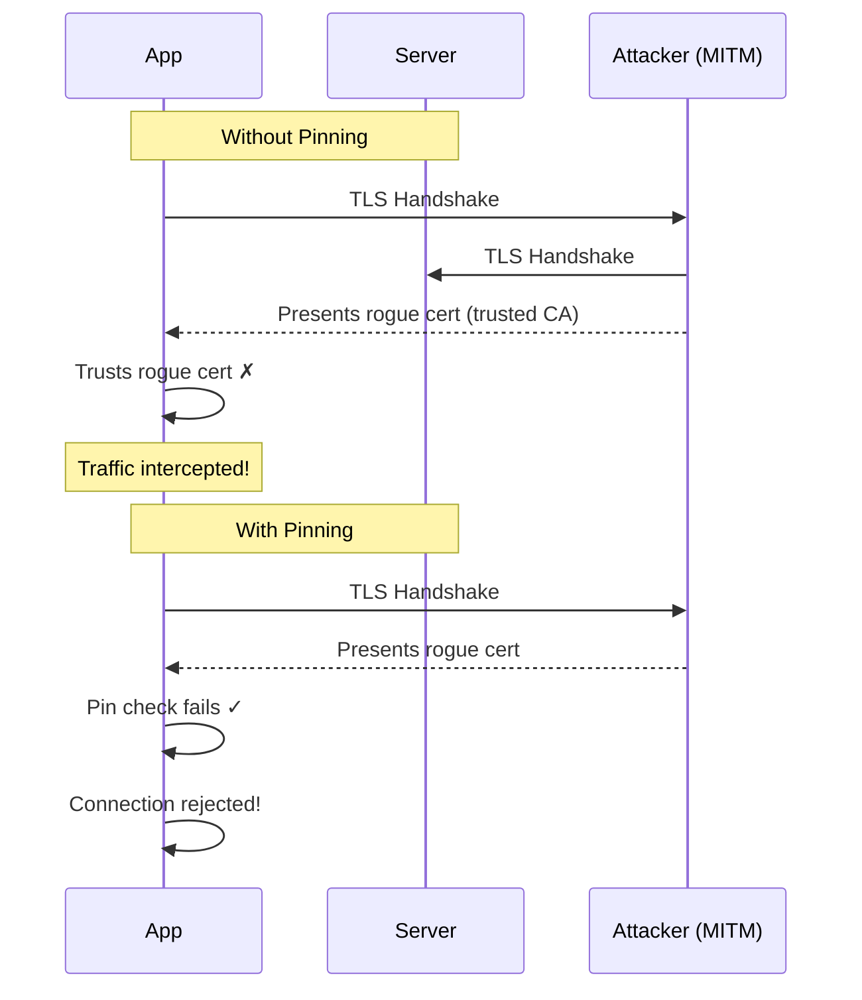

# Mobile Security

::: tip Key Takeaway
- Mobile apps run on hostile territory — the user controls the device, can decompile your binary, intercept network traffic, and modify runtime behavior, so assume your client code is fully visible to attackers
- Certificate pinning, secure storage (Keychain/Keystore), and transport security are baseline requirements, not advanced features — ship them from day one
- The OWASP Mobile Top 10 is your checklist — most mobile security breaches exploit improper credential storage (M1) or insecure communication (M3), not exotic zero-days
:::

Mobile security is fundamentally different from web security because the threat model is inverted. On the web, your code runs on a server you control. On mobile, your code runs on a device the attacker controls. They can decompile your APK in minutes with `jadx`, attach a debugger to your running process with Frida, intercept all network traffic with mitmproxy, and modify your app's behavior at runtime. You cannot prevent this. You can only make it harder and detect when it happens.

The goal of mobile security is defense in depth: make the app resilient enough that the cost of attacking it exceeds the value of what an attacker can gain.

**Related**: [Mobile Networking](/mobile-engineering/mobile-networking) | [Mobile Databases](/mobile-engineering/mobile-databases) | [Mobile Engineering Overview](/mobile-engineering/)

---

## OWASP Mobile Top 10 (2024)

The OWASP Mobile Top 10 is the authoritative list of mobile security risks. Every mobile developer should know these.

```mermaid
graph TD
    M1["M1: Improper Credential Usage"] --> S1["Hardcoded keys, tokens in source"]
    M2["M2: Inadequate Supply Chain Security"] --> S2["Malicious SDKs, compromised deps"]
    M3["M3: Insecure Authentication/Authorization"] --> S3["Weak auth, missing server checks"]
    M4["M4: Insufficient Input/Output Validation"] --> S4["SQL injection, XSS in WebViews"]
    M5["M5: Insecure Communication"] --> S5["No TLS, missing cert pinning"]
    M6["M6: Inadequate Privacy Controls"] --> S6["PII leakage, excessive permissions"]
    M7["M7: Insufficient Binary Protections"] --> S7["No obfuscation, debug builds"]
    M8["M8: Security Misconfiguration"] --> S8["Debug mode, backup enabled"]
    M9["M9: Insecure Data Storage"] --> S9["Plaintext passwords, unencrypted DB"]
    M10["M10: Insufficient Cryptography"] --> S10["Weak algorithms, bad key management"]

    style M1 fill:#ef4444,color:#fff
    style M5 fill:#ef4444,color:#fff
    style M9 fill:#ef4444,color:#fff
```



| Risk | Severity | Prevalence | Example Attack |
|------|----------|-----------|----------------|
| **M1: Improper Credentials** | Critical | Very High | API key extracted from APK → unlimited API access |
| **M3: Insecure Auth** | Critical | High | Missing server-side auth check → privilege escalation |
| **M5: Insecure Communication** | High | High | MITM on public WiFi → session hijack |
| **M9: Insecure Data Storage** | High | Very High | SharedPreferences stores auth token in plaintext |

---

## Certificate Pinning

Certificate pinning ensures your app only trusts specific certificates for your API, preventing man-in-the-middle attacks even if an attacker has installed a rogue CA certificate on the device (common in corporate environments and with tools like Charles Proxy).

### How Certificate Pinning Works



### React Native: TrustKit + SSL Pinning

```typescript
// Using react-native-ssl-pinning
import { fetch as sslFetch } from 'react-native-ssl-pinning';

const API_BASE = 'https://api.myapp.com';

export async function secureFetch(path: string, options: RequestInit = {}) {
  try {
    const response = await sslFetch(`${API_BASE}${path}`, {
      method: options.method || 'GET',
      headers: options.headers as Record<string, string>,
      body: options.body as string,
      // Pin to the Subject Public Key Info (SPKI) hash
      sslPinning: {
        certs: ['api_myapp_com'],  // .cer file in native project
      },
      timeoutInterval: 30000,
    });
    return response;
  } catch (error: any) {
    if (error.message?.includes('SSL')) {
      // Certificate pinning failure — possible MITM attack
      reportSecurityEvent('cert_pinning_failure', {
        path,
        error: error.message,
      });
      throw new SecurityError('Connection security verification failed');
    }
    throw error;
  }
}
```

### iOS: Native Certificate Pinning

```swift
// Using TrustKit for iOS
import TrustKit

class AppDelegate: UIResponder, UIApplicationDelegate {
    func application(
        _ application: UIApplication,
        didFinishLaunchingWithOptions launchOptions: [UIApplication.LaunchOptionsKey: Any]?
    ) -> Bool {

        let trustKitConfig: [String: Any] = [
            kTSKSwizzleNetworkDelegates: false,
            kTSKPinnedDomains: [
                "api.myapp.com": [
                    kTSKEnforcePinning: true,
                    kTSKIncludeSubdomains: true,
                    // Pin to SPKI hashes (SHA-256)
                    // Include current AND backup pin
                    kTSKPublicKeyHashes: [
                        "YLh1dUR9y6Kja30RrAn7JKnbQG/uEtLMkBgFF2Fuihg=",  // Current
                        "sRHdihwgkaib1P1gN7SkKPDEGFFsdahjLqndifeJHQ4=",  // Backup
                    ],
                    // Report pinning failures
                    kTSKReportUris: ["https://reporting.myapp.com/pinning"]
                ]
            ]
        ]

        TrustKit.initSharedInstance(withConfiguration: trustKitConfig)
        return true
    }
}

// Custom URLSession with pinning
class SecureNetworkService {
    private lazy var session: URLSession = {
        let config = URLSessionConfiguration.default
        config.tlsMinimumSupportedProtocolVersion = .TLSv12
        return URLSession(
            configuration: config,
            delegate: self,
            delegateQueue: nil
        )
    }()

    func request(_ url: URL) async throws -> Data {
        let (data, response) = try await session.data(from: url)
        guard let httpResponse = response as? HTTPURLResponse,
              (200...299).contains(httpResponse.statusCode) else {
            throw NetworkError.invalidResponse
        }
        return data
    }
}

extension SecureNetworkService: URLSessionDelegate {
    func urlSession(
        _ session: URLSession,
        didReceive challenge: URLAuthenticationChallenge
    ) async -> (URLSession.AuthChallengeDisposition, URLCredential?) {

        guard let trust = challenge.protectionSpace.serverTrust,
              TrustKit.sharedInstance().pinningValidator.handle(
                challenge,
                completionHandler: { _, _ in }
              ) else {
            return (.cancelAuthenticationChallenge, nil)
        }
        return (.useCredential, URLCredential(trust: trust))
    }
}
```

### Android: Network Security Config + OkHttp

```xml
<!-- res/xml/network_security_config.xml -->
<?xml version="1.0" encoding="utf-8"?>
<network-security-config>
    <!-- Production: pin to specific certificates -->
    <domain-config cleartextTrafficPermitted="false">
        <domain includeSubdomains="true">api.myapp.com</domain>
        <pin-set expiration="2025-06-01">
            <!-- SHA-256 of Subject Public Key Info -->
            <pin digest="SHA-256">YLh1dUR9y6Kja30RrAn7JKnbQG/uEtLMkBgFF2Fuihg=</pin>
            <!-- Backup pin (different CA) -->
            <pin digest="SHA-256">sRHdihwgkaib1P1gN7SkKPDEGFFsdahjLqndifeJHQ4=</pin>
        </pin-set>
    </domain-config>

    <!-- Debug builds: allow user-installed CAs for Charles/Proxyman -->
    <debug-overrides>
        <trust-anchors>
            <certificates src="user" />
            <certificates src="system" />
        </trust-anchors>
    </debug-overrides>
</network-security-config>
```

```kotlin
// OkHttp with certificate pinning
val client = OkHttpClient.Builder()
    .certificatePinner(
        CertificatePinner.Builder()
            .add(
                "api.myapp.com",
                "sha256/YLh1dUR9y6Kja30RrAn7JKnbQG/uEtLMkBgFF2Fuihg=",
                "sha256/sRHdihwgkaib1P1gN7SkKPDEGFFsdahjLqndifeJHQ4="
            )
            .build()
    )
    .build()
```

::: danger Always Include a Backup Pin
If you pin to a single certificate and that certificate expires or is rotated, your app will be unable to connect to your API. Always include at least one backup pin from a different CA. Some teams use a "pin rotation" mechanism where the server can signal new pins via a header.
:::

---

## Secure Storage

### iOS: Keychain Services

The iOS Keychain is hardware-backed secure storage. Data stored in the Keychain is encrypted, survives app reinstalls (depending on accessibility settings), and is protected by the device passcode and Secure Enclave.

```swift
import Security

enum KeychainError: Error {
    case duplicateItem
    case itemNotFound
    case unexpectedStatus(OSStatus)
}

class KeychainService {
    static let shared = KeychainService()

    func save(key: String, data: Data, accessibility: CFString = kSecAttrAccessibleWhenUnlockedThisDeviceOnly) throws {
        let query: [String: Any] = [
            kSecClass as String: kSecClassGenericPassword,
            kSecAttrAccount as String: key,
            kSecValueData as String: data,
            kSecAttrAccessible as String: accessibility
        ]

        // Delete existing item first
        SecItemDelete(query as CFDictionary)

        let status = SecItemAdd(query as CFDictionary, nil)
        guard status == errSecSuccess else {
            throw KeychainError.unexpectedStatus(status)
        }
    }

    func read(key: String) throws -> Data {
        let query: [String: Any] = [
            kSecClass as String: kSecClassGenericPassword,
            kSecAttrAccount as String: key,
            kSecReturnData as String: true,
            kSecMatchLimit as String: kSecMatchLimitOne
        ]

        var result: AnyObject?
        let status = SecItemCopyMatching(query as CFDictionary, &result)

        guard status == errSecSuccess, let data = result as? Data else {
            throw KeychainError.itemNotFound
        }
        return data
    }

    func delete(key: String) throws {
        let query: [String: Any] = [
            kSecClass as String: kSecClassGenericPassword,
            kSecAttrAccount as String: key
        ]
        let status = SecItemDelete(query as CFDictionary)
        guard status == errSecSuccess || status == errSecItemNotFound else {
            throw KeychainError.unexpectedStatus(status)
        }
    }
}

// Usage
let token = "eyJhbGciOiJIUzI1NiIs...".data(using: .utf8)!
try KeychainService.shared.save(key: "auth_token", data: token)
let retrieved = try KeychainService.shared.read(key: "auth_token")
```

### Keychain Accessibility Levels

| Level | When Accessible | Survives Reinstall | Use Case |
|-------|----------------|-------------------|----------|
| `kSecAttrAccessibleWhenUnlocked` | Device unlocked | Yes | General tokens |
| `kSecAttrAccessibleWhenUnlockedThisDeviceOnly` | Device unlocked | No | Sensitive tokens |
| `kSecAttrAccessibleAfterFirstUnlock` | After first unlock since boot | Yes | Background refresh tokens |
| `kSecAttrAccessibleWhenPasscodeSetThisDeviceOnly` | Device has passcode + unlocked | No | Most sensitive data |

### Android: EncryptedSharedPreferences + Keystore

```kotlin
import androidx.security.crypto.EncryptedSharedPreferences
import androidx.security.crypto.MasterKey

class SecureStorage(private val context: Context) {

    private val masterKey = MasterKey.Builder(context)
        .setKeyScheme(MasterKey.KeyScheme.AES256_GCM)
        .setRequestStrongBoxBacked(true)  // Use hardware security module if available
        .build()

    private val securePrefs = EncryptedSharedPreferences.create(
        context,
        "secure_prefs",
        masterKey,
        EncryptedSharedPreferences.PrefKeyEncryptionScheme.AES256_SIV,
        EncryptedSharedPreferences.PrefValueEncryptionScheme.AES256_GCM
    )

    fun saveToken(key: String, token: String) {
        securePrefs.edit().putString(key, token).apply()
    }

    fun getToken(key: String): String? {
        return securePrefs.getString(key, null)
    }

    fun deleteToken(key: String) {
        securePrefs.edit().remove(key).apply()
    }

    fun clearAll() {
        securePrefs.edit().clear().apply()
    }
}

// For sensitive cryptographic operations, use Keystore directly
import java.security.KeyStore
import javax.crypto.Cipher
import javax.crypto.KeyGenerator
import javax.crypto.spec.GCMParameterSpec

class KeystoreEncryption {
    companion object {
        private const val KEY_ALIAS = "myapp_encryption_key"
        private const val TRANSFORMATION = "AES/GCM/NoPadding"
    }

    init {
        if (!keyExists()) generateKey()
    }

    private fun keyExists(): Boolean {
        val keyStore = KeyStore.getInstance("AndroidKeyStore").apply { load(null) }
        return keyStore.containsAlias(KEY_ALIAS)
    }

    private fun generateKey() {
        val keyGenerator = KeyGenerator.getInstance(
            KeyProperties.KEY_ALGORITHM_AES, "AndroidKeyStore"
        )
        keyGenerator.init(
            KeyGenParameterSpec.Builder(
                KEY_ALIAS,
                KeyProperties.PURPOSE_ENCRYPT or KeyProperties.PURPOSE_DECRYPT
            )
                .setBlockModes(KeyProperties.BLOCK_MODE_GCM)
                .setEncryptionPaddings(KeyProperties.ENCRYPTION_PADDING_NONE)
                .setUserAuthenticationRequired(false)
                .setRandomizedEncryptionRequired(true)
                .build()
        )
        keyGenerator.generateKey()
    }

    fun encrypt(plaintext: ByteArray): Pair<ByteArray, ByteArray> {
        val keyStore = KeyStore.getInstance("AndroidKeyStore").apply { load(null) }
        val key = keyStore.getKey(KEY_ALIAS, null)

        val cipher = Cipher.getInstance(TRANSFORMATION)
        cipher.init(Cipher.ENCRYPT_MODE, key)

        val iv = cipher.iv
        val ciphertext = cipher.doFinal(plaintext)
        return Pair(iv, ciphertext)
    }

    fun decrypt(iv: ByteArray, ciphertext: ByteArray): ByteArray {
        val keyStore = KeyStore.getInstance("AndroidKeyStore").apply { load(null) }
        val key = keyStore.getKey(KEY_ALIAS, null)

        val cipher = Cipher.getInstance(TRANSFORMATION)
        cipher.init(Cipher.DECRYPT_MODE, key, GCMParameterSpec(128, iv))

        return cipher.doFinal(ciphertext)
    }
}
```

### React Native: Secure Storage

```typescript
// Using react-native-keychain (iOS Keychain + Android Keystore)
import * as Keychain from 'react-native-keychain';

class SecureTokenStorage {
  static async saveAuthToken(token: string): Promise<void> {
    await Keychain.setGenericPassword('auth_token', token, {
      accessible: Keychain.ACCESSIBLE.WHEN_UNLOCKED_THIS_DEVICE_ONLY,
      service: 'com.myapp.auth',
    });
  }

  static async getAuthToken(): Promise<string | null> {
    const credentials = await Keychain.getGenericPassword({
      service: 'com.myapp.auth',
    });
    return credentials ? credentials.password : null;
  }

  static async deleteAuthToken(): Promise<void> {
    await Keychain.resetGenericPassword({ service: 'com.myapp.auth' });
  }

  // For biometric-protected access
  static async saveSensitiveData(key: string, value: string): Promise<void> {
    await Keychain.setGenericPassword(key, value, {
      accessible: Keychain.ACCESSIBLE.WHEN_PASSCODE_SET_THIS_DEVICE_ONLY,
      accessControl: Keychain.ACCESS_CONTROL.BIOMETRY_CURRENT_SET,
      service: `com.myapp.sensitive.${key}`,
    });
  }

  static async getSensitiveData(key: string): Promise<string | null> {
    try {
      const credentials = await Keychain.getGenericPassword({
        service: `com.myapp.sensitive.${key}`,
        authenticationPrompt: {
          title: 'Authenticate to access sensitive data',
        },
      });
      return credentials ? credentials.password : null;
    } catch {
      return null; // Biometric auth failed or cancelled
    }
  }
}
```

::: warning Common Misconceptions
**"SharedPreferences / AsyncStorage is fine for tokens."** No. SharedPreferences on Android stores data in plaintext XML in the app's data directory. AsyncStorage in React Native uses SharedPreferences on Android and an unencrypted SQLite database on iOS. A rooted device can read these in seconds. Always use Keychain (iOS) or EncryptedSharedPreferences (Android) for any sensitive data.

**"Obfuscation = security."** ProGuard/R8 and Swift symbol stripping make reverse engineering harder, but they do not make it impossible. A determined attacker with Frida and jadx can still extract API keys, reverse your business logic, and patch your binary. Obfuscation is one layer of defense, not a security guarantee.

**"Certificate pinning prevents all MITM attacks."** Certificate pinning prevents MITM attacks from rogue CAs, but an attacker with a rooted device can use Frida to hook the TLS validation functions and bypass pinning entirely. Pinning raises the bar significantly but does not eliminate the threat on compromised devices.
:::

---

## Jailbreak and Root Detection

Detecting jailbroken (iOS) or rooted (Android) devices lets you adjust your app's behavior for higher-risk environments. Banking apps (Chase, Revolut) block functionality on jailbroken devices. Other apps simply log the status for risk scoring.

### iOS Jailbreak Detection

```swift
class JailbreakDetector {

    static func isJailbroken() -> Bool {
        #if targetEnvironment(simulator)
        return false
        #endif

        // Check for common jailbreak files
        let jailbreakPaths = [
            "/Applications/Cydia.app",
            "/Applications/Sileo.app",
            "/Library/MobileSubstrate/MobileSubstrate.dylib",
            "/bin/bash",
            "/usr/sbin/sshd",
            "/etc/apt",
            "/private/var/lib/apt/",
            "/usr/bin/ssh",
            "/var/lib/cydia",
            "/var/cache/apt",
            "/var/lib/dpkg/status",
            "/private/var/stash"
        ]

        for path in jailbreakPaths {
            if FileManager.default.fileExists(atPath: path) {
                return true
            }
        }

        // Check if app can write outside sandbox
        let testPath = "/private/jailbreaktest.txt"
        do {
            try "test".write(toFile: testPath, atomically: true, encoding: .utf8)
            try FileManager.default.removeItem(atPath: testPath)
            return true // Should not be able to write here
        } catch {
            // Expected on non-jailbroken device
        }

        // Check if app can open Cydia URL scheme
        if let url = URL(string: "cydia://package/com.example.package"),
           UIApplication.shared.canOpenURL(url) {
            return true
        }

        // Check if system libraries have been tampered with
        if canLoadDylib() {
            return true
        }

        return false
    }

    private static func canLoadDylib() -> Bool {
        // Check for Substrate or Substitute hooking frameworks
        let suspiciousLibs = [
            "SubstrateLoader.dylib",
            "SSLKillSwitch2.dylib",
            "0Shadow.dylib",
            "FridaGadget.dylib",
            "frida-agent.dylib"
        ]

        for lib in suspiciousLibs {
            if dlopen(lib, RTLD_NOW) != nil {
                return true
            }
        }
        return false
    }
}
```

### Android Root Detection

```kotlin
class RootDetector(private val context: Context) {

    fun isRooted(): Boolean {
        return checkRootBinaries() ||
               checkSuExists() ||
               checkRootManagementApps() ||
               checkDangerousProps() ||
               checkRWPaths() ||
               checkTestKeys()
    }

    private fun checkRootBinaries(): Boolean {
        val paths = arrayOf(
            "/system/bin/su", "/system/xbin/su",
            "/sbin/su", "/system/su",
            "/data/local/su", "/data/local/xbin/su",
            "/data/local/bin/su"
        )
        return paths.any { File(it).exists() }
    }

    private fun checkSuExists(): Boolean {
        return try {
            Runtime.getRuntime().exec("which su")
                .inputStream.bufferedReader().readLine() != null
        } catch (e: Exception) {
            false
        }
    }

    private fun checkRootManagementApps(): Boolean {
        val packages = listOf(
            "com.topjohnwu.magisk",        // Magisk
            "eu.chainfire.supersu",          // SuperSU
            "com.koushikdutta.superuser",    // Superuser
            "com.noshufou.android.su",       // Superuser (old)
            "me.phh.superuser",              // phh Superuser
            "com.thirdparty.superuser"
        )

        val pm = context.packageManager
        return packages.any { pkg ->
            try {
                pm.getPackageInfo(pkg, 0)
                true
            } catch (e: PackageManager.NameNotFoundException) {
                false
            }
        }
    }

    private fun checkTestKeys(): Boolean {
        val buildTags = android.os.Build.TAGS
        return buildTags != null && buildTags.contains("test-keys")
    }

    private fun checkDangerousProps(): Boolean {
        return try {
            val process = Runtime.getRuntime().exec("getprop ro.debuggable")
            val reader = process.inputStream.bufferedReader()
            reader.readLine()?.trim() == "1"
        } catch (e: Exception) {
            false
        }
    }

    private fun checkRWPaths(): Boolean {
        return try {
            val process = Runtime.getRuntime().exec("mount")
            val reader = process.inputStream.bufferedReader()
            reader.lines().anyMatch { line ->
                line.contains("/system") && line.contains("rw")
            }
        } catch (e: Exception) {
            false
        }
    }
}
```

### Using SafetyNet / Play Integrity (Android)

Google's Play Integrity API (successor to SafetyNet) provides server-verified device attestation — much harder to bypass than local checks.

```kotlin
import com.google.android.play.core.integrity.IntegrityManagerFactory

class PlayIntegrityChecker(private val context: Context) {

    suspend fun checkIntegrity(): IntegrityResult {
        val integrityManager = IntegrityManagerFactory.create(context)

        // Request a nonce from your server
        val nonce = fetchNonceFromServer()

        val request = IntegrityTokenRequest.builder()
            .setNonce(nonce)
            .build()

        return try {
            val response = integrityManager.requestIntegrityToken(request).await()
            // Send token to your server for verification
            verifyOnServer(response.token())
        } catch (e: Exception) {
            IntegrityResult.Error(e.message ?: "Unknown error")
        }
    }

    private suspend fun verifyOnServer(token: String): IntegrityResult {
        // Server decrypts and verifies the token with Google's API
        val response = apiClient.post("/verify-integrity", mapOf("token" to token))
        return when {
            response.deviceRecognitionVerdict.contains("MEETS_DEVICE_INTEGRITY") ->
                IntegrityResult.Trusted
            else -> IntegrityResult.Untrusted(response.deviceRecognitionVerdict)
        }
    }
}

sealed class IntegrityResult {
    object Trusted : IntegrityResult()
    data class Untrusted(val reason: List<String>) : IntegrityResult()
    data class Error(val message: String) : IntegrityResult()
}
```

---

## Binary Protection

### ProGuard / R8 (Android)

```groovy
// app/build.gradle
android {
    buildTypes {
        release {
            minifyEnabled true
            shrinkResources true
            proguardFiles getDefaultProguardFile('proguard-android-optimize.txt'),
                         'proguard-rules.pro'
        }
    }
}
```

```pro
# proguard-rules.pro

# Keep API models (needed for serialization)
-keep class com.myapp.data.models.** { *; }

# Keep Retrofit interfaces
-keep,allowobfuscation interface com.myapp.data.api.**

# Obfuscate everything else aggressively
-repackageclasses ''
-allowaccessmodification
-overloadaggressively

# Remove logging in release
-assumenosideeffects class android.util.Log {
    public static int d(...);
    public static int v(...);
    public static int i(...);
}

# Anti-tampering: detect if the app has been repackaged
-keep class com.myapp.security.IntegrityChecker { *; }
```

### Runtime Tamper Detection

```kotlin
class IntegrityChecker(private val context: Context) {

    fun verifyAppIntegrity(): Boolean {
        return verifySignature() && verifyInstaller() && verifyDebugger()
    }

    // Check that the APK signature matches your release signing key
    private fun verifySignature(): Boolean {
        val expectedSignature = "A1:B2:C3:D4:E5..."  // Your release cert SHA-256
        val packageInfo = context.packageManager.getPackageInfo(
            context.packageName,
            PackageManager.GET_SIGNING_CERTIFICATES
        )
        val signatures = packageInfo.signingInfo.apkContentsSigners
        return signatures.any { sig ->
            val digest = MessageDigest.getInstance("SHA-256")
            val hash = digest.digest(sig.toByteArray())
            hash.toHexString() == expectedSignature
        }
    }

    // Check that the app was installed from Google Play
    private fun verifyInstaller(): Boolean {
        val installer = context.packageManager
            .getInstallSourceInfo(context.packageName)
            .installingPackageName
        return installer == "com.android.vending"  // Google Play Store
    }

    // Check for attached debuggers
    private fun verifyDebugger(): Boolean {
        return !Debug.isDebuggerConnected() &&
               !Debug.waitingForDebugger()
    }
}
```

---

## Secure Network Communication

```typescript
// Comprehensive secure API client for React Native
import { Platform } from 'react-native';
import * as Keychain from 'react-native-keychain';

class SecureApiClient {
  private baseUrl: string;
  private deviceId: string;

  constructor(baseUrl: string, deviceId: string) {
    this.baseUrl = baseUrl;
    this.deviceId = deviceId;
  }

  async request<T>(
    path: string,
    options: {
      method?: string;
      body?: unknown;
      requiresAuth?: boolean;
    } = {}
  ): Promise<T> {
    const { method = 'GET', body, requiresAuth = true } = options;

    const headers: Record<string, string> = {
      'Content-Type': 'application/json',
      'X-Platform': Platform.OS,
      'X-App-Version': getAppVersion(),
      'X-Device-ID': this.deviceId,
      // Request ID for tracing
      'X-Request-ID': generateUUID(),
    };

    if (requiresAuth) {
      const token = await SecureTokenStorage.getAuthToken();
      if (!token) throw new AuthError('No auth token');
      headers['Authorization'] = `Bearer ${token}`;
    }

    const response = await fetch(`${this.baseUrl}${path}`, {
      method,
      headers,
      body: body ? JSON.stringify(body) : undefined,
    });

    // Handle token refresh
    if (response.status === 401 && requiresAuth) {
      const refreshed = await this.refreshToken();
      if (refreshed) {
        return this.request(path, options); // Retry once
      }
      throw new AuthError('Session expired');
    }

    if (!response.ok) {
      throw new ApiError(response.status, await response.text());
    }

    return response.json();
  }

  private async refreshToken(): Promise<boolean> {
    try {
      const refreshToken = await SecureTokenStorage.getRefreshToken();
      if (!refreshToken) return false;

      const response = await fetch(`${this.baseUrl}/auth/refresh`, {
        method: 'POST',
        headers: { 'Content-Type': 'application/json' },
        body: JSON.stringify({ refresh_token: refreshToken }),
      });

      if (!response.ok) return false;

      const { access_token, refresh_token } = await response.json();
      await SecureTokenStorage.saveAuthToken(access_token);
      await SecureTokenStorage.saveRefreshToken(refresh_token);
      return true;
    } catch {
      return false;
    }
  }
}
```

---

## When NOT to Invest in Advanced Security

- **Internal enterprise apps** distributed via MDM where the device fleet is managed. Certificate pinning and jailbreak detection add friction without meaningful security gains because the devices are already controlled.
- **Open-source apps** where the source code is public anyway. Obfuscation and anti-tampering provide zero value. Focus on server-side security instead.
- **Prototype / MVP stage** where you have no users and no valuable data. Implement basic security (HTTPS, Keychain for tokens) but skip certificate pinning, root detection, and binary hardening until you have something worth protecting.
- **Apps with no sensitive data** — a calculator or a flashlight app does not need certificate pinning.

---

## Real-World Example: Revolut

Revolut, the fintech super-app with 35+ million users, implements one of the most comprehensive mobile security stacks in the industry:

1. **Certificate pinning** with automatic pin rotation via config update
2. **Jailbreak/root detection** that blocks banking features on compromised devices
3. **Runtime application self-protection (RASP)** that detects Frida, debugger attachment, and hooking frameworks
4. **Biometric authentication** required for high-value transactions
5. **Device binding** — the auth token is cryptographically bound to a specific device using the Secure Enclave (iOS) or StrongBox Keystore (Android)
6. **Screenshot prevention** — the app blanks the screen in the app switcher and blocks screenshots on sensitive screens
7. **Remote wipe** capability — if a device is reported stolen, the server can instruct the app to clear all local data on next launch

---

::: details Quiz

**1. Why should you pin to the SPKI hash rather than the certificate itself?**

The SPKI (Subject Public Key Info) hash remains the same when a certificate is renewed with the same key pair. If you pin to the full certificate, your app will break every time the certificate is renewed, which typically happens annually. SPKI pinning gives you stability across renewals as long as the server key doesn't change.

**2. What is the difference between `kSecAttrAccessibleWhenUnlocked` and `kSecAttrAccessibleWhenUnlockedThisDeviceOnly`?**

Both require the device to be unlocked. The difference is backup behavior: `WhenUnlocked` data is included in iCloud/iTunes backups and migrated when restoring to a new device. `ThisDeviceOnly` data is NOT backed up and does NOT migrate, making it more secure for authentication tokens that should be device-specific.

**3. Why is Play Integrity API more reliable than local root detection?**

Local root detection runs on the device the attacker controls, so they can use Frida to hook and bypass every check. Play Integrity API generates a cryptographic attestation token that is verified server-side by Google. The attacker would need to compromise Google's attestation infrastructure to bypass it, which is orders of magnitude harder than hooking a local function.

**4. What happens if you lose your certificate pinning backup pin and need to rotate your server certificate to a new key?**

If your app only has pins for the old key and you rotate to a new key, all existing app installations will be unable to connect to your API. The app becomes bricked for networking until users update to a new version with the correct pins. This is why backup pins and pin rotation mechanisms are critical.

:::

---

::: details Exercise

**Build a secure authentication flow for a React Native banking app that:**

1. Stores tokens in Keychain/Keystore (not AsyncStorage)
2. Implements biometric re-authentication for sensitive actions
3. Detects jailbreak/root and shows a warning
4. Clears all credentials on tamper detection

**Solution:**

```typescript
import * as Keychain from 'react-native-keychain';
import { Platform, Alert } from 'react-native';
import { check, RESULTS } from 'react-native-permissions';

// 1. Secure token storage
class AuthStorage {
  private static readonly AUTH_SERVICE = 'com.bank.auth';
  private static readonly BIOMETRIC_SERVICE = 'com.bank.biometric';

  static async saveSession(accessToken: string, refreshToken: string) {
    await Keychain.setGenericPassword('access', accessToken, {
      service: this.AUTH_SERVICE,
      accessible: Keychain.ACCESSIBLE.WHEN_UNLOCKED_THIS_DEVICE_ONLY,
    });
    await Keychain.setGenericPassword('refresh', refreshToken, {
      service: `${this.AUTH_SERVICE}.refresh`,
      accessible: Keychain.ACCESSIBLE.WHEN_UNLOCKED_THIS_DEVICE_ONLY,
    });
  }

  static async getAccessToken(): Promise<string | null> {
    const creds = await Keychain.getGenericPassword({ service: this.AUTH_SERVICE });
    return creds ? creds.password : null;
  }

  // 2. Biometric-protected access for sensitive operations
  static async authenticateForSensitiveAction(): Promise<boolean> {
    try {
      const result = await Keychain.getGenericPassword({
        service: this.BIOMETRIC_SERVICE,
        authenticationPrompt: {
          title: 'Verify your identity',
          subtitle: 'Required for this transaction',
          cancel: 'Cancel',
        },
      });
      return result !== false;
    } catch {
      return false;
    }
  }

  // 4. Wipe everything
  static async clearAll() {
    await Keychain.resetGenericPassword({ service: this.AUTH_SERVICE });
    await Keychain.resetGenericPassword({ service: `${this.AUTH_SERVICE}.refresh` });
    await Keychain.resetGenericPassword({ service: this.BIOMETRIC_SERVICE });
  }
}

// 3. Security check on app launch
class SecurityChecker {
  static async performChecks(): Promise<{
    isSecure: boolean;
    issues: string[];
  }> {
    const issues: string[] = [];

    // Check jailbreak/root (using react-native-jail-monkey or similar)
    const JailMonkey = require('jail-monkey').default;
    if (JailMonkey.isJailBroken()) {
      issues.push('Device appears to be jailbroken/rooted');
    }
    if (JailMonkey.hookDetected()) {
      issues.push('Runtime hooking framework detected');
    }
    if (JailMonkey.isDebuggedMode()) {
      issues.push('Debugger attached');
    }

    return {
      isSecure: issues.length === 0,
      issues,
    };
  }
}

// App startup flow
async function initApp() {
  const security = await SecurityChecker.performChecks();

  if (!security.isSecure) {
    // Log the security event to your server
    await reportSecurityEvent(security.issues);

    if (security.issues.includes('Runtime hooking framework detected')) {
      // Tamper detected — wipe credentials immediately
      await AuthStorage.clearAll();
      Alert.alert(
        'Security Alert',
        'This device has been compromised. For your protection, you have been logged out.',
      );
      return;
    }

    // Jailbreak only — warn but allow with limited functionality
    Alert.alert(
      'Security Warning',
      'This device may be compromised. Some features will be restricted.',
    );
  }

  // Continue normal app initialization...
}
```

Key decisions:
- Tokens use `WHEN_UNLOCKED_THIS_DEVICE_ONLY` so they don't sync to iCloud backups
- Biometric auth is required for sensitive actions, not just login
- Hooking detection triggers immediate credential wipe (more aggressive than jailbreak alone)
- Jailbreak shows a warning but doesn't completely block the app (business decision — some banks block entirely)

:::

---

> *"In mobile security, the question is never whether your app can be broken. The question is whether the cost of breaking it exceeds the value of what the attacker gains."*
