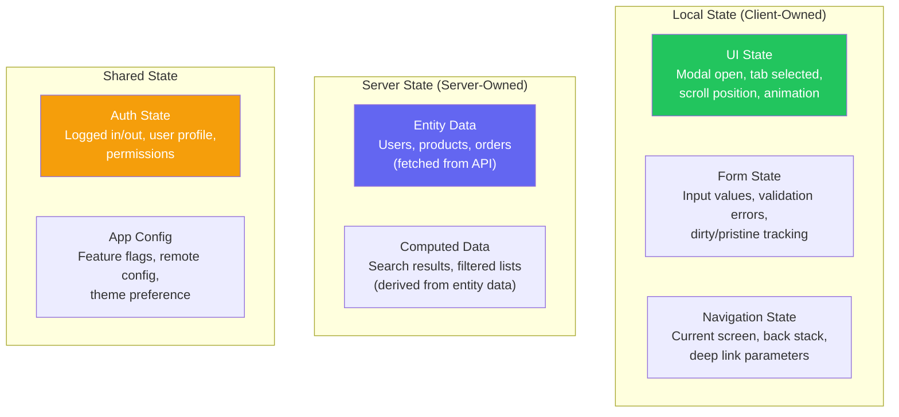

# Mobile State Management

::: tip Key Takeaway
- Separate local state (UI state like modal open, form inputs) from server state (data from your API) — they have different lifecycles, caching needs, and update patterns, and mixing them creates bugs
- For React Native, TanStack Query handles server state and Zustand handles local state — this combination covers 95% of state management needs without Redux boilerplate
- For Flutter, Riverpod is the modern standard that replaces Provider — it provides compile-time safety, automatic disposal, and better testability than Bloc for most use cases
:::

State management is where mobile developers spend the most time arguing and the least time measuring. The truth is that the choice between Redux, Zustand, MobX, Riverpod, Bloc, or any other state management solution matters far less than the pattern you use with it. The pattern that matters is: separate your local UI state from your server state, make state changes predictable, and test your state logic independently of your UI.

Every state management problem in mobile apps comes down to one of three challenges: keeping the UI in sync with the data, handling concurrent mutations without conflicts, and persisting state across app restarts and process death.

**Related**: [Mobile Architecture](/mobile-engineering/mobile-architecture) | [Mobile Networking](/mobile-engineering/mobile-networking) | [Mobile Engineering Overview](/mobile-engineering/)

---

## State Categories



| Category | Lifetime | Persistence | Update Frequency | Tool |
|----------|----------|-------------|------------------|------|
| **UI State** | Component lifetime | None | High (every interaction) | `useState` / `StatefulWidget` |
| **Form State** | Screen lifetime | Optional (draft saving) | High | React Hook Form / FormBloc |
| **Navigation State** | App session | Yes (deep link restoration) | Medium | React Navigation / GoRouter |
| **Server State** | Cache lifetime | Yes (offline support) | Low (API refresh) | TanStack Query / Riverpod |
| **Auth State** | App session | Yes (Keychain) | Very low | Zustand / Riverpod |
| **App Config** | App lifetime | Yes | Very low | Remote Config / Zustand |

---

## React Native: Zustand for Local State

Zustand is the pragmatic choice for React Native local state. It has zero boilerplate, works with React's concurrent features, and supports persistence out of the box.

```typescript
// src/stores/authStore.ts
import { create } from 'zustand';
import { persist, createJSONStorage } from 'zustand/middleware';
import AsyncStorage from '@react-native-async-storage/async-storage';
import * as Keychain from 'react-native-keychain';

interface User {
  id: string;
  name: string;
  email: string;
  plan: 'free' | 'premium';
  avatarUrl: string | null;
}

interface AuthState {
  user: User | null;
  isAuthenticated: boolean;
  isLoading: boolean;

  // Actions
  login: (email: string, password: string) => Promise<void>;
  logout: () => Promise<void>;
  updateProfile: (updates: Partial<User>) => void;
  refreshUser: () => Promise<void>;
}

export const useAuthStore = create<AuthState>()(
  persist(
    (set, get) => ({
      user: null,
      isAuthenticated: false,
      isLoading: false,

      login: async (email, password) => {
        set({ isLoading: true });
        try {
          const response = await apiClient.post('/auth/login', { email, password });
          const { user, access_token, refresh_token } = response.data;

          // Store tokens securely (NOT in Zustand persist)
          await Keychain.setGenericPassword('tokens', JSON.stringify({
            access: access_token,
            refresh: refresh_token,
          }));

          set({ user, isAuthenticated: true, isLoading: false });
        } catch (error) {
          set({ isLoading: false });
          throw error;
        }
      },

      logout: async () => {
        await Keychain.resetGenericPassword();
        set({ user: null, isAuthenticated: false });
        // Clear server state cache
        queryClient.clear();
      },

      updateProfile: (updates) => {
        const current = get().user;
        if (current) {
          set({ user: { ...current, ...updates } });
        }
      },

      refreshUser: async () => {
        try {
          const response = await apiClient.get('/auth/me');
          set({ user: response.data });
        } catch {
          // Token might be invalid
          await get().logout();
        }
      },
    }),
    {
      name: 'auth-storage',
      storage: createJSONStorage(() => AsyncStorage),
      // Only persist user data, NOT tokens (those go in Keychain)
      partialize: (state) => ({
        user: state.user,
        isAuthenticated: state.isAuthenticated,
      }),
    }
  )
);

// src/stores/cartStore.ts
interface CartItem {
  productId: string;
  name: string;
  price: number;
  quantity: number;
  imageUrl: string;
}

interface CartState {
  items: CartItem[];
  addItem: (item: Omit<CartItem, 'quantity'>) => void;
  removeItem: (productId: string) => void;
  updateQuantity: (productId: string, quantity: number) => void;
  clearCart: () => void;

  // Computed (derived state)
  get totalItems(): number;
  get subtotal(): number;
}

export const useCartStore = create<CartState>()(
  persist(
    (set, get) => ({
      items: [],

      addItem: (item) => {
        set((state) => {
          const existing = state.items.find((i) => i.productId === item.productId);
          if (existing) {
            return {
              items: state.items.map((i) =>
                i.productId === item.productId
                  ? { ...i, quantity: i.quantity + 1 }
                  : i
              ),
            };
          }
          return { items: [...state.items, { ...item, quantity: 1 }] };
        });
      },

      removeItem: (productId) => {
        set((state) => ({
          items: state.items.filter((i) => i.productId !== productId),
        }));
      },

      updateQuantity: (productId, quantity) => {
        if (quantity <= 0) {
          get().removeItem(productId);
          return;
        }
        set((state) => ({
          items: state.items.map((i) =>
            i.productId === productId ? { ...i, quantity } : i
          ),
        }));
      },

      clearCart: () => set({ items: [] }),

      get totalItems() {
        return get().items.reduce((sum, item) => sum + item.quantity, 0);
      },

      get subtotal() {
        return get().items.reduce((sum, item) => sum + item.price * item.quantity, 0);
      },
    }),
    {
      name: 'cart-storage',
      storage: createJSONStorage(() => AsyncStorage),
    }
  )
);
```

---

## React Native: TanStack Query for Server State

TanStack Query (formerly React Query) manages server state — fetching, caching, synchronizing, and updating data from your API.

```typescript
// src/queries/products.ts
import { useQuery, useMutation, useQueryClient, useInfiniteQuery } from '@tanstack/react-query';

// Query keys — centralized for consistency
export const productKeys = {
  all: ['products'] as const,
  lists: () => [...productKeys.all, 'list'] as const,
  list: (filters: ProductFilters) => [...productKeys.lists(), filters] as const,
  details: () => [...productKeys.all, 'detail'] as const,
  detail: (id: string) => [...productKeys.details(), id] as const,
};

// Fetch product list with pagination
export function useProducts(filters: ProductFilters) {
  return useInfiniteQuery({
    queryKey: productKeys.list(filters),
    queryFn: async ({ pageParam = 1 }) => {
      const response = await apiClient.get<PaginatedResponse<Product>>(
        `/products?page=${pageParam}&category=${filters.category || ''}&sort=${filters.sort || 'popular'}`
      );
      return response.data;
    },
    getNextPageParam: (lastPage) =>
      lastPage.hasNextPage ? lastPage.page + 1 : undefined,
    staleTime: 5 * 60 * 1000,     // Consider fresh for 5 minutes
    gcTime: 30 * 60 * 1000,       // Keep in cache for 30 minutes
    placeholderData: (previousData) => previousData, // Keep previous data while fetching
  });
}

// Fetch single product
export function useProduct(id: string) {
  return useQuery({
    queryKey: productKeys.detail(id),
    queryFn: async () => {
      const response = await apiClient.get<Product>(`/products/${id}`);
      return response.data;
    },
    staleTime: 10 * 60 * 1000,
    // Pre-populate from list cache if available
    initialData: () => {
      const queryClient = useQueryClient();
      const lists = queryClient.getQueriesData<PaginatedResponse<Product>>({
        queryKey: productKeys.lists(),
      });
      for (const [, data] of lists) {
        const product = data?.pages
          .flatMap((p) => p.items)
          .find((p) => p.id === id);
        if (product) return product;
      }
      return undefined;
    },
  });
}

// Mutation with optimistic updates
export function useAddToFavorites() {
  const queryClient = useQueryClient();

  return useMutation({
    mutationFn: async (productId: string) => {
      return apiClient.post(`/favorites/${productId}`);
    },
    // Optimistic update: update UI immediately, roll back on failure
    onMutate: async (productId) => {
      await queryClient.cancelQueries({ queryKey: productKeys.detail(productId) });
      const previousProduct = queryClient.getQueryData<Product>(
        productKeys.detail(productId)
      );

      queryClient.setQueryData<Product>(
        productKeys.detail(productId),
        (old) => old ? { ...old, isFavorite: true } : old
      );

      return { previousProduct };
    },
    onError: (_err, productId, context) => {
      // Roll back on error
      if (context?.previousProduct) {
        queryClient.setQueryData(
          productKeys.detail(productId),
          context.previousProduct
        );
      }
    },
    onSettled: (_data, _error, productId) => {
      // Always refetch to ensure consistency
      queryClient.invalidateQueries({ queryKey: productKeys.detail(productId) });
    },
  });
}
```

---

## Flutter: Riverpod

Riverpod is the modern standard for Flutter state management. It provides compile-time safety, automatic disposal, and a clean separation between state definition and consumption.

```dart
// lib/providers/auth_provider.dart
import 'package:riverpod_annotation/riverpod_annotation.dart';

part 'auth_provider.g.dart';

// Immutable state class
class AuthState {
  final User? user;
  final bool isLoading;
  final String? error;

  const AuthState({this.user, this.isLoading = false, this.error});

  bool get isAuthenticated => user != null;

  AuthState copyWith({User? user, bool? isLoading, String? error}) {
    return AuthState(
      user: user ?? this.user,
      isLoading: isLoading ?? this.isLoading,
      error: error,
    );
  }
}

@riverpod
class Auth extends _$Auth {
  @override
  AuthState build() {
    // Check for existing session on startup
    _initializeAuth();
    return const AuthState(isLoading: true);
  }

  Future<void> _initializeAuth() async {
    try {
      final token = await ref.read(secureStorageProvider).getToken();
      if (token != null) {
        final user = await ref.read(authRepositoryProvider).getMe(token);
        state = AuthState(user: user);
      } else {
        state = const AuthState();
      }
    } catch (e) {
      state = const AuthState();
    }
  }

  Future<void> login(String email, String password) async {
    state = state.copyWith(isLoading: true, error: null);

    try {
      final result = await ref.read(authRepositoryProvider).login(email, password);
      await ref.read(secureStorageProvider).saveToken(result.token);
      state = AuthState(user: result.user);
    } catch (e) {
      state = state.copyWith(isLoading: false, error: e.toString());
    }
  }

  Future<void> logout() async {
    await ref.read(secureStorageProvider).deleteToken();
    state = const AuthState();
    // Invalidate all cached data
    ref.invalidate(productsProvider);
    ref.invalidate(ordersProvider);
  }
}

// lib/providers/products_provider.dart
@riverpod
class Products extends _$Products {
  @override
  Future<List<Product>> build({String? category, String? search}) async {
    // Auto-cancels when parameters change
    // Auto-disposes when no widgets are listening
    final repository = ref.read(productRepositoryProvider);

    return repository.getProducts(
      category: category,
      search: search,
    );
  }

  Future<void> refresh() async {
    state = const AsyncLoading();
    state = await AsyncValue.guard(() => build(
      category: null,
      search: null,
    ));
  }
}

// Provider for a single product with caching
@riverpod
Future<Product> productDetail(ProductDetailRef ref, String id) async {
  // Keep alive for 5 minutes after last listener disposes
  final link = ref.keepAlive();
  final timer = Timer(const Duration(minutes: 5), link.close);
  ref.onDispose(timer.cancel);

  return ref.read(productRepositoryProvider).getById(id);
}

// lib/screens/product_list_screen.dart
class ProductListScreen extends ConsumerWidget {
  @override
  Widget build(BuildContext context, WidgetRef ref) {
    final productsAsync = ref.watch(productsProvider());

    return productsAsync.when(
      loading: () => const Center(child: CircularProgressIndicator()),
      error: (error, stack) => ErrorWidget(
        message: error.toString(),
        onRetry: () => ref.invalidate(productsProvider),
      ),
      data: (products) => RefreshIndicator(
        onRefresh: () => ref.read(productsProvider().notifier).refresh(),
        child: ListView.builder(
          itemCount: products.length,
          itemBuilder: (context, index) => ProductCard(product: products[index]),
        ),
      ),
    );
  }
}
```

---

## Flutter: Bloc

Bloc (Business Logic Component) enforces a strict event-driven architecture where state changes only happen in response to events. It is more verbose than Riverpod but provides better traceability for complex features.

```dart
// lib/blocs/cart/cart_event.dart
abstract class CartEvent {}

class CartItemAdded extends CartEvent {
  final Product product;
  final int quantity;
  CartItemAdded(this.product, {this.quantity = 1});
}

class CartItemRemoved extends CartEvent {
  final String productId;
  CartItemRemoved(this.productId);
}

class CartItemQuantityChanged extends CartEvent {
  final String productId;
  final int quantity;
  CartItemQuantityChanged(this.productId, this.quantity);
}

class CartCleared extends CartEvent {}

class CartPromoCodeApplied extends CartEvent {
  final String code;
  CartPromoCodeApplied(this.code);
}

// lib/blocs/cart/cart_state.dart
class CartState {
  final List<CartItem> items;
  final PromoCode? promoCode;
  final bool isLoading;
  final String? error;

  const CartState({
    this.items = const [],
    this.promoCode,
    this.isLoading = false,
    this.error,
  });

  double get subtotal =>
    items.fold(0, (sum, item) => sum + item.price * item.quantity);

  double get discount =>
    promoCode != null ? subtotal * (promoCode!.discountPercent / 100) : 0;

  double get total => subtotal - discount;

  int get totalItems =>
    items.fold(0, (sum, item) => sum + item.quantity);

  CartState copyWith({
    List<CartItem>? items,
    PromoCode? promoCode,
    bool? isLoading,
    String? error,
  }) {
    return CartState(
      items: items ?? this.items,
      promoCode: promoCode ?? this.promoCode,
      isLoading: isLoading ?? this.isLoading,
      error: error,
    );
  }
}

// lib/blocs/cart/cart_bloc.dart
class CartBloc extends Bloc<CartEvent, CartState> {
  final CartRepository _cartRepository;
  final PromoService _promoService;

  CartBloc({
    required CartRepository cartRepository,
    required PromoService promoService,
  })  : _cartRepository = cartRepository,
        _promoService = promoService,
        super(const CartState()) {

    on<CartItemAdded>(_onItemAdded);
    on<CartItemRemoved>(_onItemRemoved);
    on<CartItemQuantityChanged>(_onQuantityChanged);
    on<CartCleared>(_onCleared);
    on<CartPromoCodeApplied>(_onPromoApplied);
  }

  void _onItemAdded(CartItemAdded event, Emitter<CartState> emit) {
    final existingIndex = state.items
        .indexWhere((i) => i.productId == event.product.id);

    if (existingIndex >= 0) {
      final updated = List<CartItem>.from(state.items);
      updated[existingIndex] = updated[existingIndex].copyWith(
        quantity: updated[existingIndex].quantity + event.quantity,
      );
      emit(state.copyWith(items: updated));
    } else {
      emit(state.copyWith(
        items: [
          ...state.items,
          CartItem(
            productId: event.product.id,
            name: event.product.name,
            price: event.product.price,
            quantity: event.quantity,
            imageUrl: event.product.imageUrl,
          ),
        ],
      ));
    }

    // Persist cart
    _cartRepository.saveCart(state.items);
  }

  void _onItemRemoved(CartItemRemoved event, Emitter<CartState> emit) {
    emit(state.copyWith(
      items: state.items.where((i) => i.productId != event.productId).toList(),
    ));
    _cartRepository.saveCart(state.items);
  }

  void _onQuantityChanged(CartItemQuantityChanged event, Emitter<CartState> emit) {
    if (event.quantity <= 0) {
      add(CartItemRemoved(event.productId));
      return;
    }

    emit(state.copyWith(
      items: state.items.map((i) =>
        i.productId == event.productId
          ? i.copyWith(quantity: event.quantity)
          : i
      ).toList(),
    ));
    _cartRepository.saveCart(state.items);
  }

  Future<void> _onPromoApplied(
    CartPromoCodeApplied event,
    Emitter<CartState> emit,
  ) async {
    emit(state.copyWith(isLoading: true, error: null));

    try {
      final promo = await _promoService.validate(event.code, state.subtotal);
      emit(state.copyWith(promoCode: promo, isLoading: false));
    } catch (e) {
      emit(state.copyWith(error: e.toString(), isLoading: false));
    }
  }

  void _onCleared(CartCleared event, Emitter<CartState> emit) {
    emit(const CartState());
    _cartRepository.clearCart();
  }
}
```

---

## Riverpod vs Bloc Decision Matrix

| Criteria | Riverpod | Bloc |
|----------|----------|------|
| **Boilerplate** | Low (code generation) | High (events, states, bloc) |
| **Learning curve** | Medium | Steep |
| **Type safety** | Compile-time | Runtime (mostly) |
| **Testability** | Excellent (override any provider) | Excellent (blocTest) |
| **Traceability** | Observer pattern | Full event log, time-travel debug |
| **Complex state machines** | Possible but ad-hoc | First-class (event → state) |
| **Team convention enforcement** | Flexible (can lead to inconsistency) | Strict (everyone does it the same way) |
| **Best for** | Most apps, especially data-driven | Complex features, large teams wanting strict patterns |

---

## State Persistence Across Process Death

Android and iOS can kill your app's process when it is in the background. When the user returns, your app must restore its state. In-memory state is gone.

```typescript
// React Native: Persist and restore navigation state
import AsyncStorage from '@react-native-async-storage/async-storage';
import { NavigationContainer } from '@react-navigation/native';

function App() {
  const [isReady, setIsReady] = useState(false);
  const [initialState, setInitialState] = useState<any>();

  useEffect(() => {
    async function restoreState() {
      try {
        const savedState = await AsyncStorage.getItem('nav_state');
        if (savedState) {
          setInitialState(JSON.parse(savedState));
        }
      } finally {
        setIsReady(true);
      }
    }

    restoreState();
  }, []);

  if (!isReady) return <SplashScreen />;

  return (
    <NavigationContainer
      initialState={initialState}
      onStateChange={(state) => {
        AsyncStorage.setItem('nav_state', JSON.stringify(state));
      }}
    >
      <RootStack />
    </NavigationContainer>
  );
}
```

---

## When NOT to Reach for a State Management Library

- **Component-local state that does not leave the component.** A modal's open/close state, a text input's value, a checkbox's checked state — use `useState` or `StatefulWidget`. Libraries add overhead for no benefit here.
- **Simple apps with < 10 screens.** React Context + useState or Flutter's built-in `ChangeNotifier` with `Provider` is sufficient. You do not need Zustand, Redux, Riverpod, or Bloc for a TODO app.
- **Server state only.** If your app just fetches and displays data from an API, TanStack Query (RN) or Riverpod's `FutureProvider` (Flutter) handles everything. You do not need a separate state management library.

::: warning Common Misconceptions
**"Redux is dead for React Native."** Redux is not dead — it is the most mature ecosystem with excellent dev tools, middleware (thunks, sagas), and community knowledge. What changed is that TanStack Query eliminated the need for Redux to manage server state, which was 80% of its use. If you have complex client-side state (real-time collaboration, complex form workflows), Redux is still a valid choice.

**"Global state is bad."** Global state is not inherently bad — what is bad is putting everything in global state. Auth, cart, and feature flags are legitimately global. A form's validation errors are not. The rule: state should live at the narrowest scope possible.

**"Riverpod replaces Bloc."** Riverpod and Bloc solve different problems. Riverpod is a dependency injection + state management framework that excels at data fetching and simple state. Bloc is an event-driven architecture that excels at complex state machines with clear event tracing. Many large Flutter apps use both — Riverpod for DI and data providers, Bloc for complex feature-level state.
:::

---

## Real-World Example: Airbnb

Airbnb's React Native app (before they moved to native) used a state management architecture with these principles:

1. **Server state via Apollo Client** — all API data was managed by Apollo's normalized cache, not Redux
2. **Local state via MobX** — screen-level state (filters, selections) was managed with MobX observables, keeping state close to the UI
3. **Navigation state separate from app state** — React Navigation managed its own state, not synchronized with MobX
4. **Feature flags as a first-class state category** — feature flags had their own provider that was evaluated before the feature module loaded, enabling clean A/B testing

After Airbnb moved to native, their iOS app (SwiftUI) uses a similar pattern: server state via Apollo GraphQL client, local state via SwiftUI's `@State` and `@StateObject`, and a Coordinator pattern for navigation.

---

::: details Quiz

**1. What is the difference between local state and server state?**

Local state is data owned by the client — UI state (modal open, tab selected), form values, navigation state. It has no authoritative server copy. Server state is data fetched from an API — users, products, orders. The server is the source of truth, and the client holds a cached copy that can become stale. They require different management patterns because server state involves caching, background refetching, and synchronization, while local state does not.

**2. Why should you NOT store auth tokens in Zustand's persist middleware?**

Zustand persist stores data in AsyncStorage, which is unencrypted on both platforms. Auth tokens stored in AsyncStorage can be read by anyone with physical device access (especially on rooted/jailbroken devices). Tokens should be stored in the iOS Keychain or Android EncryptedSharedPreferences. Zustand persist is fine for non-sensitive data like cart items or user preferences.

**3. What is an optimistic update, and when should you use it?**

An optimistic update immediately updates the UI before the server confirms the change. If the server request fails, you roll back to the previous state. Use it for actions where instant feedback matters and failure is rare: adding to favorites, marking as read, toggling settings. Do NOT use it for critical actions where failure has consequences: placing orders, sending payments, deleting accounts.

**4. What is the advantage of Bloc's event-driven approach over Riverpod's?**

Bloc requires every state change to be triggered by a typed event, creating a complete audit trail of what happened and in what order. This makes debugging complex state transitions easier because you can log every event and replay them. Riverpod allows state mutations via direct method calls, which is simpler but provides less visibility into the sequence of changes. For complex features like chat, checkout flows, or real-time collaboration, Bloc's traceability is valuable.

:::

---

::: details Exercise

**Build a shopping cart with Zustand that supports:**

1. Add/remove items with optimistic UI
2. Quantity updates
3. Promo code application (async validation)
4. Cart persistence across app restarts
5. Cart merge when user logs in (merge guest cart with server cart)

**Solution:**

```typescript
import { create } from 'zustand';
import { persist, createJSONStorage } from 'zustand/middleware';
import AsyncStorage from '@react-native-async-storage/async-storage';

interface CartItem {
  productId: string;
  name: string;
  price: number;
  quantity: number;
  imageUrl: string;
}

interface PromoCode {
  code: string;
  discountPercent: number;
  minimumOrder: number;
}

interface CartState {
  items: CartItem[];
  promoCode: PromoCode | null;
  promoError: string | null;
  promoLoading: boolean;

  // Actions
  addItem: (product: Omit<CartItem, 'quantity'>) => void;
  removeItem: (productId: string) => void;
  updateQuantity: (productId: string, quantity: number) => void;
  applyPromoCode: (code: string) => Promise<void>;
  removePromoCode: () => void;
  clearCart: () => void;
  mergeWithServerCart: (serverItems: CartItem[]) => void;

  // Computed
  getSubtotal: () => number;
  getDiscount: () => number;
  getTotal: () => number;
  getTotalItems: () => number;
}

export const useCartStore = create<CartState>()(
  persist(
    (set, get) => ({
      items: [],
      promoCode: null,
      promoError: null,
      promoLoading: false,

      addItem: (product) => {
        set((state) => {
          const existing = state.items.find((i) => i.productId === product.productId);
          if (existing) {
            return {
              items: state.items.map((i) =>
                i.productId === product.productId
                  ? { ...i, quantity: i.quantity + 1 }
                  : i
              ),
            };
          }
          return { items: [...state.items, { ...product, quantity: 1 }] };
        });

        // Sync to server in background (fire-and-forget)
        syncCartToServer(get().items).catch(() => {});
      },

      removeItem: (productId) => {
        set((state) => ({
          items: state.items.filter((i) => i.productId !== productId),
        }));
        syncCartToServer(get().items).catch(() => {});
      },

      updateQuantity: (productId, quantity) => {
        if (quantity <= 0) {
          get().removeItem(productId);
          return;
        }
        set((state) => ({
          items: state.items.map((i) =>
            i.productId === productId ? { ...i, quantity } : i
          ),
        }));
        syncCartToServer(get().items).catch(() => {});
      },

      applyPromoCode: async (code) => {
        set({ promoLoading: true, promoError: null });
        try {
          const subtotal = get().getSubtotal();
          const promo = await apiClient.post<PromoCode>('/promo/validate', {
            code,
            subtotal,
          });

          if (subtotal < promo.data.minimumOrder) {
            set({
              promoLoading: false,
              promoError: `Minimum order: $${promo.data.minimumOrder}`,
            });
            return;
          }

          set({ promoCode: promo.data, promoLoading: false });
        } catch (error: any) {
          set({
            promoLoading: false,
            promoError: error.message || 'Invalid promo code',
          });
        }
      },

      removePromoCode: () => set({ promoCode: null, promoError: null }),

      clearCart: () => set({ items: [], promoCode: null, promoError: null }),

      // 5. Merge guest cart with server cart on login
      mergeWithServerCart: (serverItems) => {
        set((state) => {
          const merged = [...serverItems];

          // Add local items that aren't on the server
          for (const localItem of state.items) {
            const serverItem = merged.find(
              (s) => s.productId === localItem.productId
            );
            if (serverItem) {
              // Take the higher quantity
              serverItem.quantity = Math.max(
                serverItem.quantity,
                localItem.quantity
              );
            } else {
              merged.push(localItem);
            }
          }

          return { items: merged };
        });

        // Sync merged cart to server
        syncCartToServer(get().items).catch(() => {});
      },

      getSubtotal: () =>
        get().items.reduce((sum, item) => sum + item.price * item.quantity, 0),

      getDiscount: () => {
        const promo = get().promoCode;
        return promo ? get().getSubtotal() * (promo.discountPercent / 100) : 0;
      },

      getTotal: () => get().getSubtotal() - get().getDiscount(),

      getTotalItems: () =>
        get().items.reduce((sum, item) => sum + item.quantity, 0),
    }),
    {
      name: 'cart-storage',
      storage: createJSONStorage(() => AsyncStorage),
      partialize: (state) => ({
        items: state.items,
        promoCode: state.promoCode,
      }),
    }
  )
);

async function syncCartToServer(items: CartItem[]) {
  // Only sync if user is authenticated
  const authStore = useAuthStore.getState();
  if (!authStore.isAuthenticated) return;

  await apiClient.put('/cart', { items });
}
```

Key design decisions:
- Promo code validation is async (server-side) with loading and error states
- Cart syncs to server in background but works fully offline
- Merge strategy on login takes the higher quantity for duplicates
- Only cart items and promo code are persisted (not loading/error states)
- Server sync is fire-and-forget — the local cart is the source of truth

:::

---

> *"State management is not a technology choice — it is a discipline. The library matters less than the boundaries you draw between state categories and the consistency with which your team follows them."*
