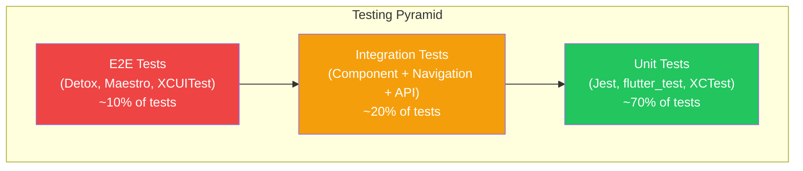
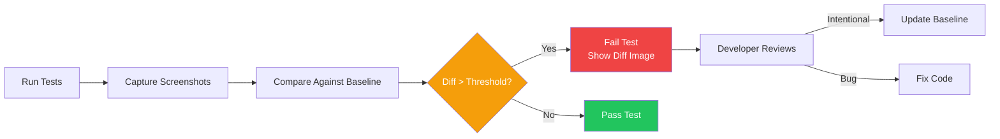
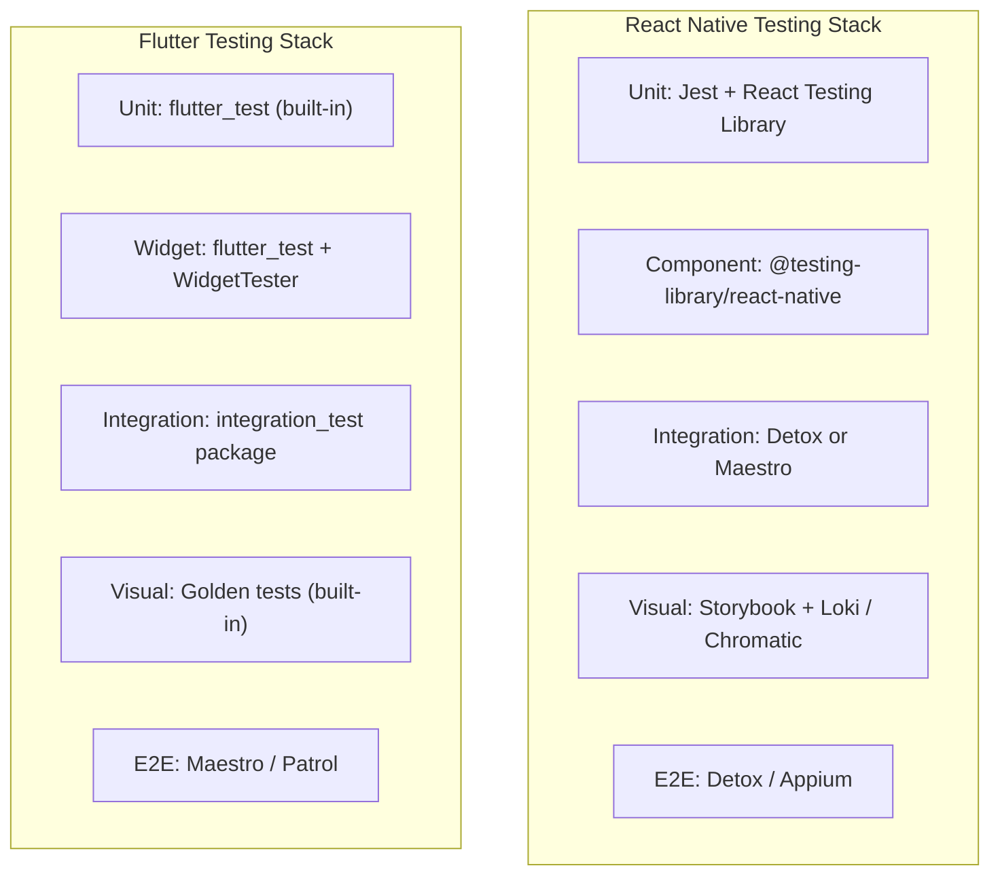

# Mobile Testing

Mobile testing is harder than web testing. You are testing across two platforms with different rendering engines, on devices with different screen sizes, OS versions, and hardware capabilities. Your tests must account for native module behavior, platform-specific permissions dialogs, gesture interactions, and asynchronous operations that do not exist on the web. A passing test suite on iOS says nothing about Android unless you explicitly test both.

The mobile testing pyramid still applies — many unit tests, fewer integration tests, even fewer E2E tests — but the integration and E2E layers are fundamentally more complex because they involve real device behavior, app lifecycle events, and platform APIs that cannot be fully mocked.

**Related**: [Mobile Engineering Overview](/mobile-engineering/) | [React Native](/mobile-engineering/react-native) | [Flutter](/mobile-engineering/flutter) | [Mobile CI/CD](/mobile-engineering/mobile-cicd)

---

## The Mobile Testing Pyramid



| Layer | Speed | Confidence | Maintenance | Flakiness |
|-------|-------|-----------|-------------|-----------|
| **Unit** | ~1ms per test | Low (isolated logic) | Low | Near zero |
| **Integration** | ~100ms per test | Medium (component interaction) | Medium | Low |
| **E2E** | ~5-30s per test | High (full user flows) | High | Medium-High |
| **Manual** | Minutes per test | Highest (real device) | Very high | N/A |

---

## Unit Testing

### React Native with Jest

```typescript
// src/utils/price.ts
export function formatPrice(cents: number, currency = 'USD'): string {
  const dollars = cents / 100;
  return new Intl.NumberFormat('en-US', {
    style: 'currency',
    currency,
  }).format(dollars);
}

export function calculateDiscount(
  price: number,
  discountPercent: number
): number {
  if (discountPercent < 0 || discountPercent > 100) {
    throw new Error('Discount must be between 0 and 100');
  }
  return Math.round(price * (1 - discountPercent / 100));
}

// src/utils/__tests__/price.test.ts
import { formatPrice, calculateDiscount } from '../price';

describe('formatPrice', () => {
  it('formats cents to USD string', () => {
    expect(formatPrice(1999)).toBe('$19.99');
    expect(formatPrice(100)).toBe('$1.00');
    expect(formatPrice(0)).toBe('$0.00');
  });

  it('handles different currencies', () => {
    expect(formatPrice(1999, 'EUR')).toContain('19.99');
  });
});

describe('calculateDiscount', () => {
  it('applies percentage discount', () => {
    expect(calculateDiscount(10000, 20)).toBe(8000);
    expect(calculateDiscount(9999, 50)).toBe(5000); // rounds
  });

  it('throws on invalid discount', () => {
    expect(() => calculateDiscount(100, -5)).toThrow();
    expect(() => calculateDiscount(100, 150)).toThrow();
  });

  it('handles edge cases', () => {
    expect(calculateDiscount(100, 0)).toBe(100);
    expect(calculateDiscount(100, 100)).toBe(0);
  });
});
```

### Testing React Native Hooks

```typescript
// src/hooks/useCart.ts
import { useState, useCallback, useMemo } from 'react';

interface CartItem {
  id: string;
  name: string;
  price: number;
  quantity: number;
}

export function useCart() {
  const [items, setItems] = useState<CartItem[]>([]);

  const addItem = useCallback((item: Omit<CartItem, 'quantity'>) => {
    setItems(prev => {
      const existing = prev.find(i => i.id === item.id);
      if (existing) {
        return prev.map(i =>
          i.id === item.id ? { ...i, quantity: i.quantity + 1 } : i
        );
      }
      return [...prev, { ...item, quantity: 1 }];
    });
  }, []);

  const total = useMemo(
    () => items.reduce((sum, item) => sum + item.price * item.quantity, 0),
    [items]
  );

  return { items, addItem, total };
}

// src/hooks/__tests__/useCart.test.ts
import { renderHook, act } from '@testing-library/react-hooks';
import { useCart } from '../useCart';

describe('useCart', () => {
  it('starts with empty cart', () => {
    const { result } = renderHook(() => useCart());
    expect(result.current.items).toEqual([]);
    expect(result.current.total).toBe(0);
  });

  it('adds items to cart', () => {
    const { result } = renderHook(() => useCart());

    act(() => {
      result.current.addItem({ id: '1', name: 'Widget', price: 1999 });
    });

    expect(result.current.items).toHaveLength(1);
    expect(result.current.total).toBe(1999);
  });

  it('increments quantity for duplicate items', () => {
    const { result } = renderHook(() => useCart());

    act(() => {
      result.current.addItem({ id: '1', name: 'Widget', price: 1999 });
      result.current.addItem({ id: '1', name: 'Widget', price: 1999 });
    });

    expect(result.current.items).toHaveLength(1);
    expect(result.current.items[0].quantity).toBe(2);
    expect(result.current.total).toBe(3998);
  });
});
```

### Flutter with flutter_test

```dart
// lib/models/cart.dart
class CartItem {
  final String id;
  final String name;
  final int priceInCents;
  final int quantity;

  const CartItem({
    required this.id,
    required this.name,
    required this.priceInCents,
    this.quantity = 1,
  });

  CartItem copyWith({int? quantity}) =>
      CartItem(
        id: id,
        name: name,
        priceInCents: priceInCents,
        quantity: quantity ?? this.quantity,
      );
}

class Cart {
  final List<CartItem> items;

  const Cart({this.items = const []});

  int get totalCents =>
      items.fold(0, (sum, item) => sum + item.priceInCents * item.quantity);

  Cart addItem(CartItem item) {
    final existingIndex = items.indexWhere((i) => i.id == item.id);
    if (existingIndex >= 0) {
      final updated = List<CartItem>.from(items);
      updated[existingIndex] = updated[existingIndex]
          .copyWith(quantity: updated[existingIndex].quantity + 1);
      return Cart(items: updated);
    }
    return Cart(items: [...items, item]);
  }
}

// test/models/cart_test.dart
import 'package:flutter_test/flutter_test.dart';
import 'package:myapp/models/cart.dart';

void main() {
  group('Cart', () {
    test('starts empty with zero total', () {
      const cart = Cart();
      expect(cart.items, isEmpty);
      expect(cart.totalCents, 0);
    });

    test('adds new item', () {
      const cart = Cart();
      final updated = cart.addItem(
        const CartItem(id: '1', name: 'Widget', priceInCents: 1999),
      );

      expect(updated.items.length, 1);
      expect(updated.totalCents, 1999);
    });

    test('increments quantity for existing item', () {
      const item = CartItem(id: '1', name: 'Widget', priceInCents: 1999);
      final cart = const Cart().addItem(item).addItem(item);

      expect(cart.items.length, 1);
      expect(cart.items.first.quantity, 2);
      expect(cart.totalCents, 3998);
    });
  });
}
```

### Flutter Widget Testing

```dart
// test/widgets/product_card_test.dart
import 'package:flutter/material.dart';
import 'package:flutter_test/flutter_test.dart';
import 'package:myapp/widgets/product_card.dart';
import 'package:myapp/models/product.dart';

void main() {
  testWidgets('ProductCard displays product info', (tester) async {
    final product = Product(
      id: '1',
      name: 'Premium Widget',
      price: 2999,
      imageUrl: 'https://example.com/img.png',
    );

    await tester.pumpWidget(
      MaterialApp(
        home: Scaffold(
          body: ProductCard(
            product: product,
            onAddToCart: () {},
          ),
        ),
      ),
    );

    expect(find.text('Premium Widget'), findsOneWidget);
    expect(find.text('\$29.99'), findsOneWidget);
    expect(find.byIcon(Icons.add_shopping_cart), findsOneWidget);
  });

  testWidgets('Add to cart button calls callback', (tester) async {
    var addToCartCalled = false;
    final product = Product(
      id: '1',
      name: 'Widget',
      price: 999,
      imageUrl: 'https://example.com/img.png',
    );

    await tester.pumpWidget(
      MaterialApp(
        home: Scaffold(
          body: ProductCard(
            product: product,
            onAddToCart: () => addToCartCalled = true,
          ),
        ),
      ),
    );

    await tester.tap(find.byIcon(Icons.add_shopping_cart));
    expect(addToCartCalled, isTrue);
  });
}
```

---

## Integration Testing

### Detox (React Native)

Detox runs your React Native app on a real simulator/emulator and interacts with it like a user. It synchronizes with the app's UI thread, network requests, and animations, making tests less flaky than Appium.

```typescript
// e2e/login.test.ts
import { device, element, by, expect } from 'detox';

describe('Login Flow', () => {
  beforeAll(async () => {
    await device.launchApp({ newInstance: true });
  });

  beforeEach(async () => {
    await device.reloadReactNative();
  });

  it('shows validation errors for empty fields', async () => {
    await element(by.id('login-button')).tap();
    await expect(element(by.id('email-error'))).toBeVisible();
    await expect(element(by.id('password-error'))).toBeVisible();
  });

  it('logs in with valid credentials', async () => {
    await element(by.id('email-input')).typeText('test@example.com');
    await element(by.id('password-input')).typeText('password123');
    await element(by.id('login-button')).tap();

    // Detox auto-waits for animations and network
    await expect(element(by.id('home-screen'))).toBeVisible();
    await expect(element(by.text('Welcome back'))).toBeVisible();
  });

  it('handles incorrect credentials', async () => {
    await element(by.id('email-input')).typeText('test@example.com');
    await element(by.id('password-input')).typeText('wrongpassword');
    await element(by.id('login-button')).tap();

    await expect(element(by.id('error-toast'))).toBeVisible();
    await expect(element(by.text('Invalid credentials'))).toBeVisible();
  });

  it('navigates to forgot password', async () => {
    await element(by.id('forgot-password-link')).tap();
    await expect(element(by.id('reset-password-screen'))).toBeVisible();
  });
});
```

### Maestro (Cross-Platform)

Maestro uses YAML-based flows that are readable by non-engineers. It works with both React Native and Flutter.

```yaml
# .maestro/login-flow.yaml
appId: com.myapp
---
- launchApp

# Test validation errors
- tapOn:
    id: "login-button"
- assertVisible: "Email is required"
- assertVisible: "Password is required"

# Enter credentials
- tapOn:
    id: "email-input"
- inputText: "test@example.com"
- tapOn:
    id: "password-input"
- inputText: "password123"

# Submit login
- tapOn:
    id: "login-button"

# Verify successful login
- assertVisible: "Welcome back"
- assertVisible:
    id: "home-screen"

# Navigate to profile
- tapOn:
    id: "profile-tab"
- assertVisible: "test@example.com"
```

```yaml
# .maestro/purchase-flow.yaml
appId: com.myapp
---
- launchApp

# Search for product
- tapOn:
    id: "search-bar"
- inputText: "Premium Widget"
- tapOn: "Premium Widget"

# Add to cart
- assertVisible: "$29.99"
- tapOn:
    id: "add-to-cart"
- assertVisible: "Added to cart"

# Go to cart
- tapOn:
    id: "cart-tab"
- assertVisible: "Premium Widget"
- assertVisible: "$29.99"

# Checkout
- tapOn:
    id: "checkout-button"
- assertVisible: "Order Summary"
```

### Flutter Integration Testing

```dart
// integration_test/app_test.dart
import 'package:flutter_test/flutter_test.dart';
import 'package:integration_test/integration_test.dart';
import 'package:myapp/main.dart' as app;

void main() {
  IntegrationTestWidgetsFlutterBinding.ensureInitialized();

  group('Login Flow', () {
    testWidgets('successful login navigates to home', (tester) async {
      app.main();
      await tester.pumpAndSettle();

      // Enter credentials
      final emailField = find.byKey(const Key('email-input'));
      await tester.enterText(emailField, 'test@example.com');

      final passwordField = find.byKey(const Key('password-input'));
      await tester.enterText(passwordField, 'password123');

      // Tap login
      await tester.tap(find.byKey(const Key('login-button')));
      await tester.pumpAndSettle();

      // Verify navigation to home
      expect(find.byKey(const Key('home-screen')), findsOneWidget);
      expect(find.text('Welcome back'), findsOneWidget);
    });
  });
}
```

---

## Snapshot Testing

Snapshot tests capture the rendered output of a component and compare it against a stored baseline. Any change to the component's visual output causes the test to fail until the snapshot is explicitly updated.

### React Native Snapshots

```typescript
// __tests__/ProductCard.snapshot.test.tsx
import React from 'react';
import renderer from 'react-test-renderer';
import { ProductCard } from '../components/ProductCard';

describe('ProductCard snapshots', () => {
  it('renders default state', () => {
    const tree = renderer.create(
      <ProductCard
        product={{
          id: '1',
          name: 'Widget',
          price: 1999,
          imageUrl: 'https://example.com/img.png',
        }}
        onAddToCart={() => {}}
      />
    ).toJSON();

    expect(tree).toMatchSnapshot();
  });

  it('renders out-of-stock state', () => {
    const tree = renderer.create(
      <ProductCard
        product={{
          id: '1',
          name: 'Widget',
          price: 1999,
          imageUrl: 'https://example.com/img.png',
          inStock: false,
        }}
        onAddToCart={() => {}}
      />
    ).toJSON();

    expect(tree).toMatchSnapshot();
  });
});
```

### Flutter Golden Tests

```dart
// test/widgets/product_card_golden_test.dart
import 'package:flutter/material.dart';
import 'package:flutter_test/flutter_test.dart';
import 'package:myapp/widgets/product_card.dart';

void main() {
  testWidgets('ProductCard golden test', (tester) async {
    await tester.pumpWidget(
      MaterialApp(
        home: Scaffold(
          body: ProductCard(
            product: Product(
              id: '1',
              name: 'Premium Widget',
              price: 2999,
              imageUrl: 'https://example.com/img.png',
            ),
            onAddToCart: () {},
          ),
        ),
      ),
    );

    await expectLater(
      find.byType(ProductCard),
      matchesGoldenFile('goldens/product_card_default.png'),
    );
  });
}

// Run: flutter test --update-goldens
// Subsequent runs compare against stored golden files
```

---

## Visual Regression Testing



### Setting Up Visual Regression with Loki

```typescript
// .loki/config.js — visual regression for React Native
module.exports = {
  configurations: {
    'ios.iphone14': {
      target: 'ios.simulator',
      device: 'iPhone 14',
    },
    'android.pixel6': {
      target: 'android.emulator',
      device: 'Pixel 6',
    },
  },
  diffingEngine: 'looks-same',
  looks_same: {
    tolerance: 2.5,           // pixel color tolerance
    antialiasingTolerance: 3, // anti-aliasing tolerance
    ignoreAntialiasing: true,
  },
};
```

---

## Mocking Native Modules

Native modules are the biggest source of test configuration headaches in React Native. Here is how to mock them correctly.

```typescript
// jest.setup.ts
import mockAsyncStorage from '@react-native-async-storage/async-storage/jest/async-storage-mock';

// Mock AsyncStorage
jest.mock('@react-native-async-storage/async-storage', () => mockAsyncStorage);

// Mock react-native-reanimated
jest.mock('react-native-reanimated', () => {
  const Reanimated = require('react-native-reanimated/mock');
  Reanimated.default.call = () => {};
  return Reanimated;
});

// Mock navigation
jest.mock('@react-navigation/native', () => ({
  ...jest.requireActual('@react-navigation/native'),
  useNavigation: () => ({
    navigate: jest.fn(),
    goBack: jest.fn(),
    setOptions: jest.fn(),
  }),
  useRoute: () => ({
    params: {},
  }),
}));

// Mock camera
jest.mock('react-native-camera', () => ({
  RNCamera: {
    Constants: {
      Type: { back: 'back', front: 'front' },
      FlashMode: { on: 'on', off: 'off' },
    },
  },
}));

// Mock permissions
jest.mock('react-native-permissions', () => ({
  check: jest.fn().mockResolvedValue('granted'),
  request: jest.fn().mockResolvedValue('granted'),
  PERMISSIONS: {
    IOS: { CAMERA: 'ios.permission.CAMERA' },
    ANDROID: { CAMERA: 'android.permission.CAMERA' },
  },
  RESULTS: {
    GRANTED: 'granted',
    DENIED: 'denied',
    BLOCKED: 'blocked',
  },
}));
```

---

## Testing Strategy Comparison



| Aspect | React Native | Flutter |
|--------|-------------|---------|
| **Unit test runner** | Jest | flutter_test (built-in) |
| **Component testing** | @testing-library/react-native | WidgetTester (built-in) |
| **Snapshot testing** | Jest snapshots | Golden tests |
| **Integration testing** | Detox (recommended) | integration_test package |
| **E2E testing** | Detox / Maestro / Appium | Maestro / Patrol |
| **Mocking** | jest.mock() + manual mocks | mockito + mocktail |
| **CI speed** | Medium (JS bundling) | Fast (compiled tests) |
| **Flakiness risk** | Medium-High (bridge async) | Low (no bridge) |

---

## CI Integration

### GitHub Actions for Mobile Tests

```yaml
# .github/workflows/mobile-tests.yml
name: Mobile Tests
on: [push, pull_request]

jobs:
  unit-tests:
    runs-on: ubuntu-latest
    steps:
      - uses: actions/checkout@v4
      - uses: actions/setup-node@v4
        with:
          node-version: 20
          cache: 'yarn'
      - run: yarn install --frozen-lockfile
      - run: yarn test --coverage --ci
      - uses: codecov/codecov-action@v4

  detox-ios:
    runs-on: macos-14
    steps:
      - uses: actions/checkout@v4
      - uses: actions/setup-node@v4
        with:
          node-version: 20
      - run: yarn install --frozen-lockfile
      - run: brew tap wix/brew && brew install applesimutils
      - run: |
          npx detox build --configuration ios.sim.release
          npx detox test --configuration ios.sim.release --cleanup

  maestro-tests:
    runs-on: macos-14
    steps:
      - uses: actions/checkout@v4
      - uses: mobile-dev-inc/action-maestro-cloud@v1.9.0
        with:
          api-key: $\{\{ secrets.MAESTRO_CLOUD_KEY \}\}
          app-file: app-release.apk
```

::: warning Detox CI Costs
Detox iOS tests require macOS runners, which cost 10x more than Linux runners on GitHub Actions ($0.08/min vs $0.008/min). Run unit tests on Linux and reserve macOS runners for E2E tests only. Consider running Detox tests only on PRs to main, not on every push.
:::

---

## Testing Anti-Patterns

| Anti-Pattern | Problem | Better Approach |
|-------------|---------|-----------------|
| Testing implementation details | Breaks on refactor | Test behavior and output |
| Mocking everything | Tests pass but app breaks | Use integration tests for critical paths |
| No testIDs on components | Selectors break on UI changes | Add `testID` / `Key` to interactive elements |
| Testing third-party code | Wastes time, already tested | Mock at the boundary, test your logic |
| Ignoring flaky tests | Erodes trust in test suite | Fix or quarantine immediately |
| Running E2E on every commit | Slow CI, developer frustration | Run on PR + nightly, unit on every commit |

---

## Cross-References

- **[Mobile CI/CD](/mobile-engineering/mobile-cicd)** — Integrating tests into build pipelines
- **[Mobile Performance](/mobile-engineering/mobile-performance)** — Performance testing and profiling
- **[Unit Testing](/testing/unit-testing)** — General unit testing patterns
- **[Property-Based Testing](/testing/property-based-testing)** — Generating test inputs automatically

---

## Key Takeaways

::: tip Key Takeaways
- **Follow the testing pyramid**: 70% unit, 20% integration, 10% E2E. Unit tests are fast and reliable; E2E tests are slow and flaky but catch real bugs.
- **Use testIDs everywhere**: Never select elements by text content or component hierarchy in integration/E2E tests. `testID` (RN) and `Key` (Flutter) survive refactors.
- **Pick Maestro for cross-platform E2E**: If you support both iOS and Android, Maestro's YAML flows work on both without separate test codebases, reducing maintenance by half.
:::

## Common Misconceptions

### "100% code coverage means no bugs"
Coverage measures which lines execute, not whether the assertions are meaningful. You can have 100% coverage with zero assertions. Focus on testing behavior, edge cases, and error paths rather than chasing a coverage number.

### "Snapshot tests catch visual bugs"
React Native snapshot tests capture the component tree as JSON, not actual pixels. They detect structural changes but miss styling issues, platform-specific rendering, and visual regressions. Use golden tests (Flutter) or screenshot comparison tools for true visual testing.

### "E2E tests should cover every flow"
E2E tests are expensive to write, slow to run, and prone to flakiness. Cover the 5-10 most critical user journeys (login, purchase, core CRUD). Use unit and integration tests for everything else.

### "You can skip Android testing if iOS passes"
Platform differences cause real bugs: different keyboard behavior, back button handling, permission dialogs, font rendering, and gesture recognition. Always test both platforms.

## In Production

- **Airbnb** runs over 50,000 mobile unit tests and uses snapshot testing extensively. They invested heavily in custom test infrastructure to reduce Detox flakiness from ~15% to under 2%.
- **Shopify** uses Maestro for cross-platform E2E testing, replacing their previous Appium setup. They report 3x faster test execution and 80% fewer flaky tests.
- **Flutter team at Google** mandates golden tests for every widget. Their CI runs golden comparisons on three operating systems to catch platform-specific rendering differences.
- **Uber** maintains separate test suites per platform for integration tests but shares unit test logic through a common TypeScript layer.

## Try It Yourself

**Exercise 1:** Write a unit test for a `useDebounce` hook that delays updating a value by 500ms. Test that the value does not change before the debounce period and does change after.

::: details Solution
```typescript
import { renderHook, act } from '@testing-library/react-hooks';
import { useDebounce } from '../useDebounce';

describe('useDebounce', () => {
  beforeEach(() => jest.useFakeTimers());
  afterEach(() => jest.useRealTimers());

  it('returns initial value immediately', () => {
    const { result } = renderHook(() => useDebounce('hello', 500));
    expect(result.current).toBe('hello');
  });

  it('does not update before delay', () => {
    const { result, rerender } = renderHook(
      ({ value, delay }) => useDebounce(value, delay),
      { initialProps: { value: 'hello', delay: 500 } }
    );

    rerender({ value: 'world', delay: 500 });
    jest.advanceTimersByTime(300);

    expect(result.current).toBe('hello'); // not yet
  });

  it('updates after delay', () => {
    const { result, rerender } = renderHook(
      ({ value, delay }) => useDebounce(value, delay),
      { initialProps: { value: 'hello', delay: 500 } }
    );

    rerender({ value: 'world', delay: 500 });

    act(() => { jest.advanceTimersByTime(500); });

    expect(result.current).toBe('world');
  });
});
```
:::

**Exercise 2:** Write a Maestro flow that tests adding two different items to a shopping cart, verifying the cart badge count updates, and then removing one item.

::: details Solution
```yaml
# .maestro/cart-management.yaml
appId: com.myapp
---
- launchApp

# Navigate to product list
- assertVisible:
    id: "product-list"

# Add first item
- tapOn:
    id: "product-item-1"
- tapOn:
    id: "add-to-cart"
- back

# Verify cart badge shows 1
- assertVisible:
    id: "cart-badge"
    text: "1"

# Add second item
- tapOn:
    id: "product-item-2"
- tapOn:
    id: "add-to-cart"
- back

# Verify cart badge shows 2
- assertVisible:
    id: "cart-badge"
    text: "2"

# Go to cart and remove first item
- tapOn:
    id: "cart-tab"
- assertVisible: "2 items"
- swipeLeft:
    id: "cart-item-1"
- tapOn: "Delete"

# Verify cart now shows 1 item
- assertVisible: "1 item"
- assertVisible:
    id: "cart-badge"
    text: "1"
```
:::

**Exercise 3:** Write a Flutter golden test for a custom `RatingStars` widget that displays 1 to 5 filled stars based on a rating value. Test ratings of 0, 2.5, and 5.

::: details Solution
```dart
import 'package:flutter/material.dart';
import 'package:flutter_test/flutter_test.dart';
import 'package:myapp/widgets/rating_stars.dart';

void main() {
  group('RatingStars golden tests', () {
    Future<void> testRating(WidgetTester tester, double rating, String name) async {
      await tester.pumpWidget(
        MaterialApp(
          home: Scaffold(
            body: Center(
              child: RatingStars(rating: rating),
            ),
          ),
        ),
      );

      await expectLater(
        find.byType(RatingStars),
        matchesGoldenFile('goldens/rating_stars_$name.png'),
      );
    }

    testWidgets('zero stars', (tester) async {
      await testRating(tester, 0, 'zero');
    });

    testWidgets('half stars (2.5)', (tester) async {
      await testRating(tester, 2.5, 'half');
    });

    testWidgets('full stars (5)', (tester) async {
      await testRating(tester, 5, 'full');
    });
  });
}

// Run first: flutter test --update-goldens test/widgets/rating_stars_golden_test.dart
// Subsequent runs compare against stored golden files
```
:::

## Quick Quiz

**1. What is the main advantage of Detox over Appium for React Native E2E testing?**
- a) Detox is free while Appium requires a license
- b) Detox synchronizes with the React Native bridge, animations, and network, reducing flakiness
- c) Detox runs faster because it skips actual rendering

::: details Answer
**b) Detox synchronizes with the React Native bridge, animations, and network, reducing flakiness.** Detox has built-in synchronization mechanisms that understand React Native's architecture. It waits for the JS bridge to be idle, animations to complete, and network requests to finish before executing the next test step. Appium uses generic polling and timeouts, which leads to significantly more flaky tests.
:::

**2. When should you prefer golden tests over snapshot tests?**
- a) When you need faster test execution
- b) When you need to catch visual rendering differences, not just structural changes
- c) When testing business logic

::: details Answer
**b) When you need to catch visual rendering differences, not just structural changes.** Snapshot tests (Jest) capture the component tree as serialized JSON/text. They detect structural changes (added/removed elements, changed props) but cannot detect visual issues like incorrect colors, broken layouts, or rendering bugs. Golden tests capture actual rendered pixels and compare them, catching true visual regressions.
:::

**3. Why is mocking native modules the biggest testing challenge in React Native?**
- a) Native modules are written in C++ and cannot be mocked
- b) Native modules cross the JS-native bridge, and their behavior differs from mocks in subtle ways
- c) Jest does not support mocking

::: details Answer
**b) Native modules cross the JS-native bridge, and their behavior differs from mocks in subtle ways.** Native modules (camera, storage, permissions, sensors) have asynchronous behavior, platform-specific return values, and error conditions that are difficult to replicate in mocks. A mock might return a simple resolved promise, but the real module might emit events, throw platform-specific errors, or behave differently based on OS version. This is why integration tests that exercise real modules on real devices are essential for critical paths.
:::

**4. What is the recommended test distribution in the mobile testing pyramid?**
- a) 50% unit, 30% integration, 20% E2E
- b) 70% unit, 20% integration, 10% E2E
- c) 10% unit, 40% integration, 50% E2E

::: details Answer
**b) 70% unit, 20% integration, 10% E2E.** Unit tests are fast (~1ms each), reliable (no flakiness), and cheap to maintain. Integration tests verify component interactions and are moderately expensive. E2E tests provide the highest confidence but are slow (5-30s each), expensive (require device/simulator), and prone to flakiness. The pyramid shape ensures fast CI feedback while still catching integration bugs.
:::
