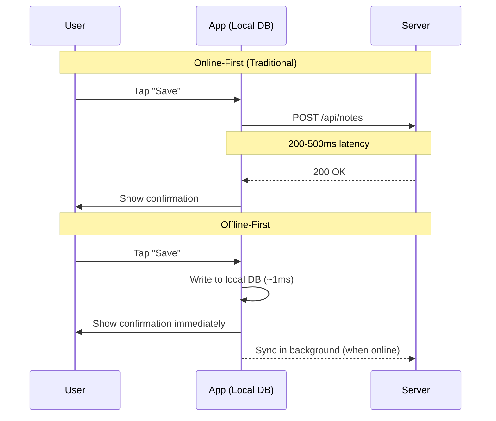
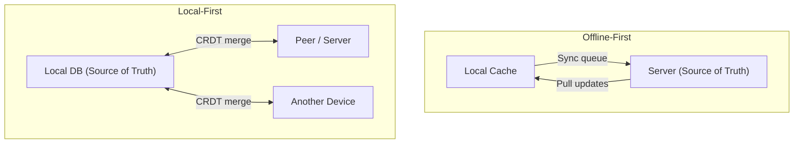
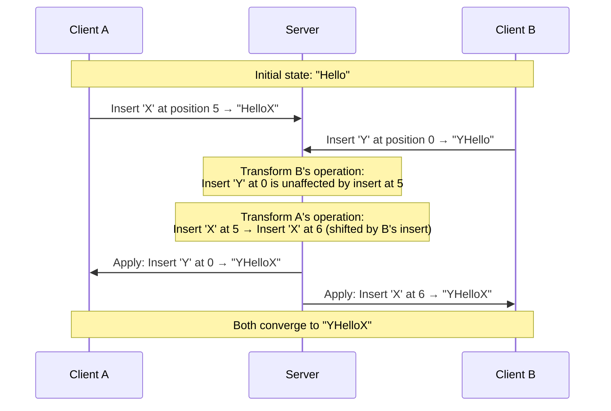
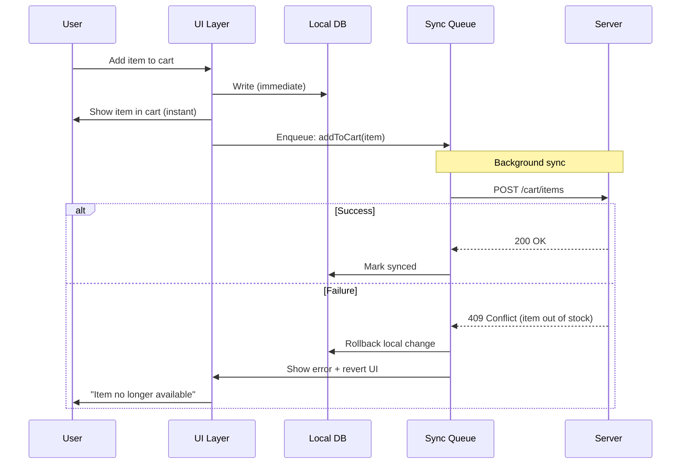
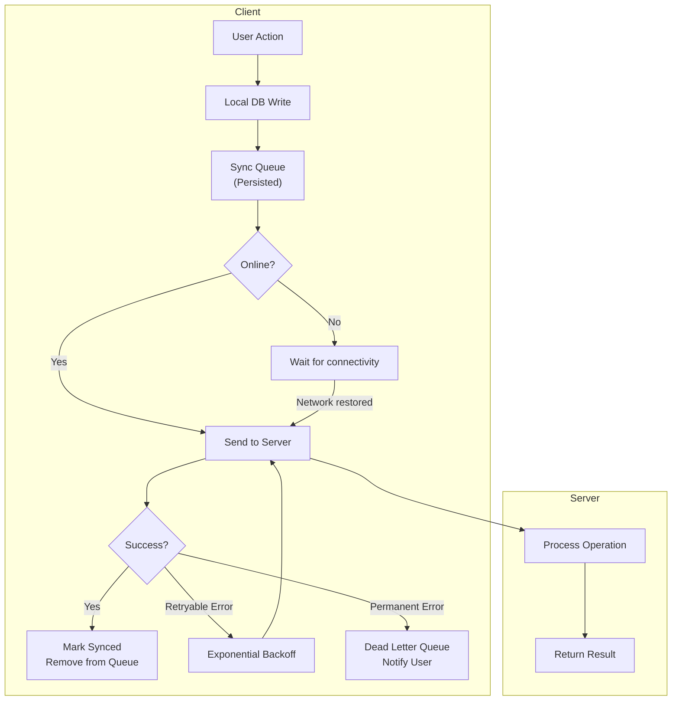
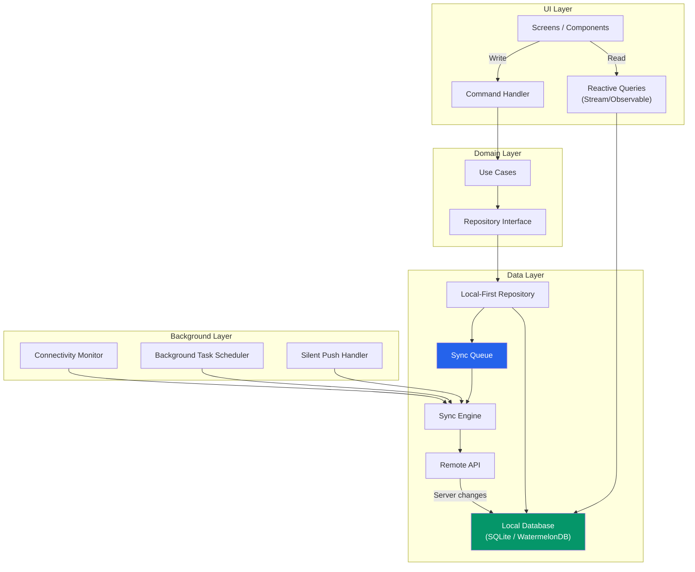

# Offline-First & Local-First

Offline-first is not about handling the edge case where the user has no internet. It is about building an application architecture where the local device is the source of truth and the network is an optimization. In an offline-first app, every read comes from the local database, every write goes to the local database first, and synchronization with the server happens asynchronously in the background.

This is a fundamental inversion of the standard client-server model, where the client is a thin layer that fetches data from and submits data to a remote API. The offline-first approach is harder to build, but it produces apps that feel instantaneous, work anywhere, and never lose user work.

**Related**: [Mobile Engineering Overview](/mobile-engineering/) | [Push Notifications](/mobile-engineering/push-notifications) | [Mobile Performance](/mobile-engineering/mobile-performance) | [CRDTs](/system-design/distributed-systems/crdt-fundamentals)

---

## Why Offline Matters

The assumption that "users always have internet" is empirically false:

| Scenario | Frequency | Duration |
|----------|-----------|----------|
| Subway / underground transit | Daily (millions) | 5-30 minutes |
| Airplane mode | Weekly (travelers) | 1-12 hours |
| Elevator / parking garage | Multiple daily | 30 seconds - 5 minutes |
| Poor cellular coverage | Constant (rural areas) | Ongoing |
| WiFi dead zones in buildings | Common | Minutes |
| International roaming (data off) | Travel periods | Days |
| Network congestion (events, stadiums) | Periodic | Hours |

But offline-first is not just about no connectivity. It is about **latency independence**. Even with a fast connection, reading from a local database takes <1ms. Fetching from an API takes 100-500ms. An offline-first app eliminates that latency for every interaction, making the app feel dramatically faster.



---

## Offline-First vs Local-First

These terms are related but distinct:

| Property | Offline-First | Local-First |
|----------|-------------|-------------|
| **Primary goal** | Work without internet | User owns their data |
| **Source of truth** | Server (synced to local) | Local device |
| **Conflict resolution** | Server wins (usually) | Automatic merge (CRDTs) |
| **Multi-device** | Server mediates sync | Peer-to-peer possible |
| **Data ownership** | Cloud provider owns data | User owns data |
| **Examples** | Google Docs offline, Todoist | Linear, Figma, Notion (partial) |



::: tip Local-First Is the Future
The local-first movement (championed by Martin Kleppmann and Ink & Switch) argues that software should work like a local file — fast, available, and under the user's control. Technologies like CRDTs make this architecturally feasible. If you are building a new app that involves user-generated content, seriously consider a local-first architecture.
:::

---

## Sync Strategies

### Strategy 1: Last Write Wins (LWW)

The simplest conflict resolution: the most recent write overwrites all previous writes.

```typescript
interface SyncableRecord {
  id: string;
  data: Record<string, unknown>;
  updatedAt: number;  // Unix timestamp (milliseconds)
  clientId: string;   // Which client made this change
  version: number;    // Incrementing version counter
  deletedAt: number | null;  // Soft delete timestamp
}

class LWWSyncEngine {
  constructor(
    private localDb: LocalDatabase,
    private api: SyncApi
  ) {}

  async pushChanges(): Promise<void> {
    const pendingChanges = await this.localDb.getUnsynced();

    if (pendingChanges.length === 0) return;

    const response = await this.api.sync({
      clientId: this.clientId,
      changes: pendingChanges,
      lastSyncTimestamp: await this.getLastSyncTimestamp(),
    });

    // Apply server's version of conflicts (server wins)
    for (const serverRecord of response.resolvedConflicts) {
      await this.localDb.upsert(serverRecord);
    }

    // Apply new changes from other clients
    for (const newRecord of response.newFromServer) {
      await this.localDb.upsert(newRecord);
    }

    // Mark pushed changes as synced
    await this.localDb.markSynced(pendingChanges.map((c) => c.id));
    await this.setLastSyncTimestamp(response.serverTimestamp);
  }

  async pullChanges(): Promise<void> {
    const lastSync = await this.getLastSyncTimestamp();
    const response = await this.api.getChangesSince(lastSync);

    for (const record of response.changes) {
      const local = await this.localDb.get(record.id);

      if (!local || record.updatedAt > local.updatedAt) {
        // Server version is newer — apply it
        await this.localDb.upsert(record);
      }
      // Otherwise keep local version (it will be pushed next sync)
    }

    await this.setLastSyncTimestamp(response.serverTimestamp);
  }
}
```

::: warning LWW Loses Data
Last-write-wins means conflicting changes are silently discarded. If two users edit the same note offline, only the last writer's changes survive. This is acceptable for some data (preferences, counters) but unacceptable for user-created content (documents, messages).
:::

### Strategy 2: Operational Transform (OT)

Used by Google Docs. Operations (insert, delete) are transformed against concurrent operations to preserve intent.



### Strategy 3: CRDTs (Conflict-Free Replicated Data Types)

CRDTs are data structures that can be modified independently on different devices and merged automatically without conflicts.

```typescript
// G-Counter CRDT: a counter that only grows
// Each node maintains its own count; total = sum of all nodes
class GCounter {
  private counts: Map<string, number> = new Map();

  constructor(private nodeId: string) {}

  increment(amount: number = 1): void {
    const current = this.counts.get(this.nodeId) ?? 0;
    this.counts.set(this.nodeId, current + amount);
  }

  get value(): number {
    let total = 0;
    for (const count of this.counts.values()) {
      total += count;
    }
    return total;
  }

  // Merge is simply taking the max of each node's count
  merge(other: GCounter): GCounter {
    const merged = new GCounter(this.nodeId);
    const allNodes = new Set([
      ...this.counts.keys(),
      ...other.counts.keys(),
    ]);

    for (const node of allNodes) {
      merged.counts.set(
        node,
        Math.max(
          this.counts.get(node) ?? 0,
          other.counts.get(node) ?? 0
        )
      );
    }

    return merged;
  }
}

// LWW-Register CRDT: a single value with timestamp
class LWWRegister<T> {
  constructor(
    public value: T,
    public timestamp: number,
    public nodeId: string
  ) {}

  set(newValue: T, timestamp: number, nodeId: string): LWWRegister<T> {
    if (
      timestamp > this.timestamp ||
      (timestamp === this.timestamp && nodeId > this.nodeId)
    ) {
      return new LWWRegister(newValue, timestamp, nodeId);
    }
    return this;
  }

  merge(other: LWWRegister<T>): LWWRegister<T> {
    if (
      other.timestamp > this.timestamp ||
      (other.timestamp === this.timestamp && other.nodeId > this.nodeId)
    ) {
      return other;
    }
    return this;
  }
}

// LWW-Map CRDT: a map where each key is an LWW-Register
class LWWMap<V> {
  private entries: Map<string, LWWRegister<V | null>> = new Map();

  set(key: string, value: V, timestamp: number, nodeId: string): void {
    const existing = this.entries.get(key);
    if (existing) {
      this.entries.set(key, existing.set(value, timestamp, nodeId));
    } else {
      this.entries.set(key, new LWWRegister(value, timestamp, nodeId));
    }
  }

  delete(key: string, timestamp: number, nodeId: string): void {
    this.set(key, null as any, timestamp, nodeId);
  }

  get(key: string): V | undefined {
    const entry = this.entries.get(key);
    if (entry && entry.value !== null) return entry.value;
    return undefined;
  }

  merge(other: LWWMap<V>): LWWMap<V> {
    const merged = new LWWMap<V>();
    const allKeys = new Set([
      ...this.entries.keys(),
      ...other.entries.keys(),
    ]);

    for (const key of allKeys) {
      const ours = this.entries.get(key);
      const theirs = other.entries.get(key);

      if (ours && theirs) {
        merged.entries.set(key, ours.merge(theirs));
      } else {
        merged.entries.set(key, (ours ?? theirs)!);
      }
    }

    return merged;
  }
}
```

### CRDT Comparison

| CRDT Type | Use Case | Merge Strategy | Limitations |
|-----------|----------|---------------|-------------|
| **G-Counter** | Like counts, view counts | Max per node | Only increments |
| **PN-Counter** | Inventory, balance | Positive + Negative G-Counters | No floor/ceiling |
| **LWW-Register** | Single values (name, status) | Higher timestamp wins | Concurrent updates lost |
| **MV-Register** | Values needing conflict visibility | Keep all concurrent values | User must resolve |
| **G-Set** | Tags, categories | Union | No removal |
| **OR-Set** | Todo lists, collections | Unique tags per add | Metadata overhead |
| **LWW-Map** | Key-value settings | LWW per key | Per-key conflicts only |
| **Automerge/Yjs** | Rich text, complex documents | Tree-based CRDT | Library size, complexity |

::: tip Use Automerge or Yjs for Documents
Building CRDTs from scratch for complex data structures (rich text, nested objects, lists with reordering) is extremely difficult. Use battle-tested libraries like [Automerge](https://automerge.org/) or [Yjs](https://yjs.dev/) that implement sophisticated tree CRDTs with efficient binary encodings. Both have mobile-friendly implementations.
:::

---

## Local Databases

### SQLite

The most widely deployed database in the world. Available on every mobile platform.

::: code-group

```typescript
// React Native: WatermelonDB (built on SQLite, optimized for React Native)
import { Database } from '@nozbe/watermelondb';
import { Model, field, text, date, readonly, children }
  from '@nozbe/watermelondb/decorators';

class Note extends Model {
  static table = 'notes';
  static associations = {
    tags: { type: 'has_many' as const, foreignKey: 'note_id' },
  };

  @text('title') title!: string;
  @text('body') body!: string;
  @field('is_synced') isSynced!: boolean;
  @readonly @date('created_at') createdAt!: Date;
  @date('updated_at') updatedAt!: Date;
  @children('tags') tags!: any;

  async markSynced() {
    await this.update((note) => {
      note.isSynced = true;
    });
  }
}

// Querying is lazy and optimized
const unsyncedNotes = await database
  .get<Note>('notes')
  .query(Q.where('is_synced', false))
  .fetch();

// Batch operations for sync
await database.write(async () => {
  const batch = serverNotes.map((serverNote) =>
    database.get<Note>('notes').prepareCreate((note) => {
      note.title = serverNote.title;
      note.body = serverNote.body;
      note.isSynced = true;
    })
  );
  await database.batch(...batch);
});
```

```dart
// Flutter: Drift (formerly Moor) — type-safe SQLite
import 'package:drift/drift.dart';

// Table definition
class Notes extends Table {
  IntColumn get id => integer().autoIncrement()();
  TextColumn get title => text().withLength(min: 1, max: 255)();
  TextColumn get body => text()();
  BoolColumn get isSynced => boolean().withDefault(const Constant(false))();
  DateTimeColumn get createdAt => dateTime().withDefault(currentDateAndTime)();
  DateTimeColumn get updatedAt => dateTime().nullable()();
  TextColumn get syncId => text().nullable()();  // Server-side ID
}

// Database
@DriftDatabase(tables: [Notes])
class AppDatabase extends _$AppDatabase {
  AppDatabase(QueryExecutor e) : super(e);

  @override
  int get schemaVersion => 1;

  // Type-safe queries
  Future<List<Note>> getUnsyncedNotes() {
    return (select(notes)..where((n) => n.isSynced.equals(false))).get();
  }

  Future<void> upsertFromServer(ServerNote serverNote) {
    return into(notes).insertOnConflictUpdate(NotesCompanion(
      syncId: Value(serverNote.id),
      title: Value(serverNote.title),
      body: Value(serverNote.body),
      isSynced: const Value(true),
      updatedAt: Value(serverNote.updatedAt),
    ));
  }

  // Watch for changes (reactive)
  Stream<List<Note>> watchAllNotes() {
    return (select(notes)
          ..orderBy([(n) => OrderingTerm.desc(n.updatedAt)]))
        .watch();
  }
}
```

:::

### Database Comparison

| Database | Platform | Language | Query | Reactive | Sync Built-in | Size Overhead |
|----------|----------|---------|-------|----------|--------------|---------------|
| **SQLite** (raw) | Both | SQL | Full SQL | No | No | 0 (system) |
| **WatermelonDB** | React Native | JS/SQL | JS query builder | Yes | Yes (pull) | ~500 KB |
| **Drift** | Flutter | Dart/SQL | Type-safe Dart | Yes | No | ~200 KB |
| **Realm** | Both | Native | Object queries | Yes | Yes (Atlas) | ~5 MB |
| **Hive** | Flutter | Dart | Key-value | Yes | No | ~100 KB |
| **MMKV** | Both | C++ | Key-value | No | No | ~50 KB |
| **PouchDB** | React Native | JS | MapReduce | Yes | Yes (CouchDB) | ~200 KB |

---

## Optimistic UI

Optimistic UI means updating the interface immediately as if the operation succeeded, then reconciling when the server responds. This eliminates perceived latency entirely.



```typescript
// Optimistic UI with rollback
class OptimisticCartService {
  constructor(
    private localDb: LocalDatabase,
    private syncQueue: SyncQueue,
    private eventBus: EventBus
  ) {}

  async addToCart(product: Product, quantity: number): Promise<void> {
    const cartItem: CartItem = {
      id: generateId(),
      productId: product.id,
      quantity,
      price: product.price,
      addedAt: Date.now(),
      syncStatus: 'pending',
    };

    // 1. Write to local DB immediately
    await this.localDb.cartItems.insert(cartItem);

    // 2. UI updates automatically (reactive query)
    // No explicit UI update needed if using WatermelonDB/Drift observers

    // 3. Enqueue sync operation
    await this.syncQueue.enqueue({
      id: generateId(),
      type: 'ADD_CART_ITEM',
      payload: { productId: product.id, quantity },
      localId: cartItem.id,
      createdAt: Date.now(),
      retryCount: 0,
      maxRetries: 3,
    });
  }

  // Called when sync fails with a conflict
  async handleSyncFailure(
    operation: SyncOperation,
    error: SyncError
  ): Promise<void> {
    if (error.code === 'OUT_OF_STOCK') {
      // Rollback: remove the optimistically added item
      await this.localDb.cartItems.delete(operation.localId);

      // Notify UI
      this.eventBus.emit('cart:rollback', {
        message: `${error.productName} is no longer available`,
        operation,
      });
    } else if (error.code === 'PRICE_CHANGED') {
      // Update with server price instead of rolling back
      await this.localDb.cartItems.update(operation.localId, {
        price: error.newPrice,
        syncStatus: 'synced',
      });

      this.eventBus.emit('cart:price-updated', {
        message: `Price updated to $${error.newPrice}`,
        operation,
      });
    }
  }
}
```

::: warning Optimistic UI Requires Rollback Planning
Every optimistic update must have a corresponding rollback path. Before implementing optimistic UI for an operation, ask: "What happens when the server rejects this?" If the answer involves complex state restoration (e.g., undoing a cascade of dependent changes), the operation may be better suited to a loading spinner.
:::

---

## Queue-Based Sync Architecture

A sync queue is the backbone of any offline-first system. It ensures that operations are persisted, ordered, and retried reliably.



```typescript
// Robust sync queue with retry, ordering, and dead letter handling
interface QueuedOperation {
  id: string;
  type: string;
  payload: Record<string, unknown>;
  localId: string;
  createdAt: number;
  retryCount: number;
  maxRetries: number;
  lastAttemptAt: number | null;
  status: 'pending' | 'in_progress' | 'failed' | 'dead';
  error: string | null;
  // Operations on same entity must be processed in order
  entityId: string;
  entityType: string;
}

class SyncQueue {
  private isProcessing = false;

  constructor(
    private db: LocalDatabase,
    private api: SyncApi,
    private connectivity: ConnectivityMonitor
  ) {
    // Start processing when connectivity changes
    this.connectivity.onChange((isOnline) => {
      if (isOnline) this.processQueue();
    });
  }

  async enqueue(op: Omit<QueuedOperation, 'status' | 'error' | 'lastAttemptAt'>): Promise<void> {
    await this.db.syncQueue.insert({
      ...op,
      status: 'pending',
      error: null,
      lastAttemptAt: null,
    });

    if (this.connectivity.isOnline) {
      this.processQueue();
    }
  }

  private async processQueue(): Promise<void> {
    if (this.isProcessing) return;
    this.isProcessing = true;

    try {
      while (true) {
        // Get next pending operation (FIFO within same entity)
        const op = await this.db.syncQueue.findFirst({
          where: { status: 'pending' },
          orderBy: { createdAt: 'asc' },
        });

        if (!op) break;
        if (!this.connectivity.isOnline) break;

        // Check: are there earlier operations for this entity still pending?
        const earlierOp = await this.db.syncQueue.findFirst({
          where: {
            entityId: op.entityId,
            entityType: op.entityType,
            createdAt: { lt: op.createdAt },
            status: { in: ['pending', 'in_progress'] },
          },
        });

        if (earlierOp) {
          // Skip — must wait for earlier operation on same entity
          continue;
        }

        await this.processOperation(op);
      }
    } finally {
      this.isProcessing = false;
    }
  }

  private async processOperation(op: QueuedOperation): Promise<void> {
    await this.db.syncQueue.update(op.id, {
      status: 'in_progress',
      lastAttemptAt: Date.now(),
    });

    try {
      await this.api.executeOperation(op);

      await this.db.syncQueue.update(op.id, { status: 'synced' });
      await this.db.syncQueue.delete(op.id);
    } catch (error) {
      const syncError = error as SyncError;

      if (syncError.isRetryable && op.retryCount < op.maxRetries) {
        const backoffMs = Math.min(
          1000 * Math.pow(2, op.retryCount),
          30000
        );

        await this.db.syncQueue.update(op.id, {
          status: 'pending',
          retryCount: op.retryCount + 1,
          error: syncError.message,
        });

        // Wait before retrying
        await new Promise((resolve) => setTimeout(resolve, backoffMs));
      } else {
        // Move to dead letter queue
        await this.db.syncQueue.update(op.id, {
          status: 'dead',
          error: syncError.message,
        });

        // Handle rollback
        await this.handlePermanentFailure(op, syncError);
      }
    }
  }

  private async handlePermanentFailure(
    op: QueuedOperation,
    error: SyncError
  ): Promise<void> {
    // Notify the application layer about the failure
    EventBus.emit('sync:permanent-failure', { operation: op, error });
  }
}
```

---

## Background Sync

Mobile platforms restrict background execution. You must use platform-specific APIs to perform sync when the app is not in the foreground.

### Platform Background APIs

| API | Platform | Trigger | Max Duration | Reliability |
|-----|----------|---------|-------------|-------------|
| **BGAppRefreshTask** | iOS | OS-scheduled | ~30s | Medium (discretionary) |
| **BGProcessingTask** | iOS | When charging + WiFi | ~minutes | Low (rare execution) |
| **Silent Push** | iOS | Server-initiated | ~30s | Medium |
| **WorkManager** | Android | Constraint-based | ~10 min | High |
| **Firebase JobDispatcher** | Android | Legacy | ~10 min | Medium |
| **Foreground Service** | Android | User-visible | Unlimited | Highest |

```kotlin
// Android: WorkManager for reliable background sync
import androidx.work.*
import java.util.concurrent.TimeUnit

class SyncWorker(
    context: Context,
    params: WorkerParameters
) : CoroutineWorker(context, params) {

    override suspend fun doWork(): Result {
        return try {
            val syncEngine = SyncEngine.getInstance(applicationContext)

            // Push local changes
            syncEngine.pushPendingChanges()

            // Pull remote changes
            syncEngine.pullRemoteChanges()

            Result.success()
        } catch (e: NetworkException) {
            // Retry with exponential backoff
            Result.retry()
        } catch (e: Exception) {
            if (runAttemptCount < 3) {
                Result.retry()
            } else {
                Result.failure(workDataOf("error" to e.message))
            }
        }
    }
}

// Schedule periodic sync
fun schedulePeriodSync(context: Context) {
    val constraints = Constraints.Builder()
        .setRequiredNetworkType(NetworkType.CONNECTED)
        .setRequiresBatteryNotLow(true)
        .build()

    val syncRequest = PeriodicWorkRequestBuilder<SyncWorker>(
        repeatInterval = 15,
        repeatIntervalTimeUnit = TimeUnit.MINUTES,
        flexTimeInterval = 5,
        flexTimeIntervalUnit = TimeUnit.MINUTES
    )
        .setConstraints(constraints)
        .setBackoffCriteria(
            BackoffPolicy.EXPONENTIAL,
            WorkRequest.MIN_BACKOFF_MILLIS,
            TimeUnit.MILLISECONDS
        )
        .addTag("periodic-sync")
        .build()

    WorkManager.getInstance(context).enqueueUniquePeriodicWork(
        "data-sync",
        ExistingPeriodicWorkPolicy.KEEP,
        syncRequest
    )
}

// One-time sync when user makes changes
fun triggerImmediateSync(context: Context) {
    val constraints = Constraints.Builder()
        .setRequiredNetworkType(NetworkType.CONNECTED)
        .build()

    val syncRequest = OneTimeWorkRequestBuilder<SyncWorker>()
        .setConstraints(constraints)
        .setExpedited(OutOfQuotaPolicy.RUN_AS_NON_EXPEDITED_WORK_REQUEST)
        .build()

    WorkManager.getInstance(context).enqueue(syncRequest)
}
```

::: danger iOS Background Execution Is Not Guaranteed
iOS provides no guarantee that your background task will run. The system considers battery level, user behavior (does the user open your app frequently?), network conditions, and system load. Never rely on iOS background tasks for time-critical sync. Use silent push as an additional trigger, and accept that sync may only complete when the user next opens the app.
:::

---

## Architecture Pattern: Full Offline-First Stack



| Layer | Responsibility | Offline Behavior |
|-------|---------------|-----------------|
| **UI** | Display data, capture user input | Fully functional (reads from local DB) |
| **Domain** | Business logic, validation | Fully functional (no network dependency) |
| **Local DB** | Source of truth for reads | Always available |
| **Sync Queue** | Persist pending writes | Accumulates operations while offline |
| **Sync Engine** | Reconcile local and remote state | Paused while offline, resumes automatically |
| **Background** | Trigger sync without user interaction | Platform-dependent reliability |

## Cross-References

- **[Mobile Engineering Overview](/mobile-engineering/)** — Architecture patterns and platform fundamentals
- **[CRDTs](/system-design/distributed-systems/crdt-fundamentals)** — Detailed CRDT theory including formal proofs and advanced types
- **[Push Notifications](/mobile-engineering/push-notifications)** — Silent push as a background sync trigger
- **[Mobile Performance](/mobile-engineering/mobile-performance)** — Database query optimization and memory management for local storage
- **[React Native Deep Dive](/mobile-engineering/react-native)** — WatermelonDB and MMKV for React Native persistence
- **[Flutter Architecture](/mobile-engineering/flutter)** — Drift, Hive, and isolates for background database work

---

> *"Offline-first is not about the absence of a network — it is about the presence of a local database that makes the network optional."*
