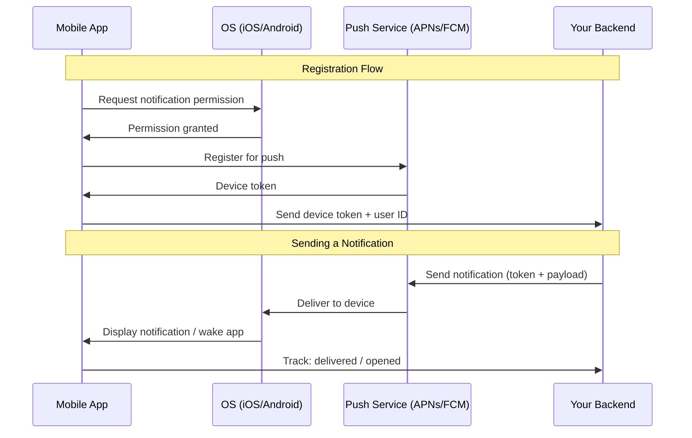
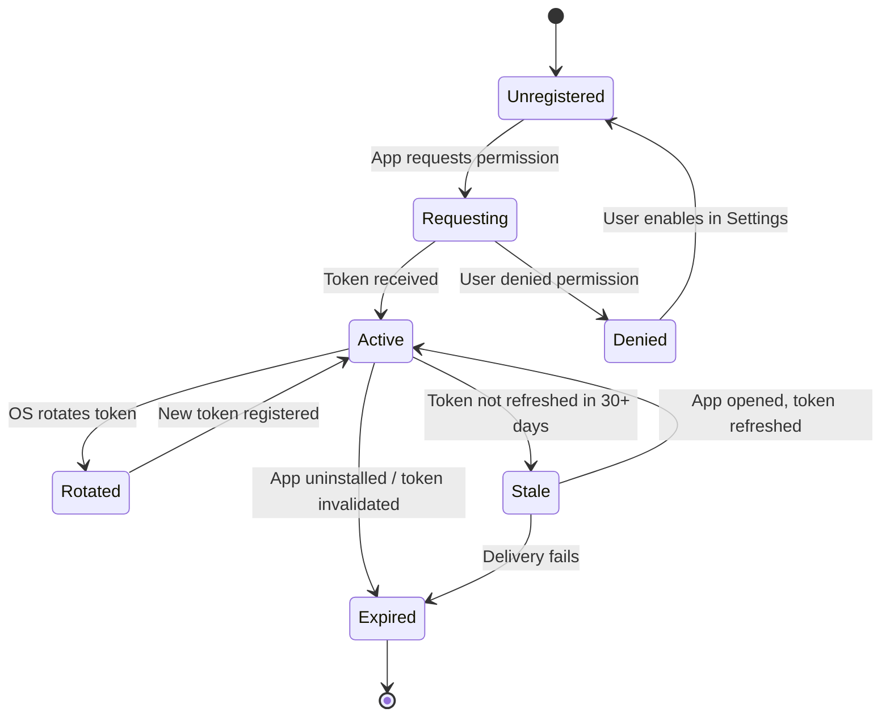
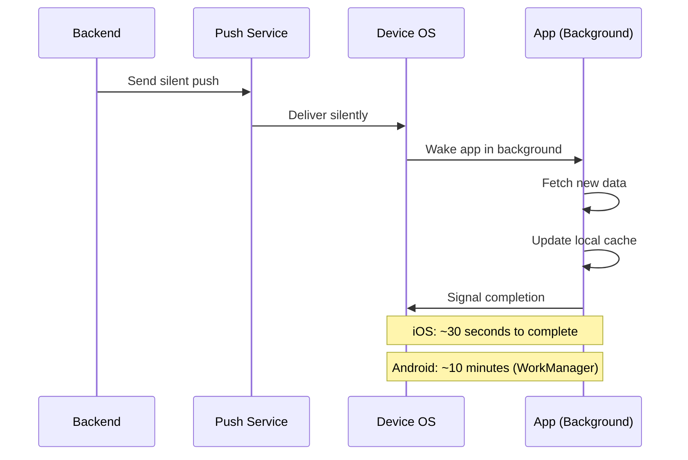
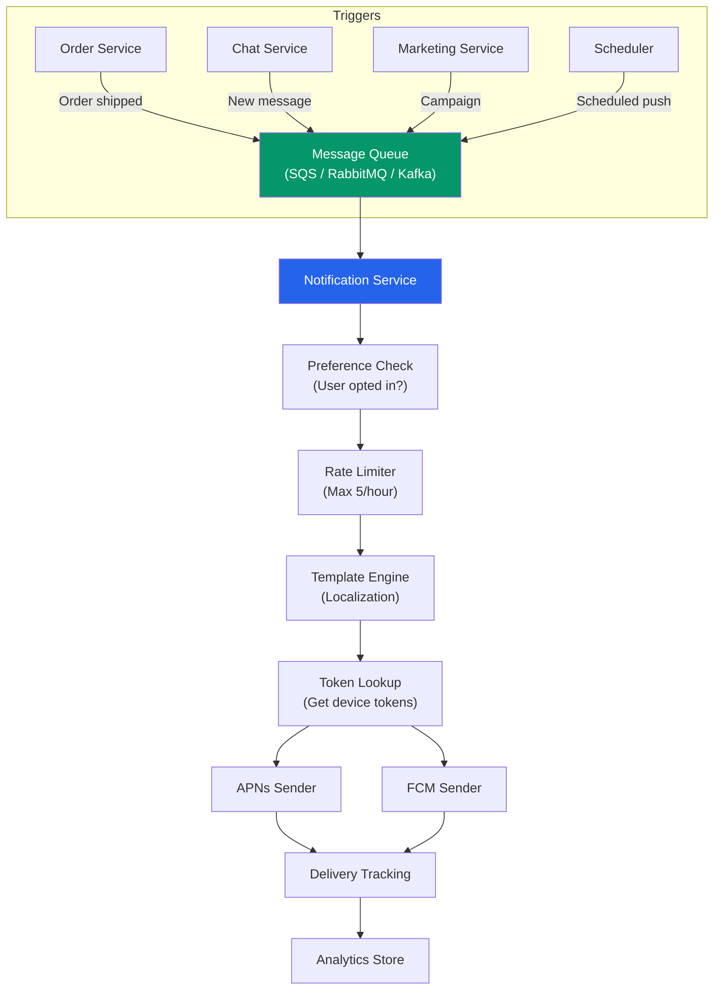
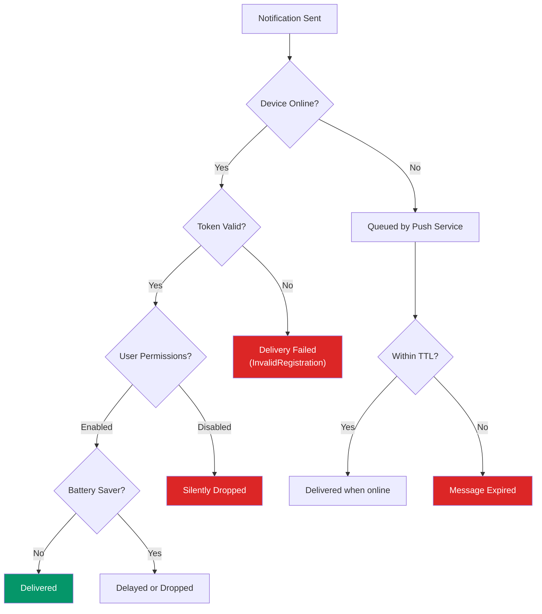
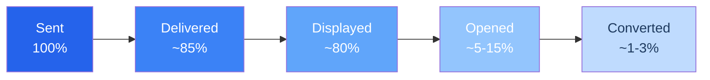

# Push Notification Architecture

Push notifications are one of the most powerful engagement tools in mobile — and one of the most abused. A well-designed notification system delivers timely, relevant information that users value. A poorly designed one trains users to disable notifications entirely, or worse, uninstall the app.

The technical architecture behind push notifications is surprisingly complex. Messages travel through multiple intermediary systems (APNs, FCM), tokens expire and rotate, devices go offline, users have multiple devices, platforms impose different payload limits, and silent notifications have entirely different delivery guarantees than visible ones. This page covers the full stack — from platform notification services through backend architecture to analytics.

**Related**: [Mobile Engineering Overview](/mobile-engineering/) | [React Native Deep Dive](/mobile-engineering/react-native) | [Flutter Architecture](/mobile-engineering/flutter)

---

## How Push Notifications Work



### The Two Platform Services

Every push notification on iOS goes through Apple Push Notification service (APNs). Every push notification on Android goes through Firebase Cloud Messaging (FCM). There is no way around this — these are the only delivery mechanisms the platforms provide.

| Feature | APNs (Apple) | FCM (Google) |
|---------|-------------|-------------|
| **Protocol** | HTTP/2 | HTTP/1.1 or gRPC |
| **Auth** | JWT or certificate | OAuth 2.0 (service account) |
| **Max payload** | 4 KB | 4 KB (data), 4 KB (notification) |
| **Priority levels** | 1 (low), 5 (normal), 10 (high) | Normal, High |
| **TTL** | 0 - 30 days (default: 30 days) | 0 - 28 days (default: 28 days) |
| **Topic/channel routing** | Required (bundle ID) | Optional (topics, conditions) |
| **Silent push** | `content-available: 1` | `data` message (no `notification` key) |
| **Rate limiting** | Yes (undocumented limits) | Yes (per-device, per-topic) |
| **Feedback** | HTTP/2 response codes | FCM Reporting API |
| **Delivery guarantee** | At-most-once (best effort) | At-most-once (best effort) |

::: warning Push Is Not Guaranteed Delivery
Neither APNs nor FCM guarantee message delivery. Messages can be dropped if the device is offline too long (beyond TTL), if the user has disabled notifications, if the device is in battery saver mode, or if the push service is under load. Never use push notifications as the sole delivery mechanism for critical information.
:::

---

## Token Management

Device tokens are the address where push services deliver notifications. Token management is one of the most error-prone parts of any push notification system.

### Token Lifecycle



### Token Rotation Scenarios

| Scenario | What Happens | Action Required |
|----------|-------------|----------------|
| App reinstalled | New token generated | Register new token, old becomes invalid |
| OS update | Token may rotate | Re-register on app launch |
| Backup & restore to new device | New token generated | Register new token on new device |
| Token refresh (periodic) | APNs/FCM rotates token | Update backend with new token |
| App uninstalled | Token becomes invalid | Clean up on failed delivery feedback |
| Multiple devices | Each device has own token | Store tokens per-device, not per-user |

### Backend Token Storage

```typescript
// Token management service
interface DeviceToken {
  token: string;
  platform: 'ios' | 'android';
  userId: string;
  deviceId: string;  // Unique device identifier
  appVersion: string;
  createdAt: Date;
  lastActiveAt: Date;
  isActive: boolean;
}

class TokenService {
  constructor(private db: Database) {}

  async registerToken(data: RegisterTokenRequest): Promise<void> {
    // Upsert by deviceId — handles token rotation
    await this.db.deviceTokens.upsert({
      where: { deviceId: data.deviceId },
      update: {
        token: data.token,
        userId: data.userId,
        appVersion: data.appVersion,
        lastActiveAt: new Date(),
        isActive: true,
      },
      create: {
        token: data.token,
        platform: data.platform,
        userId: data.userId,
        deviceId: data.deviceId,
        appVersion: data.appVersion,
        createdAt: new Date(),
        lastActiveAt: new Date(),
        isActive: true,
      },
    });

    // Deactivate old tokens for this user on this platform
    // (handles app reinstall where deviceId changes)
    await this.db.deviceTokens.updateMany({
      where: {
        userId: data.userId,
        platform: data.platform,
        deviceId: { not: data.deviceId },
        lastActiveAt: {
          lt: new Date(Date.now() - 30 * 24 * 60 * 60 * 1000), // 30 days
        },
      },
      data: { isActive: false },
    });
  }

  async handleDeliveryFailure(
    token: string,
    errorCode: string
  ): Promise<void> {
    const invalidCodes = [
      'InvalidRegistration',   // FCM: token is invalid
      'NotRegistered',         // FCM: app uninstalled
      'BadDeviceToken',        // APNs: invalid token
      'Unregistered',          // APNs: app uninstalled
    ];

    if (invalidCodes.includes(errorCode)) {
      await this.db.deviceTokens.update({
        where: { token },
        data: { isActive: false },
      });
    }
  }

  async getTokensForUser(userId: string): Promise<DeviceToken[]> {
    return this.db.deviceTokens.findMany({
      where: {
        userId,
        isActive: true,
        lastActiveAt: {
          gt: new Date(Date.now() - 90 * 24 * 60 * 60 * 1000), // 90 days
        },
      },
    });
  }
}
```

::: danger Never Use Token as Primary Key
Device tokens change. If you use the token as a primary key, a token rotation creates a "new" device instead of updating the existing one. Use a stable device identifier as the primary key and treat the token as a mutable field.
:::

---

## Notification Types

### Visible Notifications

Standard notifications that appear in the notification center and can display text, images, and action buttons.

```typescript
// APNs payload structure
const apnsPayload = {
  aps: {
    alert: {
      title: 'Order Shipped',
      subtitle: 'Order #12345',
      body: 'Your package is on its way! Expected delivery: March 22.',
    },
    badge: 3,
    sound: 'default',
    'thread-id': 'order-updates',
    'interruption-level': 'active',  // passive | active | time-sensitive | critical
    'relevance-score': 0.8,
  },
  // Custom data for your app
  orderId: '12345',
  deepLink: '/orders/12345/tracking',
};

// FCM payload structure
const fcmPayload = {
  message: {
    token: 'device-token-here',
    notification: {
      title: 'Order Shipped',
      body: 'Your package is on its way! Expected delivery: March 22.',
      image: 'https://example.com/shipped-icon.png',
    },
    data: {
      orderId: '12345',
      deepLink: '/orders/12345/tracking',
    },
    android: {
      priority: 'high',
      notification: {
        channelId: 'order_updates',
        icon: 'ic_notification',
        color: '#4A90D9',
        clickAction: 'OPEN_ORDER_DETAIL',
      },
    },
    apns: {
      headers: {
        'apns-priority': '10',
        'apns-push-type': 'alert',
      },
      payload: {
        aps: {
          'thread-id': 'order-updates',
          'interruption-level': 'time-sensitive',
        },
      },
    },
  },
};
```

### Silent Push (Data-Only)

Silent notifications wake your app in the background without showing anything to the user. They are used for data sync, content updates, and cache invalidation.



```typescript
// iOS silent push payload
const silentPush = {
  aps: {
    'content-available': 1,
    // No alert, badge, or sound
  },
  syncType: 'new_messages',
  lastSyncTimestamp: 1711032000,
};

// FCM data-only message (silent on Android)
const fcmDataOnly = {
  message: {
    token: 'device-token-here',
    // No 'notification' key — this makes it silent
    data: {
      syncType: 'new_messages',
      lastSyncTimestamp: '1711032000',
    },
    android: {
      priority: 'high',  // Required for timely delivery
    },
    apns: {
      headers: {
        'apns-push-type': 'background',
        'apns-priority': '5',  // Must be 5 for background
      },
      payload: {
        aps: {
          'content-available': 1,
        },
      },
    },
  },
};
```

::: warning Silent Push Reliability
iOS aggressively throttles silent push based on the app's "energy budget." If your app uses too much background time, iOS will delay or drop subsequent silent notifications. You cannot rely on silent push for time-critical sync. Use it for opportunistic data prefetching, not as a real-time communication channel.
:::

### Rich Notifications

Rich notifications include images, videos, custom layouts, and interactive elements.

```swift
// iOS: Notification Service Extension (modifies notification before display)
import UserNotifications

class NotificationService: UNNotificationServiceExtension {
    override func didReceive(
        _ request: UNNotificationRequest,
        withContentHandler contentHandler:
            @escaping (UNNotificationContent) -> Void
    ) {
        guard let bestAttempt = request.content
            .mutableCopy() as? UNMutableNotificationContent else {
            contentHandler(request.content)
            return
        }

        // Download and attach image
        if let imageUrlString = request.content
            .userInfo["imageUrl"] as? String,
           let imageUrl = URL(string: imageUrlString) {
            downloadImage(from: imageUrl) { localUrl in
                if let localUrl = localUrl,
                   let attachment = try? UNNotificationAttachment(
                    identifier: "image",
                    url: localUrl
                   ) {
                    bestAttempt.attachments = [attachment]
                }
                contentHandler(bestAttempt)
            }
        } else {
            contentHandler(bestAttempt)
        }
    }

    private func downloadImage(
        from url: URL,
        completion: @escaping (URL?) -> Void
    ) {
        URLSession.shared.downloadTask(with: url) { localUrl, _, error in
            guard let localUrl = localUrl, error == nil else {
                completion(nil)
                return
            }
            let tmpUrl = localUrl.appendingPathExtension("png")
            try? FileManager.default.moveItem(at: localUrl, to: tmpUrl)
            completion(tmpUrl)
        }.resume()
    }
}
```

---

## Notification Channels (Android)

Android 8.0+ requires notification channels. Users can control notification settings per-channel, making proper channel design critical.

```kotlin
// Android notification channel setup
import android.app.NotificationChannel
import android.app.NotificationManager
import android.content.Context
import android.media.AudioAttributes
import android.net.Uri

class NotificationChannelManager(private val context: Context) {

    fun createChannels() {
        val manager = context.getSystemService(
            NotificationManager::class.java
        )

        val channels = listOf(
            NotificationChannel(
                "order_updates",
                "Order Updates",
                NotificationManager.IMPORTANCE_HIGH
            ).apply {
                description = "Updates about your orders (shipping, delivery)"
                enableVibration(true)
                setShowBadge(true)
            },

            NotificationChannel(
                "messages",
                "Messages",
                NotificationManager.IMPORTANCE_HIGH
            ).apply {
                description = "Direct messages from other users"
                enableVibration(true)
                enableLights(true)
                lightColor = 0xFF2563EB.toInt()
            },

            NotificationChannel(
                "promotions",
                "Promotions & Offers",
                NotificationManager.IMPORTANCE_LOW
            ).apply {
                description = "Sales, discounts, and special offers"
                enableVibration(false)
                setShowBadge(false)
            },

            NotificationChannel(
                "system",
                "System Notifications",
                NotificationManager.IMPORTANCE_DEFAULT
            ).apply {
                description = "App updates and system messages"
            },
        )

        manager.createNotificationChannels(channels)
    }
}
```

| Channel | Importance | Vibration | Badge | Use Case |
|---------|-----------|-----------|-------|----------|
| **order_updates** | High | Yes | Yes | Shipping, delivery confirmations |
| **messages** | High | Yes | Yes | Direct messages, chat |
| **promotions** | Low | No | No | Marketing, deals |
| **system** | Default | Default | Default | App updates, maintenance |

::: tip Channel Strategy
Create the minimum number of channels that give users meaningful control. Too many channels overwhelm users. Too few prevent granular control. Group notifications by user intent: "Would a user want to turn off this type independently?" If yes, it deserves its own channel.
:::

---

## Backend Architecture

### Notification Service Design



### Implementation

```typescript
// Notification service with preferences, rate limiting, and delivery tracking
interface NotificationRequest {
  userId: string;
  type: NotificationType;
  title: string;
  body: string;
  data?: Record<string, string>;
  imageUrl?: string;
  priority?: 'normal' | 'high';
  ttlSeconds?: number;
  collapseKey?: string;
}

class NotificationService {
  constructor(
    private tokenService: TokenService,
    private preferenceService: PreferenceService,
    private rateLimiter: RateLimiter,
    private apnsSender: APNsSender,
    private fcmSender: FCMSender,
    private analytics: NotificationAnalytics,
    private templateEngine: TemplateEngine
  ) {}

  async send(request: NotificationRequest): Promise<NotificationResult> {
    const notificationId = generateId();

    // 1. Check user preferences
    const prefs = await this.preferenceService.getPreferences(
      request.userId
    );
    if (!prefs.isEnabled(request.type)) {
      return { id: notificationId, status: 'skipped', reason: 'user_opted_out' };
    }

    // 2. Rate limiting
    const allowed = await this.rateLimiter.check(
      request.userId,
      request.type
    );
    if (!allowed) {
      return { id: notificationId, status: 'skipped', reason: 'rate_limited' };
    }

    // 3. Get all active tokens for user
    const tokens = await this.tokenService.getTokensForUser(
      request.userId
    );
    if (tokens.length === 0) {
      return { id: notificationId, status: 'skipped', reason: 'no_tokens' };
    }

    // 4. Localize content
    const userLocale = await this.preferenceService.getLocale(
      request.userId
    );
    const localizedTitle = this.templateEngine.render(
      request.title,
      userLocale
    );
    const localizedBody = this.templateEngine.render(
      request.body,
      userLocale
    );

    // 5. Send to each device
    const results = await Promise.allSettled(
      tokens.map(async (token) => {
        const sender = token.platform === 'ios'
          ? this.apnsSender
          : this.fcmSender;

        try {
          await sender.send({
            token: token.token,
            title: localizedTitle,
            body: localizedBody,
            data: {
              ...request.data,
              notificationId,
            },
            imageUrl: request.imageUrl,
            priority: request.priority ?? 'normal',
            ttlSeconds: request.ttlSeconds ?? 86400,
            collapseKey: request.collapseKey,
          });

          return { deviceId: token.deviceId, status: 'sent' as const };
        } catch (error) {
          await this.tokenService.handleDeliveryFailure(
            token.token,
            (error as PushError).code
          );
          return {
            deviceId: token.deviceId,
            status: 'failed' as const,
            error: (error as PushError).code,
          };
        }
      })
    );

    // 6. Track analytics
    await this.analytics.trackSend({
      notificationId,
      userId: request.userId,
      type: request.type,
      sentAt: new Date(),
      deviceResults: results.map((r) =>
        r.status === 'fulfilled' ? r.value : { status: 'error' }
      ),
    });

    return { id: notificationId, status: 'sent' };
  }
}
```

### Rate Limiting

```typescript
class NotificationRateLimiter {
  constructor(private redis: Redis) {}

  async check(
    userId: string,
    type: NotificationType
  ): Promise<boolean> {
    const limits: Record<NotificationType, RateLimit> = {
      'order_update': { max: 20, windowSeconds: 3600 },
      'message': { max: 50, windowSeconds: 3600 },
      'promotion': { max: 3, windowSeconds: 86400 },
      'system': { max: 10, windowSeconds: 3600 },
    };

    const limit = limits[type];
    const key = `notif_rate:${userId}:${type}`;
    const count = await this.redis.incr(key);

    if (count === 1) {
      await this.redis.expire(key, limit.windowSeconds);
    }

    return count <= limit.max;
  }
}
```

---

## Delivery Reliability

Push notification delivery is inherently unreliable. Here is how to maximize delivery rates.

### Delivery Failure Modes



### Strategies for Reliability

| Strategy | Description | Trade-off |
|----------|------------|-----------|
| **Collapse keys** | Replace unread notifications of the same type | Reduces notification spam, may miss updates |
| **TTL tuning** | Short TTL for time-sensitive, long for persistent | Expired messages never delivered |
| **Priority selection** | High for user-initiated, normal for marketing | High priority quota is limited |
| **Fallback channels** | SMS or email if push fails after timeout | Cost per message, user annoyance |
| **In-app inbox** | Store notifications server-side, show in app | Guaranteed visibility but requires app open |
| **Confirmation tracking** | Track delivery + open rates | Requires client-side reporting |

::: tip Build an In-App Notification Inbox
Push notifications are unreliable and ephemeral — once dismissed, they are gone. Always maintain a server-side notification inbox that stores every notification sent to a user. When the app opens, sync the inbox to show missed notifications. This pattern guarantees that critical information reaches the user even if push delivery fails.
:::

---

## Analytics

### Notification Funnel



### Key Metrics

| Metric | Definition | Benchmark |
|--------|-----------|-----------|
| **Delivery rate** | Delivered / Sent | 80-95% |
| **Display rate** | Displayed / Delivered | 90-99% |
| **Open rate** | Opened / Displayed | 5-15% |
| **Conversion rate** | Converted / Opened | 10-30% |
| **Opt-out rate** | Disabled / Total users | < 5% monthly |
| **Uninstall correlation** | Uninstalls within 24h of push | < 0.1% |

```typescript
// Client-side analytics tracking
class NotificationAnalyticsClient {
  async trackReceived(notificationId: string): Promise<void> {
    await this.sendEvent({
      event: 'notification_received',
      notificationId,
      timestamp: Date.now(),
      appState: AppState.currentState, // active | background | inactive
    });
  }

  async trackOpened(
    notificationId: string,
    source: 'tap' | 'action_button'
  ): Promise<void> {
    await this.sendEvent({
      event: 'notification_opened',
      notificationId,
      timestamp: Date.now(),
      source,
      timeToOpen: this.calculateTimeToOpen(notificationId),
    });
  }

  async trackDismissed(notificationId: string): Promise<void> {
    await this.sendEvent({
      event: 'notification_dismissed',
      notificationId,
      timestamp: Date.now(),
    });
  }

  async trackActionTaken(
    notificationId: string,
    action: string
  ): Promise<void> {
    await this.sendEvent({
      event: 'notification_action',
      notificationId,
      action,
      timestamp: Date.now(),
    });
  }

  private async sendEvent(event: AnalyticsEvent): Promise<void> {
    // Batch events and send periodically to avoid
    // triggering radio state changes for each event
    this.eventQueue.push(event);
    this.scheduleBatchSend();
  }
}
```

::: danger Monitor Opt-Out and Uninstall Correlation
If your notification opt-out rate exceeds 5% per month or uninstall rates spike within 24 hours of push campaigns, you are sending too many notifications, sending irrelevant content, or sending at the wrong time. Track these metrics and treat them as critical product health indicators.
:::

---

## Cross-Platform Implementation

### React Native with Expo Notifications

```typescript
import * as Notifications from 'expo-notifications';
import * as Device from 'expo-device';
import { Platform } from 'react-native';

// Configure notification behavior
Notifications.setNotificationHandler({
  handleNotification: async (notification) => ({
    shouldShowAlert: true,
    shouldPlaySound: true,
    shouldSetBadge: true,
    priority: Notifications.AndroidNotificationPriority.HIGH,
  }),
});

async function registerForPushNotifications(): Promise<string | null> {
  if (!Device.isDevice) {
    console.warn('Push notifications require a physical device');
    return null;
  }

  const { status: existingStatus } =
    await Notifications.getPermissionsAsync();

  let finalStatus = existingStatus;

  if (existingStatus !== 'granted') {
    const { status } = await Notifications.requestPermissionsAsync();
    finalStatus = status;
  }

  if (finalStatus !== 'granted') {
    return null;
  }

  // Get Expo push token (wraps APNs/FCM)
  const tokenData = await Notifications.getExpoPushTokenAsync({
    projectId: 'your-expo-project-id',
  });

  // Set up Android notification channels
  if (Platform.OS === 'android') {
    await Notifications.setNotificationChannelAsync('order_updates', {
      name: 'Order Updates',
      importance: Notifications.AndroidImportance.HIGH,
      vibrationPattern: [0, 250, 250, 250],
    });

    await Notifications.setNotificationChannelAsync('messages', {
      name: 'Messages',
      importance: Notifications.AndroidImportance.HIGH,
      sound: 'message.wav',
    });
  }

  return tokenData.data;
}

// Handle notification interactions
function useNotificationListeners() {
  useEffect(() => {
    // When notification is received while app is in foreground
    const receivedSubscription =
      Notifications.addNotificationReceivedListener((notification) => {
        const data = notification.request.content.data;
        analytics.trackReceived(data.notificationId as string);
      });

    // When user taps on notification
    const responseSubscription =
      Notifications.addNotificationResponseReceivedListener((response) => {
        const data = response.notification.request.content.data;
        const deepLink = data.deepLink as string;

        analytics.trackOpened(data.notificationId as string, 'tap');

        if (deepLink) {
          router.push(deepLink);
        }
      });

    return () => {
      receivedSubscription.remove();
      responseSubscription.remove();
    };
  }, []);
}
```

### Flutter with Firebase Messaging

```dart
import 'package:firebase_messaging/firebase_messaging.dart';
import 'package:flutter_local_notifications/flutter_local_notifications.dart';

class PushNotificationService {
  final FirebaseMessaging _messaging = FirebaseMessaging.instance;
  final FlutterLocalNotificationsPlugin _localNotifications =
      FlutterLocalNotificationsPlugin();

  Future<void> initialize() async {
    // Request permission
    final settings = await _messaging.requestPermission(
      alert: true,
      badge: true,
      sound: true,
      provisional: false,
    );

    if (settings.authorizationStatus != AuthorizationStatus.authorized) {
      return;
    }

    // Get token and register with backend
    final token = await _messaging.getToken();
    if (token != null) {
      await _registerToken(token);
    }

    // Listen for token refresh
    _messaging.onTokenRefresh.listen(_registerToken);

    // Handle foreground messages
    FirebaseMessaging.onMessage.listen(_handleForegroundMessage);

    // Handle background message tap
    FirebaseMessaging.onMessageOpenedApp.listen(_handleMessageTap);

    // Handle terminated state tap
    final initialMessage = await _messaging.getInitialMessage();
    if (initialMessage != null) {
      _handleMessageTap(initialMessage);
    }
  }

  void _handleForegroundMessage(RemoteMessage message) {
    // Show local notification when app is in foreground
    _localNotifications.show(
      message.hashCode,
      message.notification?.title,
      message.notification?.body,
      NotificationDetails(
        android: AndroidNotificationDetails(
          message.data['channelId'] ?? 'default',
          'Default',
          importance: Importance.high,
          priority: Priority.high,
        ),
        iOS: const DarwinNotificationDetails(
          presentAlert: true,
          presentBadge: true,
          presentSound: true,
        ),
      ),
      payload: jsonEncode(message.data),
    );
  }

  void _handleMessageTap(RemoteMessage message) {
    final deepLink = message.data['deepLink'];
    if (deepLink != null) {
      NavigationService.navigateTo(deepLink);
    }
  }

  Future<void> _registerToken(String token) async {
    await ApiService.registerPushToken(
      token: token,
      platform: Platform.isIOS ? 'ios' : 'android',
    );
  }
}

// Background message handler (must be top-level function)
@pragma('vm:entry-point')
Future<void> firebaseMessagingBackgroundHandler(
  RemoteMessage message,
) async {
  await Firebase.initializeApp();
  // Process background message (e.g., update local DB)
}
```

## Cross-References

- **[Mobile Engineering Overview](/mobile-engineering/)** — Platform fundamentals and architecture decisions
- **[React Native Deep Dive](/mobile-engineering/react-native)** — React Native-specific notification setup with Expo
- **[Flutter Architecture](/mobile-engineering/flutter)** — Flutter Firebase Messaging integration
- **[Offline-First & Local-First](/mobile-engineering/offline-first)** — Using silent push to trigger background sync
- **[System Design > Message Queues](/system-design/message-queues/)** — Queue-based architectures for reliable notification delivery

---

> *"The best notification is one the user is glad they received. Every other notification is training them to turn your app off."*
