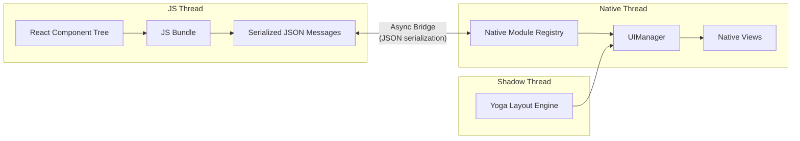
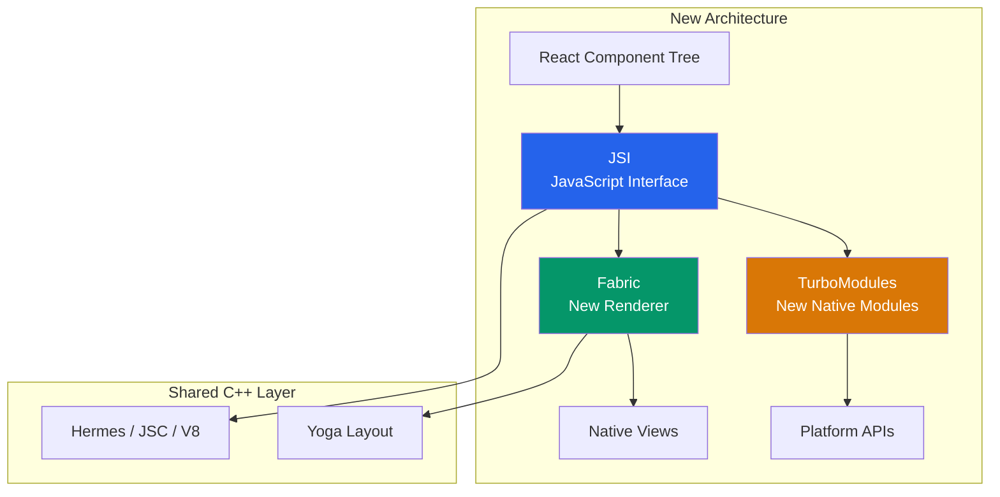
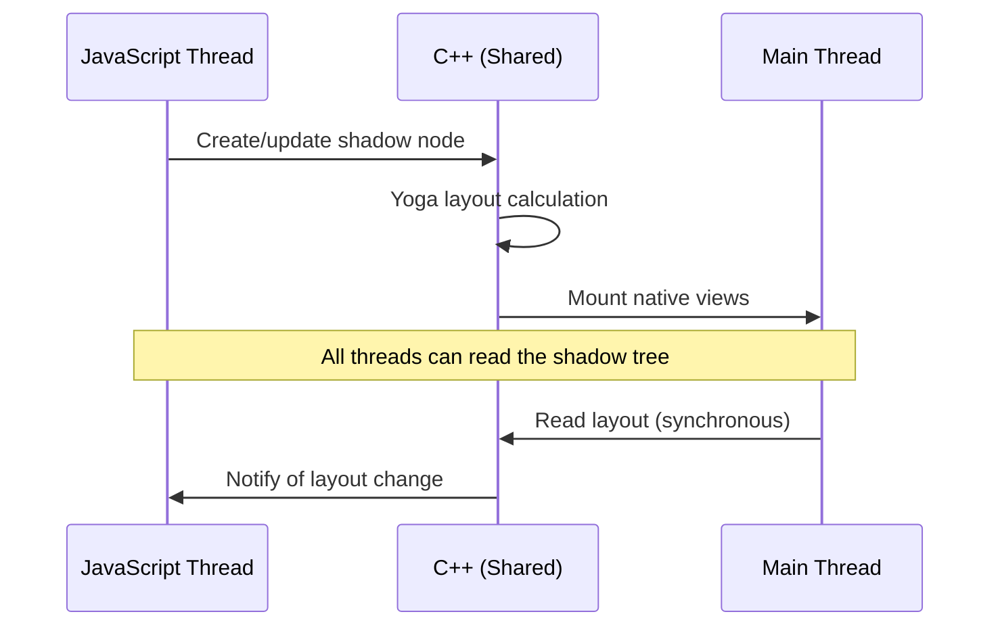
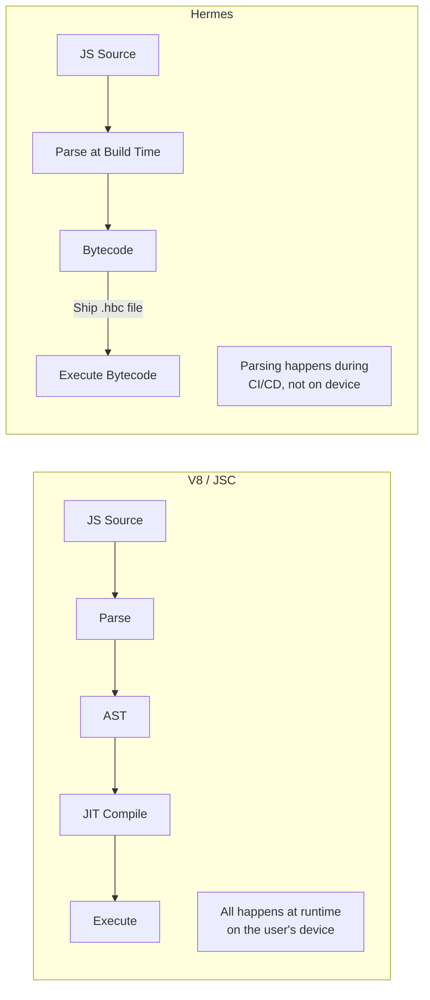
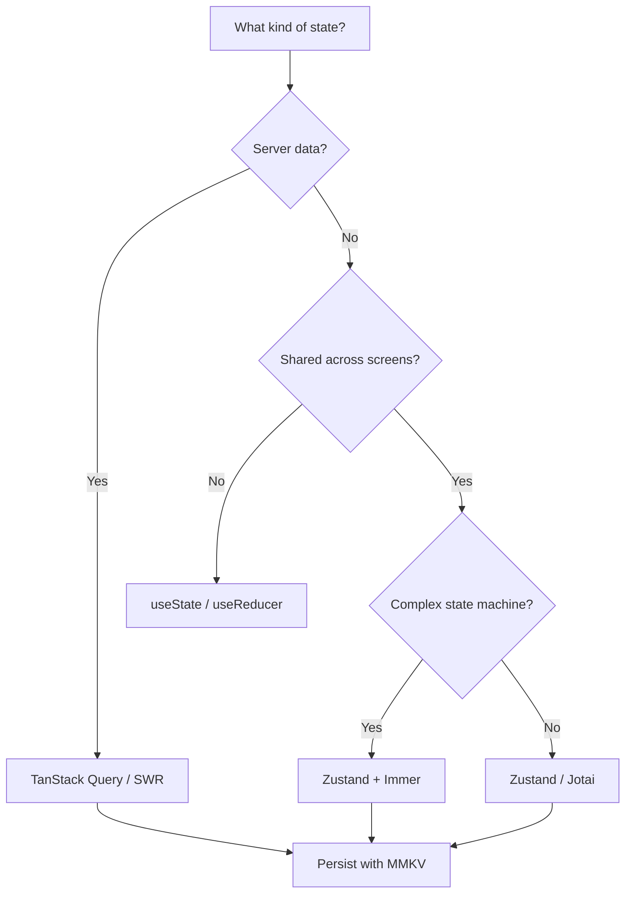
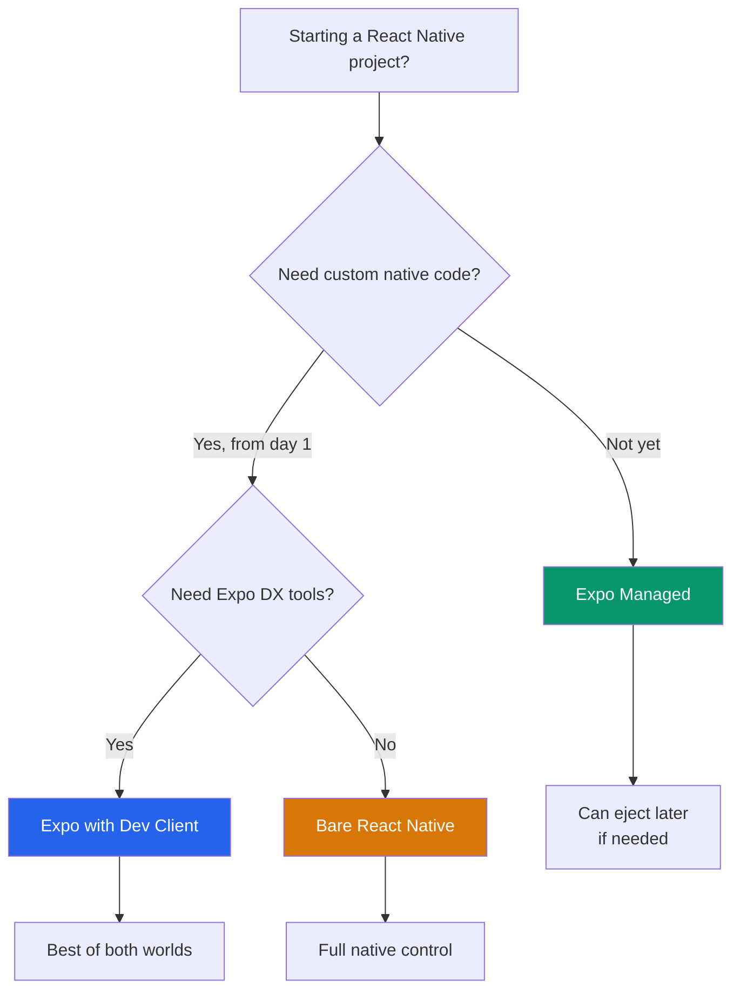

# React Native Deep Dive

React Native lets you build native mobile apps using JavaScript and React. But unlike a web app that renders to the DOM, React Native renders to actual native platform views. Understanding how that translation happens — from your JSX through the JavaScript runtime to native UIKit or Android views — is what separates developers who use React Native from developers who can diagnose and fix it when it breaks.

This page covers React Native's architecture in depth: the old bridge, the new architecture (JSI, Fabric, TurboModules), the Hermes engine, navigation patterns, state management, and the critical decision between Expo and bare workflow.

**Related**: [Mobile Engineering Overview](/mobile-engineering/) | [Mobile Performance](/mobile-engineering/mobile-performance) | [Offline-First](/mobile-engineering/offline-first)

---

## The Old Architecture: The Bridge

React Native's original architecture was built around an asynchronous bridge between JavaScript and native code. Understanding the old architecture is essential because much production code still runs on it, and it explains why the new architecture was necessary.



### How the Bridge Worked

1. React renders your component tree in JavaScript
2. Layout instructions are serialized as JSON and sent across the bridge
3. The Shadow Thread runs Yoga (a C++ layout engine) to calculate positions
4. Calculated layouts are sent to the native thread
5. Native views are created or updated

### Bridge Problems

| Problem | Impact |
|---------|--------|
| **Async serialization** | Every JS-to-native call requires JSON serialization/deserialization |
| **Single-threaded bridge** | All messages queue through one bridge — creates bottleneck |
| **No synchronous calls** | Cannot synchronously read native values (e.g., scroll position) |
| **Startup overhead** | All native modules loaded at startup, even if unused |
| **Type safety** | JSON has no type guarantees — errors appear at runtime |

::: warning Bridge Bottleneck
The #1 cause of jank in old-architecture React Native apps is bridge congestion. Rapid scrolling, animations, and gesture handlers all send high-frequency messages across the bridge. When the bridge queue backs up, frames drop. This is why libraries like `react-native-reanimated` moved animation logic entirely to the native thread.
:::

---

## The New Architecture

React Native's new architecture (introduced in 0.68, default from 0.76) replaces the bridge with three pillars: **JSI**, **Fabric**, and **TurboModules**.



### JSI (JavaScript Interface)

JSI is the foundation of the new architecture. It is a C++ API that allows JavaScript to hold direct references to native C++ objects — and vice versa. No serialization. No bridge. Direct function calls.

```typescript
// Old architecture: async bridge call
// JS sends JSON → Bridge → Native deserializes → executes → serializes result → Bridge → JS
const result = await NativeModules.Calculator.multiply(3, 7);

// New architecture: synchronous JSI call
// JS calls C++ function directly through host object reference
const result = global.__calculatorModule.multiply(3, 7);
```

Key properties of JSI:

- **Synchronous calls** — JavaScript can call native code and get results immediately
- **No serialization** — objects are shared by reference, not copied as JSON
- **Engine-agnostic** — JSI abstracts the JS engine, making it possible to swap Hermes for V8 or JavaScriptCore
- **Host Objects** — native C++ objects exposed to JavaScript as regular objects

### Fabric (New Renderer)

Fabric is the new rendering system that replaces the old UIManager. Its key innovation is that rendering can happen synchronously when needed, and the shadow tree is shared between JavaScript and native via C++.



**Fabric improvements over the old renderer:**

| Feature | Old Renderer | Fabric |
|---------|-------------|--------|
| Thread model | Async between 3 threads | Shared immutable tree, any thread can read |
| Synchronous access | Not possible | Supported via JSI |
| Priority rendering | Not supported | React 18 concurrent features |
| Type safety | Runtime JSON validation | C++ compile-time guarantees |
| View flattening | Limited | Aggressive — fewer native views |

### TurboModules

TurboModules replace the old native module system. The two critical improvements:

1. **Lazy loading** — modules are loaded only when first accessed, not all at startup
2. **Codegen** — TypeScript/Flow specs generate C++ interfaces, ensuring type safety between JS and native

```typescript
// TurboModule specification (TypeScript)
import type { TurboModule } from 'react-native';
import { TurboModuleRegistry } from 'react-native';

export interface Spec extends TurboModule {
  multiply(a: number, b: number): number;  // synchronous!
  fetchUserProfile(userId: string): Promise<UserProfile>;  // async when needed
  addEventListener(eventName: string): void;
}

export default TurboModuleRegistry.getEnforcing<Spec>(
  'CalculatorModule'
);
```

::: tip Codegen Is Not Optional
In the new architecture, TurboModule specs are used to generate C++ bindings at build time. If your TypeScript spec says `multiply` takes two `number` arguments, the generated C++ code enforces this at the type level. No more runtime crashes from mismatched bridge types.
:::

---

## Hermes Engine

Hermes is a JavaScript engine built by Meta specifically for React Native. Unlike V8 or JavaScriptCore, Hermes is optimized for mobile constraints.

### How Hermes Differs



| Metric | JavaScriptCore | Hermes |
|--------|---------------|--------|
| **TTI (Time to Interactive)** | ~4.0s | ~2.0s |
| **Binary size overhead** | ~4 MB | ~2 MB |
| **Memory usage** | Higher | 30-50% lower |
| **Startup strategy** | Parse + compile at launch | Execute precompiled bytecode |
| **JIT compilation** | Yes | No (AOT bytecode only) |
| **Garbage collection** | Generational GC | GenGC optimized for mobile |

::: warning Hermes and eval()
Hermes does not support `eval()`, `new Function()`, or any runtime code generation because it ships precompiled bytecode. If you depend on libraries that use `eval` (some older template engines, for example), they will not work with Hermes. Check library compatibility before adopting.
:::

### Hermes Bytecode Precompilation

```bash
# During build, Hermes compiles JS to bytecode
hermesc -emit-binary -out bundle.hbc bundle.js

# The .hbc file is what ships in your APK/IPA
# No parsing at runtime = faster startup
```

---

## Navigation

Navigation in React Native is more complex than web routing. Mobile apps have stacks, tabs, drawers, modals, and gestures — all with platform-specific transition animations.

### React Navigation vs Expo Router

| Feature | React Navigation | Expo Router |
|---------|-----------------|-------------|
| **Paradigm** | Imperative/component-based | File-based routing |
| **Configuration** | JavaScript objects | File system structure |
| **Deep linking** | Manual configuration | Automatic from file paths |
| **Type safety** | Manual typing | Auto-generated types |
| **Web support** | Limited | First-class (shared URLs) |
| **Learning curve** | Moderate | Low (Next.js-like) |

### React Navigation Setup

```typescript
import { NavigationContainer } from '@react-navigation/native';
import { createNativeStackNavigator } from '@react-navigation/native-stack';
import { createBottomTabNavigator } from '@react-navigation/bottom-tabs';

// Type-safe navigation params
type RootStackParamList = {
  Home: undefined;
  ProductDetail: { productId: string };
  Cart: undefined;
  Checkout: { totalAmount: number };
};

type TabParamList = {
  HomeTab: undefined;
  SearchTab: undefined;
  ProfileTab: undefined;
};

const Stack = createNativeStackNavigator<RootStackParamList>();
const Tab = createBottomTabNavigator<TabParamList>();

function HomeTabs() {
  return (
    <Tab.Navigator
      screenOptions={({ route }) => ({
        tabBarIcon: ({ color, size }) => {
          const icons: Record<string, string> = {
            HomeTab: 'home',
            SearchTab: 'search',
            ProfileTab: 'person',
          };
          return <Icon name={icons[route.name]} size={size} color={color} />;
        },
      })}
    >
      <Tab.Screen name="HomeTab" component={HomeScreen} />
      <Tab.Screen name="SearchTab" component={SearchScreen} />
      <Tab.Screen name="ProfileTab" component={ProfileScreen} />
    </Tab.Navigator>
  );
}

function App() {
  return (
    <NavigationContainer>
      <Stack.Navigator>
        <Stack.Screen
          name="Home"
          component={HomeTabs}
          options={{ headerShown: false }}
        />
        <Stack.Screen
          name="ProductDetail"
          component={ProductDetailScreen}
          options={{ title: 'Product' }}
        />
        <Stack.Screen name="Cart" component={CartScreen} />
        <Stack.Screen name="Checkout" component={CheckoutScreen} />
      </Stack.Navigator>
    </NavigationContainer>
  );
}
```

### Expo Router (File-Based)

```
app/
├── _layout.tsx          # Root layout (Stack)
├── (tabs)/
│   ├── _layout.tsx      # Tab layout
│   ├── index.tsx         # Home tab → /
│   ├── search.tsx        # Search tab → /search
│   └── profile.tsx       # Profile tab → /profile
├── product/
│   └── [id].tsx          # → /product/123
├── cart.tsx              # → /cart
└── checkout.tsx          # → /checkout
```

```typescript
// app/product/[id].tsx
import { useLocalSearchParams } from 'expo-router';
import { View, Text } from 'react-native';

export default function ProductDetail() {
  const { id } = useLocalSearchParams<{ id: string }>();

  return (
    <View>
      <Text>Product ID: {id}</Text>
    </View>
  );
}
```

::: tip Choose Expo Router for New Projects
Unless you have a specific reason not to, Expo Router is the recommended navigation solution for new React Native projects. File-based routing eliminates configuration boilerplate, deep linking works automatically, and the mental model matches Next.js — making it easier for web developers to transition.
:::

---

## State Management

React Native shares the React ecosystem, so most web state management solutions work. However, mobile has additional constraints around persistence, offline support, and memory.

### Recommended Stack



### Zustand with MMKV Persistence

```typescript
import { create } from 'zustand';
import { persist, createJSONStorage } from 'zustand/middleware';
import { MMKV } from 'react-native-mmkv';

const storage = new MMKV();

const mmkvStorage = {
  getItem: (name: string) => {
    const value = storage.getString(name);
    return value ?? null;
  },
  setItem: (name: string, value: string) => {
    storage.set(name, value);
  },
  removeItem: (name: string) => {
    storage.delete(name);
  },
};

interface CartStore {
  items: CartItem[];
  addItem: (item: CartItem) => void;
  removeItem: (id: string) => void;
  clearCart: () => void;
  totalPrice: () => number;
}

export const useCartStore = create<CartStore>()(
  persist(
    (set, get) => ({
      items: [],
      addItem: (item) =>
        set((state) => ({
          items: [...state.items, item],
        })),
      removeItem: (id) =>
        set((state) => ({
          items: state.items.filter((i) => i.id !== id),
        })),
      clearCart: () => set({ items: [] }),
      totalPrice: () =>
        get().items.reduce((sum, item) => sum + item.price * item.quantity, 0),
    }),
    {
      name: 'cart-storage',
      storage: createJSONStorage(() => mmkvStorage),
    }
  )
);
```

::: warning AsyncStorage Is Slow
The default `AsyncStorage` in React Native is backed by SQLite on Android and serialized plists on iOS. For state persistence, use `react-native-mmkv` instead — it is 30x faster because it uses memory-mapped I/O and avoids the bridge entirely through JSI.
:::

---

## Native Modules (New Architecture)

When you need platform-specific functionality not available through existing libraries, you write a native module.

### TurboModule Example: Haptic Feedback

**Step 1: TypeScript Spec**

```typescript
// src/specs/NativeHapticFeedback.ts
import type { TurboModule } from 'react-native';
import { TurboModuleRegistry } from 'react-native';

export interface Spec extends TurboModule {
  impactLight(): void;
  impactMedium(): void;
  impactHeavy(): void;
  notificationSuccess(): void;
  notificationWarning(): void;
  notificationError(): void;
  selectionChanged(): void;
}

export default TurboModuleRegistry.getEnforcing<Spec>('HapticFeedback');
```

**Step 2: iOS Implementation (Swift)**

```swift
import UIKit

@objc(HapticFeedback)
class HapticFeedback: NSObject {

  @objc func impactLight() {
    let generator = UIImpactFeedbackGenerator(style: .light)
    generator.prepare()
    generator.impactOccurred()
  }

  @objc func impactMedium() {
    let generator = UIImpactFeedbackGenerator(style: .medium)
    generator.prepare()
    generator.impactOccurred()
  }

  @objc func impactHeavy() {
    let generator = UIImpactFeedbackGenerator(style: .heavy)
    generator.prepare()
    generator.impactOccurred()
  }

  @objc func notificationSuccess() {
    let generator = UINotificationFeedbackGenerator()
    generator.notificationOccurred(.success)
  }

  @objc func notificationWarning() {
    let generator = UINotificationFeedbackGenerator()
    generator.notificationOccurred(.warning)
  }

  @objc func notificationError() {
    let generator = UINotificationFeedbackGenerator()
    generator.notificationOccurred(.error)
  }

  @objc func selectionChanged() {
    let generator = UISelectionFeedbackGenerator()
    generator.selectionChanged()
  }
}
```

**Step 3: Android Implementation (Kotlin)**

```kotlin
package com.myapp.haptic

import android.os.Build
import android.os.VibrationEffect
import android.os.Vibrator
import android.os.VibratorManager
import android.content.Context
import com.facebook.react.bridge.ReactApplicationContext
import com.facebook.react.bridge.ReactMethod
import com.facebook.react.turbomodule.core.interfaces.TurboModule

class HapticFeedbackModule(
    private val reactContext: ReactApplicationContext
) : NativeHapticFeedbackSpec(reactContext), TurboModule {

    private fun vibrate(duration: Long, amplitude: Int) {
        val vibrator = if (Build.VERSION.SDK_INT >= Build.VERSION_CODES.S) {
            val manager = reactContext.getSystemService(
                Context.VIBRATOR_MANAGER_SERVICE
            ) as VibratorManager
            manager.defaultVibrator
        } else {
            @Suppress("DEPRECATION")
            reactContext.getSystemService(Context.VIBRATOR_SERVICE) as Vibrator
        }

        if (Build.VERSION.SDK_INT >= Build.VERSION_CODES.O) {
            vibrator.vibrate(
                VibrationEffect.createOneShot(duration, amplitude)
            )
        } else {
            @Suppress("DEPRECATION")
            vibrator.vibrate(duration)
        }
    }

    @ReactMethod
    override fun impactLight() = vibrate(20, 40)

    @ReactMethod
    override fun impactMedium() = vibrate(40, 120)

    @ReactMethod
    override fun impactHeavy() = vibrate(60, 255)

    @ReactMethod
    override fun notificationSuccess() = vibrate(30, 80)

    @ReactMethod
    override fun notificationWarning() = vibrate(50, 160)

    @ReactMethod
    override fun notificationError() = vibrate(80, 255)

    @ReactMethod
    override fun selectionChanged() = vibrate(10, 20)

    override fun getName(): String = "HapticFeedback"
}
```

---

## Expo vs Bare Workflow

This is the second most important decision after "native vs cross-platform."



| Feature | Expo Managed | Expo Dev Client | Bare RN |
|---------|-------------|-----------------|---------|
| **Native code access** | No (config plugins only) | Yes (custom dev builds) | Yes |
| **OTA updates** | EAS Update | EAS Update | CodePush / custom |
| **Build service** | EAS Build (cloud) | EAS Build (cloud) | Local / CI |
| **Xcode/Android Studio** | Not needed | For native modules | Required |
| **App size** | Larger (includes Expo runtime) | Larger | Smallest |
| **Setup time** | Minutes | 30 minutes | Hours |
| **Upgrade difficulty** | Easy (SDK versioning) | Moderate | Hard (manual patches) |
| **Library compatibility** | Expo SDK + pure JS | All libraries | All libraries |

::: tip Expo Is the Default Choice in 2026
The React Native team officially recommends Expo as the default way to build React Native apps. With Expo Modules API, Config Plugins, and EAS Build, the gap between "managed" and "bare" has nearly closed. Start with Expo unless you have a concrete reason not to.
:::

::: danger When Expo Does Not Work
Expo is not suitable when: (1) you need a custom C++ TurboModule with tight performance requirements, (2) your app must link against proprietary native SDKs that have no Expo config plugin, (3) your build pipeline cannot use cloud builds (air-gapped enterprise environments), or (4) your app size budget is extremely tight and the Expo runtime overhead is unacceptable.
:::

---

## Performance Patterns

### Avoiding Re-Renders

```typescript
import React, { memo, useCallback, useMemo } from 'react';
import { FlatList, View, Text, Pressable } from 'react-native';

interface Item {
  id: string;
  title: string;
  price: number;
}

// Memoize list items to prevent re-render when parent state changes
const ProductItem = memo(function ProductItem({
  item,
  onPress,
}: {
  item: Item;
  onPress: (id: string) => void;
}) {
  return (
    <Pressable onPress={() => onPress(item.id)}>
      <View style={styles.item}>
        <Text>{item.title}</Text>
        <Text>${item.price.toFixed(2)}</Text>
      </View>
    </Pressable>
  );
});

function ProductList({ products }: { products: Item[] }) {
  // Stable callback reference — does not cause child re-renders
  const handlePress = useCallback((id: string) => {
    navigation.navigate('ProductDetail', { productId: id });
  }, []);

  // Stable key extractor
  const keyExtractor = useCallback((item: Item) => item.id, []);

  // Optimized FlatList configuration
  return (
    <FlatList
      data={products}
      renderItem={({ item }) => (
        <ProductItem item={item} onPress={handlePress} />
      )}
      keyExtractor={keyExtractor}
      // Performance optimizations
      removeClippedSubviews={true}
      maxToRenderPerBatch={10}
      windowSize={5}
      initialNumToRender={10}
      getItemLayout={(_, index) => ({
        length: ITEM_HEIGHT,
        offset: ITEM_HEIGHT * index,
        index,
      })}
    />
  );
}
```

### Reanimated for 60fps Animations

```typescript
import Animated, {
  useSharedValue,
  useAnimatedStyle,
  withSpring,
  withTiming,
  interpolate,
  Extrapolation,
} from 'react-native-reanimated';
import { Gesture, GestureDetector } from 'react-native-gesture-handler';

function SwipeableCard() {
  const translateX = useSharedValue(0);
  const opacity = useSharedValue(1);

  // This runs on the UI thread — no bridge, no JS thread involvement
  const gesture = Gesture.Pan()
    .onUpdate((event) => {
      translateX.value = event.translationX;
      opacity.value = interpolate(
        Math.abs(event.translationX),
        [0, 200],
        [1, 0.3],
        Extrapolation.CLAMP
      );
    })
    .onEnd((event) => {
      if (Math.abs(event.translationX) > 150) {
        // Swipe threshold reached — animate off screen
        translateX.value = withTiming(
          Math.sign(event.translationX) * 400,
          { duration: 200 }
        );
        opacity.value = withTiming(0, { duration: 200 });
      } else {
        // Snap back
        translateX.value = withSpring(0);
        opacity.value = withSpring(1);
      }
    });

  const animatedStyle = useAnimatedStyle(() => ({
    transform: [{ translateX: translateX.value }],
    opacity: opacity.value,
  }));

  return (
    <GestureDetector gesture={gesture}>
      <Animated.View style={[styles.card, animatedStyle]}>
        {/* Card content */}
      </Animated.View>
    </GestureDetector>
  );
}
```

---

## Testing

```typescript
// Component test with React Native Testing Library
import { render, screen, fireEvent, waitFor } from '@testing-library/react-native';
import { ProductList } from './ProductList';

const mockProducts = [
  { id: '1', title: 'Widget A', price: 29.99 },
  { id: '2', title: 'Widget B', price: 49.99 },
];

describe('ProductList', () => {
  it('renders all products', () => {
    render(<ProductList products={mockProducts} />);

    expect(screen.getByText('Widget A')).toBeTruthy();
    expect(screen.getByText('Widget B')).toBeTruthy();
  });

  it('navigates to detail on press', () => {
    const mockNavigate = jest.fn();
    jest.spyOn(navigation, 'navigate').mockImplementation(mockNavigate);

    render(<ProductList products={mockProducts} />);
    fireEvent.press(screen.getByText('Widget A'));

    expect(mockNavigate).toHaveBeenCalledWith('ProductDetail', {
      productId: '1',
    });
  });

  it('displays formatted prices', () => {
    render(<ProductList products={mockProducts} />);

    expect(screen.getByText('$29.99')).toBeTruthy();
    expect(screen.getByText('$49.99')).toBeTruthy();
  });
});
```

## Common Pitfalls

| Pitfall | Symptom | Fix |
|---------|---------|-----|
| Inline functions in `renderItem` | FlatList re-renders all visible items | Extract component, use `memo` and `useCallback` |
| Large images without caching | Memory spikes, OOM crashes | Use `expo-image` or `react-native-fast-image` |
| Uncontrolled `console.log` | Significant perf degradation in debug | Use `babel-plugin-transform-remove-console` for production |
| Not setting `getItemLayout` | FlatList cannot optimize scroll-to-index | Provide if items have fixed height |
| Running animations on JS thread | Jank during gestures and transitions | Use `react-native-reanimated` (worklets run on UI thread) |
| Importing entire lodash | Bundle size bloats by ~70KB | Use `lodash/specific-function` or `es-toolkit` |

## Cross-References

- **[Mobile Engineering Overview](/mobile-engineering/)** — Platform decision framework and architecture patterns
- **[Flutter Architecture](/mobile-engineering/flutter)** — Compare React Native's approach with Flutter's own rendering engine
- **[Mobile Performance](/mobile-engineering/mobile-performance)** — Deep dive into profiling, memory management, and 60fps rendering
- **[Push Notifications](/mobile-engineering/push-notifications)** — Implementing push in React Native with Expo Notifications or native modules
- **[Offline-First](/mobile-engineering/offline-first)** — Persistence and sync strategies using WatermelonDB or custom SQLite
- **[State Management Patterns](/frontend-engineering/state-management)** — Zustand, Jotai, and TanStack Query patterns shared with web

---

> *"React Native does not make mobile development easy — it makes cross-platform mobile development possible without sacrificing the native feel."*
