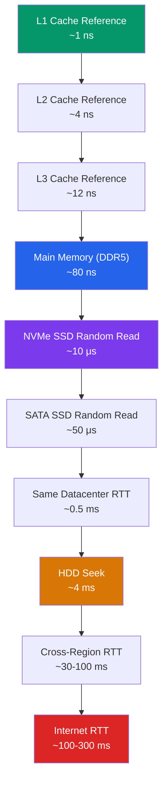
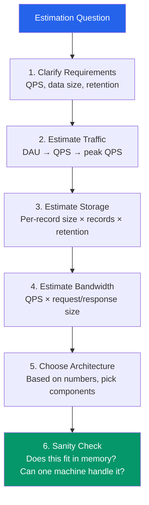

# Performance Benchmarks Reference

Every system design interview, every capacity planning exercise, and every "will this architecture work?" discussion comes down to numbers. Jeff Dean published his famous "Numbers Every Programmer Should Know" in 2009. Hardware has changed — SSDs replaced spinning disks, DDR5 replaced DDR3, NVMe replaced SATA — but the **relative magnitudes** remain surprisingly stable. This page is your reference for 2026 hardware and cloud infrastructure, organized for quick lookup and back-of-envelope estimation.

## Latency Numbers Every Engineer Should Know (2026)

### The Core Latency Hierarchy



### Complete Latency Table

| Operation | Latency | Relative (L1 = 1) | Notes |
|-----------|---------|-------------------|-------|
| **CPU: L1 cache reference** | ~1 ns | 1x | On-die, per-core |
| **CPU: Branch mispredict** | ~3 ns | 3x | Pipeline flush penalty |
| **CPU: L2 cache reference** | ~4 ns | 4x | On-die, per-core |
| **CPU: L3 cache reference** | ~12 ns | 12x | Shared across cores |
| **CPU: Mutex lock/unlock** | ~17 ns | 17x | Uncontended |
| **Memory: DDR5 reference** | ~80 ns | 80x | Random access |
| **Memory: NUMA remote node** | ~120 ns | 120x | Cross-socket access |
| **Storage: NVMe SSD random 4K read** | ~10 μs | 10,000x | PCIe Gen5 |
| **Storage: NVMe SSD sequential 1MB** | ~30 μs | 30,000x | ~30 GB/s throughput |
| **Storage: SATA SSD random 4K read** | ~50 μs | 50,000x | SATA III limited |
| **Storage: SATA SSD sequential 1MB** | ~200 μs | 200,000x | ~550 MB/s throughput |
| **Network: Same-rack RTT** | ~100 μs | 100,000x | Leaf switch |
| **Network: Same-datacenter RTT** | ~500 μs | 500,000x | Spine switch hops |
| **Storage: HDD sequential 1MB** | ~2 ms | 2,000,000x | ~200 MB/s |
| **Storage: HDD seek** | ~4 ms | 4,000,000x | Mechanical arm movement |
| **Network: Cross-AZ RTT** | ~1 ms | 1,000,000x | Same region |
| **Network: Cross-region RTT** | ~30-100 ms | 30-100M x | Speed of light + routing |
| **Network: US to Europe** | ~70-90 ms | 70-90M x | Transatlantic cable |
| **Network: US to Australia** | ~150-200 ms | 150-200M x | Transpacific cable |
| **Network: US to India** | ~200-300 ms | 200-300M x | Multiple hops |

::: tip
The key insight: **every 3 levels in the hierarchy adds roughly 10x latency.** L1 (1ns) to RAM (100ns) is ~100x. RAM to SSD is ~100x. SSD to network is ~50x. Network to cross-region is ~100x. Memorize the orders of magnitude, not the exact numbers.
:::

### Visual Scale: Powers of 10

```
1 ns    ██ L1 cache
4 ns    ████████ L2 cache
12 ns   ████████████████████████ L3 cache
80 ns   (bar would be 160 chars) Main memory
...
10 μs   (10,000 ns) NVMe SSD — this is 10,000x slower than L1
500 μs  (500,000 ns) Datacenter RTT — 500,000x slower than L1
100 ms  (100,000,000 ns) Cross-continent — 100,000,000x slower than L1
```

## Throughput Numbers

### Storage Throughput

| Storage Type | Sequential Read | Sequential Write | Random Read (4K IOPS) | Random Write (4K IOPS) |
|-------------|----------------|-----------------|----------------------|----------------------|
| **DDR5 RAM** | ~50 GB/s | ~50 GB/s | N/A (ns latency) | N/A |
| **NVMe PCIe Gen5** | ~12-14 GB/s | ~10-12 GB/s | ~2,000,000 | ~1,500,000 |
| **NVMe PCIe Gen4** | ~7 GB/s | ~5 GB/s | ~1,000,000 | ~800,000 |
| **SATA SSD** | ~550 MB/s | ~520 MB/s | ~100,000 | ~90,000 |
| **HDD (7200 RPM)** | ~200 MB/s | ~180 MB/s | ~150 | ~150 |
| **Network (25 GbE)** | ~3 GB/s | ~3 GB/s | N/A | N/A |
| **Network (100 GbE)** | ~12 GB/s | ~12 GB/s | N/A | N/A |

::: warning
These are **theoretical maximums**. Real-world throughput depends on queue depth, block size, access patterns, filesystem overhead, and whether the drive is full. A "12 GB/s" NVMe drive might deliver 2-3 GB/s under typical mixed workloads.
:::

### Network Throughput

| Network Type | Bandwidth | Typical Throughput | Latency |
|-------------|-----------|-------------------|---------|
| **Loopback** | Unlimited | ~50-80 Gbps | ~10 μs |
| **Same-rack (25 GbE)** | 25 Gbps | ~20 Gbps | ~100 μs |
| **Same-datacenter (100 GbE)** | 100 Gbps | ~80 Gbps | ~500 μs |
| **Cross-AZ (AWS)** | ~25 Gbps | ~5-10 Gbps | ~1 ms |
| **Cross-region** | Varies | ~1-5 Gbps | ~30-100 ms |
| **Internet (broadband)** | ~1 Gbps | ~500 Mbps | ~10-50 ms |
| **Internet (mobile 5G)** | ~1 Gbps | ~100-300 Mbps | ~10-30 ms |
| **Internet (mobile 4G)** | ~100 Mbps | ~20-50 Mbps | ~30-50 ms |

## Database Operation Costs

### Read/Write Latency by Database Type

| Database | Read (p50) | Read (p99) | Write (p50) | Write (p99) | Notes |
|----------|-----------|-----------|------------|------------|-------|
| **Redis (in-memory)** | ~0.1 ms | ~0.5 ms | ~0.1 ms | ~0.5 ms | Single-node, local |
| **Memcached** | ~0.1 ms | ~0.5 ms | ~0.1 ms | ~0.3 ms | Simple key-value |
| **PostgreSQL (indexed)** | ~1 ms | ~5 ms | ~2 ms | ~10 ms | With connection pooling |
| **PostgreSQL (full scan)** | ~50-500 ms | ~2 s | N/A | N/A | Depends on table size |
| **MySQL (indexed)** | ~1 ms | ~5 ms | ~2 ms | ~10 ms | InnoDB, local SSD |
| **MongoDB** | ~1-2 ms | ~10 ms | ~2-5 ms | ~20 ms | WiredTiger, local |
| **DynamoDB** | ~5 ms | ~15 ms | ~10 ms | ~30 ms | Eventually consistent |
| **DynamoDB (strong)** | ~10 ms | ~25 ms | ~10 ms | ~30 ms | Strongly consistent |
| **Elasticsearch** | ~10-50 ms | ~200 ms | ~50-200 ms | ~1 s | Depends on index size |
| **Cassandra** | ~2-5 ms | ~15 ms | ~2-5 ms | ~15 ms | LOCAL_QUORUM |
| **CockroachDB** | ~5-10 ms | ~30 ms | ~10-20 ms | ~50 ms | Distributed SQL |

### Connection Costs

| Operation | Time | Notes |
|-----------|------|-------|
| **TCP handshake** | ~1 RTT (~0.5 ms LAN) | SYN, SYN-ACK, ACK |
| **TLS 1.3 handshake** | ~1 RTT (~0.5 ms LAN) | 1-RTT with TLS 1.3, 2-RTT with TLS 1.2 |
| **PostgreSQL connection** | ~5-20 ms | Auth + SSL + setup |
| **MySQL connection** | ~5-15 ms | Auth + SSL |
| **Connection pool checkout** | ~0.01-0.1 ms | Already established |
| **DNS lookup (cached)** | ~0.1 ms | OS resolver cache |
| **DNS lookup (uncached)** | ~20-100 ms | Recursive resolution |

::: tip
This is why **connection pooling** matters enormously. A fresh PostgreSQL connection costs ~10 ms. Checking out a pooled connection costs ~0.01 ms. That is a 1000x difference. Tools like PgBouncer, ProxySQL, or application-level pools (HikariCP, node-postgres pool) are not optional in production.
:::

## Cloud Service Latency

### AWS Service Latency (Same Region, 2026)

| Service | Operation | Typical Latency | Notes |
|---------|-----------|----------------|-------|
| **S3** | GET (first byte) | ~20-50 ms | Standard class |
| **S3** | PUT | ~50-100 ms | Includes durability |
| **S3 Express One Zone** | GET | ~5-10 ms | Single-digit ms |
| **DynamoDB** | GetItem | ~5-10 ms | Eventually consistent |
| **ElastiCache (Redis)** | GET | ~0.2-1 ms | Same AZ |
| **SQS** | SendMessage | ~5-20 ms | Standard queue |
| **SQS** | ReceiveMessage | ~5-20 ms | Long polling |
| **SNS** | Publish | ~20-50 ms | Fanout |
| **Lambda** | Cold start (Node.js) | ~100-300 ms | 128MB-1GB memory |
| **Lambda** | Cold start (Java) | ~500-3000 ms | SnapStart brings to ~200 ms |
| **Lambda** | Warm invocation | ~1-5 ms | Runtime overhead only |
| **API Gateway** | Added latency | ~10-30 ms | REST API type |
| **API Gateway (HTTP)** | Added latency | ~5-15 ms | HTTP API type |
| **CloudFront** | Edge hit | ~1-10 ms | CDN cache |
| **RDS (PostgreSQL)** | Query (indexed) | ~2-5 ms | Same AZ |
| **Aurora** | Query (indexed) | ~2-5 ms | Writer instance |
| **EBS (gp3)** | Random read | ~0.5-1 ms | 3000 baseline IOPS |
| **EBS (io2)** | Random read | ~0.2-0.5 ms | Provisioned IOPS |

### Comparing Cloud Providers

| Operation | AWS | GCP | Azure |
|-----------|-----|-----|-------|
| **Object storage GET** | S3: ~30 ms | GCS: ~30 ms | Blob: ~30 ms |
| **Key-value read** | DynamoDB: ~5 ms | Bigtable: ~5 ms | Cosmos DB: ~5 ms |
| **Cache read** | ElastiCache: ~0.5 ms | Memorystore: ~0.5 ms | Azure Cache: ~0.5 ms |
| **Function cold start** | Lambda: ~200 ms | Cloud Run: ~300 ms | Functions: ~500 ms |
| **Message queue** | SQS: ~10 ms | Pub/Sub: ~20 ms | Service Bus: ~15 ms |

## CPU and Compute Benchmarks

### Operations Per Second

| Operation | Speed | Notes |
|-----------|-------|-------|
| **Simple arithmetic (add/multiply)** | ~1 per ns (~1 GHz effective) | Single core |
| **SIMD vector operation** | ~16 per ns | AVX-512, 16 float32s |
| **System call** | ~1-2 μs | Context switch to kernel |
| **Context switch (threads)** | ~1-5 μs | Same process |
| **Context switch (processes)** | ~5-20 μs | TLB flush |
| **Hash (SHA-256, 64 bytes)** | ~200 ns | Modern CPU, hardware accel |
| **Hash (bcrypt, cost 10)** | ~100 ms | Intentionally slow |
| **Compress 1KB (zstd)** | ~2 μs | Level 1 |
| **Compress 1KB (gzip)** | ~10 μs | Level 6 |
| **JSON parse 1KB** | ~5-10 μs | V8 engine |
| **JSON parse 1MB** | ~5-10 ms | V8 engine |
| **Regex match (simple)** | ~0.1-1 μs | Compiled regex |
| **UUID v4 generation** | ~100 ns | Crypto random |
| **JWT sign (RS256)** | ~1 ms | RSA 2048-bit |
| **JWT verify (RS256)** | ~0.05 ms | RSA public key |
| **TLS handshake** | ~2-5 ms | RSA 2048, full handshake |

### Serialization/Deserialization

| Format | Serialize 1KB | Deserialize 1KB | Output Size (1KB input) |
|--------|--------------|-----------------|------------------------|
| **JSON** | ~5 μs | ~5 μs | ~1.4 KB (text overhead) |
| **Protocol Buffers** | ~1 μs | ~1 μs | ~0.7 KB (binary) |
| **MessagePack** | ~2 μs | ~2 μs | ~0.8 KB (binary) |
| **Avro** | ~1.5 μs | ~1.5 μs | ~0.7 KB (with schema) |
| **CBOR** | ~2 μs | ~2 μs | ~0.9 KB (binary) |

## Back-of-Envelope Estimation

### The Estimation Framework



### Useful Powers of 2

| Power | Exact Value | Approximation | Common Use |
|-------|------------|---------------|------------|
| 2^10 | 1,024 | ~1 Thousand | 1 KB |
| 2^20 | 1,048,576 | ~1 Million | 1 MB |
| 2^30 | 1,073,741,824 | ~1 Billion | 1 GB |
| 2^40 | 1,099,511,627,776 | ~1 Trillion | 1 TB |
| 2^50 | ~1.1 × 10^15 | ~1 Quadrillion | 1 PB |

### Daily/Second Conversions

| Daily Volume | Per Second (QPS) | Notes |
|-------------|-----------------|-------|
| 100K | ~1 QPS | Small app |
| 1M | ~12 QPS | Medium app |
| 10M | ~120 QPS | Large app |
| 100M | ~1,200 QPS | Very large app |
| 1B | ~12,000 QPS | Twitter/X scale |
| 10B | ~120,000 QPS | Google Search scale |

**Quick formula:** Daily requests / 86,400 = average QPS. Peak QPS is typically 2-5x average.

### Estimation Example: URL Shortener

```
Requirements:
- 100M new URLs/month
- Read:Write ratio = 100:1
- Store for 5 years
- Average URL length: 200 bytes

Traffic:
- Writes: 100M/month ÷ 30 ÷ 86400 = ~40 writes/sec
- Reads: 40 × 100 = ~4,000 reads/sec
- Peak reads: 4,000 × 3 = ~12,000 reads/sec

Storage:
- Per record: 200 bytes (URL) + 7 bytes (short code) + 8 bytes (timestamp)
  + 8 bytes (user_id) + overhead ≈ 300 bytes
- Total: 100M × 12 months × 5 years × 300 bytes
  = 6B records × 300 bytes = 1.8 TB

Bandwidth:
- Incoming: 40 writes/sec × 300 bytes = 12 KB/s (negligible)
- Outgoing: 4,000 reads/sec × 300 bytes = 1.2 MB/s (trivial)

Conclusion:
- 1.8 TB fits on a single machine's SSD easily
- 12K peak QPS is achievable with Redis caching for hot URLs
- A single PostgreSQL instance can handle 4K reads/sec with proper indexing
- This system can start as a single machine, shard later
```

::: tip
In estimation exercises, round aggressively. 86,400 seconds/day becomes "~100K." 30 days/month is close enough. The goal is to get within an order of magnitude, not to compute exact values.
:::

### Common Capacity Rules of Thumb

| Resource | Rule of Thumb |
|----------|--------------|
| **Single server** | Can handle ~10K-50K concurrent TCP connections |
| **Single PostgreSQL** | ~5K-10K simple queries/sec (indexed reads) |
| **Single Redis** | ~100K-200K operations/sec |
| **Single Kafka broker** | ~100K-500K messages/sec (small messages) |
| **Nginx** | ~50K-100K concurrent connections |
| **Node.js (single process)** | ~10K-30K HTTP requests/sec |
| **Go HTTP server** | ~50K-100K HTTP requests/sec |
| **1 GB RAM** | ~1M small objects (1KB each) or ~10M small strings |
| **1 TB SSD** | ~1B records at 1KB each |

## Estimation Example: Chat Application

```
Requirements:
- 50M DAU (daily active users)
- Average user sends 40 messages/day
- Average message size: 200 bytes (text) or 50 KB (with media metadata)
- Messages stored for 5 years
- 10% of messages include media (images/video stored in object storage)
- Read:Write ratio: 10:1 (users read more than they send)

Traffic:
- Messages sent: 50M × 40 = 2B messages/day
- Write QPS: 2B / 86,400 = ~23,000 writes/sec
- Peak write QPS: 23,000 × 3 = ~70,000 writes/sec
- Read QPS: 23,000 × 10 = ~230,000 reads/sec
- Peak read QPS: 230,000 × 3 = ~700,000 reads/sec

Storage (5 years):
- Text messages: 2B/day × 200 bytes × 365 × 5 = 730 TB
- Message metadata: 2B/day × 100 bytes × 365 × 5 = 365 TB
- Total DB storage: ~1.1 PB
- Media references: 200M media messages/day (10%)
  stored in object storage (not counted in DB)

Bandwidth:
- Incoming: 70K writes/sec × 200 bytes = ~14 MB/s (text only)
- Outgoing: 700K reads/sec × 200 bytes = ~140 MB/s (text only)
- With media: 70K × 0.1 × 50 KB = ~350 MB/s (media metadata bursts)

Architecture Implications:
- 700K reads/sec requires sharded database + caching (Redis cluster)
- 1.1 PB storage requires horizontal sharding by user or conversation
- WebSocket connections: 50M DAU × 30% concurrent = 15M connections
  → needs ~300 servers at 50K connections each
- Message fan-out: group chats multiply writes; need message queue
```

## Profiling and Measurement Tools

Before optimizing, you must measure. Here are the essential tools by domain:

| Domain | Tool | What It Measures |
|--------|------|-----------------|
| **CPU profiling** | `perf` (Linux), Instruments (macOS) | Function-level CPU time, call stacks |
| **Flame graphs** | Brendan Gregg's `flamegraph.pl` | Visual CPU profiling — spot hotspots instantly |
| **Go profiling** | `pprof` | CPU, memory, goroutine, mutex contention |
| **Node.js profiling** | `clinic.js`, Chrome DevTools | Flame charts, event loop delay, GC pauses |
| **JVM profiling** | `async-profiler`, JFR | CPU, allocation, lock contention |
| **Database** | `EXPLAIN ANALYZE`, `pg_stat_statements` | Query plans, actual execution time |
| **Network** | `tcpdump`, `Wireshark`, `mtr` | Packet-level analysis, path latency |
| **Frontend** | Lighthouse, WebPageTest, Chrome DevTools Performance | LCP, FID, CLS, resource loading |
| **APM** | Datadog, New Relic, Grafana Tempo | End-to-end distributed tracing |
| **Load testing** | k6, Gatling, Locust | Throughput, latency under load |

::: tip
When profiling, always compare against a **baseline**. A p99 latency of 50ms means nothing without context. Is it better or worse than last week? Than before the deployment? Collect benchmarks continuously and alert on regressions, not absolute thresholds.
:::

## Common Performance Traps

| Trap | Why It's Slow | Fix |
|------|--------------|-----|
| **N+1 queries** | 100 records = 101 DB calls | Use JOINs or batch loading |
| **Unindexed queries** | Full table scan on millions of rows | Add appropriate indexes |
| **Connection per request** | 10ms per new connection | Use connection pooling |
| **Synchronous I/O** | Thread blocked waiting for network | Use async I/O |
| **Large payloads** | Serializing 10MB JSON response | Pagination, compression, streaming |
| **DNS lookup per request** | 20-100ms added latency | DNS caching, connection keep-alive |
| **TLS handshake per request** | 2-5ms per new connection | Connection reuse, HTTP/2, TLS session resumption |
| **Cross-region calls** | 100ms+ per call in hot path | Data locality, caching, read replicas |
| **Lock contention** | Threads waiting for mutex | Lock-free structures, sharding, MVCC |

::: danger
The most common performance mistake is **optimizing before measuring**. Always profile first. The bottleneck is almost never where you think it is. Use tools like `perf`, `flamegraphs`, `pprof`, or your APM tool to identify actual hotspots before writing any optimization code.
:::

## Related Pages

- [Web Performance](/frontend-engineering/web-performance) — applying these numbers to frontend performance budgets
- [Compiler & Interpreters](/performance/compiler-interpreters) — how CPU-level optimizations affect these numbers
- [Database Indexing](/data-engineering/database-internals/indexing) — understanding why indexed vs unindexed queries differ by 1000x
- [Caching Strategies](/system-design/caching/) — using memory-speed access to avoid disk/network latency
- [API Gateway Patterns](/system-design/api-design/api-gateway-patterns) — understanding gateway-added latency
