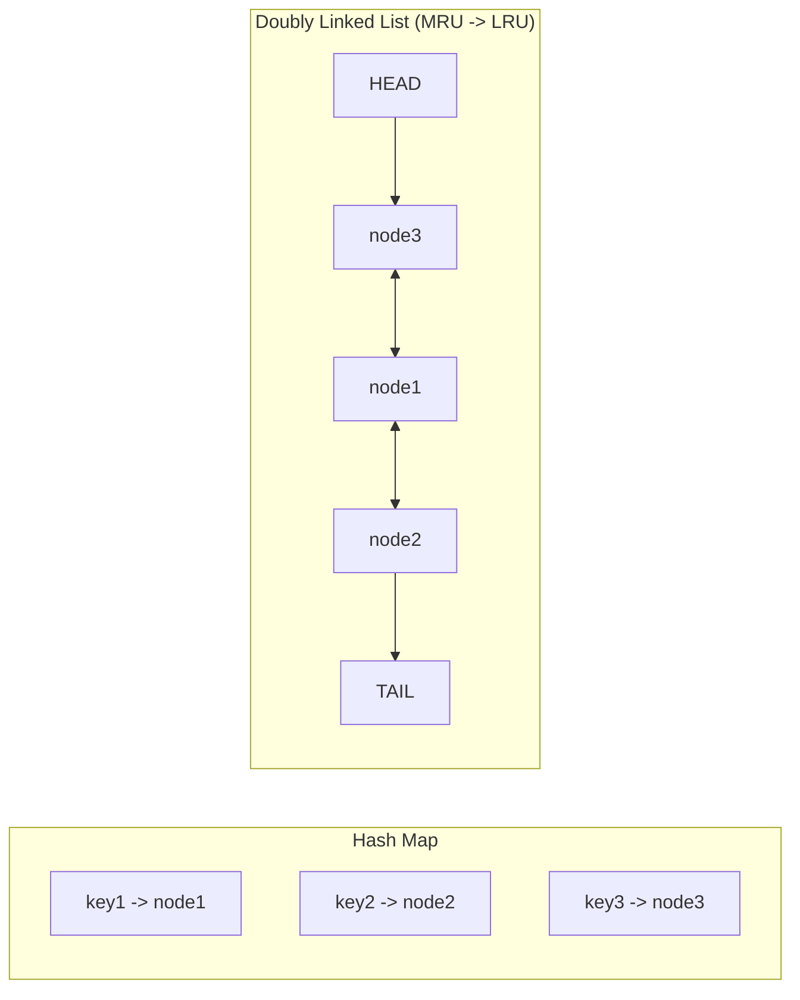

# Application-Level Caching

## Why Application-Level Caching Exists

Application-level caching is the fastest cache layer that developers directly control. While HTTP caching and CDN caching operate at the network level, application caching sits inside the process, eliminating network round-trips entirely. An in-process cache lookup takes ~100 nanoseconds. A Redis lookup takes ~100 microseconds. A database query takes ~1-50 milliseconds. That is a 10,000x difference between in-process and database.

The problem it solves: repeated computation and data fetching within the same process. When an API endpoint is called 1,000 times per second and each call queries the same user profile, an in-process cache can serve 999 of those from memory.

### Historical Context

Early web applications used global variables and singletons for caching. PHP had APC (Alternative PHP Cache). Java had EhCache and Guava Cache. Node.js applications initially relied on simple `Map` objects, which have no eviction policy and grow until the process runs out of memory. The ecosystem matured with libraries like `lru-cache`, `node-cache`, and eventually Redis/Memcached for distributed caching.

## First Principles

### Cache Locality

Application caches exploit two types of locality:

1. **Temporal locality**: Data accessed recently is likely to be accessed again soon. (User profiles during a session, configuration loaded at startup.)
2. **Spatial locality**: Data near recently accessed data is likely to be accessed. (Related entities, adjacent pages of a result set.)

The effectiveness of a cache depends entirely on the workload exhibiting locality. Random access patterns defeat caching.

### Memory Hierarchy Cost

| Access Type | Latency | Relative Cost |
|------------|---------|---------------|
| L1 CPU cache | 1ns | 1x |
| L2 CPU cache | 4ns | 4x |
| L3 CPU cache | 30ns | 30x |
| In-process Map | 50-100ns | 50-100x |
| Redis (local) | 100-500us | 100,000x |
| Redis (network) | 500us-2ms | 500,000x |
| PostgreSQL query | 1-50ms | 1,000,000-50,000,000x |
| External API | 50-500ms | 50,000,000-500,000,000x |

## Core Mechanics

### LRU Cache — The Workhorse

LRU (Least Recently Used) is the most common eviction policy. It maintains items in order of last access, evicting the oldest when capacity is reached.

The optimal implementation uses a **doubly-linked list** for O(1) move-to-front and a **hash map** for O(1) lookup:



```typescript
class LRUNode<K, V> {
  key: K;
  value: V;
  prev: LRUNode<K, V> | null = null;
  next: LRUNode<K, V> | null = null;
  size: number;
  lastAccess: number;

  constructor(key: K, value: V, size: number = 1) {
    this.key = key;
    this.value = value;
    this.size = size;
    this.lastAccess = Date.now();
  }
}

interface LRUCacheOptions {
  maxSize: number;
  maxAge?: number; // TTL in milliseconds
  onEvict?: (key: string, value: unknown) => void;
  sizeCalculation?: (value: unknown) => number;
}

class LRUCache<V> {
  private readonly map = new Map<string, LRUNode<string, V>>();
  private head: LRUNode<string, V> | null = null;
  private tail: LRUNode<string, V> | null = null;
  private currentSize = 0;
  private readonly options: Required<LRUCacheOptions>;

  // Metrics
  private hits = 0;
  private misses = 0;

  constructor(options: LRUCacheOptions) {
    this.options = {
      maxAge: 0,
      onEvict: () => {},
      sizeCalculation: () => 1,
      ...options,
    };
  }

  get(key: string): V | undefined {
    const node = this.map.get(key);

    if (!node) {
      this.misses++;
      return undefined;
    }

    // Check TTL
    if (this.options.maxAge > 0) {
      const age = Date.now() - node.lastAccess;
      if (age > this.options.maxAge) {
        this.delete(key);
        this.misses++;
        return undefined;
      }
    }

    // Move to front (most recently used)
    this.moveToFront(node);
    node.lastAccess = Date.now();
    this.hits++;
    return node.value;
  }

  set(key: string, value: V): void {
    const existingNode = this.map.get(key);

    if (existingNode) {
      // Update existing
      const oldSize = existingNode.size;
      existingNode.value = value;
      existingNode.size = this.options.sizeCalculation(value);
      existingNode.lastAccess = Date.now();
      this.currentSize += existingNode.size - oldSize;
      this.moveToFront(existingNode);
    } else {
      // Create new
      const size = this.options.sizeCalculation(value);
      const node = new LRUNode(key, value, size);
      this.map.set(key, node);
      this.addToFront(node);
      this.currentSize += size;
    }

    // Evict until under capacity
    while (this.currentSize > this.options.maxSize && this.tail) {
      this.evictLRU();
    }
  }

  delete(key: string): boolean {
    const node = this.map.get(key);
    if (!node) return false;

    this.removeNode(node);
    this.map.delete(key);
    this.currentSize -= node.size;
    return true;
  }

  get size(): number {
    return this.map.size;
  }

  get hitRatio(): number {
    const total = this.hits + this.misses;
    return total === 0 ? 0 : this.hits / total;
  }

  get stats() {
    return {
      size: this.map.size,
      currentSize: this.currentSize,
      maxSize: this.options.maxSize,
      hits: this.hits,
      misses: this.misses,
      hitRatio: this.hitRatio,
    };
  }

  private addToFront(node: LRUNode<string, V>): void {
    node.prev = null;
    node.next = this.head;

    if (this.head) {
      this.head.prev = node;
    }

    this.head = node;

    if (!this.tail) {
      this.tail = node;
    }
  }

  private removeNode(node: LRUNode<string, V>): void {
    if (node.prev) {
      node.prev.next = node.next;
    } else {
      this.head = node.next;
    }

    if (node.next) {
      node.next.prev = node.prev;
    } else {
      this.tail = node.prev;
    }

    node.prev = null;
    node.next = null;
  }

  private moveToFront(node: LRUNode<string, V>): void {
    if (node === this.head) return;
    this.removeNode(node);
    this.addToFront(node);
  }

  private evictLRU(): void {
    if (!this.tail) return;

    const evicted = this.tail;
    this.removeNode(evicted);
    this.map.delete(evicted.key);
    this.currentSize -= evicted.size;
    this.options.onEvict(evicted.key, evicted.value);
  }
}
```

### LFU Cache — Frequency-Based Eviction

LFU evicts the least *frequently* used item. This is better when some items are consistently popular and should not be evicted even if they were not accessed in the last few seconds.

The O(1) LFU implementation uses frequency buckets:

```typescript
class LFUCache<V> {
  private readonly capacity: number;
  private readonly keyToValue = new Map<string, V>();
  private readonly keyToFreq = new Map<string, number>();
  private readonly freqToKeys = new Map<number, Set<string>>();
  private minFreq = 0;

  constructor(capacity: number) {
    this.capacity = capacity;
  }

  get(key: string): V | undefined {
    if (!this.keyToValue.has(key)) return undefined;

    this.incrementFrequency(key);
    return this.keyToValue.get(key)!;
  }

  set(key: string, value: V): void {
    if (this.capacity <= 0) return;

    if (this.keyToValue.has(key)) {
      this.keyToValue.set(key, value);
      this.incrementFrequency(key);
      return;
    }

    if (this.keyToValue.size >= this.capacity) {
      this.evict();
    }

    this.keyToValue.set(key, value);
    this.keyToFreq.set(key, 1);

    if (!this.freqToKeys.has(1)) {
      this.freqToKeys.set(1, new Set());
    }
    this.freqToKeys.get(1)!.add(key);
    this.minFreq = 1;
  }

  private incrementFrequency(key: string): void {
    const freq = this.keyToFreq.get(key)!;
    const newFreq = freq + 1;

    // Remove from current frequency bucket
    const currentBucket = this.freqToKeys.get(freq)!;
    currentBucket.delete(key);

    if (currentBucket.size === 0) {
      this.freqToKeys.delete(freq);
      if (this.minFreq === freq) {
        this.minFreq = newFreq;
      }
    }

    // Add to new frequency bucket
    if (!this.freqToKeys.has(newFreq)) {
      this.freqToKeys.set(newFreq, new Set());
    }
    this.freqToKeys.get(newFreq)!.add(key);
    this.keyToFreq.set(key, newFreq);
  }

  private evict(): void {
    const bucket = this.freqToKeys.get(this.minFreq);
    if (!bucket || bucket.size === 0) return;

    // Evict the first (oldest) key in the minimum frequency bucket
    const evictKey = bucket.values().next().value;
    bucket.delete(evictKey);

    if (bucket.size === 0) {
      this.freqToKeys.delete(this.minFreq);
    }

    this.keyToValue.delete(evictKey);
    this.keyToFreq.delete(evictKey);
  }
}
```

### Memoization

Memoization is caching applied to pure functions — functions whose output depends only on their input:

```typescript
type AnyFunction = (...args: any[]) => any;

interface MemoizeOptions {
  maxSize?: number;
  maxAge?: number;
  keyGenerator?: (...args: unknown[]) => string;
}

function memoize<F extends AnyFunction>(
  fn: F,
  options: MemoizeOptions = {}
): F & { cache: LRUCache<ReturnType<F>>; clear: () => void } {
  const {
    maxSize = 1000,
    maxAge = 0,
    keyGenerator = (...args: unknown[]) => JSON.stringify(args),
  } = options;

  const cache = new LRUCache<ReturnType<F>>({
    maxSize,
    maxAge: maxAge || undefined,
  });

  const memoized = function (this: unknown, ...args: Parameters<F>): ReturnType<F> {
    const key = keyGenerator(...args);
    const cached = cache.get(key);

    if (cached !== undefined) {
      return cached;
    }

    const result = fn.apply(this, args);
    cache.set(key, result);
    return result;
  } as F & { cache: LRUCache<ReturnType<F>>; clear: () => void };

  memoized.cache = cache;
  memoized.clear = () => {
    // Reset cache by replacing internal state
    cache.clear?.();
  };

  return memoized;
}

// Async memoization with deduplication
function memoizeAsync<F extends (...args: any[]) => Promise<any>>(
  fn: F,
  options: MemoizeOptions = {}
): F {
  const {
    maxSize = 1000,
    maxAge = 60_000,
    keyGenerator = (...args: unknown[]) => JSON.stringify(args),
  } = options;

  const cache = new LRUCache<{ value: Awaited<ReturnType<F>>; setAt: number }>({
    maxSize,
  });
  const inflight = new Map<string, Promise<Awaited<ReturnType<F>>>>();

  return function (this: unknown, ...args: Parameters<F>): ReturnType<F> {
    const key = keyGenerator(...args);

    // Check cache
    const entry = cache.get(key);
    if (entry && (maxAge === 0 || Date.now() - entry.setAt < maxAge)) {
      return Promise.resolve(entry.value) as ReturnType<F>;
    }

    // Check inflight (deduplication)
    const pending = inflight.get(key);
    if (pending) {
      return pending as ReturnType<F>;
    }

    // Execute and cache
    const promise = fn.apply(this, args).then(
      (value: Awaited<ReturnType<F>>) => {
        cache.set(key, { value, setAt: Date.now() });
        inflight.delete(key);
        return value;
      },
      (err: Error) => {
        inflight.delete(key);
        throw err;
      }
    );

    inflight.set(key, promise);
    return promise as ReturnType<F>;
  } as F;
}

// Usage
const getUser = memoizeAsync(
  async (id: string) => {
    const res = await fetch(`/api/users/${id}`);
    return res.json();
  },
  { maxSize: 10_000, maxAge: 300_000 }
);
```

### Request-Scoped Cache

In web servers, certain data is fetched multiple times within a single request (user profile, permissions, feature flags). A request-scoped cache lives only for the duration of the request:

```typescript
import { AsyncLocalStorage } from 'node:async_hooks';

interface RequestCache {
  store: Map<string, unknown>;
}

const requestCacheStorage = new AsyncLocalStorage<RequestCache>();

// Middleware to create request-scoped cache
function requestCacheMiddleware(
  req: Request,
  res: Response,
  next: () => void
): void {
  requestCacheStorage.run({ store: new Map() }, next);
}

// Generic request-scoped caching wrapper
function requestCached<T>(
  key: string,
  fetcher: () => Promise<T>
): Promise<T> {
  const ctx = requestCacheStorage.getStore();

  if (!ctx) {
    // No request context — just fetch directly
    return fetcher();
  }

  if (ctx.store.has(key)) {
    return Promise.resolve(ctx.store.get(key) as T);
  }

  return fetcher().then(value => {
    ctx.store.set(key, value);
    return value;
  });
}

// Usage in service layer
class UserService {
  async getCurrentUser(userId: string): Promise<User> {
    return requestCached(`user:${userId}`, () =>
      this.db.users.findById(userId)
    );
  }
}

// Called 5 times in one request — only 1 DB query
class OrderService {
  async getOrder(id: string): Promise<Order> {
    const order = await this.db.orders.findById(id);
    const user = await this.userService.getCurrentUser(order.userId); // cached
    return { ...order, user };
  }
}
```

## Edge Cases and Failure Modes

### 1. Cache Key Collisions

```typescript
// BAD: Key collision — different objects, same key
const cache = new LRUCache<User>({ maxSize: 1000 });
cache.set('user:123', adminUser);
cache.set('user:123', regularUser); // Overwrites admin!

// This happens with naive key generation:
JSON.stringify({ a: 1, b: 2 }); // '{"a":1,"b":2}'
JSON.stringify({ b: 2, a: 1 }); // '{"b":2,"a":1}' — DIFFERENT KEY!

// FIX: Sort keys in key generator
function stableKey(obj: Record<string, unknown>): string {
  return JSON.stringify(
    Object.keys(obj).sort().reduce((acc, key) => {
      acc[key] = obj[key];
      return acc;
    }, {} as Record<string, unknown>)
  );
}
```

### 2. Memory Leak from Unbounded Cache

```typescript
// BUG: Map grows without limit
const cache = new Map<string, unknown>();

function getCached(key: string): unknown {
  if (cache.has(key)) return cache.get(key);
  const value = expensiveComputation(key);
  cache.set(key, value); // Never evicted!
  return value;
}

// After 1M unique keys: 500MB+ memory, potential OOM
```

::: danger
Never use a plain `Map` as a cache without an eviction policy. Always use a bounded cache (LRU, LFU, or TTL-based) in production.
:::

### 3. Stale Reads After Write

```typescript
// Race condition: read cache, write DB, read returns stale
async function updateAndRead(userId: string, newName: string): Promise<User> {
  await db.users.update(userId, { name: newName });
  // Cache still has old data!
  return userService.getUser(userId); // Returns old name

  // FIX: Invalidate before returning
  await db.users.update(userId, { name: newName });
  cache.delete(`user:${userId}`);
  return userService.getUser(userId); // Fresh from DB
}
```

### 4. Serialization Cost for Complex Objects

```typescript
// Problem: Deep objects are expensive to clone for cache safety
const user = await db.users.findById(id);
cache.set(`user:${id}`, user);

// If the caller mutates the returned object, the cache is corrupted:
const cached = cache.get(`user:${id}`)!;
cached.name = 'hacked'; // Cache entry is now mutated!

// FIX: Store frozen copies or use structuredClone
cache.set(`user:${id}`, structuredClone(user));

// Or freeze on retrieval
get(key: string): V | undefined {
  const value = this.internalGet(key);
  return value ? Object.freeze(structuredClone(value)) : undefined;
}
```

## Performance Characteristics

### Benchmark: Cache Implementations Compared

| Implementation | Get (ops/sec) | Set (ops/sec) | Memory per entry | Max items tested |
|---------------|--------------|--------------|-----------------|-----------------|
| `Map` (no eviction) | 50,000,000 | 20,000,000 | ~150 bytes | Until OOM |
| Custom LRU (above) | 8,000,000 | 5,000,000 | ~300 bytes | 1,000,000 |
| `lru-cache` v10 | 12,000,000 | 8,000,000 | ~250 bytes | 1,000,000 |
| `node-cache` | 3,000,000 | 2,000,000 | ~400 bytes | 500,000 |
| Redis (local) | 100,000 | 80,000 | N/A | Unlimited |

### Memory Estimation

For planning cache capacity:

$$
\text{Memory} = N \times (S_{\text{key}} + S_{\text{value}} + S_{\text{overhead}})
$$

Where $S_{\text{overhead}}$ includes the linked list pointers, hash map entry, and metadata. Typically 150-300 bytes per entry.

For 100,000 entries with 500-byte average values:

$$
\text{Memory} = 100{,}000 \times (50 + 500 + 250) = 80\text{MB}
$$

### GC Impact

Large in-process caches affect garbage collection. V8's garbage collector must scan every object in the old generation. A 1M-entry cache adds ~50ms to major GC pauses.

Mitigation strategies:
1. **Use `lru-cache` v10+** — stores entries in flat arrays, reducing GC pressure.
2. **Limit cache size** — keep under 100K entries for low-latency applications.
3. **Use WeakRef** — for secondary caches where GC is allowed to evict.
4. **Move to Redis** — off-heap storage eliminates GC impact entirely.

## Mathematical Foundations

### Optimal Cache Size (Square Root Rule)

For a Zipf-distributed workload, the optimal cache size that balances hit ratio against memory cost:

$$
C^* = \sqrt{\frac{N \cdot c_m}{c_s}}
$$

Where:
- $N$ = number of distinct items
- $c_m$ = cost of a cache miss
- $c_s$ = cost of storing one cache entry (per unit time)

### LRU Characteristic Time

The time until an entry is evicted from an LRU cache:

$$
T_{\text{evict}} = \frac{C}{\lambda_{\text{miss}}}
$$

Where $C$ is the cache capacity and $\lambda_{\text{miss}}$ is the miss rate (unique new items per second). If the cache holds 10,000 items and you get 100 unique new items per second, entries survive ~100 seconds.

::: info War Story
**The Memoization Memory Leak**

A GraphQL resolver used memoization to cache database query results. The memoization key was the full GraphQL query string (including variable arguments). With millions of unique queries per day — different user IDs, pagination cursors, date ranges — the memoization cache grew to 4GB and the process was OOM-killed.

The fix was adding `maxSize: 50000` and `maxAge: 60000` to the memoization options. The hit ratio dropped from 99% to 85%, but the service stayed alive. The remaining 14% of misses were long-tail queries that were never going to be re-requested anyway.
:::

::: info War Story
**The Request-Scoped Cache That Was Not Request-Scoped**

A team implemented request-scoped caching using a module-level variable instead of `AsyncLocalStorage`. In their local testing with sequential requests, it worked perfectly. In production, with 500 concurrent requests, all requests shared the same cache. User A saw User B's data. This was a severe security incident.

The root cause was a single `Map` object at module scope that was never cleared between requests. The fix was migrating to `AsyncLocalStorage`, which creates a unique store per async context (request). The lesson: always use `AsyncLocalStorage` for request-scoped state in Node.js.
:::

## Decision Framework

### In-Process vs External Cache

| Factor | In-Process (LRU) | External (Redis) |
|--------|-------------------|-------------------|
| Latency | 0.1 us | 100-500 us |
| Shared across instances | No | Yes |
| Survives restart | No | Yes (with persistence) |
| Memory impact | Increases GC pressure | None on app process |
| Consistency | Per-instance | Global |
| Operational complexity | Zero | Redis cluster management |
| Max practical size | 100K-1M entries | Billions of entries |

### When to Use Each Pattern

| Pattern | Use When |
|---------|----------|
| LRU | General-purpose, unknown access patterns |
| LFU | Known popular items (product catalog, config) |
| TTL-only | Time-sensitive data, no space pressure |
| Memoization | Pure functions, deterministic output |
| Request-scoped | Data needed multiple times in one request |
| Two-tier (L1 + L2) | Need both speed (L1) and sharing (L2) |

## Advanced Topics

### Two-Tier Cache (L1 In-Process + L2 Redis)

```typescript
class TwoTierCache<V> {
  private readonly l1: LRUCache<V>;
  private readonly l2: RedisClient;
  private readonly namespace: string;
  private readonly ttlSeconds: number;

  constructor(options: {
    l1MaxSize: number;
    l1MaxAge: number;
    l2TtlSeconds: number;
    namespace: string;
    redis: RedisClient;
  }) {
    this.l1 = new LRUCache<V>({
      maxSize: options.l1MaxSize,
      maxAge: options.l1MaxAge,
    });
    this.l2 = options.redis;
    this.namespace = options.namespace;
    this.ttlSeconds = options.l2TtlSeconds;
  }

  async get(key: string): Promise<V | null> {
    // L1 check (in-process)
    const l1Value = this.l1.get(key);
    if (l1Value !== undefined) {
      return l1Value;
    }

    // L2 check (Redis)
    const l2Raw = await this.l2.get(`${this.namespace}:${key}`);
    if (l2Raw !== null) {
      const value = JSON.parse(l2Raw) as V;
      // Promote to L1
      this.l1.set(key, value);
      return value;
    }

    return null;
  }

  async set(key: string, value: V): Promise<void> {
    // Write to both tiers
    this.l1.set(key, value);
    await this.l2.set(
      `${this.namespace}:${key}`,
      JSON.stringify(value),
      'EX',
      this.ttlSeconds
    );
  }

  async invalidate(key: string): Promise<void> {
    this.l1.delete(key);
    await this.l2.del(`${this.namespace}:${key}`);
  }
}
```

### Stale-While-Revalidate Pattern

Serve stale data immediately while refreshing in the background:

```typescript
class SWRCache<V> {
  private readonly cache = new Map<string, {
    value: V;
    fetchedAt: number;
    staleAt: number;
    expireAt: number;
  }>();
  private readonly refreshing = new Set<string>();

  constructor(
    private readonly freshMs: number = 60_000,
    private readonly staleMs: number = 300_000
  ) {}

  async get(
    key: string,
    fetcher: () => Promise<V>
  ): Promise<V> {
    const entry = this.cache.get(key);
    const now = Date.now();

    if (!entry || now > entry.expireAt) {
      // No entry or fully expired — must fetch synchronously
      const value = await fetcher();
      this.cache.set(key, {
        value,
        fetchedAt: now,
        staleAt: now + this.freshMs,
        expireAt: now + this.staleMs,
      });
      return value;
    }

    if (now > entry.staleAt && !this.refreshing.has(key)) {
      // Stale but not expired — return stale and refresh in background
      this.refreshing.add(key);
      fetcher().then(value => {
        this.cache.set(key, {
          value,
          fetchedAt: Date.now(),
          staleAt: Date.now() + this.freshMs,
          expireAt: Date.now() + this.staleMs,
        });
        this.refreshing.delete(key);
      }).catch(() => {
        this.refreshing.delete(key);
      });
    }

    return entry.value; // Return current (possibly stale) value
  }
}
```

### Cache Warming Strategies

```typescript
// Strategy 1: Warm from previous instance's cache (snapshot)
async function warmFromSnapshot(
  cache: TwoTierCache<unknown>,
  snapshotFile: string
): Promise<void> {
  const snapshot = JSON.parse(
    await fs.readFile(snapshotFile, 'utf-8')
  ) as Array<{ key: string; value: unknown }>;

  for (const entry of snapshot) {
    await cache.set(entry.key, entry.value);
  }
}

// Strategy 2: Warm from access logs
async function warmFromAccessLogs(
  cache: TwoTierCache<unknown>,
  db: Database,
  topN: number = 10_000
): Promise<void> {
  // Get the most frequently accessed keys from recent logs
  const topKeys = await db.query(`
    SELECT cache_key, COUNT(*) as freq
    FROM access_logs
    WHERE timestamp > NOW() - INTERVAL '1 hour'
    GROUP BY cache_key
    ORDER BY freq DESC
    LIMIT $1
  `, [topN]);

  const BATCH = 100;
  for (let i = 0; i < topKeys.length; i += BATCH) {
    const batch = topKeys.slice(i, i + BATCH);
    await Promise.all(
      batch.map(async ({ cache_key }) => {
        const value = await db.fetchByKey(cache_key);
        if (value) await cache.set(cache_key, value);
      })
    );
  }
}
```

::: tip Key Takeaway
Application-level caching is the highest-impact, lowest-effort optimization available. Start with a simple LRU cache for your hottest data paths. Measure the hit ratio. If it is below 80%, investigate your key design and access patterns. If it is above 95%, your cache is well-tuned. Between 80-95%, consider whether a larger cache or different eviction policy would help.
:::

## Cross-References

- [Caching Strategies Overview](./index.md) — full cache hierarchy
- [Database-Level Caching](./database-level.md) — materialized views and query caching
- [HTTP Caching](./http-caching.md) — cache headers for browser and CDN
- [N+1 Query Detection](../database-tuning/n-plus-one.md) — DataLoader as a request-scoped batch cache
- [Concurrency Patterns](../optimization/concurrency-patterns.md) — deduplication prevents cache stampede
