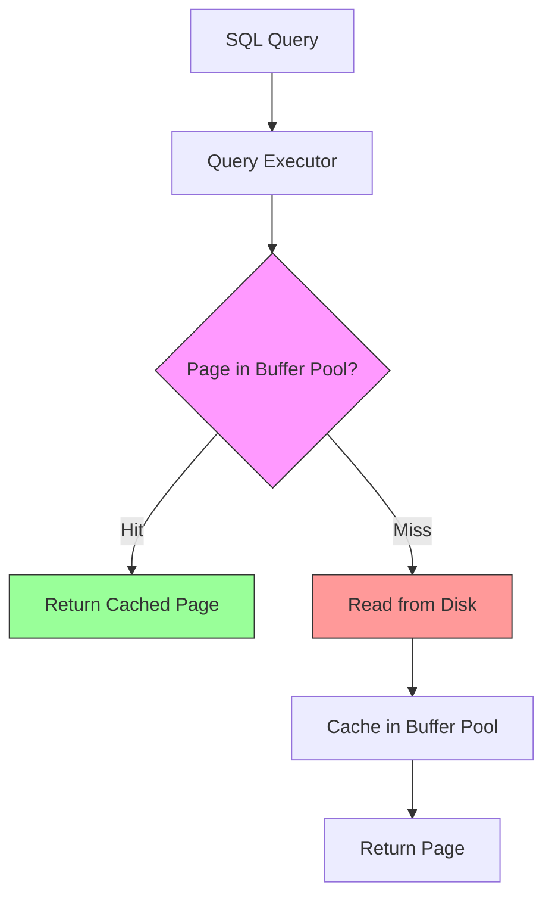
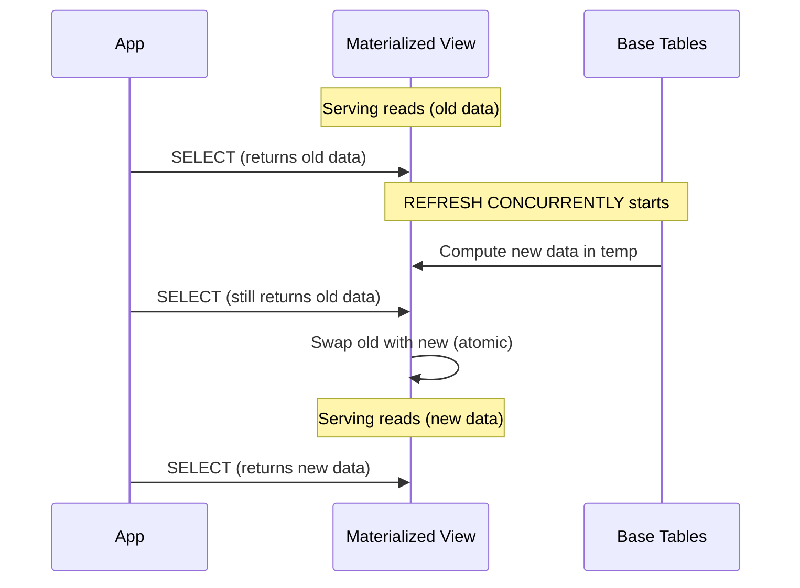

# Database-Level Caching

## Why Database-Level Caching Exists

Application-level caches like Redis sit between the app and the database. Database-level caching operates *inside* or *adjacent to* the database itself. The advantage: cache coherence is guaranteed by the database engine, which already understands transactions, consistency, and invalidation. The database knows when data changes — it does not need external invalidation signals.

Database-level caching solves expensive queries that aggregate, join, or transform data. Rather than running a 30-second analytics query on every request, you precompute the result and store it in a form optimized for reads.

### Historical Context

The earliest form of database caching was the **buffer pool** — the database's internal page cache that keeps frequently accessed disk pages in memory. PostgreSQL calls this `shared_buffers`, MySQL calls it `innodb_buffer_pool_size`. This has existed since the 1970s.

Materialized views were introduced in Oracle 8i (1998), PostgreSQL 9.3 (2013), and remain the primary mechanism for database-level precomputation. Denormalization predates relational databases entirely — it is a conscious violation of normal forms for performance.

## First Principles

### The Read-Write Tradeoff

Database-level caching shifts work from read time to write time. Every technique in this page makes reads faster at the cost of making writes slower or more complex:

$$
T_{\text{total}} = R \cdot T_{\text{read}} + W \cdot T_{\text{write}}
$$

If reads dominate ($R \gg W$), any technique that reduces $T_{\text{read}}$ at the expense of $T_{\text{write}}$ improves overall performance.

| Technique | Read Cost | Write Cost | Consistency |
|-----------|-----------|------------|-------------|
| Normalized tables | $O(J)$ joins | $O(1)$ single write | Always consistent |
| Materialized view | $O(1)$ scan | $O(R)$ refresh | Eventually consistent |
| Denormalized table | $O(1)$ scan | $O(D)$ update duplicates | Manually maintained |
| Covering index | $O(\log n)$ index scan | $O(\log n)$ per index update | Always consistent |
| Query cache | $O(1)$ if cached | Invalidated on any table write | Cache coherent |

Where $J$ = number of joins, $R$ = refresh cost, $D$ = number of denormalized copies.

### The Buffer Pool

The database buffer pool is the most fundamental cache — it keeps frequently accessed pages (typically 8KB blocks) in RAM:



PostgreSQL buffer pool hit ratio query:

```sql
SELECT
  sum(heap_blks_hit) AS hits,
  sum(heap_blks_read) AS misses,
  CASE WHEN sum(heap_blks_hit) + sum(heap_blks_read) > 0
    THEN round(
      sum(heap_blks_hit)::numeric /
      (sum(heap_blks_hit) + sum(heap_blks_read)) * 100, 2
    )
    ELSE 0
  END AS hit_ratio_pct
FROM pg_statio_user_tables;

-- Target: > 99% hit ratio
-- If below 95%: increase shared_buffers
```

## Core Mechanics

### Materialized Views

A materialized view stores the result of a query as a physical table. Reads query the materialized table directly; the underlying query is only re-executed during refresh.

```sql
-- Expensive analytics query: joins 3 tables, aggregates millions of rows
-- Takes 15 seconds to run
CREATE MATERIALIZED VIEW mv_daily_revenue AS
SELECT
  date_trunc('day', o.created_at) AS day,
  p.category,
  COUNT(DISTINCT o.id) AS order_count,
  SUM(oi.quantity * oi.unit_price) AS revenue,
  AVG(oi.quantity * oi.unit_price) AS avg_order_value,
  COUNT(DISTINCT o.customer_id) AS unique_customers
FROM orders o
JOIN order_items oi ON o.id = oi.order_id
JOIN products p ON oi.product_id = p.id
WHERE o.status = 'completed'
GROUP BY 1, 2
WITH DATA;

-- Create index for fast querying
CREATE UNIQUE INDEX idx_mv_daily_revenue_day_cat
  ON mv_daily_revenue (day, category);

-- Refresh the view (CONCURRENTLY avoids locking reads)
REFRESH MATERIALIZED VIEW CONCURRENTLY mv_daily_revenue;

-- Now the analytics query takes <1ms instead of 15 seconds:
SELECT * FROM mv_daily_revenue
WHERE day >= CURRENT_DATE - INTERVAL '30 days'
ORDER BY day DESC, revenue DESC;
```

#### Concurrent Refresh

`REFRESH MATERIALIZED VIEW CONCURRENTLY` requires a unique index but allows reads during refresh. Without `CONCURRENTLY`, the view is locked during the entire refresh operation.



#### Automated Refresh Strategies

```typescript
import { Pool } from 'pg';

interface RefreshConfig {
  viewName: string;
  concurrent: boolean;
  intervalMs: number;
  maxRefreshTimeMs: number;
  onError: (error: Error) => void;
}

class MaterializedViewRefresher {
  private timers = new Map<string, ReturnType<typeof setInterval>>();

  constructor(private readonly pool: Pool) {}

  register(config: RefreshConfig): void {
    const timer = setInterval(async () => {
      const start = Date.now();

      try {
        const concurrent = config.concurrent ? 'CONCURRENTLY' : '';
        await this.pool.query(
          `REFRESH MATERIALIZED VIEW ${concurrent} ${config.viewName}`
        );

        const elapsed = Date.now() - start;
        console.log(`Refreshed ${config.viewName} in ${elapsed}ms`);

        if (elapsed > config.maxRefreshTimeMs) {
          console.warn(
            `Refresh of ${config.viewName} took ${elapsed}ms, ` +
            `exceeds threshold of ${config.maxRefreshTimeMs}ms`
          );
        }
      } catch (err) {
        config.onError(err as Error);
      }
    }, config.intervalMs);

    this.timers.set(config.viewName, timer);
  }

  stop(viewName: string): void {
    const timer = this.timers.get(viewName);
    if (timer) {
      clearInterval(timer);
      this.timers.delete(viewName);
    }
  }

  stopAll(): void {
    for (const timer of this.timers.values()) {
      clearInterval(timer);
    }
    this.timers.clear();
  }
}

// Usage
const refresher = new MaterializedViewRefresher(pool);

refresher.register({
  viewName: 'mv_daily_revenue',
  concurrent: true,
  intervalMs: 5 * 60 * 1000, // Every 5 minutes
  maxRefreshTimeMs: 30_000,
  onError: (err) => alerting.fire('mv_refresh_failed', err),
});

refresher.register({
  viewName: 'mv_user_stats',
  concurrent: true,
  intervalMs: 60 * 1000, // Every minute
  maxRefreshTimeMs: 10_000,
  onError: (err) => alerting.fire('mv_refresh_failed', err),
});
```

### Denormalization

Denormalization intentionally duplicates data to avoid joins at query time. The tradeoff is explicit: faster reads, more complex writes, and the risk of data inconsistency.

#### Embedding Related Data

```sql
-- Normalized: requires JOIN
SELECT u.name, u.email, a.city, a.country
FROM users u
JOIN addresses a ON u.id = a.user_id
WHERE u.id = 123;

-- Denormalized: single table scan
ALTER TABLE users
  ADD COLUMN address_city TEXT,
  ADD COLUMN address_country TEXT;

-- Now: no join needed
SELECT name, email, address_city, address_country
FROM users
WHERE id = 123;
```

#### Computed Columns

```sql
-- Instead of counting at query time:
SELECT p.*, COUNT(c.id) AS comment_count
FROM posts p
LEFT JOIN comments c ON p.id = c.post_id
GROUP BY p.id;

-- Store the count directly:
ALTER TABLE posts ADD COLUMN comment_count INTEGER DEFAULT 0;

-- Maintain with triggers:
CREATE OR REPLACE FUNCTION update_comment_count()
RETURNS TRIGGER AS $$
BEGIN
  IF TG_OP = 'INSERT' THEN
    UPDATE posts SET comment_count = comment_count + 1
    WHERE id = NEW.post_id;
  ELSIF TG_OP = 'DELETE' THEN
    UPDATE posts SET comment_count = comment_count - 1
    WHERE id = OLD.post_id;
  END IF;
  RETURN NULL;
END;
$$ LANGUAGE plpgsql;

CREATE TRIGGER trg_comment_count
AFTER INSERT OR DELETE ON comments
FOR EACH ROW EXECUTE FUNCTION update_comment_count();
```

#### JSON Aggregation

PostgreSQL's JSON functions can precompute nested structures:

```sql
-- Create a denormalized view with embedded JSON
CREATE MATERIALIZED VIEW mv_products_with_reviews AS
SELECT
  p.id,
  p.name,
  p.price,
  p.category,
  COALESCE(
    jsonb_agg(
      jsonb_build_object(
        'rating', r.rating,
        'text', r.text,
        'author', u.name,
        'created_at', r.created_at
      ) ORDER BY r.created_at DESC
    ) FILTER (WHERE r.id IS NOT NULL),
    '[]'::jsonb
  ) AS reviews,
  COALESCE(AVG(r.rating), 0)::numeric(3,2) AS avg_rating,
  COUNT(r.id) AS review_count
FROM products p
LEFT JOIN reviews r ON p.id = r.product_id
LEFT JOIN users u ON r.user_id = u.id
GROUP BY p.id;

CREATE UNIQUE INDEX idx_mv_products_id ON mv_products_with_reviews (id);
```

### Query Result Caching

PostgreSQL does not have a built-in query cache (MySQL had one, but it was removed in 8.0 due to invalidation overhead). Application-layer query caching with awareness of table dependencies can fill this gap:

```typescript
interface QueryCacheEntry {
  result: unknown[];
  cachedAt: number;
  tables: string[];
}

class QueryCache {
  private readonly cache = new Map<string, QueryCacheEntry>();
  private readonly tableToKeys = new Map<string, Set<string>>();

  constructor(
    private readonly pool: Pool,
    private readonly defaultTtlMs: number = 60_000
  ) {}

  async query<T>(
    sql: string,
    params: unknown[] = [],
    options: {
      tables: string[];
      ttlMs?: number;
    }
  ): Promise<T[]> {
    const cacheKey = this.buildKey(sql, params);
    const entry = this.cache.get(cacheKey);

    if (entry && Date.now() - entry.cachedAt < (options.ttlMs ?? this.defaultTtlMs)) {
      return entry.result as T[];
    }

    const { rows } = await this.pool.query(sql, params);

    // Cache the result
    this.cache.set(cacheKey, {
      result: rows,
      cachedAt: Date.now(),
      tables: options.tables,
    });

    // Track table -> cache key mapping for invalidation
    for (const table of options.tables) {
      if (!this.tableToKeys.has(table)) {
        this.tableToKeys.set(table, new Set());
      }
      this.tableToKeys.get(table)!.add(cacheKey);
    }

    return rows as T[];
  }

  invalidateTable(table: string): number {
    const keys = this.tableToKeys.get(table);
    if (!keys) return 0;

    let count = 0;
    for (const key of keys) {
      if (this.cache.delete(key)) {
        count++;
      }
    }
    this.tableToKeys.delete(table);
    return count;
  }

  private buildKey(sql: string, params: unknown[]): string {
    return `${sql}::${JSON.stringify(params)}`;
  }
}

// Usage
const qc = new QueryCache(pool);

// Cached query — invalidated when 'orders' table changes
const revenue = await qc.query<{ total: number }>(
  'SELECT SUM(amount) as total FROM orders WHERE created_at > $1',
  [startDate],
  { tables: ['orders'], ttlMs: 300_000 }
);

// After a write to orders:
qc.invalidateTable('orders');
```

### LISTEN/NOTIFY for Real-Time Invalidation

PostgreSQL's LISTEN/NOTIFY provides a built-in pub/sub mechanism for cache invalidation:

```sql
-- Trigger that notifies on table changes
CREATE OR REPLACE FUNCTION notify_table_change()
RETURNS TRIGGER AS $$
BEGIN
  PERFORM pg_notify(
    'table_change',
    json_build_object(
      'table', TG_TABLE_NAME,
      'operation', TG_OP,
      'id', COALESCE(NEW.id, OLD.id)
    )::text
  );
  RETURN NULL;
END;
$$ LANGUAGE plpgsql;

CREATE TRIGGER trg_orders_change
AFTER INSERT OR UPDATE OR DELETE ON orders
FOR EACH ROW EXECUTE FUNCTION notify_table_change();
```

```typescript
import { Client } from 'pg';

class PgCacheInvalidator {
  private client: Client;

  constructor(
    connectionString: string,
    private readonly cache: QueryCache
  ) {
    this.client = new Client({ connectionString });
  }

  async start(): Promise<void> {
    await this.client.connect();
    await this.client.query('LISTEN table_change');

    this.client.on('notification', (msg) => {
      if (msg.channel === 'table_change' && msg.payload) {
        const data = JSON.parse(msg.payload);
        const invalidated = this.cache.invalidateTable(data.table);
        console.log(
          `Invalidated ${invalidated} cache entries for ${data.table} ` +
          `(${data.operation} on id=${data.id})`
        );
      }
    });
  }

  async stop(): Promise<void> {
    await this.client.query('UNLISTEN table_change');
    await this.client.end();
  }
}
```

## Edge Cases and Failure Modes

### 1. Materialized View Refresh Lock Contention

```sql
-- Without CONCURRENTLY, REFRESH acquires ACCESS EXCLUSIVE lock
-- This blocks ALL reads for the entire duration of the refresh!
REFRESH MATERIALIZED VIEW mv_large_view; -- Locks for 30 seconds

-- FIX: Always use CONCURRENTLY (requires unique index)
CREATE UNIQUE INDEX ON mv_large_view (id);
REFRESH MATERIALIZED VIEW CONCURRENTLY mv_large_view;
```

### 2. Trigger-Based Denormalization Deadlocks

```sql
-- Two triggers updating the same denormalized column:
-- Trigger A: UPDATE posts SET comment_count = ... WHERE id = 1 (locks row)
-- Trigger B: UPDATE posts SET like_count = ...    WHERE id = 1 (waits for lock)
-- If Trigger B also triggers something that waits on Trigger A: DEADLOCK

-- FIX: Use advisory locks or queue updates
CREATE OR REPLACE FUNCTION safe_update_count()
RETURNS TRIGGER AS $$
BEGIN
  PERFORM pg_advisory_xact_lock(hashtext('post_count_' || NEW.post_id::text));
  UPDATE posts SET comment_count = (
    SELECT COUNT(*) FROM comments WHERE post_id = NEW.post_id
  ) WHERE id = NEW.post_id;
  RETURN NULL;
END;
$$ LANGUAGE plpgsql;
```

### 3. Stale Materialized Views After Failed Refresh

```sql
-- If refresh fails halfway, the view retains its old data
-- But the application may assume it's fresh

-- FIX: Track last refresh time
SELECT
  schemaname,
  matviewname,
  ispopulated,
  -- PostgreSQL doesn't track last refresh time natively
  -- Use a metadata table instead
  last_refresh
FROM pg_matviews
LEFT JOIN mv_refresh_log ON mv_name = matviewname
ORDER BY last_refresh ASC NULLS FIRST;
```

### 4. Denormalization Inconsistency After Schema Change

::: danger
When you add a column to a denormalized table, all existing rows have `NULL` for that column. If the application assumes the column is populated, it will serve incorrect data until a backfill runs.
:::

```typescript
// Safe denormalization migration pattern
async function addDenormalizedColumn(pool: Pool): Promise<void> {
  // 1. Add column with NULL allowed
  await pool.query('ALTER TABLE users ADD COLUMN order_count INTEGER');

  // 2. Backfill in batches
  let lastId = 0;
  const BATCH = 1000;

  while (true) {
    const { rowCount } = await pool.query(`
      UPDATE users SET order_count = (
        SELECT COUNT(*) FROM orders WHERE orders.user_id = users.id
      )
      WHERE id IN (
        SELECT id FROM users
        WHERE id > $1 AND order_count IS NULL
        ORDER BY id LIMIT $2
      )
    `, [lastId, BATCH]);

    if (rowCount === 0) break;
    lastId += BATCH;

    // Pause to reduce DB load
    await new Promise(r => setTimeout(r, 100));
  }

  // 3. Add trigger for ongoing maintenance
  await pool.query(`
    CREATE TRIGGER trg_order_count
    AFTER INSERT OR DELETE ON orders
    FOR EACH ROW EXECUTE FUNCTION update_order_count()
  `);

  // 4. Set NOT NULL constraint after backfill
  await pool.query('ALTER TABLE users ALTER COLUMN order_count SET DEFAULT 0');
  await pool.query('ALTER TABLE users ALTER COLUMN order_count SET NOT NULL');
}
```

## Performance Characteristics

### Materialized View vs Live Query

| Metric | Live Query (3 JOINs) | Materialized View |
|--------|----------------------|-------------------|
| Query time | 500ms - 15s | 1-10ms |
| CPU per query | High (aggregation) | Low (simple scan) |
| Disk I/O per query | Full table scans | Index scan |
| Freshness | Real-time | Last refresh time |
| Write overhead | None | Refresh cost |
| Storage | None extra | Full copy of results |

### Refresh Cost Estimation

The cost of refreshing a materialized view is approximately:

$$
T_{\text{refresh}} = T_{\text{query}} + T_{\text{write}} + T_{\text{index}}
$$

Where:
- $T_{\text{query}}$ = time to execute the underlying query
- $T_{\text{write}}$ = time to write results to disk ($\approx N \times S / \text{disk\_throughput}$)
- $T_{\text{index}}$ = time to rebuild indexes

For `CONCURRENTLY` refresh, add comparison time:

$$
T_{\text{concurrent}} = T_{\text{refresh}} + T_{\text{diff}}
$$

Where $T_{\text{diff}}$ is the time to compute the delta between old and new data. For large views with few changes, this is efficient. For views where most rows change, non-concurrent refresh may actually be faster.

### Buffer Pool Sizing

The buffer pool should be large enough to hold the working set. PostgreSQL's recommended `shared_buffers`:

$$
\text{shared\_buffers} = \min\left(\frac{\text{RAM}}{4}, \text{working\_set\_size}\right)
$$

The effective cache size (including OS page cache):

$$
\text{effective\_cache\_size} = \text{shared\_buffers} + \text{OS page cache} \approx \frac{3 \times \text{RAM}}{4}
$$

::: info War Story
**The Materialized View That Ate the Database**

A SaaS analytics platform created a materialized view that joined 5 tables with 100M+ rows each. The initial `REFRESH MATERIALIZED VIEW` ran for 45 minutes, consuming all available I/O bandwidth. During this time, all other queries slowed to a crawl, and the connection pool was exhausted with waiting queries.

The fix was threefold: (1) used `REFRESH MATERIALIZED VIEW CONCURRENTLY` to avoid read locks, (2) added an incremental refresh strategy that only processed rows modified since the last refresh using a `modified_at` timestamp, (3) scheduled refreshes during off-peak hours with resource limits (`SET work_mem = '256MB'; SET statement_timeout = '5min'`).
:::

::: info War Story
**The Denormalization Cascade**

An order management system denormalized customer names into the orders table for fast display. When a customer changed their name, a trigger updated all their orders. One customer had 50,000 orders. The name change took 30 seconds, holding a row-level lock on each order. During this time, new orders for that customer failed with lock wait timeouts.

The fix was a two-phase approach: (1) the denormalized name was made "eventually consistent" — only new orders got the new name immediately, (2) a background job updated old orders in batches of 100 with 10ms delays between batches. The tradeoff of brief inconsistency was acceptable for order display.
:::

## Mathematical Foundations

### Optimal Refresh Interval

Given the cost of staleness and the cost of refresh, the optimal interval minimizes total cost:

$$
I^* = \sqrt{\frac{2 \cdot C_{\text{refresh}}}{\lambda \cdot C_{\text{stale}}}}
$$

Where:
- $C_{\text{refresh}}$ = cost of one refresh (CPU time, I/O, lock contention)
- $\lambda$ = rate of underlying data changes
- $C_{\text{stale}}$ = cost per unit time of serving stale data

For a view that takes 10 seconds to refresh, with 100 changes/hour and stale data costing $0.01/second:

$$
I^* = \sqrt{\frac{2 \times 10}{100/3600 \times 0.01}} = \sqrt{\frac{20}{0.000278}} \approx 268 \text{ seconds}
$$

### Denormalization Space Overhead

The space overhead of denormalization:

$$
\text{Overhead} = N_{\text{copies}} \times S_{\text{field}} \times N_{\text{rows}}
$$

Storing a 100-byte name field across 3 tables with 1M rows each:

$$
\text{Overhead} = 2 \times 100 \times 1{,}000{,}000 = 200\text{MB}
$$

The 2 is because the original copy is not overhead — only the duplicates count.

## Decision Framework

### Choosing the Right Technique

| Scenario | Technique | Why |
|----------|-----------|-----|
| Dashboard analytics | Materialized view | Precompute expensive aggregations |
| Frequently joined lookup data | Denormalization | Eliminate joins |
| Full-text search | Materialized view + tsvector | Precompute search vectors |
| Reporting on historical data | Partitioned materialized views | Incremental refresh per partition |
| Real-time counts/sums | Trigger-maintained counters | Instant reads, bounded write cost |
| Rarely changing config | Application cache + LISTEN/NOTIFY | Near-zero read cost |
| High-write tables | Avoid materialized views | Refresh cost too high |

### When NOT to Use Database-Level Caching

- **Write-heavy workloads** — trigger overhead and refresh costs dominate
- **Small tables** (< 10K rows) — direct queries are fast enough
- **Rapidly changing data** — materialized views are always stale
- **Complex invalidation logic** — application-level caching is more flexible
- **Multi-tenant systems** — tenant-specific materialized views do not scale

## Advanced Topics

### Incremental Materialized Views

PostgreSQL does not support incremental refresh natively. Build it manually:

```sql
-- Track last refresh timestamp
CREATE TABLE mv_refresh_log (
  view_name TEXT PRIMARY KEY,
  last_refresh TIMESTAMPTZ NOT NULL DEFAULT '1970-01-01'
);

-- Incremental refresh function
CREATE OR REPLACE FUNCTION refresh_mv_incremental(
  p_view_name TEXT
) RETURNS INTEGER AS $$
DECLARE
  v_last_refresh TIMESTAMPTZ;
  v_affected INTEGER;
BEGIN
  SELECT last_refresh INTO v_last_refresh
  FROM mv_refresh_log
  WHERE view_name = p_view_name;

  IF NOT FOUND THEN
    v_last_refresh := '1970-01-01';
  END IF;

  -- Example: refresh only changed orders
  IF p_view_name = 'mv_daily_revenue' THEN
    -- Delete affected days
    DELETE FROM mv_daily_revenue
    WHERE day IN (
      SELECT DISTINCT date_trunc('day', created_at)
      FROM orders
      WHERE updated_at > v_last_refresh
    );

    -- Recompute affected days
    INSERT INTO mv_daily_revenue
    SELECT
      date_trunc('day', o.created_at) AS day,
      p.category,
      COUNT(DISTINCT o.id),
      SUM(oi.quantity * oi.unit_price),
      AVG(oi.quantity * oi.unit_price),
      COUNT(DISTINCT o.customer_id)
    FROM orders o
    JOIN order_items oi ON o.id = oi.order_id
    JOIN products p ON oi.product_id = p.id
    WHERE o.status = 'completed'
      AND date_trunc('day', o.created_at) IN (
        SELECT DISTINCT date_trunc('day', created_at)
        FROM orders
        WHERE updated_at > v_last_refresh
      )
    GROUP BY 1, 2;

    GET DIAGNOSTICS v_affected = ROW_COUNT;
  END IF;

  INSERT INTO mv_refresh_log (view_name, last_refresh)
  VALUES (p_view_name, NOW())
  ON CONFLICT (view_name) DO UPDATE SET last_refresh = NOW();

  RETURN v_affected;
END;
$$ LANGUAGE plpgsql;
```

### Continuous Aggregates (TimescaleDB)

TimescaleDB provides true incremental materialized views for time-series data:

```sql
-- TimescaleDB continuous aggregate — automatically refreshes incrementally
CREATE MATERIALIZED VIEW hourly_metrics
WITH (timescaledb.continuous) AS
SELECT
  time_bucket('1 hour', time) AS bucket,
  device_id,
  AVG(temperature) AS avg_temp,
  MAX(temperature) AS max_temp,
  MIN(temperature) AS min_temp,
  COUNT(*) AS readings
FROM sensor_data
GROUP BY 1, 2;

-- Automatically refresh: real-time for last 2 hours, background for older
SELECT add_continuous_aggregate_policy('hourly_metrics',
  start_offset => INTERVAL '24 hours',
  end_offset => INTERVAL '1 hour',
  schedule_interval => INTERVAL '30 minutes'
);
```

::: tip Key Takeaway
Database-level caching is most effective for read-heavy analytical workloads. Materialized views are the primary tool, but they must be refreshed — either on a schedule, incrementally, or via triggers. Always measure the refresh cost relative to the read benefit before committing to a materialized view strategy.
:::

## Cross-References

- [Caching Strategies Overview](./index.md) — cache hierarchy context
- [Query Optimization](../database-tuning/query-optimization.md) — optimize the queries before caching them
- [VACUUM and ANALYZE](../database-tuning/vacuum-analyze.md) — maintenance affects materialized view performance
- [Index Strategy](../database-tuning/index-strategy.md) — indexes on materialized views
- [Application-Level Caching](./application-level.md) — caching above the database
