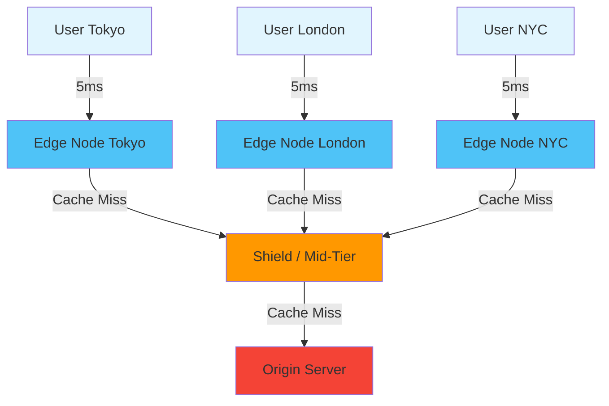
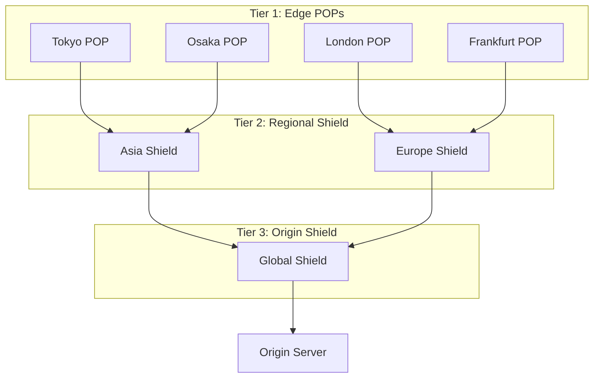

# Edge Caching

## Why Edge Caching Exists

Edge caching places content physically close to users. A server in Virginia serving a user in Tokyo adds ~150ms of network latency per round-trip. An edge cache in Tokyo serves the same content in ~5ms. For a page that requires 3 sequential round-trips (DNS, TLS, HTTP), that is 450ms vs 15ms — the difference between "instant" and "noticeable."

CDNs (Content Delivery Networks) operate hundreds of edge locations globally. They intercept requests, serve cached content when available, and fetch from the origin server only on cache misses. The economics are compelling: edge bandwidth costs 50-80% less than origin bandwidth, and origin servers handle orders of magnitude fewer requests.

### Historical Context

- **1998**: Akamai founded, pioneered CDN technology for static content.
- **2000s**: CDNs evolved from static file serving to dynamic content acceleration (TCP optimization, connection reuse, route optimization).
- **2010s**: CloudFront, Cloudflare, Fastly brought CDN pricing down dramatically. CDNs became standard for all web applications.
- **2017+**: Edge compute emerged — Cloudflare Workers, Lambda@Edge. CDNs could now *compute* at the edge, not just cache.
- **2020s**: Full-stack edge — databases (Durable Objects, D1), KV stores, and even AI inference at edge locations.

## First Principles

### The Speed of Light Problem

The speed of light in fiber optic cable is approximately 200,000 km/s (2/3 the speed in vacuum). A round-trip from New York to London (5,570 km each way) takes at minimum:

$$
T_{\text{min}} = \frac{2 \times 5{,}570}{200{,}000} = 55.7\text{ms}
$$

With routing overhead, the real-world RTT is ~75-85ms. Edge caching eliminates this latency by serving content from a nearby edge node.

### CDN Architecture



**Three-tier caching**:
1. **Edge POP (Point of Presence)**: Closest to user. Small cache, high hit ratio for popular content.
2. **Shield/Mid-Tier**: Regional cache between edge and origin. Reduces origin load by consolidating misses from multiple edge POPs.
3. **Origin**: The source of truth. Only hit when both edge and shield miss.

### Cache Hit Ratio at the Edge

For a CDN with 200 edge locations, each serving regional traffic:

$$
h_{\text{global}} = 1 - (1 - h_{\text{edge}})^k
$$

Where $h_{\text{edge}}$ is the hit ratio at a single edge and $k$ is the number of edge locations a request could be served from (typically 1 for non-anycast, but shield caching effectively increases this).

With a shield layer:

$$
h_{\text{effective}} = h_{\text{edge}} + (1 - h_{\text{edge}}) \times h_{\text{shield}}
$$

If edge hit ratio is 80% and shield hit ratio is 90%:

$$
h_{\text{effective}} = 0.80 + 0.20 \times 0.90 = 0.98
$$

Only 2% of requests reach the origin.

## Core Mechanics

### Cache Key Design

The cache key determines whether two requests are served from the same cached response. The default cache key includes:

- URL scheme (http/https)
- Host header
- Full URL path
- Query string

Careful cache key design is critical for hit ratio optimization.

```typescript
// Cloudflare Workers: Custom cache key
async function handleRequest(request: Request): Promise<Response> {
  const url = new URL(request.url);

  // Normalize query parameters (sort alphabetically)
  const params = new URLSearchParams(url.searchParams);
  const sortedParams = new URLSearchParams(
    [...params.entries()].sort(([a], [b]) => a.localeCompare(b))
  );

  // Remove tracking parameters from cache key
  const trackingParams = ['utm_source', 'utm_medium', 'utm_campaign', 'fbclid', 'gclid'];
  for (const param of trackingParams) {
    sortedParams.delete(param);
  }

  // Build normalized cache key
  const cacheKey = new Request(
    `${url.origin}${url.pathname}?${sortedParams.toString()}`,
    { method: request.method, headers: request.headers }
  );

  const cache = caches.default;
  let response = await cache.match(cacheKey);

  if (!response) {
    response = await fetch(request);

    if (response.ok) {
      const cloned = new Response(response.body, response);
      cloned.headers.set('Cache-Control', 'public, s-maxage=3600');
      // Store with normalized key
      await cache.put(cacheKey, cloned);
    }
  }

  return response;
}
```

### Vary-Based Cache Splitting

The `Vary` header splits the cache into multiple variants for the same URL:

```typescript
// Server: Different content for different Accept-Language
app.get('/api/content', (req, res) => {
  const lang = req.acceptsLanguages(['en', 'fr', 'de', 'ja']) || 'en';
  res.set('Vary', 'Accept-Language');
  res.set('Cache-Control', 'public, s-maxage=3600');
  res.json(getContentForLanguage(lang));
});

// CDN creates separate cache entries for:
// GET /api/content + Accept-Language: en
// GET /api/content + Accept-Language: fr
// GET /api/content + Accept-Language: de
// etc.
```

::: warning Cache Fragmentation
Each `Vary` header value creates a separate cache entry. `Vary: Accept-Language` with 50 languages means 50x the cache storage and 50x the origin fetches to warm the cache. Normalize the header to a small set of values.
:::

### Surrogate Keys and Tag-Based Invalidation

Surrogate keys tag responses with logical identifiers, enabling precise invalidation:

```typescript
// Tag API responses with their data dependencies
app.get('/api/products/:id', async (req, res) => {
  const product = await db.products.findById(req.params.id);

  // Surrogate keys for tag-based purging
  res.set('Surrogate-Key', [
    `product:${product.id}`,
    `category:${product.categoryId}`,
    `brand:${product.brandId}`,
    'all-products',
  ].join(' '));

  res.set('Cache-Control', 'public, s-maxage=86400');
  res.set('Surrogate-Control', 'max-age=86400');

  res.json(product);
});

// When a brand updates, purge all its products
class CdnPurger {
  constructor(
    private readonly apiKey: string,
    private readonly serviceId: string
  ) {}

  // Fastly-style surrogate key purge
  async purgeByKey(key: string): Promise<void> {
    await fetch(
      `https://api.fastly.com/service/${this.serviceId}/purge/${key}`,
      {
        method: 'POST',
        headers: { 'Fastly-Key': this.apiKey },
      }
    );
  }

  // Purge all products for a brand
  async onBrandUpdate(brandId: string): Promise<void> {
    await this.purgeByKey(`brand:${brandId}`);
  }

  // Purge a specific product
  async onProductUpdate(productId: string): Promise<void> {
    await this.purgeByKey(`product:${productId}`);
  }

  // Nuclear option: purge everything
  async purgeAll(): Promise<void> {
    await this.purgeByKey('all-products');
  }
}
```

### Edge-Side Includes (ESI)

ESI allows CDNs to assemble pages from independently cached fragments:

```html
<!-- Page template cached for 1 hour -->
<html>
<body>
  <header>
    <!-- User-specific header cached for 0 seconds (always fresh) -->
    <esi:include src="/fragments/user-header" />
  </header>

  <main>
    <!-- Product listing cached for 5 minutes -->
    <esi:include src="/fragments/product-list?category=electronics" />
  </main>

  <aside>
    <!-- Sidebar cached for 1 day -->
    <esi:include src="/fragments/sidebar" />
  </aside>
</body>
</html>
```

```typescript
// Express middleware for ESI-friendly responses
app.get('/fragments/product-list', (req, res) => {
  res.set('Cache-Control', 'public, s-maxage=300');
  res.set('Surrogate-Control', 'max-age=300');
  res.render('product-list', { category: req.query.category });
});

app.get('/fragments/user-header', (req, res) => {
  res.set('Cache-Control', 'private, no-cache');
  res.render('user-header', { user: req.user });
});
```

## Implementation: Edge Cache Management

### Cloudflare Workers Cache API

```typescript
// Cloudflare Workers: Full cache control
export default {
  async fetch(request: Request, env: Env): Promise<Response> {
    const url = new URL(request.url);
    const cache = caches.default;

    // Custom cache key that ignores query parameter order
    const cacheKey = buildCacheKey(url);

    // Check cache
    let response = await cache.match(cacheKey);
    if (response) {
      // Add diagnostic header
      const headers = new Headers(response.headers);
      headers.set('X-Cache', 'HIT');
      headers.set('X-Cache-Age', String(
        Math.floor((Date.now() - new Date(headers.get('Date') || '').getTime()) / 1000)
      ));
      return new Response(response.body, { ...response, headers });
    }

    // Cache miss — fetch from origin
    response = await fetch(request);

    if (response.ok && request.method === 'GET') {
      // Determine TTL based on content type
      const ttl = getCacheTTL(url, response);
      const cachedResponse = new Response(response.body, response);
      cachedResponse.headers.set('Cache-Control', `public, s-maxage=${ttl}`);
      cachedResponse.headers.set('X-Cache', 'MISS');

      // Store in edge cache (non-blocking)
      const cachePromise = cache.put(cacheKey, cachedResponse.clone());
      // Use waitUntil to ensure the cache write completes
      // even after the response is sent
      (globalThis as any).waitUntil?.(cachePromise);

      return cachedResponse;
    }

    return response;
  },
};

function buildCacheKey(url: URL): Request {
  const params = new URLSearchParams(url.searchParams);

  // Remove tracking parameters
  ['utm_source', 'utm_medium', 'utm_campaign', 'utm_content',
   'utm_term', 'fbclid', 'gclid', '_ga'].forEach(p => params.delete(p));

  // Sort remaining parameters
  const sorted = new URLSearchParams(
    [...params.entries()].sort(([a], [b]) => a.localeCompare(b))
  );

  const normalizedUrl = `${url.origin}${url.pathname}${sorted.toString() ? '?' + sorted.toString() : ''}`;
  return new Request(normalizedUrl);
}

function getCacheTTL(url: URL, response: Response): number {
  const contentType = response.headers.get('Content-Type') || '';

  // Hashed assets: 1 year
  if (url.pathname.match(/\.[a-f0-9]{8,}\./)) {
    return 31_536_000;
  }

  // Images: 1 day
  if (contentType.startsWith('image/')) {
    return 86_400;
  }

  // API responses: 5 minutes
  if (url.pathname.startsWith('/api/')) {
    return 300;
  }

  // HTML: 1 minute
  if (contentType.includes('text/html')) {
    return 60;
  }

  // Default: 1 hour
  return 3_600;
}
```

### Cache Warming at the Edge

After a deployment or cache purge, the edge is cold. Warming ensures popular content is cached before real users arrive:

```typescript
interface WarmingConfig {
  urls: string[];
  edgeLocations: string[]; // Cloudflare colo codes or AWS regions
  concurrency: number;
  delayMs: number;
}

async function warmEdgeCache(config: WarmingConfig): Promise<void> {
  const { urls, edgeLocations, concurrency, delayMs } = config;
  const semaphore = { active: 0 };

  for (const url of urls) {
    for (const location of edgeLocations) {
      while (semaphore.active >= concurrency) {
        await new Promise(r => setTimeout(r, 10));
      }

      semaphore.active++;

      fetch(url, {
        headers: {
          // Force request through specific edge location (CDN-specific)
          'X-Warm-Location': location,
          // Bypass client-side cache
          'Cache-Control': 'no-cache',
        },
      })
        .then(res => {
          console.log(`Warmed ${url} at ${location}: ${res.status}`);
        })
        .catch(err => {
          console.error(`Failed to warm ${url} at ${location}:`, err);
        })
        .finally(() => {
          semaphore.active--;
        });

      if (delayMs > 0) {
        await new Promise(r => setTimeout(r, delayMs));
      }
    }
  }
}

// Usage: Warm the top 100 product pages in 10 edge locations
await warmEdgeCache({
  urls: topProductUrls.slice(0, 100),
  edgeLocations: ['NRT', 'LHR', 'IAD', 'SFO', 'FRA', 'SIN', 'SYD', 'GRU', 'JNB', 'BOM'],
  concurrency: 20,
  delayMs: 50,
});
```

## Edge Cases and Failure Modes

### 1. Cache Poisoning

```typescript
// VULNERABILITY: Host header injection
// Attacker sends: Host: evil.com
// CDN caches response with evil.com in absolute URLs
// All subsequent users get response with evil.com links

// FIX: Validate Host header at origin
app.use((req, res, next) => {
  const allowedHosts = ['example.com', 'www.example.com'];
  if (!allowedHosts.includes(req.hostname)) {
    res.status(421).send('Misdirected Request');
    return;
  }
  next();
});

// Also: set Cache-Control: private for responses that include
// request-derived data in the body
```

### 2. Cache Deception Attack

```typescript
// VULNERABILITY: Attacker tricks user into visiting
// /api/me/profile.css — CDN caches the JSON API response
// as a CSS file because the .css extension maps to cacheable static
// Attacker then accesses the cached response

// FIX: Don't cache based on URL extension alone
// Use Surrogate-Control or explicit cache headers from the application
app.get('/api/*', (req, res, next) => {
  // API responses are never publicly cached unless explicitly marked
  res.set('Cache-Control', 'private, no-store');
  next();
});
```

### 3. Stale Origin with Healthy Edge

```typescript
// Problem: Origin is down, edge serves stale content
// For some applications this is desirable (availability > freshness)
// For others it's a problem (financial data, auth state)

// Solution: stale-if-error with explicit control
res.set('Cache-Control', 'public, max-age=60, stale-if-error=86400');
// Serve stale for up to 24 hours if origin returns 5xx

// For critical data, prevent stale serving:
res.set('Cache-Control', 'public, max-age=60, must-revalidate');
// If origin is down, return error rather than stale content
```

### 4. Thundering Herd on Cache Expiration

When a popular cache entry expires at all 200 edge POPs simultaneously, each POP sends a miss request to the origin:

```typescript
// Mitigation 1: Request coalescing at the CDN (built into Cloudflare, Fastly)
// Multiple requests for the same URL at the same POP collapse into one origin fetch

// Mitigation 2: Stale-while-revalidate
res.set('Cache-Control', 'public, s-maxage=60, stale-while-revalidate=3600');

// Mitigation 3: Origin shield (single mid-tier cache)
// All edge POPs route misses through one shield POP
// The shield collapses duplicate requests

// Mitigation 4: Jittered TTL at origin
function jitteredSMaxAge(baseTtl: number): string {
  const jitter = Math.floor(baseTtl * 0.1 * Math.random());
  return `public, s-maxage=${baseTtl + jitter}`;
}
```

::: info War Story
**The UTM Parameter Cache Disaster**

A marketing team added UTM tracking parameters to every link in their email campaigns. The CDN used the full URL including query string as the cache key. Instead of caching `/products/shoes` once, the CDN created separate entries for:
- `/products/shoes?utm_source=email&utm_medium=newsletter&utm_campaign=spring`
- `/products/shoes?utm_source=email&utm_medium=newsletter&utm_campaign=summer`
- `/products/shoes?utm_source=facebook&utm_medium=social&utm_campaign=retarget`

The cache hit ratio dropped from 92% to 15%. Origin traffic increased 6x, and the CDN bill doubled. The fix was a Cloudflare Worker that stripped UTM parameters from the cache key while preserving them in the request forwarded to analytics.
:::

::: info War Story
**The Cache Stampede That Took Down Black Friday**

An e-commerce site cached their homepage at the CDN for 60 seconds. At exactly midnight on Black Friday, the homepage cache expired at all 150 edge POPs simultaneously. Each POP sent a miss request to the origin (no shield configured). The origin received 150 concurrent requests for the homepage, each triggering a complex database query to build the product grid. The database connection pool was exhausted, the homepage query timed out, and the CDN returned 504 errors for 30 seconds until the origin recovered.

The fix was three-part: (1) enabled origin shield to collapse edge misses, (2) added `stale-while-revalidate=300` so edge POPs serve stale content while one POP refreshes, (3) pre-warmed the cache 5 minutes before the sale began.
:::

## Performance Characteristics

### Edge Cache Impact

| Metric | No CDN | CDN (cold) | CDN (warm) |
|--------|--------|------------|------------|
| TTFB (US user, US origin) | 50-200ms | 80-250ms | 5-20ms |
| TTFB (Tokyo user, US origin) | 200-500ms | 250-600ms | 5-20ms |
| Bandwidth cost | $0.09/GB | $0.02/GB | $0.02/GB |
| Origin requests/s | 10,000 | 2,000 (80% hit) | 200 (98% hit) |
| P99 latency | 500ms | 600ms | 50ms |

### Cost Model

$$
\text{CDN Cost} = B_{\text{edge}} \times P_{\text{edge}} + R_{\text{miss}} \times P_{\text{origin}}
$$

Where:
- $B_{\text{edge}}$ = edge bandwidth in GB
- $P_{\text{edge}}$ = CDN price per GB (~$0.02)
- $R_{\text{miss}}$ = origin requests (cache misses)
- $P_{\text{origin}}$ = cost per origin request

For a site with 100TB/month edge bandwidth and 95% cache hit ratio:

$$
\text{CDN Cost} = 100{,}000 \times 0.02 + 5{,}000 \times 0.08 = \$2{,}000 + \$400 = \$2{,}400/\text{month}
$$

Without CDN, the same bandwidth from origin: $100{,}000 \times 0.09 = \$9{,}000/\text{month}$.

### Cache Hit Ratio by Content Type

| Content Type | Typical Hit Ratio | Best Practice TTL |
|-------------|-------------------|-------------------|
| Static assets (hashed) | 99%+ | 1 year |
| Images | 95-98% | 1-7 days |
| CSS/JS (unhashed) | 85-95% | 1-24 hours |
| API (public) | 60-90% | 1-60 minutes |
| HTML (dynamic) | 30-70% | 0-5 minutes |
| API (personalized) | 0% (uncacheable) | N/A |

## Mathematical Foundations

### Optimal Number of Edge Locations

Adding edge locations has diminishing returns. The marginal benefit of the $n$-th edge location:

$$
\Delta h(n) = \frac{p_n}{1 + \sum_{i=1}^{n} p_i \cdot h_i}
$$

Where $p_n$ is the traffic share from the region served by edge $n$ and $h_i$ is the hit ratio at edge $i$.

### Cache Storage Sizing at the Edge

Each edge POP needs enough storage for its local working set:

$$
S_{\text{edge}} = N_{\text{unique}} \times \bar{S}_{\text{object}} \times \frac{1}{1 - h_{\text{target}}}
$$

Where $N_{\text{unique}}$ is the number of unique objects served per TTL period. For a site with 100K unique URLs, 50KB average size, and 95% target hit ratio:

$$
S_{\text{edge}} = 100{,}000 \times 50 \times \frac{1}{0.05} = 100\text{GB}
$$

## Decision Framework

### CDN Selection Criteria

| Feature | Cloudflare | Fastly | CloudFront | Akamai |
|---------|-----------|--------|------------|--------|
| Edge compute | Workers (V8) | Compute@Edge (Wasm) | Lambda@Edge | EdgeWorkers |
| POP count | 300+ | 80+ | 400+ | 4,100+ |
| Instant purge | Yes (<50ms) | Yes (<150ms) | Minutes | Seconds |
| Surrogate keys | No (use Workers) | Yes | No | Yes |
| Free tier | Generous | No | 1TB/month | No |
| DDoS protection | Included | Basic | Shield ($) | Included |
| Origin shield | Tiered Cache | Shielding | Origin Shield | SureRoute |

### When to Use Edge Caching

| Scenario | Cache at Edge? | Strategy |
|----------|---------------|----------|
| Static assets | Always | `immutable`, 1 year |
| Public API data | Yes | `s-maxage` + `stale-while-revalidate` |
| HTML pages | Usually | Short TTL + surrogate key invalidation |
| Personalized content | Edge compute | Assemble at edge from cached fragments |
| Real-time data | No | WebSocket/SSE bypass CDN |
| Large file downloads | Yes | Range request support |
| Video streaming | Yes | HLS/DASH segment caching |

## Advanced Topics

### Edge-Side Personalization

Instead of caching one version per user (uncacheable), cache the page template and personalize at the edge:

```typescript
// Cloudflare Worker: Edge-side personalization
export default {
  async fetch(request: Request, env: Env): Promise<Response> {
    // Get user's geo and preferences from cookie
    const country = request.headers.get('CF-IPCountry') || 'US';
    const cookie = parseCookie(request.headers.get('Cookie') || '');
    const userId = cookie.get('uid');

    // Fetch page template from cache (public, shared across users)
    const cache = caches.default;
    const templateKey = new Request(`${new URL(request.url).origin}/template${new URL(request.url).pathname}`);
    let template = await cache.match(templateKey);

    if (!template) {
      template = await fetch(request.url, {
        headers: { 'X-Template-Only': 'true' },
      });
      await cache.put(templateKey, template.clone());
    }

    let html = await template.text();

    // Personalize at the edge
    html = html.replace('<!--GREETING-->', `Hello, ${country} visitor!`);
    html = html.replace('<!--CURRENCY-->', getCurrency(country));

    // Fetch user-specific data only when needed
    if (userId) {
      const userData = await env.USER_KV.get(userId, 'json');
      if (userData) {
        html = html.replace('<!--USERNAME-->', (userData as any).name);
      }
    }

    return new Response(html, {
      headers: {
        'Content-Type': 'text/html',
        'Cache-Control': 'private, no-store', // Personalized response is not cacheable
      },
    });
  },
};
```

### Tiered Cache Topology



Each tier reduces origin load exponentially:
- Tier 1 hit ratio: 80% (20% pass to Tier 2)
- Tier 2 hit ratio: 90% (10% of Tier 1 misses pass to Tier 3)
- Tier 3 hit ratio: 95% (5% of Tier 2 misses hit origin)

Effective hit ratio: $1 - (0.20 \times 0.10 \times 0.05) = 99.9\%$

### Real-Time Cache Analytics

```typescript
// Cloudflare Worker: Cache hit/miss tracking
export default {
  async fetch(request: Request, env: Env): Promise<Response> {
    const startTime = Date.now();
    const cache = caches.default;
    const cacheKey = buildCacheKey(new URL(request.url));

    let response = await cache.match(cacheKey);
    const cacheStatus = response ? 'HIT' : 'MISS';

    if (!response) {
      response = await fetch(request);
      if (response.ok) {
        const cloned = response.clone();
        cloned.headers.set('Cache-Control', 'public, s-maxage=300');
        // waitUntil ensures background tasks complete
        (globalThis as any).ctx?.waitUntil(cache.put(cacheKey, cloned));
      }
    }

    const elapsed = Date.now() - startTime;

    // Log to analytics (non-blocking)
    (globalThis as any).ctx?.waitUntil(
      env.ANALYTICS.writeDataPoint({
        blobs: [request.url, cacheStatus],
        doubles: [elapsed],
        indexes: [cacheStatus],
      })
    );

    const headers = new Headers(response.headers);
    headers.set('X-Cache', cacheStatus);
    headers.set('X-Cache-Time', `${elapsed}ms`);
    headers.set('Server-Timing', `cache;desc="${cacheStatus}";dur=${elapsed}`);

    return new Response(response.body, {
      status: response.status,
      headers,
    });
  },
};
```

::: tip Key Takeaway
Edge caching is the final mile of caching — physically closest to the user, lowest latency, and highest leverage for global applications. The key to high hit ratios is clean cache key design (strip tracking parameters, normalize URLs), appropriate TTLs for each content type, and a shield layer to protect the origin. For dynamic content, edge compute enables personalization without sacrificing cacheability of the underlying template.
:::

## Cross-References

- [HTTP Caching](./http-caching.md) — Cache-Control headers that drive edge behavior
- [Caching Strategies Overview](./index.md) — full cache hierarchy
- [Cloudflare Workers](../edge-computing/cloudflare-workers.md) — edge compute platform
- [Vercel Edge](../edge-computing/vercel-edge.md) — edge middleware caching
- [Edge Runtime Constraints](../edge-computing/edge-runtime-constraints.md) — limitations at the edge
