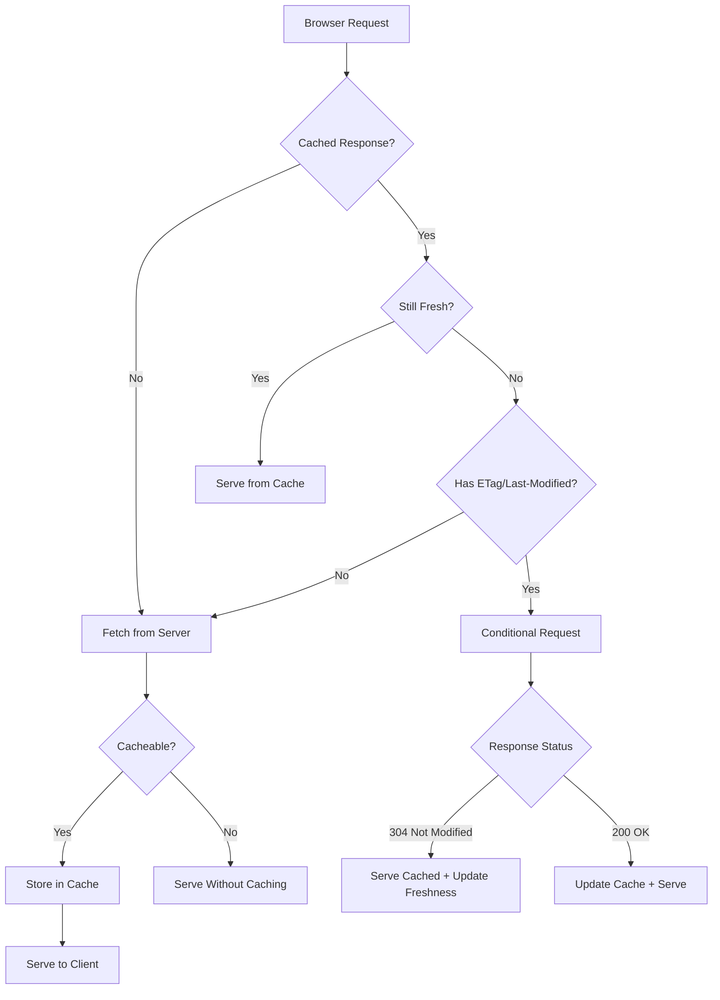
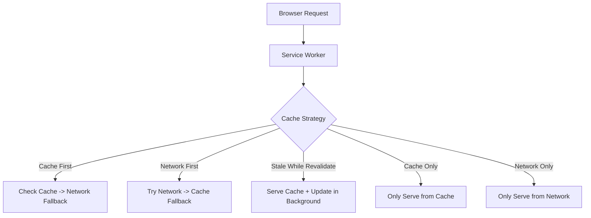

# HTTP Caching

## Why HTTP Caching Exists

HTTP caching eliminates redundant network transfers. When a browser requests a resource it already has, the server can either confirm the cached version is still valid (conditional request, 304 response) or the browser can skip the request entirely (strong cache hit, no network). This reduces latency from 100-500ms (full fetch) to 0ms (cache hit) or 20-50ms (conditional 304).

HTTP caching is the most cost-effective performance optimization on the web. It requires zero infrastructure — only correct headers. Yet it is routinely misconfigured, leading to either stale content (users see old versions) or cache-busting (users re-download everything on every visit).

### Historical Context

- **HTTP/1.0** (1996): `Expires` header — an absolute date when the response becomes stale. Fragile because client and server clocks must agree.
- **HTTP/1.1** (1997): `Cache-Control` header — relative directives (`max-age`, `no-cache`, `no-store`). `ETag` for conditional validation. `Vary` for content negotiation.
- **2010s**: Service Workers — programmable caches in the browser, enabling offline-first and sophisticated cache strategies.
- **2020s**: `stale-while-revalidate` and `stale-if-error` directives gain broad support, enabling aggressive caching with background refresh.

## First Principles

### The HTTP Cache Model



### Freshness vs Validation

HTTP caching has two mechanisms:

1. **Freshness** (`Cache-Control: max-age`, `Expires`): The client decides locally whether the cached response is still usable. No network request needed. This is the "strong cache."

2. **Validation** (`ETag`, `Last-Modified`): The client asks the server "has this changed?" by sending a conditional request. If unchanged, the server responds with `304 Not Modified` (no body). This is the "weak cache."

$$
T_{\text{strong hit}} = 0\text{ms (no network)}
$$

$$
T_{\text{conditional 304}} \approx \text{RTT} + T_{\text{server validation}} \approx 20\text{-}100\text{ms}
$$

$$
T_{\text{full fetch}} \approx \text{RTT} + T_{\text{server}} + \frac{\text{Size}}{\text{Bandwidth}} \approx 50\text{-}500\text{ms}
$$

## Core Mechanics

### Cache-Control Directives

```
Cache-Control: public, max-age=31536000, immutable
```

| Directive | Meaning | Use Case |
|-----------|---------|----------|
| `public` | Any cache (browser, CDN, proxy) may store | Static assets, public API responses |
| `private` | Only browser cache, not shared caches | User-specific responses |
| `no-cache` | Cache may store, but MUST revalidate before use | Pages that change frequently |
| `no-store` | Do not cache at all | Sensitive data (banking, health) |
| `max-age=N` | Fresh for N seconds | Primary freshness control |
| `s-maxage=N` | Fresh for N seconds in shared caches only | CDN-specific TTL |
| `must-revalidate` | After expiry, MUST validate (no stale serving) | Critical data |
| `stale-while-revalidate=N` | Serve stale for N seconds while revalidating in background | Performance-first |
| `stale-if-error=N` | Serve stale if origin returns 5xx | Resilience |
| `immutable` | Never revalidate (even on reload) | Content-addressed assets |

### Common Header Patterns

```typescript
import { Router, Request, Response } from 'express';

const router = Router();

// 1. Hashed static assets (CSS, JS, images with content hash in filename)
// e.g., /assets/main.a1b2c3d4.js
router.get('/assets/:filename', (req: Request, res: Response) => {
  res.set('Cache-Control', 'public, max-age=31536000, immutable');
  // 1 year cache, never revalidate — the hash in the URL changes when content changes
  res.sendFile(req.params.filename);
});

// 2. HTML pages (should always revalidate)
router.get('/', (req: Request, res: Response) => {
  res.set('Cache-Control', 'no-cache'); // Store but revalidate every time
  res.set('ETag', computeETag(pageContent));
  res.send(pageContent);
});

// 3. API responses (short cache with background revalidation)
router.get('/api/products', (req: Request, res: Response) => {
  res.set('Cache-Control', 'public, max-age=60, stale-while-revalidate=300');
  // Fresh for 60s, then serve stale for up to 300s while revalidating
  res.json(products);
});

// 4. Personalized API responses
router.get('/api/me', (req: Request, res: Response) => {
  res.set('Cache-Control', 'private, max-age=0, must-revalidate');
  res.set('ETag', computeETag(JSON.stringify(user)));
  res.json(user);
});

// 5. Sensitive data — never cache
router.get('/api/bank/balance', (req: Request, res: Response) => {
  res.set('Cache-Control', 'no-store');
  res.set('Pragma', 'no-cache'); // HTTP/1.0 compatibility
  res.json(balance);
});

// 6. CDN with different browser/CDN TTL
router.get('/api/feed', (req: Request, res: Response) => {
  res.set('Cache-Control', 'public, max-age=10, s-maxage=60');
  // Browser: fresh for 10s; CDN: fresh for 60s
  res.json(feed);
});
```

### ETag Implementation

ETags are opaque validators that the server generates. There are two types:

- **Strong ETag**: `"abc123"` — byte-for-byte identical response.
- **Weak ETag**: `W/"abc123"` — semantically equivalent (may differ in whitespace, encoding).

```typescript
import crypto from 'node:crypto';

function strongETag(content: Buffer | string): string {
  const hash = crypto
    .createHash('sha256')
    .update(content)
    .digest('base64url')
    .slice(0, 27);
  return `"${hash}"`;
}

function weakETag(content: unknown): string {
  const hash = crypto
    .createHash('md5')
    .update(JSON.stringify(content))
    .digest('base64url')
    .slice(0, 16);
  return `W/"${hash}"`;
}

// Conditional request handling middleware
function conditionalGet(
  req: Request,
  res: Response,
  content: Buffer | string,
  lastModified?: Date
): boolean {
  const etag = strongETag(content);
  res.set('ETag', etag);

  if (lastModified) {
    res.set('Last-Modified', lastModified.toUTCString());
  }

  // Check If-None-Match (ETag)
  const ifNoneMatch = req.get('If-None-Match');
  if (ifNoneMatch) {
    const clientETags = ifNoneMatch.split(',').map(t => t.trim());
    if (clientETags.includes(etag) || clientETags.includes('*')) {
      res.status(304).end();
      return true;
    }
  }

  // Check If-Modified-Since (date)
  const ifModifiedSince = req.get('If-Modified-Since');
  if (ifModifiedSince && lastModified) {
    const clientDate = new Date(ifModifiedSince);
    if (lastModified <= clientDate) {
      res.status(304).end();
      return true;
    }
  }

  return false; // Not cached — caller should send full response
}

// Usage
router.get('/api/article/:id', async (req, res) => {
  const article = await db.articles.findById(req.params.id);
  const content = JSON.stringify(article);

  if (conditionalGet(req, res, content, article.updatedAt)) {
    return; // 304 sent
  }

  res.set('Cache-Control', 'public, max-age=0, must-revalidate');
  res.json(article);
});
```

### The Vary Header

`Vary` tells caches which request headers affect the response. Without it, a CDN might serve a gzipped response to a client that does not support gzip.

```typescript
// Vary by Accept-Encoding (compression)
res.set('Vary', 'Accept-Encoding');

// Vary by Accept (content negotiation — JSON vs HTML)
res.set('Vary', 'Accept');

// Vary by Authorization (different responses per user)
// WARNING: This effectively disables shared caching
res.set('Vary', 'Authorization');

// Multiple Vary headers
res.set('Vary', 'Accept-Encoding, Accept-Language');
```

::: warning Vary: Cookie
Never use `Vary: Cookie`. Cookies are unique per user, so every response becomes a unique cache entry. The cache becomes useless and may consume enormous memory on CDNs.
:::

## Service Worker Cache Strategies

Service Workers provide a programmable cache layer in the browser, enabling sophisticated offline-first strategies.



### Cache-First (Offline-First)

Best for: static assets, fonts, images — things that rarely change.

```typescript
// service-worker.ts
const CACHE_NAME = 'static-v1';
const STATIC_ASSETS = [
  '/styles/main.css',
  '/scripts/app.js',
  '/images/logo.svg',
];

self.addEventListener('install', (event: ExtendableEvent) => {
  event.waitUntil(
    caches.open(CACHE_NAME).then(cache => cache.addAll(STATIC_ASSETS))
  );
});

self.addEventListener('fetch', (event: FetchEvent) => {
  if (event.request.destination === 'image' ||
      event.request.destination === 'style' ||
      event.request.destination === 'script') {

    event.respondWith(
      caches.match(event.request).then(cached => {
        if (cached) return cached;

        return fetch(event.request).then(response => {
          const clone = response.clone();
          caches.open(CACHE_NAME).then(cache => {
            cache.put(event.request, clone);
          });
          return response;
        });
      })
    );
  }
});
```

### Network-First with Cache Fallback

Best for: API responses, dynamic content — where freshness matters but offline support is wanted.

```typescript
self.addEventListener('fetch', (event: FetchEvent) => {
  if (event.request.url.includes('/api/')) {
    event.respondWith(
      fetch(event.request)
        .then(response => {
          // Cache successful network responses
          const clone = response.clone();
          caches.open('api-v1').then(cache => {
            cache.put(event.request, clone);
          });
          return response;
        })
        .catch(() => {
          // Network failed — try cache
          return caches.match(event.request).then(cached => {
            if (cached) return cached;
            return new Response(
              JSON.stringify({ error: 'Offline and no cached data' }),
              { status: 503, headers: { 'Content-Type': 'application/json' } }
            );
          });
        })
    );
  }
});
```

### Stale-While-Revalidate

Best for: content that should be fast but reasonably fresh — articles, product listings.

```typescript
self.addEventListener('fetch', (event: FetchEvent) => {
  event.respondWith(
    caches.open('swr-cache').then(async cache => {
      const cached = await cache.match(event.request);

      // Fetch update in background regardless
      const fetchPromise = fetch(event.request).then(response => {
        cache.put(event.request, response.clone());
        return response;
      });

      // Return cached immediately, or wait for network
      return cached || fetchPromise;
    })
  );
});
```

### Full Service Worker Implementation

```typescript
// sw.ts — Production service worker with multiple strategies

const STATIC_CACHE = 'static-v2';
const API_CACHE = 'api-v1';
const IMAGE_CACHE = 'images-v1';

const STATIC_URLS = [
  '/',
  '/offline.html',
  '/styles/critical.css',
];

// Install: precache critical assets
self.addEventListener('install', (event: ExtendableEvent) => {
  event.waitUntil(
    caches.open(STATIC_CACHE)
      .then(cache => cache.addAll(STATIC_URLS))
      .then(() => (self as any).skipWaiting())
  );
});

// Activate: clean old caches
self.addEventListener('activate', (event: ExtendableEvent) => {
  const currentCaches = [STATIC_CACHE, API_CACHE, IMAGE_CACHE];
  event.waitUntil(
    caches.keys().then(names =>
      Promise.all(
        names
          .filter(name => !currentCaches.includes(name))
          .map(name => caches.delete(name))
      )
    ).then(() => (self as any).clients.claim())
  );
});

// Fetch: route to appropriate strategy
self.addEventListener('fetch', (event: FetchEvent) => {
  const url = new URL(event.request.url);

  // Skip non-GET requests
  if (event.request.method !== 'GET') return;

  // API requests: network-first
  if (url.pathname.startsWith('/api/')) {
    event.respondWith(networkFirst(event.request, API_CACHE, 5000));
    return;
  }

  // Images: cache-first with size limit
  if (event.request.destination === 'image') {
    event.respondWith(cacheFirst(event.request, IMAGE_CACHE));
    return;
  }

  // HTML pages: stale-while-revalidate
  if (event.request.destination === 'document') {
    event.respondWith(staleWhileRevalidate(event.request, STATIC_CACHE));
    return;
  }

  // Everything else: cache-first
  event.respondWith(cacheFirst(event.request, STATIC_CACHE));
});

async function cacheFirst(
  request: Request,
  cacheName: string
): Promise<Response> {
  const cached = await caches.match(request);
  if (cached) return cached;

  const response = await fetch(request);
  if (response.ok) {
    const cache = await caches.open(cacheName);
    cache.put(request, response.clone());
  }
  return response;
}

async function networkFirst(
  request: Request,
  cacheName: string,
  timeoutMs: number
): Promise<Response> {
  const cache = await caches.open(cacheName);

  try {
    const controller = new AbortController();
    const timeoutId = setTimeout(() => controller.abort(), timeoutMs);

    const response = await fetch(request, { signal: controller.signal });
    clearTimeout(timeoutId);

    if (response.ok) {
      cache.put(request, response.clone());
    }
    return response;
  } catch {
    const cached = await cache.match(request);
    return cached || new Response('Offline', { status: 503 });
  }
}

async function staleWhileRevalidate(
  request: Request,
  cacheName: string
): Promise<Response> {
  const cache = await caches.open(cacheName);
  const cached = await cache.match(request);

  const networkPromise = fetch(request).then(response => {
    if (response.ok) {
      cache.put(request, response.clone());
    }
    return response;
  }).catch(() => null);

  return cached || (await networkPromise) || new Response('Offline', { status: 503 });
}
```

## Edge Cases and Failure Modes

### 1. Caching Authenticated Responses on CDN

```typescript
// SECURITY BUG: CDN caches user-specific data and serves it to all users
res.set('Cache-Control', 'public, max-age=300');
res.json({ name: 'Alice', balance: 1000 }); // Served to Bob too!

// FIX: Use private or include Authorization in Vary
res.set('Cache-Control', 'private, max-age=60');
// Or for public caches with per-user variants:
res.set('Cache-Control', 'public, max-age=60');
res.set('Vary', 'Authorization');
```

### 2. Browser Caching Breaking Deployments

```html
<!-- BAD: Browser caches index.html with old asset references -->
<script src="/app.js"></script>
<!-- After deploy, app.js has new code but browser serves cached old version -->

<!-- FIX: Cache-bust with content hash + never cache HTML -->
<script src="/app.a3f8b2c1.js"></script>
```

```typescript
// Server config for HTML files
app.get('*.html', (req, res, next) => {
  res.set('Cache-Control', 'no-cache'); // Always revalidate HTML
  next();
});

// Server config for hashed assets
app.get('/assets/*', (req, res, next) => {
  res.set('Cache-Control', 'public, max-age=31536000, immutable');
  next();
});
```

### 3. Stale Content After Emergency Fix

::: danger
If you deploy a security fix but assets are cached for 1 year, users continue running the vulnerable code. You need a CDN purge mechanism.
:::

```typescript
// CDN purge endpoint for emergencies
async function purgeAsset(url: string): Promise<void> {
  // Cloudflare
  await fetch(`https://api.cloudflare.com/client/v4/zones/${zoneId}/purge_cache`, {
    method: 'POST',
    headers: { Authorization: `Bearer ${apiToken}` },
    body: JSON.stringify({ files: [url] }),
  });
}

// Or purge everything (nuclear option)
async function purgeAll(): Promise<void> {
  await fetch(`https://api.cloudflare.com/client/v4/zones/${zoneId}/purge_cache`, {
    method: 'POST',
    headers: { Authorization: `Bearer ${apiToken}` },
    body: JSON.stringify({ purge_everything: true }),
  });
}
```

### 4. Service Worker Trapping Old HTML

```typescript
// BUG: Service worker caches HTML and serves it forever
// Even after deploying a new version, users get the old HTML
// because the service worker intercepts the request before it reaches the network

// FIX: Version your service worker and HTML cache
const CACHE_VERSION = 'v3'; // Increment on deploy

// Navigation requests always go network-first
self.addEventListener('fetch', (event: FetchEvent) => {
  if (event.request.mode === 'navigate') {
    event.respondWith(
      fetch(event.request).catch(() => caches.match('/offline.html'))
    );
    return;
  }
});
```

## Performance Characteristics

### Impact of Caching on Web Vitals

| Metric | No Cache | HTTP Cache (304) | Strong Cache (hit) | Service Worker |
|--------|----------|------------------|---------------------|----------------|
| TTFB | 200-500ms | 50-100ms | 0ms | 0-10ms |
| FCP | 1-3s | 0.5-1s | 0.1-0.5s | 0.1-0.5s |
| LCP | 2-5s | 1-2s | 0.5-1s | 0.5-1s |
| Network bytes | Full size | Headers only | 0 | 0 |

### Cache-Control Strategy Performance

```
Scenario: 100 page views, 50 unique assets of 50KB each

No caching:
  Network: 100 * 50 * 50KB = 250MB total transfer
  Latency: 100 * 2s = 200s total wait

max-age=3600 (1 hour):
  First visit: 50 * 50KB = 2.5MB (cold cache)
  Subsequent 99 visits: 0 bytes (cache hits)
  Total: 2.5MB (99% reduction)

no-cache + ETag:
  First visit: 50 * 50KB = 2.5MB
  Subsequent: 50 * 304 responses * 200 bytes = 10KB per visit
  Total: 2.5MB + 99 * 10KB = 3.49MB (98.6% reduction)
```

### Bandwidth Savings Formula

$$
\text{Savings} = 1 - \frac{1 + (N-1) \cdot (1-h) + (N-1) \cdot h \cdot r}{N}
$$

Where:
- $N$ = number of visits
- $h$ = cache hit ratio
- $r$ = ratio of 304 response size to full response size ($\approx 0.004$ for typical assets)

For 1000 visits with 95% hit ratio:

$$
\text{Savings} = 1 - \frac{1 + 999 \times 0.05 + 999 \times 0.95 \times 0.004}{1000} \approx 94.6\%
$$

## Mathematical Foundations

### Optimal max-age Calculation

The optimal TTL balances freshness against bandwidth:

$$
\text{max-age}^* = \frac{T_{\text{304}}}{\lambda_c \cdot C_{\text{stale}}}
$$

Where:
- $T_{\text{304}}$ = cost of a conditional request (network round-trip)
- $\lambda_c$ = rate of content changes
- $C_{\text{stale}}$ = cost per unit time of serving stale content

For content that changes once per hour, with 50ms round-trip and low staleness cost:

$$
\text{max-age}^* = \frac{0.05}{1/3600 \times 0.001} \approx 180{,}000\text{s}
$$

In practice, cap at reasonable values (1 day for API, 1 year for hashed assets).

::: info War Story
**The Cache-Control Header That Wasn't**

A team spent weeks optimizing their API response times but ignored caching. Every API call returned `Cache-Control: no-store` because a security-conscious middleware was applied globally. After audit, they discovered that 70% of API calls were for static reference data (country lists, product categories, feature flags) that changed monthly. Adding `Cache-Control: public, max-age=3600` to those endpoints reduced API traffic by 60% and improved page load times by 400ms.
:::

::: info War Story
**The Immutable Asset That Wasn't Immutable**

A team used `Cache-Control: public, max-age=31536000, immutable` on their JavaScript bundles. The build system generated filenames like `/app.v2.js` using a version number instead of a content hash. A developer fixed a critical bug but the version number was only bumped on major releases. The fix was deployed with the same filename, but browsers that had cached the old version never fetched the new one. Users reported the bug persisted for weeks.

The fix was switching to content-hash-based filenames (`/app.a3f8b2c1.js`) so any content change produces a new URL, and the old URL remains correct in caches that still hold it.
:::

## Decision Framework

### Cache-Control Cheat Sheet

| Content Type | Cache-Control | Why |
|-------------|---------------|-----|
| Hashed static assets | `public, max-age=31536000, immutable` | URL changes on content change |
| HTML pages | `no-cache` | Always revalidate to get latest assets |
| API (public, stable) | `public, max-age=300, stale-while-revalidate=3600` | Balance freshness and speed |
| API (public, volatile) | `public, max-age=0, must-revalidate` | Always revalidate |
| API (private) | `private, max-age=60` | User-specific, short cache |
| Sensitive data | `no-store` | Never persist |
| Images (unhashed) | `public, max-age=86400` | Moderate freshness, 1 day |
| Fonts | `public, max-age=31536000` | Rarely change |

### Service Worker Strategy Selection

| Content | Strategy | Reason |
|---------|----------|--------|
| App shell HTML | Stale-while-revalidate | Fast first paint, update in background |
| Static assets | Cache-first | Immutable, no need to check network |
| API data | Network-first | Freshness critical |
| Images | Cache-first | Large, expensive to re-download |
| User content | Network-only | Must be fresh |

## Advanced Topics

### Cache Key Normalization

CDN cache efficiency depends on cache key design. Unnecessary variation in cache keys causes redundant origin fetches:

```typescript
// Problem: Query parameter order creates different cache keys
// /api/products?color=red&size=M and /api/products?size=M&color=red
// are the same resource but different cache keys

// Solution: Normalize query parameters
function normalizeUrl(url: URL): string {
  const params = new URLSearchParams(url.searchParams);
  const sorted = new URLSearchParams(
    [...params.entries()].sort(([a], [b]) => a.localeCompare(b))
  );
  return `${url.pathname}?${sorted.toString()}`;
}
```

### Cache Versioning with Service Workers

```typescript
// Automated cache versioning based on build hash
const BUILD_HASH = '__BUILD_HASH__'; // Replaced at build time
const CACHES = {
  static: `static-${BUILD_HASH}`,
  api: `api-v1`, // API cache survives deploys
  images: `images-v1`,
};

self.addEventListener('activate', (event: ExtendableEvent) => {
  event.waitUntil(
    caches.keys().then(names =>
      Promise.all(
        names
          .filter(name => {
            // Keep current caches and non-versioned caches
            return !Object.values(CACHES).includes(name) &&
                   name.startsWith('static-');
          })
          .map(name => caches.delete(name))
      )
    )
  );
});
```

### Surrogate Keys for Fine-Grained CDN Invalidation

CDNs like Fastly support surrogate keys that tag cached responses with arbitrary labels:

```typescript
// Tag responses with their dependencies
router.get('/api/products/:id', async (req, res) => {
  const product = await db.products.findById(req.params.id);

  res.set('Surrogate-Key', [
    `product-${product.id}`,
    `category-${product.categoryId}`,
    `brand-${product.brandId}`,
  ].join(' '));

  res.set('Cache-Control', 's-maxage=86400'); // Cache for 1 day on CDN

  res.json(product);
});

// When a category changes, purge all products in that category
async function onCategoryUpdate(categoryId: string): Promise<void> {
  await fetch('https://api.fastly.com/service/xxx/purge', {
    method: 'POST',
    headers: {
      'Fastly-Key': process.env.FASTLY_API_KEY!,
      'Surrogate-Key': `category-${categoryId}`,
    },
  });
}
```

::: tip Key Takeaway
HTTP caching is the highest-leverage performance optimization available. The optimal strategy is: never cache HTML (always revalidate), always cache hashed assets (1 year, immutable), and use `stale-while-revalidate` for API responses. Implement a service worker for offline resilience and instant repeat visits. Measure your cache hit ratio at the CDN level — it should be above 90% for static assets.
:::

## Cross-References

- [Caching Strategies Overview](./index.md) — full cache hierarchy
- [Edge Caching](./edge-caching.md) — CDN-specific caching patterns
- [Application-Level Caching](./application-level.md) — in-process and Redis caching
- [Edge Runtime Constraints](../edge-computing/edge-runtime-constraints.md) — caching at the edge
- [Cloudflare Workers](../edge-computing/cloudflare-workers.md) — Workers cache API
