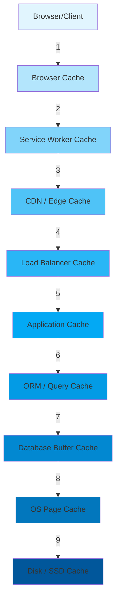
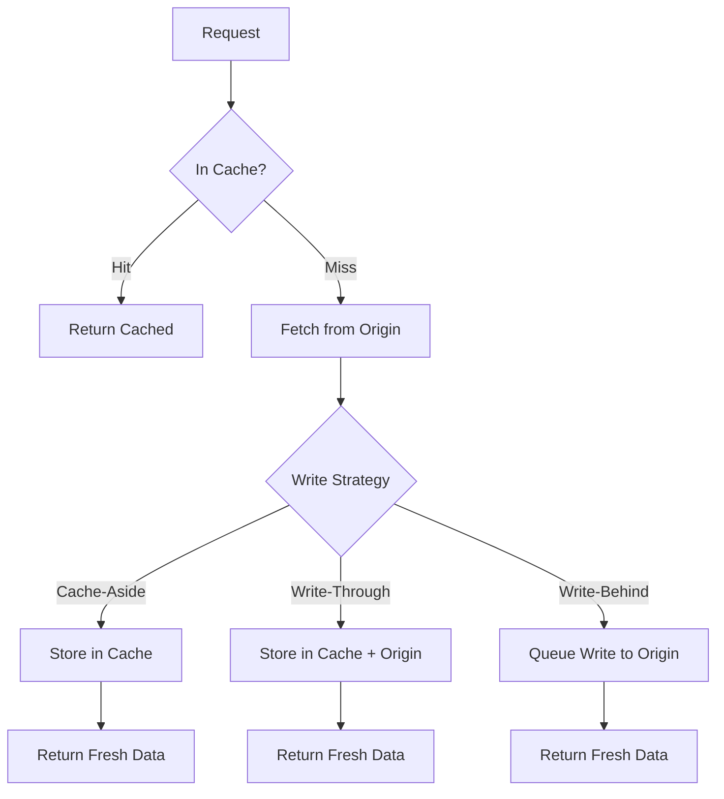
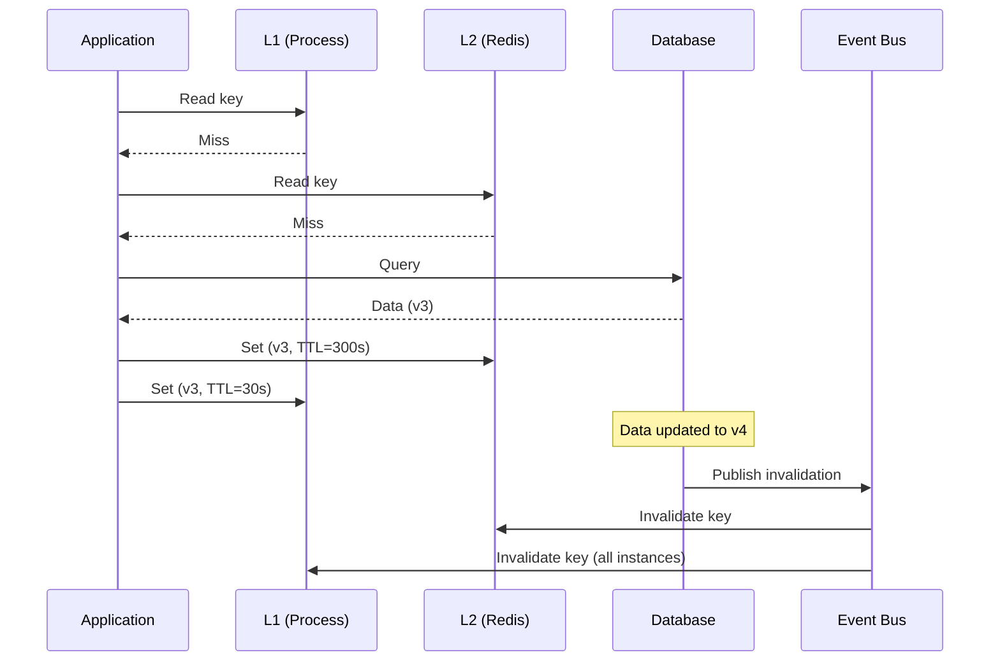

# Caching Strategies Overview

## Why Caching Exists

Every computation and data retrieval has a cost — CPU cycles, network round-trips, disk I/O, database queries. Caching stores the results of expensive operations so they can be reused without paying the cost again. It is the single most impactful performance optimization in computing.

The idea is ancient. CPU caches (L1/L2/L3) exist because DRAM is 100x slower than registers. Disk caches exist because spinning disks are 100,000x slower than RAM. CDN caches exist because transcontinental network round-trips add 100-300ms of latency. At every layer, caching trades space for time.

### The Fundamental Tradeoff

Caching introduces three problems that do not exist without it:

1. **Staleness** — cached data may not reflect the current source of truth
2. **Invalidation** — deciding when to evict or update cached data is notoriously hard
3. **Consistency** — multiple cache layers can disagree with each other

Phil Karlton's famous quote: "There are only two hard things in Computer Science: cache invalidation and naming things."

## First Principles

### The Cache Hierarchy

Modern web applications have caches at every layer, each with different characteristics:



| Layer | Latency | Size | Scope | Invalidation |
|-------|---------|------|-------|-------------|
| L1 CPU Cache | 0.5ns | 64KB | Per core | Hardware managed |
| L2 CPU Cache | 7ns | 256KB | Per core | Hardware managed |
| L3 CPU Cache | 30ns | 8-64MB | Shared | Hardware managed |
| Application (in-process) | 0.1us | 100MB-1GB | Per process | TTL, LRU, manual |
| Redis/Memcached | 0.1-1ms | 1-100GB | Cluster-wide | TTL, manual, pub/sub |
| Database buffer | 0.1-1ms | 1-128GB | Per instance | LRU, checkpoint |
| OS page cache | 0.01ms | Available RAM | Per host | LRU, madvise |
| CDN edge | 1-50ms | Terabytes | Global | TTL, purge API |
| Browser | 0ms | 50-500MB | Per user | Cache-Control headers |

### Cache Hit Ratio — The Only Metric That Matters

The effectiveness of a cache is measured by its hit ratio:

$$
\text{Hit Ratio} = \frac{\text{Cache Hits}}{\text{Cache Hits} + \text{Cache Misses}}
$$

The impact on average latency:

$$
T_{\text{avg}} = h \cdot T_{\text{hit}} + (1 - h) \cdot T_{\text{miss}}
$$

Where $h$ is the hit ratio, $T_{\text{hit}}$ is cache-hit latency, and $T_{\text{miss}}$ is cache-miss latency (which includes the time to fetch from the origin and populate the cache).

For a typical web application:
- $T_{\text{hit}} = 1\text{ms}$ (Redis lookup)
- $T_{\text{miss}} = 50\text{ms}$ (database query)
- At 95% hit ratio: $T_{\text{avg}} = 0.95 \times 1 + 0.05 \times 50 = 3.45\text{ms}$
- At 80% hit ratio: $T_{\text{avg}} = 0.80 \times 1 + 0.20 \times 50 = 10.8\text{ms}$

A 15% difference in hit ratio causes a 3x difference in average latency.

### The Working Set Model

Not all data is equally cacheable. The *working set* is the subset of data actively being accessed. Caching is effective when:

$$
|\text{Working Set}| \ll |\text{Total Data}|
$$

If an application has 10TB of data but users typically access 100GB in any given hour, a 100GB cache can achieve near-perfect hit ratios. If access is uniformly random across all 10TB, no reasonable cache size helps.

The distribution of access patterns follows Zipf's Law in most real systems:

$$
P(k) \propto \frac{1}{k^s}
$$

Where $k$ is the rank of an item (1 = most popular) and $s$ is typically 0.8-1.2. This means the top 20% of items account for 80%+ of accesses — the Pareto principle in action.

## Core Mechanics

### Cache Access Patterns



### Cache-Aside (Lazy Loading)

The application manages the cache explicitly. On read, check cache first; on miss, fetch from origin and populate cache.

```typescript
interface CacheAside<T> {
  get(key: string): Promise<T | null>;
  set(key: string, value: T, ttlSeconds: number): Promise<void>;
  del(key: string): Promise<void>;
}

class CacheAsideRepository<T> {
  constructor(
    private readonly cache: CacheAside<T>,
    private readonly db: { findById(id: string): Promise<T | null> },
    private readonly ttl: number = 300
  ) {}

  async findById(id: string): Promise<T | null> {
    // 1. Check cache
    const cached = await this.cache.get(`entity:${id}`);
    if (cached !== null) {
      return cached;
    }

    // 2. Cache miss — fetch from DB
    const entity = await this.db.findById(id);
    if (entity === null) {
      return null;
    }

    // 3. Populate cache
    await this.cache.set(`entity:${id}`, entity, this.ttl);
    return entity;
  }

  async update(id: string, data: Partial<T>): Promise<T> {
    // 1. Update DB (source of truth)
    const updated = await this.db.update(id, data);

    // 2. Invalidate cache (do NOT update — delete)
    await this.cache.del(`entity:${id}`);

    return updated;
  }
}
```

::: warning Cache-Aside Pitfall
Always **invalidate** (delete) cache entries on write, rather than updating them. If two concurrent writes update the cache, the slower write may overwrite the faster one, causing the cache to hold stale data. Deletion ensures the next read fetches fresh data.
:::

### Write-Through

Every write goes to both cache and origin simultaneously. Guarantees cache consistency but adds latency to writes.

```typescript
class WriteThroughCache<T> {
  constructor(
    private readonly cache: CacheAside<T>,
    private readonly db: Database<T>,
    private readonly ttl: number = 300
  ) {}

  async write(key: string, value: T): Promise<void> {
    // Write to both simultaneously
    await Promise.all([
      this.db.put(key, value),
      this.cache.set(key, value, this.ttl),
    ]);
  }

  async read(key: string): Promise<T | null> {
    const cached = await this.cache.get(key);
    if (cached !== null) return cached;

    const value = await this.db.get(key);
    if (value !== null) {
      await this.cache.set(key, value, this.ttl);
    }
    return value;
  }
}
```

### Write-Behind (Write-Back)

Writes go to cache immediately and are asynchronously flushed to the origin. Maximum write performance but risk of data loss.

```typescript
class WriteBehindCache<T> {
  private readonly pendingWrites = new Map<string, T>();
  private flushTimer: ReturnType<typeof setInterval>;

  constructor(
    private readonly cache: CacheAside<T>,
    private readonly db: Database<T>,
    private readonly flushIntervalMs: number = 1000
  ) {
    this.flushTimer = setInterval(() => this.flush(), flushIntervalMs);
  }

  async write(key: string, value: T): Promise<void> {
    // Write to cache immediately
    await this.cache.set(key, value, 3600);
    // Queue for async DB write
    this.pendingWrites.set(key, value);
  }

  private async flush(): Promise<void> {
    if (this.pendingWrites.size === 0) return;

    const batch = new Map(this.pendingWrites);
    this.pendingWrites.clear();

    try {
      await this.db.batchPut(batch);
    } catch (err) {
      // Re-queue failed writes
      for (const [key, value] of batch) {
        if (!this.pendingWrites.has(key)) {
          this.pendingWrites.set(key, value);
        }
      }
      console.error('Write-behind flush failed:', err);
    }
  }

  async shutdown(): Promise<void> {
    clearInterval(this.flushTimer);
    await this.flush(); // Final flush
  }
}
```

### Read-Through

The cache itself fetches from the origin on miss. The application only talks to the cache.

```typescript
class ReadThroughCache<T> {
  constructor(
    private readonly store: Map<string, { value: T; expiresAt: number }>,
    private readonly loader: (key: string) => Promise<T | null>,
    private readonly ttl: number = 300_000
  ) {}

  async get(key: string): Promise<T | null> {
    const entry = this.store.get(key);

    if (entry && entry.expiresAt > Date.now()) {
      return entry.value;
    }

    // Cache miss or expired — load from origin
    const value = await this.loader(key);
    if (value !== null) {
      this.store.set(key, {
        value,
        expiresAt: Date.now() + this.ttl,
      });
    } else {
      this.store.delete(key);
    }

    return value;
  }
}
```

## Eviction Policies

### LRU (Least Recently Used)

Evicts the item that has not been accessed for the longest time. Best for temporal locality — recently accessed items are likely to be accessed again.

### LFU (Least Frequently Used)

Evicts the item with the fewest accesses. Best when some items are consistently popular. Risk: items that were popular in the past but are no longer relevant remain cached.

### ARC (Adaptive Replacement Cache)

Combines LRU and LFU, automatically adapting to the workload. Used in ZFS and PostgreSQL.

### Random Eviction

Surprisingly effective. Avoids pathological worst-case patterns that affect LRU (sequential scans). Used in some CPU caches.

### Comparison Table

| Policy | Best For | Worst Case | Overhead |
|--------|---------|------------|----------|
| LRU | Temporal locality | Sequential scan | O(1) with doubly-linked list + hash map |
| LFU | Stable popularity | One-hit wonders fill cache | O(log n) or O(1) with frequency buckets |
| ARC | Unknown/mixed workloads | Slightly higher memory (tracks both) | O(1) |
| FIFO | Simple, low overhead | No adaptation | O(1) |
| Random | Avoiding worst cases | Unpredictable | O(1) |
| TTL-only | Time-sensitive data | No space management | O(1) per check |

## Edge Cases and Failure Modes

### Cache Stampede (Thundering Herd)

When a popular cache entry expires, hundreds of concurrent requests all see the miss and hit the database simultaneously:

```typescript
// Solution: Request coalescing / single-flight
class CoalescingCache<T> {
  private readonly cache = new Map<string, { value: T; expiresAt: number }>();
  private readonly inflight = new Map<string, Promise<T>>();

  async get(key: string, loader: () => Promise<T>, ttlMs: number): Promise<T> {
    // Check cache
    const entry = this.cache.get(key);
    if (entry && entry.expiresAt > Date.now()) {
      return entry.value;
    }

    // Check inflight
    const pending = this.inflight.get(key);
    if (pending) {
      return pending; // Coalesce with existing request
    }

    // Single flight
    const promise = loader().then(value => {
      this.cache.set(key, { value, expiresAt: Date.now() + ttlMs });
      this.inflight.delete(key);
      return value;
    }).catch(err => {
      this.inflight.delete(key);
      throw err;
    });

    this.inflight.set(key, promise);
    return promise;
  }
}
```

### Cache Penetration

Requests for non-existent keys always miss the cache and hit the database. An attacker can exploit this by requesting random IDs.

```typescript
// Solution: Cache negative results (null entries)
async function getWithNegativeCache(key: string): Promise<User | null> {
  const cached = await redis.get(`user:${key}`);

  if (cached === 'NULL_SENTINEL') {
    return null; // Cached negative result
  }

  if (cached) {
    return JSON.parse(cached);
  }

  const user = await db.users.findById(key);

  if (user === null) {
    // Cache the miss with short TTL
    await redis.set(`user:${key}`, 'NULL_SENTINEL', 'EX', 60);
    return null;
  }

  await redis.set(`user:${key}`, JSON.stringify(user), 'EX', 300);
  return user;
}
```

### Cache Avalanche

Many cache entries expire simultaneously, causing a flood of database queries:

```typescript
// Solution: Jittered TTL
function jitteredTtl(baseTtlSeconds: number, jitterPercent: number = 0.1): number {
  const jitter = baseTtlSeconds * jitterPercent;
  return baseTtlSeconds + Math.random() * jitter * 2 - jitter;
}

// Instead of all entries expiring at exactly 300s:
await redis.set(key, value, 'EX', jitteredTtl(300)); // 270-330s
```

### Warm-Up Problem

After a deployment or cache restart, the cache is empty and all requests hit the origin:

```typescript
// Solution: Cache warming on startup
async function warmCache(popularKeys: string[]): Promise<void> {
  const BATCH_SIZE = 100;

  for (let i = 0; i < popularKeys.length; i += BATCH_SIZE) {
    const batch = popularKeys.slice(i, i + BATCH_SIZE);
    const values = await db.getMany(batch);

    const pipeline = redis.pipeline();
    for (const [key, value] of Object.entries(values)) {
      pipeline.set(`cache:${key}`, JSON.stringify(value), 'EX', 3600);
    }
    await pipeline.exec();
  }
}
```

::: info War Story
**The Black Friday Cache Avalanche**

An e-commerce site set all product cache entries to expire at exactly 5 minutes. At 12:00:00 AM on Black Friday, the pre-warmed cache from 11:55 PM expired all at once. 50,000 concurrent users triggered 50,000 database queries in 100ms. The database connection pool was exhausted in seconds, queries started timing out, and the site returned 503 errors for 3 minutes.

The fix was three-fold: (1) jittered TTLs spread over 4-6 minutes, (2) request coalescing to deduplicate concurrent fetches for the same key, (3) stale-while-revalidate semantics where expired entries are served while being refreshed in the background.
:::

::: info War Story
**The Microservice Cache Inconsistency**

A microservice architecture had three services that each cached user data locally. When a user updated their profile, the profile service invalidated its cache, but the other two services continued serving stale data for up to 5 minutes. Users saw their old name in some parts of the UI and their new name in others.

The fix was event-driven invalidation: the profile service published a `user.updated` event to a message bus, and all services with user caches subscribed and invalidated the relevant entries. This reduced the inconsistency window from minutes to ~100ms (message bus propagation time).
:::

## Performance Characteristics

### Cache Size vs Hit Ratio (Zipf Distribution)

For a dataset following Zipf's law with exponent $s$, the hit ratio for a cache of size $C$ out of $N$ total items:

$$
h(C) \approx \frac{\sum_{k=1}^{C} k^{-s}}{\sum_{k=1}^{N} k^{-s}}
$$

For $s = 1$ (typical web traffic):

| Cache Size (% of total) | Hit Ratio |
|--------------------------|-----------|
| 1% | ~45% |
| 5% | ~65% |
| 10% | ~75% |
| 20% | ~85% |
| 50% | ~95% |

This demonstrates the diminishing returns of cache size — the first 10% of cache capacity captures 75% of hits.

### Cost-Benefit Analysis

$$
\text{ROI} = \frac{(\text{Miss Cost} - \text{Hit Cost}) \times \text{Requests} \times \text{Hit Ratio}}{\text{Cache Infrastructure Cost}}
$$

For a system with:
- 1 million requests/day
- Cache miss cost: $0.001 (database query)
- Cache hit cost: $0.0001 (Redis lookup)
- 90% hit ratio
- Redis cost: $100/month

$$
\text{ROI} = \frac{(0.001 - 0.0001) \times 1{,}000{,}000 \times 0.9 \times 30}{100} = \frac{24{,}300}{100} = 243\times
$$

## Decision Framework

### Choosing a Caching Strategy

| Scenario | Strategy | Layer |
|----------|----------|-------|
| Static assets | HTTP Cache-Control + CDN | [Edge](./edge-caching.md) + [HTTP](./http-caching.md) |
| API responses | Cache-Aside + Redis | [Application](./application-level.md) |
| Database queries | Query cache + materialized views | [Database](./database-level.md) |
| User sessions | In-memory + Redis fallback | [Application](./application-level.md) |
| Computed aggregations | Write-behind + scheduled refresh | [Database](./database-level.md) |
| Personalized content | Per-user cache key + short TTL | [Application](./application-level.md) |
| Global config | Read-through + event invalidation | [Application](./application-level.md) |

### When NOT to Cache

- **Highly personalized data** with millions of unique variants — cache size grows unbounded
- **Write-heavy workloads** where data changes faster than it is read — invalidation cost exceeds benefit
- **Real-time data** where staleness is unacceptable (stock prices, live scores)
- **Security-sensitive data** that must not persist (tokens, passwords, PII in some jurisdictions)
- **Small datasets** that fit in application memory — direct DB queries may be fast enough

## Advanced Topics

### Multi-Layer Cache Coherence

When caches exist at multiple layers, consistency becomes complex. The common approaches:

1. **TTL-based**: Each layer has a TTL. Staleness is bounded but not zero.
2. **Event-based**: Origin publishes invalidation events that propagate to all layers.
3. **Version-based**: Each cache entry has a version number. Readers check version against origin.



### Probabilistic Data Structures

Bloom filters can prevent cache penetration without storing negative results:

```typescript
class BloomFilter {
  private readonly bits: Uint8Array;
  private readonly hashCount: number;
  private readonly size: number;

  constructor(expectedItems: number, falsePositiveRate: number = 0.01) {
    this.size = Math.ceil(
      -(expectedItems * Math.log(falsePositiveRate)) / (Math.log(2) ** 2)
    );
    this.hashCount = Math.ceil((this.size / expectedItems) * Math.log(2));
    this.bits = new Uint8Array(Math.ceil(this.size / 8));
  }

  add(item: string): void {
    for (let i = 0; i < this.hashCount; i++) {
      const hash = this.hash(item, i);
      const byteIndex = Math.floor(hash / 8);
      const bitIndex = hash % 8;
      this.bits[byteIndex] |= 1 << bitIndex;
    }
  }

  mightContain(item: string): boolean {
    for (let i = 0; i < this.hashCount; i++) {
      const hash = this.hash(item, i);
      const byteIndex = Math.floor(hash / 8);
      const bitIndex = hash % 8;
      if (!(this.bits[byteIndex] & (1 << bitIndex))) {
        return false; // Definitely not in set
      }
    }
    return true; // Probably in set
  }

  private hash(item: string, seed: number): number {
    let h = seed;
    for (let i = 0; i < item.length; i++) {
      h = (h * 31 + item.charCodeAt(i)) & 0x7fffffff;
    }
    return h % this.size;
  }
}

// Usage: Skip cache/DB lookup for items that definitely don't exist
const existingIds = new BloomFilter(1_000_000, 0.01);

// Populate during startup
for (const id of allIds) {
  existingIds.add(id);
}

async function getUser(id: string): Promise<User | null> {
  if (!existingIds.mightContain(id)) {
    return null; // Definitely doesn't exist — skip cache and DB
  }
  return cache.get(id, () => db.users.findById(id), 300_000);
}
```

::: tip Key Takeaway
Caching is not a single technique — it is a strategy applied at every layer of the stack. The best caching architectures combine multiple layers with appropriate invalidation strategies. Start by measuring your cache hit ratio; if it is below 90%, you likely have a cache sizing, eviction, or key design problem.
:::

## Section Contents

- [Application-Level Caching](./application-level.md) — In-process LRU/LFU, memoization, request-scoped caches
- [Database-Level Caching](./database-level.md) — Materialized views, denormalization, query caching
- [HTTP Caching](./http-caching.md) — Cache-Control, ETag, service worker strategies
- [Edge Caching](./edge-caching.md) — CDN caching, edge compute, cache key design

## Cross-References

- [Concurrency Patterns](../optimization/concurrency-patterns.md) — deduplication patterns prevent cache stampede
- [Connection Pool Tuning](../database-tuning/connection-pool-tuning.md) — pool sizing affects cache-miss cost
- [Edge Computing Overview](../edge-computing/index.md) — edge caching as part of edge architecture
