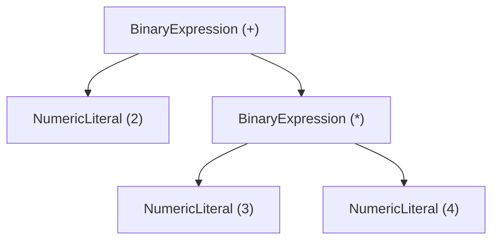
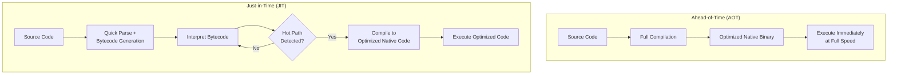
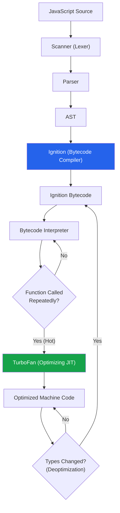
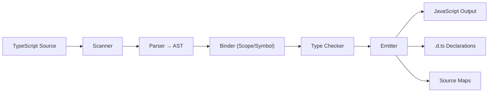

# Compiler & Interpreter Basics

Every line of code you write passes through a compiler or interpreter before it does anything useful. Understanding that pipeline — how source text becomes executable behavior — is one of the highest-leverage investments you can make as an engineer. It explains why some code is fast and other code is slow, why certain language features have hidden costs, and why the JavaScript engine sometimes surprises you.

This page walks through the compilation pipeline from first principles, compares JIT and AOT strategies, dissects how V8 turns JavaScript into machine code, and finishes with a working expression evaluator you can build yourself.

**Related**: [WebAssembly](/frontend-engineering/webassembly) | [Browser Rendering Pipeline](/frontend-engineering/browser-rendering) | [Web Performance](/frontend-engineering/web-performance)

---

## The Compilation Pipeline

Every compiler and interpreter follows the same fundamental pipeline. The stages differ in implementation, but the conceptual flow is universal:


Each stage transforms the program into a representation that is closer to what the machine can execute. Interpreters may stop at the AST or bytecode stage and evaluate directly. Compilers go all the way to native machine code.

## Stage 1: Lexical Analysis (Lexing)

The lexer (also called tokenizer or scanner) reads raw source text character by character and groups characters into **tokens** — the smallest meaningful units of the language.

### How Tokenization Works

```
Input:  let x = 42 + y;

Tokens:
  { type: "KEYWORD",    value: "let" }
  { type: "IDENTIFIER", value: "x" }
  { type: "EQUALS",     value: "=" }
  { type: "NUMBER",     value: "42" }
  { type: "PLUS",       value: "+" }
  { type: "IDENTIFIER", value: "y" }
  { type: "SEMICOLON",  value: ";" }
```

The lexer discards whitespace and comments (in most languages) and classifies each token by type. This is typically implemented as a state machine or a series of regular expressions.

### Token Categories

| Category | Examples | Purpose |
|----------|----------|---------|
| **Keywords** | `let`, `if`, `return`, `class` | Reserved language constructs |
| **Identifiers** | `myVar`, `calculate`, `x` | User-defined names |
| **Literals** | `42`, `"hello"`, `true` | Constant values |
| **Operators** | `+`, `===`, `&&`, `??` | Computation and comparison |
| **Punctuation** | `{`, `}`, `;`, `,` | Structure delimiters |

::: tip
Lexers are intentionally simple. They do not understand grammar or meaning — they just chop text into classified chunks. All structural understanding happens in the parser.
:::

### A Minimal Lexer in TypeScript

```typescript
type TokenType =
  | 'NUMBER' | 'PLUS' | 'MINUS' | 'STAR' | 'SLASH'
  | 'LPAREN' | 'RPAREN' | 'EOF';

interface Token {
  type: TokenType;
  value: string;
}

function tokenize(input: string): Token[] {
  const tokens: Token[] = [];
  let i = 0;

  while (i < input.length) {
    const ch = input[i];

    if (/\s/.test(ch)) { i++; continue; }

    if (/\d/.test(ch)) {
      let num = '';
      while (i < input.length && /[\d.]/.test(input[i])) {
        num += input[i++];
      }
      tokens.push({ type: 'NUMBER', value: num });
      continue;
    }

    const singleChar: Record<string, TokenType> = {
      '+': 'PLUS', '-': 'MINUS', '*': 'STAR',
      '/': 'SLASH', '(': 'LPAREN', ')': 'RPAREN',
    };

    if (singleChar[ch]) {
      tokens.push({ type: singleChar[ch], value: ch });
      i++;
      continue;
    }

    throw new Error(`Unexpected character: '${ch}' at position ${i}`);
  }

  tokens.push({ type: 'EOF', value: '' });
  return tokens;
}
```

## Stage 2: Parsing

The parser takes the flat stream of tokens and builds a tree structure — the **Abstract Syntax Tree (AST)** — that represents the grammatical structure of the program.

### Abstract Syntax Trees

An AST is a tree where each node represents a language construct. Internal nodes are operators or statements; leaf nodes are values or identifiers.



The expression `2 + 3 * 4` produces this AST. Notice that operator precedence is encoded in the tree structure — multiplication is deeper than addition, so it evaluates first.

### Parser Types

| Strategy | Description | Use Case |
|----------|-------------|----------|
| **Recursive Descent** | One function per grammar rule, top-down | Most hand-written parsers (V8, GCC) |
| **Pratt Parsing** | Precedence-climbing for expressions | Elegant expression parsing |
| **LR / LALR** | Bottom-up, table-driven | Parser generators (yacc, Bison) |
| **PEG** | Packrat parsing with backtracking | Modern parser generators (pest, tree-sitter) |
| **Earley** | Handles all context-free grammars | Ambiguous grammars |

::: warning
Avoid writing parsers by hand unless you have a specific reason (performance, error recovery, incremental parsing). For most use cases, parser generators or existing AST libraries (like Babel, SWC, or tree-sitter) are better.
:::

### A Recursive-Descent Expression Parser

```typescript
type ASTNode =
  | { type: 'Number'; value: number }
  | { type: 'BinaryExpr'; op: string; left: ASTNode; right: ASTNode };

class Parser {
  private pos = 0;
  constructor(private tokens: Token[]) {}

  private peek(): Token { return this.tokens[this.pos]; }
  private advance(): Token { return this.tokens[this.pos++]; }

  // Grammar: expr = term (('+' | '-') term)*
  parseExpression(): ASTNode {
    let left = this.parseTerm();
    while (this.peek().type === 'PLUS' || this.peek().type === 'MINUS') {
      const op = this.advance().value;
      const right = this.parseTerm();
      left = { type: 'BinaryExpr', op, left, right };
    }
    return left;
  }

  // Grammar: term = factor (('*' | '/') factor)*
  private parseTerm(): ASTNode {
    let left = this.parseFactor();
    while (this.peek().type === 'STAR' || this.peek().type === 'SLASH') {
      const op = this.advance().value;
      const right = this.parseFactor();
      left = { type: 'BinaryExpr', op, left, right };
    }
    return left;
  }

  // Grammar: factor = NUMBER | '(' expr ')'
  private parseFactor(): ASTNode {
    const token = this.peek();
    if (token.type === 'NUMBER') {
      this.advance();
      return { type: 'Number', value: parseFloat(token.value) };
    }
    if (token.type === 'LPAREN') {
      this.advance(); // consume '('
      const expr = this.parseExpression();
      if (this.advance().type !== 'RPAREN') throw new Error('Expected )');
      return expr;
    }
    throw new Error(`Unexpected token: ${token.type}`);
  }
}
```

## Stage 3: Semantic Analysis

After parsing, the compiler validates the AST against the language's rules — type checking, scope resolution, and binding declarations to uses.

### What Semantic Analysis Catches

| Check | Example Error |
|-------|---------------|
| **Type checking** | Adding a string to an integer without coercion |
| **Scope resolution** | Referencing an undeclared variable |
| **Arity checking** | Calling a function with wrong number of arguments |
| **Const assignment** | Reassigning a `const` variable |
| **Unreachable code** | Code after an unconditional `return` |

In dynamically typed languages like JavaScript, many of these checks happen at runtime rather than compile time — which is why TypeScript exists.

## Stage 4: Code Generation

The final stage transforms the validated AST into executable output — either bytecode for a virtual machine or native machine code for the CPU.

### Bytecode vs Native Code

| Property | Bytecode | Native Code |
|----------|----------|-------------|
| **Portability** | Runs on any platform with the VM | Platform-specific |
| **Startup speed** | Fast (skip full compilation) | Slow (full compilation upfront) |
| **Peak performance** | Slower (interpretation overhead) | Fastest possible |
| **Binary size** | Compact | Larger |
| **Examples** | Java `.class`, Python `.pyc`, V8 bytecode | C/C++ binaries, Rust binaries, AOT-compiled Go |

## JIT vs AOT Compilation

The two dominant compilation strategies represent a fundamental trade-off between startup time and peak performance.



### Comparison

| Dimension | AOT | JIT |
|-----------|-----|-----|
| **Startup time** | Slow (compile everything first) | Fast (interpret immediately) |
| **Peak throughput** | High (optimized at compile time) | Higher (can use runtime profiling data) |
| **Memory usage** | Lower (no compiler in memory at runtime) | Higher (compiler + profiling data resident) |
| **Optimization quality** | Good (static analysis only) | Excellent (profile-guided, speculative) |
| **Examples** | C, C++, Rust, Go, AOT Java (GraalVM) | V8, JVM HotSpot, .NET RyuJIT, PyPy |

::: tip
JIT compilers can outperform AOT compilers because they have access to runtime profiling data. V8's TurboFan can speculate that a function always receives integers, generate specialized code for that case, and deoptimize (fall back to bytecode) if the speculation is wrong. An AOT compiler must handle all possible types.
:::

## How V8 Works

V8 is the JavaScript engine powering Chrome, Node.js, Deno, and Bun. Its compilation pipeline is a masterclass in JIT design.

### The V8 Pipeline



### Ignition: The Bytecode Interpreter

Ignition compiles JavaScript to a compact bytecode format. This gives V8 fast startup — it does not need to compile everything to machine code upfront.

```
// JavaScript
function add(a, b) { return a + b; }

// Ignition bytecode (simplified)
Ldar a1        // Load argument 'a' into accumulator
Add a2         // Add argument 'b' to accumulator
Return         // Return accumulator value
```

Ignition also collects **type feedback** — it records what types each operation actually sees at runtime. This feedback is critical for TurboFan.

### TurboFan: The Optimizing Compiler

When Ignition detects a function is "hot" (called frequently), it hands it to TurboFan along with the collected type feedback. TurboFan generates highly optimized machine code using techniques like:

- **Speculative optimization**: Assume types won't change (based on feedback)
- **Inlining**: Replace function calls with the function body
- **Escape analysis**: Allocate objects on the stack instead of the heap
- **Dead code elimination**: Remove code paths that are never taken
- **Loop-invariant code motion**: Hoist computations out of loops

::: danger
**Deoptimization** occurs when TurboFan's speculative assumptions are violated. If a function optimized for integer arguments suddenly receives a string, V8 must discard the optimized code and fall back to Ignition bytecode. This is expensive. Writing type-stable code — where functions always receive the same types — is one of the most impactful performance optimizations in JavaScript.
:::

### Hidden Classes and Inline Caches

V8 creates hidden classes (called "Maps" internally) to give structure to JavaScript's dynamic objects:

```javascript
// V8 creates hidden class transitions:
const obj = {};      // Map M0 (empty)
obj.x = 1;          // Transition to Map M1 (has 'x' at offset 0)
obj.y = 2;          // Transition to Map M2 (has 'x' at offset 0, 'y' at offset 1)
```

**Inline caches (ICs)** speed up property access by remembering the hidden class from the last call. If the next object has the same hidden class, V8 can access the property at a known memory offset instead of doing a dictionary lookup.

```javascript
// Good: all objects share the same hidden class
function Point(x, y) { this.x = x; this.y = y; }
const p1 = new Point(1, 2); // Map: {x: offset 0, y: offset 1}
const p2 = new Point(3, 4); // Same Map — IC hits!

// Bad: different property order creates different hidden classes
const a = {}; a.x = 1; a.y = 2; // Map A
const b = {}; b.y = 1; b.x = 2; // Map B (different!)
```

## Other JavaScript Engines

### SpiderMonkey (Firefox)

SpiderMonkey uses a multi-tier architecture:

| Tier | Component | Purpose |
|------|-----------|---------|
| 0 | Interpreter | Immediate execution, collects type data |
| 1 | Baseline JIT | Quick compilation, basic optimizations |
| 2 | WarpMonkey | Full optimizing compiler (replaced IonMonkey) |

SpiderMonkey's approach is more gradual than V8's two-tier system. The baseline JIT provides a middle ground — faster than interpretation but cheaper to compile than a full optimization pass.

### JavaScriptCore (Safari)

JSC (also called Nitro) has the most tiers of any production JS engine:

| Tier | Component | Trigger |
|------|-----------|---------|
| 0 | LLInt (Low-Level Interpreter) | First execution |
| 1 | Baseline JIT | ~100 executions |
| 2 | DFG (Data Flow Graph) JIT | ~1,000 executions |
| 3 | FTL (Faster Than Light) JIT | ~10,000 executions |

Each tier produces faster code but takes longer to compile, creating a smooth warm-up curve.

## Building a Complete Expression Evaluator

Combining the lexer and parser from above, here is a complete working evaluator:

```typescript
// evaluator.ts — combines lexer + parser + interpreter

function evaluate(node: ASTNode): number {
  if (node.type === 'Number') return node.value;

  const left = evaluate(node.left);
  const right = evaluate(node.right);

  switch (node.op) {
    case '+': return left + right;
    case '-': return left - right;
    case '*': return left * right;
    case '/':
      if (right === 0) throw new Error('Division by zero');
      return left / right;
    default:
      throw new Error(`Unknown operator: ${node.op}`);
  }
}

// Putting it all together
function calc(input: string): number {
  const tokens = tokenize(input);
  const parser = new Parser(tokens);
  const ast = parser.parseExpression();
  return evaluate(ast);
}

// Usage
console.log(calc('2 + 3 * 4'));       // 14
console.log(calc('(2 + 3) * 4'));     // 20
console.log(calc('10 / 2 - 3'));      // 2
console.log(calc('((1 + 2) * 3)'));   // 9
```

::: tip
This evaluator implements operator precedence through grammar rules — `parseTerm` handles `*` and `/` at a higher precedence than `parseExpression` which handles `+` and `-`. This is the same technique used by production parsers. You could extend this with variables, functions, and assignment to build a real scripting language.
:::

## Compilation in the Real World

### How TypeScript Compiles

TypeScript's compiler (`tsc`) follows the standard pipeline but only performs type checking and transpilation — it does not optimize or generate machine code:



### How Babel Transforms Code

Babel works entirely at the AST level: parse, transform, generate.

```
Source → @babel/parser → AST → Plugin Transforms → @babel/generator → Output
```

Each Babel plugin is a visitor that walks the AST and modifies nodes. This is why Babel plugins can add syntax (like JSX or optional chaining) without changing the parser.

### Tree-sitter: Incremental Parsing

Tree-sitter (used in editors like Neovim, Zed, and GitHub's code navigation) implements **incremental parsing** — when you change one character, it re-parses only the affected subtree instead of the entire file. This is critical for real-time syntax highlighting and code navigation in large files.

## Key Takeaways

| Principle | Why It Matters |
|-----------|---------------|
| **Lexing is simple** | Just classifying characters into tokens — fast and stateless |
| **Parsing encodes precedence** | The tree structure determines evaluation order |
| **ASTs are the universal IR** | Linters, formatters, transpilers, and compilers all work on ASTs |
| **JIT beats AOT for dynamic languages** | Runtime profiling enables speculative optimizations |
| **Type stability matters** | V8's optimizations depend on functions receiving consistent types |
| **Deoptimization is expensive** | Polymorphic code forces V8 back to slow interpreted execution |

## Further Reading

- [Crafting Interpreters](https://craftinginterpreters.com/) — Bob Nystrom's free book; the best introduction to building language implementations
- [V8 Blog](https://v8.dev/blog) — Official V8 engineering blog with deep technical posts
- [V8's Bytecode](https://medium.com/nicereply-engineering/understanding-v8-bytecode-6a0ee0f58c3e) — Understanding Ignition bytecode format
- [WebAssembly](/frontend-engineering/webassembly) — How WASM provides a compilation target that bypasses JS engine overhead
- [Browser Rendering Pipeline](/frontend-engineering/browser-rendering) — What happens after your JS executes
- [Compilers: Principles, Techniques, and Tools](https://en.wikipedia.org/wiki/Compilers:_Principles,_Techniques,_and_Tools) — The Dragon Book, the classic academic reference
- [tree-sitter documentation](https://tree-sitter.github.io/tree-sitter/) — Incremental parsing for editor tooling
