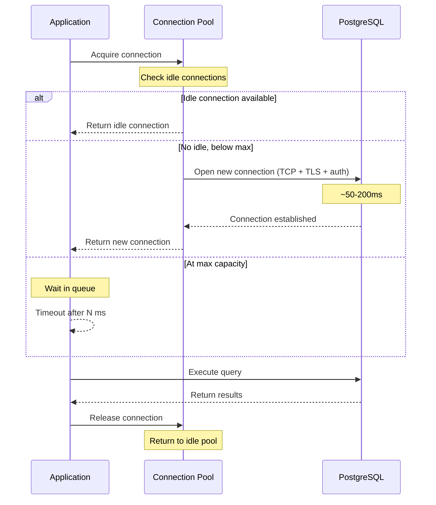
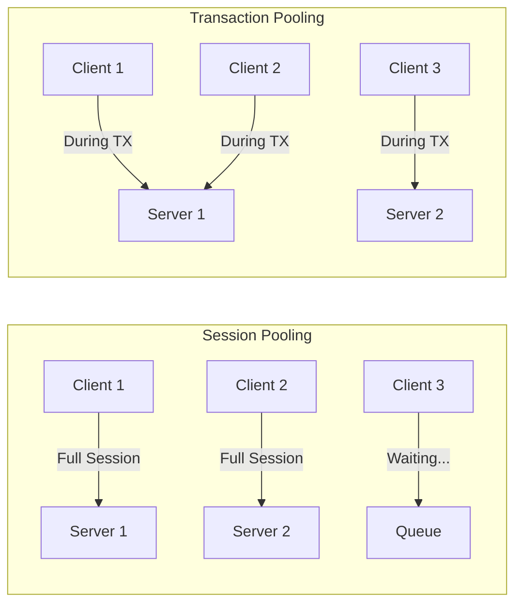
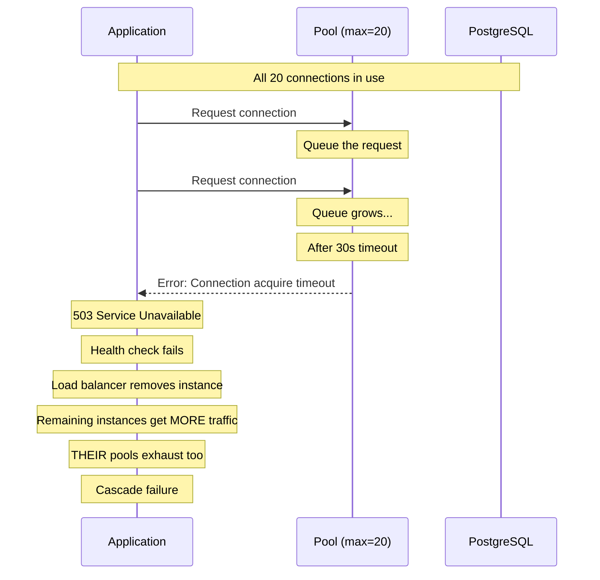

# Connection Pool Tuning

## Why Connection Pool Tuning Matters

Every PostgreSQL connection costs approximately 10MB of memory (shared buffers, per-connection work memory, kernel resources). A server with 64GB RAM can support ~2,000-3,000 connections before memory pressure causes problems. But modern applications with 50 microservices, each running 10 instances with `max_connections = 20`, need 10,000 connections. The math does not work.

Connection pools solve this by multiplexing many application connections onto a smaller number of database connections. A pool of 20 real connections can serve 1,000 application clients if each client holds a connection for only 5ms per query. But misconfigured pools cause connection exhaustion, timeout cascading, and counterintuitive performance degradation.

### The Counterintuitive Truth

More connections do not equal more throughput. PostgreSQL's performance *degrades* beyond a certain connection count because:

1. **Lock contention** on shared data structures increases with connections.
2. **Context switching** overhead grows linearly.
3. **Cache efficiency** drops as each connection has its own work_mem allocation competing for L2/L3 cache.
4. **WAL contention** serializes writes regardless of connection count.

The optimal number of active connections is typically **2-3x the number of CPU cores** for OLTP workloads.

## First Principles

### Little's Law

Little's Law is the fundamental equation for connection pool sizing:

$$
L = \lambda \cdot W
$$

Where:
- $L$ = average number of connections in use (concurrency)
- $\lambda$ = query arrival rate (queries per second)
- $W$ = average time a connection is held (seconds)

**Example**: 1,000 queries/sec with 5ms average hold time:

$$
L = 1{,}000 \times 0.005 = 5 \text{ connections}
$$

Add headroom for variance. For a system with coefficient of variation $C_v$ in service time:

$$
L_{\text{recommended}} = L \times (1 + C_v^2)
$$

If the standard deviation of query time equals the mean ($C_v = 1$):

$$
L_{\text{recommended}} = 5 \times 2 = 10 \text{ connections}
$$

### The Connection Lifecycle



### Connection Cost Breakdown

| Phase | Time | Cost |
|-------|------|------|
| TCP handshake | 0.5-50ms | Network RTT |
| TLS handshake | 5-50ms | Key exchange |
| PostgreSQL auth | 5-20ms | Password verification |
| Process fork | 2-5ms | PostgreSQL forks a new backend |
| Memory allocation | Instant | ~10MB per connection |
| **Total new connection** | **15-125ms** | **Significant** |
| Query execution | 0.1-100ms | Varies |
| **Reused connection** | **0.01-0.1ms** | **Negligible** |

## Core Mechanics

### Pool Configuration Parameters

```typescript
import { Pool, PoolConfig } from 'pg';

const poolConfig: PoolConfig = {
  // Maximum connections in the pool
  // Rule: 2-4x CPU cores for OLTP
  max: 20,

  // Minimum idle connections to maintain
  // Prevents cold start on first burst
  min: 5,

  // Time (ms) to wait for a connection before throwing
  // Should be > p99 query time but < user-facing timeout
  connectionTimeoutMillis: 30_000,

  // Time (ms) a connection can sit idle before being closed
  // Reduces memory when traffic is low
  idleTimeoutMillis: 30_000,

  // Maximum time (ms) a connection can exist
  // Prevents stale connections after PostgreSQL config changes
  maxLifetimeMillis: 3_600_000, // 1 hour

  // Validate connection before handing to client
  allowExitOnIdle: false,

  // Connection string
  connectionString: process.env.DATABASE_URL,

  // SSL configuration
  ssl: process.env.NODE_ENV === 'production' ? {
    rejectUnauthorized: true,
    ca: fs.readFileSync('/path/to/ca.pem'),
  } : false,

  // Statement timeout for individual queries
  statement_timeout: 30_000,

  // Idle in transaction timeout
  idle_in_transaction_session_timeout: 60_000,
};

const pool = new Pool(poolConfig);

// Monitor pool events
pool.on('connect', (client) => {
  metrics.gauge('db.pool.total', pool.totalCount);
});

pool.on('acquire', (client) => {
  metrics.gauge('db.pool.idle', pool.idleCount);
  metrics.gauge('db.pool.waiting', pool.waitingCount);
});

pool.on('error', (err) => {
  metrics.increment('db.pool.errors');
  console.error('Pool error:', err);
});
```

### PgBouncer Configuration

PgBouncer is a lightweight connection pooler that sits between applications and PostgreSQL. It supports three pooling modes:

```ini
; pgbouncer.ini

[databases]
mydb = host=localhost port=5432 dbname=mydb

[pgbouncer]
; Listen for client connections
listen_addr = 0.0.0.0
listen_port = 6432

; Pool mode:
; session   - connection assigned for entire client session
; transaction - connection assigned for one transaction
; statement - connection assigned for one statement (most aggressive)
pool_mode = transaction

; Maximum client connections (application-facing)
max_client_conn = 1000

; Default pool size per database/user pair
default_pool_size = 20

; Reserve connections for superuser access
reserve_pool_size = 5
reserve_pool_timeout = 3

; Minimum pool size (pre-warmed)
min_pool_size = 5

; Maximum database connections (PostgreSQL-facing)
; Usually equals sum of all pool sizes
max_db_connections = 50

; Connection lifetime
server_lifetime = 3600
server_idle_timeout = 600

; Query timeout
query_timeout = 30

; Client idle timeout (close idle clients)
client_idle_timeout = 0

; Authentication
auth_type = scram-sha-256
auth_file = /etc/pgbouncer/userlist.txt

; Logging
log_connections = 1
log_disconnections = 1
log_pooler_errors = 1

; Admin console
admin_users = pgbouncer_admin
stats_users = pgbouncer_stats

; DNS configuration (for failover)
dns_max_ttl = 15
```

### Pool Mode Comparison



| Mode | Multiplexing | Compatible With | Typical Ratio |
|------|-------------|----------------|---------------|
| Session | Low | Everything | 1:1 (no benefit) |
| Transaction | High | Most apps | 10:1 to 50:1 |
| Statement | Highest | Simple queries only | 50:1 to 100:1 |

::: warning Transaction Pooling Limitations
Transaction pooling resets connection state between transactions. The following will not work:
- `SET` commands (settings reset)
- Prepared statements (lost between transactions)
- Advisory locks (released when connection returns to pool)
- `LISTEN`/`NOTIFY` (subscription lost)
- Temporary tables (dropped when connection returns)

Use session pooling if your application relies on these features, or scope them within a single transaction.
:::

## Implementation: Adaptive Pool Sizing

```typescript
import { Pool } from 'pg';

interface AdaptivePoolConfig {
  minSize: number;
  maxSize: number;
  targetUtilization: number; // 0.5-0.8
  scaleUpThreshold: number;  // e.g., 0.9 (90% utilized)
  scaleDownThreshold: number; // e.g., 0.3 (30% utilized)
  adjustIntervalMs: number;
}

class AdaptivePool {
  private pool: Pool;
  private currentMax: number;
  private readonly config: AdaptivePoolConfig;
  private timer: ReturnType<typeof setInterval>;

  // Metrics tracking
  private acquireLatencies: number[] = [];
  private utilizationSamples: number[] = [];

  constructor(config: AdaptivePoolConfig, pgConfig: PoolConfig) {
    this.config = config;
    this.currentMax = config.minSize;

    this.pool = new Pool({
      ...pgConfig,
      max: this.currentMax,
    });

    // Track acquire latency
    const originalConnect = this.pool.connect.bind(this.pool);
    this.pool.connect = async () => {
      const start = performance.now();
      const client = await originalConnect();
      const latency = performance.now() - start;
      this.acquireLatencies.push(latency);

      // Keep last 1000 samples
      if (this.acquireLatencies.length > 1000) {
        this.acquireLatencies.shift();
      }

      return client;
    };

    this.timer = setInterval(() => this.adjustPoolSize(), config.adjustIntervalMs);
  }

  private adjustPoolSize(): void {
    const utilization = this.getUtilization();
    this.utilizationSamples.push(utilization);

    if (this.utilizationSamples.length > 60) {
      this.utilizationSamples.shift();
    }

    // Use average utilization over recent window
    const avgUtilization = this.utilizationSamples.reduce((a, b) => a + b, 0) /
      this.utilizationSamples.length;

    if (avgUtilization > this.config.scaleUpThreshold &&
        this.currentMax < this.config.maxSize) {
      const newMax = Math.min(
        this.currentMax + 5,
        this.config.maxSize
      );
      this.resizePool(newMax);
      console.log(`Pool scaled up: ${this.currentMax} -> ${newMax} (util: ${(avgUtilization * 100).toFixed(1)}%)`);
    } else if (avgUtilization < this.config.scaleDownThreshold &&
               this.currentMax > this.config.minSize) {
      const newMax = Math.max(
        this.currentMax - 2,
        this.config.minSize
      );
      this.resizePool(newMax);
      console.log(`Pool scaled down: ${this.currentMax} -> ${newMax} (util: ${(avgUtilization * 100).toFixed(1)}%)`);
    }
  }

  private getUtilization(): number {
    const total = this.pool.totalCount;
    const idle = this.pool.idleCount;
    const waiting = this.pool.waitingCount;

    if (total === 0) return 0;
    const active = total - idle;
    return (active + waiting) / this.currentMax;
  }

  private resizePool(newMax: number): void {
    // pg Pool doesn't support dynamic resize natively
    // We adjust the max property which affects new connection creation
    (this.pool as any).options.max = newMax;
    this.currentMax = newMax;
  }

  get stats() {
    const p50 = this.percentile(this.acquireLatencies, 0.5);
    const p95 = this.percentile(this.acquireLatencies, 0.95);
    const p99 = this.percentile(this.acquireLatencies, 0.99);

    return {
      poolSize: this.currentMax,
      total: this.pool.totalCount,
      idle: this.pool.idleCount,
      waiting: this.pool.waitingCount,
      utilization: this.getUtilization(),
      acquireLatency: { p50, p95, p99 },
    };
  }

  private percentile(sorted: number[], p: number): number {
    if (sorted.length === 0) return 0;
    const arr = [...sorted].sort((a, b) => a - b);
    const idx = Math.ceil(arr.length * p) - 1;
    return arr[Math.max(0, idx)];
  }

  async query(sql: string, params?: unknown[]): Promise<unknown> {
    return this.pool.query(sql, params);
  }

  async close(): Promise<void> {
    clearInterval(this.timer);
    await this.pool.end();
  }
}
```

## Edge Cases and Failure Modes

### 1. Connection Pool Exhaustion Cascade



**Mitigation**:

```typescript
// 1. Circuit breaker on pool exhaustion
class PoolCircuitBreaker {
  private failures = 0;
  private lastFailure = 0;
  private state: 'closed' | 'open' | 'half-open' = 'closed';

  constructor(
    private readonly pool: Pool,
    private readonly threshold: number = 10,
    private readonly resetMs: number = 30_000
  ) {}

  async query(sql: string, params?: unknown[]): Promise<unknown> {
    if (this.state === 'open') {
      if (Date.now() - this.lastFailure > this.resetMs) {
        this.state = 'half-open';
      } else {
        throw new Error('Circuit breaker open — database unavailable');
      }
    }

    try {
      const result = await this.pool.query(sql, params);
      if (this.state === 'half-open') {
        this.state = 'closed';
        this.failures = 0;
      }
      return result;
    } catch (err) {
      if ((err as Error).message.includes('timeout')) {
        this.failures++;
        this.lastFailure = Date.now();
        if (this.failures >= this.threshold) {
          this.state = 'open';
        }
      }
      throw err;
    }
  }
}
```

### 2. Idle-in-Transaction Holding Connections

```typescript
// BAD: Transaction started, connection held during external API call
async function processOrder(orderId: string): Promise<void> {
  const client = await pool.connect();
  try {
    await client.query('BEGIN');
    const order = await client.query('SELECT * FROM orders WHERE id = $1', [orderId]);

    // External API call takes 2-5 seconds — connection held the entire time!
    const paymentResult = await paymentGateway.charge(order.amount);

    await client.query(
      'UPDATE orders SET payment_status = $1 WHERE id = $2',
      [paymentResult.status, orderId]
    );
    await client.query('COMMIT');
  } catch {
    await client.query('ROLLBACK');
  } finally {
    client.release();
  }
}

// FIX: Do external work outside the transaction
async function processOrderFixed(orderId: string): Promise<void> {
  // Step 1: Read data (quick query, release connection immediately)
  const { rows } = await pool.query(
    'SELECT * FROM orders WHERE id = $1', [orderId]
  );
  const order = rows[0];

  // Step 2: External API call (no connection held)
  const paymentResult = await paymentGateway.charge(order.amount);

  // Step 3: Update with new transaction (quick, release fast)
  await pool.query(
    'UPDATE orders SET payment_status = $1 WHERE id = $2',
    [paymentResult.status, orderId]
  );
}
```

### 3. DNS Changes Not Propagated

```typescript
// When PostgreSQL fails over to a new host, the DNS record changes
// But existing connections in the pool still point to the old host

// Fix: Set maxLifetimeMillis to force connection recycling
const pool = new Pool({
  max: 20,
  // Recycle connections every 5 minutes to pick up DNS changes
  maxLifetimeMillis: 300_000,
});

// PgBouncer fix: set DNS TTL
// dns_max_ttl = 15  (check DNS every 15 seconds)
```

### 4. Connection Leak Detection

```typescript
// Detect connections that are acquired but never released
class LeakDetectingPool {
  private acquired = new Map<string, { stack: string; at: number }>();

  constructor(
    private readonly pool: Pool,
    private readonly leakTimeoutMs: number = 60_000
  ) {
    setInterval(() => this.checkLeaks(), 10_000);
  }

  async connect(): Promise<PoolClient> {
    const client = await this.pool.connect();
    const id = Math.random().toString(36).slice(2);
    const stack = new Error().stack || '';

    this.acquired.set(id, { stack, at: Date.now() });

    const originalRelease = client.release.bind(client);
    client.release = (err?: Error | boolean) => {
      this.acquired.delete(id);
      return originalRelease(err);
    };

    return client;
  }

  private checkLeaks(): void {
    const now = Date.now();
    for (const [id, info] of this.acquired) {
      if (now - info.at > this.leakTimeoutMs) {
        console.error(
          `POTENTIAL CONNECTION LEAK: Connection acquired ${Math.floor((now - info.at) / 1000)}s ago\n` +
          `Acquired at:\n${info.stack}`
        );
      }
    }
  }
}
```

## Performance Characteristics

### Pool Size vs Throughput

| Pool Size | Throughput (queries/sec) | P50 Latency | P99 Latency | Notes |
|-----------|--------------------------|-------------|-------------|-------|
| 1 | 200 | 5ms | 8ms | Serialized |
| 5 | 950 | 5ms | 12ms | Optimal for 4-core |
| 10 | 1,800 | 5.5ms | 15ms | Good headroom |
| 20 | 2,000 | 6ms | 25ms | Diminishing returns |
| 50 | 1,800 | 8ms | 80ms | Contention begins |
| 100 | 1,500 | 12ms | 200ms | Degrading |
| 200 | 800 | 25ms | 500ms | Severely degraded |

::: warning
The numbers above are typical for a 4-core PostgreSQL instance. The pattern is consistent: throughput peaks at a pool size of 10-20 and degrades beyond that. More connections cause more contention, not more throughput.
:::

### PgBouncer Overhead

PgBouncer adds minimal latency:

| Metric | Direct to PostgreSQL | Through PgBouncer |
|--------|---------------------|-------------------|
| Connection time | 50-200ms | 1-5ms (pooled) |
| Query overhead | 0ms | 0.05-0.1ms |
| Memory per client | ~10MB | ~2KB |
| Max clients | ~2,000 | ~100,000 |

## Mathematical Foundations

### Queuing Theory: M/M/c Model

A connection pool behaves as an M/M/c queue:

$$
P(\text{wait}) = C(c, \rho) = \frac{\frac{(c\rho)^c}{c!} \cdot \frac{1}{1-\rho}}{\sum_{k=0}^{c-1} \frac{(c\rho)^k}{k!} + \frac{(c\rho)^c}{c!} \cdot \frac{1}{1-\rho}}
$$

Where $c$ is the pool size and $\rho = \lambda / (c \mu)$ is the utilization per server.

The average wait time when the pool is saturated:

$$
W_q = \frac{C(c, \rho)}{c \mu (1 - \rho)}
$$

**Practical implication**: At 80% utilization, wait time is moderate. At 90%, it roughly doubles. At 95%, it quadruples. At 99%, it increases 20x. Never run a pool above 80% sustained utilization.

### Optimal Pool Size Formula

The HikariCP project (Java's most popular pool) recommends:

$$
\text{Pool Size} = T_n \times (C_m - 1) + 1
$$

Where:
- $T_n$ = number of threads accessing the database simultaneously
- $C_m$ = maximum number of simultaneous connections a single thread needs

For a simpler rule of thumb:

$$
\text{Pool Size} = 2 \times \text{CPU cores} + \text{effective spindle count}
$$

For SSD (no spindles, very fast random I/O):

$$
\text{Pool Size} = 2 \times \text{CPU cores} + 1
$$

On a 4-core database server: $2 \times 4 + 1 = 9$ connections.

::: info War Story
**The 500-Connection Pool**

A startup set `max_connections = 500` because "more connections = more throughput." Their 4-core RDS instance was handling 2,000 queries/second with 400 active connections. They noticed p99 latency was 800ms and rising.

After analysis with `pg_stat_activity`, they found 350+ connections were idle, 30 were idle-in-transaction, and only 20 were actively executing queries. They deployed PgBouncer with `default_pool_size = 15` and `max_client_conn = 500`. The 500 application connections now multiplexed through 15 real database connections. P99 latency dropped to 25ms. PostgreSQL CPU dropped from 95% to 35%.

The lesson: your pool should be sized for *active* queries, not *potential* clients. Almost all connections are idle at any given moment.
:::

::: info War Story
**The Transaction That Held a Connection for 30 Seconds**

An API endpoint started a database transaction, called three external APIs in sequence (payment, shipping, notification), and then committed. Each external call took 2-10 seconds. The database connection was held for the entire duration — 6-30 seconds per request.

With a pool of 20 connections and 10 concurrent requests, the pool was exhausted within 2 seconds of a traffic spike. All subsequent requests waited for connections, hit the 5-second timeout, and returned 503 errors.

The fix was restructuring the endpoint: (1) read data from the database and release the connection, (2) make all three external calls in parallel using `Promise.all`, (3) write the results back in a new transaction. Connection hold time dropped from 6-30 seconds to 10-50ms.
:::

## Decision Framework

### Pool Sizing Worksheet

```
Given:
  CPU cores on database server:     ____ (C)
  Peak queries per second:          ____ (QPS)
  Average query duration:           ____ ms (D)
  Coefficient of variation:         ____ (CV)

Calculate:
  Minimum connections (Little's Law): QPS * D/1000 = ____
  With headroom:                      Min * (1 + CV^2) = ____
  Hardware ceiling:                   2 * C + 1 = ____

  Recommended pool size: min(headroom, ceiling) = ____
```

### Configuration Cheat Sheet

| Scenario | Pool Size | PgBouncer Mode | Notes |
|----------|-----------|---------------|-------|
| Small app, 1 server | 10-20 | Not needed | node-pg pool is sufficient |
| Multiple app servers | 5-10 per server | Transaction | Total connections = servers * pool_size |
| Microservices (50+) | 2-5 per service | Transaction | PgBouncer is essential |
| Connection-heavy ORM | 10-20 per server | Session | Some ORMs need session mode |
| Serverless functions | 1 per function | Transaction | Use PgBouncer or Neon/Supabase pooler |

## Advanced Topics

### PgBouncer Monitoring

```sql
-- Connect to PgBouncer admin console
-- psql -p 6432 pgbouncer -U pgbouncer_admin

-- Show pool status
SHOW POOLS;
-- database | user | cl_active | cl_waiting | sv_active | sv_idle | sv_used | sv_login | maxwait

-- Show connection statistics
SHOW STATS;
-- total_query_count | total_query_time | avg_query_time

-- Show active clients
SHOW CLIENTS;

-- Show server connections
SHOW SERVERS;

-- Show configuration
SHOW CONFIG;
```

### Connection Pooling in Serverless

Serverless functions (Lambda, Cloud Functions) have unique pooling challenges:

```typescript
// BAD: New pool created on every cold start
// Each function instance creates its own pool
// 1000 concurrent invocations = 1000 pools = 1000+ connections

export async function handler(event: any) {
  const pool = new Pool({ max: 5 }); // Created on every cold start!
  const result = await pool.query('SELECT ...');
  await pool.end();
  return result;
}

// BETTER: Reuse pool across warm invocations
let pool: Pool | null = null;

function getPool(): Pool {
  if (!pool) {
    pool = new Pool({
      max: 1, // Single connection per function instance
      connectionString: process.env.DATABASE_URL,
    });
  }
  return pool;
}

export async function handler(event: any) {
  const result = await getPool().query('SELECT ...');
  return result;
}

// BEST: Use a managed connection pooler (PgBouncer, Supabase, Neon)
// Each function connects to the pooler, not directly to PostgreSQL
// The pooler manages the real connection count
```

::: tip Key Takeaway
Connection pool sizing follows Little's Law, but the ceiling is set by hardware: `2 * CPU_cores + 1` for the database server. Use PgBouncer in transaction mode for multi-service architectures. Monitor pool utilization and acquire latency — if utilization exceeds 80% or acquire p99 exceeds 100ms, investigate why connections are held too long rather than increasing pool size.
:::

## Cross-References

- [Database Tuning Overview](./index.md) — holistic tuning approach
- [Concurrency Patterns](../optimization/concurrency-patterns.md) — application-level connection pool implementation
- [N+1 Query Detection](./n-plus-one.md) — reducing query count to lower pool pressure
- [Query Optimization](./query-optimization.md) — faster queries = shorter connection hold time
