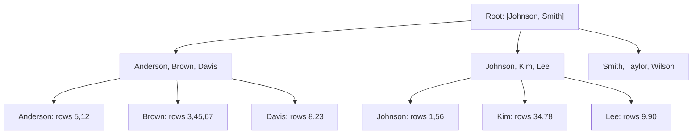
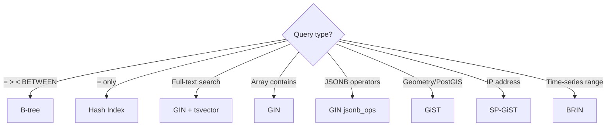

# Index Strategy

## Why Index Strategy Matters

Indexes are the primary tool for query performance. A well-chosen index turns a 3-second sequential scan into a 0.1ms lookup. But indexes are not free — each index adds overhead to every INSERT, UPDATE, and DELETE. A table with 10 indexes requires 10 index updates on every write. An index that is never used wastes disk space and slows writes for zero benefit.

The challenge is finding the minimal set of indexes that covers all critical query patterns while minimizing write overhead.

### The Cost of Indexes

| Impact | Benefit | Cost |
|--------|---------|------|
| Read queries | 100-10,000x faster | - |
| INSERT | - | +5-15% per index |
| UPDATE (indexed col) | - | +10-20% per index |
| DELETE | - | +5-10% per index |
| Disk space | - | 20-50% of table size per index |
| VACUUM | - | Must clean index entries too |
| Cache pressure | - | Index pages compete for shared_buffers |

## First Principles

### B-Tree Structure

PostgreSQL's default index type is a B-tree. Understanding its structure explains why index column order matters.



A B-tree is sorted. Lookups start at the root and navigate down to the leaf level. Key properties:

1. **Equality lookups**: Navigate directly to the matching leaf. $O(\log N)$.
2. **Range scans**: Navigate to the start, then scan leaves sequentially. $O(\log N + K)$.
3. **Prefix matching**: A composite index `(a, b, c)` supports queries on `(a)`, `(a, b)`, and `(a, b, c)`, but NOT `(b)` or `(c)` alone.

### Index Types in PostgreSQL

| Type | Use Case | Supports | Size Relative to B-tree |
|------|----------|----------|------------------------|
| B-tree | Equality, range, sorting | `=, <, >, <=, >=, BETWEEN, IN, LIKE 'prefix%'` | 1x (baseline) |
| Hash | Equality only | `=` only | 0.5-0.8x |
| GIN | Full-text search, arrays, JSONB | `@>, ?, ?&, ?|, @@` | 2-5x |
| GiST | Geometry, range types, nearest-neighbor | `&&, @>, <@, <<, >>` | 1-3x |
| BRIN | Large sorted tables (time-series) | Range predicates | 0.01x |
| SP-GiST | Partitioned search spaces (IP, text) | Prefix matching, inet | 1-2x |

## Core Mechanics

### The Equality-Range-Sort-Filter Rule (ERSF)

When designing a composite index, order columns using this priority:

1. **E**quality columns first — columns compared with `=`
2. **R**ange columns second — columns compared with `<, >, BETWEEN`
3. **S**ort columns third — columns in `ORDER BY`
4. **F**ilter columns last — columns only needed for `WHERE` filtering (after index navigation)

```sql
-- Query pattern:
SELECT * FROM orders
WHERE status = 'completed'         -- Equality
  AND amount > 100                  -- Range
  AND created_at > '2024-01-01'    -- Range
ORDER BY created_at DESC
LIMIT 20;

-- Optimal composite index:
CREATE INDEX idx_orders_opt
ON orders (status, created_at DESC, amount);

-- Reasoning:
-- 1. status = 'completed' (equality) -> navigate to exact B-tree position
-- 2. created_at DESC (matches ORDER BY) -> scan in order, no sort needed
-- 3. amount > 100 is checked during scan (filter)
```

### Why Column Order Matters — Visual

Consider an index on `(country, city)`:

```
Index entries (sorted):
  France    | Lyon
  France    | Paris
  Germany   | Berlin
  Germany   | Munich
  Japan     | Osaka
  Japan     | Tokyo
  USA       | Chicago
  USA       | New York
  USA       | San Francisco
```

- `WHERE country = 'Japan'` → Efficient: navigate to "Japan" block, scan.
- `WHERE country = 'Japan' AND city = 'Tokyo'` → Very efficient: navigate directly.
- `WHERE city = 'Tokyo'` → NOT efficient: "Tokyo" entries are scattered. Must scan entire index.

### Covering Indexes (Index-Only Scans)

A covering index includes all columns needed by the query, allowing PostgreSQL to return results directly from the index without accessing the heap table:

```sql
-- Query only needs these columns:
SELECT customer_id, status, created_at
FROM orders
WHERE status = 'pending'
ORDER BY created_at DESC
LIMIT 50;

-- Covering index with INCLUDE (PostgreSQL 11+):
CREATE INDEX idx_orders_status_covering
ON orders (status, created_at DESC)
INCLUDE (customer_id);

-- Now: Index-Only Scan (no heap access needed)
-- Before: Index Scan + heap fetch for customer_id
```

::: tip
Use `INCLUDE` for columns that are only in the SELECT list, not in WHERE or ORDER BY. Included columns are stored in leaf pages only (not internal nodes), keeping the index smaller.
:::

### Partial Indexes

A partial index covers only a subset of rows. Dramatically smaller for skewed data:

```sql
-- Only 2% of orders are 'pending', but 90% of queries filter for pending
-- Full index: indexes all 10M rows
CREATE INDEX idx_orders_status ON orders (status);
-- Size: ~200MB

-- Partial index: indexes only 200K pending rows
CREATE INDEX idx_orders_pending ON orders (created_at)
WHERE status = 'pending';
-- Size: ~4MB (50x smaller!)

-- Query automatically uses partial index:
EXPLAIN SELECT * FROM orders
WHERE status = 'pending' ORDER BY created_at DESC;
-- -> Index Scan using idx_orders_pending
```

### Expression Indexes

Index computed values for queries that filter or sort by expressions:

```sql
-- Query: case-insensitive email search
SELECT * FROM users WHERE LOWER(email) = 'user@example.com';

-- Without expression index: Seq Scan (LOWER() prevents index use)
-- With expression index:
CREATE INDEX idx_users_email_lower ON users (LOWER(email));
-- -> Index Scan using idx_users_email_lower

-- Date truncation for analytics
CREATE INDEX idx_orders_day ON orders (DATE_TRUNC('day', created_at));

-- JSON field extraction
CREATE INDEX idx_metadata_type ON events ((metadata->>'type'));
```

## Implementation: Index Analysis Toolkit

```typescript
import { Pool } from 'pg';

interface IndexUsage {
  schemaname: string;
  tablename: string;
  indexname: string;
  idx_scan: number;
  idx_tup_read: number;
  idx_tup_fetch: number;
  size_bytes: number;
  size_pretty: string;
}

interface UnusedIndex extends IndexUsage {
  reason: string;
}

class IndexAnalyzer {
  constructor(private readonly pool: Pool) {}

  // Find unused indexes (candidates for removal)
  async findUnusedIndexes(
    minTableRows: number = 10000,
    minAgeDays: number = 14
  ): Promise<UnusedIndex[]> {
    const { rows } = await this.pool.query<UnusedIndex>(`
      SELECT
        s.schemaname,
        s.relname AS tablename,
        s.indexrelname AS indexname,
        s.idx_scan,
        s.idx_tup_read,
        s.idx_tup_fetch,
        pg_relation_size(s.indexrelid) AS size_bytes,
        pg_size_pretty(pg_relation_size(s.indexrelid)) AS size_pretty,
        CASE
          WHEN s.idx_scan = 0 THEN 'Never used since last stats reset'
          WHEN s.idx_scan < 50 THEN 'Rarely used (< 50 scans)'
          ELSE 'Low usage relative to table scans'
        END AS reason
      FROM pg_stat_user_indexes s
      JOIN pg_index i ON s.indexrelid = i.indexrelid
      JOIN pg_stat_user_tables t ON s.relid = t.relid
      WHERE NOT i.indisunique          -- Keep unique indexes
        AND NOT i.indisprimary         -- Keep primary keys
        AND s.idx_scan < 50            -- Low usage
        AND t.n_live_tup > $1          -- Only large tables
        AND s.schemaname = 'public'
      ORDER BY pg_relation_size(s.indexrelid) DESC
    `, [minTableRows]);

    return rows;
  }

  // Find duplicate indexes (same columns in same order)
  async findDuplicateIndexes(): Promise<Array<{
    table: string;
    index1: string;
    index2: string;
    columns: string;
    size1: string;
    size2: string;
  }>> {
    const { rows } = await this.pool.query(`
      WITH index_cols AS (
        SELECT
          n.nspname AS schema,
          t.relname AS table_name,
          i.relname AS index_name,
          array_to_string(
            array_agg(a.attname ORDER BY k.ordinality),
            ', '
          ) AS columns,
          pg_size_pretty(pg_relation_size(i.oid)) AS index_size
        FROM pg_index ix
        JOIN pg_class t ON ix.indrelid = t.oid
        JOIN pg_class i ON ix.indexrelid = i.oid
        JOIN pg_namespace n ON t.relnamespace = n.oid
        CROSS JOIN LATERAL unnest(ix.indkey) WITH ORDINALITY AS k(attnum, ordinality)
        JOIN pg_attribute a ON a.attrelid = t.oid AND a.attnum = k.attnum
        WHERE n.nspname = 'public'
        GROUP BY n.nspname, t.relname, i.relname, i.oid
      )
      SELECT
        a.table_name AS table,
        a.index_name AS index1,
        b.index_name AS index2,
        a.columns,
        a.index_size AS size1,
        b.index_size AS size2
      FROM index_cols a
      JOIN index_cols b
        ON a.table_name = b.table_name
        AND a.columns = b.columns
        AND a.index_name < b.index_name
      ORDER BY a.table_name, a.columns
    `);

    return rows;
  }

  // Find missing indexes based on sequential scans
  async findMissingIndexCandidates(): Promise<Array<{
    table: string;
    seq_scans: number;
    rows_per_scan: number;
    table_size: string;
    suggestion: string;
  }>> {
    const { rows } = await this.pool.query(`
      SELECT
        relname AS table,
        seq_scan AS seq_scans,
        CASE WHEN seq_scan > 0
          THEN seq_tup_read / seq_scan
          ELSE 0
        END AS rows_per_scan,
        pg_size_pretty(pg_total_relation_size(relid)) AS table_size,
        'Check pg_stat_statements for common WHERE clauses on this table' AS suggestion
      FROM pg_stat_user_tables
      WHERE seq_scan > 100
        AND n_live_tup > 10000
        AND seq_scan > idx_scan  -- More seq scans than index scans
      ORDER BY seq_scan * n_live_tup DESC
      LIMIT 20
    `);

    return rows;
  }

  // Get index sizes and usage for a specific table
  async getTableIndexes(tableName: string): Promise<Array<{
    indexname: string;
    columns: string;
    is_unique: boolean;
    is_primary: boolean;
    idx_scan: number;
    size: string;
    definition: string;
  }>> {
    const { rows } = await this.pool.query(`
      SELECT
        i.relname AS indexname,
        array_to_string(
          array_agg(a.attname ORDER BY k.ordinality),
          ', '
        ) AS columns,
        ix.indisunique AS is_unique,
        ix.indisprimary AS is_primary,
        COALESCE(s.idx_scan, 0) AS idx_scan,
        pg_size_pretty(pg_relation_size(i.oid)) AS size,
        pg_get_indexdef(ix.indexrelid) AS definition
      FROM pg_index ix
      JOIN pg_class t ON ix.indrelid = t.oid
      JOIN pg_class i ON ix.indexrelid = i.oid
      LEFT JOIN pg_stat_user_indexes s ON s.indexrelid = ix.indexrelid
      CROSS JOIN LATERAL unnest(ix.indkey) WITH ORDINALITY AS k(attnum, ordinality)
      JOIN pg_attribute a ON a.attrelid = t.oid AND a.attnum = k.attnum
      WHERE t.relname = $1
      GROUP BY i.relname, ix.indisunique, ix.indisprimary, s.idx_scan, i.oid, ix.indexrelid
      ORDER BY ix.indisprimary DESC, s.idx_scan DESC
    `, [tableName]);

    return rows;
  }
}
```

## Edge Cases and Failure Modes

### 1. Index Bloat

Indexes accumulate dead entries from UPDATEs and DELETEs. Unlike tables, indexes cannot be partially vacuumed — VACUUM only marks entries for reuse but does not reclaim space.

```sql
-- Check index bloat
SELECT
  schemaname,
  tablename,
  indexname,
  pg_size_pretty(pg_relation_size(indexrelid)) AS index_size,
  idx_scan
FROM pg_stat_user_indexes
WHERE pg_relation_size(indexrelid) > 100 * 1024 * 1024 -- > 100MB
ORDER BY pg_relation_size(indexrelid) DESC;

-- Fix: REINDEX (locks the table)
REINDEX INDEX CONCURRENTLY idx_orders_customer_id;

-- Or use pg_repack for online reindexing
-- pg_repack --table orders --only-indexes
```

### 2. HOT Updates Blocked by Indexes

PostgreSQL's Heap-Only Tuple (HOT) optimization allows updates that don't modify indexed columns to avoid updating indexes. But every index on a column blocks HOT for updates to that column:

```sql
-- Table has indexes on: (id), (email), (status), (created_at), (name)
-- UPDATE users SET name = 'New Name' WHERE id = 1;
-- This update MUST update the (name) index, so HOT cannot be used

-- If name is rarely queried, removing the index on name
-- allows HOT updates for name changes -> faster UPDATEs
```

::: warning
Before adding an index, consider the write penalty. For write-heavy tables, every index significantly impacts insert/update throughput. Profile with `pg_stat_user_tables.n_tup_hot_upd` to see how many HOT updates you're getting.
:::

### 3. Index-Only Scan Defeated by Stale Visibility Map

```sql
-- Index-only scans need the visibility map to be current
-- Visibility map is updated by VACUUM
-- If VACUUM hasn't run recently, the index-only scan
-- falls back to regular index scan (heap access per row)

-- Check visibility map coverage
SELECT
  relname,
  n_live_tup,
  n_dead_tup,
  last_vacuum,
  last_autovacuum
FROM pg_stat_user_tables
WHERE relname = 'orders';

-- Force VACUUM to update visibility map
VACUUM orders;
```

### 4. Over-Indexing

```sql
-- Table with 15 indexes
-- Every INSERT updates all 15 indexes
-- Benchmark:
--   0 indexes:  50,000 inserts/sec
--   5 indexes:  20,000 inserts/sec
--   10 indexes: 10,000 inserts/sec
--   15 indexes:  5,000 inserts/sec

-- Solution: Remove unused indexes
-- Use the IndexAnalyzer.findUnusedIndexes() function above
```

## Performance Characteristics

### Index Size Estimation

For a B-tree index on a column with $N$ rows:

$$
S_{\text{index}} \approx N \times (S_{\text{key}} + S_{\text{pointer}} + S_{\text{overhead}}) \times F
$$

Where:
- $S_{\text{key}}$ = key size (4 bytes for int, 8 for bigint, variable for text)
- $S_{\text{pointer}}$ = 6 bytes (TID pointer to heap)
- $S_{\text{overhead}}$ = 4 bytes per entry (alignment, nullability)
- $F$ = fill factor overhead ($\approx 1.3$ accounting for page overhead and non-leaf nodes)

For 10M rows with a bigint key:

$$
S \approx 10{,}000{,}000 \times (8 + 6 + 4) \times 1.3 = 234\text{MB}
$$

### Index Scan Overhead

Each index lookup incurs:
1. **Index traversal**: $d$ page reads where $d = \lceil \log_B(N) \rceil$ (typically 3-4)
2. **Heap fetch**: 1 page read per matching row (for non-covering indexes)
3. **Visibility check**: Possible heap fetch if visibility map is stale

Total pages read for a point query: $d + 1 \approx 4\text{-}5$ pages = 32-40KB

### Composite Index vs Multiple Single-Column Indexes

```sql
-- Composite: single B-tree navigated once
CREATE INDEX idx_composite ON orders (customer_id, status);
-- For: WHERE customer_id = 1 AND status = 'active'
-- Pages read: 4-5

-- Two single indexes: bitmap AND
CREATE INDEX idx_customer ON orders (customer_id);
CREATE INDEX idx_status ON orders (status);
-- For: WHERE customer_id = 1 AND status = 'active'
-- Pages read: 8-10 + bitmap construction overhead

-- Composite is always faster for multi-column WHERE clauses
-- But two singles provide more flexibility for queries on individual columns
```

## Mathematical Foundations

### B-Tree Complexity

| Operation | Time | Disk I/O |
|-----------|------|----------|
| Point lookup | $O(\log_B N)$ | 3-4 pages |
| Range scan (K results) | $O(\log_B N + K/B)$ | 3-4 + K/400 pages |
| Insert | $O(\log_B N)$ | 3-4 pages + possible split |
| Delete | $O(\log_B N)$ | 3-4 pages |

### Selectivity Threshold for Index Use

The planner uses an index when the estimated selectivity makes it cheaper than a sequential scan:

$$
\text{Use index when: } S \times N \times C_{\text{random}} < N_{\text{pages}} \times C_{\text{seq}}
$$

Solving for selectivity $S$:

$$
S < \frac{N_{\text{pages}} \times C_{\text{seq}}}{N \times C_{\text{random}}}
$$

For a 1GB table (131,072 pages) with 10M rows and default costs:

$$
S < \frac{131{,}072 \times 1.0}{10{,}000{,}000 \times 4.0} = 0.0033 = 0.33\%
$$

On SSD ($C_{\text{random}} = 1.1$):

$$
S < \frac{131{,}072 \times 1.0}{10{,}000{,}000 \times 1.1} = 0.012 = 1.2\%
$$

With a bitmap scan (semi-sequential reads), the threshold is much higher (~30%).

::: info War Story
**The 50 Index Table**

A SaaS application accumulated indexes over 5 years as different developers added them for their specific queries. The `events` table had 50 indexes. INSERT throughput had degraded from 10,000/s to 800/s. The team ran the unused index detection query and found that 35 of the 50 indexes had zero scans in the past month.

Dropping the 35 unused indexes increased INSERT throughput to 6,000/s (7.5x improvement) and freed 120GB of disk space. The remaining 15 indexes covered all active query patterns.
:::

::: info War Story
**The Composite Index That Wasn't Composite Enough**

A query filtered by `tenant_id = X AND status = 'active' AND created_at > '2024-01-01' ORDER BY created_at DESC LIMIT 20`. The team had an index on `(tenant_id, status)`. The query used this index to find rows for the tenant with active status, but then needed a sort operation for `created_at` ordering — sorting 500,000 matching rows to return 20.

Adding `created_at` to the index: `(tenant_id, status, created_at DESC)` eliminated the sort. The query went from 2 seconds to 0.5ms because it could navigate the index to the exact starting point and read 20 entries sequentially.
:::

## Decision Framework

### Index Design Checklist

| Question | Action |
|----------|--------|
| What are the top 10 queries by total time? | Index for these first |
| Are there sequential scans on tables > 10K rows? | Add indexes |
| Are there unused indexes? | Remove them |
| Do queries use ORDER BY? | Include sort columns in index |
| Is the selectivity > 30%? | Index may not help (consider BRIN) |
| Is the table write-heavy? | Minimize indexes |
| Do queries use LIKE? | Use GIN trigram index |
| Do queries use JSONB operators? | Use GIN index |
| Is the table time-series? | Consider BRIN |

### Index Type Selection



## Advanced Topics

### BRIN Indexes for Time-Series Data

Block Range Index (BRIN) stores min/max values for ranges of physical blocks. Extremely small for naturally ordered data:

```sql
-- BRIN for time-series: 1000x smaller than B-tree
CREATE INDEX idx_events_ts_brin ON events
USING BRIN (created_at) WITH (pages_per_range = 128);

-- B-tree on 100M rows: ~2GB
-- BRIN on 100M rows: ~2MB

-- Effective when:
-- 1. Data is physically ordered (inserted in timestamp order)
-- 2. Queries use range predicates (WHERE created_at > X)
-- 3. Table is very large (> 1M rows)

-- Check physical correlation:
SELECT correlation FROM pg_stats
WHERE tablename = 'events' AND attname = 'created_at';
-- correlation > 0.9 means BRIN is effective
```

### GIN Indexes for Full-Text and JSONB

```sql
-- Full-text search
ALTER TABLE articles ADD COLUMN search_vector tsvector
  GENERATED ALWAYS AS (
    setweight(to_tsvector('english', title), 'A') ||
    setweight(to_tsvector('english', body), 'B')
  ) STORED;

CREATE INDEX idx_articles_search ON articles USING GIN (search_vector);

-- JSONB containment queries
CREATE INDEX idx_events_meta ON events USING GIN (metadata jsonb_path_ops);

-- Array overlap/containment
CREATE INDEX idx_posts_tags ON posts USING GIN (tags);
SELECT * FROM posts WHERE tags @> ARRAY['typescript', 'node'];

-- Trigram for LIKE/ILIKE queries
CREATE EXTENSION IF NOT EXISTS pg_trgm;
CREATE INDEX idx_users_name_trgm ON users USING GIN (name gin_trgm_ops);
SELECT * FROM users WHERE name ILIKE '%john%'; -- Uses GIN index!
```

### Automated Index Recommendations

```typescript
// Analyze pg_stat_statements to recommend indexes
async function recommendIndexes(pool: Pool): Promise<Array<{
  table: string;
  columns: string[];
  reason: string;
  estimatedImpact: string;
}>> {
  // Find queries doing sequential scans on large tables
  const { rows: slowQueries } = await pool.query(`
    SELECT
      query,
      calls,
      total_exec_time / 1000 AS total_seconds,
      mean_exec_time AS avg_ms,
      rows
    FROM pg_stat_statements
    WHERE query LIKE '%WHERE%'
      AND mean_exec_time > 100 -- > 100ms average
    ORDER BY total_exec_time DESC
    LIMIT 50
  `);

  const recommendations = [];

  for (const sq of slowQueries) {
    // Parse WHERE clause columns (simplified — production would use a SQL parser)
    const whereMatch = sq.query.match(/WHERE\s+(.+?)(?:ORDER|LIMIT|GROUP|$)/is);
    if (!whereMatch) continue;

    const tableMatch = sq.query.match(/FROM\s+(\w+)/i);
    if (!tableMatch) continue;

    const table = tableMatch[1];
    const whereClause = whereMatch[1];

    // Extract column names from predicates
    const columns = [...whereClause.matchAll(/(\w+)\s*[=<>]/g)]
      .map(m => m[1])
      .filter(c => !['AND', 'OR', 'NOT', 'NULL'].includes(c.toUpperCase()));

    if (columns.length > 0) {
      recommendations.push({
        table,
        columns: [...new Set(columns)],
        reason: `Query called ${sq.calls} times, avg ${Math.round(sq.avg_ms)}ms`,
        estimatedImpact: `${Math.round(sq.total_seconds)}s total DB time saved`,
      });
    }
  }

  return recommendations;
}
```

::: tip Key Takeaway
The ideal index set is the smallest set that makes all critical queries fast. Use the ERSF rule (Equality, Range, Sort, Filter) for composite index column order. Regularly audit for unused indexes and remove them. For write-heavy tables, every index is a tax on write performance — only add indexes that are justified by read patterns.
:::

## Cross-References

- [Query Optimization](./query-optimization.md) — using EXPLAIN ANALYZE to validate index effectiveness
- [VACUUM and ANALYZE](./vacuum-analyze.md) — maintaining index health
- [Database Tuning Overview](./index.md) — holistic tuning approach
- [N+1 Query Detection](./n-plus-one.md) — indexes needed for DataLoader batch queries
