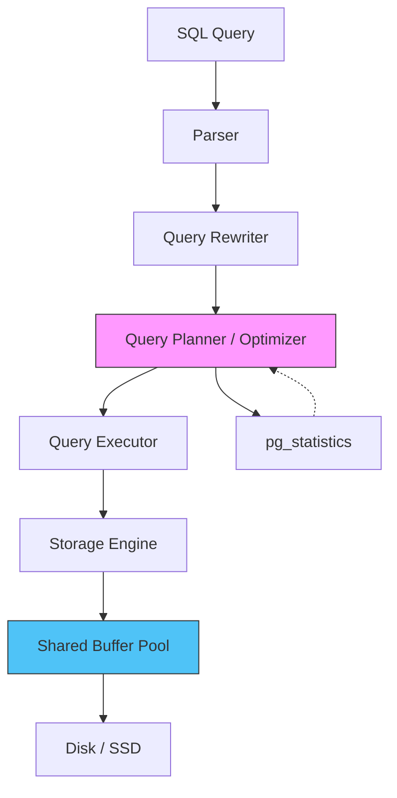
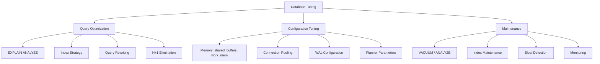

# Database Tuning Overview

## Why Database Tuning Matters

The database is the bottleneck of most web applications. A poorly tuned database turns a fast application into a slow one, regardless of how optimized the application code is. A single unindexed query can consume 1,000x more resources than necessary. A misconfigured connection pool can cause cascading failures under load. An unvacuumed table can slow queries by orders of magnitude.

Database tuning is not optional for production systems. It is the difference between a system that handles 100 queries/second and one that handles 10,000 queries/second on the same hardware.

### The Cost of Ignorance

Real numbers from production PostgreSQL databases:

| Problem | Before Tuning | After Tuning | Improvement |
|---------|--------------|-------------|-------------|
| Missing index | 2.3s per query | 0.8ms per query | 2,875x |
| N+1 queries | 150 queries/request | 2 queries/request | 75x reduction |
| Connection pool too small | 200ms p99 acquire | 2ms p99 acquire | 100x |
| No vacuum | 50ms simple scan | 5ms simple scan | 10x |
| Inefficient query | 30s analytics report | 200ms with materialized view | 150x |

### Historical Context

PostgreSQL has been in development since 1986 (as POSTGRES at UC Berkeley). Its query planner is one of the most sophisticated in any open-source database, evolved over 40 years. Understanding how the planner works — what statistics it uses, how it estimates costs, and when it gets things wrong — is essential for effective tuning.

## First Principles

### How PostgreSQL Executes a Query



1. **Parser**: Converts SQL text into a parse tree. Validates syntax.
2. **Rewriter**: Applies rules (views, row-level security).
3. **Planner**: Generates execution plans and picks the cheapest. Uses table statistics.
4. **Executor**: Runs the chosen plan, fetching data from storage.
5. **Storage**: Manages pages (8KB blocks) in the buffer pool and on disk.

### The Cost Model

PostgreSQL's planner estimates the cost of each plan using a simple model:

$$
\text{Total Cost} = \text{seq\_page\_cost} \times P_{\text{seq}} + \text{random\_page\_cost} \times P_{\text{rand}} + \text{cpu\_tuple\_cost} \times N_{\text{tuples}} + \text{cpu\_operator\_cost} \times N_{\text{ops}}
$$

Default values:
- `seq_page_cost = 1.0`
- `random_page_cost = 4.0` (random I/O is 4x more expensive on spinning disks; set to 1.1 for SSD)
- `cpu_tuple_cost = 0.01`
- `cpu_operator_cost = 0.0025`

The planner picks the plan with the lowest estimated total cost. When the estimates are wrong (due to stale statistics, correlated columns, or bad cardinality estimates), the planner picks the wrong plan.

### The Three Axes of Tuning



## Core Configuration Parameters

### Memory Settings

```sql
-- shared_buffers: The database's page cache
-- Rule: 25% of total RAM, up to 8GB for most workloads
ALTER SYSTEM SET shared_buffers = '4GB';

-- work_mem: Memory per sort/hash operation (per query, per operation!)
-- 100 concurrent queries with 2 sort operations each = 200 * work_mem
-- Rule: total_ram / (max_connections * 2-4 * expected_operations)
ALTER SYSTEM SET work_mem = '64MB';

-- maintenance_work_mem: Memory for VACUUM, CREATE INDEX, etc.
-- Can be much larger since these run infrequently
ALTER SYSTEM SET maintenance_work_mem = '1GB';

-- effective_cache_size: Hint to planner about total cache available
-- Including OS page cache. Rule: 75% of total RAM
ALTER SYSTEM SET effective_cache_size = '12GB';
```

### Connection Settings

```sql
-- max_connections: Total allowed connections
-- Lower is better! Each connection uses ~10MB of memory
-- Use connection pooling (PgBouncer) for many clients
ALTER SYSTEM SET max_connections = '100';

-- For applications using PgBouncer:
-- PgBouncer max_client_conn = 1000 (many app connections)
-- PostgreSQL max_connections = 50 (few real connections)
```

### Write-Ahead Log (WAL)

```sql
-- wal_buffers: Shared memory for WAL records
ALTER SYSTEM SET wal_buffers = '64MB';

-- checkpoint_completion_target: Spread checkpoint over this fraction
ALTER SYSTEM SET checkpoint_completion_target = '0.9';

-- max_wal_size: WAL retained before forced checkpoint
ALTER SYSTEM SET max_wal_size = '4GB';
```

### Planner Configuration for SSDs

```sql
-- For SSD storage, random reads are nearly as fast as sequential
ALTER SYSTEM SET random_page_cost = '1.1';
ALTER SYSTEM SET effective_io_concurrency = '200';
```

## Monitoring Essentials

### Key Metrics to Track

```sql
-- 1. Cache hit ratio (should be > 99%)
SELECT
  sum(heap_blks_hit) AS hits,
  sum(heap_blks_read) AS disk_reads,
  round(
    sum(heap_blks_hit)::numeric /
    NULLIF(sum(heap_blks_hit) + sum(heap_blks_read), 0) * 100,
    2
  ) AS hit_ratio
FROM pg_statio_user_tables;

-- 2. Index usage (should be > 95% for OLTP)
SELECT
  relname,
  seq_scan,
  idx_scan,
  CASE WHEN seq_scan + idx_scan > 0
    THEN round(idx_scan::numeric / (seq_scan + idx_scan) * 100, 2)
    ELSE 0
  END AS idx_scan_pct
FROM pg_stat_user_tables
ORDER BY seq_scan DESC
LIMIT 20;

-- 3. Slow queries (pg_stat_statements extension)
SELECT
  queryid,
  LEFT(query, 80) AS query_preview,
  calls,
  round(total_exec_time::numeric / 1000, 2) AS total_seconds,
  round(mean_exec_time::numeric, 2) AS avg_ms,
  round(max_exec_time::numeric, 2) AS max_ms,
  rows
FROM pg_stat_statements
ORDER BY total_exec_time DESC
LIMIT 20;

-- 4. Table bloat estimation
SELECT
  schemaname,
  tablename,
  pg_size_pretty(pg_total_relation_size(schemaname || '.' || tablename)) AS total_size,
  n_dead_tup,
  n_live_tup,
  CASE WHEN n_live_tup > 0
    THEN round(n_dead_tup::numeric / n_live_tup * 100, 2)
    ELSE 0
  END AS dead_pct,
  last_vacuum,
  last_autovacuum,
  last_analyze,
  last_autoanalyze
FROM pg_stat_user_tables
ORDER BY n_dead_tup DESC
LIMIT 20;

-- 5. Connection usage
SELECT
  count(*) AS total,
  count(*) FILTER (WHERE state = 'active') AS active,
  count(*) FILTER (WHERE state = 'idle') AS idle,
  count(*) FILTER (WHERE state = 'idle in transaction') AS idle_in_txn,
  count(*) FILTER (WHERE wait_event_type IS NOT NULL) AS waiting,
  max_conn.setting::int AS max_connections
FROM pg_stat_activity
CROSS JOIN pg_settings max_conn
WHERE max_conn.name = 'max_connections'
GROUP BY max_conn.setting;
```

### Performance Monitoring Dashboard Query

```typescript
import { Pool } from 'pg';

interface DatabaseHealth {
  cacheHitRatio: number;
  activeConnections: number;
  idleInTransaction: number;
  longRunningQueries: number;
  deadTuples: number;
  tablesBloated: number;
  indexHitRatio: number;
  replicationLagBytes: number;
}

async function getDatabaseHealth(pool: Pool): Promise<DatabaseHealth> {
  const [
    cacheResult,
    connResult,
    longQueryResult,
    bloatResult,
    indexResult,
  ] = await Promise.all([
    pool.query(`
      SELECT round(
        sum(heap_blks_hit)::numeric /
        NULLIF(sum(heap_blks_hit) + sum(heap_blks_read), 0) * 100, 2
      ) AS ratio
      FROM pg_statio_user_tables
    `),
    pool.query(`
      SELECT
        count(*) FILTER (WHERE state = 'active') AS active,
        count(*) FILTER (WHERE state = 'idle in transaction') AS idle_in_txn
      FROM pg_stat_activity
    `),
    pool.query(`
      SELECT count(*) AS cnt
      FROM pg_stat_activity
      WHERE state = 'active'
        AND now() - query_start > interval '30 seconds'
        AND query NOT LIKE 'autovacuum%'
    `),
    pool.query(`
      SELECT
        sum(n_dead_tup) AS total_dead,
        count(*) FILTER (
          WHERE n_live_tup > 0
          AND n_dead_tup::float / n_live_tup > 0.1
        ) AS bloated_tables
      FROM pg_stat_user_tables
    `),
    pool.query(`
      SELECT round(
        sum(idx_blks_hit)::numeric /
        NULLIF(sum(idx_blks_hit) + sum(idx_blks_read), 0) * 100, 2
      ) AS ratio
      FROM pg_statio_user_indexes
    `),
  ]);

  return {
    cacheHitRatio: parseFloat(cacheResult.rows[0]?.ratio ?? '0'),
    activeConnections: parseInt(connResult.rows[0]?.active ?? '0'),
    idleInTransaction: parseInt(connResult.rows[0]?.idle_in_txn ?? '0'),
    longRunningQueries: parseInt(longQueryResult.rows[0]?.cnt ?? '0'),
    deadTuples: parseInt(bloatResult.rows[0]?.total_dead ?? '0'),
    tablesBloated: parseInt(bloatResult.rows[0]?.bloated_tables ?? '0'),
    indexHitRatio: parseFloat(indexResult.rows[0]?.ratio ?? '0'),
    replicationLagBytes: 0, // Query pg_stat_replication for replicas
  };
}
```

## Edge Cases and Failure Modes

### 1. work_mem Causing OOM

```sql
-- work_mem = 256MB with max_connections = 200
-- Worst case: 200 connections * 4 sort operations * 256MB = 204GB
-- Server only has 64GB RAM -> OOM kill

-- FIX: Set work_mem conservatively, increase per-query when needed
SET work_mem = '32MB'; -- Global default

-- For specific analytical queries:
BEGIN;
SET LOCAL work_mem = '512MB';
SELECT ... complex analytics query ...;
COMMIT;
```

### 2. Planner Choosing Wrong Plan

```sql
-- The planner thinks a sequential scan is cheaper than an index scan
-- because statistics are stale or cardinality estimates are wrong

-- Check the planner's estimates vs reality:
EXPLAIN (ANALYZE, BUFFERS) SELECT * FROM users WHERE status = 'active';

-- If estimated rows differs wildly from actual rows:
-- 1. Run ANALYZE to update statistics
ANALYZE users;

-- 2. Increase statistics target for skewed columns
ALTER TABLE users ALTER COLUMN status SET STATISTICS 1000;
ANALYZE users;

-- 3. If still wrong, check for correlated columns
-- PostgreSQL assumes column independence, which can be very wrong
```

### 3. Idle-in-Transaction Connections

```sql
-- Connections that started a transaction but never committed/rolled back
-- These hold locks and prevent VACUUM from cleaning dead tuples

-- Find them:
SELECT
  pid,
  now() - xact_start AS transaction_age,
  state,
  LEFT(query, 100) AS last_query,
  client_addr
FROM pg_stat_activity
WHERE state = 'idle in transaction'
  AND now() - xact_start > interval '5 minutes'
ORDER BY xact_start;

-- Terminate them:
SELECT pg_terminate_backend(pid)
FROM pg_stat_activity
WHERE state = 'idle in transaction'
  AND now() - xact_start > interval '30 minutes';
```

::: danger
Set `idle_in_transaction_session_timeout` to automatically kill long idle-in-transaction sessions:
```sql
ALTER SYSTEM SET idle_in_transaction_session_timeout = '300000'; -- 5 minutes
```
:::

## Performance Characteristics

### PostgreSQL Memory Hierarchy

| Component | Default | Recommended (16GB RAM) | Purpose |
|-----------|---------|----------------------|---------|
| `shared_buffers` | 128MB | 4GB | Page cache |
| `effective_cache_size` | 4GB | 12GB | Planner hint |
| `work_mem` | 4MB | 32-64MB | Sort/hash per operation |
| `maintenance_work_mem` | 64MB | 1GB | VACUUM, CREATE INDEX |
| `wal_buffers` | -1 (auto) | 64MB | WAL write buffer |
| `temp_buffers` | 8MB | 32MB | Temporary table pages |

### Throughput Expectations

| Hardware | Queries/sec (OLTP) | Queries/sec (Analytics) | Storage |
|----------|-------------------|------------------------|---------|
| Single SSD, 4 cores | 5,000-20,000 | 10-50 | 1TB |
| NVMe RAID, 16 cores | 50,000-200,000 | 50-500 | 10TB |
| Cloud (r6g.xlarge) | 10,000-40,000 | 20-100 | EBS gp3 |
| Cloud (r6g.8xlarge) | 100,000-300,000 | 200-1,000 | EBS io2 |

::: info War Story
**The Configuration That Never Changed**

A startup launched with the default PostgreSQL configuration on a 64GB RAM server. `shared_buffers` was 128MB — 0.2% of available RAM. The cache hit ratio was 72%. After changing `shared_buffers` to 16GB, `effective_cache_size` to 48GB, and `random_page_cost` to 1.1 (SSD), the cache hit ratio jumped to 99.4% and average query time dropped from 45ms to 3ms. No code changes required.

The team had spent months optimizing application code and adding Redis caches, never checking the database configuration. The lesson: always check the basics first.
:::

::: info War Story
**The Connection Pool That Wasn't**

A Django application used 50 application servers, each configured with `CONN_MAX_AGE = 0` (no persistent connections). Each request opened a new PostgreSQL connection. At 1,000 requests/second, PostgreSQL was spending more time accepting and closing connections than executing queries. The CPU was pegged at 100% with 80% in system calls.

After adding PgBouncer in transaction pooling mode with `pool_size = 20`, actual database connections dropped from 1,000+ to 20. CPU dropped to 30%, and query throughput doubled. The application servers were reconfigured with `CONN_MAX_AGE = 600` to reuse connections through PgBouncer.
:::

## Mathematical Foundations

### Little's Law for Database Connections

$$
L = \lambda \cdot W
$$

Where:
- $L$ = average number of busy connections (concurrency)
- $\lambda$ = query arrival rate (queries/second)
- $W$ = average query duration (seconds)

For 1,000 queries/second with 5ms average duration:

$$
L = 1000 \times 0.005 = 5 \text{ connections}
$$

Add headroom for variance (2-3x):

$$
L_{\text{recommended}} = 5 \times 2.5 = 12.5 \approx 15 \text{ connections}
$$

This is far fewer than the typical `max_connections = 100` default.

### Disk I/O Model

The number of disk reads for a query depends on the buffer pool hit ratio:

$$
\text{Disk Reads} = \text{Pages Accessed} \times (1 - h)
$$

Where $h$ is the buffer pool hit ratio. For a query scanning 10,000 pages:
- At 99% hit ratio: 100 disk reads
- At 95% hit ratio: 500 disk reads
- At 80% hit ratio: 2,000 disk reads

Each random disk read on SSD takes ~0.1ms. On HDD, ~10ms.

## Decision Framework

### Tuning Priority Order

1. **Enable `pg_stat_statements`** — you cannot tune what you cannot measure.
2. **Check cache hit ratio** — if below 99%, increase `shared_buffers`.
3. **Identify slow queries** — use `pg_stat_statements` to find the top 10 by total time.
4. **Add missing indexes** — check for sequential scans on large tables.
5. **Fix N+1 queries** — look for high-call-count simple queries.
6. **Tune connection pooling** — add PgBouncer if max_connections > 50.
7. **Configure autovacuum** — ensure dead tuple ratio stays low.
8. **Consider materialized views** — for expensive analytics queries.

### When to Scale Vertically vs Horizontally

| Signal | Scale Vertically | Scale Horizontally |
|--------|-----------------|-------------------|
| CPU pegged at 100% | More cores | Read replicas |
| Memory pressure | More RAM | Read replicas |
| Disk I/O saturated | NVMe/RAID | Sharding |
| Connection limits | PgBouncer | Application-level routing |
| Write throughput limit | Better storage | Sharding (last resort) |
| Data size > 1TB | Compression, partitioning | Sharding |

## Advanced Topics

### PostgreSQL Extension Stack

Essential extensions for production tuning:

```sql
-- pg_stat_statements: Query-level performance statistics
CREATE EXTENSION IF NOT EXISTS pg_stat_statements;

-- pg_stat_kcache: I/O and CPU per query
CREATE EXTENSION IF NOT EXISTS pg_stat_kcache;

-- auto_explain: Automatically log slow query plans
LOAD 'auto_explain';
SET auto_explain.log_min_duration = '1000'; -- Log plans for queries > 1s

-- pg_trgm: Trigram similarity for LIKE/ILIKE optimization
CREATE EXTENSION IF NOT EXISTS pg_trgm;

-- pg_hint_plan: Override planner decisions (use sparingly!)
CREATE EXTENSION IF NOT EXISTS pg_hint_plan;

-- pgstattuple: Detailed table/index bloat statistics
CREATE EXTENSION IF NOT EXISTS pgstattuple;
```

### Query Plan Caching and Prepared Statements

PostgreSQL caches query plans for prepared statements. After 5 executions, it evaluates whether a generic plan is cheaper than a custom plan:

```typescript
// node-postgres with prepared statements
const result = await pool.query({
  name: 'get-user-by-id',  // Named = prepared statement
  text: 'SELECT * FROM users WHERE id = $1',
  values: [userId],
});

// The plan for 'get-user-by-id' is cached after first execution
// Subsequent calls skip the planning phase (~0.5ms saved per query)
```

::: tip Key Takeaway
Database tuning starts with measurement. Enable `pg_stat_statements`, check your cache hit ratio, and identify the top slow queries. Most performance problems are solved by a combination of proper indexes, appropriate memory settings, and connection pooling. Only after these basics are covered should you consider more advanced techniques like materialized views, partitioning, or read replicas.
:::

## Section Contents

- [Query Optimization](./query-optimization.md) — EXPLAIN ANALYZE deep dive
- [Index Strategy](./index-strategy.md) — choosing the right indexes
- [Connection Pool Tuning](./connection-pool-tuning.md) — Little's Law and PgBouncer
- [N+1 Query Detection](./n-plus-one.md) — DataLoader pattern
- [VACUUM and ANALYZE](./vacuum-analyze.md) — maintenance and bloat control

## Cross-References

- [Database-Level Caching](../caching-strategies/database-level.md) — materialized views and denormalization
- [Application-Level Caching](../caching-strategies/application-level.md) — reducing database load
- [Concurrency Patterns](../optimization/concurrency-patterns.md) — connection pool patterns
