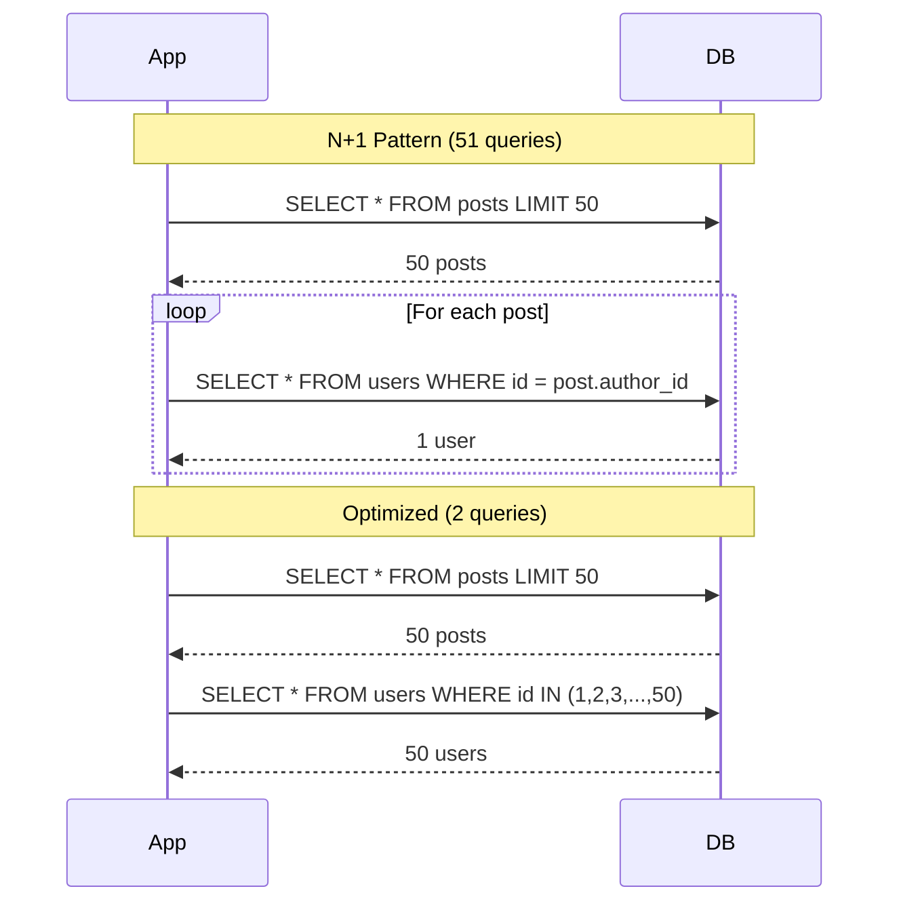
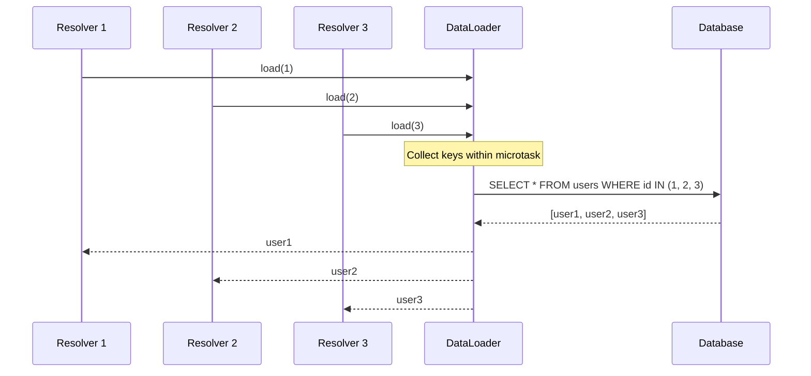

# N+1 Query Detection and Resolution

## Why N+1 Queries Are Devastating

The N+1 query problem is the most common performance anti-pattern in database-backed applications. It occurs when code fetches a list of N items, then executes a separate query for each item's related data. Instead of 2 queries (one for the list, one for all related data), you execute N+1 queries.

For a page displaying 50 blog posts with their authors:
- **N+1 pattern**: 1 query for posts + 50 queries for authors = **51 queries**
- **Optimized**: 1 query for posts + 1 query for all 50 authors = **2 queries**

At 5ms per query, the N+1 version takes 255ms; the optimized version takes 10ms. With nested relationships (posts -> authors -> companies), the problem compounds exponentially.

### Historical Context

The N+1 problem has existed since ORMs became popular in the 2000s (ActiveRecord, Hibernate, Entity Framework). ORMs make it easy to lazily load relationships, which is convenient for development but catastrophic for performance. GraphQL exacerbated the problem by making nested data fetching the default pattern.

The DataLoader pattern was invented at Facebook in 2010 to solve N+1 queries in their GraphQL resolvers. It was open-sourced in 2016 and has become the standard solution across languages.

## First Principles

### The Problem Illustrated



### Why ORMs Cause N+1

ORMs provide lazy loading — related entities are fetched on first access. This appears clean in code but hides N queries:

```typescript
// Appears innocent — actually 51 queries
const posts = await postRepository.find({ take: 50 });
for (const post of posts) {
  // Each access triggers a new query!
  console.log(post.author.name);
}
```

### The Cost Model

Total time for N+1 queries:

$$
T_{N+1} = T_{\text{list}} + N \times T_{\text{detail}}
$$

Total time for batched queries:

$$
T_{\text{batch}} = T_{\text{list}} + T_{\text{batch\_detail}}
$$

The ratio:

$$
\frac{T_{N+1}}{T_{\text{batch}}} = \frac{T_{\text{list}} + N \times T_{\text{detail}}}{T_{\text{list}} + T_{\text{batch\_detail}}}
$$

For 50 items with 5ms per query and 8ms for the batch:

$$
\frac{5 + 50 \times 5}{5 + 8} = \frac{255}{13} \approx 20\times \text{ slower}
$$

With network latency between app and database (e.g., cloud deployment), each query adds 1-5ms of RTT:

$$
\frac{5 + 50 \times (5 + 3)}{5 + (8 + 3)} = \frac{405}{16} \approx 25\times \text{ slower}
$$

## Core Mechanics

### Detecting N+1 Queries

#### Method 1: Query Logging and Counting

```typescript
import { Pool, QueryConfig } from 'pg';

class QueryMonitor {
  private queries: Array<{ sql: string; params: unknown[]; duration: number; stack: string }> = [];
  private requestId: string = '';

  constructor(private readonly pool: Pool) {}

  startRequest(requestId: string): void {
    this.requestId = requestId;
    this.queries = [];
  }

  async query(sql: string, params: unknown[] = []): Promise<unknown> {
    const start = performance.now();
    const result = await this.pool.query(sql, params);
    const duration = performance.now() - start;

    this.queries.push({
      sql,
      params,
      duration,
      stack: new Error().stack || '',
    });

    return result;
  }

  endRequest(): {
    totalQueries: number;
    totalTime: number;
    duplicateQueries: Array<{ sql: string; count: number }>;
    nPlusOnePatterns: Array<{ sql: string; count: number; suggestion: string }>;
  } {
    const totalQueries = this.queries.length;
    const totalTime = this.queries.reduce((sum, q) => sum + q.duration, 0);

    // Find duplicate query patterns
    const patterns = new Map<string, number>();
    for (const q of this.queries) {
      // Normalize: replace parameter values with ?
      const normalized = q.sql.replace(/\$\d+/g, '?');
      patterns.set(normalized, (patterns.get(normalized) || 0) + 1);
    }

    const duplicateQueries = [...patterns.entries()]
      .filter(([, count]) => count > 1)
      .map(([sql, count]) => ({ sql, count }))
      .sort((a, b) => b.count - a.count);

    // Detect N+1 patterns: same query template executed many times
    const nPlusOnePatterns = duplicateQueries
      .filter(d => d.count > 5)
      .map(d => ({
        sql: d.sql,
        count: d.count,
        suggestion: d.sql.includes('WHERE') && d.sql.includes('= ?')
          ? `Use IN clause: ${d.sql.replace('= ?', 'IN (?)')}`
          : 'Consider batch loading',
      }));

    return { totalQueries, totalTime, duplicateQueries, nPlusOnePatterns };
  }
}

// Express middleware
function queryMonitorMiddleware(monitor: QueryMonitor) {
  return (req: Request, res: Response, next: () => void) => {
    const requestId = crypto.randomUUID();
    monitor.startRequest(requestId);

    res.on('finish', () => {
      const report = monitor.endRequest();

      if (report.nPlusOnePatterns.length > 0) {
        console.warn(`[N+1 DETECTED] Request ${req.method} ${req.path}:`);
        console.warn(`  Total queries: ${report.totalQueries}`);
        console.warn(`  Total DB time: ${report.totalTime.toFixed(1)}ms`);
        for (const pattern of report.nPlusOnePatterns) {
          console.warn(`  Pattern: ${pattern.sql} (${pattern.count}x)`);
          console.warn(`  Suggestion: ${pattern.suggestion}`);
        }
      }
    });

    next();
  };
}
```

#### Method 2: pg_stat_statements Analysis

```sql
-- Find queries that are likely part of N+1 patterns
-- High call count + low average rows + simple WHERE clause
SELECT
  queryid,
  LEFT(query, 100) AS query,
  calls,
  rows,
  CASE WHEN calls > 0 THEN rows / calls ELSE 0 END AS avg_rows,
  round(mean_exec_time::numeric, 3) AS avg_ms,
  round(total_exec_time::numeric / 1000, 2) AS total_seconds
FROM pg_stat_statements
WHERE query LIKE '%WHERE%id = $1%'
  AND calls > 100
  AND rows / GREATEST(calls, 1) <= 1  -- Returns 0-1 rows per call
ORDER BY calls DESC
LIMIT 20;
```

### The DataLoader Pattern

DataLoader batches multiple individual requests into a single batch request within the same tick of the event loop:



### DataLoader Implementation from Scratch

```typescript
type BatchFunction<K, V> = (keys: K[]) => Promise<(V | Error)[]>;

interface DataLoaderOptions {
  maxBatchSize?: number;
  cacheEnabled?: boolean;
}

class DataLoader<K, V> {
  private cache = new Map<string, Promise<V>>();
  private batch: Array<{
    key: K;
    resolve: (value: V) => void;
    reject: (error: Error) => void;
  }> = [];
  private scheduled = false;

  constructor(
    private readonly batchFn: BatchFunction<K, V>,
    private readonly options: DataLoaderOptions = {}
  ) {}

  async load(key: K): Promise<V> {
    const cacheKey = this.getCacheKey(key);

    // Check cache
    if (this.options.cacheEnabled !== false) {
      const cached = this.cache.get(cacheKey);
      if (cached) return cached;
    }

    // Create promise for this key
    const promise = new Promise<V>((resolve, reject) => {
      this.batch.push({ key, resolve, reject });
    });

    // Cache the promise (deduplicates concurrent loads for same key)
    if (this.options.cacheEnabled !== false) {
      this.cache.set(cacheKey, promise);
    }

    // Schedule batch execution
    if (!this.scheduled) {
      this.scheduled = true;
      queueMicrotask(() => this.executeBatch());
    }

    return promise;
  }

  async loadMany(keys: K[]): Promise<(V | Error)[]> {
    return Promise.all(
      keys.map(key =>
        this.load(key).catch(err => err as Error)
      )
    );
  }

  clear(key: K): this {
    this.cache.delete(this.getCacheKey(key));
    return this;
  }

  clearAll(): this {
    this.cache.clear();
    return this;
  }

  private async executeBatch(): Promise<void> {
    const batch = this.batch;
    this.batch = [];
    this.scheduled = false;

    if (batch.length === 0) return;

    // Split into chunks if maxBatchSize is set
    const maxSize = this.options.maxBatchSize || Infinity;
    const chunks = [];
    for (let i = 0; i < batch.length; i += maxSize) {
      chunks.push(batch.slice(i, i + maxSize));
    }

    for (const chunk of chunks) {
      const keys = chunk.map(item => item.key);

      try {
        const results = await this.batchFn(keys);

        if (results.length !== keys.length) {
          const error = new Error(
            `DataLoader batch function returned ${results.length} results ` +
            `for ${keys.length} keys`
          );
          chunk.forEach(item => item.reject(error));
          continue;
        }

        chunk.forEach((item, index) => {
          const result = results[index];
          if (result instanceof Error) {
            item.reject(result);
          } else {
            item.resolve(result);
          }
        });
      } catch (error) {
        chunk.forEach(item =>
          item.reject(error instanceof Error ? error : new Error(String(error)))
        );
      }
    }
  }

  private getCacheKey(key: K): string {
    if (typeof key === 'string' || typeof key === 'number') {
      return String(key);
    }
    return JSON.stringify(key);
  }
}
```

### Production DataLoader Factory

```typescript
import { Pool } from 'pg';

// Type-safe DataLoader factory for database entities
class DataLoaderFactory {
  constructor(private readonly pool: Pool) {}

  createEntityLoader<T extends { id: string | number }>(
    tableName: string,
    idColumn: string = 'id'
  ): DataLoader<string | number, T | null> {
    return new DataLoader<string | number, T | null>(
      async (ids) => {
        const { rows } = await this.pool.query<T>(
          `SELECT * FROM ${tableName} WHERE ${idColumn} = ANY($1::int[])`,
          [ids]
        );

        // CRITICAL: Results must be in the same order as keys
        const byId = new Map(rows.map(row => [String(row.id), row]));
        return ids.map(id => byId.get(String(id)) || null);
      },
      { maxBatchSize: 1000 }
    );
  }

  createRelationLoader<T>(
    tableName: string,
    foreignKey: string
  ): DataLoader<string | number, T[]> {
    return new DataLoader<string | number, T[]>(
      async (parentIds) => {
        const { rows } = await this.pool.query<T & Record<string, unknown>>(
          `SELECT * FROM ${tableName} WHERE ${foreignKey} = ANY($1::int[])`,
          [parentIds]
        );

        // Group by foreign key
        const grouped = new Map<string, T[]>();
        for (const row of rows) {
          const key = String(row[foreignKey]);
          if (!grouped.has(key)) grouped.set(key, []);
          grouped.get(key)!.push(row);
        }

        return parentIds.map(id => grouped.get(String(id)) || []);
      },
      { maxBatchSize: 1000 }
    );
  }
}

// Usage with GraphQL resolvers
interface User { id: number; name: string; email: string }
interface Post { id: number; title: string; author_id: number }
interface Comment { id: number; text: string; post_id: number; user_id: number }

function createLoaders(pool: Pool) {
  const factory = new DataLoaderFactory(pool);

  return {
    user: factory.createEntityLoader<User>('users'),
    post: factory.createEntityLoader<Post>('posts'),
    commentsByPost: factory.createRelationLoader<Comment>('comments', 'post_id'),
    postsByAuthor: factory.createRelationLoader<Post>('posts', 'author_id'),
  };
}

// GraphQL resolvers using DataLoader
const resolvers = {
  Query: {
    posts: async (_: unknown, args: { limit: number }, ctx: Context) => {
      const { rows } = await ctx.pool.query(
        'SELECT * FROM posts ORDER BY created_at DESC LIMIT $1',
        [args.limit]
      );
      return rows;
    },
  },
  Post: {
    author: (post: Post, _: unknown, ctx: Context) => {
      // This is called N times, but DataLoader batches into 1 query
      return ctx.loaders.user.load(post.author_id);
    },
    comments: (post: Post, _: unknown, ctx: Context) => {
      return ctx.loaders.commentsByPost.load(post.id);
    },
  },
  Comment: {
    author: (comment: Comment, _: unknown, ctx: Context) => {
      return ctx.loaders.user.load(comment.user_id);
    },
  },
};
```

## Edge Cases and Failure Modes

### 1. DataLoader Key Ordering

```typescript
// CRITICAL BUG: Results not in key order
// DataLoader REQUIRES results to match the key order exactly

// BAD batch function:
async function badBatchUsers(ids: number[]): Promise<User[]> {
  const { rows } = await pool.query(
    'SELECT * FROM users WHERE id = ANY($1::int[])',
    [ids]
  );
  return rows; // Order depends on database, NOT input order!
}

// GOOD batch function:
async function goodBatchUsers(ids: number[]): Promise<(User | Error)[]> {
  const { rows } = await pool.query(
    'SELECT * FROM users WHERE id = ANY($1::int[])',
    [ids]
  );
  const byId = new Map(rows.map(r => [r.id, r]));
  // Return in exact key order, with null/error for missing keys
  return ids.map(id => byId.get(id) || new Error(`User ${id} not found`));
}
```

### 2. DataLoader Cache Scope

```typescript
// BUG: DataLoader cached across requests = security issue
// User A's data served to User B

// BAD: Module-level DataLoader
const userLoader = new DataLoader(batchUsers); // Shared across all requests!

// GOOD: Request-scoped DataLoader
function createContext(req: Request) {
  return {
    loaders: createLoaders(pool), // New loaders per request
  };
}

// DataLoader cache lives only for the duration of one request
// This also prevents stale data between requests
```

### 3. Circular Dependencies

```typescript
// Posts reference authors, authors reference posts
// If both use DataLoader, circular loading can cause issues

// DataLoader handles this correctly because:
// 1. First microtask: load posts -> batch users
// 2. Second microtask: load posts for users -> batch posts
// The cache prevents infinite loops for the same keys

// But watch out for deep nesting:
// post -> author -> posts -> comments -> author -> posts -> ...
// Each level adds a microtask delay
// Solution: Set a maximum depth in your GraphQL schema
```

### 4. Large Batch Sizes

```typescript
// PostgreSQL has a parameter limit (~65,535)
// Loading 100K IDs at once will fail

// Solution: Set maxBatchSize
const loader = new DataLoader(batchFn, { maxBatchSize: 1000 });

// Or handle in the batch function:
async function batchWithChunking(ids: number[]): Promise<User[]> {
  const CHUNK_SIZE = 1000;
  const results: User[] = [];

  for (let i = 0; i < ids.length; i += CHUNK_SIZE) {
    const chunk = ids.slice(i, i + CHUNK_SIZE);
    const { rows } = await pool.query(
      'SELECT * FROM users WHERE id = ANY($1::int[])',
      [chunk]
    );
    results.push(...rows);
  }

  const byId = new Map(results.map(r => [r.id, r]));
  return ids.map(id => byId.get(id)!);
}
```

## Performance Characteristics

### N+1 vs Batch: Real Numbers

| Scenario | N+1 Queries | Batch Queries | N+1 Time | Batch Time | Speedup |
|----------|-------------|---------------|----------|------------|---------|
| 10 posts + authors | 11 | 2 | 55ms | 10ms | 5.5x |
| 50 posts + authors | 51 | 2 | 255ms | 12ms | 21x |
| 100 posts + authors + comments | 301 | 3 | 1,505ms | 18ms | 84x |
| 50 posts + all nested (3 levels) | 2,551 | 4 | 12,755ms | 25ms | 510x |

### DataLoader Overhead

| Component | Time |
|-----------|------|
| DataLoader.load() call | ~0.001ms |
| Microtask scheduling | ~0.01ms |
| Batch collection | ~0.01ms per key |
| Cache lookup | ~0.001ms |
| Total overhead per load | ~0.02ms |

The overhead is negligible compared to the query savings.

### Database Impact

```sql
-- N+1: 50 separate queries
-- Each query: parse -> plan -> execute -> return
-- Total overhead: 50 * 0.5ms = 25ms of planning alone

-- Batch: 1 query with IN clause
-- Parse once, plan once, execute once
-- Planning overhead: 0.5ms

-- Plus: N+1 uses 50 network round-trips
-- Batch uses 1 network round-trip
```

## Mathematical Foundations

### Total Query Cost Model

For a data graph with depth $d$ and branching factor $b$:

**N+1 pattern**:

$$
Q_{N+1} = 1 + b + b^2 + \cdots + b^d = \frac{b^{d+1} - 1}{b - 1}
$$

**With DataLoader batching**:

$$
Q_{\text{batch}} = d + 1
$$

For $b = 10$ (10 items per level) and $d = 3$ (3 levels deep):

$$
Q_{N+1} = \frac{10^4 - 1}{9} = 1{,}111 \text{ queries}
$$

$$
Q_{\text{batch}} = 4 \text{ queries}
$$

That is a 278x reduction in query count.

### Optimal Batch Size

The optimal batch size balances query construction overhead against network round-trips:

$$
B^* = \sqrt{\frac{T_{\text{RTT}}}{T_{\text{per\_id}}}}
$$

Where $T_{\text{RTT}}$ is the network round-trip time and $T_{\text{per\_id}}$ is the marginal cost per ID in the IN clause.

For $T_{\text{RTT}} = 1\text{ms}$ and $T_{\text{per\_id}} = 0.001\text{ms}$:

$$
B^* = \sqrt{\frac{1}{0.001}} \approx 32
$$

In practice, batch sizes of 100-1000 work well for most applications.

::: info War Story
**The GraphQL Endpoint That Made 3,000 Queries**

A mobile app's home feed GraphQL query returned 20 posts, each with the author, 5 recent comments, and each comment's author. Without DataLoader:
- 1 query for posts
- 20 queries for post authors
- 20 queries for comment lists (one per post)
- 100 queries for comment authors (5 per post)
Total: 141 queries. The endpoint took 700ms.

After implementing DataLoader:
- 1 query for posts
- 1 batched query for post authors (20 IDs)
- 1 batched query for all comments (20 post IDs)
- 1 batched query for comment authors (up to 100 IDs, deduplicated)
Total: 4 queries. The endpoint took 25ms.

But the real story was in production monitoring: the team discovered a nested schema connection (`post -> author -> recentPosts -> comments -> author`) that mobile clients were unknowingly querying. This cascaded to 3,000+ queries per request. DataLoader reduced it to 6.
:::

::: info War Story
**The ORM Migration That Quadrupled Database Load**

A team migrated from raw SQL to an ORM (TypeORM) for maintainability. All queries were rewritten using the repository pattern. Within a week of deployment, database CPU increased from 20% to 80%, and p99 latency went from 50ms to 800ms.

The root cause: every `find` with relations used lazy loading by default. A listing page that previously ran 2 SQL queries now ran 50+ queries because each relationship was fetched individually.

The fix was a combination of: (1) eager loading with `relations: ['author', 'tags']` for known queries, (2) DataLoader for GraphQL resolvers, (3) a query count middleware that alerted when a request exceeded 10 database queries.
:::

## Decision Framework

### Choosing a Solution

| Scenario | Solution | Why |
|----------|----------|-----|
| REST API with known includes | Eager loading (JOIN) | Simple, predictable |
| GraphQL resolvers | DataLoader | Handles dynamic field selection |
| ORM with lazy loading | Switch to eager loading | Prevents accidental N+1 |
| Batch processing | Chunked queries | Process large datasets |
| Read-heavy with repetition | DataLoader with caching | Deduplicates within request |
| Microservice boundary | Batch endpoint | Service-to-service batching |

### ORM-Specific Solutions

| ORM | N+1 Solution | Configuration |
|-----|-------------|---------------|
| TypeORM | `relations`, `QueryBuilder.leftJoinAndSelect` | Eager: `{ eager: true }` |
| Prisma | `include`, `select` | `include: { author: true }` |
| Drizzle | `.with()` relations | Explicit joins |
| Sequelize | `include`, `scope` | `{ include: [Author] }` |
| Knex | Manual joins | `knex.select().join()` |

## Advanced Topics

### DataLoader with Composite Keys

```typescript
// Load by compound key (e.g., user_id + role)
interface CompositeKey {
  userId: number;
  role: string;
}

const permissionLoader = new DataLoader<CompositeKey, Permission[]>(
  async (keys) => {
    // Build a query that handles composite keys
    const conditions = keys.map((k, i) => `(user_id = $${i*2+1} AND role = $${i*2+2})`);
    const params = keys.flatMap(k => [k.userId, k.role]);

    const { rows } = await pool.query(
      `SELECT * FROM permissions WHERE ${conditions.join(' OR ')}`,
      params
    );

    return keys.map(key =>
      rows.filter(r => r.user_id === key.userId && r.role === key.role)
    );
  },
  {
    // Custom cache key for composite keys
    cacheEnabled: true,
  }
);
```

### Automatic N+1 Detection Middleware

```typescript
import { AsyncLocalStorage } from 'node:async_hooks';

interface QueryTracker {
  queries: Array<{ pattern: string; count: number }>;
  patternCounts: Map<string, number>;
}

const queryTrackerStorage = new AsyncLocalStorage<QueryTracker>();

// Wrap your database pool
function instrumentPool(pool: Pool): Pool {
  const originalQuery = pool.query.bind(pool);

  pool.query = function (textOrConfig: string | QueryConfig, ...args: any[]) {
    const tracker = queryTrackerStorage.getStore();
    if (tracker) {
      const sql = typeof textOrConfig === 'string' ? textOrConfig : textOrConfig.text;
      const pattern = sql.replace(/\$\d+/g, '?').replace(/\d+/g, 'N');
      const count = (tracker.patternCounts.get(pattern) || 0) + 1;
      tracker.patternCounts.set(pattern, count);

      if (count === 10) {
        console.warn(`[N+1 WARNING] Query pattern executed 10+ times: ${pattern}`);
      }
    }

    return originalQuery(textOrConfig, ...args);
  } as any;

  return pool;
}

// Middleware
function nPlusOneDetector(req: Request, res: Response, next: () => void) {
  const tracker: QueryTracker = {
    queries: [],
    patternCounts: new Map(),
  };

  queryTrackerStorage.run(tracker, () => {
    res.on('finish', () => {
      const violations = [...tracker.patternCounts.entries()]
        .filter(([, count]) => count > 5)
        .map(([pattern, count]) => ({ pattern, count }));

      if (violations.length > 0) {
        console.warn(`[N+1] ${req.method} ${req.path}:`, violations);
      }
    });

    next();
  });
}
```

::: tip Key Takeaway
N+1 queries are the most common and easiest-to-fix performance problem in database-backed applications. Use DataLoader for GraphQL resolvers, eager loading for REST APIs, and query monitoring middleware to detect new N+1 patterns before they reach production. Every request should execute a single-digit number of database queries — if it exceeds 10, investigate.
:::

## Cross-References

- [Query Optimization](./query-optimization.md) — optimizing the batch queries themselves
- [Connection Pool Tuning](./connection-pool-tuning.md) — N+1 queries consume connections rapidly
- [Application-Level Caching](../caching-strategies/application-level.md) — caching to avoid repeated loads
- [Database Tuning Overview](./index.md) — holistic approach
