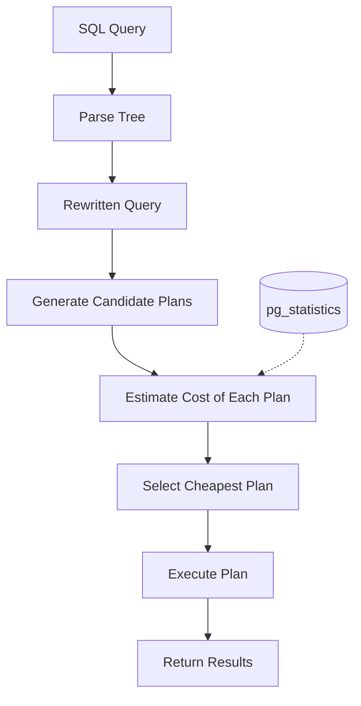
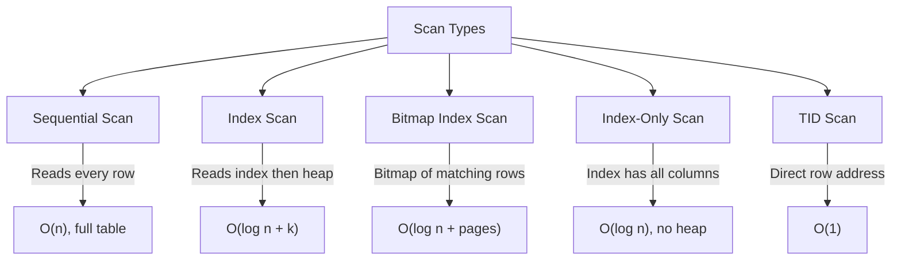

# Query Optimization

## Why Query Optimization Matters

A single poorly written query can consume more resources than the rest of the application combined. A full table scan on a 100M-row table takes 30 seconds; the same query with a proper index takes 0.5ms — a 60,000x improvement. Query optimization is the highest-ROI activity in database performance tuning.

The challenge is that SQL is declarative. You describe *what* you want, not *how* to get it. The query planner decides the execution strategy. Understanding how the planner thinks — what statistics it uses, how it estimates costs, and when it makes mistakes — is essential for writing queries that perform well.

### Historical Context

PostgreSQL's cost-based optimizer dates back to the 1990s. It evaluates possible execution plans and picks the one with the lowest estimated cost. The planner considers sequential scans, index scans, bitmap scans, nested loops, hash joins, merge joins, and many other operators. For complex queries with many joins, the number of possible plans is factorial — PostgreSQL uses heuristics and the Genetic Query Optimizer (GEQO) for queries with more than 12 tables.

## First Principles

### The Query Execution Pipeline



### How the Planner Estimates Costs

For each operation, the planner estimates:
1. **Startup cost**: Work before the first row is returned.
2. **Total cost**: Work for all rows.
3. **Row count**: Estimated number of output rows.
4. **Row width**: Estimated average row size in bytes.

These estimates depend on table statistics maintained by `ANALYZE`.

### Selectivity Estimation

The planner estimates selectivity (fraction of rows matching a predicate) using statistics from `pg_stats`:

$$
\text{Selectivity}(\text{col} = \text{value}) \approx \begin{cases}
\text{MCV frequency} & \text{if value is in MCV list} \\
\frac{1 - \sum f_{\text{MCV}}}{\text{n\_distinct} - |\text{MCV}|} & \text{otherwise}
\end{cases}
$$

Where MCV = Most Common Values, stored in `pg_stats.most_common_vals`.

For range predicates:

$$
\text{Selectivity}(a \leq \text{col} \leq b) \approx \frac{b - a}{\text{max} - \text{min}} \times (1 - \text{null\_frac})
$$

This uses the histogram in `pg_stats.histogram_bounds`.

## Core Mechanics: Reading EXPLAIN ANALYZE

### The Essential Command

```sql
EXPLAIN (ANALYZE, BUFFERS, FORMAT TEXT)
SELECT * FROM orders
WHERE customer_id = 12345
  AND status = 'completed'
  AND created_at > '2024-01-01';
```

Output format:
```
Index Scan using idx_orders_customer on orders  (cost=0.56..28.40 rows=5 width=120) (actual time=0.024..0.031 rows=3 loops=1)
  Index Cond: (customer_id = 12345)
  Filter: ((status = 'completed') AND (created_at > '2024-01-01'))
  Rows Removed by Filter: 2
  Buffers: shared hit=5
Planning Time: 0.15 ms
Execution Time: 0.06 ms
```

### Reading the Output

| Field | Meaning |
|-------|---------|
| `cost=0.56..28.40` | Estimated startup cost..total cost (arbitrary units) |
| `rows=5` | Estimated output rows |
| `width=120` | Estimated bytes per row |
| `actual time=0.024..0.031` | Real startup..total time in ms |
| `rows=3` | Actual output rows |
| `loops=1` | Number of times this node was executed |
| `Buffers: shared hit=5` | 5 buffer pool page hits (no disk reads) |
| `Rows Removed by Filter: 2` | Rows that matched index but failed additional predicates |

::: warning Estimated vs Actual
When estimated rows differs significantly from actual rows, the planner may have chosen the wrong plan. This is the #1 cause of slow queries. Run `ANALYZE` on the table and check if the statistics are up to date.
:::

### Scan Types



**Sequential Scan**: Reads every page in the table. Optimal when most rows match or the table is small.

**Index Scan**: Traverses the B-tree index to find matching rows, then fetches each row from the heap. Optimal for selective queries (< 5-15% of rows).

**Bitmap Index Scan**: Builds a bitmap of matching pages, then reads those pages sequentially. Optimal for moderately selective queries (5-30% of rows) or combining multiple indexes.

**Index-Only Scan**: Returns data directly from the index without accessing the heap. Requires the visibility map to be up-to-date (run `VACUUM`). Optimal when all queried columns are in the index.

## Implementation: Before/After Optimization Examples

### Example 1: Missing Index

**Before**:
```sql
EXPLAIN (ANALYZE, BUFFERS)
SELECT * FROM orders WHERE customer_id = 12345;

-- Seq Scan on orders  (cost=0.00..185432.00 rows=50 width=120)
--                      (actual time=432.100..2341.200 rows=47 loops=1)
--   Filter: (customer_id = 12345)
--   Rows Removed by Filter: 9999953
--   Buffers: shared hit=35200 read=50232
-- Planning Time: 0.12 ms
-- Execution Time: 2341.45 ms
```

The planner scans 10 million rows to find 47. This is 2.3 seconds.

**After**:
```sql
CREATE INDEX CONCURRENTLY idx_orders_customer_id ON orders (customer_id);

EXPLAIN (ANALYZE, BUFFERS)
SELECT * FROM orders WHERE customer_id = 12345;

-- Index Scan using idx_orders_customer_id on orders
--   (cost=0.43..28.35 rows=50 width=120)
--   (actual time=0.032..0.048 rows=47 loops=1)
--   Index Cond: (customer_id = 12345)
--   Buffers: shared hit=50
-- Planning Time: 0.15 ms
-- Execution Time: 0.08 ms
```

From 2,341ms to 0.08ms. The index reads 50 pages instead of 85,432.

### Example 2: Composite Index Order Matters

**Before** (wrong index order):
```sql
-- Index exists: (status, created_at)
-- But the query filters on created_at range first
EXPLAIN (ANALYZE, BUFFERS)
SELECT * FROM orders
WHERE created_at > '2024-01-01'
  AND status = 'completed';

-- Bitmap Heap Scan on orders
--   (cost=12345.00..95000.00 rows=50000 width=120)
--   (actual time=120.000..450.000 rows=48500 loops=1)
--   Recheck Cond: ((status = 'completed') AND (created_at > '2024-01-01'))
--   Buffers: shared hit=20000 read=15000
-- Execution Time: 453.00 ms
```

**After** (correct index order — equality first, range second):
```sql
CREATE INDEX CONCURRENTLY idx_orders_status_created
ON orders (status, created_at);

EXPLAIN (ANALYZE, BUFFERS)
SELECT * FROM orders
WHERE created_at > '2024-01-01'
  AND status = 'completed';

-- Index Scan using idx_orders_status_created on orders
--   (cost=0.56..18500.00 rows=50000 width=120)
--   (actual time=0.030..85.000 rows=48500 loops=1)
--   Index Cond: ((status = 'completed') AND (created_at > '2024-01-01'))
--   Buffers: shared hit=12000
-- Execution Time: 88.00 ms
```

5x improvement because the index navigates directly to `status = 'completed'` and then scans the range.

### Example 3: Subquery vs JOIN

**Before** (correlated subquery):
```sql
EXPLAIN (ANALYZE, BUFFERS)
SELECT *
FROM products p
WHERE p.id IN (
  SELECT oi.product_id
  FROM order_items oi
  WHERE oi.order_id IN (
    SELECT o.id FROM orders o WHERE o.customer_id = 12345
  )
);

-- Nested Loop Semi Join
--   (cost=500.00..85000.00 rows=100 width=80)
--   (actual time=0.500..1200.000 rows=85 loops=1)
--   Buffers: shared hit=45000 read=5000
-- Execution Time: 1203.00 ms
```

**After** (explicit JOIN):
```sql
EXPLAIN (ANALYZE, BUFFERS)
SELECT DISTINCT p.*
FROM products p
JOIN order_items oi ON p.id = oi.product_id
JOIN orders o ON oi.order_id = o.id
WHERE o.customer_id = 12345;

-- HashAggregate (for DISTINCT)
--   -> Nested Loop
--     -> Index Scan using idx_orders_customer_id on orders
--     -> Index Scan using idx_order_items_order_id on order_items
--     -> Index Scan using products_pkey on products
-- (actual time=0.050..0.200 rows=85 loops=1)
-- Buffers: shared hit=300
-- Execution Time: 0.25 ms
```

From 1,200ms to 0.25ms by allowing the planner to use efficient join strategies.

### Example 4: Aggregate with Index

**Before**:
```sql
EXPLAIN (ANALYZE, BUFFERS)
SELECT COUNT(*) FROM orders WHERE status = 'pending';

-- Aggregate
--   -> Seq Scan on orders  (cost=0.00..185432.00 rows=500000 width=0)
--     Filter: (status = 'pending')
--     Buffers: shared hit=85432
-- Execution Time: 850.00 ms
```

**After** (partial index):
```sql
CREATE INDEX CONCURRENTLY idx_orders_pending
ON orders (id) WHERE status = 'pending';

EXPLAIN (ANALYZE, BUFFERS)
SELECT COUNT(*) FROM orders WHERE status = 'pending';

-- Aggregate
--   -> Index Only Scan using idx_orders_pending on orders
--     Buffers: shared hit=1400
-- Execution Time: 12.00 ms
```

70x improvement by creating a partial index that only covers pending orders.

### Example 5: Pagination Optimization

**Before** (OFFSET-based):
```sql
EXPLAIN (ANALYZE, BUFFERS)
SELECT * FROM products
ORDER BY created_at DESC
LIMIT 20 OFFSET 100000;

-- Limit
--   -> Sort (cost=250000..260000 rows=100020 width=200)
--     Sort Key: created_at DESC
--     Sort Method: top-N heapsort  Memory: 4096kB
--     -> Seq Scan on products
--       Buffers: shared hit=50000
-- Execution Time: 1500.00 ms
```

**After** (cursor-based / keyset pagination):
```sql
EXPLAIN (ANALYZE, BUFFERS)
SELECT * FROM products
WHERE created_at < '2024-01-15 10:30:00'
ORDER BY created_at DESC
LIMIT 20;

-- Limit
--   -> Index Scan Backward using idx_products_created_at on products
--     Index Cond: (created_at < '2024-01-15 10:30:00')
--     Buffers: shared hit=25
-- Execution Time: 0.05 ms
```

30,000x improvement. OFFSET scans and discards 100,000 rows; keyset jumps directly to the right position.

## Edge Cases and Failure Modes

### 1. Statistics Lie: Correlated Columns

```sql
-- PostgreSQL assumes column independence
-- But city and country are correlated (Tokyo is always in Japan)

EXPLAIN ANALYZE
SELECT * FROM addresses
WHERE city = 'Tokyo' AND country = 'Japan';

-- Estimated rows: 10 (assumes independent: 0.001 * 0.01 * 10M)
-- Actual rows: 100,000

-- FIX: Create extended statistics
CREATE STATISTICS stat_addr_city_country (dependencies)
ON city, country FROM addresses;
ANALYZE addresses;
```

### 2. Parameter Sniffing

```sql
-- Prepared statement planned with parameter value that returns 1 row
-- Same plan reused when parameter returns 1,000,000 rows

-- Mitigation: PostgreSQL 12+ auto-detects this after 5 executions
-- Manual fix: use plan_cache_mode
SET plan_cache_mode = 'force_custom_plan'; -- Always replan
```

### 3. Function Volatility Mismarks

```sql
-- VOLATILE function in WHERE clause prevents index use
CREATE FUNCTION get_active_status() RETURNS text AS $$
  SELECT 'active';
$$ LANGUAGE sql VOLATILE;

-- Planner cannot assume the function returns the same value for each row
-- So it calls the function for every row (sequential scan)
SELECT * FROM users WHERE status = get_active_status();

-- FIX: Mark as IMMUTABLE or STABLE
CREATE OR REPLACE FUNCTION get_active_status() RETURNS text AS $$
  SELECT 'active';
$$ LANGUAGE sql IMMUTABLE;
```

### 4. Implicit Type Casting Prevents Index Use

```sql
-- Column is integer, parameter is text -> implicit cast
-- The cast prevents index use!
EXPLAIN ANALYZE SELECT * FROM users WHERE id = '12345';
-- Seq Scan (because PostgreSQL casts id to text for comparison)

-- FIX: Use correct type
EXPLAIN ANALYZE SELECT * FROM users WHERE id = 12345;
-- Index Scan
```

::: danger
Always ensure parameter types match column types. ORM-generated queries are a common source of type mismatches.
:::

## Performance Characteristics

### Cost of Different Scan Types

| Scan Type | Pages Read | Condition | Typical Time per Row |
|-----------|-----------|-----------|---------------------|
| Sequential Scan | All pages | Full table | 0.01us (sequential) |
| Index Scan | log(N) + K pages | Selective (< 15%) | 0.1us (random) |
| Bitmap Scan | log(N) + M pages | Moderate (5-30%) | 0.05us (semi-random) |
| Index-Only Scan | log(N) pages | All columns in index | 0.05us (sequential-ish) |

### Join Strategy Performance

| Strategy | Best When | Time Complexity | Memory |
|----------|-----------|----------------|--------|
| Nested Loop | Small outer, indexed inner | $O(N \times \log M)$ | $O(1)$ |
| Hash Join | Both fit in work_mem | $O(N + M)$ | $O(M)$ |
| Merge Join | Both sorted (or indexable) | $O(N \log N + M \log M)$ | $O(1)$ |

Where $N$ and $M$ are the sizes of the two relations.

### Typical Query Times by Operation

| Operation | 1K rows | 100K rows | 10M rows |
|-----------|---------|-----------|----------|
| Indexed point lookup | 0.05ms | 0.05ms | 0.1ms |
| Indexed range (100 rows) | 0.1ms | 0.2ms | 0.5ms |
| Full table scan | 0.5ms | 30ms | 3,000ms |
| Sort | 0.1ms | 50ms | 10,000ms |
| Hash aggregate | 0.1ms | 20ms | 3,000ms |

## Mathematical Foundations

### B-Tree Index Depth

The depth of a B-tree index with $N$ entries and branching factor $B$ (typically 200-400 for PostgreSQL):

$$
d = \lceil \log_B(N) \rceil
$$

For 100 million rows with $B = 300$:

$$
d = \lceil \log_{300}(10^8) \rceil = \lceil \frac{8}{2.477} \rceil = \lceil 3.23 \rceil = 4
$$

Each level requires one page read. So an index lookup on 100M rows reads ~4 pages (32KB), compared to ~850,000 pages (6.5GB) for a sequential scan.

### Cost Estimation Formula

PostgreSQL's cost model for a sequential scan:

$$
C_{\text{seq}} = N_{\text{pages}} \times \text{seq\_page\_cost} + N_{\text{rows}} \times \text{cpu\_tuple\_cost}
$$

For an index scan:

$$
C_{\text{idx}} = N_{\text{pages}} \times \text{random\_page\_cost} + N_{\text{index\_pages}} \times \text{random\_page\_cost} + N_{\text{rows}} \times (\text{cpu\_tuple\_cost} + \text{cpu\_index\_tuple\_cost})
$$

The crossover point where an index scan becomes cheaper than a sequential scan:

$$
\text{Selectivity}_{\text{break}} \approx \frac{\text{seq\_page\_cost}}{\text{random\_page\_cost}} \approx \frac{1}{4} = 25\%
$$

On SSDs ($\text{random\_page\_cost} = 1.1$):

$$
\text{Selectivity}_{\text{break}} \approx \frac{1}{1.1} \approx 91\%
$$

This is why PostgreSQL uses indexes more aggressively when `random_page_cost` is lowered for SSDs.

::: info War Story
**The 30-Second Report Query**

A business intelligence dashboard ran a query joining 5 tables to compute monthly revenue by product category. The query took 30 seconds, making the dashboard unusable. The `EXPLAIN ANALYZE` revealed:

1. A hash join spilling to disk because `work_mem` was 4MB (default).
2. A sequential scan on the 50M-row `order_items` table due to a stale statistics estimate.
3. A sort operation for `GROUP BY` that also spilled to disk.

Fixes: (1) `SET work_mem = '256MB'` for the analytics connection, (2) `ANALYZE order_items`, (3) created a composite index on `(order_id, product_id, amount)` for an index-only scan. The query dropped to 200ms.
:::

::: info War Story
**The ORM That Generated OFFSET 1000000**

A mobile app loaded paginated feeds using OFFSET-based pagination generated by an ORM. Users scrolling deep into their feeds triggered queries like `SELECT * FROM posts ORDER BY created_at DESC LIMIT 20 OFFSET 500000`. Each page load took 3+ seconds and consumed enormous server resources.

The fix was switching to cursor-based pagination: `WHERE created_at < :last_seen_timestamp ORDER BY created_at DESC LIMIT 20`. This uses an index scan regardless of pagination depth. Page load dropped to 5ms for all pages.
:::

## Decision Framework

### Query Optimization Checklist

1. Run `EXPLAIN (ANALYZE, BUFFERS)` on the slow query.
2. Check if estimated rows matches actual rows. If not, run `ANALYZE`.
3. Look for sequential scans on large tables. Add an index.
4. Look for "Rows Removed by Filter" — these rows were fetched but discarded.
5. Check for sort/hash spilling to disk — increase `work_mem`.
6. Look for nested loops with high loop counts — consider a hash join.
7. Check if covering indexes could enable index-only scans.
8. Rewrite subqueries as JOINs when possible.
9. Use CTEs only when materialization is desired (PostgreSQL 12+ inlines CTEs by default).
10. Consider partial indexes for frequently-filtered subsets.

## Advanced Topics

### Inspecting Planner Statistics

```sql
-- View statistics for a column
SELECT
  tablename,
  attname,
  n_distinct,
  most_common_vals,
  most_common_freqs,
  histogram_bounds,
  correlation
FROM pg_stats
WHERE tablename = 'orders'
  AND attname = 'status';
```

- `n_distinct`: Estimated distinct values (negative = fraction of rows).
- `most_common_vals`: Top 100 most common values.
- `most_common_freqs`: Frequency of each MCV.
- `histogram_bounds`: Equal-frequency histogram for range estimation.
- `correlation`: Physical ordering correlation (-1 to 1). High correlation means sequential scans are more efficient.

### Plan Hints (pg_hint_plan)

When the planner consistently chooses the wrong plan:

```sql
-- Force index scan
/*+ IndexScan(orders idx_orders_customer_id) */
SELECT * FROM orders WHERE customer_id = 12345;

-- Force join order and method
/*+ Leading(orders customers) HashJoin(orders customers) */
SELECT * FROM orders o
JOIN customers c ON o.customer_id = c.id
WHERE c.country = 'Japan';
```

::: warning
Plan hints are a last resort. They prevent the planner from adapting to data changes. Always prefer fixing statistics, adding indexes, or rewriting the query.
:::

### Parallel Query Execution

PostgreSQL 10+ supports parallel query execution:

```sql
-- Check if parallelism is enabled
SHOW max_parallel_workers_per_gather; -- Default: 2
SHOW parallel_tuple_cost; -- Default: 0.1
SHOW min_parallel_table_scan_size; -- Default: 8MB

-- Force parallel execution for testing
SET max_parallel_workers_per_gather = 4;

EXPLAIN (ANALYZE)
SELECT COUNT(*) FROM orders WHERE amount > 100;

-- Gather  (actual time=50..120 rows=1 loops=1)
--   Workers Planned: 4
--   Workers Launched: 4
--   -> Partial Aggregate
--     -> Parallel Seq Scan on orders
--       Filter: (amount > 100)
--       Workers: 4 of 4
-- Execution Time: 125 ms (vs 450ms without parallelism)
```

::: tip Key Takeaway
Query optimization follows the Pareto principle: 20% of queries cause 80% of database load. Find them with `pg_stat_statements`, analyze them with `EXPLAIN (ANALYZE, BUFFERS)`, and fix them with appropriate indexes, query rewrites, or statistics updates. The single most common fix is adding a missing index.
:::

## Cross-References

- [Index Strategy](./index-strategy.md) — choosing optimal indexes
- [Database Tuning Overview](./index.md) — configuration and monitoring
- [N+1 Query Detection](./n-plus-one.md) — pattern-level optimization
- [Database-Level Caching](../caching-strategies/database-level.md) — materialized views for expensive queries
