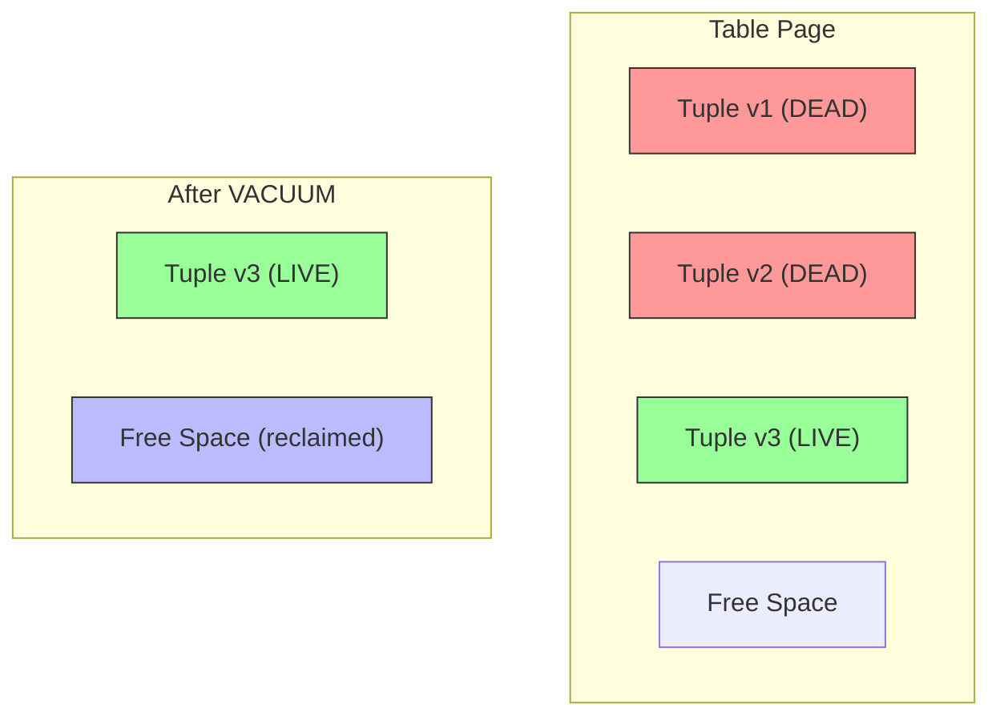
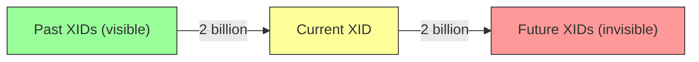
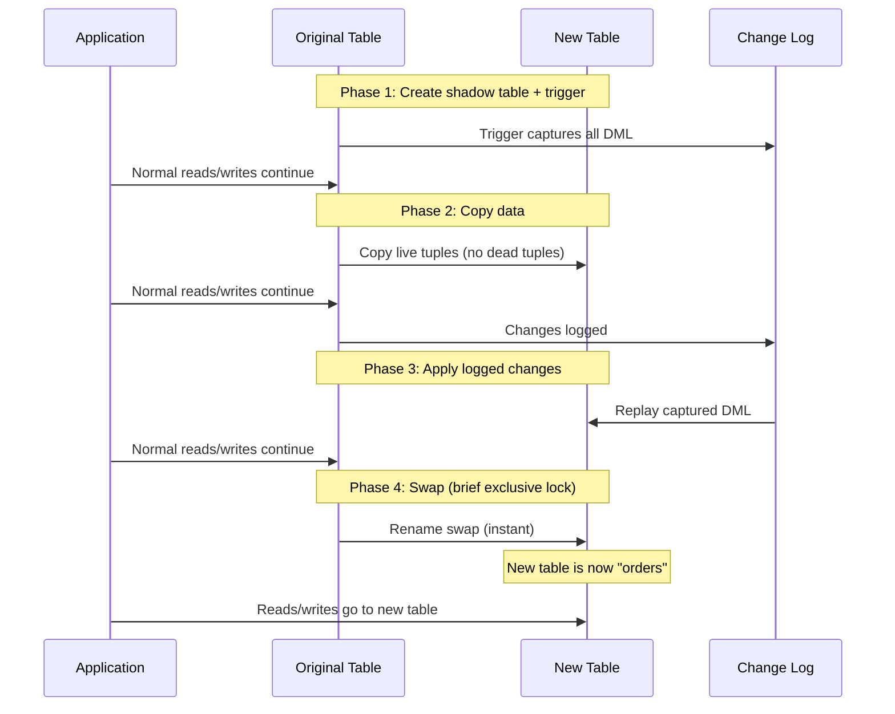

# VACUUM and ANALYZE

## Why VACUUM and ANALYZE Exist

PostgreSQL uses Multi-Version Concurrency Control (MVCC). When a row is updated, the old version is not deleted — it is marked as "dead" and a new version is created. When a row is deleted, it is only marked as dead. These dead tuples accumulate, consuming disk space and slowing queries that must skip over them.

VACUUM reclaims the space occupied by dead tuples. ANALYZE updates the table statistics used by the query planner. Without regular execution of both, PostgreSQL databases degrade over time — tables bloat, queries slow down, and eventually the system faces transaction ID wraparound, which is a catastrophic failure mode that forces the database into read-only mode.

### Historical Context

PostgreSQL has always used MVCC since its POSTGRES days (1986). Originally, VACUUM was a manual operation that DBAs had to schedule. PostgreSQL 8.1 (2005) introduced autovacuum, which runs VACUUM and ANALYZE automatically based on configurable thresholds. Despite 20+ years of improvement, autovacuum misconfiguration remains one of the top causes of PostgreSQL performance problems in production.

## First Principles

### MVCC and Dead Tuples



When a row is updated:
1. The old tuple is marked with an `xmax` (the transaction that invalidated it).
2. A new tuple is created with an `xmin` (the transaction that created it).
3. The old tuple remains on the same page until VACUUM removes it.

Dead tuples waste space and force sequential scans to read and skip over them:

$$
T_{\text{scan}} = \frac{N_{\text{live}} + N_{\text{dead}}}{N_{\text{per\_page}}} \times T_{\text{page\_read}}
$$

With 50% dead tuples, scans take twice as long.

### Transaction ID (XID) Wraparound

PostgreSQL uses 32-bit transaction IDs. After ~2 billion transactions, the counter wraps around and old transactions appear to be "in the future." This causes data loss if not prevented.

$$
\text{XID Space} = 2^{32} = 4{,}294{,}967{,}296
$$

Only half the space is usable at any time (2 billion "in the past" and 2 billion "in the future"). When a database approaches the wraparound limit, PostgreSQL forces an aggressive "anti-wraparound" VACUUM that blocks all writes until complete.



## Core Mechanics

### VACUUM Variants

```sql
-- Plain VACUUM: reclaims dead tuples, does not lock table
-- Space is marked as reusable but NOT returned to OS
VACUUM orders;

-- VACUUM FULL: rewrites entire table, returns space to OS
-- WARNING: Acquires ACCESS EXCLUSIVE lock (blocks ALL reads and writes)
VACUUM FULL orders;

-- VACUUM ANALYZE: Vacuum + update statistics
VACUUM ANALYZE orders;

-- VACUUM VERBOSE: Shows detailed progress
VACUUM (VERBOSE) orders;

-- VACUUM with specific options (PostgreSQL 12+)
VACUUM (
  VERBOSE,
  SKIP_LOCKED,        -- Skip tables with conflicting locks
  INDEX_CLEANUP AUTO,  -- Auto-decide on index cleanup
  TRUNCATE TRUE,       -- Try to truncate empty pages at end of table
  PARALLEL 4           -- Use 4 parallel workers for index cleanup
) orders;
```

### Autovacuum Configuration

```sql
-- Global autovacuum settings
ALTER SYSTEM SET autovacuum = on;
ALTER SYSTEM SET autovacuum_max_workers = 5;         -- Parallel vacuum workers
ALTER SYSTEM SET autovacuum_naptime = '30s';          -- Check interval
ALTER SYSTEM SET autovacuum_vacuum_threshold = 50;    -- Min dead tuples before vacuum
ALTER SYSTEM SET autovacuum_vacuum_scale_factor = 0.1; -- 10% of table must be dead
ALTER SYSTEM SET autovacuum_analyze_threshold = 50;
ALTER SYSTEM SET autovacuum_analyze_scale_factor = 0.05; -- 5% changed triggers analyze
ALTER SYSTEM SET autovacuum_vacuum_cost_delay = '2ms';  -- Throttle to reduce I/O impact
ALTER SYSTEM SET autovacuum_vacuum_cost_limit = 1000;   -- Cost budget per round

-- Trigger formula:
-- VACUUM when: n_dead_tup > threshold + scale_factor * n_live_tup
-- ANALYZE when: n_mod_since_analyze > threshold + scale_factor * n_live_tup
```

#### Per-Table Autovacuum Tuning

Different tables need different thresholds:

```sql
-- High-write table (100M rows): default 10% scale_factor means
-- 10M dead tuples before vacuum runs. Too many!
ALTER TABLE events SET (
  autovacuum_vacuum_scale_factor = 0.01,  -- 1% instead of 10%
  autovacuum_vacuum_threshold = 10000,
  autovacuum_analyze_scale_factor = 0.005,
  autovacuum_vacuum_cost_delay = '0ms'    -- No throttling for this table
);

-- Small, rarely-changed table: defaults are fine
-- ALTER TABLE config SET (autovacuum_enabled = true); -- default

-- Append-only table (no updates/deletes): minimal vacuum needed
ALTER TABLE audit_log SET (
  autovacuum_vacuum_scale_factor = 0.5,   -- 50% — vacuum rarely
  autovacuum_analyze_scale_factor = 0.1
);
```

### ANALYZE Deep Dive

ANALYZE samples rows from a table to build statistics for the query planner:

```sql
-- Default sample size: 300 * default_statistics_target (100) = 30,000 rows
-- For a 100M row table, this samples 0.03% of data

-- Increase statistics target for critical columns
ALTER TABLE orders ALTER COLUMN status SET STATISTICS 1000;
ALTER TABLE orders ALTER COLUMN customer_id SET STATISTICS 500;

-- Then re-analyze
ANALYZE orders;

-- Check the statistics
SELECT
  attname,
  n_distinct,
  array_length(most_common_vals::text[], 1) AS mcv_count,
  array_length(histogram_bounds::text[], 1) AS histogram_buckets,
  correlation
FROM pg_stats
WHERE tablename = 'orders';
```

Statistics PostgreSQL collects:

| Statistic | Purpose | Used For |
|-----------|---------|----------|
| `n_distinct` | Number of distinct values | Equality selectivity |
| `most_common_vals` | Top N most frequent values | Selectivity of popular values |
| `most_common_freqs` | Frequency of each MCV | Selectivity estimates |
| `histogram_bounds` | Equal-frequency histogram | Range selectivity |
| `correlation` | Physical vs logical ordering | Index scan cost |
| `null_frac` | Fraction of NULL values | NULL handling |

## Implementation: Bloat Detection and Remediation

### Detecting Table Bloat

```sql
-- Simple bloat estimation using pg_stat_user_tables
SELECT
  schemaname,
  relname AS table_name,
  n_live_tup,
  n_dead_tup,
  CASE WHEN n_live_tup > 0
    THEN round(n_dead_tup::numeric / n_live_tup * 100, 2)
    ELSE 0
  END AS dead_pct,
  pg_size_pretty(pg_total_relation_size(relid)) AS total_size,
  last_vacuum,
  last_autovacuum,
  vacuum_count,
  autovacuum_count
FROM pg_stat_user_tables
WHERE n_dead_tup > 10000
ORDER BY n_dead_tup DESC;
```

### Accurate Bloat Estimation with pgstattuple

```sql
-- Install the extension
CREATE EXTENSION IF NOT EXISTS pgstattuple;

-- Get accurate bloat statistics
SELECT
  table_len,
  tuple_count,
  tuple_len,
  tuple_percent,
  dead_tuple_count,
  dead_tuple_len,
  dead_tuple_percent,
  free_space,
  free_percent
FROM pgstattuple('orders');

-- For indexes
SELECT
  version,
  tree_level,
  index_size,
  root_block_no,
  internal_pages,
  leaf_pages,
  empty_pages,
  deleted_pages,
  avg_leaf_density,
  leaf_fragmentation
FROM pgstatindex('idx_orders_customer_id');
```

### Automated Bloat Monitoring

```typescript
import { Pool } from 'pg';

interface TableBloat {
  schemaName: string;
  tableName: string;
  liveTuples: number;
  deadTuples: number;
  deadPercent: number;
  totalSize: string;
  lastVacuum: Date | null;
  lastAutoVacuum: Date | null;
  needsVacuum: boolean;
  needsVacuumFull: boolean;
}

class BloatMonitor {
  constructor(
    private readonly pool: Pool,
    private readonly alertCallback: (msg: string) => void
  ) {}

  async checkBloat(): Promise<TableBloat[]> {
    const { rows } = await this.pool.query<{
      schemaname: string;
      relname: string;
      n_live_tup: string;
      n_dead_tup: string;
      pg_total_relation_size: string;
      last_vacuum: Date | null;
      last_autovacuum: Date | null;
    }>(`
      SELECT
        schemaname,
        relname,
        n_live_tup,
        n_dead_tup,
        pg_total_relation_size(relid)::text AS pg_total_relation_size,
        last_vacuum,
        last_autovacuum
      FROM pg_stat_user_tables
      WHERE schemaname = 'public'
      ORDER BY n_dead_tup DESC
    `);

    const results: TableBloat[] = rows.map(row => {
      const live = parseInt(row.n_live_tup);
      const dead = parseInt(row.n_dead_tup);
      const deadPct = live > 0 ? (dead / live) * 100 : 0;

      return {
        schemaName: row.schemaname,
        tableName: row.relname,
        liveTuples: live,
        deadTuples: dead,
        deadPercent: Math.round(deadPct * 100) / 100,
        totalSize: row.pg_total_relation_size,
        lastVacuum: row.last_vacuum,
        lastAutoVacuum: row.last_autovacuum,
        needsVacuum: deadPct > 10,
        needsVacuumFull: deadPct > 50,
      };
    });

    // Alert on critical bloat
    for (const table of results) {
      if (table.needsVacuumFull) {
        this.alertCallback(
          `CRITICAL: Table ${table.tableName} has ${table.deadPercent}% dead tuples. ` +
          `Consider VACUUM FULL or pg_repack.`
        );
      } else if (table.needsVacuum) {
        this.alertCallback(
          `WARNING: Table ${table.tableName} has ${table.deadPercent}% dead tuples. ` +
          `Autovacuum may need tuning.`
        );
      }
    }

    return results;
  }

  async checkXidAge(): Promise<void> {
    const { rows } = await this.pool.query(`
      SELECT
        datname,
        age(datfrozenxid) AS xid_age,
        current_setting('autovacuum_freeze_max_age')::bigint AS freeze_max_age
      FROM pg_database
      WHERE datallowconn
      ORDER BY age(datfrozenxid) DESC
    `);

    for (const row of rows) {
      const pctOfMax = (row.xid_age / row.freeze_max_age) * 100;
      if (pctOfMax > 75) {
        this.alertCallback(
          `DANGER: Database ${row.datname} XID age is ${pctOfMax.toFixed(1)}% of freeze_max_age. ` +
          `Anti-wraparound VACUUM may trigger soon, blocking all writes.`
        );
      } else if (pctOfMax > 50) {
        this.alertCallback(
          `WARNING: Database ${row.datname} XID age is ${pctOfMax.toFixed(1)}% of freeze_max_age.`
        );
      }
    }
  }

  async checkLongRunningAutoVacuum(): Promise<void> {
    const { rows } = await this.pool.query(`
      SELECT
        pid,
        query,
        now() - query_start AS duration,
        wait_event_type,
        wait_event
      FROM pg_stat_activity
      WHERE query LIKE 'autovacuum:%'
        AND now() - query_start > interval '1 hour'
      ORDER BY query_start
    `);

    for (const row of rows) {
      this.alertCallback(
        `WARNING: Autovacuum running for ${row.duration}: ${row.query}`
      );
    }
  }
}
```

### pg_repack: Online VACUUM FULL

`pg_repack` reorganizes tables without locking reads:

```bash
# Install pg_repack
# apt-get install postgresql-16-repack

# Repack a single table (no downtime)
pg_repack --table orders --no-superuser-check -d mydb

# Repack all tables in a database
pg_repack --all --no-superuser-check -d mydb

# Repack only indexes
pg_repack --table orders --only-indexes --no-superuser-check -d mydb

# Repack with parallelism
pg_repack --table orders --jobs 4 --no-superuser-check -d mydb
```

How pg_repack works:



## Edge Cases and Failure Modes

### 1. Autovacuum Blocked by Long Transactions

```sql
-- A long-running transaction prevents VACUUM from cleaning tuples
-- that are newer than the transaction's snapshot

-- Find blockers:
SELECT
  pid,
  now() - xact_start AS transaction_age,
  state,
  LEFT(query, 80) AS query,
  backend_xmin
FROM pg_stat_activity
WHERE backend_xmin IS NOT NULL
  AND state != 'idle'
ORDER BY age(backend_xmin) DESC;

-- The oldest backend_xmin determines what VACUUM can clean
-- If a transaction started 2 hours ago, all tuples from the last
-- 2 hours are "still needed" and cannot be vacuumed
```

::: danger
A single long-running transaction (e.g., a forgotten `BEGIN` in a psql session) can prevent autovacuum from cleaning any dead tuples across the entire database. Monitor `idle in transaction` connections aggressively.
:::

### 2. Autovacuum Cannot Keep Up

```sql
-- High-write tables may produce dead tuples faster than autovacuum cleans them

-- Symptoms:
-- 1. Dead tuple count keeps growing
-- 2. Table size keeps growing even without more data
-- 3. Autovacuum runs constantly but table is always "dirty"

-- Fix: More aggressive autovacuum for this table
ALTER TABLE hot_table SET (
  autovacuum_vacuum_scale_factor = 0.01,
  autovacuum_vacuum_cost_delay = '0ms',    -- No throttling
  autovacuum_vacuum_cost_limit = 10000     -- Higher budget
);

-- Also increase global workers
ALTER SYSTEM SET autovacuum_max_workers = 8;
```

### 3. VACUUM FULL on Production

```sql
-- VACUUM FULL acquires ACCESS EXCLUSIVE lock
-- This blocks ALL reads and writes for the entire duration
-- On a 100GB table, this can take 30+ minutes

-- NEVER run VACUUM FULL on production without:
-- 1. Maintenance window (announced downtime)
-- 2. OR use pg_repack instead (online, no read blocking)
-- 3. OR use partitioning to vacuum smaller chunks
```

### 4. Anti-Wraparound VACUUM Emergency

```sql
-- When XID age exceeds autovacuum_freeze_max_age (200M by default)
-- PostgreSQL triggers an aggressive anti-wraparound VACUUM
-- This CANNOT be canceled and runs until complete

-- At 1 billion remaining XIDs, PostgreSQL goes READ-ONLY
-- and refuses all writes until VACUUM completes

-- Check current XID age
SELECT
  relname,
  age(relfrozenxid) AS xid_age,
  pg_size_pretty(pg_total_relation_size(oid)) AS size
FROM pg_class
WHERE relkind = 'r'
  AND relnamespace = (SELECT oid FROM pg_namespace WHERE nspname = 'public')
ORDER BY age(relfrozenxid) DESC
LIMIT 20;

-- If XID age > 150M, run VACUUM FREEZE proactively
VACUUM (FREEZE, VERBOSE) problematic_table;
```

## Performance Characteristics

### VACUUM Performance

| Table Size | Dead Tuples | VACUUM Time | VACUUM FULL Time | pg_repack Time |
|-----------|-------------|-------------|------------------|----------------|
| 1GB | 10% | 5s | 30s | 45s |
| 10GB | 10% | 30s | 5min | 7min |
| 100GB | 10% | 5min | 45min | 60min |
| 100GB | 50% | 15min | 30min | 45min |
| 1TB | 10% | 30min | 4h | 5h |

### Impact of Bloat on Query Performance

| Dead Tuple % | Seq Scan Overhead | Index Scan Impact | Table Size Increase |
|--------------|-------------------|-------------------|---------------------|
| 0% | 0% | 0% | 0% |
| 10% | +10% | +1% | +10% |
| 25% | +25% | +5% | +25% |
| 50% | +100% | +15% | +100% |
| 75% | +300% | +40% | +300% |
| 90% | +900% | +80% | +900% |

### Autovacuum Throughput

Autovacuum speed is controlled by the cost-based delay:

$$
\text{Throughput} = \frac{\text{cost\_limit}}{\text{cost\_delay}} \times \text{page\_size}
$$

Default: $\frac{200}{20\text{ms}} \times 8\text{KB} = 80\text{MB/s}$ theoretical maximum.

In practice, actual throughput is 10-30MB/s due to I/O scheduling and contention.

For aggressive vacuuming:

$$
\text{Throughput} = \frac{10{,}000}{0\text{ms}} \times 8\text{KB} = \text{unlimited (I/O bound)}
$$

## Mathematical Foundations

### Dead Tuple Accumulation Model

For a table with update rate $\lambda_u$ and vacuum rate $\mu_v$:

$$
\frac{dD}{dt} = \lambda_u - \mu_v
$$

Where $D$ is the dead tuple count. At steady state ($dD/dt = 0$):

$$
D_{\text{steady}} = \lambda_u \times T_{\text{vacuum\_interval}}
$$

If the vacuum interval is too long or the update rate is too high, dead tuples grow linearly.

For a table with 1,000 updates/second and vacuum every 5 minutes:

$$
D_{\text{steady}} = 1{,}000 \times 300 = 300{,}000 \text{ dead tuples}
$$

### Bloat Ratio Estimation

The bloat ratio of a table:

$$
\text{Bloat} = \frac{S_{\text{actual}} - S_{\text{expected}}}{S_{\text{actual}}}
$$

Where:

$$
S_{\text{expected}} = \frac{N_{\text{live}} \times \bar{W}_{\text{tuple}}}{\text{fillfactor} / 100}
$$

A fillfactor of 100% means pages are packed full. The default fillfactor for tables is 100 (indexes: 90).

::: info War Story
**The 500GB Table That Should Have Been 50GB**

A logging table received 10,000 inserts/second with a 30-day retention policy. A nightly job deleted rows older than 30 days. But autovacuum was configured with the default `scale_factor = 0.2` (20%). With 500M live rows, VACUUM would only trigger after 100M dead tuples accumulated — which never happened because the delete job processed exactly 10,000 rows per batch.

Dead tuples accumulated for months. The table grew from 50GB (expected) to 500GB. Sequential scans that should have taken 5 seconds took 50 seconds. The solution was: (1) set `autovacuum_vacuum_scale_factor = 0.01` for this table, (2) run `VACUUM FULL` during a maintenance window to reclaim the 450GB of bloat, (3) implement partitioning by month so old partitions could be dropped instead of deleted.
:::

::: info War Story
**The XID Wraparound Near-Miss**

A SaaS platform ran for 3 years without monitoring XID age. One morning, PostgreSQL started logging warnings: "WARNING: database must be vacuumed within 10,000,000 transactions." The oldest unfrozen XID was at 1.9 billion — just 100 million from the wraparound shutdown.

The DBA team discovered that a 2TB table had never been fully vacuumed due to a combination of long-running reporting queries blocking vacuum and an undersized `maintenance_work_mem`. They canceled all reporting queries, set `maintenance_work_mem = 8GB`, and ran `VACUUM FREEZE` on the critical tables. The process took 6 hours, during which the production database was at risk of going read-only. After the emergency, they implemented XID age monitoring with alerts at 500M and 1B thresholds.
:::

## Decision Framework

### Maintenance Strategy Selection

| Table Profile | VACUUM Strategy | ANALYZE Frequency |
|--------------|----------------|-------------------|
| Small, rarely changed | Default autovacuum | Default |
| Large, high write rate | Aggressive autovacuum (low scale_factor) | Every 5 minutes |
| Append-only (logs) | Minimal vacuum, partition and drop | After bulk inserts |
| High update rate | Very aggressive vacuum, consider pg_repack | Continuous |
| Time-series | Partition by time, drop old partitions | Per-partition |

### When to Use Each Tool

| Scenario | Tool | Downtime |
|----------|------|----------|
| Routine maintenance | Autovacuum | None |
| Reclaim dead tuples | `VACUUM` | None |
| Reclaim disk space | `VACUUM FULL` | Full lock |
| Reclaim disk space (production) | pg_repack | Brief lock |
| Prevent XID wraparound | `VACUUM FREEZE` | None |
| Update planner statistics | `ANALYZE` | None |
| Rebuild indexes | `REINDEX CONCURRENTLY` | None |

## Advanced Topics

### Monitoring Autovacuum Progress

```sql
-- PostgreSQL 9.6+ provides vacuum progress monitoring
SELECT
  p.pid,
  p.datname,
  p.relid::regclass AS table_name,
  p.phase,
  p.heap_blks_total,
  p.heap_blks_scanned,
  p.heap_blks_vacuumed,
  CASE WHEN p.heap_blks_total > 0
    THEN round(p.heap_blks_vacuumed::numeric / p.heap_blks_total * 100, 2)
    ELSE 0
  END AS pct_complete,
  p.index_vacuum_count,
  p.max_dead_tuples,
  p.num_dead_tuples,
  a.query_start,
  now() - a.query_start AS duration
FROM pg_stat_progress_vacuum p
JOIN pg_stat_activity a ON p.pid = a.pid;
```

### Partitioning to Avoid VACUUM

For time-series data, partitioning eliminates the need for VACUUM on historical data:

```sql
-- Create partitioned table
CREATE TABLE events (
  id BIGINT GENERATED ALWAYS AS IDENTITY,
  created_at TIMESTAMPTZ NOT NULL,
  event_type TEXT NOT NULL,
  payload JSONB
) PARTITION BY RANGE (created_at);

-- Create monthly partitions
CREATE TABLE events_2024_01 PARTITION OF events
  FOR VALUES FROM ('2024-01-01') TO ('2024-02-01');
CREATE TABLE events_2024_02 PARTITION OF events
  FOR VALUES FROM ('2024-02-01') TO ('2024-03-01');

-- To remove old data: DROP the partition (instant, no vacuum needed)
DROP TABLE events_2024_01;
-- vs DELETE FROM events WHERE created_at < '2024-02-01'
-- which creates millions of dead tuples needing VACUUM
```

### Automatic Partition Management

```typescript
async function createNextPartition(pool: Pool, tableName: string): Promise<void> {
  const nextMonth = new Date();
  nextMonth.setMonth(nextMonth.getMonth() + 1);
  const year = nextMonth.getFullYear();
  const month = String(nextMonth.getMonth() + 1).padStart(2, '0');

  const partitionName = `${tableName}_${year}_${month}`;
  const startDate = `${year}-${month}-01`;

  const endMonth = new Date(nextMonth);
  endMonth.setMonth(endMonth.getMonth() + 1);
  const endYear = endMonth.getFullYear();
  const endMo = String(endMonth.getMonth() + 1).padStart(2, '0');
  const endDate = `${endYear}-${endMo}-01`;

  await pool.query(`
    CREATE TABLE IF NOT EXISTS ${partitionName}
    PARTITION OF ${tableName}
    FOR VALUES FROM ('${startDate}') TO ('${endDate}')
  `);

  console.log(`Created partition ${partitionName} for ${startDate} to ${endDate}`);
}

async function dropOldPartitions(
  pool: Pool,
  tableName: string,
  retentionMonths: number
): Promise<void> {
  const cutoff = new Date();
  cutoff.setMonth(cutoff.getMonth() - retentionMonths);

  const { rows } = await pool.query(`
    SELECT inhrelid::regclass AS partition_name
    FROM pg_inherits
    WHERE inhparent = $1::regclass
  `, [tableName]);

  for (const row of rows) {
    // Extract date from partition name
    const match = row.partition_name.match(/_(\d{4})_(\d{2})$/);
    if (!match) continue;

    const partDate = new Date(parseInt(match[1]), parseInt(match[2]) - 1);
    if (partDate < cutoff) {
      await pool.query(`DROP TABLE ${row.partition_name}`);
      console.log(`Dropped old partition ${row.partition_name}`);
    }
  }
}
```

::: tip Key Takeaway
VACUUM and ANALYZE are not optional maintenance — they are critical operational requirements. Monitor dead tuple ratios (should stay below 10%), XID age (alert at 500M), and autovacuum effectiveness (is it keeping up?). For high-write tables, tune autovacuum aggressively. For time-series data, use partitioning to avoid VACUUM entirely. And never, ever run VACUUM FULL on a production table without pg_repack or a maintenance window.
:::

## Cross-References

- [Database Tuning Overview](./index.md) — holistic tuning approach
- [Query Optimization](./query-optimization.md) — stale statistics cause bad plans
- [Index Strategy](./index-strategy.md) — index bloat detection
- [Database-Level Caching](../caching-strategies/database-level.md) — materialized view maintenance
