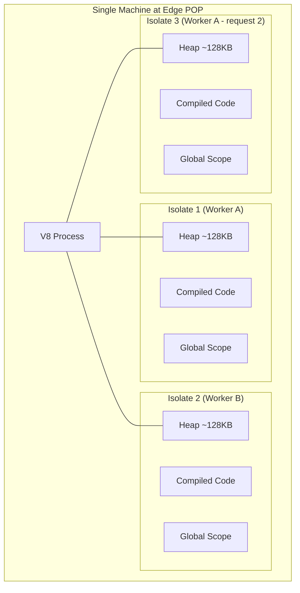
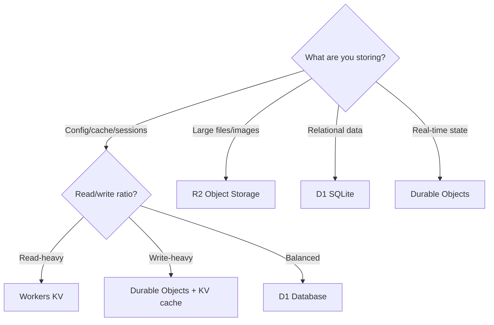

# Cloudflare Workers

## Why Cloudflare Workers Matter

Cloudflare Workers pioneered the V8 isolate model for serverless edge computing when they launched in 2017. Running on Cloudflare's network of 300+ data centers worldwide, Workers execute JavaScript/TypeScript within 50ms of 95% of the world's internet-connected population. The platform has expanded from simple request handlers to a full application platform with storage (KV, R2), databases (D1), coordination primitives (Durable Objects), queues, and AI inference.

Workers changed the economics of edge computing: the free tier handles 100,000 requests/day, and paid plans start at $5/month for 10 million requests. This made edge computing accessible to solo developers and startups, not just enterprises.

### Historical Context

- **2017**: Cloudflare Workers launches — JS execution at the edge using V8 isolates.
- **2018**: Workers KV — globally distributed key-value store.
- **2019**: Workers Sites — static site hosting via KV.
- **2020**: Durable Objects — strongly consistent coordination primitives. Cron Triggers for scheduled execution.
- **2021**: R2 — S3-compatible object storage with zero egress fees. D1 announced.
- **2022**: Queues — message queues at the edge. D1 enters open beta.
- **2023**: Workers AI — AI inference at the edge. Hyperdrive — connection pooling for external databases.
- **2024+**: D1 GA, Workflows, larger CPU time limits, Node.js compatibility improvements.

## First Principles

### V8 Isolate Architecture



Each isolate has:
- Its own JavaScript heap (isolated from other isolates)
- Its own global scope (no shared mutable state)
- Access to the same compiled code (shared read-only)
- Security isolation via V8's isolate boundary (same security model as Chrome tabs)

### Worker Execution Model

```typescript
// A Worker is an ES module that exports a fetch handler
export interface Env {
  // Bindings configured in wrangler.toml
  MY_KV: KVNamespace;
  MY_R2: R2Bucket;
  MY_D1: D1Database;
  MY_DO: DurableObjectNamespace;
  MY_QUEUE: Queue;
  API_KEY: string; // Secret
}

export default {
  // HTTP request handler
  async fetch(
    request: Request,
    env: Env,
    ctx: ExecutionContext
  ): Promise<Response> {
    // ctx.waitUntil() — extend worker lifetime for background work
    // ctx.passThroughOnException() — fall through to origin on error

    return new Response('Hello, World!');
  },

  // Scheduled handler (cron triggers)
  async scheduled(
    controller: ScheduledController,
    env: Env,
    ctx: ExecutionContext
  ): Promise<void> {
    ctx.waitUntil(doScheduledWork(env));
  },

  // Queue consumer
  async queue(
    batch: MessageBatch,
    env: Env,
    ctx: ExecutionContext
  ): Promise<void> {
    for (const message of batch.messages) {
      await processMessage(message.body);
      message.ack();
    }
  },
};
```

## Core Mechanics

### Workers KV

KV is a globally distributed key-value store optimized for read-heavy workloads. Writes propagate globally within ~60 seconds (eventual consistency).

```typescript
interface Env {
  CACHE: KVNamespace;
}

export default {
  async fetch(request: Request, env: Env): Promise<Response> {
    const url = new URL(request.url);

    // Read operations
    // get() returns null if key doesn't exist
    const textValue = await env.CACHE.get('config');
    const jsonValue = await env.CACHE.get('user:123', 'json');
    const binaryValue = await env.CACHE.get('image', 'arrayBuffer');
    const streamValue = await env.CACHE.get('large-file', 'stream');

    // Read with metadata
    const { value, metadata } = await env.CACHE.getWithMetadata(
      'article:456', 'json'
    );

    // Write operations
    await env.CACHE.put('key', 'value');

    // With expiration
    await env.CACHE.put('session:abc', JSON.stringify(sessionData), {
      expirationTtl: 3600, // Seconds from now
      // OR: expiration: Math.floor(Date.now() / 1000) + 3600, // Unix timestamp
    });

    // With metadata (stored alongside the value, returned on read)
    await env.CACHE.put('article:789', JSON.stringify(article), {
      expirationTtl: 86400,
      metadata: { author: 'John', version: 3 },
    });

    // Delete
    await env.CACHE.delete('old-key');

    // List keys (paginated, max 1000 per call)
    const listed = await env.CACHE.list({
      prefix: 'user:', // Filter by prefix
      limit: 100,
      cursor: undefined, // For pagination
    });

    return Response.json({
      keys: listed.keys.map(k => k.name),
      complete: listed.list_complete,
      cursor: listed.cursor,
    });
  },
};
```

**KV Characteristics**:

| Property | Value |
|----------|-------|
| Read latency | 1-10ms (cached at POP) |
| Write latency | 20-50ms (propagation: ~60s globally) |
| Max value size | 25MB |
| Max key size | 512 bytes |
| Consistency | Eventual (~60s) |
| Max operations/sec | 1,000 writes/sec per namespace |
| Free tier | 100,000 reads/day, 1,000 writes/day |

### R2 Object Storage

R2 is S3-compatible object storage with zero egress fees:

```typescript
interface Env {
  ASSETS: R2Bucket;
}

export default {
  async fetch(request: Request, env: Env): Promise<Response> {
    const url = new URL(request.url);
    const key = url.pathname.slice(1); // Remove leading slash

    if (request.method === 'GET') {
      const object = await env.ASSETS.get(key);
      if (!object) {
        return new Response('Not Found', { status: 404 });
      }

      const headers = new Headers();
      object.writeHttpMetadata(headers);
      headers.set('etag', object.httpEtag);
      headers.set('cache-control', 'public, max-age=86400');

      // Conditional request support
      const ifNoneMatch = request.headers.get('if-none-match');
      if (ifNoneMatch === object.httpEtag) {
        return new Response(null, { status: 304, headers });
      }

      return new Response(object.body, { headers });
    }

    if (request.method === 'PUT') {
      const contentType = request.headers.get('content-type') || 'application/octet-stream';

      await env.ASSETS.put(key, request.body!, {
        httpMetadata: { contentType },
        customMetadata: {
          uploadedBy: 'worker',
          uploadedAt: new Date().toISOString(),
        },
      });

      return new Response('Created', { status: 201 });
    }

    if (request.method === 'DELETE') {
      await env.ASSETS.delete(key);
      return new Response('Deleted', { status: 200 });
    }

    return new Response('Method Not Allowed', { status: 405 });
  },
};
```

### D1 — SQLite at the Edge

D1 runs SQLite at the edge, with read replicas distributed globally:

```typescript
interface Env {
  DB: D1Database;
}

export default {
  async fetch(request: Request, env: Env): Promise<Response> {
    const url = new URL(request.url);

    if (url.pathname === '/api/users' && request.method === 'GET') {
      const { results } = await env.DB.prepare(
        'SELECT id, name, email, created_at FROM users ORDER BY created_at DESC LIMIT 50'
      ).all();

      return Response.json(results);
    }

    if (url.pathname === '/api/users' && request.method === 'POST') {
      const body = await request.json() as { name: string; email: string };

      const result = await env.DB.prepare(
        'INSERT INTO users (name, email) VALUES (?, ?) RETURNING id'
      ).bind(body.name, body.email).first();

      return Response.json(result, { status: 201 });
    }

    if (url.pathname.startsWith('/api/users/') && request.method === 'GET') {
      const id = url.pathname.split('/').pop();
      const user = await env.DB.prepare(
        'SELECT * FROM users WHERE id = ?'
      ).bind(id).first();

      if (!user) {
        return new Response('Not Found', { status: 404 });
      }

      return Response.json(user);
    }

    // Batch operations (transaction)
    if (url.pathname === '/api/transfer' && request.method === 'POST') {
      const { from, to, amount } = await request.json() as {
        from: number; to: number; amount: number;
      };

      const results = await env.DB.batch([
        env.DB.prepare(
          'UPDATE accounts SET balance = balance - ? WHERE id = ? AND balance >= ?'
        ).bind(amount, from, amount),
        env.DB.prepare(
          'UPDATE accounts SET balance = balance + ? WHERE id = ?'
        ).bind(amount, to),
      ]);

      const debitResult = results[0];
      if (debitResult.meta.changes === 0) {
        return Response.json({ error: 'Insufficient funds' }, { status: 400 });
      }

      return Response.json({ success: true });
    }

    return new Response('Not Found', { status: 404 });
  },
};
```

### Durable Objects — Strongly Consistent Edge State

Durable Objects provide single-threaded, strongly consistent state at the edge. Each Durable Object instance runs in exactly one location and handles requests sequentially:

```typescript
// Durable Object class
export class RateLimiter {
  private state: DurableObjectState;
  private requests: Map<string, number[]> = new Map();

  constructor(state: DurableObjectState, env: Env) {
    this.state = state;
  }

  async fetch(request: Request): Promise<Response> {
    const url = new URL(request.url);
    const ip = url.searchParams.get('ip') || 'unknown';
    const limit = parseInt(url.searchParams.get('limit') || '100');
    const windowMs = parseInt(url.searchParams.get('window') || '60000');

    const now = Date.now();
    const windowStart = now - windowMs;

    // Get existing timestamps for this IP
    let timestamps = this.requests.get(ip) || [];

    // Remove expired timestamps
    timestamps = timestamps.filter(t => t > windowStart);

    if (timestamps.length >= limit) {
      const retryAfter = Math.ceil((timestamps[0] + windowMs - now) / 1000);
      return Response.json(
        { allowed: false, remaining: 0, retryAfter },
        { status: 429 }
      );
    }

    timestamps.push(now);
    this.requests.set(ip, timestamps);

    // Persist to durable storage (survives isolate eviction)
    await this.state.storage.put(`ip:${ip}`, timestamps);

    return Response.json({
      allowed: true,
      remaining: limit - timestamps.length,
    });
  }
}

// Worker that routes to the Durable Object
export default {
  async fetch(request: Request, env: Env): Promise<Response> {
    // Route all rate limit checks for the same IP to the same DO instance
    const ip = request.headers.get('CF-Connecting-IP') || 'unknown';
    const id = env.RATE_LIMITER.idFromName(ip);
    const stub = env.RATE_LIMITER.get(id);

    return stub.fetch(request);
  },
};
```

**Durable Objects for WebSocket Chat**:

```typescript
export class ChatRoom {
  private sessions: Map<string, WebSocket> = new Map();
  private state: DurableObjectState;

  constructor(state: DurableObjectState) {
    this.state = state;
  }

  async fetch(request: Request): Promise<Response> {
    if (request.headers.get('Upgrade') !== 'websocket') {
      return new Response('Expected WebSocket', { status: 400 });
    }

    const pair = new WebSocketPair();
    const [client, server] = Object.values(pair);
    const sessionId = crypto.randomUUID();

    this.state.acceptWebSocket(server);
    this.sessions.set(sessionId, server);

    server.addEventListener('message', (event) => {
      const data = JSON.parse(event.data as string);

      // Broadcast to all connected clients
      for (const [id, ws] of this.sessions) {
        if (id !== sessionId) {
          try {
            ws.send(JSON.stringify({
              type: 'message',
              from: sessionId,
              text: data.text,
              timestamp: Date.now(),
            }));
          } catch {
            this.sessions.delete(id);
          }
        }
      }
    });

    server.addEventListener('close', () => {
      this.sessions.delete(sessionId);
    });

    return new Response(null, { status: 101, webSocket: client });
  }
}
```

## Edge Cases and Failure Modes

### 1. KV Eventual Consistency

```typescript
// Write from US POP, read from EU POP immediately — may see stale data

// Mitigation: Use Cache API for request-level deduplication
export default {
  async fetch(request: Request, env: Env): Promise<Response> {
    const cache = caches.default;
    const cacheKey = new Request(request.url);

    // Check edge cache first (local to POP)
    const cached = await cache.match(cacheKey);
    if (cached) return cached;

    // Then check KV
    const kvData = await env.KV.get('data', 'json');
    if (kvData) {
      const response = Response.json(kvData);
      // Cache at this POP for 30 seconds
      response.headers.set('Cache-Control', 's-maxage=30');
      await cache.put(cacheKey, response.clone());
      return response;
    }

    // Fall back to origin
    return fetch(request);
  },
};
```

### 2. Durable Object Single-Point Routing

```typescript
// All requests for a DO go to ONE location worldwide
// If a DO is created in US-East, Tokyo users have ~200ms latency to reach it

// Mitigation: Use location hints (Cloudflare feature)
const id = env.MY_DO.idFromName('room-tokyo');
// Cloudflare routes to the nearest location supporting DOs
// But once created, the DO stays in that location

// For read-heavy workloads, use KV as a read cache in front of DO:
async function getWithReadCache(
  env: Env,
  doName: string,
  key: string
): Promise<unknown> {
  // Check KV first (fast, globally cached)
  const cached = await env.READ_CACHE.get(`${doName}:${key}`, 'json');
  if (cached) return cached;

  // Miss: fetch from DO
  const id = env.MY_DO.idFromName(doName);
  const stub = env.MY_DO.get(id);
  const response = await stub.fetch(`https://do/get?key=${key}`);
  const data = await response.json();

  // Cache in KV for subsequent reads
  await env.READ_CACHE.put(`${doName}:${key}`, JSON.stringify(data), {
    expirationTtl: 30,
  });

  return data;
}
```

### 3. D1 Write Bottleneck

```typescript
// D1 writes go to the primary (single location)
// Reads are served from replicas (globally distributed)

// For write-heavy workloads, batch writes:
async function batchInsert(db: D1Database, items: unknown[]): Promise<void> {
  const BATCH_SIZE = 100;

  for (let i = 0; i < items.length; i += BATCH_SIZE) {
    const batch = items.slice(i, i + BATCH_SIZE);
    const statements = batch.map(item =>
      db.prepare(
        'INSERT INTO events (type, data, created_at) VALUES (?, ?, ?)'
      ).bind(item.type, JSON.stringify(item.data), new Date().toISOString())
    );

    await db.batch(statements);
  }
}
```

### 4. Worker Size Limits

```typescript
// Compiled worker must be under 10MB (free) or configurable (paid)
// Large dependencies (e.g., full AWS SDK) can exceed this

// Fix: Use minimal imports
// BAD:
import AWS from 'aws-sdk'; // 50MB+ uncompressed

// GOOD:
import { S3Client, GetObjectCommand } from '@aws-sdk/client-s3';
// Only imports the S3 client (~200KB)
```

::: info War Story
**The Durable Object That Became a Hot Spot**

A real-time leaderboard used a single Durable Object to maintain the top 100 scores. During a viral gaming event, 50,000 requests/second tried to update the leaderboard. Since all requests went to a single DO instance (single-threaded), they queued up and latency spiked to 30 seconds.

The fix was sharding: 256 Durable Objects, each maintaining scores for a hash-range of user IDs. A Worker aggregated the top scores from all shards periodically and cached the combined leaderboard in KV. This reduced per-DO load to ~200 requests/second and kept latency under 50ms.
:::

::: info War Story
**The KV Migration That Broke Caching**

A team migrated from in-Worker caching (a global Map) to KV for cross-POP consistency. They did not realize that KV `get()` is an async operation with 1-5ms latency, while their Map lookups were ~0.001ms. Their hot path made 20 KV lookups per request, adding 20-100ms of latency — worse than before.

The fix was a two-tier approach: the Cache API (local to the POP, ~0.1ms) as L1, KV as L2. The Worker checked the Cache API first, falling back to KV only on local cache miss. This provided the best of both worlds: sub-millisecond reads with global consistency.
:::

## Performance Characteristics

### Latency by Service

| Service | Read Latency | Write Latency | Consistency | Use Case |
|---------|-------------|---------------|-------------|----------|
| Cache API | 0.1-1ms | 0.1-1ms | POP-local | Hot data deduplication |
| KV | 1-10ms | 20-50ms + 60s propagation | Eventual | Config, cached API responses |
| R2 | 10-50ms | 50-200ms | Strong (per-region) | File storage, assets |
| D1 Read | 2-10ms | — | Read replica | Queries, lookups |
| D1 Write | — | 30-100ms | Strong (primary) | Mutations |
| Durable Objects | 1-5ms (colocated) | 1-5ms | Strong | Coordination, WebSocket |

### Cost Comparison

| Resource | Free Tier | Paid Plan |
|----------|-----------|-----------|
| Worker requests | 100K/day | $0.30/M requests |
| KV reads | 100K/day | $0.50/M reads |
| KV writes | 1K/day | $5.00/M writes |
| KV storage | 1GB | $0.50/GB-month |
| R2 storage | 10GB | $0.015/GB-month |
| R2 operations | 10M reads, 1M writes | $0.36/M reads, $4.50/M writes |
| D1 reads | 5M/day | $0.001/M rows read |
| D1 writes | 100K/day | $1.00/M rows written |
| D1 storage | 5GB | $0.75/GB-month |
| DO requests | Included with paid | $0.15/M requests |
| DO storage | 1GB | $0.20/GB-month |

## Mathematical Foundations

### Isolate Startup Cost Model

The time to execute a Worker request:

$$
T_{\text{total}} = T_{\text{routing}} + T_{\text{isolate}} + T_{\text{execute}} + T_{\text{response}}
$$

Where:
- $T_{\text{routing}}$ = anycast routing to nearest POP (~1-5ms)
- $T_{\text{isolate}}$ = isolate startup (0ms if warm, 5ms if cold)
- $T_{\text{execute}}$ = actual function execution
- $T_{\text{response}}$ = response transmission to client

For a warm isolate serving a cached response:

$$
T_{\text{total}} = 3 + 0 + 0.5 + 2 = 5.5\text{ms}
$$

### KV Consistency Model

KV uses a write-ahead log replicated globally. The consistency window:

$$
T_{\text{consistency}} = T_{\text{write\_ack}} + T_{\text{replication}}
$$

Where $T_{\text{write\_ack}} \approx 20\text{ms}$ and $T_{\text{replication}} \approx 60\text{s}$ (worst case, global).

Within a single POP, consistency is much faster (~100ms).

## Decision Framework

### Choosing the Right Storage



| Storage | Best For | Not For |
|---------|----------|---------|
| KV | Config, cached API data, feature flags | Frequent writes, transactions |
| R2 | Images, videos, static assets, backups | Frequent small reads |
| D1 | Relational queries, user data | High write throughput |
| Durable Objects | WebSocket, counters, rate limiting | Read-heavy global data |
| Cache API | POP-local hot data | Cross-POP consistency |

## Advanced Topics

### Hyperdrive — Connection Pooling for External Databases

Hyperdrive maintains persistent connection pools to external databases (PostgreSQL, MySQL) from Cloudflare's network, eliminating the connection overhead for each Worker invocation:

```typescript
interface Env {
  HYPERDRIVE: Hyperdrive;
}

export default {
  async fetch(request: Request, env: Env): Promise<Response> {
    // Hyperdrive provides a connection string to use with any PostgreSQL client
    const connectionString = env.HYPERDRIVE.connectionString;

    // Use with pg driver
    const client = new Client(connectionString);
    await client.connect();

    const { rows } = await client.query('SELECT * FROM users LIMIT 10');
    await client.end();

    return Response.json(rows);
  },
};
```

### Workflows — Durable Execution

```typescript
// Workers Workflows: long-running, durable execution chains
export class OrderWorkflow extends WorkflowEntrypoint {
  async run(event: WorkflowEvent, step: WorkflowStep) {
    // Each step is durable — if the worker crashes, it resumes from the last completed step

    const order = await step.do('validate-order', async () => {
      return validateOrder(event.payload);
    });

    const payment = await step.do('process-payment', async () => {
      return processPayment(order);
    });

    await step.do('send-confirmation', async () => {
      return sendEmail(order.email, payment.receiptUrl);
    });

    // Wait for external event (e.g., shipment tracking)
    const shipped = await step.waitForEvent('shipment-confirmed', {
      timeout: '7 days',
    });

    await step.do('notify-shipped', async () => {
      return sendEmail(order.email, shipped.trackingUrl);
    });
  }
}
```

::: tip Key Takeaway
Cloudflare Workers is the most mature and feature-rich edge computing platform. Start with Workers + KV for API caching and static serving. Add D1 when you need relational data at the edge. Use Durable Objects only when you need strong consistency or WebSocket support. The platform's pricing model (pay-per-request with generous free tiers) makes it economically viable for projects of any size.
:::

## Cross-References

- [Edge Computing Overview](./index.md) — architecture context
- [Edge Runtime Constraints](./edge-runtime-constraints.md) — what you cannot do
- [Edge Caching](../caching-strategies/edge-caching.md) — caching patterns with Workers
- [Deno Deploy](./deno-deploy.md) — alternative edge platform
- [Vercel Edge](./vercel-edge.md) — Next.js-focused edge platform
