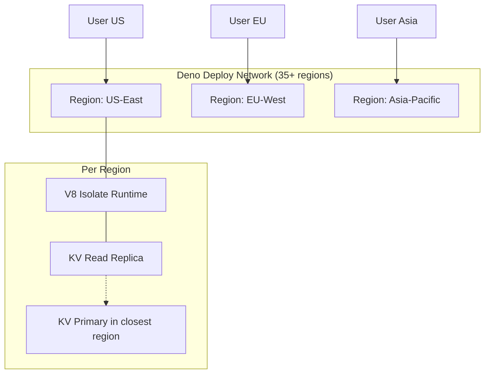

# Deno Deploy

## Why Deno Deploy Exists

Deno Deploy is Deno's globally distributed V8 isolate platform, running on 35+ data centers worldwide. It differentiates itself from Cloudflare Workers in three key ways: (1) native TypeScript support without bundling, (2) direct compatibility with Deno's standard library and npm packages, and (3) Deno KV — a globally distributed database built into the runtime with ACID transactions.

Deno Deploy runs the same Deno runtime used locally, which means code that works in `deno run` works in Deno Deploy with minimal changes. This eliminates the "works locally, breaks at the edge" problem that plagues platforms with custom runtimes.

### Historical Context

- **2018**: Ryan Dahl announces Deno as a successor to Node.js at JSConf EU.
- **2020**: Deno 1.0 released — secure-by-default runtime with TypeScript support.
- **2021**: Deno Deploy enters beta — globally distributed V8 isolates.
- **2022**: Fresh framework — full-stack web framework designed for Deno Deploy. Deno KV announced.
- **2023**: Deno KV enters open beta with global replication. npm compatibility improves significantly.
- **2024+**: Deno 2.0 — full Node.js compatibility, Deno KV GA, Queues, Cron.

## First Principles

### Deno Deploy Architecture



### How Deno Deploy Differs from Cloudflare Workers

| Feature | Deno Deploy | Cloudflare Workers |
|---------|-------------|-------------------|
| Language | TypeScript/JavaScript (Deno runtime) | JavaScript/TypeScript (custom V8) |
| Module system | ES Modules + npm: + jsr: | ES Modules (bundled) |
| Standard library | Deno std library | Web APIs only |
| Built-in database | Deno KV (ACID transactions) | D1 (SQLite), KV (eventual) |
| npm support | Native (node_modules) | Via bundler |
| Local development | `deno serve` (same runtime) | `wrangler dev` (miniflare) |
| POP count | 35+ | 300+ |
| Free tier | 100K requests/day, 1M KV reads | 100K requests/day |
| Cold start | <10ms | <5ms |
| Max CPU time | 50ms free, 10s paid | 10ms free, 30s paid |
| Pricing | Free + $10/month pro | Free + $5/month paid |

## Core Mechanics

### Basic Deno Deploy Application

```typescript
// main.ts — runs identically locally and on Deno Deploy
// deno serve main.ts (local)
// deployctl deploy --project=myapp --entrypoint=main.ts (deploy)

export default {
  async fetch(request: Request): Promise<Response> {
    const url = new URL(request.url);

    // Router
    switch (url.pathname) {
      case '/':
        return new Response('Hello from Deno Deploy!', {
          headers: { 'Content-Type': 'text/plain' },
        });

      case '/api/time':
        return Response.json({
          time: new Date().toISOString(),
          region: Deno.env.get('DENO_REGION') || 'local',
        });

      case '/api/headers':
        const headers: Record<string, string> = {};
        for (const [key, value] of request.headers) {
          headers[key] = value;
        }
        return Response.json(headers);

      default:
        return new Response('Not Found', { status: 404 });
    }
  },
};
```

### Deno KV — Built-in Global Database

Deno KV is a key-value database with:
- **Strong consistency** within a region.
- **Eventual consistency** across regions (configurable).
- **ACID transactions** with optimistic concurrency control.
- **Ordered keys** enabling range queries and prefix scans.

```typescript
// Open KV database (automatic on Deno Deploy)
const kv = await Deno.openKv();

// Key structure: arrays of strings, numbers, booleans, Uint8Arrays
// Keys are sorted lexicographically by each part

// Basic CRUD
await kv.set(["users", 1], { name: "Alice", email: "alice@example.com" });
await kv.set(["users", 2], { name: "Bob", email: "bob@example.com" });

const result = await kv.get(["users", 1]);
console.log(result.value); // { name: "Alice", email: "alice@example.com" }
console.log(result.versionstamp); // Used for optimistic concurrency

// Delete
await kv.delete(["users", 1]);

// List with prefix (range scan)
const users = kv.list({ prefix: ["users"] });
for await (const entry of users) {
  console.log(entry.key, entry.value);
}

// List with range
const recentUsers = kv.list({
  start: ["users", 100],
  end: ["users", 200],
});

// List with limit and reverse
const topUsers = kv.list(
  { prefix: ["users"] },
  { limit: 10, reverse: true }
);
```

### Deno KV Transactions

```typescript
// Atomic transactions with optimistic concurrency control
const kv = await Deno.openKv();

// Transfer funds between accounts
async function transfer(
  fromId: string,
  toId: string,
  amount: number
): Promise<boolean> {
  // Read both accounts
  const fromEntry = await kv.get<{ balance: number }>(["accounts", fromId]);
  const toEntry = await kv.get<{ balance: number }>(["accounts", toId]);

  if (!fromEntry.value || !toEntry.value) {
    throw new Error("Account not found");
  }

  if (fromEntry.value.balance < amount) {
    throw new Error("Insufficient funds");
  }

  // Atomic transaction — fails if either version has changed
  const result = await kv.atomic()
    .check(fromEntry) // Verify version hasn't changed
    .check(toEntry)   // Verify version hasn't changed
    .set(["accounts", fromId], {
      balance: fromEntry.value.balance - amount,
    })
    .set(["accounts", toId], {
      balance: toEntry.value.balance + amount,
    })
    .commit();

  return result.ok;
  // If result.ok is false, another transaction modified the data
  // The caller should retry
}

// Retry wrapper for optimistic concurrency
async function transferWithRetry(
  fromId: string,
  toId: string,
  amount: number,
  maxRetries: number = 5
): Promise<void> {
  for (let attempt = 0; attempt < maxRetries; attempt++) {
    const success = await transfer(fromId, toId, amount);
    if (success) return;
    // Exponential backoff
    await new Promise(r => setTimeout(r, Math.pow(2, attempt) * 10));
  }
  throw new Error(`Transfer failed after ${maxRetries} retries`);
}
```

### Secondary Indexes with KV

Deno KV is a key-value store, but you can model secondary indexes manually:

```typescript
const kv = await Deno.openKv();

interface User {
  id: string;
  name: string;
  email: string;
  role: string;
}

// Create a user with secondary indexes
async function createUser(user: User): Promise<void> {
  const result = await kv.atomic()
    // Primary key
    .set(["users", user.id], user)
    // Secondary index: email -> user id
    .set(["users_by_email", user.email], user.id)
    // Secondary index: role -> user id (for listing by role)
    .set(["users_by_role", user.role, user.id], user.id)
    .commit();

  if (!result.ok) {
    throw new Error("Failed to create user");
  }
}

// Look up by email
async function getUserByEmail(email: string): Promise<User | null> {
  const idEntry = await kv.get<string>(["users_by_email", email]);
  if (!idEntry.value) return null;

  const userEntry = await kv.get<User>(["users", idEntry.value]);
  return userEntry.value;
}

// List users by role
async function getUsersByRole(role: string): Promise<User[]> {
  const entries = kv.list<string>({ prefix: ["users_by_role", role] });
  const users: User[] = [];

  for await (const entry of entries) {
    const user = await kv.get<User>(["users", entry.value]);
    if (user.value) users.push(user.value);
  }

  return users;
}

// Delete user (must remove all indexes)
async function deleteUser(user: User): Promise<void> {
  await kv.atomic()
    .delete(["users", user.id])
    .delete(["users_by_email", user.email])
    .delete(["users_by_role", user.role, user.id])
    .commit();
}
```

### BroadcastChannel for Cross-Isolate Communication

```typescript
// BroadcastChannel sends messages to all isolates in all regions
const channel = new BroadcastChannel("cache-invalidation");

// Listen for invalidation messages
channel.onmessage = (event: MessageEvent) => {
  const { type, key } = event.data;
  if (type === "invalidate") {
    localCache.delete(key);
  }
};

// When data changes, broadcast to all regions
async function updateAndInvalidate(
  kv: Deno.Kv,
  key: string[],
  value: unknown
): Promise<void> {
  await kv.set(key, value);

  // Notify all isolates worldwide to invalidate their local caches
  channel.postMessage({
    type: "invalidate",
    key: key.join(":"),
  });
}
```

## Implementation: Full Application

```typescript
// A complete CRUD API running on Deno Deploy with KV

const kv = await Deno.openKv();

interface Task {
  id: string;
  title: string;
  completed: boolean;
  createdAt: string;
  updatedAt: string;
}

export default {
  async fetch(request: Request): Promise<Response> {
    const url = new URL(request.url);
    const method = request.method;

    // CORS headers
    const corsHeaders = {
      "Access-Control-Allow-Origin": "*",
      "Access-Control-Allow-Methods": "GET, POST, PUT, DELETE",
      "Access-Control-Allow-Headers": "Content-Type",
    };

    if (method === "OPTIONS") {
      return new Response(null, { headers: corsHeaders });
    }

    try {
      // GET /api/tasks — list all tasks
      if (url.pathname === "/api/tasks" && method === "GET") {
        const entries = kv.list<Task>({ prefix: ["tasks"] });
        const tasks: Task[] = [];
        for await (const entry of entries) {
          tasks.push(entry.value);
        }
        return Response.json(tasks, { headers: corsHeaders });
      }

      // POST /api/tasks — create task
      if (url.pathname === "/api/tasks" && method === "POST") {
        const body = await request.json() as { title: string };
        const task: Task = {
          id: crypto.randomUUID(),
          title: body.title,
          completed: false,
          createdAt: new Date().toISOString(),
          updatedAt: new Date().toISOString(),
        };

        await kv.set(["tasks", task.id], task);
        return Response.json(task, {
          status: 201,
          headers: corsHeaders,
        });
      }

      // PUT /api/tasks/:id — update task
      const taskMatch = url.pathname.match(/^\/api\/tasks\/(.+)$/);
      if (taskMatch && method === "PUT") {
        const id = taskMatch[1];
        const entry = await kv.get<Task>(["tasks", id]);
        if (!entry.value) {
          return Response.json(
            { error: "Not found" },
            { status: 404, headers: corsHeaders }
          );
        }

        const body = await request.json() as Partial<Task>;
        const updated: Task = {
          ...entry.value,
          ...body,
          id, // Prevent ID change
          updatedAt: new Date().toISOString(),
        };

        // Optimistic concurrency
        const result = await kv.atomic()
          .check(entry)
          .set(["tasks", id], updated)
          .commit();

        if (!result.ok) {
          return Response.json(
            { error: "Conflict — task was modified" },
            { status: 409, headers: corsHeaders }
          );
        }

        return Response.json(updated, { headers: corsHeaders });
      }

      // DELETE /api/tasks/:id
      if (taskMatch && method === "DELETE") {
        const id = taskMatch[1];
        await kv.delete(["tasks", id]);
        return new Response(null, { status: 204, headers: corsHeaders });
      }

      return Response.json(
        { error: "Not Found" },
        { status: 404, headers: corsHeaders }
      );
    } catch (error) {
      console.error(error);
      return Response.json(
        { error: "Internal Server Error" },
        { status: 500, headers: corsHeaders }
      );
    }
  },
};
```

## Edge Cases and Failure Modes

### 1. KV Transaction Contention

```typescript
// High-contention key (e.g., global counter) causes frequent transaction failures

// BAD: Increment a single counter
async function increment(): Promise<number> {
  const entry = await kv.get<number>(["counter"]);
  const newVal = (entry.value || 0) + 1;
  const result = await kv.atomic()
    .check(entry)
    .set(["counter"], newVal)
    .commit();
  // At 1000 req/sec, most transactions fail due to contention
  return newVal;
}

// FIX: Shard the counter
async function incrementSharded(): Promise<void> {
  const shard = Math.floor(Math.random() * 100);
  const entry = await kv.get<number>(["counter_shard", shard]);
  const newVal = (entry.value || 0) + 1;
  await kv.atomic()
    .check(entry)
    .set(["counter_shard", shard], newVal)
    .commit();
}

async function getTotal(): Promise<number> {
  const entries = kv.list<number>({ prefix: ["counter_shard"] });
  let total = 0;
  for await (const entry of entries) {
    total += entry.value;
  }
  return total;
}
```

### 2. KV Key Ordering Surprises

```typescript
// KV keys are sorted lexicographically
// Numbers are NOT sorted numerically by default

await kv.set(["items", 1], "one");
await kv.set(["items", 2], "two");
await kv.set(["items", 10], "ten");

// Listing order: 1, 10, 2 (lexicographic!)
// Deno KV handles this correctly with number parts — they ARE sorted numerically
// But string representations of numbers are sorted lexicographically:
await kv.set(["items", "1"], "one");
await kv.set(["items", "2"], "two");
await kv.set(["items", "10"], "ten");
// Order: "1", "10", "2" — surprise!

// FIX: Use number type for numeric keys, or pad strings
await kv.set(["items", "0001"], "one");
await kv.set(["items", "0002"], "two");
await kv.set(["items", "0010"], "ten");
// Order: "0001", "0002", "0010" — correct!
```

### 3. Large Value Size

```typescript
// KV values have a 64KB limit per entry
// Larger values need to be chunked

async function setLargeValue(
  kv: Deno.Kv,
  key: string[],
  data: Uint8Array
): Promise<void> {
  const CHUNK_SIZE = 60_000; // Leave headroom
  const chunks = Math.ceil(data.length / CHUNK_SIZE);

  const ops = kv.atomic();
  ops.set([...key, "_meta"], { chunks, totalSize: data.length });

  for (let i = 0; i < chunks; i++) {
    const chunk = data.slice(i * CHUNK_SIZE, (i + 1) * CHUNK_SIZE);
    ops.set([...key, "_chunk", i], chunk);
  }

  await ops.commit();
}

async function getLargeValue(
  kv: Deno.Kv,
  key: string[]
): Promise<Uint8Array | null> {
  const meta = await kv.get<{ chunks: number; totalSize: number }>([...key, "_meta"]);
  if (!meta.value) return null;

  const result = new Uint8Array(meta.value.totalSize);
  let offset = 0;

  for (let i = 0; i < meta.value.chunks; i++) {
    const chunk = await kv.get<Uint8Array>([...key, "_chunk", i]);
    if (!chunk.value) throw new Error(`Missing chunk ${i}`);
    result.set(chunk.value, offset);
    offset += chunk.value.length;
  }

  return result;
}
```

::: info War Story
**The KV Counter That Lost Counts**

A team used Deno KV to track page views with a simple atomic increment. At low traffic, it worked perfectly. At launch, with 5,000 views/second, 80% of atomic transactions failed due to contention on the single counter key. The team initially added retry logic, which made things worse — retries increased contention.

The fix was counter sharding: 256 shards, each incremented by random selection. The total count was computed by summing all shards. Transaction success rate jumped to 99.5%, and the summing query (256 KV reads) was cached for 5 seconds using a simple in-memory timer.
:::

::: info War Story
**The Deploy That Worked Locally But Not Globally**

A Deno Deploy application read a configuration file on startup using `Deno.readTextFile("./config.json")`. This worked perfectly with `deno run` locally. On Deploy, it failed because there is no filesystem. The configuration file was not bundled with the deployment.

The fix was twofold: (1) use environment variables for configuration (`Deno.env.get("CONFIG")`), (2) for complex configuration, store it in Deno KV and read it on first request. The team added a CI step to upload config to KV before deploying.
:::

## Performance Characteristics

### Deno KV Latency

| Operation | Same Region | Cross Region |
|-----------|------------|--------------|
| get() | 2-5ms | 50-200ms |
| set() | 5-10ms | 5-10ms (write to primary) |
| list() per entry | 0.1ms | 0.1ms |
| atomic() commit | 5-15ms | 5-15ms |
| Replication lag | N/A | 100-500ms |

### Throughput Limits

| Resource | Free | Pro |
|----------|------|-----|
| Requests/month | 3M | 15M |
| KV reads/month | 1.5M | 15M |
| KV writes/month | 300K | 3M |
| KV storage | 1GB | 5GB |
| CPU time/request | 50ms | 10s |
| Request body | 1MB | 10MB |

## Decision Framework

### When to Choose Deno Deploy

| Scenario | Deno Deploy? | Reason |
|----------|-------------|--------|
| Full Deno/TypeScript stack | Yes | Native runtime, no bundling |
| Need built-in database | Yes | Deno KV with ACID transactions |
| Need > 200 edge locations | No | 35+ POPs (vs Cloudflare 300+) |
| Large npm dependency tree | Maybe | npm compat has improved, but some packages still fail |
| Need WebSocket | Yes | Built-in support |
| Need object storage | No | No native blob storage (use S3) |
| Fresh/Deno framework | Yes | First-class support |
| Need Durable Objects equivalent | No | Use KV atomic transactions instead |

## Advanced Topics

### Cron Jobs on Deno Deploy

```typescript
// Deno.cron — scheduled tasks on Deno Deploy

Deno.cron("Daily cleanup", "0 0 * * *", async () => {
  const kv = await Deno.openKv();
  const cutoff = Date.now() - 30 * 24 * 60 * 60 * 1000; // 30 days ago

  const oldEntries = kv.list({ prefix: ["temp"] });
  let deleted = 0;

  for await (const entry of oldEntries) {
    const value = entry.value as { createdAt: number };
    if (value.createdAt < cutoff) {
      await kv.delete(entry.key);
      deleted++;
    }
  }

  console.log(`Cleaned up ${deleted} old entries`);
});

Deno.cron("Health check", "*/5 * * * *", async () => {
  const response = await fetch("https://api.example.com/health");
  if (!response.ok) {
    await sendAlert(`API health check failed: ${response.status}`);
  }
});
```

### Queues for Background Processing

```typescript
const kv = await Deno.openKv();

// Enqueue a message
await kv.enqueue({ type: "send-email", to: "user@example.com", subject: "Welcome" });

// Listen for queue messages
kv.listenQueue(async (message: unknown) => {
  const msg = message as { type: string; to: string; subject: string };

  if (msg.type === "send-email") {
    await sendEmail(msg.to, msg.subject);
    console.log(`Sent email to ${msg.to}`);
  }
});
```

::: tip Key Takeaway
Deno Deploy is ideal for teams that have standardized on Deno and TypeScript and want a built-in, globally distributed database without managing external services. Deno KV's ACID transactions and ordered key-value model are uniquely powerful for edge applications that need strong consistency. The platform has fewer edge locations than Cloudflare but offers a more developer-friendly experience with identical local and production runtimes.
:::

## Cross-References

- [Edge Computing Overview](./index.md) — architecture context
- [Edge Runtime Constraints](./edge-runtime-constraints.md) — general edge limitations
- [Cloudflare Workers](./cloudflare-workers.md) — alternative edge platform comparison
- [Vercel Edge](./vercel-edge.md) — framework-focused edge platform
- [Application-Level Caching](../caching-strategies/application-level.md) — caching patterns applicable to KV
