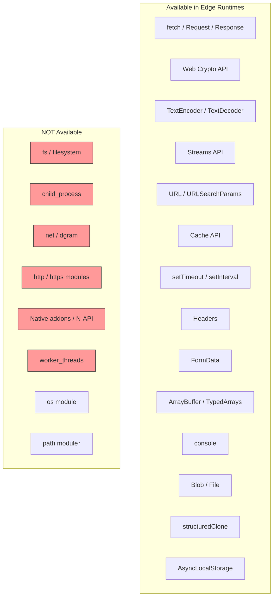
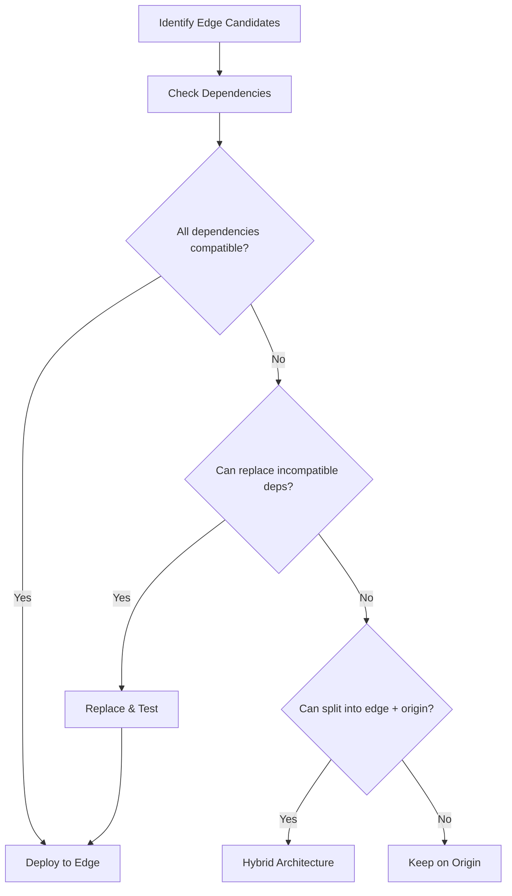

# Edge Runtime Constraints

## Why Edge Runtimes Are Constrained

Edge runtimes sacrifice Node.js compatibility for extreme performance characteristics. V8 isolates start in under 5ms (vs 100-1000ms for containers), use ~128KB of memory per isolate (vs 50-200MB per container), and can run thousands of concurrent functions on a single machine. These properties are only possible because edge runtimes strip away everything that is heavy or dangerous:

- **No filesystem**: The edge has no persistent disk. Eliminating `fs` removes an entire class of security vulnerabilities and operational complexity.
- **No native addons**: C++ bindings require compilation per platform and break V8 isolate security guarantees.
- **Limited CPU time**: Each request gets 10-50ms of CPU time (wall-clock time can be longer for I/O waits). This prevents any single request from monopolizing shared resources.
- **Limited memory**: 128MB per isolate is typical. This is adequate for request processing but insufficient for large data processing.

### The Web Standards Foundation

Edge runtimes implement the WinterCG (Web Interoperable Runtimes Community Group) specification, which standardizes a common API surface based on Web Platform APIs. If your code runs in a browser's Service Worker, it should run at the edge with minimal changes.

## First Principles

### What You Have

Edge runtimes provide a subset of Web Platform APIs:



*Some runtimes provide polyfills for `path` and other utility modules.

### Resource Limits by Platform

| Limit | Cloudflare Workers | Deno Deploy | Vercel Edge | Lambda@Edge |
|-------|-------------------|-------------|-------------|-------------|
| CPU time per request | 10-50ms (free) / 30s (paid) | 50ms (free) / 10s (paid) | 30s | 5s (viewer) / 30s (origin) |
| Wall-clock time | 30s | Unlimited | 30s | 30s |
| Memory | 128MB | 512MB | 128MB | 128MB (viewer) / 1GB (origin) |
| Script size | 10MB (free) / 10MB+ (paid) | No limit | 4MB | 50MB |
| Subrequest count | 50 (free) / 1000 (paid) | Unlimited | Unlimited | Unlimited |
| Request body size | 100MB | Unlimited | 4MB | 1MB (viewer) / 50MB (origin) |
| Environment variables | 64 | Unlimited | Unlimited | Unlimited |

## Core Mechanics

### Working Without the Filesystem

Instead of `fs`, edge runtimes provide alternative storage:

```typescript
// Node.js (traditional)
import fs from 'node:fs';
const config = JSON.parse(fs.readFileSync('./config.json', 'utf-8'));
const template = fs.readFileSync('./template.html', 'utf-8');

// Edge: Embed at build time
// config.json and template.html are bundled into the script
import config from './config.json';
const template = `<!DOCTYPE html><html>...</html>`;

// Edge: Fetch from KV store
const config = await env.CONFIG_KV.get('app-config', 'json');

// Edge: Fetch from URL
const config = await fetch('https://config.example.com/app.json')
  .then(r => r.json());

// Edge: Use R2 (object storage) for large files
const file = await env.R2_BUCKET.get('uploads/image.png');
if (file) {
  return new Response(file.body, {
    headers: { 'Content-Type': file.httpMetadata?.contentType || 'image/png' },
  });
}
```

### Working Without Native Addons

Common Node.js libraries that rely on native addons and their edge alternatives:

| Library | Native Dependency | Edge Alternative |
|---------|-------------------|------------------|
| `bcrypt` | C++ binding | `bcryptjs` (pure JS) or Web Crypto |
| `sharp` | libvips | Cloudflare Images API, or external service |
| `canvas` | Cairo | SVG generation, or external service |
| `pg` / `mysql2` | TCP sockets | HTTP-based drivers (Neon, PlanetScale) |
| `crypto` (Node) | OpenSSL | Web Crypto API |
| `zlib` | native zlib | `DecompressionStream` / `CompressionStream` |
| `better-sqlite3` | native SQLite | Cloudflare D1, Turso |

### Web Crypto API for Common Operations

```typescript
// Hashing
async function sha256(data: string): Promise<string> {
  const encoder = new TextEncoder();
  const hashBuffer = await crypto.subtle.digest('SHA-256', encoder.encode(data));
  return Array.from(new Uint8Array(hashBuffer))
    .map(b => b.toString(16).padStart(2, '0'))
    .join('');
}

// HMAC signing (for JWT, webhooks)
async function hmacSign(
  secret: string,
  data: string
): Promise<string> {
  const encoder = new TextEncoder();
  const key = await crypto.subtle.importKey(
    'raw',
    encoder.encode(secret),
    { name: 'HMAC', hash: 'SHA-256' },
    false,
    ['sign']
  );
  const signature = await crypto.subtle.sign('HMAC', key, encoder.encode(data));
  return btoa(String.fromCharCode(...new Uint8Array(signature)));
}

// JWT verification at the edge
async function verifyJwt(
  token: string,
  secret: string
): Promise<Record<string, unknown> | null> {
  const parts = token.split('.');
  if (parts.length !== 3) return null;

  const [headerB64, payloadB64, signatureB64] = parts;

  // Verify signature
  const data = `${headerB64}.${payloadB64}`;
  const expectedSig = await hmacSign(secret, data);

  // Constant-time comparison
  const sig = signatureB64.replace(/-/g, '+').replace(/_/g, '/');
  if (sig !== expectedSig) return null;

  // Decode payload
  const payload = JSON.parse(atob(payloadB64));

  // Check expiration
  if (payload.exp && payload.exp < Date.now() / 1000) {
    return null;
  }

  return payload;
}

// AES encryption/decryption
async function encryptAES(
  plaintext: string,
  keyData: ArrayBuffer
): Promise<{ iv: string; ciphertext: string }> {
  const key = await crypto.subtle.importKey(
    'raw', keyData, 'AES-GCM', false, ['encrypt']
  );
  const iv = crypto.getRandomValues(new Uint8Array(12));
  const encoder = new TextEncoder();
  const encrypted = await crypto.subtle.encrypt(
    { name: 'AES-GCM', iv },
    key,
    encoder.encode(plaintext)
  );

  return {
    iv: btoa(String.fromCharCode(...iv)),
    ciphertext: btoa(String.fromCharCode(...new Uint8Array(encrypted))),
  };
}

// UUID generation
function generateUUID(): string {
  return crypto.randomUUID();
}
```

### Streaming Responses

Edge runtimes excel at streaming — processing data as it arrives without buffering the entire response in memory:

```typescript
// Stream a large response from origin through the edge
async function streamProxy(request: Request): Promise<Response> {
  const originResponse = await fetch('https://origin.example.com/large-file');

  // Transform the stream at the edge
  const transformStream = new TransformStream({
    transform(chunk, controller) {
      // Process each chunk (e.g., inject headers, modify HTML)
      controller.enqueue(chunk);
    },
  });

  originResponse.body?.pipeTo(transformStream.writable);

  return new Response(transformStream.readable, {
    headers: originResponse.headers,
  });
}

// Server-Sent Events from the edge
function createSSEStream(): Response {
  const encoder = new TextEncoder();
  let interval: ReturnType<typeof setInterval>;

  const stream = new ReadableStream({
    start(controller) {
      let count = 0;
      interval = setInterval(() => {
        const data = JSON.stringify({ count: count++, time: Date.now() });
        controller.enqueue(
          encoder.encode(`data: ${data}\n\n`)
        );

        if (count > 100) {
          controller.close();
          clearInterval(interval);
        }
      }, 1000);
    },
    cancel() {
      clearInterval(interval);
    },
  });

  return new Response(stream, {
    headers: {
      'Content-Type': 'text/event-stream',
      'Cache-Control': 'no-cache',
      'Connection': 'keep-alive',
    },
  });
}
```

### Database Access from the Edge

Traditional database drivers use TCP sockets, which are not available at the edge. Edge-compatible databases use HTTP:

```typescript
// Neon (PostgreSQL over HTTP)
import { neon } from '@neondatabase/serverless';

const sql = neon(process.env.DATABASE_URL!);

export default {
  async fetch(request: Request): Promise<Response> {
    const users = await sql`SELECT * FROM users LIMIT 10`;
    return Response.json(users);
  },
};

// PlanetScale (MySQL over HTTP)
import { connect } from '@planetscale/database';

const conn = connect({
  host: process.env.PLANETSCALE_HOST,
  username: process.env.PLANETSCALE_USERNAME,
  password: process.env.PLANETSCALE_PASSWORD,
});

export default {
  async fetch(request: Request): Promise<Response> {
    const results = await conn.execute('SELECT * FROM users LIMIT 10');
    return Response.json(results.rows);
  },
};

// Cloudflare D1 (SQLite at the edge)
export default {
  async fetch(request: Request, env: Env): Promise<Response> {
    const { results } = await env.DB.prepare(
      'SELECT * FROM users WHERE id = ?'
    ).bind(1).all();
    return Response.json(results);
  },
};

// Turso (LibSQL, distributed SQLite)
import { createClient } from '@libsql/client/web';

const client = createClient({
  url: process.env.TURSO_URL!,
  authToken: process.env.TURSO_AUTH_TOKEN!,
});

export default {
  async fetch(request: Request): Promise<Response> {
    const result = await client.execute('SELECT * FROM users LIMIT 10');
    return Response.json(result.rows);
  },
};
```

## Edge Cases and Failure Modes

### 1. CPU Time Exceeded

```typescript
// BAD: CPU-intensive operation at the edge
function fibonacci(n: number): number {
  if (n <= 1) return n;
  return fibonacci(n - 1) + fibonacci(n - 2);
}

export default {
  async fetch(): Promise<Response> {
    const result = fibonacci(45); // Takes ~10 seconds of CPU
    // ERROR: "Worker exceeded CPU time limit"
    return Response.json({ result });
  },
};

// FIX: Offload to origin or use efficient algorithm
function fibonacciEfficient(n: number): number {
  let a = 0, b = 1;
  for (let i = 0; i < n; i++) {
    [a, b] = [b, a + b];
  }
  return a;
}
```

### 2. Subrequest Limits

```typescript
// BAD: Fan-out exceeding subrequest limit
export default {
  async fetch(request: Request): Promise<Response> {
    const urls = Array.from({ length: 100 }, (_, i) =>
      `https://api.example.com/item/${i}`
    );

    // On Cloudflare free plan: limit is 50 subrequests
    const results = await Promise.all(
      urls.map(url => fetch(url).then(r => r.json()))
    );
    // ERROR after 50th fetch: "Too many subrequests"

    return Response.json(results);
  },
};

// FIX: Batch API calls or use pagination
export default {
  async fetch(request: Request): Promise<Response> {
    // Single batch request instead of 100 individual ones
    const results = await fetch('https://api.example.com/items?ids=0-99')
      .then(r => r.json());
    return Response.json(results);
  },
};
```

### 3. Memory Limits with Large Payloads

```typescript
// BAD: Buffering entire response in memory
export default {
  async fetch(): Promise<Response> {
    const response = await fetch('https://origin.example.com/huge-file');
    const data = await response.arrayBuffer(); // 500MB = OOM
    // Process...
    return new Response(data);
  },
};

// FIX: Use streaming
export default {
  async fetch(): Promise<Response> {
    const response = await fetch('https://origin.example.com/huge-file');
    // Stream through without buffering
    return new Response(response.body, {
      headers: response.headers,
    });
  },
};
```

### 4. Global State Pitfalls

```typescript
// WARNING: Global state persists between requests in the same isolate
// but is NOT shared between isolates or POPs

let requestCount = 0; // This persists between requests in the same isolate

export default {
  async fetch(): Promise<Response> {
    requestCount++; // NOT a reliable counter!
    // Different POPs have different isolates with different counts
    // Same POP may create new isolates at any time
    return Response.json({ count: requestCount });
  },
};

// FIX: Use external state (KV, Durable Objects, database)
export default {
  async fetch(request: Request, env: Env): Promise<Response> {
    const count = parseInt(await env.KV.get('request-count') || '0') + 1;
    await env.KV.put('request-count', String(count));
    return Response.json({ count });
  },
};
```

::: info War Story
**The bcrypt Import That Broke Production**

A team deployed an authentication edge function that imported `bcrypt` for password hashing. The function worked locally (Node.js) but failed at deploy time because `bcrypt` depends on native C++ bindings. The build silently fell back to a JavaScript polyfill that was 100x slower — each password hash took 2 seconds of CPU time, exceeding the edge function's CPU limit.

The fix was switching to Web Crypto API for password verification using PBKDF2, which is hardware-accelerated and completes in <5ms at the edge. For the password hashing itself (higher cost desired), they kept it on the origin server.
:::

::: info War Story
**The Edge Function That Ran Out of Subrequests**

A product listing page ran on Cloudflare Workers. Each product needed enrichment: price from a pricing service, inventory from a stock service, and reviews from a review service. With 50 products on the page, that was 150 subrequests — exceeding the 50-request limit.

The fix was a two-part solution: (1) implement a GraphQL gateway at the origin that accepted batch product enrichment requests, reducing 150 calls to 1, (2) cache enriched products at the edge in KV with a 60-second TTL, so most page loads required zero subrequests.
:::

## Performance Characteristics

### Operation Costs at the Edge

| Operation | Time (ms) | Notes |
|-----------|-----------|-------|
| String manipulation | 0.001-0.01 | Very fast |
| JSON.parse (1KB) | 0.01 | Fast |
| JSON.parse (100KB) | 0.5 | Moderate |
| JSON.parse (1MB) | 5 | Approaches CPU limits |
| SHA-256 hash (1KB) | 0.05 | Web Crypto, fast |
| HMAC-SHA256 sign | 0.1 | Web Crypto |
| AES-256 encrypt (1KB) | 0.1 | Web Crypto, hardware |
| JWT verify | 0.2 | Signature + decode |
| KV read | 1-5 | Edge cache hit |
| D1 query | 2-10 | Local SQLite |
| fetch() to origin | 20-200 | Network round-trip |

### Memory Usage Patterns

$$
\text{Available Memory} = \text{Limit} - \text{Runtime Overhead} - \text{Script Size}
$$

For a typical Worker:
- Limit: 128MB
- Runtime overhead: ~10MB
- Script size: 1-5MB
- Available for data: ~113-117MB

A 113MB budget holds:
- ~1 million small JSON objects (~100 bytes each)
- ~15,000 medium objects (~8KB each)
- ~113 large responses (1MB each)

## Mathematical Foundations

### Isolate Density Model

The number of isolates that can run concurrently on a single edge node:

$$
N_{\text{isolates}} = \min\left(\frac{M_{\text{total}}}{M_{\text{per\_isolate}}}, \frac{C_{\text{total}}}{C_{\text{per\_request}} \times \text{RPS}}\right)
$$

Where:
- $M_{\text{total}}$ = total node memory (e.g., 64GB)
- $M_{\text{per\_isolate}}$ = memory per isolate (~128KB-128MB)
- $C_{\text{total}}$ = total CPU cores
- $C_{\text{per\_request}}$ = CPU ms per request
- RPS = requests per second per isolate

For 64GB RAM, 128KB per isolate, 16 cores:

$$
N_{\text{isolates}} = \min\left(\frac{64 \times 10^9}{128 \times 10^3}, \ldots\right) = 500{,}000 \text{ (memory-limited)}
$$

This is why edge platforms can serve millions of requests per second from a single node.

## Decision Framework

### Compatibility Checklist

Before deploying to the edge, verify each dependency:

| Dependency Category | Edge Compatible? | Alternative |
|--------------------|-----------------|-------------|
| Pure JavaScript libraries | Yes | Use directly |
| Web API-based libraries | Yes | Use directly |
| Node.js `crypto` | Partial | Web Crypto API |
| Node.js `buffer` | Polyfilled | Use Uint8Array |
| Node.js `fs` | No | KV, R2, fetch |
| Node.js `net` | No | HTTP-based clients |
| Native addons | No | Pure JS alternatives |
| Node.js `http`/`https` | No | fetch API |
| `process.env` | Varies | env bindings |

### Migration Strategy



## Advanced Topics

### Polyfilling Node.js APIs

Some edge platforms provide Node.js API compatibility layers:

```typescript
// Cloudflare Workers: Node.js compatibility flags
// wrangler.toml:
// compatibility_flags = ["nodejs_compat"]

// Now available:
import { Buffer } from 'node:buffer';
import { createHash } from 'node:crypto';
import { AsyncLocalStorage } from 'node:async_hooks';

// But NOT available (even with compat flag):
// import fs from 'node:fs';
// import net from 'node:net';
// import child_process from 'node:child_process';
```

### Testing Edge Functions Locally

```typescript
// Miniflare: Local Cloudflare Workers simulator
// npm install miniflare

// wrangler.toml
// [dev]
// port = 8787

// Run locally:
// npx wrangler dev

// Or use Miniflare directly:
import { Miniflare } from 'miniflare';

const mf = new Miniflare({
  script: `
    export default {
      async fetch(request, env) {
        return new Response("Hello from edge!");
      }
    }
  `,
  modules: true,
  kvNamespaces: ['MY_KV'],
  d1Databases: ['MY_DB'],
});

const response = await mf.dispatchFetch('http://localhost:8787/');
console.log(await response.text()); // "Hello from edge!"
```

### Edge-Compatible Library Patterns

```typescript
// Pattern: Isomorphic library that works on Node.js and edge

// Detect runtime
function getRuntime(): 'node' | 'edge' | 'browser' {
  if (typeof globalThis.process !== 'undefined' && globalThis.process.versions?.node) {
    return 'node';
  }
  if (typeof globalThis.EdgeRuntime !== 'undefined' ||
      typeof globalThis.caches !== 'undefined') {
    return 'edge';
  }
  return 'browser';
}

// Adapter pattern for cross-runtime compatibility
interface StorageAdapter {
  get(key: string): Promise<string | null>;
  set(key: string, value: string, ttl?: number): Promise<void>;
  delete(key: string): Promise<void>;
}

// Node.js adapter
class RedisStorageAdapter implements StorageAdapter {
  constructor(private readonly redis: RedisClient) {}
  async get(key: string) { return this.redis.get(key); }
  async set(key: string, value: string, ttl?: number) {
    if (ttl) await this.redis.set(key, value, 'EX', ttl);
    else await this.redis.set(key, value);
  }
  async delete(key: string) { await this.redis.del(key); }
}

// Edge adapter
class KVStorageAdapter implements StorageAdapter {
  constructor(private readonly kv: KVNamespace) {}
  async get(key: string) { return this.kv.get(key); }
  async set(key: string, value: string, ttl?: number) {
    await this.kv.put(key, value, ttl ? { expirationTtl: ttl } : undefined);
  }
  async delete(key: string) { await this.kv.delete(key); }
}
```

::: tip Key Takeaway
Edge runtime constraints are the price of sub-5ms cold starts and global distribution. The key constraint to internalize is: no filesystem, no TCP sockets, limited CPU time. Design your edge functions to be lightweight request transformers and cache-aware proxies. Heavy computation, large file processing, and complex database operations belong on the origin. The edge handles the last mile — authentication, caching, personalization, and routing.
:::

## Cross-References

- [Edge Computing Overview](./index.md) — architecture and decision framework
- [Cloudflare Workers](./cloudflare-workers.md) — specific platform capabilities
- [Deno Deploy](./deno-deploy.md) — Deno-specific edge runtime
- [Vercel Edge](./vercel-edge.md) — Next.js edge integration
- [Worker Threads](../optimization/worker-threads.md) — parallelism not available at the edge
