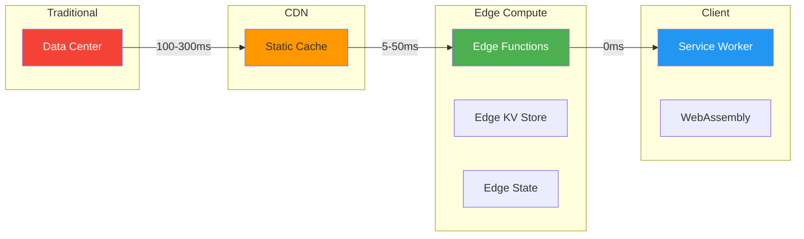
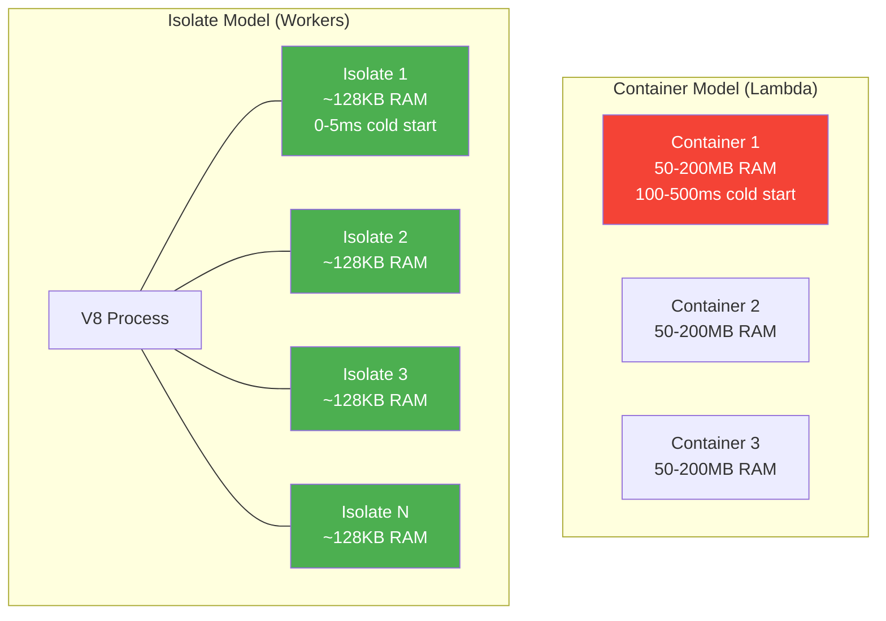
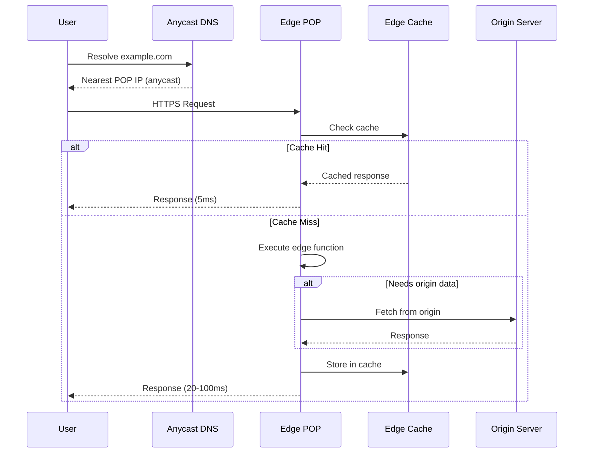
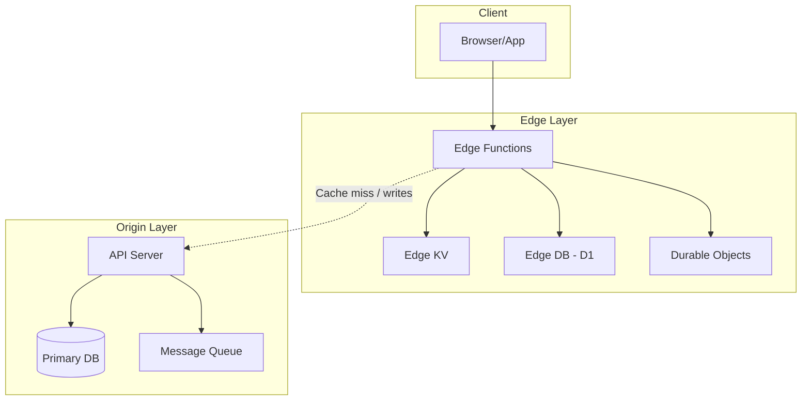

# Edge Computing Overview

## Why Edge Computing Exists

Edge computing moves computation from centralized data centers to points of presence (POPs) close to end users. The motivation is physics: the speed of light in fiber optic cable is ~200,000 km/s, making a round-trip from New York to Singapore (~15,000 km each way) take at minimum 150ms. No amount of code optimization can beat this latency floor.

Edge computing eliminates the geography penalty by running code at 200+ locations worldwide, typically within 50ms of every internet user. The tradeoff: edge environments have limited resources, no persistent filesystem, and constrained runtime APIs compared to traditional servers.

### The Edge Computing Spectrum



### Historical Context

- **1999**: Akamai introduces EdgeSuite for executing code at the edge (proprietary, limited).
- **2017**: Cloudflare Workers launches — V8 isolates at the edge. Game changer for developer accessibility.
- **2018**: AWS Lambda@Edge — run Lambda functions at CloudFront POPs.
- **2019**: Fastly Compute@Edge — WebAssembly at the edge.
- **2020**: Deno Deploy enters beta — globally distributed V8 isolates.
- **2021**: Vercel Edge Functions, Netlify Edge Functions.
- **2022+**: Edge databases (Cloudflare D1, Durable Objects, Turso, Neon branching), making full-stack edge applications viable.

## First Principles

### The Latency Hierarchy

$$
T_{\text{total}} = T_{\text{DNS}} + T_{\text{TCP}} + T_{\text{TLS}} + T_{\text{request}} + T_{\text{compute}} + T_{\text{response}}
$$

For a traditional centralized server serving a user 5,000km away:

| Component | Centralized | Edge |
|-----------|------------|------|
| DNS lookup | 20-50ms | 5-10ms (anycast) |
| TCP handshake | 50ms | 5ms |
| TLS handshake | 50ms | 5ms |
| Request transit | 25ms | 2ms |
| Compute | 5-50ms | 5-50ms |
| Response transit | 25ms | 2ms |
| **Total** | **175-250ms** | **24-74ms** |

Edge reduces network-related latency by 75-90%, while compute time remains the same.

### V8 Isolates vs Containers

The key innovation enabling edge computing is the V8 isolate model. Instead of running each function in a separate container (Lambda model), edge platforms run many functions in the same process using V8 isolates:



| Characteristic | Container (Lambda) | Isolate (Workers) |
|---------------|-------------------|-------------------|
| Cold start | 100-1000ms | 0-5ms |
| Memory overhead | 50-200MB | 128KB-128MB |
| Startup isolation | Process-level | V8 isolate |
| Max instances per host | 10-50 | 1,000-10,000 |
| Available APIs | Full Node.js | Web Standards subset |
| Filesystem access | Yes (ephemeral) | No |
| Native addons | Yes | No |

### The CAP Theorem at the Edge

Edge computing distributes state across geographically distant locations, making CAP theorem tradeoffs explicit:

$$
\text{Consistency} + \text{Availability} + \text{Partition Tolerance} \leq 2
$$

Edge systems typically choose AP (Availability + Partition tolerance), accepting eventual consistency. When the edge cannot reach the origin, it serves stale data rather than returning errors.

## Core Mechanics

### Request Flow at the Edge



### Edge Function Lifecycle

```typescript
// Edge functions follow the Service Worker pattern:
// 1. Receive a Request
// 2. Return a Response
// No persistent state between requests (stateless)

export default {
  async fetch(request: Request, env: Env, ctx: ExecutionContext): Promise<Response> {
    // ctx.waitUntil() for background work after response is sent
    // env contains bindings (KV, D1, Durable Objects, etc.)

    const url = new URL(request.url);

    // Route handling at the edge
    if (url.pathname.startsWith('/api/')) {
      return handleApi(request, env);
    }

    if (url.pathname.startsWith('/static/')) {
      return handleStatic(request, env, ctx);
    }

    // Default: proxy to origin
    return fetch(request);
  },
};

async function handleApi(request: Request, env: Env): Promise<Response> {
  // Read from edge KV store (eventual consistency, ~60ms global propagation)
  const cached = await env.CACHE_KV.get('api:data', 'json');
  if (cached) {
    return Response.json(cached, {
      headers: { 'X-Cache': 'HIT' },
    });
  }

  // Fetch from origin
  const response = await fetch('https://api.origin.com/data');
  const data = await response.json();

  // Cache at edge (non-blocking)
  await env.CACHE_KV.put('api:data', JSON.stringify(data), {
    expirationTtl: 300, // 5 minutes
  });

  return Response.json(data, {
    headers: { 'X-Cache': 'MISS' },
  });
}
```

### Edge State Management Patterns

```mermaid
graph TD
    subgraph "Read-Heavy (KV)"
        KV1[Write to Origin]
        KV2[Propagate to Edge KV]
        KV3[Read from Edge KV]
        KV1 --> KV2 --> KV3
    end

    subgraph "Write-Heavy (Durable Objects)"
        DO1[Route to Specific DO]
        DO2[Single-threaded State]
        DO3[Strong Consistency]
        DO1 --> DO2 --> DO3
    end

    subgraph "Relational (Edge DB)"
        DB1[Replicate to Edge]
        DB2[Read from Local Replica]
        DB3[Write to Primary]
        DB1 --> DB2
        DB3 --> DB1
    end
```



## Implementation: Full-Stack Edge Application

```typescript
// A complete edge application: API + static assets + caching + auth

interface Env {
  STATIC_ASSETS: KVNamespace;
  API_CACHE: KVNamespace;
  AUTH_DB: D1Database;
  RATE_LIMITER: DurableObjectNamespace;
}

export default {
  async fetch(request: Request, env: Env, ctx: ExecutionContext): Promise<Response> {
    const url = new URL(request.url);

    try {
      // Rate limiting using Durable Objects
      const rateLimitResult = await checkRateLimit(
        request, env.RATE_LIMITER
      );
      if (!rateLimitResult.allowed) {
        return new Response('Too Many Requests', {
          status: 429,
          headers: { 'Retry-After': String(rateLimitResult.retryAfter) },
        });
      }

      // Route
      if (url.pathname.startsWith('/api/')) {
        return handleApi(request, env, ctx);
      }

      // Static assets from KV
      return handleStatic(url.pathname, env);
    } catch (error) {
      return new Response('Internal Server Error', { status: 500 });
    }
  },
};

async function handleStatic(
  path: string,
  env: Env
): Promise<Response> {
  const asset = await env.STATIC_ASSETS.get(path, 'arrayBuffer');
  if (!asset) {
    return new Response('Not Found', { status: 404 });
  }

  const contentType = getContentType(path);
  return new Response(asset, {
    headers: {
      'Content-Type': contentType,
      'Cache-Control': path.includes('.') && !path.endsWith('.html')
        ? 'public, max-age=31536000, immutable'
        : 'public, max-age=0, must-revalidate',
    },
  });
}

async function handleApi(
  request: Request,
  env: Env,
  ctx: ExecutionContext
): Promise<Response> {
  const url = new URL(request.url);

  // Auth check
  const authHeader = request.headers.get('Authorization');
  if (!authHeader) {
    return new Response('Unauthorized', { status: 401 });
  }

  // Verify JWT at the edge (no round-trip to auth server)
  const user = await verifyJwt(authHeader, env);
  if (!user) {
    return new Response('Invalid token', { status: 403 });
  }

  // API routing
  if (url.pathname === '/api/profile' && request.method === 'GET') {
    // Read from edge D1 database
    const profile = await env.AUTH_DB.prepare(
      'SELECT * FROM users WHERE id = ?'
    ).bind(user.id).first();

    return Response.json(profile);
  }

  return new Response('Not Found', { status: 404 });
}

function getContentType(path: string): string {
  const ext = path.split('.').pop()?.toLowerCase();
  const types: Record<string, string> = {
    html: 'text/html',
    css: 'text/css',
    js: 'application/javascript',
    json: 'application/json',
    png: 'image/png',
    jpg: 'image/jpeg',
    svg: 'image/svg+xml',
    woff2: 'font/woff2',
  };
  return types[ext || ''] || 'application/octet-stream';
}
```

## Edge Cases and Failure Modes

### 1. Cold Start on Uncommon POPs

```typescript
// Edge functions at rarely-accessed POPs may have higher cold starts
// because the V8 isolate was evicted from memory

// Mitigation: Pre-warm critical POPs with synthetic traffic
// Most platforms don't need this, but Lambda@Edge can have 1-5s cold starts
```

### 2. Edge-Origin Consistency Window

```typescript
// User writes to origin, then reads from edge — sees stale data
// Because edge cache/KV hasn't been updated yet

// Solution 1: Sticky sessions — route writes and subsequent reads to origin
// Solution 2: Read-after-write consistency header
// Solution 3: Optimistic updates at edge with eventual sync

async function handleUpdate(request: Request, env: Env): Promise<Response> {
  const data = await request.json();

  // Write to origin
  const response = await fetch('https://origin.example.com/api/update', {
    method: 'POST',
    body: JSON.stringify(data),
  });

  // Immediately update edge cache so the user sees their own write
  if (response.ok) {
    await env.CACHE_KV.put(
      `user:${data.userId}`,
      JSON.stringify(data),
      { expirationTtl: 300 }
    );
  }

  return response;
}
```

### 3. Global Rate Limiting at the Edge

```typescript
// Each edge POP has its own rate limit counter — users can exceed
// the global limit by hitting different POPs

// Solution: Use Durable Objects for global rate limiting
// Each user's rate limit state lives on a single Durable Object
// All edge POPs route to the same DO instance
```

::: info War Story
**The Edge Function That Called Itself**

A team deployed a Cloudflare Worker that proxied API requests to their origin server. The origin server was also behind Cloudflare. The Worker fetched from the same hostname, which routed back through the Worker, creating an infinite loop. Cloudflare detected this and returned a 522 error, but the team spent hours debugging "connection timeout" errors.

The fix was using the origin server's direct IP address (or a separate hostname not proxied through Cloudflare) for the `fetch` call.
:::

::: info War Story
**The KV Consistency Surprise**

An edge application stored user sessions in Cloudflare KV. A user logged in (KV write from US-East POP), then was routed to US-West POP for their next request. The KV read returned null because the write hadn't propagated yet (~60 second eventual consistency). The user was forced to log in again.

The fix was using Durable Objects for session state (strong consistency within a region) instead of KV, or implementing a "read your own writes" pattern where the login response included a signed cookie containing the session data that the edge function could validate without KV.
:::

## Performance Characteristics

### Latency Comparison

| Operation | Centralized (us-east-1) | Edge (nearest POP) |
|-----------|------------------------|---------------------|
| Static asset | 50-200ms | 5-20ms |
| API proxy | 100-300ms | 10-50ms |
| KV read | N/A | 1-5ms |
| D1 query | N/A | 2-10ms |
| Origin fetch | 5-20ms | 50-200ms (from edge) |

### Cost Model

$$
\text{Edge Cost} = R \times C_r + B \times C_b + S \times C_s
$$

Where:
- $R$ = number of requests, $C_r$ = cost per request (~$0.15/M for Workers)
- $B$ = bandwidth, $C_b$ = cost per GB (~$0.05)
- $S$ = storage, $C_s$ = cost per GB-month (~$0.50 for KV)

For 100M requests/month with 500GB bandwidth:

$$
\text{Cost} = 100 \times 0.15 + 500 \times 0.05 + 1 \times 0.50 = \$15 + \$25 + \$0.50 = \$40.50
$$

Compared to a containerized server at $200-500/month for similar traffic.

## Decision Framework

### When to Use Edge Computing

| Use Case | Edge Benefit | Platform |
|----------|-------------|----------|
| Static site + API proxy | High (latency reduction) | Any CDN + edge functions |
| A/B testing | High (no origin latency) | Workers, Vercel Edge |
| Auth/JWT validation | High (reduce origin load) | Workers, Lambda@Edge |
| Personalization | Medium (geo, device detection) | Workers, Vercel Edge |
| Full API | Medium (if data can be at edge) | Workers + D1/DO |
| Real-time collaboration | Low (needs WebSocket at origin) | Durable Objects only |
| Heavy computation | Low (limited CPU time) | Use origin/serverless |
| Relational queries | Medium (edge DBs are new) | D1, Turso, Neon |

### When NOT to Use Edge

- **Long-running computations** (>30s) — edge functions have strict CPU time limits
- **Large file processing** — limited memory (128MB typical)
- **Complex database queries** — edge databases are limited
- **Native binary dependencies** — no filesystem, no native addons
- **Stateful WebSocket servers** — only Durable Objects support this
- **Compliance-restricted data** — data locality requirements may conflict with edge distribution

## Advanced Topics

### Edge-First Architecture



The edge-first architecture handles 80-95% of requests entirely at the edge:

1. **Static assets**: Served from edge KV or R2 (object storage).
2. **API reads**: Served from edge cache, KV, or D1 (SQLite at edge).
3. **API writes**: Forwarded to origin, with edge cache invalidation.
4. **Personalization**: Computed at edge using geo, device, and cookie data.
5. **Auth**: JWT validation at edge, no origin round-trip.

::: tip Key Takeaway
Edge computing is not a replacement for traditional servers — it is a complement that handles the latency-sensitive portion of your stack. Start by moving static assets and API caching to the edge, then progressively move authentication, personalization, and eventually data to the edge. The platforms are maturing rapidly, with edge databases making full-stack edge applications increasingly viable.
:::

## Section Contents

- [Edge Runtime Constraints](./edge-runtime-constraints.md) — what you cannot do at the edge
- [Cloudflare Workers](./cloudflare-workers.md) — V8 isolates, KV, Durable Objects, D1
- [Deno Deploy](./deno-deploy.md) — V8 isolates, Deno KV
- [Vercel Edge](./vercel-edge.md) — Edge Functions, Edge Middleware

## Cross-References

- [Edge Caching](../caching-strategies/edge-caching.md) — CDN caching patterns
- [HTTP Caching](../caching-strategies/http-caching.md) — cache headers for edge
- [Concurrency Patterns](../optimization/concurrency-patterns.md) — edge function concurrency
