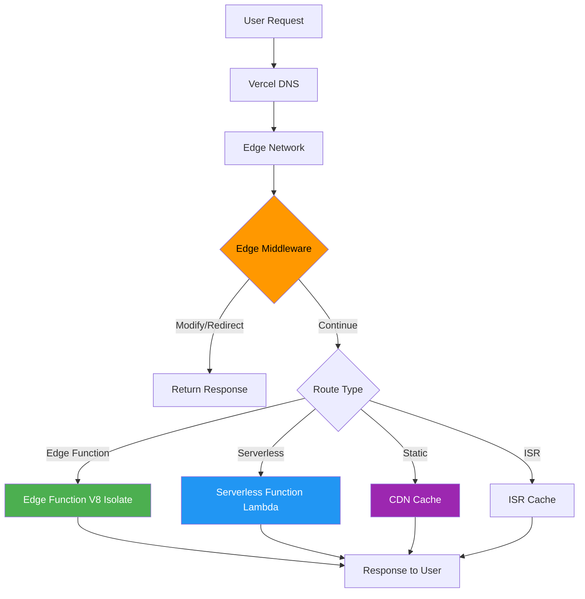

# Vercel Edge

## Why Vercel Edge Exists

Vercel Edge integrates edge computing directly into the Next.js framework, making it the most developer-friendly path from traditional server-side rendering to edge-first architecture. Instead of learning a new platform API, Next.js developers add `export const runtime = 'edge'` to their existing code and it runs on Vercel's global network.

Vercel's edge platform consists of three components:
1. **Edge Functions** — serverless functions running on V8 isolates at the edge.
2. **Edge Middleware** — request interceptors that run before any page or API route.
3. **Edge Config** — globally distributed, ultra-low-latency configuration store.

The key differentiator: Vercel Edge is designed for framework-aware edge computing. It understands Next.js routing, React Server Components, and ISR (Incremental Static Regeneration), optimizing the edge experience for the entire Next.js ecosystem.

### Historical Context

- **2020**: Vercel launches Serverless Functions (Lambda-based, not edge).
- **2021**: Edge Middleware announced — runs before every request, globally.
- **2022**: Edge Functions GA — API routes and pages can run at the edge. Edge Config launched.
- **2023**: App Router with RSC support at the edge. Partial prerendering combines static and dynamic content.
- **2024+**: Improved edge runtime compatibility, larger limits, more regions.

## First Principles

### Vercel's Edge Architecture



### Edge vs Serverless on Vercel

| Feature | Edge Functions | Serverless Functions |
|---------|---------------|---------------------|
| Runtime | V8 Isolate (Web APIs) | Node.js (full) |
| Cold start | 0-5ms | 250-1000ms |
| Execution limit | 30s | 60s (hobby) / 300s (pro) |
| Memory | 128MB | 1024-3008MB |
| Regions | All edge (30+) | 1 region (configurable) |
| Streaming | Yes (native) | Yes (Node.js streams) |
| Node.js APIs | Partial (Web API subset) | Full |
| Database drivers | HTTP-based only | TCP/HTTP |
| File system | No | Yes (read-only, /tmp for write) |
| npm packages | Most (no native addons) | All |
| Pricing | $0.65/M invocations | $0.60/GB-hrs |

## Core Mechanics

### Edge Functions in Next.js

```typescript
// app/api/hello/route.ts
// Add the edge runtime directive
export const runtime = 'edge';

export async function GET(request: Request) {
  const { searchParams } = new URL(request.url);
  const name = searchParams.get('name') || 'World';

  return Response.json({
    message: `Hello, ${name}!`,
    region: process.env.VERCEL_REGION || 'local',
    timestamp: Date.now(),
  });
}

export async function POST(request: Request) {
  const body = await request.json();

  // Process at the edge
  const result = await processData(body);

  return Response.json(result, { status: 201 });
}
```

### Edge Middleware

Edge Middleware runs before every request, globally. It can rewrite, redirect, add headers, or return custom responses:

```typescript
// middleware.ts (at project root)
import { NextRequest, NextResponse } from 'next/server';

export function middleware(request: NextRequest) {
  const url = request.nextUrl;

  // 1. Geolocation-based routing
  const country = request.geo?.country || 'US';
  if (url.pathname === '/pricing') {
    // Rewrite to country-specific pricing page
    url.pathname = `/pricing/${country.toLowerCase()}`;
    return NextResponse.rewrite(url);
  }

  // 2. A/B testing
  const bucket = request.cookies.get('ab-bucket')?.value;
  if (!bucket) {
    const newBucket = Math.random() < 0.5 ? 'control' : 'variant';
    const response = NextResponse.next();
    response.cookies.set('ab-bucket', newBucket, {
      maxAge: 60 * 60 * 24 * 30, // 30 days
    });
    // Pass bucket to the page via header
    response.headers.set('x-ab-bucket', newBucket);
    return response;
  }

  // 3. Authentication check
  if (url.pathname.startsWith('/dashboard')) {
    const token = request.cookies.get('session-token')?.value;
    if (!token) {
      return NextResponse.redirect(new URL('/login', request.url));
    }

    // Verify JWT at the edge (no round-trip to auth server)
    try {
      const payload = verifyToken(token);
      const response = NextResponse.next();
      response.headers.set('x-user-id', payload.userId);
      return response;
    } catch {
      return NextResponse.redirect(new URL('/login', request.url));
    }
  }

  // 4. Rate limiting
  const ip = request.ip || request.headers.get('x-forwarded-for') || 'unknown';
  const rateLimited = checkRateLimit(ip);
  if (rateLimited) {
    return new NextResponse('Too Many Requests', {
      status: 429,
      headers: { 'Retry-After': '60' },
    });
  }

  // 5. Bot detection
  const userAgent = request.headers.get('user-agent') || '';
  if (isBot(userAgent) && url.pathname.startsWith('/api/')) {
    return new NextResponse('Forbidden', { status: 403 });
  }

  return NextResponse.next();
}

// Configure which paths middleware applies to
export const config = {
  matcher: [
    // Match all paths except static files and _next
    '/((?!_next/static|_next/image|favicon.ico).*)',
  ],
};
```

### Edge Config

Edge Config is a globally distributed, ultra-low-latency key-value store designed for feature flags, A/B testing, and configuration that changes at deploy time:

```typescript
// Read from Edge Config (reads take <1ms at the edge)
import { get, getAll, has } from '@vercel/edge-config';

// In Edge Middleware
export async function middleware(request: NextRequest) {
  // Feature flag check (<1ms)
  const maintenanceMode = await get<boolean>('maintenance_mode');
  if (maintenanceMode) {
    return NextResponse.rewrite(new URL('/maintenance', request.url));
  }

  // A/B test configuration
  const experiments = await get<Record<string, { percentage: number }>>(
    'experiments'
  );

  // Redirect rules
  const redirects = await get<Array<{ from: string; to: string; permanent: boolean }>>(
    'redirects'
  );

  if (redirects) {
    const match = redirects.find(r => request.nextUrl.pathname === r.from);
    if (match) {
      return NextResponse.redirect(
        new URL(match.to, request.url),
        match.permanent ? 308 : 307
      );
    }
  }

  return NextResponse.next();
}
```

```typescript
// Update Edge Config via API (from server or CI/CD)
async function updateEdgeConfig(
  key: string,
  value: unknown
): Promise<void> {
  const response = await fetch(
    `https://api.vercel.com/v1/edge-config/${process.env.EDGE_CONFIG_ID}/items`,
    {
      method: 'PATCH',
      headers: {
        Authorization: `Bearer ${process.env.VERCEL_API_TOKEN}`,
        'Content-Type': 'application/json',
      },
      body: JSON.stringify({
        items: [
          { operation: 'upsert', key, value },
        ],
      }),
    }
  );

  if (!response.ok) {
    throw new Error(`Failed to update Edge Config: ${response.statusText}`);
  }
}
```

### Edge Pages with React Server Components

```typescript
// app/products/[id]/page.tsx
// This page renders at the edge — globally distributed

export const runtime = 'edge';

interface Product {
  id: string;
  name: string;
  price: number;
  description: string;
}

async function getProduct(id: string): Promise<Product> {
  // Fetch from edge-compatible database
  const response = await fetch(
    `${process.env.API_URL}/products/${id}`,
    {
      next: { revalidate: 60 }, // ISR: regenerate every 60s
    }
  );

  if (!response.ok) throw new Error('Product not found');
  return response.json();
}

export default async function ProductPage({
  params,
}: {
  params: { id: string };
}) {
  const product = await getProduct(params.id);

  return (
    <div>
      <h1>{product.name}</h1>
      <p>{product.description}</p>
      <p>Price: ${product.price}</p>
    </div>
  );
}

// Generate static params for popular products
export async function generateStaticParams() {
  const response = await fetch(`${process.env.API_URL}/products/popular`);
  const products = await response.json();
  return products.map((p: Product) => ({ id: p.id }));
}
```

## Implementation: Complete Edge Application

```typescript
// A feature-flagged, A/B tested, geolocation-aware application

// middleware.ts
import { NextRequest, NextResponse } from 'next/server';
import { get } from '@vercel/edge-config';

interface FeatureFlags {
  newCheckout: boolean;
  darkMode: boolean;
  aiRecommendations: boolean;
}

interface GeoConfig {
  currency: string;
  locale: string;
  shippingZone: string;
}

const GEO_CONFIG: Record<string, GeoConfig> = {
  US: { currency: 'USD', locale: 'en-US', shippingZone: 'na' },
  GB: { currency: 'GBP', locale: 'en-GB', shippingZone: 'eu' },
  JP: { currency: 'JPY', locale: 'ja-JP', shippingZone: 'apac' },
  DE: { currency: 'EUR', locale: 'de-DE', shippingZone: 'eu' },
};

export async function middleware(request: NextRequest) {
  const response = NextResponse.next();

  // 1. Feature flags from Edge Config
  const flags = await get<FeatureFlags>('feature_flags');
  if (flags) {
    response.headers.set('x-feature-flags', JSON.stringify(flags));
  }

  // 2. Geolocation enrichment
  const country = request.geo?.country || 'US';
  const city = request.geo?.city || 'Unknown';
  const geoConfig = GEO_CONFIG[country] || GEO_CONFIG.US;

  response.headers.set('x-geo-country', country);
  response.headers.set('x-geo-city', city);
  response.headers.set('x-currency', geoConfig.currency);
  response.headers.set('x-locale', geoConfig.locale);
  response.headers.set('x-shipping-zone', geoConfig.shippingZone);

  // 3. Session handling
  let sessionId = request.cookies.get('session-id')?.value;
  if (!sessionId) {
    sessionId = crypto.randomUUID();
    response.cookies.set('session-id', sessionId, {
      httpOnly: true,
      secure: true,
      sameSite: 'lax',
      maxAge: 60 * 60 * 24 * 365,
    });
  }

  // 4. Performance headers
  response.headers.set('x-vercel-region', process.env.VERCEL_REGION || 'dev');
  response.headers.set('Server-Timing', `middleware;dur=1`);

  return response;
}

export const config = {
  matcher: ['/((?!_next/static|_next/image|favicon.ico).*)'],
};
```

```typescript
// app/api/personalized-feed/route.ts
export const runtime = 'edge';

export async function GET(request: Request) {
  const headers = new Headers(request.headers);

  // Data enriched by middleware
  const country = headers.get('x-geo-country') || 'US';
  const currency = headers.get('x-currency') || 'USD';
  const featureFlags = JSON.parse(
    headers.get('x-feature-flags') || '{}'
  );

  // Fetch personalized content from edge-compatible API
  const feedUrl = new URL('https://api.example.com/feed');
  feedUrl.searchParams.set('country', country);
  feedUrl.searchParams.set('currency', currency);

  if (featureFlags.aiRecommendations) {
    feedUrl.searchParams.set('ai', 'true');
  }

  const feedResponse = await fetch(feedUrl.toString(), {
    headers: { Authorization: `Bearer ${process.env.API_KEY}` },
  });

  const feed = await feedResponse.json();

  return Response.json(feed, {
    headers: {
      'Cache-Control': 'public, s-maxage=60, stale-while-revalidate=300',
    },
  });
}
```

## Edge Cases and Failure Modes

### 1. Middleware Running on Every Request

```typescript
// Middleware runs on EVERY request by default, including static assets
// This adds latency to every CSS, JS, and image request

// FIX: Use the matcher config to exclude static assets
export const config = {
  matcher: [
    // Only run on page and API routes
    '/((?!_next/static|_next/image|favicon.ico|.*\\.(?:svg|png|jpg|jpeg|gif|webp)$).*)',
  ],
};
```

::: warning
Edge Middleware has a 4KB code size limit for the free plan. Complex middleware may need to be split or simplified. On Pro plans, the limit is much higher.
:::

### 2. Edge Function Timeout with Slow Origins

```typescript
// Edge function fetches from origin, but origin is slow
// After 30 seconds, the edge function times out

export const runtime = 'edge';

export async function GET(request: Request) {
  // This fetch might timeout if the origin is slow
  const response = await fetch('https://slow-api.example.com/data');
  // Error: Edge Function execution exceeded 30s

  // FIX 1: Add a timeout with fallback
  const controller = new AbortController();
  const timeout = setTimeout(() => controller.abort(), 5000);

  try {
    const response = await fetch('https://slow-api.example.com/data', {
      signal: controller.signal,
    });
    clearTimeout(timeout);
    return Response.json(await response.json());
  } catch {
    clearTimeout(timeout);
    // Return cached/default data instead of erroring
    return Response.json(
      { data: [], source: 'fallback' },
      { status: 200 }
    );
  }
}
```

### 3. Edge Config Stale After Update

```typescript
// Edge Config updates propagate in ~200-500ms
// During this window, different edge POPs may return different values

// This is usually fine for feature flags but problematic for:
// - Kill switches (need immediate propagation)
// - Config that must be consistent across requests

// Mitigation: Use Edge Config with a version check
const config = await get<{ version: number; data: unknown }>('app_config');
// Include version in response so clients can detect staleness
```

### 4. Dynamic Import Failures at the Edge

```typescript
// BAD: Dynamic imports that reference Node.js modules
export const runtime = 'edge';

export async function GET() {
  // This will fail at the edge!
  const { readFile } = await import('node:fs/promises');
  // Error: Module "node:fs/promises" is not supported in Edge Runtime

  // FIX: Use conditional imports
  let data: string;
  if (typeof EdgeRuntime !== 'undefined') {
    // Edge: fetch from API or KV
    const response = await fetch('https://api.example.com/data');
    data = await response.text();
  } else {
    // Node.js: read from filesystem
    const { readFile } = await import('node:fs/promises');
    data = await readFile('./data.json', 'utf-8');
  }
}
```

::: info War Story
**The Middleware That Broke Caching**

A team added Edge Middleware that set a `Set-Cookie` header on every response for session tracking. This innocent change broke CDN caching for their entire site because `Set-Cookie` responses are not cacheable by default. Their cache hit ratio dropped from 90% to 5%, origin traffic increased 18x, and the site became slow globally.

The fix was moving the cookie logic to only run on page requests (not static assets) and using the `matcher` config to exclude `_next/static` paths. Cache hit ratio recovered to 88% immediately.
:::

::: info War Story
**The Edge Function That Was Slower Than Serverless**

A team migrated their API from Serverless Functions (Node.js, us-east-1) to Edge Functions for "better performance." The API made 5 database queries per request to a PostgreSQL database in us-east-1. From the edge in Tokyo, each database query now added 150ms of latency (cross-Pacific round-trip). Total request time went from 25ms (co-located) to 800ms (cross-ocean).

The lesson: edge functions are only faster when they can serve from local data (cache, KV, edge database) or when the network savings to the client exceed the network costs to the origin. For database-heavy APIs, either keep them in the same region as the database or move the data to the edge (D1, Turso, read replicas).
:::

## Performance Characteristics

### Vercel Edge Latency

| Scenario | Latency (p50) | Latency (p99) |
|----------|--------------|--------------|
| Edge Middleware (simple) | 1ms | 5ms |
| Edge Function (no I/O) | 3ms | 10ms |
| Edge Function + KV read | 5ms | 15ms |
| Edge Function + Edge Config | 1ms | 3ms |
| Edge Function + origin fetch | 50-200ms | 300-500ms |
| Serverless Function (warm) | 5ms | 50ms |
| Serverless Function (cold) | 250ms | 1000ms |

### Cost Model

| Resource | Hobby (Free) | Pro ($20/mo) | Enterprise |
|----------|-------------|-------------|------------|
| Edge Function invocations | 100K/month | 1M/month | Custom |
| Edge Middleware invocations | 1M/month | 10M/month | Unlimited |
| Edge Config reads | 1M/month | 10M/month | Custom |
| Bandwidth | 100GB | 1TB | Custom |

## Decision Framework

### Edge Function vs Serverless Function

| Signal | Use Edge Function | Use Serverless Function |
|--------|-------------------|------------------------|
| Need global low latency | Yes | No |
| Need Node.js APIs | No | Yes |
| Need native addons | No | Yes |
| Need > 128MB memory | No | Yes |
| Database is in one region | No (unless edge DB) | Yes |
| Need streaming response | Yes | Possible but heavier |
| Need < 5ms cold start | Yes | No |
| Complex computation | No | Yes |

### Vercel Edge vs Other Platforms

| Feature | Vercel Edge | Cloudflare Workers | Deno Deploy |
|---------|-----------|-------------------|-------------|
| Framework integration | Next.js native | Framework-agnostic | Fresh native |
| Middleware concept | Built-in | Manual routing | Manual routing |
| Edge database | No (use external) | D1, KV, DO | Deno KV |
| Object storage | Blob Store | R2 | No (use S3) |
| Feature flags | Edge Config | KV | KV |
| Local development | `next dev` | `wrangler dev` | `deno serve` |
| POP count | 30+ | 300+ | 35+ |
| Free tier | 100K requests | 100K requests/day | 100K requests/day |

## Advanced Topics

### Streaming with Edge Functions

```typescript
// app/api/stream/route.ts
export const runtime = 'edge';

export async function GET() {
  const encoder = new TextEncoder();

  const stream = new ReadableStream({
    async start(controller) {
      for (let i = 0; i < 10; i++) {
        const chunk = encoder.encode(
          `data: ${JSON.stringify({ count: i, time: Date.now() })}\n\n`
        );
        controller.enqueue(chunk);
        await new Promise(r => setTimeout(r, 1000));
      }
      controller.close();
    },
  });

  return new Response(stream, {
    headers: {
      'Content-Type': 'text/event-stream',
      'Cache-Control': 'no-cache',
      'Connection': 'keep-alive',
    },
  });
}
```

### Partial Prerendering with Edge

Next.js Partial Prerendering (PPR) combines static and dynamic content at the edge:

```typescript
// app/product/[id]/page.tsx
// Static shell is pre-rendered, dynamic parts stream in

import { Suspense } from 'react';

export const runtime = 'edge';

// This component is statically rendered
function ProductShell({ id }: { id: string }) {
  return (
    <div>
      <h1>Product Details</h1>
      <Suspense fallback={<p>Loading price...</p>}>
        <DynamicPrice id={id} />
      </Suspense>
      <Suspense fallback={<p>Loading reviews...</p>}>
        <DynamicReviews id={id} />
      </Suspense>
    </div>
  );
}

// This component streams in dynamically at the edge
async function DynamicPrice({ id }: { id: string }) {
  const price = await fetch(`${process.env.API_URL}/prices/${id}`, {
    cache: 'no-store', // Always fresh
  }).then(r => r.json());

  return <p>Price: {price.currency}{price.amount}</p>;
}

async function DynamicReviews({ id }: { id: string }) {
  const reviews = await fetch(`${process.env.API_URL}/reviews/${id}`, {
    next: { revalidate: 300 }, // Revalidate every 5 minutes
  }).then(r => r.json());

  return (
    <div>
      <h2>Reviews ({reviews.length})</h2>
      {reviews.map((r: { id: string; text: string }) => (
        <p key={r.id}>{r.text}</p>
      ))}
    </div>
  );
}

export default function Page({ params }: { params: { id: string } }) {
  return <ProductShell id={params.id} />;
}
```

### Multi-Region Data Strategy

```typescript
// Combine edge middleware with regional API routing

// middleware.ts
export function middleware(request: NextRequest) {
  const region = request.geo?.country || 'US';

  // Route to nearest API region
  const apiRegion = getApiRegion(region);
  const response = NextResponse.next();
  response.headers.set('x-api-region', apiRegion);

  return response;
}

function getApiRegion(country: string): string {
  const regionMap: Record<string, string> = {
    US: 'us-east-1',
    CA: 'us-east-1',
    GB: 'eu-west-1',
    DE: 'eu-west-1',
    FR: 'eu-west-1',
    JP: 'ap-northeast-1',
    AU: 'ap-southeast-2',
    IN: 'ap-south-1',
    BR: 'sa-east-1',
  };
  return regionMap[country] || 'us-east-1';
}
```

::: tip Key Takeaway
Vercel Edge is the best choice for Next.js applications that need global performance. Use Edge Middleware for authentication, feature flags, and geolocation. Use Edge Functions for API routes that can source data from edge-compatible databases or cached APIs. Keep database-heavy operations on Serverless Functions in the same region as the database. Edge Config provides sub-millisecond reads for configuration and feature flags — use it instead of fetching config from an API.
:::

## Cross-References

- [Edge Computing Overview](./index.md) — architecture context
- [Edge Runtime Constraints](./edge-runtime-constraints.md) — general edge limitations
- [Cloudflare Workers](./cloudflare-workers.md) — alternative edge platform
- [Deno Deploy](./deno-deploy.md) — alternative edge platform
- [HTTP Caching](../caching-strategies/http-caching.md) — Cache-Control with Vercel
- [Edge Caching](../caching-strategies/edge-caching.md) — CDN caching strategies
