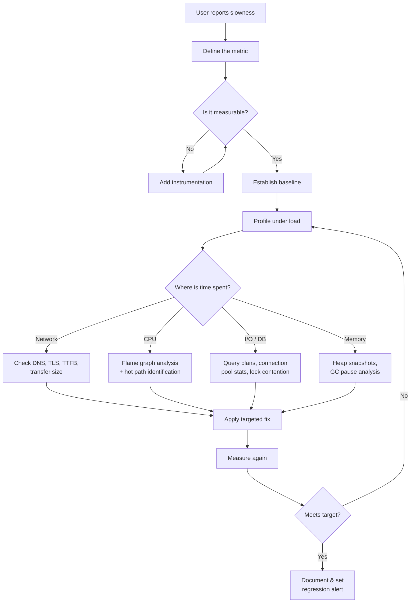

# Performance Engineering

Performance is not a feature you bolt on at the end. It is an architectural decision you make from day one, and a discipline you practice with every commit. This section treats performance as a first-class engineering concern — measurable, reproducible, and systematically improvable.

## Why This Section Exists

Most performance advice online falls into two buckets: shallow tips ("use `useMemo`!") or academic papers nobody reads. This section bridges that gap. Every topic includes **real profiling output**, **before/after benchmarks**, and **production war stories** so you can connect theory to practice.

Whether you are hunting a memory leak at 3 AM or designing a system that needs to serve 50,000 requests per second, the material here will give you a rigorous mental model and a concrete playbook.

## What You Will Learn

### Profiling & Measurement
How to instrument applications correctly, read flame graphs, interpret `EXPLAIN ANALYZE` output, and avoid the cardinal sin of optimizing without measuring. Covers CPU profiling, heap snapshots, allocation timelines, and distributed tracing.

### Runtime Internals
V8's hidden classes, inline caches, and JIT compilation pipeline. The Node.js event loop — not the hand-wavy version, but the actual libuv phases with tick-by-tick walkthroughs. How the browser rendering pipeline (style, layout, paint, composite) determines what "fast" means on the frontend.

### Caching Strategies
From HTTP cache headers to multi-layer caching architectures (CDN, reverse proxy, application cache, database cache). Cache invalidation patterns that actually work in distributed systems — TTL-based, event-driven, and hybrid approaches.

### Database Tuning
Index design beyond `CREATE INDEX`. Query plan analysis, connection pooling, read replicas, materialized views, and partitioning strategies. PostgreSQL and MySQL specific deep-dives with real query rewrites.

### Edge Computing
Moving computation closer to users with Cloudflare Workers, Deno Deploy, and Vercel Edge Functions. When edge makes sense, when it doesn't, and how to architect for a split compute model.

## Performance Investigation Workflow

When something is slow, resist the urge to guess. Follow this systematic workflow:

## Learning Path

| Order | Topic | Difficulty | Time |
|-------|-------|------------|------|
| 1 | Browser rendering pipeline | Beginner | 1 hr |
| 2 | Node.js event loop deep-dive | Intermediate | 2 hr |
| 3 | V8 engine internals | Advanced | 3 hr |
| 4 | Database query optimization | Intermediate | 2 hr |
| 5 | Caching architectures | Intermediate | 2 hr |
| 6 | Memory leak detection | Advanced | 2 hr |
| 7 | Edge computing patterns | Intermediate | 1.5 hr |
| 8 | Full-stack performance audit | Advanced | 3 hr |

## Subsections

- **[Profiling & Measurement](/performance/profiling/)** — Tools, techniques, and mental models for finding bottlenecks
- **[V8 & Node.js Internals](/performance/runtime-internals/)** — How the engine executes your code and where it can go wrong
- **[Caching Strategies](/performance/caching/)** — Multi-layer caching from CDN edge to database query cache
- **[Database Tuning](/performance/database-tuning/)** — Index design, query rewrites, and connection management
- **[Edge Computing](/performance/edge-computing/)** — Architectures for compute at the network edge
- **[Memory Management](/performance/memory/)** — Leak detection, GC tuning, and allocation patterns
- **[Frontend Performance](/performance/frontend/)** — Core Web Vitals, bundle optimization, and rendering strategies

---

> *"Premature optimization is the root of all evil — but so is premature de-optimization. Measure first, then act with precision."*
