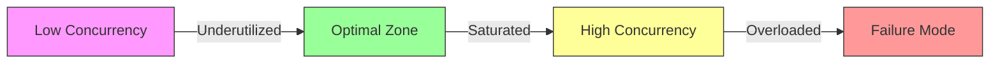
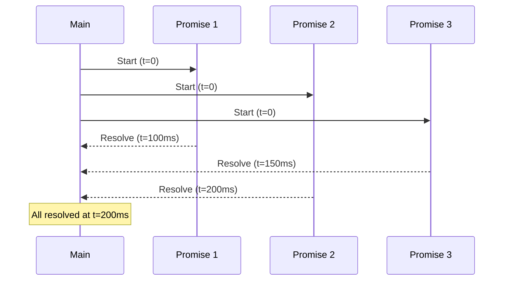

# Concurrency Patterns in Node.js

## Why Concurrency Patterns Exist

Node.js runs JavaScript on a single thread, but that does not mean it is limited to sequential execution. The event loop, combined with non-blocking I/O, allows thousands of concurrent operations — network requests, database queries, file reads — to be in-flight simultaneously. The problem is not *achieving* concurrency; it is *controlling* it.

Without concurrency control, a naive loop launching 100,000 HTTP requests will exhaust file descriptors, overwhelm downstream services, trigger rate limits, and crash the process with `EMFILE` or out-of-memory errors. Concurrency patterns solve the fundamental tension between throughput (doing as much as possible) and stability (not destroying everything in the process).

### Historical Context

Early Node.js code relied on callbacks and manual tracking. Libraries like `async.js` provided `parallelLimit` and `queue` primitives. With the adoption of Promises and async/await (Node 8+), native patterns emerged: `Promise.all`, `Promise.allSettled`, `Promise.race`. The ecosystem responded with `p-limit`, `p-queue`, and `bottleneck` for more sophisticated control. Today, production systems combine these primitives with connection pooling, circuit breakers, and backpressure mechanisms.

## First Principles

### The Event Loop and Concurrency

Node.js concurrency is cooperative, not preemptive. Every async operation yields control back to the event loop when it awaits I/O. The event loop then picks the next ready callback. This means:

1. **CPU-bound work blocks everything** — no other operations proceed until the current synchronous block finishes.
2. **I/O-bound work scales naturally** — thousands of pending I/O operations cost minimal memory (just the promise/callback reference and kernel state).
3. **Concurrency is not parallelism** — concurrent operations interleave on one thread; parallel operations execute simultaneously on multiple threads.

### The Concurrency Spectrum

$$
\text{Throughput} = \frac{\text{Concurrency}}{\text{Average Latency}}
$$

This is a simplified form of Little's Law applied to request processing. If each operation takes 100ms on average and you allow 10 concurrent operations, your throughput is approximately 100 operations/second. Double the concurrency, double the throughput — until you hit a bottleneck (CPU, memory, downstream capacity).

The optimal concurrency level is where:

$$
C^* = \arg\max_C \left[ \text{Throughput}(C) - \text{ErrorRate}(C) \cdot \text{Penalty} \right]
$$

Beyond the optimal point, increased concurrency causes timeouts, retries, and cascading failures that reduce effective throughput.



## Core Mechanics

### Promise.all — Unbounded Concurrency

`Promise.all` launches all promises immediately. There is no concurrency limit. Every promise begins executing the moment it is created.



```typescript
// DANGER: Unbounded concurrency
async function fetchAllUrls(urls: string[]): Promise<Response[]> {
  // All requests fire simultaneously
  return Promise.all(urls.map(url => fetch(url)));
}

// With 10,000 URLs, this opens 10,000 connections at once
```

### Promise.allSettled — Unbounded with Error Tolerance

Unlike `Promise.all`, which rejects on the first failure, `Promise.allSettled` waits for every promise to complete regardless of outcome:

```typescript
interface SettledResult<T> {
  status: 'fulfilled' | 'rejected';
  value?: T;
  reason?: Error;
}

async function fetchAllWithResults(
  urls: string[]
): Promise<SettledResult<Response>[]> {
  const results = await Promise.allSettled(
    urls.map(url => fetch(url))
  );

  const failures = results.filter(r => r.status === 'rejected');
  if (failures.length > 0) {
    console.warn(`${failures.length}/${urls.length} requests failed`);
  }

  return results;
}
```

### Promise.race — First to Finish Wins

Useful for timeouts and competitive redundancy:

```typescript
function withTimeout<T>(
  promise: Promise<T>,
  ms: number,
  message = 'Operation timed out'
): Promise<T> {
  const timeout = new Promise<never>((_, reject) =>
    setTimeout(() => reject(new Error(message)), ms)
  );
  return Promise.race([promise, timeout]);
}

// Hedged requests — fire to multiple replicas, use first response
async function hedgedRequest(
  urls: string[],
  timeoutMs: number
): Promise<Response> {
  const controller = new AbortController();
  try {
    const result = await Promise.race(
      urls.map(url =>
        fetch(url, { signal: controller.signal })
      )
    );
    return result;
  } finally {
    controller.abort(); // Cancel remaining requests
  }
}
```

## Implementation: Concurrency Limiters

### Building a Semaphore from Scratch

A semaphore is the fundamental concurrency primitive. It maintains a count of available permits and queues waiters when permits are exhausted.

```typescript
class Semaphore {
  private permits: number;
  private readonly queue: Array<() => void> = [];

  constructor(maxConcurrency: number) {
    if (maxConcurrency < 1) {
      throw new RangeError('Semaphore requires at least 1 permit');
    }
    this.permits = maxConcurrency;
  }

  async acquire(): Promise<void> {
    if (this.permits > 0) {
      this.permits--;
      return;
    }

    return new Promise<void>(resolve => {
      this.queue.push(resolve);
    });
  }

  release(): void {
    const next = this.queue.shift();
    if (next) {
      // Don't increment permits — hand the permit directly to the waiter
      // Use queueMicrotask to avoid deep stack recursion
      queueMicrotask(next);
    } else {
      this.permits++;
    }
  }

  get available(): number {
    return this.permits;
  }

  get waiting(): number {
    return this.queue.length;
  }

  async withPermit<T>(fn: () => Promise<T>): Promise<T> {
    await this.acquire();
    try {
      return await fn();
    } finally {
      this.release();
    }
  }
}

// Usage
const semaphore = new Semaphore(10);

async function rateLimitedFetch(url: string): Promise<Response> {
  return semaphore.withPermit(() => fetch(url));
}

async function processUrls(urls: string[]): Promise<Response[]> {
  return Promise.all(urls.map(url => rateLimitedFetch(url)));
}
```

### Building p-limit from Scratch

The popular `p-limit` library is essentially a specialized semaphore for promise-returning functions:

```typescript
type LimitFunction = <T>(
  fn: () => Promise<T>
) => Promise<T>;

function pLimit(concurrency: number): LimitFunction {
  if (!Number.isInteger(concurrency) || concurrency < 1) {
    throw new TypeError('Expected concurrency to be a positive integer');
  }

  let activeCount = 0;
  const queue: Array<() => void> = [];

  function tryRun(): void {
    if (activeCount < concurrency && queue.length > 0) {
      const next = queue.shift()!;
      activeCount++;
      next();
    }
  }

  return function limit<T>(fn: () => Promise<T>): Promise<T> {
    return new Promise<T>((resolve, reject) => {
      queue.push(() => {
        fn().then(
          value => {
            resolve(value);
            activeCount--;
            tryRun();
          },
          error => {
            reject(error);
            activeCount--;
            tryRun();
          }
        );
      });

      tryRun();
    });
  };
}

// Usage
const limit = pLimit(5);

async function fetchMany(urls: string[]): Promise<string[]> {
  const promises = urls.map(url =>
    limit(() => fetch(url).then(r => r.text()))
  );
  return Promise.all(promises);
}
```

### Weighted Semaphore

Some operations consume more resources than others. A weighted semaphore allows different operations to claim different numbers of permits:

```typescript
class WeightedSemaphore {
  private available: number;
  private readonly capacity: number;
  private readonly queue: Array<{ weight: number; resolve: () => void }> = [];

  constructor(capacity: number) {
    this.capacity = capacity;
    this.available = capacity;
  }

  async acquire(weight: number): Promise<void> {
    if (weight > this.capacity) {
      throw new RangeError(
        `Weight ${weight} exceeds semaphore capacity ${this.capacity}`
      );
    }

    if (this.available >= weight && this.queue.length === 0) {
      this.available -= weight;
      return;
    }

    return new Promise<void>(resolve => {
      this.queue.push({ weight, resolve });
    });
  }

  release(weight: number): void {
    this.available += weight;

    // Try to drain the queue
    while (this.queue.length > 0) {
      const next = this.queue[0];
      if (next.weight <= this.available) {
        this.queue.shift();
        this.available -= next.weight;
        queueMicrotask(next.resolve);
      } else {
        break; // Not enough capacity for the next waiter
      }
    }
  }

  async withPermit<T>(weight: number, fn: () => Promise<T>): Promise<T> {
    await this.acquire(weight);
    try {
      return await fn();
    } finally {
      this.release(weight);
    }
  }
}

// Usage: heavy queries get weight 5, light queries get weight 1
const dbSemaphore = new WeightedSemaphore(20);

async function runHeavyQuery(sql: string): Promise<unknown> {
  return dbSemaphore.withPermit(5, () => db.query(sql));
}

async function runLightQuery(sql: string): Promise<unknown> {
  return dbSemaphore.withPermit(1, () => db.query(sql));
}
```

## Connection Pool Implementation

Connection pools are the most critical concurrency pattern in backend systems. Every database driver uses one internally, but understanding the mechanics is essential for tuning.

```typescript
interface PoolOptions {
  maxSize: number;
  minSize: number;
  acquireTimeoutMs: number;
  idleTimeoutMs: number;
  maxLifetimeMs: number;
  validateOnBorrow: boolean;
}

interface Connectable {
  connect(): Promise<void>;
  disconnect(): Promise<void>;
  isAlive(): Promise<boolean>;
  readonly createdAt: number;
  lastUsedAt: number;
}

class ConnectionPool<T extends Connectable> {
  private readonly idle: T[] = [];
  private readonly active = new Set<T>();
  private readonly waiters: Array<{
    resolve: (conn: T) => void;
    reject: (err: Error) => void;
    timer: ReturnType<typeof setTimeout>;
  }> = [];
  private readonly options: PoolOptions;
  private readonly factory: () => Promise<T>;
  private closed = false;
  private maintenanceInterval: ReturnType<typeof setInterval> | null = null;

  constructor(factory: () => Promise<T>, options: Partial<PoolOptions> = {}) {
    this.factory = factory;
    this.options = {
      maxSize: 10,
      minSize: 2,
      acquireTimeoutMs: 30_000,
      idleTimeoutMs: 60_000,
      maxLifetimeMs: 3_600_000, // 1 hour
      validateOnBorrow: true,
      ...options,
    };

    this.startMaintenance();
  }

  get size(): number {
    return this.idle.length + this.active.size;
  }

  get availableCount(): number {
    return this.idle.length;
  }

  get waitingCount(): number {
    return this.waiters.length;
  }

  async acquire(): Promise<T> {
    if (this.closed) {
      throw new Error('Pool is closed');
    }

    // Try to get an idle connection
    while (this.idle.length > 0) {
      const conn = this.idle.pop()!;

      // Check max lifetime
      if (Date.now() - conn.createdAt > this.options.maxLifetimeMs) {
        await this.destroyConnection(conn);
        continue;
      }

      // Validate if configured
      if (this.options.validateOnBorrow) {
        try {
          const alive = await conn.isAlive();
          if (!alive) {
            await this.destroyConnection(conn);
            continue;
          }
        } catch {
          await this.destroyConnection(conn);
          continue;
        }
      }

      conn.lastUsedAt = Date.now();
      this.active.add(conn);
      return conn;
    }

    // Try to create a new connection
    if (this.size < this.options.maxSize) {
      const conn = await this.createConnection();
      this.active.add(conn);
      return conn;
    }

    // Wait for a connection to be released
    return new Promise<T>((resolve, reject) => {
      const timer = setTimeout(() => {
        const idx = this.waiters.findIndex(w => w.resolve === resolve);
        if (idx !== -1) {
          this.waiters.splice(idx, 1);
        }
        reject(new Error(
          `Connection acquire timeout after ${this.options.acquireTimeoutMs}ms. ` +
          `Pool: ${this.size}/${this.options.maxSize}, ` +
          `Active: ${this.active.size}, ` +
          `Waiting: ${this.waiters.length}`
        ));
      }, this.options.acquireTimeoutMs);

      this.waiters.push({ resolve, reject, timer });
    });
  }

  release(conn: T): void {
    if (!this.active.has(conn)) {
      return; // Already released or not from this pool
    }

    this.active.delete(conn);
    conn.lastUsedAt = Date.now();

    // If waiters exist, hand off directly
    if (this.waiters.length > 0) {
      const waiter = this.waiters.shift()!;
      clearTimeout(waiter.timer);
      this.active.add(conn);
      waiter.resolve(conn);
      return;
    }

    // Return to idle pool
    this.idle.push(conn);
  }

  async withConnection<R>(fn: (conn: T) => Promise<R>): Promise<R> {
    const conn = await this.acquire();
    try {
      return await fn(conn);
    } finally {
      this.release(conn);
    }
  }

  async close(): Promise<void> {
    this.closed = true;

    if (this.maintenanceInterval) {
      clearInterval(this.maintenanceInterval);
    }

    // Reject all waiters
    for (const waiter of this.waiters) {
      clearTimeout(waiter.timer);
      waiter.reject(new Error('Pool is closing'));
    }
    this.waiters.length = 0;

    // Destroy all connections
    const allConns = [...this.idle, ...this.active];
    this.idle.length = 0;
    this.active.clear();

    await Promise.allSettled(
      allConns.map(conn => this.destroyConnection(conn))
    );
  }

  private async createConnection(): Promise<T> {
    const conn = await this.factory();
    await conn.connect();
    return conn;
  }

  private async destroyConnection(conn: T): Promise<void> {
    try {
      await conn.disconnect();
    } catch {
      // Swallow errors during destruction
    }
  }

  private startMaintenance(): void {
    this.maintenanceInterval = setInterval(async () => {
      await this.evictIdleConnections();
      await this.ensureMinConnections();
    }, 30_000);
  }

  private async evictIdleConnections(): Promise<void> {
    const now = Date.now();
    const toRemove: T[] = [];

    this.idle.forEach((conn, i) => {
      if (now - conn.lastUsedAt > this.options.idleTimeoutMs) {
        toRemove.push(conn);
      }
    });

    for (const conn of toRemove) {
      const idx = this.idle.indexOf(conn);
      if (idx !== -1) {
        this.idle.splice(idx, 1);
        await this.destroyConnection(conn);
      }
    }
  }

  private async ensureMinConnections(): Promise<void> {
    while (this.size < this.options.minSize && !this.closed) {
      try {
        const conn = await this.createConnection();
        this.idle.push(conn);
      } catch {
        break; // Stop trying if creation fails
      }
    }
  }
}
```

## Edge Cases and Failure Modes

### 1. Promise Leak (Fire and Forget)

```typescript
// BUG: Unhandled promise rejection if fetchUser fails
function handleRequest(userId: string): void {
  fetchUser(userId).then(user => {
    cache.set(userId, user);
  });
  // No .catch(), no await — crash potential
}

// FIX: Always handle errors
async function handleRequestFixed(userId: string): Promise<void> {
  try {
    const user = await fetchUser(userId);
    cache.set(userId, user);
  } catch (err) {
    logger.error('Failed to fetch user for cache warming', { userId, err });
  }
}
```

### 2. Thundering Herd

When a cache expires, all concurrent requests see the miss and simultaneously hit the database:

```typescript
class DedupedCache<T> {
  private cache = new Map<string, { value: T; expiresAt: number }>();
  private inflight = new Map<string, Promise<T>>();

  async get(key: string, fetcher: () => Promise<T>, ttlMs: number): Promise<T> {
    const cached = this.cache.get(key);
    if (cached && cached.expiresAt > Date.now()) {
      return cached.value;
    }

    // Deduplicate concurrent fetches
    const existing = this.inflight.get(key);
    if (existing) {
      return existing;
    }

    const promise = fetcher().then(value => {
      this.cache.set(key, { value, expiresAt: Date.now() + ttlMs });
      this.inflight.delete(key);
      return value;
    }).catch(err => {
      this.inflight.delete(key);
      throw err;
    });

    this.inflight.set(key, promise);
    return promise;
  }
}
```

### 3. Deadlock with Nested Semaphores

```typescript
const sem = new Semaphore(1);

async function outer(): Promise<void> {
  await sem.withPermit(async () => {
    // DEADLOCK: inner() tries to acquire the same semaphore
    await inner();
  });
}

async function inner(): Promise<void> {
  await sem.withPermit(async () => {
    console.log('This will never execute');
  });
}
```

::: danger Deadlock Prevention
Never allow nested acquisition of the same semaphore. If functions may call each other, use separate semaphores or pass a "permit token" through the call chain to indicate the permit is already held.
:::

### 4. Starvation in FIFO Queues

Small tasks can starve if large tasks hold all permits. The weighted semaphore above mitigates this but does not fully prevent it. A priority queue is needed for true fairness:

```typescript
class PrioritySemaphore {
  private available: number;
  private readonly queue: Array<{
    priority: number;
    resolve: () => void;
  }> = [];

  constructor(permits: number) {
    this.available = permits;
  }

  async acquire(priority: number = 0): Promise<void> {
    if (this.available > 0) {
      this.available--;
      return;
    }

    return new Promise<void>(resolve => {
      const entry = { priority, resolve };
      // Insert in priority order (higher priority = lower number)
      const idx = this.queue.findIndex(e => e.priority > priority);
      if (idx === -1) {
        this.queue.push(entry);
      } else {
        this.queue.splice(idx, 0, entry);
      }
    });
  }

  release(): void {
    if (this.queue.length > 0) {
      const next = this.queue.shift()!;
      queueMicrotask(next.resolve);
    } else {
      this.available++;
    }
  }
}
```

## Performance Characteristics

### Overhead of Concurrency Primitives

| Pattern | Overhead per op | Memory per waiting task | Throughput limit |
|---------|----------------|------------------------|------------------|
| `Promise.all` (unbounded) | ~0.5 us | ~200 bytes | OS/downstream limits |
| Semaphore (custom) | ~1 us | ~250 bytes | Configured |
| `p-limit` | ~1.2 us | ~300 bytes | Configured |
| Connection pool acquire | ~5-50 us | ~300 bytes + connection | Pool size |
| `bottleneck` (Redis) | ~1-5 ms | Redis entry | Distributed |

### Optimal Concurrency Estimation

For I/O-bound operations, apply Little's Law:

$$
C = \lambda \cdot W
$$

Where:
- $C$ = number of concurrent operations
- $\lambda$ = arrival rate (requests per second)
- $W$ = average service time (seconds)

For a database with 5ms average query time handling 1,000 queries/second:

$$
C = 1000 \times 0.005 = 5 \text{ concurrent connections minimum}
$$

Add headroom for variance — typically 2-3x the minimum:

$$
C_{\text{recommended}} = C \times (1 + \text{CV}^2)
$$

Where CV is the coefficient of variation of service time. For highly variable workloads (CV > 1), the multiplier grows significantly.

### Benchmark: Concurrency Control Overhead

```typescript
// Benchmark: 100,000 operations through different concurrency patterns
// Operation: resolve a promise immediately (measuring pure overhead)

async function benchmarkOverhead(): Promise<void> {
  const iterations = 100_000;

  // Raw Promise.all
  const t0 = performance.now();
  const raw = Array.from({ length: iterations }, () => Promise.resolve(1));
  await Promise.all(raw);
  const rawTime = performance.now() - t0;

  // Through p-limit(100)
  const limit = pLimit(100);
  const t1 = performance.now();
  const limited = Array.from({ length: iterations }, () =>
    limit(() => Promise.resolve(1))
  );
  await Promise.all(limited);
  const limitedTime = performance.now() - t1;

  // Through semaphore(100)
  const sem = new Semaphore(100);
  const t2 = performance.now();
  const semaphoreBased = Array.from({ length: iterations }, () =>
    sem.withPermit(() => Promise.resolve(1))
  );
  await Promise.all(semaphoreBased);
  const semTime = performance.now() - t2;

  console.log(`Raw Promise.all: ${rawTime.toFixed(1)}ms`);
  console.log(`p-limit(100):    ${limitedTime.toFixed(1)}ms`);
  console.log(`Semaphore(100):  ${semTime.toFixed(1)}ms`);
}

// Typical results (Node 20, M2 Mac):
// Raw Promise.all: 45ms
// p-limit(100):    120ms
// Semaphore(100):  95ms
```

## Mathematical Foundations

### Queueing Theory: M/M/c Model

A connection pool behaves like an M/M/c queue where:
- Arrivals follow a Poisson process with rate $\lambda$
- Service times are exponentially distributed with rate $\mu$
- There are $c$ servers (connections)

The probability that all servers are busy (Erlang C formula):

$$
C(c, a) = \frac{\frac{a^c}{c!} \cdot \frac{c}{c - a}}{\sum_{k=0}^{c-1} \frac{a^k}{k!} + \frac{a^c}{c!} \cdot \frac{c}{c - a}}
$$

Where $a = \lambda / \mu$ is the offered load.

The average wait time for a request when the pool is saturated:

$$
W_q = \frac{C(c, a)}{\mu \cdot c \cdot (1 - \rho)}
$$

Where $\rho = a / c$ is the server utilization. This formula shows that wait times grow hyperbolically as utilization approaches 1 — a 90% utilized pool has 10x the wait time of a 50% utilized pool.

### Token Bucket Rate Limiting

For distributed rate limiting, the token bucket algorithm provides smooth rate control:

$$
\text{tokens}(t) = \min\left(B, \text{tokens}(t_0) + r \cdot (t - t_0)\right)
$$

Where $B$ is the bucket capacity (burst size) and $r$ is the refill rate.

```typescript
class TokenBucket {
  private tokens: number;
  private lastRefill: number;

  constructor(
    private readonly capacity: number,
    private readonly refillRate: number // tokens per second
  ) {
    this.tokens = capacity;
    this.lastRefill = Date.now();
  }

  tryConsume(count: number = 1): boolean {
    this.refill();
    if (this.tokens >= count) {
      this.tokens -= count;
      return true;
    }
    return false;
  }

  async waitForToken(count: number = 1): Promise<void> {
    while (!this.tryConsume(count)) {
      const needed = count - this.tokens;
      const waitMs = (needed / this.refillRate) * 1000;
      await new Promise(resolve => setTimeout(resolve, waitMs));
    }
  }

  private refill(): void {
    const now = Date.now();
    const elapsed = (now - this.lastRefill) / 1000;
    this.tokens = Math.min(this.capacity, this.tokens + elapsed * this.refillRate);
    this.lastRefill = now;
  }
}
```

::: info War Story
**The 50,000 Webhook Storm**

A SaaS platform processed webhook deliveries using `Promise.all` with no concurrency limit. When a popular integration triggered an event affecting 50,000 endpoints, the system launched 50,000 simultaneous HTTP requests. This exhausted the OS file descriptor limit (ulimit was 65,536), caused the process to run out of memory building 50,000 TLS contexts, and the entire webhook delivery system went down for 45 minutes.

The fix was a two-level concurrency control: a global semaphore of 500 concurrent outbound requests, and per-destination rate limiting of 10 requests/second using a token bucket. Delivery time increased from "instantly crash" to 100 seconds — a 100% improvement in the "not crashing" metric.
:::

::: info War Story
**Connection Pool Exhaustion at 3 AM**

A Node.js microservice used a PostgreSQL connection pool with `maxSize: 20`. During normal traffic, utilization hovered at 30%. At 3 AM, a cron job launched 50 concurrent analytics queries, each holding a connection for 5-30 seconds. The pool was instantly exhausted. Regular API requests queued up, hit the 5-second acquire timeout, and returned 503 errors. The auto-scaler saw increased error rates, launched more instances, and each new instance tried to open 20 connections — amplifying the problem.

The fix: (1) analytics queries moved to a read replica with a separate pool, (2) the cron job used a semaphore limiting it to 5 concurrent queries, (3) pool acquire timeout was increased to 30 seconds with circuit breaking at 80% pool utilization.
:::

## Decision Framework

### Choosing the Right Pattern

| Scenario | Pattern | Why |
|----------|---------|-----|
| Fetch 5-10 independent resources | `Promise.all` | Low count, overhead not justified |
| Fetch 1,000+ URLs | `p-limit(50)` or Semaphore | Prevent resource exhaustion |
| Database queries in request handler | Connection pool | Reuse expensive connections |
| Third-party API with rate limit | Token bucket + semaphore | Respect rate limits, maximize throughput |
| Mixed CPU and I/O work | Worker pool + semaphore | Offload CPU work, limit I/O |
| Distributed rate limiting | Redis-based (`bottleneck`) | Cross-instance coordination |
| Critical path with SLA | Hedged requests + `Promise.race` | Reduce tail latency |

### When NOT to Use Concurrency Control

- **Single sequential dependency chain** — if B depends on A, and C depends on B, concurrency adds overhead with no benefit.
- **CPU-bound work** — concurrency patterns help I/O waits. For CPU work, use [worker threads](./worker-threads.md).
- **Very low volume** — if you process 10 requests/minute, a semaphore is unnecessary complexity.

## Advanced Topics

### Adaptive Concurrency (AIMD)

TCP uses Additive Increase / Multiplicative Decrease (AIMD) for congestion control. The same principle applies to request concurrency:

```typescript
class AdaptiveConcurrency {
  private concurrency: number;
  private readonly minConcurrency: number;
  private readonly maxConcurrency: number;
  private readonly increaseStep: number;
  private readonly decreaseFactor: number;
  private semaphore: Semaphore;

  constructor(options: {
    initial?: number;
    min?: number;
    max?: number;
    increaseStep?: number;
    decreaseFactor?: number;
  } = {}) {
    this.concurrency = options.initial ?? 10;
    this.minConcurrency = options.min ?? 1;
    this.maxConcurrency = options.max ?? 200;
    this.increaseStep = options.increaseStep ?? 1;
    this.decreaseFactor = options.decreaseFactor ?? 0.5;
    this.semaphore = new Semaphore(this.concurrency);
  }

  async execute<T>(fn: () => Promise<T>): Promise<T> {
    return this.semaphore.withPermit(async () => {
      const start = performance.now();
      try {
        const result = await fn();
        const latency = performance.now() - start;
        this.onSuccess(latency);
        return result;
      } catch (err) {
        this.onFailure();
        throw err;
      }
    });
  }

  private onSuccess(latencyMs: number): void {
    // Additive increase on success
    if (this.concurrency < this.maxConcurrency) {
      this.adjustConcurrency(
        Math.min(this.concurrency + this.increaseStep, this.maxConcurrency)
      );
    }
  }

  private onFailure(): void {
    // Multiplicative decrease on failure
    const newLevel = Math.max(
      this.minConcurrency,
      Math.floor(this.concurrency * this.decreaseFactor)
    );
    this.adjustConcurrency(newLevel);
  }

  private adjustConcurrency(newLevel: number): void {
    if (newLevel !== this.concurrency) {
      this.concurrency = newLevel;
      this.semaphore = new Semaphore(newLevel);
    }
  }
}
```

### Structured Concurrency with AbortController

Modern Node.js supports cancellation via `AbortController`, enabling structured concurrency where child operations are canceled when the parent scope exits:

```typescript
class ConcurrencyScope {
  private readonly controller = new AbortController();
  private readonly tasks: Promise<unknown>[] = [];

  get signal(): AbortSignal {
    return this.controller.signal;
  }

  spawn<T>(fn: (signal: AbortSignal) => Promise<T>): Promise<T> {
    if (this.controller.signal.aborted) {
      return Promise.reject(new Error('Scope already aborted'));
    }

    const task = fn(this.controller.signal);
    this.tasks.push(task);
    return task;
  }

  abort(reason?: string): void {
    this.controller.abort(reason);
  }

  async settle(): Promise<PromiseSettledResult<unknown>[]> {
    return Promise.allSettled(this.tasks);
  }

  async join(): Promise<unknown[]> {
    try {
      return await Promise.all(this.tasks);
    } catch (err) {
      this.abort('Task failed');
      throw err;
    }
  }
}

// Usage
async function processOrder(orderId: string): Promise<void> {
  const scope = new ConcurrencyScope();

  // Set overall timeout
  const timeout = setTimeout(() => scope.abort('timeout'), 30_000);

  try {
    const user = scope.spawn(signal =>
      fetchUser(orderId, { signal })
    );
    const inventory = scope.spawn(signal =>
      checkInventory(orderId, { signal })
    );
    const payment = scope.spawn(signal =>
      validatePayment(orderId, { signal })
    );

    await scope.join();
  } finally {
    clearTimeout(timeout);
  }
}
```

### Backpressure with Async Iterators

For streaming workloads, async iterators provide natural backpressure:

```typescript
async function* rateLimitedIterator<T>(
  source: AsyncIterable<T>,
  concurrency: number
): AsyncGenerator<T> {
  const semaphore = new Semaphore(concurrency);
  const buffer: T[] = [];
  let done = false;
  let error: Error | null = null;

  // Producer: reads from source with concurrency control
  const producer = (async () => {
    try {
      for await (const item of source) {
        await semaphore.acquire();
        buffer.push(item);
        semaphore.release();
      }
    } catch (err) {
      error = err as Error;
    } finally {
      done = true;
    }
  })();

  // Consumer: yields items as they become available
  while (!done || buffer.length > 0) {
    if (buffer.length > 0) {
      yield buffer.shift()!;
    } else {
      await new Promise(resolve => setTimeout(resolve, 1));
    }
  }

  if (error) {
    throw error;
  }

  await producer;
}
```

::: tip Key Takeaway
Concurrency control is about finding the sweet spot between underutilization and overload. Start with a conservative limit, measure, and adjust. The best systems adapt their concurrency automatically based on observed latency and error rates, using patterns like AIMD or gradient-based controllers.
:::

## Cross-References

- [Worker Threads](./worker-threads.md) — for CPU-bound parallelism
- [Connection Pool Tuning](../database-tuning/connection-pool-tuning.md) — applying Little's Law to database pools
- [N+1 Query Detection](../database-tuning/n-plus-one.md) — DataLoader uses concurrency batching
- [Application-Level Caching](../caching-strategies/application-level.md) — deduplication and memoization patterns
