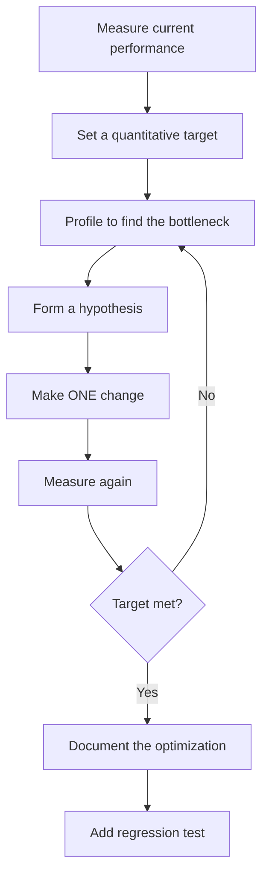

# Optimization

Profiling tells you *where* the problem is. Optimization tells you *how to fix it*. But optimization without understanding the underlying systems is a recipe for making things worse — a change that speeds up one benchmark may catastrophically degrade another. This section gives you deep knowledge of the systems your code runs on (V8, libuv, the OS scheduler) so that your optimizations are principled rather than lucky.

## The Optimization Hierarchy

Not all optimizations are created equal. They fall into a hierarchy of impact:

```mermaid
pyramid
    title Optimization Impact (Most to Least)
```

| Level | Category | Typical Impact | Example |
|-------|---------|---------------|---------|
| **1** | Architecture | 10-1000x | Switching from polling to event-driven |
| **2** | Algorithm | 10-100x | O(n^2) to O(n log n) sort |
| **3** | Data structure | 2-10x | Array to hash map for lookups |
| **4** | I/O optimization | 2-10x | Batch queries, connection pooling |
| **5** | Concurrency | 2-8x | Parallel processing, async I/O |
| **6** | Caching | 2-100x | Avoid recomputation entirely |
| **7** | Memory management | 1.5-3x | Reduce GC pressure, avoid allocations |
| **8** | Engine-level | 1.1-2x | V8-friendly code patterns |
| **9** | Micro-optimization | 1.01-1.1x | Bit manipulation, loop unrolling |

Always start from the top. An architectural change that eliminates 90% of work dwarfs any amount of micro-optimization.

## The Optimization Process



Rules:

1. **Never optimize without a target.** "Make it faster" is not a target. "Reduce P99 latency from 800ms to 200ms" is.
2. **Change one thing at a time.** Otherwise you cannot attribute improvements.
3. **Measure in the same conditions.** Same data, same load, same hardware.
4. **Document what you did and why.** Future you (or your successor) needs to understand the trade-off.

## Subsections

- **[Node.js Event Loop Deep Dive](./nodejs-event-loop)** — libuv architecture, event loop phases, microtasks vs macrotasks, event loop lag monitoring
- **[Memory Management](./memory-management)** — V8 heap layout, garbage collection algorithms, leak patterns, WeakRef and FinalizationRegistry
- **[V8 Optimization](./v8-optimization)** — Hidden classes, inline caches, TurboFan, deoptimization, writing V8-friendly code
- **[Algorithmic Optimization](./algorithmic-optimization)** — Big-O analysis, amortized analysis, space-time trade-offs, practical patterns
- **[Concurrency Patterns](./concurrency-patterns)** — Promise combinators, concurrency limiting, semaphores, connection pools, work queues
- **[Worker Threads](./worker-threads)** — Workers vs child processes vs cluster, SharedArrayBuffer, Atomics, when to use workers

## Quick Reference: Common Bottlenecks and Solutions

| Bottleneck | Signal | Solution | Section |
|-----------|--------|----------|---------|
| Event loop blocked | High event loop lag, low throughput | Move CPU work to workers, chunk processing | [Event Loop](./nodejs-event-loop) |
| GC pauses | Latency spikes, saw-tooth memory | Reduce allocations, tune GC | [Memory](./memory-management) |
| V8 deoptimization | Sudden slowdowns, megamorphic call sites | Monomorphic code, avoid `arguments` | [V8](./v8-optimization) |
| O(n^2) algorithm | Latency grows quadratically with data | Better algorithm or data structure | [Algorithmic](./algorithmic-optimization) |
| Sequential async operations | High latency, low throughput | `Promise.all`, concurrency limiting | [Concurrency](./concurrency-patterns) |
| CPU-bound on single core | One core at 100%, others idle | Worker threads | [Workers](./worker-threads) |

---

> *"Make it work, make it right, make it fast — in that order." — Kent Beck*
