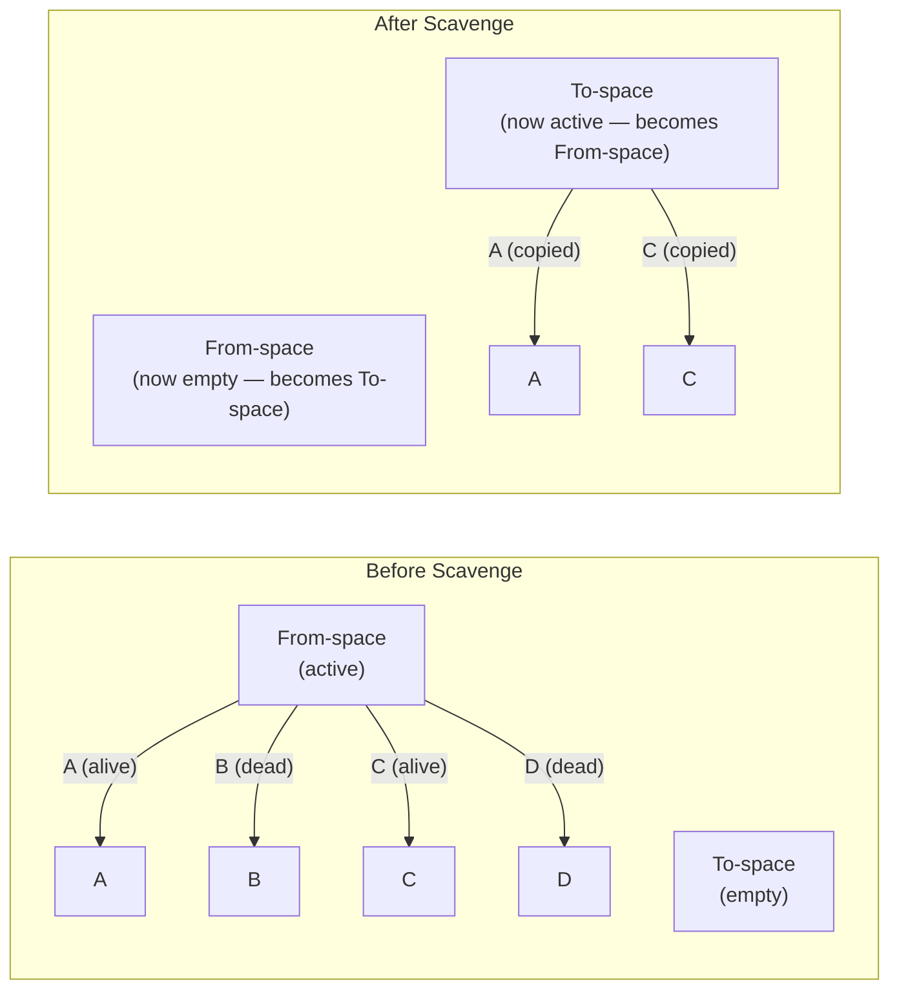

# Memory Management

V8's garbage collector is remarkably sophisticated — it uses generational collection, incremental marking, concurrent sweeping, and parallel scavenging to keep GC pauses short. But it cannot fix your code. Understanding how V8 organizes memory and collects garbage lets you write code that cooperates with the collector rather than fighting it. This page covers V8's memory architecture from the ground up, the algorithms it uses, common leak patterns, and modern APIs (WeakRef, FinalizationRegistry) for explicit memory lifecycle management.

## V8 Heap Layout

V8 divides its managed heap into several spaces, each optimized for different allocation patterns:

```
┌─────────────────────────────────────────────────────────────┐
│                         V8 Heap                              │
├─────────────────────────────────────────────────────────────┤
│                                                              │
│  ┌─────────────┐  ┌──────────────────────────────────────┐  │
│  │  New Space   │  │           Old Space                  │  │
│  │  (Young Gen) │  │           (Old Gen)                  │  │
│  │              │  │                                      │  │
│  │  ┌────────┐  │  │  ┌─────────────────────────────┐    │  │
│  │  │ From   │  │  │  │  Old Pointer Space           │    │  │
│  │  │ Semi-  │  │  │  │  (objects with pointers)     │    │  │
│  │  │ space  │  │  │  └─────────────────────────────┘    │  │
│  │  ├────────┤  │  │  ┌─────────────────────────────┐    │  │
│  │  │ To     │  │  │  │  Old Data Space              │    │  │
│  │  │ Semi-  │  │  │  │  (objects without pointers)  │    │  │
│  │  │ space  │  │  │  └─────────────────────────────┘    │  │
│  │  └────────┘  │  │                                      │  │
│  └─────────────┘  └──────────────────────────────────────┘  │
│                                                              │
│  ┌──────────────┐  ┌──────────────┐  ┌──────────────────┐  │
│  │ Large Object │  │  Code Space  │  │   Map Space       │  │
│  │ Space        │  │  (JIT code)  │  │   (hidden classes)│  │
│  └──────────────┘  └──────────────┘  └──────────────────┘  │
│                                                              │
└─────────────────────────────────────────────────────────────┘
```

### New Space (Young Generation)

- **Size:** Typically 1-8 MB per semi-space (configurable via `--max-semi-space-size`)
- **Purpose:** Short-lived objects. Most objects die young (the "generational hypothesis")
- **Structure:** Two equal-sized semi-spaces (From-space and To-space), used by the Scavenge algorithm
- **Allocation:** Bump pointer allocation (extremely fast — just increment a pointer)

```typescript
function processRequest(data: any): string {
  // ALL of these allocations go to New Space:
  const parsed = JSON.parse(data);          // Temporary object
  const filtered = parsed.items.filter(x => x.active); // Temporary array
  const result = JSON.stringify(filtered);  // Temporary string
  return result;
  // `parsed` and `filtered` are garbage immediately after this function returns.
  // They will be collected in the next Scavenge (young generation GC).
}
```

### Old Space (Old Generation)

- **Size:** Up to the V8 heap limit (default ~1.5 GB on 64-bit, configurable via `--max-old-space-size`)
- **Purpose:** Long-lived objects that survived two Scavenge cycles
- **Structure:** Divided into Old Pointer Space (objects containing references) and Old Data Space (raw data like strings and numbers)
- **Allocation:** Free list allocation (finds a hole of suitable size)
- **Collection:** Mark-Sweep-Compact (much slower than Scavenge but handles large heaps)

```typescript
// These objects will be promoted to Old Space:
const cache = new Map<string, any>();     // Lives for the entire process
const config = loadConfiguration();        // Loaded once at startup
const connectionPool = createPool(config); // Lives for the entire process
```

### Large Object Space

- **Purpose:** Objects larger than `kMaxRegularHeapObjectSize` (~256 KB in practice)
- **Special behavior:** Never moved by GC (too expensive to copy). Allocated directly in this space.
- **Examples:** Large arrays, large strings, large TypedArrays

```typescript
// This goes directly to Large Object Space:
const largeBuffer = Buffer.alloc(1_000_000); // 1 MB
const largeArray = new Array(100_000);       // Array with 100K slots
```

### Code Space

- **Purpose:** Stores JIT-compiled machine code generated by TurboFan
- **Special behavior:** Executable memory pages, managed separately
- **Size:** Grows as more code is compiled; can be significant in large applications

### Map Space

- **Purpose:** Stores "Maps" (V8's internal name for hidden classes / shapes)
- **Special behavior:** Fixed-size objects that describe object layouts
- **Why separate:** Maps are accessed very frequently and have a fixed size, so they benefit from being in a dedicated space

## Garbage Collection Algorithms

### Scavenge (Young Generation GC)

Scavenge uses Cheney's semi-space copying algorithm. It is extremely fast but uses 2x memory (only one semi-space is active at a time).



**Algorithm steps:**

1. **Start from GC roots** (global objects, stack variables, handles)
2. **Traverse all reachable objects** in From-space
3. **Copy each live object** to To-space (compacting in the process)
4. **Update all pointers** to reference the new locations
5. **Swap From-space and To-space** (the old From-space is now empty)
6. Dead objects (B, D) are never copied — they simply vanish when From-space is reclaimed

**Performance characteristics:**

- **Speed:** Proportional to the number of LIVE objects (not total objects). Since most young objects die quickly, this is very fast.
- **Pause time:** Typically < 1ms for small semi-spaces
- **Cost of allocation:** Near-zero (bump pointer)
- **Trade-off:** Uses 2x memory for young generation

**Promotion:** If an object survives two Scavenge cycles, it is "promoted" (copied) to Old Space. This is based on the generational hypothesis: if an object has survived this long, it will probably survive much longer.

### Mark-Sweep-Compact (Old Generation GC)

Old generation GC is a three-phase process, designed to handle large heaps:

#### Phase 1: Mark

Starting from GC roots, traverse the entire object graph and mark every reachable object. Uses a tri-color marking scheme:

```
White: Not yet visited (potentially garbage)
Grey:  Visited but children not yet processed
Black: Visited and all children processed (definitely alive)

Algorithm:
1. Start: all objects are white
2. Color GC roots grey
3. While grey set is not empty:
   a. Pick a grey object
   b. Mark all its white children grey
   c. Color it black
4. End: white objects are garbage, black objects are alive
```

**Incremental marking:** V8 does NOT stop the world for the entire mark phase. Instead, it marks incrementally — a few objects at a time, interspersed with JavaScript execution. Each marking step is ~5ms or less.

**Concurrent marking (V8 v6.2+):** Marking can also run on background threads concurrently with JavaScript execution. The main thread only needs to handle write barriers (recording when JavaScript modifies object references during concurrent marking).

#### Phase 2: Sweep

Free the memory occupied by unmarked (white) objects. Sweeping adds freed memory to a "free list" that can be used for future allocations.

**Concurrent sweeping:** Sweeping runs on background threads concurrently with JavaScript execution. The main thread does not need to pause for sweeping.

#### Phase 3: Compact (Optional)

After many sweep cycles, memory can become fragmented (lots of small holes between live objects). Compaction moves live objects to eliminate fragmentation.

**When compaction happens:**
- When fragmentation exceeds a threshold
- When V8 cannot find a large enough contiguous block for an allocation
- Compaction is expensive (must update all pointers) and only runs when necessary

**Compaction is NOT concurrent.** It requires a stop-the-world pause, but V8 tries to compact only the most fragmented pages (incremental compaction).

### GC Pause Budget

V8 aims to keep GC pauses short:

| GC Type | Typical Pause | When |
|---------|--------------|------|
| Scavenge (young gen) | 0.5 - 2 ms | When new space is full (~1-8 MB allocated) |
| Incremental marking step | 1 - 5 ms | Periodically during old gen GC |
| Mark-Sweep final pause | 5 - 50 ms | When marking is complete |
| Compact | 10 - 100 ms | When fragmentation is high (rare) |
| Full GC (last resort) | 100 - 1000+ ms | When heap is nearly full |

## Memory Leak Patterns in Node.js

### Pattern 1: Accidental Global Variables

```typescript
// LEAKING: Missing `const`/`let` creates a global variable
function processData(input: string): void {
  // In non-strict mode, this creates a global variable
  result = transform(input); // `result` is now global and never GC'd
}

// FIXED: Always use strict mode and explicit declarations
'use strict';
function processData(input: string): void {
  const result = transform(input);
  return result;
}
```

### Pattern 2: Closures Retaining Unused Variables

```typescript
// LEAKING: V8 captures the entire scope, not just used variables
function createHandler(): () => void {
  const largeData = new Array(1_000_000).fill('x'); // 8 MB
  const smallValue = largeData.length;

  // This closure only uses `smallValue`, but V8 may retain `largeData`
  // in the closure's scope because it's in the same lexical scope
  return () => {
    console.log(`Processed ${smallValue} items`);
  };
}

// FIXED: Move the closure creation to a scope without largeData
function createHandler(): () => void {
  const largeData = new Array(1_000_000).fill('x');
  const smallValue = largeData.length;
  return buildLogger(smallValue);
}

function buildLogger(count: number): () => void {
  // This closure's scope chain does NOT include largeData
  return () => {
    console.log(`Processed ${count} items`);
  };
}
```

::: details How V8 Actually Captures Variables
V8 uses "context" objects to represent closure scopes. When a function creates a closure, V8 creates a context containing all variables referenced by any inner function in that scope.

The important subtlety: if TWO closures share a scope and one references variable A while the other references variable B, BOTH variables are retained in the shared context object.

```typescript
function problematic(): void {
  const huge = new Array(1_000_000); // Retained!
  const small = 42;

  // This closure only uses `small`
  setTimeout(() => console.log(small), 1000);

  // This closure only uses `huge`
  setTimeout(() => console.log(huge.length), 1000);

  // V8 creates ONE context for this scope containing BOTH `huge` and `small`.
  // Even after the second timeout fires, if the first timeout's closure
  // is still alive, `huge` is still retained.
}
```
:::

### Pattern 3: Event Emitter Accumulation

```typescript
// LEAKING: Each request adds listeners that are never removed
const emitter = new EventEmitter();

function handleRequest(req: Request): void {
  const listener = (data: any) => {
    // Process data for this request
    req.respond(data);
  };

  emitter.on('data', listener);
  // Listener is never removed — accumulates with each request

  // After 1000 requests, there are 1000 listeners on 'data'
  // Node.js will warn: "MaxListenersExceededWarning"
}

// FIXED: Use `once` or remove listeners explicitly
function handleRequest(req: Request): void {
  emitter.once('data', (data) => {
    req.respond(data);
  });
  // `once` automatically removes the listener after it fires
}
```

### Pattern 4: Map/Set/Array as Unbounded Cache

```typescript
// LEAKING: Module-level Map grows without bound
const userSessions = new Map<string, SessionData>();

function createSession(userId: string): SessionData {
  const session = { userId, createdAt: Date.now(), data: {} };
  userSessions.set(userId, session);
  return session;
}

// Sessions are never cleaned up — map grows forever

// FIXED: Use TTL-based eviction or WeakRef
import { LRUCache } from 'lru-cache';

const userSessions = new LRUCache<string, SessionData>({
  max: 10_000,
  ttl: 30 * 60 * 1000, // 30 minutes
  dispose: (session, key) => {
    // Clean up resources when session is evicted
    session.close?.();
  },
});
```

### Pattern 5: Streams Not Properly Consumed

```typescript
// LEAKING: Readable stream data accumulates in internal buffer
function processFile(path: string): void {
  const stream = fs.createReadStream(path);

  // Bug: we listen for 'end' but never consume the data
  stream.on('end', () => {
    console.log('File processed');
  });

  // The stream's internal buffer fills up with file data
  // because nobody is reading from it.
  // With 'data' event or pipe(), the buffer would be drained.
}

// FIXED: Always consume the stream
function processFile(path: string): void {
  const stream = fs.createReadStream(path);

  stream.on('data', (chunk) => {
    processChunk(chunk);
  });

  stream.on('end', () => {
    console.log('File processed');
  });

  // Or better: use pipeline
  const { pipeline } = require('stream/promises');
  await pipeline(
    fs.createReadStream(path),
    new Transform({
      transform(chunk, encoding, callback) {
        processChunk(chunk);
        callback();
      },
    }),
    new Writable({
      write(chunk, encoding, callback) {
        callback();
      },
    })
  );
}
```

## Heap Snapshot Analysis

### Reading a Heap Snapshot in Chrome DevTools

The four views in the Memory panel:

#### Summary View

Objects grouped by constructor name. Key columns:

| Column | Meaning |
|--------|---------|
| **Constructor** | The constructor function or type name |
| **Distance** | Shortest path from GC root to this object |
| **Shallow Size** | Memory used by the object itself (not its references) |
| **Retained Size** | Memory that would be freed if this object was GC'd (including everything it keeps alive) |

**What to look for:** Sort by "Retained Size" descending. Objects with large retained size that you don't expect are potential leaks. Distance > 10 often indicates objects retained through complex reference chains (possible leaks through closures or event listeners).

#### Comparison View

Compare two snapshots to see what changed:

| Column | Meaning |
|--------|---------|
| **# New** | Objects of this type created between snapshots |
| **# Deleted** | Objects of this type deleted between snapshots |
| **# Delta** | Net change (New - Deleted) |
| **Alloc. Size** | Total memory allocated for new objects |
| **Freed Size** | Total memory freed by deleted objects |
| **Size Delta** | Net memory change |

**What to look for:** Positive "# Delta" for types you don't expect to grow. For example, if `HTTPRequest` objects have a positive delta after a load test, you have a request leak.

#### Containment View

Shows the actual object graph from GC roots. Use this to answer: "WHY is this object retained?"

Follow the chain from root to object:
```
GC root → global → cache → Map → entries → [key: "user-123"] → value → LeakedObject
```

This tells you the cache is holding a reference to the leaked object via the "user-123" key.

#### Retainers View

For a selected object, shows all objects that hold a reference to it (its "retainers"). This is the inverse of the containment view — instead of "what does this object retain?", it answers "who is keeping this object alive?"

## WeakRef and FinalizationRegistry

ES2021 introduced `WeakRef` and `FinalizationRegistry` for explicit weak reference management. These are useful for caches that should not prevent garbage collection.

### WeakRef

A `WeakRef` holds a reference to an object without preventing it from being garbage collected:

```typescript
// Cache that does not prevent GC of cached values
class WeakCache<K, V extends object> {
  private cache = new Map<K, WeakRef<V>>();

  set(key: K, value: V): void {
    this.cache.set(key, new WeakRef(value));
  }

  get(key: K): V | undefined {
    const ref = this.cache.get(key);
    if (!ref) return undefined;

    const value = ref.deref();
    if (value === undefined) {
      // Object has been garbage collected — clean up the entry
      this.cache.delete(key);
      return undefined;
    }

    return value;
  }

  get size(): number {
    return this.cache.size;
  }
}

// Usage:
const cache = new WeakCache<string, UserProfile>();

const profile = await loadUserProfile('user-123');
cache.set('user-123', profile);

// Later, if nothing else references the profile object,
// V8 can garbage collect it even though it's in the cache.
const cached = cache.get('user-123'); // May be undefined if GC'd
```

::: warning When NOT to Use WeakRef
`WeakRef.deref()` may return `undefined` at any time — you cannot rely on the object being there. Do not use WeakRef for:
- Data that must be available (use a regular cache with eviction)
- Correctness-critical references (use strong references)
- Performance-critical hot paths (`deref()` has overhead)

Use WeakRef when you want a "best effort" cache where a cache miss just means recomputation.
:::

### FinalizationRegistry

A `FinalizationRegistry` lets you register a callback that is called when an object is garbage collected:

```typescript
// Clean up external resources when JS objects are GC'd
const registry = new FinalizationRegistry((heldValue: string) => {
  console.log(`Object with key ${heldValue} was garbage collected`);
  // Clean up external resources (close file handles, release native memory, etc.)
  cleanupExternalResource(heldValue);
});

function createResource(id: string): Resource {
  const resource = new Resource(id);
  // Register for cleanup notification
  registry.register(resource, id);
  return resource;
}

// When `resource` is GC'd (no more references), the callback fires
```

### Practical Example: Weak Image Cache

```typescript
class ImageCache {
  private cache = new Map<string, WeakRef<ImageBitmap>>();
  private registry: FinalizationRegistry<string>;
  private hitCount = 0;
  private missCount = 0;

  constructor() {
    this.registry = new FinalizationRegistry((url: string) => {
      // When an ImageBitmap is GC'd, remove its dead WeakRef from the Map
      const ref = this.cache.get(url);
      if (ref && ref.deref() === undefined) {
        this.cache.delete(url);
      }
    });
  }

  async get(url: string): Promise<ImageBitmap> {
    const ref = this.cache.get(url);
    if (ref) {
      const bitmap = ref.deref();
      if (bitmap) {
        this.hitCount++;
        return bitmap;
      }
    }

    this.missCount++;
    const response = await fetch(url);
    const blob = await response.blob();
    const bitmap = await createImageBitmap(blob);

    this.cache.set(url, new WeakRef(bitmap));
    this.registry.register(bitmap, url);

    return bitmap;
  }

  get stats() {
    return {
      entries: this.cache.size,
      hitRate: this.hitCount / (this.hitCount + this.missCount),
    };
  }
}
```

## Reducing GC Pressure

### Technique 1: Object Pooling

```typescript
// Pool reusable objects instead of creating new ones
class VectorPool {
  private pool: Vector3[] = [];
  private maxSize: number;

  constructor(maxSize = 1000) {
    this.maxSize = maxSize;
    // Pre-allocate
    for (let i = 0; i < maxSize; i++) {
      this.pool.push({ x: 0, y: 0, z: 0 });
    }
  }

  acquire(): Vector3 {
    return this.pool.pop() || { x: 0, y: 0, z: 0 };
  }

  release(v: Vector3): void {
    if (this.pool.length < this.maxSize) {
      v.x = 0;
      v.y = 0;
      v.z = 0;
      this.pool.push(v);
    }
  }
}

interface Vector3 {
  x: number;
  y: number;
  z: number;
}
```

### Technique 2: Avoid Unnecessary Allocations

```typescript
// BAD: Creates a new array on every call
function getActiveUsers(users: User[]): User[] {
  return users.filter(u => u.active); // Allocates a new array
}

// GOOD: Reuse a pre-allocated array (when applicable)
const activeBuffer: User[] = [];
function getActiveUsers(users: User[], out: User[] = activeBuffer): User[] {
  out.length = 0; // Reuse array, avoid allocation
  for (const u of users) {
    if (u.active) out.push(u);
  }
  return out;
}

// BAD: Template literals create new strings
function formatLog(level: string, msg: string): string {
  return `[${level}] ${msg}`; // New string allocation every time
}

// GOOD: For hot paths, use string concatenation with pre-built prefix
const prefixes = {
  info: '[info] ',
  warn: '[warn] ',
  error: '[error] ',
};

function formatLog(level: 'info' | 'warn' | 'error', msg: string): string {
  return prefixes[level] + msg; // One less allocation (prefix is reused)
}
```

### Technique 3: Buffer Reuse with TypedArrays

```typescript
// BAD: Allocate a new buffer for each operation
function processChunks(chunks: Buffer[]): Buffer {
  const results: Buffer[] = [];
  for (const chunk of chunks) {
    const result = Buffer.alloc(chunk.length);
    transform(chunk, result);
    results.push(result);
  }
  return Buffer.concat(results);
}

// GOOD: Reuse a single buffer
class BufferProcessor {
  private buffer: Buffer;

  constructor(maxSize: number) {
    this.buffer = Buffer.alloc(maxSize);
  }

  process(chunk: Buffer): Buffer {
    // Reuse the same buffer for each chunk
    transform(chunk, this.buffer);
    // Return a view (not a copy) of the relevant portion
    return this.buffer.subarray(0, chunk.length);
  }
}
```

## V8 Memory Configuration

```bash
# Set maximum old space size (default: ~1.5 GB on 64-bit)
node --max-old-space-size=4096 server.js  # 4 GB

# Set maximum semi-space size (young generation, default: 16 MB on 64-bit)
node --max-semi-space-size=64 server.js  # 64 MB per semi-space

# Expose GC for manual triggering (testing only)
node --expose-gc server.js

# Print GC events
node --trace-gc server.js
# Output: [12345:0x...] 42 ms: Scavenge 4.2 (6.8) -> 2.1 (6.8) MB, 1.2 / 0.0 ms ...

# Detailed GC statistics
node --trace-gc --trace-gc-verbose server.js

# Print heap statistics on exit
node --print-heap-stats server.js
```

---

> *"The garbage collector is your partner, not your enemy. Write code that makes its job easy, and it will make your job easy."*
