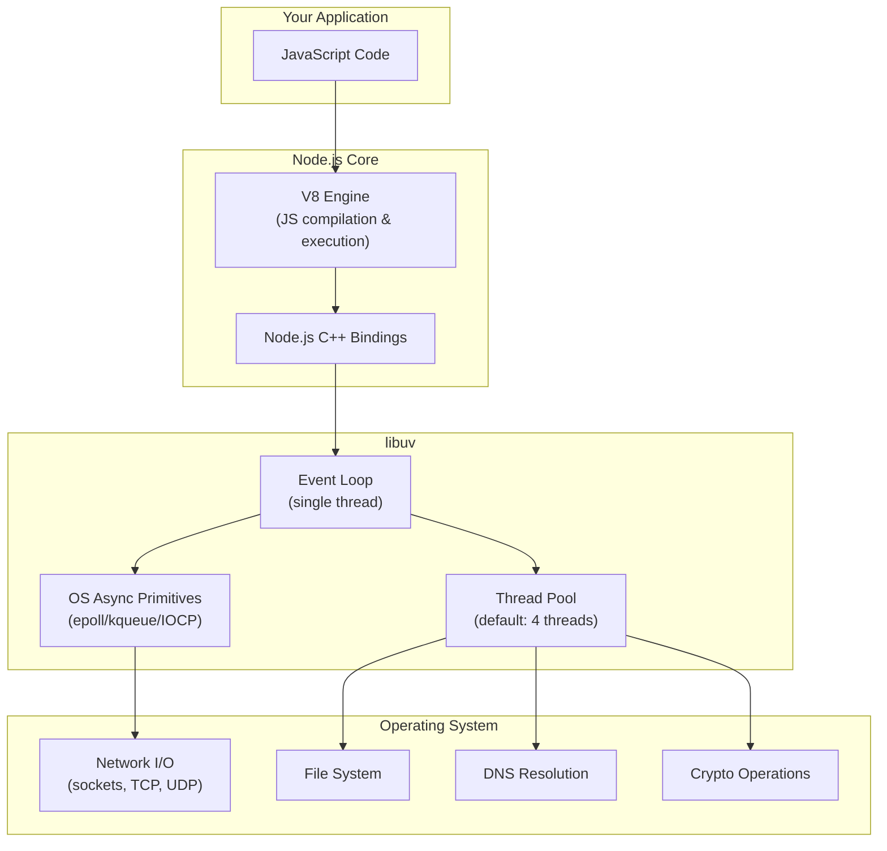
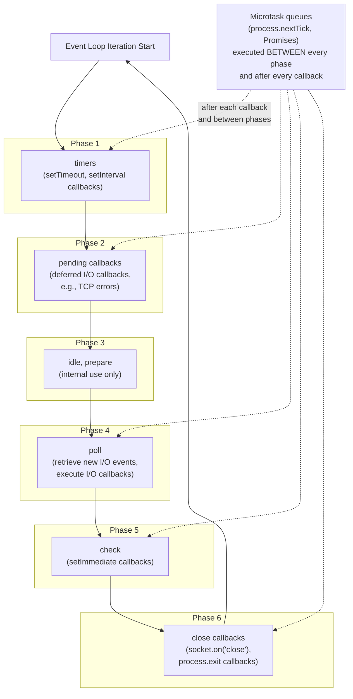
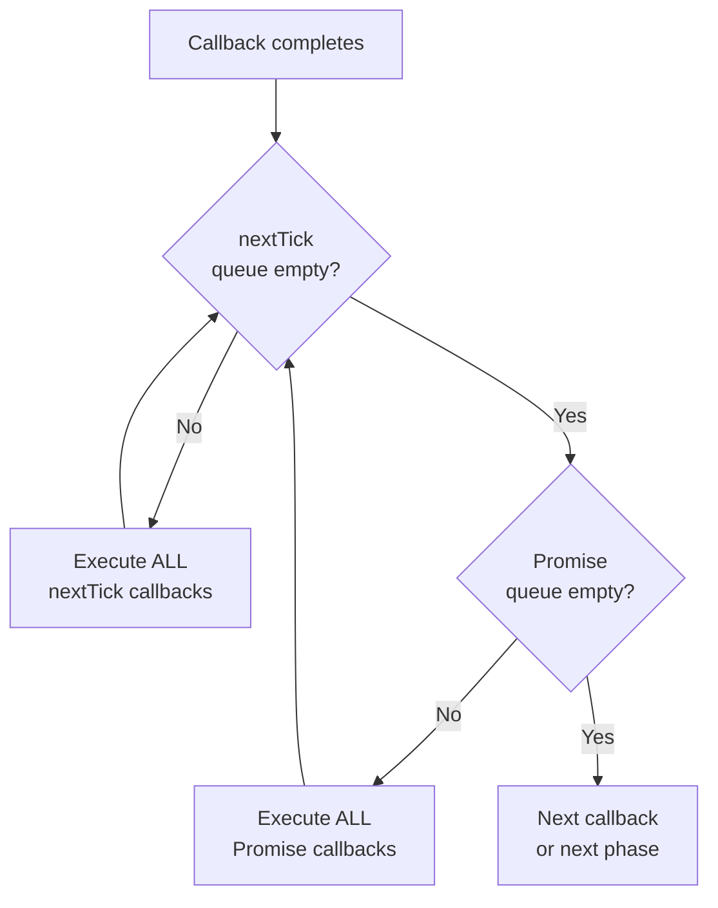

# Node.js Event Loop Deep Dive

The event loop is the beating heart of Node.js. Every I/O operation, every timer, every callback — they all flow through the event loop. Most developers have a vague mental model ("it's single-threaded and uses callbacks"), but that model breaks down when you need to debug event loop lag, understand why `setImmediate` fires before `setTimeout`, or figure out why your server stalls under load. This page gives you the real model — the one based on libuv's actual implementation.

## Architecture Overview

Node.js is built on three pillars:

1. **V8** — JavaScript execution engine (compiles JS to machine code)
2. **libuv** — Cross-platform async I/O library (manages the event loop, thread pool, and OS async primitives)
3. **Node.js bindings** — C++ glue that connects JavaScript APIs to V8 and libuv



**Key insight:** Node.js is NOT single-threaded. JavaScript execution is single-threaded (it runs on one thread, the "main thread" or "event loop thread"). But I/O operations are handled by either the OS kernel (for network I/O) or libuv's thread pool (for file system, DNS, and some crypto operations). The event loop coordinates between the single JavaScript thread and these background operations.

## The Event Loop Phases

libuv's event loop consists of six phases, executed in a specific order. Each phase has a FIFO queue of callbacks to execute. When the event loop enters a phase, it executes callbacks in that phase's queue until the queue is drained or a maximum number of callbacks have been executed, then moves to the next phase.



### Phase 1: Timers

This phase executes callbacks scheduled by `setTimeout()` and `setInterval()`.

A timer specifies a **threshold** (minimum delay), not an exact time. The callback will be called at or after the specified time, but may be delayed by other callbacks or the operating system.

```typescript
// setTimeout schedules a callback in the timers phase
setTimeout(() => {
  console.log('Timer fired');
}, 100);
// This means: "Call this callback no sooner than 100ms from now"
// It might actually fire at 102ms, 150ms, or even 500ms if the
// event loop is blocked

// Timers are stored in a min-heap sorted by expiration time.
// The event loop checks the heap: "has the earliest timer expired?"
// If yes, execute its callback (and any others that have also expired).
// If no, move to the next phase.
```

### Phase 2: Pending Callbacks

This phase executes callbacks for some system operations, such as TCP error types. For example, if a TCP socket receives `ECONNREFUSED` when attempting to connect, some operating systems queue the error report. This callback will be executed in the pending callbacks phase.

Most developers never interact with this phase directly. It handles deferred I/O callbacks that the operating system reports asynchronously.

### Phase 3: Idle, Prepare

Internal phase used only by libuv internals. You cannot schedule callbacks here from JavaScript. It runs between the pending callbacks phase and the poll phase, performing internal housekeeping.

### Phase 4: Poll

The poll phase is the most important phase. It has two main functions:

1. **Calculating how long it should block and poll for I/O** — If there are callbacks scheduled in the check phase (setImmediate), it will not block. If there are timers scheduled, it will block for at most the time until the nearest timer expires.

2. **Processing events in the poll queue** — Execute callbacks for completed I/O operations (network data received, file read complete, etc.).

```
Poll phase logic (simplified):

if (poll_queue is not empty) {
    execute callbacks in poll queue (up to system-dependent limit)
} else {
    if (setImmediate callbacks are scheduled) {
        // Don't wait — move to check phase immediately
        end poll phase
    } else if (timers are scheduled) {
        // Wait for I/O, but no longer than the nearest timer
        wait for I/O (with timeout = nearest timer expiration)
    } else {
        // Nothing scheduled — wait indefinitely for I/O
        wait for I/O (no timeout)
    }
}
```

### Phase 5: Check

This phase executes `setImmediate()` callbacks. `setImmediate` is designed to execute a callback after the poll phase completes.

```typescript
// setImmediate schedules a callback in the check phase
setImmediate(() => {
  console.log('Check phase callback');
});
```

### Phase 6: Close Callbacks

If a socket or handle is closed abruptly (e.g., `socket.destroy()`), the `'close'` event is emitted in this phase.

```typescript
const server = net.createServer((socket) => {
  socket.on('close', () => {
    // This callback runs in the close callbacks phase
    console.log('Socket closed');
  });
});
```

## Microtasks: process.nextTick and Promises

Microtasks are NOT part of the event loop phases. They are executed **between every callback** within a phase and **between phases**. There are two microtask queues:

1. **process.nextTick queue** — processed first
2. **Promise microtask queue** — processed second



**Critical behavior:** Microtask queues are drained completely before moving on. If a `process.nextTick` callback schedules another `process.nextTick`, it will be executed in the SAME microtask pass. This means you can **starve the event loop** with recursive `process.nextTick`:

```typescript
// DANGER: This starves the event loop!
// No I/O callbacks, no timers, no setImmediate will EVER fire.
function recursiveNextTick(): void {
  process.nextTick(recursiveNextTick);
}
recursiveNextTick();
// The event loop is stuck processing nextTick callbacks forever.
// setTimeout, setImmediate, I/O — all starved.

// Promise microtasks can also starve the event loop:
async function recursivePromise(): Promise<void> {
  await recursivePromise();
}
// Same effect — the microtask queue is never drained.
```

## setImmediate vs process.nextTick vs setTimeout

This is one of the most confusing aspects of Node.js. Here is the definitive comparison:

| Feature | `process.nextTick` | `Promise.resolve().then()` | `setImmediate` | `setTimeout(fn, 0)` |
|---------|-------------------|---------------------------|----------------|---------------------|
| **When it fires** | After current callback, before I/O | After current callback, after nextTick | In the check phase (after poll) | In the timers phase (next iteration) |
| **Queue type** | Microtask (nextTick queue) | Microtask (promise queue) | Macrotask (check phase) | Macrotask (timers phase) |
| **Can starve I/O?** | Yes (recursive nextTick) | Yes (recursive promises) | No | No |
| **Priority** | Highest | Second highest | Lower | Lower |
| **Use case** | Emit events after constructor returns | Async API consistency | Yield to I/O after poll | Delayed execution |

### The Classic Ordering Puzzle

```typescript
console.log('1 - script start');

setTimeout(() => console.log('2 - setTimeout'), 0);
setImmediate(() => console.log('3 - setImmediate'));

Promise.resolve().then(() => console.log('4 - Promise'));
process.nextTick(() => console.log('5 - nextTick'));

console.log('6 - script end');

// Output:
// 1 - script start
// 6 - script end
// 5 - nextTick         ← microtask (nextTick queue, highest priority)
// 4 - Promise           ← microtask (promise queue, second priority)
// 3 - setImmediate      ← check phase (may vary, see below)
// 2 - setTimeout        ← timers phase (may vary, see below)
```

::: warning setTimeout(fn, 0) vs setImmediate ordering
When called from the top-level module (not inside an I/O callback), the order of `setTimeout(fn, 0)` and `setImmediate` is **non-deterministic**. It depends on the performance of the process and system at the time.

But inside an I/O callback, `setImmediate` ALWAYS fires before `setTimeout(fn, 0)`:

```typescript
const fs = require('fs');

fs.readFile(__filename, () => {
  setTimeout(() => console.log('timeout'), 0);
  setImmediate(() => console.log('immediate'));
});
// Output is ALWAYS:
// immediate
// timeout
// Because inside an I/O callback, we are in the poll phase.
// setImmediate (check phase) comes right after poll.
// setTimeout (timers phase) comes at the start of the NEXT iteration.
```
:::

### When to Use Each

```typescript
// process.nextTick: Ensure callback runs before any I/O
// Use case: Event emission after constructor returns
class EventfulResource extends EventEmitter {
  constructor() {
    super();
    // BAD: Emitting synchronously — listener not attached yet
    // this.emit('ready');

    // GOOD: Emit on nextTick — listener can be attached first
    process.nextTick(() => this.emit('ready'));
  }
}

const resource = new EventfulResource();
resource.on('ready', () => console.log('Ready!')); // This works because of nextTick

// setImmediate: Yield to I/O between chunks of CPU work
// Use case: Break up long computations without starving I/O
function processLargeArray(items: any[], callback: () => void): void {
  const CHUNK_SIZE = 1000;
  let index = 0;

  function processChunk(): void {
    const end = Math.min(index + CHUNK_SIZE, items.length);
    for (let i = index; i < end; i++) {
      heavyComputation(items[i]);
    }
    index = end;

    if (index < items.length) {
      // Use setImmediate to yield to I/O between chunks
      setImmediate(processChunk);
    } else {
      callback();
    }
  }

  processChunk();
}

// setTimeout: Delayed execution with minimum wait
// Use case: Retry with backoff, debouncing, scheduled tasks
async function retryWithBackoff(fn: () => Promise<void>, maxRetries: number): Promise<void> {
  for (let attempt = 0; attempt < maxRetries; attempt++) {
    try {
      await fn();
      return;
    } catch (error) {
      const delay = Math.min(1000 * Math.pow(2, attempt), 30000);
      await new Promise(resolve => setTimeout(resolve, delay));
    }
  }
  throw new Error(`Failed after ${maxRetries} retries`);
}
```

## Blocking the Event Loop

The event loop runs JavaScript on a single thread. If JavaScript execution takes too long, the event loop cannot process other callbacks — I/O responses pile up, timers miss their deadlines, and the server becomes unresponsive.

### What Blocks the Event Loop

```typescript
// 1. CPU-intensive computation
function blockingComputation(): number {
  let sum = 0;
  for (let i = 0; i < 1_000_000_000; i++) {
    sum += Math.sqrt(i);
  }
  return sum;
  // This takes ~2 seconds and blocks the ENTIRE event loop.
  // No requests, no I/O, no timers — nothing happens for 2 seconds.
}

// 2. Synchronous I/O
import { readFileSync } from 'fs';
const data = readFileSync('/path/to/large/file'); // Blocks until file is fully read

// 3. JSON.parse/JSON.stringify on large objects
const huge = JSON.parse(hugeJsonString); // Blocks for the parse duration

// 4. Regular expressions with catastrophic backtracking
const evil = /^(a+)+$/.test('aaaaaaaaaaaaaaaaaaaaaaab'); // Exponential time

// 5. Crypto operations (if not using async variants)
import { pbkdf2Sync } from 'crypto';
pbkdf2Sync('password', 'salt', 100000, 64, 'sha512'); // Blocks for ~100ms
```

### Detecting Event Loop Blocking

#### Method 1: Event Loop Lag Monitoring

```typescript
import { monitorEventLoopDelay } from 'perf_hooks';

const h = monitorEventLoopDelay({ resolution: 20 });
h.enable();

setInterval(() => {
  const lag = {
    min: (h.min / 1e6).toFixed(2),
    max: (h.max / 1e6).toFixed(2),
    mean: (h.mean / 1e6).toFixed(2),
    p50: (h.percentile(50) / 1e6).toFixed(2),
    p99: (h.percentile(99) / 1e6).toFixed(2),
  };

  if (h.percentile(99) / 1e6 > 50) {
    console.error(`EVENT LOOP LAG: p99=${lag.p99}ms`, lag);
  }

  h.reset();
}, 5000);
```

#### Method 2: Manual Lag Detection

```typescript
// Simple technique: measure time between expected and actual setTimeout
function detectLag(): void {
  const INTERVAL = 100; // Expected interval in ms
  let lastTime = Date.now();

  setInterval(() => {
    const now = Date.now();
    const delta = now - lastTime;
    const lag = delta - INTERVAL;

    if (lag > 50) {
      console.warn(`Event loop lag detected: ${lag}ms`);
    }

    lastTime = now;
  }, INTERVAL);
}
```

#### Method 3: Using `blocked-at` Package

```typescript
import blocked from 'blocked-at';

blocked((time, stack) => {
  console.error(`Event loop blocked for ${time}ms`, stack);
}, { threshold: 100 }); // Alert on blocks > 100ms

// Output:
// Event loop blocked for 234ms
//   at expensiveFunction (/app/src/utils.js:45:3)
//   at processData (/app/src/handler.js:12:5)
//   at handleRequest (/app/src/server.js:78:9)
```

## The libuv Thread Pool

libuv maintains a pool of worker threads for operations that cannot be done asynchronously by the OS kernel. This includes:

- **File system operations** (all `fs.*` async calls)
- **DNS resolution** (`dns.lookup`, NOT `dns.resolve` which uses c-ares)
- **Some crypto operations** (`crypto.pbkdf2`, `crypto.randomBytes`, etc.)
- **Some compression operations** (`zlib.*`)

### Default Pool Size and Tuning

```bash
# Default thread pool size: 4
# Set via environment variable BEFORE Node.js starts
UV_THREADPOOL_SIZE=16 node server.js

# Maximum: 1024 (but practical limit is much lower)
# Rule of thumb: set to number of CPU cores for CPU-bound work
# or higher for I/O-bound work (many concurrent file operations)
```

### Thread Pool Exhaustion

If all threads in the pool are busy, new operations QUEUE until a thread is available. This is a common cause of latency spikes:

```typescript
// Scenario: 4 threads (default), 100 concurrent file reads
const promises = [];
for (let i = 0; i < 100; i++) {
  // Each fs.readFile uses one thread pool thread
  promises.push(fs.promises.readFile(`/data/file-${i}.json`));
}
await Promise.all(promises);

// With 4 threads, only 4 files are read concurrently.
// The other 96 wait in queue. If each file read takes 10ms,
// the total time is ~250ms (100/4 * 10ms) instead of 10ms.

// Solution 1: Increase UV_THREADPOOL_SIZE
// Solution 2: Limit concurrency on the application side
import pLimit from 'p-limit';
const limit = pLimit(16); // Limit to 16 concurrent file reads

const promises = files.map(file =>
  limit(() => fs.promises.readFile(file))
);
await Promise.all(promises);
```

### What Does NOT Use the Thread Pool

Network I/O does NOT use the thread pool. It uses the OS kernel's async primitives:

- **Linux:** epoll
- **macOS:** kqueue
- **Windows:** IOCP (I/O Completion Ports)

This means a Node.js server can handle tens of thousands of concurrent network connections with just the event loop thread — no thread pool threads are consumed for network I/O.

```
┌─────────────────────────────────────────────────────┐
│                  Node.js Process                     │
├─────────────────────────────────────────────────────┤
│                                                      │
│  Event Loop Thread (Main Thread)                     │
│  ├─ JavaScript execution                            │
│  ├─ Network I/O (via OS async: epoll/kqueue/IOCP)   │
│  └─ Event loop phase management                     │
│                                                      │
│  Thread Pool (UV_THREADPOOL_SIZE = 4 by default)     │
│  ├─ Thread 1: fs.readFile(...)                       │
│  ├─ Thread 2: dns.lookup(...)                        │
│  ├─ Thread 3: crypto.pbkdf2(...)                     │
│  └─ Thread 4: zlib.deflate(...)                      │
│                                                      │
│  c-ares Thread (for dns.resolve)                     │
│  V8 GC Threads (for concurrent garbage collection)   │
│  V8 Compiler Threads (for background JIT compilation)│
│                                                      │
└─────────────────────────────────────────────────────┘
```

## Tick-by-Tick Walkthrough

Let's trace through a complete event loop iteration with a realistic example:

```typescript
const http = require('http');
const fs = require('fs');

const server = http.createServer((req, res) => {
  // This callback fires in the poll phase (I/O callback)

  // 1. Synchronous: runs immediately
  const start = Date.now();

  // 2. Schedule a timer
  setTimeout(() => {
    console.log('A: setTimeout');
  }, 0);

  // 3. Schedule setImmediate
  setImmediate(() => {
    console.log('B: setImmediate');
  });

  // 4. Schedule nextTick (microtask)
  process.nextTick(() => {
    console.log('C: nextTick');
  });

  // 5. Promise (microtask)
  Promise.resolve().then(() => {
    console.log('D: Promise');
  });

  // 6. Async file read (goes to thread pool)
  fs.readFile('/etc/hostname', (err, data) => {
    console.log('E: file read complete');
  });

  // 7. Synchronous: runs immediately
  res.end('OK');
  console.log('F: synchronous end');
});
```

**Execution trace:**

```
Step 1: We are in the poll phase (handling an I/O callback from http.createServer)

Step 2: Synchronous code runs:
  → "F: synchronous end" is logged
  → setTimeout is scheduled (timers queue, next iteration)
  → setImmediate is scheduled (check queue, this iteration)
  → nextTick is scheduled (microtask queue)
  → Promise is scheduled (microtask queue)
  → fs.readFile is dispatched to thread pool

Step 3: Callback completes. Before moving to next callback or phase,
         drain microtask queues:

  Microtask pass:
  → nextTick queue: "C: nextTick" is logged
  → promise queue:  "D: Promise" is logged

Step 4: Poll phase continues (are there more I/O callbacks? If not, check if
         setImmediate is scheduled — yes, so don't wait for I/O)

Step 5: Move to check phase:
  → "B: setImmediate" is logged

Step 6: Move to close callbacks phase (nothing to do)

Step 7: Start next event loop iteration

Step 8: Timers phase:
  → "A: setTimeout" is logged (0ms timer has expired)

Step 9: Pending callbacks, idle/prepare (nothing)

Step 10: Poll phase:
  → Eventually, fs.readFile completes on the thread pool
  → "E: file read complete" is logged

Final output order:
  F: synchronous end
  C: nextTick
  D: Promise
  B: setImmediate
  A: setTimeout
  E: file read complete (timing depends on disk speed)
```

## Event Loop Lag Under Load

When a Node.js server is under heavy load, the event loop cycles faster but may also lag more because each callback takes longer (more data to process, more contention).

### Monitoring Event Loop Lag in Production

```typescript
import { monitorEventLoopDelay } from 'perf_hooks';
import { register, Histogram } from 'prom-client';

// Create a Prometheus histogram metric
const eventLoopLag = new Histogram({
  name: 'nodejs_event_loop_lag_seconds',
  help: 'Event loop lag in seconds',
  buckets: [0.001, 0.005, 0.01, 0.025, 0.05, 0.1, 0.25, 0.5, 1],
});

const h = monitorEventLoopDelay({ resolution: 10 });
h.enable();

setInterval(() => {
  // Convert nanoseconds to seconds for Prometheus
  eventLoopLag.observe(h.mean / 1e9);

  // Also track as a gauge for dashboards
  const lag = {
    min_ms: h.min / 1e6,
    max_ms: h.max / 1e6,
    mean_ms: h.mean / 1e6,
    p50_ms: h.percentile(50) / 1e6,
    p99_ms: h.percentile(99) / 1e6,
    p999_ms: h.percentile(99.9) / 1e6,
  };

  // Alert thresholds:
  // p50 > 10ms → under moderate strain
  // p99 > 50ms → event loop is struggling
  // p99 > 100ms → critical — requests are being delayed
  // p99 > 500ms → emergency — server is effectively hung

  if (lag.p99_ms > 100) {
    console.error('CRITICAL: Event loop lag p99 =', lag.p99_ms.toFixed(1), 'ms');
  }

  h.reset();
}, 10_000);
```

### Load Shedding Based on Event Loop Lag

When the event loop is overloaded, it is better to reject new requests quickly (with a 503) than to accept them and make all requests slow:

```typescript
import { monitorEventLoopDelay } from 'perf_hooks';

const h = monitorEventLoopDelay({ resolution: 20 });
h.enable();

const MAX_LAG_MS = 100;

function loadSheddingMiddleware(
  req: http.IncomingMessage,
  res: http.ServerResponse,
  next: () => void
): void {
  const currentLag = h.percentile(99) / 1e6;

  if (currentLag > MAX_LAG_MS) {
    res.writeHead(503, {
      'Content-Type': 'application/json',
      'Retry-After': '5',
    });
    res.end(JSON.stringify({
      error: 'Service temporarily unavailable',
      reason: 'Server overloaded',
      retryAfter: 5,
    }));
    return;
  }

  next();
}
```

## Event Loop Utilization (ELU)

Node.js 14.10+ provides `performance.eventLoopUtilization()`, which measures the fraction of time the event loop is active (running callbacks) vs. idle (waiting for I/O):

```typescript
import { performance } from 'perf_hooks';

// Take two samples
const elu1 = performance.eventLoopUtilization();

setTimeout(() => {
  const elu2 = performance.eventLoopUtilization(elu1);

  console.log({
    active: elu2.active,    // Total time the event loop was active (ms)
    idle: elu2.idle,        // Total time the event loop was idle (ms)
    utilization: elu2.utilization, // active / (active + idle) — 0.0 to 1.0
  });

  // utilization < 0.5 → server has plenty of headroom
  // utilization 0.5-0.8 → moderately loaded
  // utilization > 0.8 → approaching capacity
  // utilization > 0.95 → at capacity, latency is degrading
}, 10_000);

// Continuous monitoring
let lastELU = performance.eventLoopUtilization();

setInterval(() => {
  const currentELU = performance.eventLoopUtilization(lastELU);
  lastELU = performance.eventLoopUtilization();

  if (currentELU.utilization > 0.9) {
    console.warn(
      `High ELU: ${(currentELU.utilization * 100).toFixed(1)}%`,
      `— consider scaling or optimizing`
    );
  }
}, 5000);
```

## Practical Optimization: Breaking Up Long Tasks

```typescript
// Pattern 1: Chunked iteration with setImmediate
async function processLargeArray<T>(
  items: T[],
  process: (item: T) => void,
  chunkSize = 1000
): Promise<void> {
  for (let i = 0; i < items.length; i += chunkSize) {
    const chunk = items.slice(i, i + chunkSize);
    for (const item of chunk) {
      process(item);
    }
    // Yield to the event loop between chunks
    await new Promise<void>(resolve => setImmediate(resolve));
  }
}

// Pattern 2: Streaming processing
import { Transform } from 'stream';

const processStream = new Transform({
  objectMode: true,
  transform(chunk, encoding, callback) {
    // Process one item at a time
    // Each call yields to the event loop naturally
    const result = heavyTransform(chunk);
    this.push(result);
    callback();
  },
  highWaterMark: 16, // Control backpressure
});

// Pattern 3: Worker thread for CPU-intensive work
import { Worker, isMainThread, parentPort } from 'worker_threads';

if (isMainThread) {
  async function offloadComputation(data: any): Promise<any> {
    return new Promise((resolve, reject) => {
      const worker = new Worker(__filename, { workerData: data });
      worker.on('message', resolve);
      worker.on('error', reject);
    });
  }
} else {
  // Worker thread — does not affect main event loop
  const result = heavyComputation(workerData);
  parentPort!.postMessage(result);
}
```

## Event Loop Internals: How libuv Actually Works

For the truly curious, here is what happens in each iteration of `uv_run()` (libuv's main loop function):

```c
// Simplified pseudocode of libuv's uv_run()
int uv_run(uv_loop_t* loop, uv_run_mode mode) {
  while (uv__loop_alive(loop)) {
    // 1. Update the "now" timestamp (cached to avoid syscalls)
    uv__update_time(loop);

    // 2. Run timers whose expiration time <= now
    uv__run_timers(loop);

    // 3. Run pending callbacks (deferred from previous iteration)
    uv__run_pending(loop);

    // 4. Run idle handles
    uv__run_idle(loop);

    // 5. Run prepare handles
    uv__run_prepare(loop);

    // 6. Poll for I/O
    //    Calculate timeout: min(next_timer, infinity if no timers)
    //    Call epoll_wait/kevent/GetQueuedCompletionStatus with timeout
    timeout = uv_backend_timeout(loop);
    uv__io_poll(loop, timeout);

    // 7. Run check handles (setImmediate)
    uv__run_check(loop);

    // 8. Run close callbacks
    uv__run_closing_handles(loop);

    // Note: Microtasks (nextTick, Promises) are NOT in libuv.
    // They are drained by V8/Node.js after each callback execution
    // via the MicrotaskPolicy::kExplicit setting.
  }
}
```

## Common Pitfalls and Solutions

| Pitfall | Why It Happens | Solution |
|---------|---------------|----------|
| `setImmediate` recursive loop for CPU work | Does yield to I/O but still monopolizes CPU | Use worker threads for CPU work |
| `process.nextTick` starvation | Microtask queue never drains | Replace with `setImmediate` or limit recursion depth |
| Timer drift under load | Event loop cannot service timers on time | Use `setInterval` with self-correcting logic |
| DNS lookup blocking | `dns.lookup()` uses the thread pool | Use `dns.resolve()` (c-ares, async) or increase pool size |
| `JSON.parse` on large payloads | Synchronous CPU-bound operation | Use streaming JSON parser (`stream-json`) |
| RegExp backtracking | Catastrophic backtracking on certain inputs | Use `re2` (linear-time regex) or set timeout |
| Synchronous file operations | `readFileSync`, `writeFileSync` block | Always use async variants in servers |

---

> *"The event loop is not magic — it is a while loop with a poll syscall. Understanding that while loop is what separates Node.js experts from Node.js users."*
