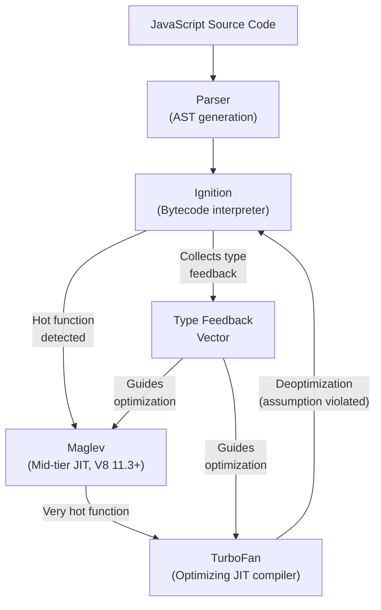
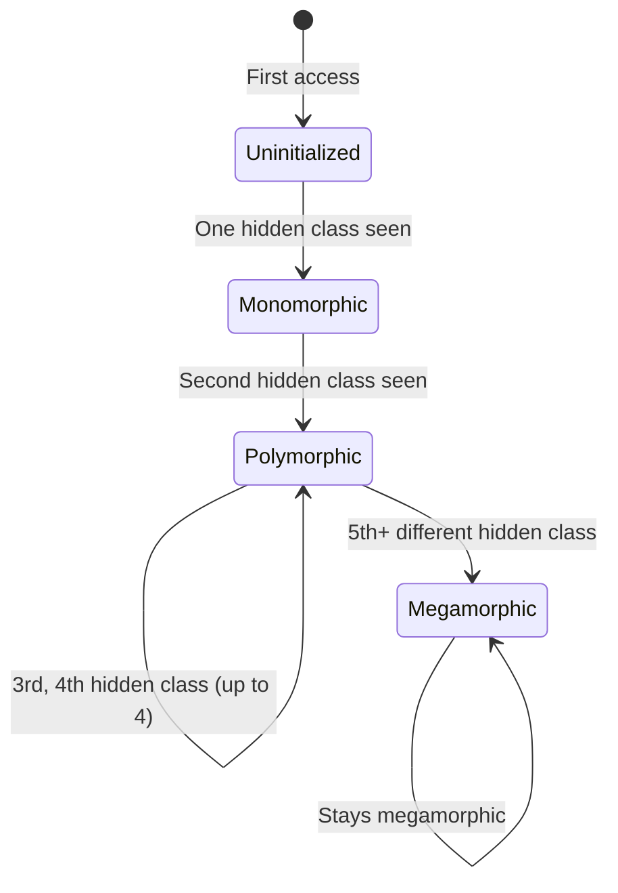

# V8 Engine Optimization

V8 transforms JavaScript — a dynamic, prototype-based language — into highly optimized machine code that runs within 2-5x of hand-written C++. It achieves this through hidden classes, inline caches, and a multi-tier compilation pipeline. Understanding these internals lets you write JavaScript that V8 can optimize aggressively, and — just as importantly — avoid patterns that cause V8 to "deoptimize" your code back to slow, interpreted execution.

## The V8 Compilation Pipeline

V8 uses a multi-tier compilation strategy:



| Tier | Speed | Compilation Cost | When Used |
|------|-------|-----------------|-----------|
| **Ignition** (interpreter) | 10-100x slower than native | ~0 (immediate) | All code starts here |
| **Maglev** (mid-tier JIT) | 2-5x slower than native | Low | Functions called moderately often |
| **TurboFan** (optimizing JIT) | Near-native speed | High (background thread) | Hot functions with stable types |

### Type Feedback

The key to V8's optimization strategy is **type feedback**. While Ignition interprets your code, it records what types it actually encounters:

```typescript
function add(a, b) {
  return a + b;
}

// Ignition records:
// Call 1: add(1, 2)       → a: Smi (small integer), b: Smi
// Call 2: add(3, 4)       → a: Smi, b: Smi
// Call 3: add(5, 6)       → a: Smi, b: Smi
// ...100 more calls with Smi...

// TurboFan sees: "add() is always called with Smi arguments"
// It generates optimized machine code that:
// 1. Checks if arguments are Smi (fast integer check)
// 2. Uses hardware integer addition (one CPU instruction)
// 3. Skips all dynamic type handling
```

If the type feedback is consistent (always the same types), TurboFan can generate extremely efficient code. If types are inconsistent, it generates slower, more general code.

## Hidden Classes (Shapes / Maps)

JavaScript objects are dynamic — you can add or remove properties at any time. But V8 treats them as if they have a fixed structure by using **hidden classes** (internally called "Maps" in V8).

### How Hidden Classes Work

```typescript
const point = { x: 1, y: 2 };
```

V8 does NOT store this as a hash table. Instead, it creates a hidden class that describes the layout:

```
Hidden Class C0: {}
  Transition: add property "x" → Hidden Class C1

Hidden Class C1: { x: offset 0 }
  Transition: add property "x" → (already exists)
  Transition: add property "y" → Hidden Class C2

Hidden Class C2: { x: offset 0, y: offset 4 }
  (this is the final hidden class for objects with shape {x, y})
```

The object itself stores:
```
[Map pointer → C2] [x: 1] [y: 2]
```

### Sharing Hidden Classes

When two objects have the same shape (same properties added in the same order), they share the same hidden class:

```typescript
// These two objects share the SAME hidden class
const p1 = { x: 1, y: 2 };
const p2 = { x: 3, y: 4 };
// Both point to Hidden Class C2: { x: offset 0, y: offset 4 }

// This object has a DIFFERENT hidden class
const p3 = { y: 1, x: 2 }; // Properties added in different order!
// p3 points to a different hidden class chain:
// C0 → add "y" → C1' → add "x" → C2'
// C2' has { y: offset 0, x: offset 4 }
```

::: warning Property Order Matters
Always add properties in the same order. V8 uses transition trees based on the order properties are added. Different orders create different hidden classes, which prevents V8 from optimizing property access across objects of the "same" conceptual type.
:::

### Why Hidden Classes Matter for Performance

With a known hidden class, V8 can:

1. **Access properties at fixed offsets** — like a C struct, not a hash table lookup
2. **Use inline caches** — skip the property lookup entirely after the first access
3. **Optimize comparisons** — check if two objects have the same shape in one pointer comparison

```typescript
// FAST: Same hidden class for all points
function createPoint(x: number, y: number) {
  return { x, y }; // Always creates objects with the same hidden class
}

const points = [];
for (let i = 0; i < 10000; i++) {
  points.push(createPoint(i, i * 2));
}

// SLOW: Different hidden classes (property order varies)
function createPointBad(x: number, y: number, hasZ: boolean) {
  const p: any = {};
  if (hasZ) p.z = 0; // Some objects get z first
  p.x = x;           // Then x
  p.y = y;           // Then y
  if (!hasZ) p.z = 0; // Others get z last
  return p;
  // Objects with hasZ=true have hidden class: {z, x, y}
  // Objects with hasZ=false have hidden class: {x, y, z}
  // These are DIFFERENT hidden classes even though they have the same properties!
}
```

## Inline Caches (ICs)

Inline caches are the mechanism V8 uses to skip property lookup after the first access. They are the most important optimization in V8.

### How Inline Caches Work

Consider this function:

```typescript
function getX(obj) {
  return obj.x; // This property access uses an inline cache
}
```

**First call:** `getX({ x: 1, y: 2 })`
1. V8 looks up the hidden class of the argument: Map C2 `{ x: offset 0, y: offset 4 }`
2. V8 finds that `x` is at offset 0 in objects with this hidden class
3. V8 caches: "If the object's map is C2, property x is at offset 0"
4. Returns the value at offset 0

**Second call:** `getX({ x: 5, y: 6 })` (same hidden class C2)
1. V8 checks: "Is the object's map C2?" — YES
2. V8 reads directly from offset 0 — no property lookup needed
3. This is as fast as reading a field from a C struct

### IC States: Monomorphic, Polymorphic, Megamorphic

The inline cache transitions through states based on the diversity of hidden classes it sees:



| State | Performance | Description |
|-------|------------|-------------|
| **Monomorphic** | Fastest | Only one hidden class ever seen — direct offset access |
| **Polymorphic** | Fast | 2-4 hidden classes — linear search through cached entries |
| **Megamorphic** | Slow | 5+ hidden classes — falls back to hash table lookup |

```typescript
// MONOMORPHIC (ideal) — always the same shape
function sumX(points: Array<{ x: number; y: number }>): number {
  let sum = 0;
  for (const p of points) {
    sum += p.x; // IC is monomorphic — all points have same hidden class
  }
  return sum;
}

// POLYMORPHIC — a few different shapes
function getArea(shape: Circle | Rectangle | Triangle): number {
  return shape.area; // IC sees 3 different hidden classes — polymorphic (still OK)
}

// MEGAMORPHIC (slow) — many different shapes
function getValue(obj: any): any {
  return obj.value; // If called with 10+ different object shapes → megamorphic
}
```

### Detecting IC States with `--trace-ic`

```bash
# Print IC transitions (very verbose, development only)
node --trace-ic server.js

# Output includes lines like:
# [StoreIC] map=0x... at getX (server.js:10) MONOMORPHIC -> POLYMORPHIC
# [LoadIC] map=0x... at getValue (server.js:20) POLYMORPHIC -> MEGAMORPHIC
```

## TurboFan Optimizations

When TurboFan compiles a function, it applies many classical compiler optimizations plus JavaScript-specific ones:

### Inlining

TurboFan inlines small functions at their call sites, eliminating function call overhead:

```typescript
// Before inlining:
function square(x: number): number {
  return x * x;
}

function sumOfSquares(arr: number[]): number {
  let sum = 0;
  for (let i = 0; i < arr.length; i++) {
    sum += square(arr[i]); // Function call overhead per iteration
  }
  return sum;
}

// After inlining (what TurboFan generates):
function sumOfSquares(arr: number[]): number {
  let sum = 0;
  for (let i = 0; i < arr.length; i++) {
    const x = arr[i];
    sum += x * x; // Inlined — no function call
  }
  return sum;
}
```

### Bounds Check Elimination

```typescript
// V8 can prove that `i` is always within bounds
for (let i = 0; i < arr.length; i++) {
  sum += arr[i]; // V8 eliminates the bounds check on `arr[i]`
  // because it knows `i >= 0` and `i < arr.length`
}
```

### Escape Analysis

If an object is allocated and never escapes the function, V8 can allocate it on the stack (or eliminate it entirely):

```typescript
function distance(x1: number, y1: number, x2: number, y2: number): number {
  // This object allocation may be completely eliminated
  const delta = { x: x2 - x1, y: y2 - y1 };
  return Math.sqrt(delta.x * delta.x + delta.y * delta.y);
  // V8 sees that `delta` never escapes this function,
  // so it replaces it with scalar variables dx and dy
}
```

### Constant Folding

```typescript
const TAX_RATE = 0.08;
const DISCOUNT = 0.15;
const EFFECTIVE_RATE = 1 + TAX_RATE - DISCOUNT;
// V8 computes this at compile time: EFFECTIVE_RATE = 0.93

function calculatePrice(base: number): number {
  return base * EFFECTIVE_RATE; // Single multiplication at runtime
}
```

## Deoptimization — When V8 Gives Up

Deoptimization occurs when an assumption TurboFan made turns out to be wrong. V8 must discard the optimized code and fall back to Ignition.

### Common Deoptimization Triggers

```typescript
// 1. Type change (most common)
function add(a: number, b: number): number {
  return a + b;
}
add(1, 2);      // TurboFan optimizes for integer addition
add(1.5, 2.5);  // Still OK — number type
add("1", "2");  // DEOPT! String concatenation, not addition

// 2. Hidden class change
function getX(obj: { x: number }): number {
  return obj.x;
}
getX({ x: 1 });       // Optimized for this shape
getX({ x: 1, y: 2 }); // DEOPT! Different hidden class

// 3. Out-of-bounds array access
const arr = [1, 2, 3];
function getElement(i: number): number {
  return arr[i];
}
getElement(0);  // OK
getElement(10); // DEOPT! Out-of-bounds access returns undefined, not a number

// 4. Arguments object
function sum() {
  let total = 0;
  for (let i = 0; i < arguments.length; i++) {
    total += arguments[i]; // Using `arguments` prevents many optimizations
  }
  return total;
}

// 5. `delete` operator on objects
const obj = { x: 1, y: 2 };
delete obj.x; // Changes the hidden class to a "slow" mode (hash table)

// 6. eval() in scope
function problematic(code: string) {
  const x = 1;
  eval(code); // V8 cannot optimize this function at all
  return x;   // `eval` might have changed `x`
}
```

### Detecting Deoptimizations

```bash
# Print deoptimization events
node --trace-deopt server.js

# Output:
# [deoptimize] at <server.js:10> reason: not a Smi
# [deoptimize] at <server.js:25> reason: wrong map
# [deoptimize] at <server.js:42> reason: out of bounds

# More detailed with bailout reasons
node --trace-opt --trace-deopt server.js

# Output:
# [optimizing] add (server.js:5) — took 1.234 ms
# [completed] add
# [deoptimizing] add (server.js:5) — reason: Insufficient type feedback
```

## Writing V8-Friendly Code

### Rule 1: Keep Types Consistent

```typescript
// BAD: Mixed types in the same variable
function process(value: any): void {
  let result = 0;        // V8 thinks: Smi
  result = value * 2;    // V8 thinks: could be number or NaN
  result = String(result); // V8 thinks: now it's a string?!
}

// GOOD: Each variable has one type throughout its lifetime
function process(value: number): string {
  const doubled = value * 2;       // Always number
  const result = String(doubled);  // Always string
  return result;
}
```

### Rule 2: Initialize Objects with All Properties

```typescript
// BAD: Adding properties incrementally
function createUser(name: string, age: number) {
  const user: any = {};
  user.name = name;     // Hidden class transition 1
  user.age = age;       // Hidden class transition 2
  if (age >= 18) {
    user.isAdult = true; // Hidden class transition 3 (only sometimes!)
  }
  return user;
}

// GOOD: Initialize all properties upfront
function createUser(name: string, age: number) {
  return {
    name,
    age,
    isAdult: age >= 18, // Always present — stable hidden class
  };
}
```

### Rule 3: Use TypedArrays for Numeric Work

```typescript
// BAD: Regular array — V8 must handle mixed types
const data = [1, 2, 3, 4, 5]; // V8 stores as "packed SMI" but can degrade

// GOOD: TypedArray — V8 knows it's always numbers, can use SIMD
const data = new Float64Array([1, 2, 3, 4, 5]);

function sum(arr: Float64Array): number {
  let total = 0;
  for (let i = 0; i < arr.length; i++) {
    total += arr[i]; // V8 can vectorize this loop with SIMD instructions
  }
  return total;
}
```

### Rule 4: Avoid Array Type Transitions

V8 internally categorizes arrays by their content:

```typescript
// PACKED_SMI_ELEMENTS (best) — all small integers
const a = [1, 2, 3];

// PACKED_DOUBLE_ELEMENTS — all numbers (including floats)
a.push(1.5); // Transition: SMI → DOUBLE

// PACKED_ELEMENTS — mixed types
a.push("hello"); // Transition: DOUBLE → ELEMENTS (slow!)

// HOLEY_ELEMENTS (worst) — has holes
const b = [1, , 3]; // The hole forces V8 to check prototype chain on access

// These transitions are ONE-WAY — V8 never goes back to a more specific type
// PACKED_SMI → PACKED_DOUBLE → PACKED_ELEMENTS → never goes back
```

```
Array type lattice (irreversible transitions):

  PACKED_SMI_ELEMENTS ──→ PACKED_DOUBLE_ELEMENTS ──→ PACKED_ELEMENTS
         │                          │                       │
         ▼                          ▼                       ▼
  HOLEY_SMI_ELEMENTS ───→ HOLEY_DOUBLE_ELEMENTS ───→ HOLEY_ELEMENTS
```

### Rule 5: Avoid `delete` — Use `undefined` Instead

```typescript
// BAD: delete transitions the object to "dictionary mode" (slow)
const obj = { a: 1, b: 2, c: 3 };
delete obj.b; // Object is now in "slow" dictionary mode

// GOOD: Set to undefined (keeps the hidden class intact)
const obj = { a: 1, b: 2, c: 3 };
obj.b = undefined; // Hidden class unchanged, property is still there
```

### Rule 6: Prefer `for` Loops for Hot Paths

```typescript
// GOOD: Classic for loop — most optimizable
for (let i = 0; i < arr.length; i++) {
  process(arr[i]);
}

// GOOD: for-of (V8 optimizes this well for arrays since V8 7.x)
for (const item of arr) {
  process(item);
}

// SLOWER: forEach (function call overhead, harder to inline)
arr.forEach(item => process(item));

// SLOWER: for-in (designed for objects, not arrays — checks prototype chain)
for (const i in arr) {
  process(arr[i]); // i is a string, not a number!
}
```

### Rule 7: Use Rest Parameters Instead of `arguments`

```typescript
// BAD: `arguments` object prevents many optimizations
function sum() {
  let total = 0;
  for (let i = 0; i < arguments.length; i++) {
    total += arguments[i];
  }
  return total;
}

// GOOD: Rest parameters are a real array, fully optimizable
function sum(...nums: number[]): number {
  let total = 0;
  for (let i = 0; i < nums.length; i++) {
    total += nums[i];
  }
  return total;
}
```

## V8 Optimization Debugging Tools

```bash
# Show which functions are optimized/deoptimized
node --trace-opt --trace-deopt app.js

# Show inline cache state transitions
node --trace-ic app.js

# Print generated machine code for a function
node --print-opt-code --code-comments app.js

# Print the bytecode generated by Ignition
node --print-bytecode --print-bytecode-filter="functionName" app.js

# Disable TurboFan (to see performance without JIT optimization)
node --no-opt app.js

# Force optimization of a function (testing only)
// In code:
%OptimizeFunctionOnNextCall(myFunction);
// Run with: node --allow-natives-syntax app.js

# Disable inlining (helps see individual function costs in profiles)
node --no-turbo-inlining app.js
```

## V8 Optimization Cheat Sheet

| Pattern | Impact | Reason |
|---------|--------|--------|
| Consistent object shapes | High | Enables monomorphic ICs |
| Avoid `delete` on objects | High | Prevents transition to dictionary mode |
| Initialize all properties in constructor | High | Creates a single hidden class |
| Avoid `arguments` object | Medium | Prevents multiple TurboFan optimizations |
| Use TypedArrays for numeric data | High | Enables SIMD and direct memory access |
| Avoid holes in arrays | Medium | Holey arrays require prototype chain checks |
| Keep functions small | Medium | Easier for TurboFan to inline and analyze |
| Avoid `eval` and `with` | High | Completely disables optimization for the function |
| Don't change variable types | Medium | Prevents deoptimization |
| Use rest params instead of `arguments` | Medium | Creates a real array, fully optimizable |
| Avoid polymorphic call sites | High | Megamorphic ICs are 10-100x slower |

---

> *"V8 does not optimize JavaScript. It optimizes predictable JavaScript. Be predictable."*
