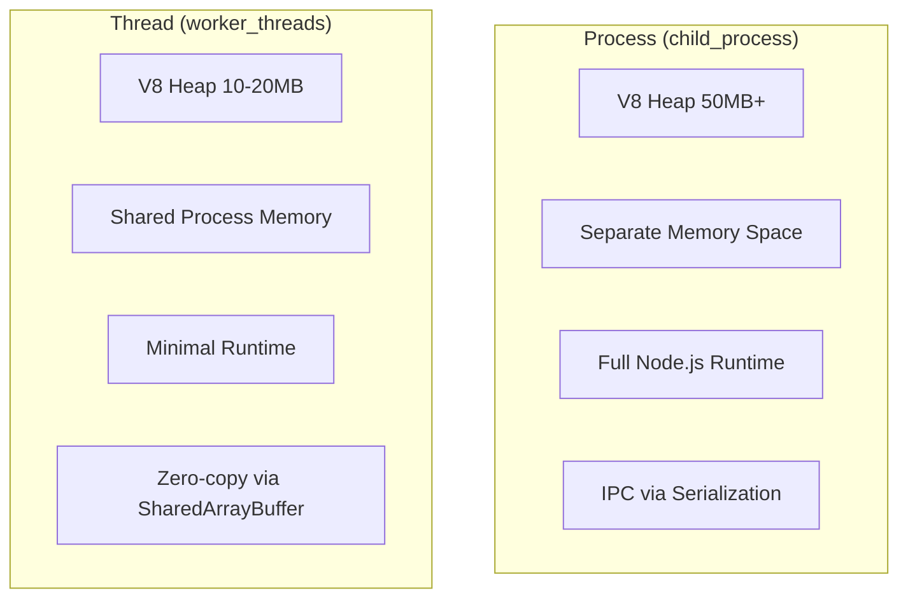
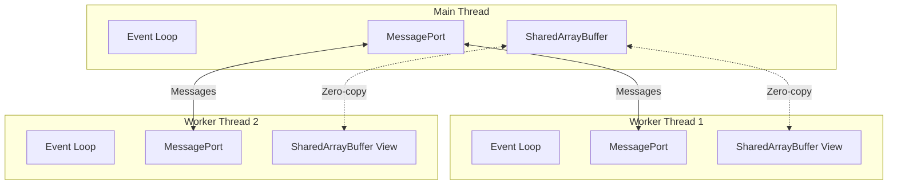
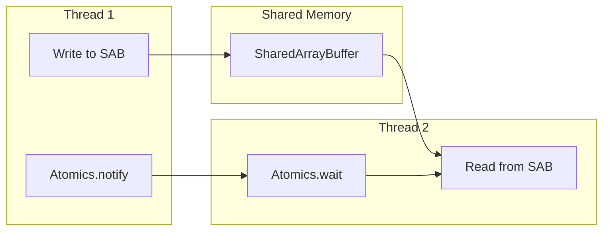
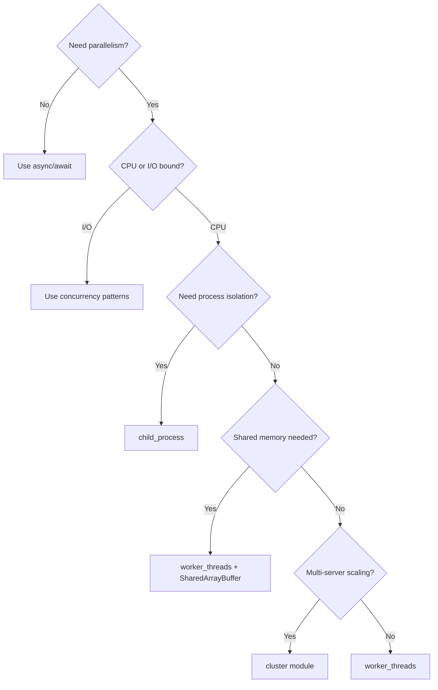

# Worker Threads and Parallelism

## Why Worker Threads Exist

Node.js is single-threaded by design. The event loop handles I/O concurrency brilliantly, but CPU-intensive operations — JSON parsing of large payloads, image processing, cryptographic operations, data transformation, compression — block the event loop and make the entire server unresponsive. Before worker threads, developers had two poor options: spawn child processes (heavy, IPC overhead) or accept the blocking.

Worker threads, introduced in Node.js 10.5 (stable in 12), bring true OS-level parallelism to Node.js without the overhead of separate processes. Each worker runs its own V8 instance and event loop on a separate thread within the same process, sharing memory when needed through `SharedArrayBuffer`.

### Historical Context

- **2009-2017**: Node.js had only `child_process` and `cluster` for parallelism. Every parallel task required spawning a new process with full V8 heap overhead (30-50MB minimum).
- **2018**: `worker_threads` module introduced behind a flag in Node 10.5.
- **2019**: Stable in Node 12. `SharedArrayBuffer` re-enabled after Spectre mitigations.
- **2020+**: `Atomics.waitAsync` added, enabling lock-free coordination without blocking.
- **2023+**: Mature ecosystem with `piscina`, `workerpool`, and native thread pool patterns.

## First Principles

### Threads vs Processes



| Characteristic | Child Process | Worker Thread |
|---------------|---------------|---------------|
| Memory overhead | 30-50MB per process | 10-20MB per thread |
| Startup time | 30-100ms | 5-15ms |
| Communication | Serialized IPC (structured clone) | MessagePort + SharedArrayBuffer |
| Isolation | Full process isolation | Same process, separate V8 |
| Crash behavior | Child crash does not kill parent | Thread crash does not kill process |
| File descriptors | Separate FD table | Shared FD table |
| Native addons | Full support | Must be thread-safe |
| Max practical count | ~100 (OS limit) | ~CPU cores (contention) |

### The Fundamental Equation of Parallelism

Amdahl's Law defines the maximum speedup from parallelization:

$$
S(n) = \frac{1}{(1 - P) + \frac{P}{n}}
$$

Where:
- $S(n)$ = speedup with $n$ threads
- $P$ = fraction of work that is parallelizable
- $n$ = number of threads

If 90% of work is parallelizable ($P = 0.9$) and you use 8 threads:

$$
S(8) = \frac{1}{(1 - 0.9) + \frac{0.9}{8}} = \frac{1}{0.1 + 0.1125} = \frac{1}{0.2125} \approx 4.7\times
$$

Even with infinite threads, the maximum speedup would be:

$$
S(\infty) = \frac{1}{1 - P} = \frac{1}{0.1} = 10\times
$$

The serial portion (10%) is the hard ceiling. This is why understanding what can and cannot be parallelized is critical before reaching for worker threads.

### Gustafson's Law — The Optimistic View

Amdahl's Law assumes fixed problem size. Gustafson's Law assumes the problem scales with available resources:

$$
S(n) = n - (1 - P) \cdot (n - 1)
$$

With 8 threads and 90% parallel work:

$$
S(8) = 8 - 0.1 \cdot 7 = 8 - 0.7 = 7.3\times
$$

This better models real-world scenarios where more threads process more data rather than the same data faster.

## Core Mechanics

### Worker Thread Architecture



Each worker thread has:
1. **Its own V8 isolate** — separate heap, garbage collector, JIT compiler.
2. **Its own event loop** — `setTimeout`, `setImmediate`, I/O operations all work.
3. **Shared process resources** — same PID, same file descriptor table, same `SharedArrayBuffer` memory.

### Communication Channels

**MessagePort (Structured Clone)**:
- Data is serialized using the structured clone algorithm.
- Most JavaScript values can be transferred (objects, arrays, Maps, Sets, Dates, RegExps, ArrayBuffers).
- Functions and Symbols cannot be transferred.
- `ArrayBuffer` can be *transferred* (zero-copy, but the source loses access).

**SharedArrayBuffer (Zero-Copy)**:
- Raw memory shared between threads.
- No serialization overhead.
- Requires manual synchronization using `Atomics`.
- Only typed array views (`Int32Array`, `Float64Array`, etc.) can access it.

**Transfer vs Clone**:

```typescript
import { Worker, parentPort, isMainThread } from 'node:worker_threads';

// Clone: data is copied (slow for large data)
const data = { items: new Array(1_000_000).fill(0) };
worker.postMessage(data); // ~50ms for 1M items

// Transfer: ArrayBuffer is moved, not copied (instant)
const buffer = new ArrayBuffer(4_000_000); // 4MB
worker.postMessage(buffer, [buffer]); // ~0.01ms
// buffer.byteLength is now 0 — it was transferred

// SharedArrayBuffer: no transfer needed, always shared
const shared = new SharedArrayBuffer(4_000_000);
worker.postMessage({ shared }); // Only the reference is sent
// Both threads can now read/write the same memory
```

## Implementation: Worker Thread Pool

A production-grade thread pool manages a fixed number of workers and distributes tasks among them:

```typescript
import {
  Worker,
  isMainThread,
  parentPort,
  workerData,
  MessageChannel,
  type MessagePort,
} from 'node:worker_threads';
import { cpus } from 'node:os';
import { EventEmitter } from 'node:events';

interface Task<TInput, TOutput> {
  id: number;
  input: TInput;
  resolve: (value: TOutput) => void;
  reject: (error: Error) => void;
  transfer?: Transferable[];
}

interface WorkerWrapper {
  worker: Worker;
  busy: boolean;
  taskCount: number;
}

interface PoolOptions {
  minThreads?: number;
  maxThreads?: number;
  idleTimeoutMs?: number;
  taskTimeoutMs?: number;
}

class WorkerPool<TInput = unknown, TOutput = unknown> extends EventEmitter {
  private workers: WorkerWrapper[] = [];
  private queue: Task<TInput, TOutput>[] = [];
  private nextTaskId = 0;
  private readonly workerScript: string;
  private readonly options: Required<PoolOptions>;
  private closed = false;

  constructor(workerScript: string, options: PoolOptions = {}) {
    super();
    this.workerScript = workerScript;
    this.options = {
      minThreads: options.minThreads ?? 1,
      maxThreads: options.maxThreads ?? cpus().length,
      idleTimeoutMs: options.idleTimeoutMs ?? 60_000,
      taskTimeoutMs: options.taskTimeoutMs ?? 30_000,
    };

    // Pre-warm minimum threads
    for (let i = 0; i < this.options.minThreads; i++) {
      this.addWorker();
    }
  }

  async execute(
    input: TInput,
    transfer?: Transferable[]
  ): Promise<TOutput> {
    if (this.closed) {
      throw new Error('Pool is closed');
    }

    return new Promise<TOutput>((resolve, reject) => {
      const task: Task<TInput, TOutput> = {
        id: this.nextTaskId++,
        input,
        resolve,
        reject,
        transfer,
      };

      this.queue.push(task);
      this.dispatchNext();
    });
  }

  private addWorker(): WorkerWrapper {
    const worker = new Worker(this.workerScript, {
      workerData: { poolId: this.workers.length },
    });

    const wrapper: WorkerWrapper = {
      worker,
      busy: false,
      taskCount: 0,
    };

    worker.on('message', (msg: { taskId: number; result?: TOutput; error?: string }) => {
      wrapper.busy = false;

      if (msg.error) {
        this.emit('taskError', { taskId: msg.taskId, error: msg.error });
      }

      // Try to dispatch next task to this now-free worker
      this.dispatchNext();
    });

    worker.on('error', (err) => {
      this.emit('workerError', err);
      // Replace the dead worker
      const idx = this.workers.indexOf(wrapper);
      if (idx !== -1) {
        this.workers.splice(idx, 1);
        if (this.workers.length < this.options.minThreads) {
          this.addWorker();
        }
      }
    });

    worker.on('exit', (code) => {
      if (code !== 0) {
        this.emit('workerExit', { code });
      }
    });

    this.workers.push(wrapper);
    return wrapper;
  }

  private dispatchNext(): void {
    if (this.queue.length === 0) return;

    // Find an idle worker
    let idleWorker = this.workers.find(w => !w.busy);

    // Scale up if needed
    if (!idleWorker && this.workers.length < this.options.maxThreads) {
      idleWorker = this.addWorker();
    }

    if (!idleWorker) return; // All workers busy, task stays queued

    const task = this.queue.shift()!;
    idleWorker.busy = true;
    idleWorker.taskCount++;

    // Set timeout
    const timer = setTimeout(() => {
      task.reject(new Error(`Task ${task.id} timed out after ${this.options.taskTimeoutMs}ms`));
    }, this.options.taskTimeoutMs);

    // Wire up the response
    const originalResolve = task.resolve;
    const originalReject = task.reject;

    task.resolve = (value: TOutput) => {
      clearTimeout(timer);
      originalResolve(value);
    };
    task.reject = (error: Error) => {
      clearTimeout(timer);
      originalReject(error);
    };

    // Send task to worker
    const message = { taskId: task.id, input: task.input };
    idleWorker.worker.postMessage(message, task.transfer ?? []);

    // Listen for response
    const handler = (msg: { taskId: number; result?: TOutput; error?: string }) => {
      if (msg.taskId !== task.id) return;
      idleWorker!.worker.removeListener('message', handler);

      if (msg.error) {
        task.reject(new Error(msg.error));
      } else {
        task.resolve(msg.result!);
      }
    };

    idleWorker.worker.on('message', handler);
  }

  get stats(): {
    workers: number;
    busy: number;
    queued: number;
    totalTasks: number;
  } {
    return {
      workers: this.workers.length,
      busy: this.workers.filter(w => w.busy).length,
      queued: this.queue.length,
      totalTasks: this.workers.reduce((sum, w) => sum + w.taskCount, 0),
    };
  }

  async close(): Promise<void> {
    this.closed = true;

    // Reject queued tasks
    for (const task of this.queue) {
      task.reject(new Error('Pool is closing'));
    }
    this.queue.length = 0;

    // Terminate workers
    await Promise.allSettled(
      this.workers.map(w => w.worker.terminate())
    );
    this.workers.length = 0;
  }
}
```

### Worker Script Template

```typescript
// worker.ts — the script that runs inside each worker thread
import { parentPort, workerData } from 'node:worker_threads';

interface TaskMessage<T> {
  taskId: number;
  input: T;
}

if (!parentPort) {
  throw new Error('This file must be run as a worker thread');
}

parentPort.on('message', async (msg: TaskMessage<unknown>) => {
  try {
    const result = await processTask(msg.input);
    parentPort!.postMessage({ taskId: msg.taskId, result });
  } catch (err) {
    parentPort!.postMessage({
      taskId: msg.taskId,
      error: err instanceof Error ? err.message : String(err),
    });
  }
});

async function processTask(input: unknown): Promise<unknown> {
  // Implement task processing here
  // This runs in a separate thread — CPU work won't block the main event loop
  return input;
}
```

## SharedArrayBuffer and Atomics

### The Memory Model

JavaScript has a well-defined memory model for shared memory. Without `Atomics`, reads and writes to shared memory can be reordered by the CPU and compiler. `Atomics` provides the memory ordering guarantees needed for correct concurrent programming.



### Atomic Operations

```typescript
// Shared memory setup
const shared = new SharedArrayBuffer(1024);
const view = new Int32Array(shared);

// Atomic operations (thread-safe)
Atomics.store(view, 0, 42);          // Atomic write
const val = Atomics.load(view, 0);    // Atomic read: 42
Atomics.add(view, 0, 8);              // Atomic increment: now 50
Atomics.sub(view, 0, 10);             // Atomic decrement: now 40
Atomics.and(view, 0, 0xFF);           // Atomic bitwise AND
Atomics.or(view, 0, 0x100);           // Atomic bitwise OR
Atomics.xor(view, 0, 0x0F);          // Atomic bitwise XOR
Atomics.exchange(view, 0, 99);        // Atomic swap, returns old value
Atomics.compareExchange(view, 0, 99, 100); // CAS: if 99, set to 100
```

### Building a Mutex with Atomics

```typescript
class SharedMutex {
  private readonly view: Int32Array;
  private readonly index: number;

  // States
  private static readonly UNLOCKED = 0;
  private static readonly LOCKED = 1;

  constructor(sharedBuffer: SharedArrayBuffer, byteOffset: number = 0) {
    this.view = new Int32Array(sharedBuffer, byteOffset, 1);
    this.index = 0;
  }

  lock(): void {
    while (true) {
      // Try to acquire: CAS from UNLOCKED to LOCKED
      const old = Atomics.compareExchange(
        this.view,
        this.index,
        SharedMutex.UNLOCKED,
        SharedMutex.LOCKED
      );

      if (old === SharedMutex.UNLOCKED) {
        return; // Acquired
      }

      // Wait until the lock is released
      Atomics.wait(this.view, this.index, SharedMutex.LOCKED);
    }
  }

  unlock(): void {
    const old = Atomics.compareExchange(
      this.view,
      this.index,
      SharedMutex.LOCKED,
      SharedMutex.UNLOCKED
    );

    if (old !== SharedMutex.LOCKED) {
      throw new Error('Mutex was not locked');
    }

    // Wake one waiting thread
    Atomics.notify(this.view, this.index, 1);
  }

  tryLock(): boolean {
    const old = Atomics.compareExchange(
      this.view,
      this.index,
      SharedMutex.UNLOCKED,
      SharedMutex.LOCKED
    );
    return old === SharedMutex.UNLOCKED;
  }
}
```

### Lock-Free Ring Buffer

For high-throughput inter-thread communication, a lock-free ring buffer avoids mutex overhead:

```typescript
class SharedRingBuffer {
  private readonly data: Float64Array;
  private readonly meta: Int32Array;
  private readonly capacity: number;

  // Meta indices
  private static readonly HEAD = 0;  // Write position
  private static readonly TAIL = 1;  // Read position

  constructor(sharedBuffer: SharedArrayBuffer, capacity: number) {
    // First 8 bytes for metadata (head + tail as Int32)
    this.meta = new Int32Array(sharedBuffer, 0, 2);
    // Rest for data
    this.data = new Float64Array(sharedBuffer, 8, capacity);
    this.capacity = capacity;
  }

  static createBuffer(capacity: number): SharedArrayBuffer {
    // 8 bytes meta + 8 bytes per Float64 entry
    return new SharedArrayBuffer(8 + capacity * 8);
  }

  push(value: number): boolean {
    const head = Atomics.load(this.meta, SharedRingBuffer.HEAD);
    const tail = Atomics.load(this.meta, SharedRingBuffer.TAIL);
    const nextHead = (head + 1) % this.capacity;

    if (nextHead === tail) {
      return false; // Buffer full
    }

    this.data[head] = value;
    Atomics.store(this.meta, SharedRingBuffer.HEAD, nextHead);
    Atomics.notify(this.meta, SharedRingBuffer.TAIL, 1);
    return true;
  }

  pop(): number | null {
    const head = Atomics.load(this.meta, SharedRingBuffer.HEAD);
    const tail = Atomics.load(this.meta, SharedRingBuffer.TAIL);

    if (head === tail) {
      return null; // Buffer empty
    }

    const value = this.data[tail];
    const nextTail = (tail + 1) % this.capacity;
    Atomics.store(this.meta, SharedRingBuffer.TAIL, nextTail);
    return value;
  }

  get size(): number {
    const head = Atomics.load(this.meta, SharedRingBuffer.HEAD);
    const tail = Atomics.load(this.meta, SharedRingBuffer.TAIL);
    return (head - tail + this.capacity) % this.capacity;
  }
}
```

## Edge Cases and Failure Modes

### 1. Worker Crash Does Not Kill the Process (Usually)

```typescript
// A worker throwing an unhandled error terminates the worker, not the process
const worker = new Worker(`
  setTimeout(() => {
    throw new Error('Boom');
  }, 100);
`, { eval: true });

worker.on('error', (err) => {
  console.log('Worker error:', err.message); // "Boom"
  // Main thread continues running
});

worker.on('exit', (code) => {
  console.log('Worker exited with code:', code); // 1
  // Restart the worker or handle gracefully
});
```

::: danger
If a worker triggers a **segfault** via a native addon, it crashes the entire process. Worker threads do not provide process-level isolation.
:::

### 2. Memory Leak in Long-Running Workers

Workers accumulate memory if they store references to processed data:

```typescript
// BAD: Worker leaks memory
parentPort!.on('message', (data) => {
  results.push(processData(data)); // results array grows forever
  parentPort!.postMessage({ done: true });
});

// GOOD: Process and discard
parentPort!.on('message', (data) => {
  const result = processData(data);
  parentPort!.postMessage({ done: true, result });
  // result is garbage collected after posting
});
```

### 3. SharedArrayBuffer Race Conditions

```typescript
// RACE CONDITION: Non-atomic operations on shared memory
const shared = new SharedArrayBuffer(4);
const view = new Int32Array(shared);

// Thread 1
view[0] = view[0] + 1; // Read-modify-write is NOT atomic

// Thread 2 (concurrent)
view[0] = view[0] + 1; // Both threads may read the same value

// FIX: Use Atomics
Atomics.add(view, 0, 1); // Atomic read-modify-write
```

### 4. Structured Clone Limitations

```typescript
// These CANNOT be sent via postMessage:
worker.postMessage({
  fn: () => {},              // Functions: TypeError
  sym: Symbol('x'),          // Symbols: TypeError
  weakRef: new WeakRef({}),  // WeakRefs: TypeError
  stream: fs.createReadStream('/dev/null'), // Streams: TypeError
});

// Workaround for functions: send the function source
worker.postMessage({
  fnSource: '(x) => x * 2',
  // Worker uses: const fn = new Function('return ' + msg.fnSource)();
});
```

### 5. Deadlock with Atomics.wait on Main Thread

```typescript
// DANGER: Atomics.wait blocks the calling thread
// On the main thread, this blocks the entire event loop!
const shared = new SharedArrayBuffer(4);
const view = new Int32Array(shared);

// Main thread — DO NOT DO THIS
Atomics.wait(view, 0, 0); // Blocks forever, no events processed

// Use Atomics.waitAsync instead (non-blocking)
const result = Atomics.waitAsync(view, 0, 0);
if (result.async) {
  result.value.then(() => {
    console.log('Value changed');
  });
}
```

## Performance Characteristics

### Worker Thread Overhead

| Operation | Time | Notes |
|-----------|------|-------|
| Create worker | 5-15ms | V8 isolate initialization |
| PostMessage (1KB) | 0.05ms | Structured clone |
| PostMessage (1MB) | 2-5ms | Structured clone, memory copy |
| Transfer ArrayBuffer (1MB) | 0.01ms | Zero-copy, ownership transfer |
| SharedArrayBuffer access | 0.001ms | Direct memory access |
| Atomics.wait/notify | 0.005ms | Kernel futex on Linux |

### When Workers Pay Off

The breakeven point depends on the cost of the work vs. the cost of thread communication:

$$
T_{\text{worker}} < T_{\text{serial}} \iff T_{\text{compute}} > T_{\text{overhead}}
$$

Where:
- $T_{\text{overhead}} = T_{\text{serialize}} + T_{\text{deserialize}} + T_{\text{dispatch}} \approx 0.1\text{ms for 1KB payload}$

**Rule of thumb**: If the CPU work takes less than 1ms, the overhead of worker threads exceeds the benefit. Use workers for operations taking 5ms+ of CPU time.

### Benchmark: JSON Parse in Workers vs Main Thread

```typescript
import { Worker, isMainThread, parentPort } from 'node:worker_threads';
import { cpus } from 'node:os';

// Benchmark: Parse 100 JSON documents of 100KB each
const DOCS = 100;
const DOC_SIZE = 100_000; // 100KB

function generateJson(size: number): string {
  const items = Math.floor(size / 50);
  const arr = Array.from({ length: items }, (_, i) => ({
    id: i,
    name: `item-${i}`,
    value: Math.random(),
  }));
  return JSON.stringify(arr);
}

// Serial: parse all on main thread
async function benchmarkSerial(docs: string[]): Promise<number> {
  const start = performance.now();
  for (const doc of docs) {
    JSON.parse(doc);
  }
  return performance.now() - start;
}

// Parallel: distribute across workers
async function benchmarkParallel(
  docs: string[],
  threadCount: number
): Promise<number> {
  const pool = new WorkerPool<string, unknown>('./json-worker.js', {
    minThreads: threadCount,
    maxThreads: threadCount,
  });

  const start = performance.now();
  await Promise.all(docs.map(doc => pool.execute(doc)));
  const elapsed = performance.now() - start;

  await pool.close();
  return elapsed;
}

// Results (Node 20, 8-core M2):
// Serial (1 thread):  450ms
// 2 workers:          240ms (1.9x speedup)
// 4 workers:          130ms (3.5x speedup)
// 8 workers:           85ms (5.3x speedup)
// 16 workers:         110ms (4.1x — worse due to contention)
```

## Mathematical Foundations

### The Universal Scalability Law (USL)

The USL extends Amdahl's Law by adding a contention parameter:

$$
C(N) = \frac{N}{1 + \sigma(N-1) + \kappa N(N-1)}
$$

Where:
- $C(N)$ = relative capacity at $N$ threads
- $\sigma$ = serialization coefficient (Amdahl's serial fraction)
- $\kappa$ = coherence/crosstalk coefficient (cache invalidation, lock contention)
- $N$ = number of threads

When $\kappa > 0$, throughput actually *decreases* beyond a certain thread count. The optimal thread count is:

$$
N^* = \sqrt{\frac{1 - \sigma}{\kappa}}
$$

For typical Node.js worker pools:
- $\sigma \approx 0.05$ (5% serial overhead for task dispatch)
- $\kappa \approx 0.002$ (minimal shared state contention)

$$
N^* = \sqrt{\frac{0.95}{0.002}} = \sqrt{475} \approx 22
$$

But in practice, diminishing returns set in well before this due to cache effects and memory bandwidth.

### Memory Ordering and Happens-Before

The JavaScript shared memory model defines a *happens-before* relation:

1. **Program order**: Within a single thread, all operations happen in program order.
2. **Synchronizes-with**: An `Atomics.store` synchronizes-with a subsequent `Atomics.load` on the same index.
3. **Transitivity**: If A happens-before B, and B happens-before C, then A happens-before C.

This means non-atomic writes that happen-before an `Atomics.store` are visible to a thread that observes that store via `Atomics.load`:

```typescript
// Thread 1
data[0] = 42;                    // Non-atomic write
Atomics.store(flag, 0, 1);       // Release barrier

// Thread 2
while (Atomics.load(flag, 0) !== 1) {} // Acquire barrier
console.log(data[0]);             // Guaranteed to see 42
```

::: info War Story
**The Image Processing Pipeline That Melted**

An e-commerce platform processed product images on upload — resize to 5 sizes, generate thumbnails, apply watermarks. Initially, this ran on the main Express.js thread. With 50 concurrent uploads, each taking 200ms of CPU for image manipulation, the event loop was blocked for 10 seconds straight. Health checks failed, the load balancer took the instance out of rotation, and the remaining instances got more traffic, creating a cascading failure.

The team moved image processing to a worker pool of `os.cpus().length - 1` workers (7 on their 8-core machines). Each worker used `sharp` (which itself uses libvips with native threads). The fix reduced main-thread blocking to near zero, and image processing throughput increased 6x. The lesson: always reserve at least one core for the event loop.
:::

::: info War Story
**SharedArrayBuffer and the GC Tsunami**

A real-time analytics system used worker threads to process event streams. Each worker received events via `postMessage`, which serialized and deserialized millions of small objects per second. The structured clone overhead was manageable (5% CPU), but the garbage collector was not — millions of short-lived cloned objects triggered frequent GC pauses of 50-200ms.

The fix was switching to `SharedArrayBuffer` with a pre-allocated ring buffer. Events were encoded as fixed-size binary records (64 bytes each) written directly to shared memory. GC pressure dropped to near zero, and p99 latency improved from 200ms to 5ms. The tradeoff was increased code complexity — binary encoding/decoding instead of simple JavaScript objects.
:::

## Decision Framework

### When to Use Worker Threads

| Use Case | Recommendation | Why |
|----------|---------------|-----|
| JSON parsing > 1MB | Worker threads | CPU-intensive, blocks event loop |
| Image/video processing | Worker threads | Heavy CPU, well-parallelizable |
| Cryptographic operations | Worker threads (or crypto module) | CPU-intensive |
| Data compression | Worker threads | CPU-intensive |
| Template rendering | Worker threads if > 5ms | SSR can be expensive |
| Database queries | No — use async I/O | I/O-bound, not CPU-bound |
| HTTP requests | No — use async I/O | I/O-bound |
| File reads | No — use async I/O (or fs worker pool) | Node already uses libuv thread pool |
| Simple calculations | No — overhead exceeds benefit | < 1ms of CPU |

### Worker Threads vs child_process vs cluster



## Advanced Topics

### Using Piscina for Production Workloads

`piscina` is the de facto standard worker pool for Node.js, created by the Node.js team:

```typescript
import Piscina from 'piscina';
import { resolve } from 'node:path';

const pool = new Piscina({
  filename: resolve(__dirname, 'worker.js'),
  minThreads: 2,
  maxThreads: 8,
  idleTimeout: 60_000,
  maxQueue: 1000, // Backpressure: reject if > 1000 queued
});

// Simple execution
const result = await pool.run({ data: 'input' });

// With named exports
const result2 = await pool.run({ data: 'input' }, { name: 'processData' });

// With transferables
const buffer = new ArrayBuffer(1024);
const result3 = await pool.run(buffer, {
  transferList: [buffer],
});

// Monitor pool health
console.log({
  completed: pool.completed,
  utilization: pool.utilization, // 0-1, percentage of time workers are busy
  waitTime: pool.waitTime,      // Average queue wait time
  runTime: pool.runTime,        // Average task execution time
});

// Backpressure handling
pool.on('drain', () => {
  console.log('Queue drained, can accept more work');
});
```

### Compute-Heavy Pipeline with Shared Memory

```typescript
// A pipeline that processes large datasets using shared memory between stages

interface PipelineConfig {
  bufferSizeMB: number;
  stages: Array<{
    name: string;
    workerScript: string;
    concurrency: number;
  }>;
}

class SharedMemoryPipeline {
  private readonly buffers: SharedArrayBuffer[];
  private readonly workers: Map<string, Worker[]> = new Map();

  constructor(private readonly config: PipelineConfig) {
    // Allocate shared buffers for inter-stage communication
    this.buffers = config.stages.map(() =>
      new SharedArrayBuffer(config.bufferSizeMB * 1024 * 1024)
    );
  }

  async initialize(): Promise<void> {
    for (const stage of this.config.stages) {
      const workers: Worker[] = [];

      for (let i = 0; i < stage.concurrency; i++) {
        const worker = new Worker(stage.workerScript, {
          workerData: {
            stageIndex: this.config.stages.indexOf(stage),
            buffers: this.buffers,
            workerId: i,
          },
        });

        await new Promise<void>((resolve, reject) => {
          worker.once('message', (msg) => {
            if (msg.type === 'ready') resolve();
          });
          worker.once('error', reject);
        });

        workers.push(worker);
      }

      this.workers.set(stage.name, workers);
    }
  }

  async process(input: ArrayBuffer): Promise<ArrayBuffer> {
    // Write input to first buffer
    const inputView = new Uint8Array(this.buffers[0]);
    const sourceView = new Uint8Array(input);
    inputView.set(sourceView);

    // Signal each stage sequentially
    for (let i = 0; i < this.config.stages.length; i++) {
      const stage = this.config.stages[i];
      const workers = this.workers.get(stage.name)!;

      // Distribute work across stage workers
      const chunkSize = Math.ceil(
        sourceView.length / workers.length
      );

      await Promise.all(workers.map((worker, idx) => {
        return new Promise<void>((resolve) => {
          worker.postMessage({
            type: 'process',
            offset: idx * chunkSize,
            length: Math.min(chunkSize, sourceView.length - idx * chunkSize),
            inputBuffer: i,
            outputBuffer: Math.min(i + 1, this.buffers.length - 1),
          });

          const handler = (msg: { type: string }) => {
            if (msg.type === 'done') {
              worker.removeListener('message', handler);
              resolve();
            }
          };
          worker.on('message', handler);
        });
      }));
    }

    // Read output from last buffer
    const lastBuffer = this.buffers[this.buffers.length - 1];
    return lastBuffer.slice(0);
  }

  async shutdown(): Promise<void> {
    for (const workers of this.workers.values()) {
      await Promise.allSettled(workers.map(w => w.terminate()));
    }
  }
}
```

### Web Workers Compatibility Layer

For code that runs in both Node.js and browsers:

```typescript
// universal-worker.ts
interface UniversalWorkerOptions {
  workerScript: string;
  type?: 'module' | 'classic';
}

function createWorkerAdapter(options: UniversalWorkerOptions) {
  if (typeof globalThis.Worker !== 'undefined') {
    // Browser environment
    return new globalThis.Worker(options.workerScript, {
      type: options.type ?? 'module',
    });
  }

  // Node.js environment
  const { Worker } = require('node:worker_threads');
  const nodeWorker = new Worker(options.workerScript);

  // Adapt Node.js Worker to match Web Worker API
  return {
    postMessage: (data: unknown, transfer?: Transferable[]) => {
      nodeWorker.postMessage(data, transfer);
    },
    addEventListener: (event: string, handler: (e: { data: unknown }) => void) => {
      if (event === 'message') {
        nodeWorker.on('message', (data: unknown) => handler({ data }));
      } else if (event === 'error') {
        nodeWorker.on('error', handler);
      }
    },
    terminate: () => nodeWorker.terminate(),
  };
}
```

::: tip Optimal Thread Count
For CPU-bound work, start with `os.cpus().length - 1` threads (reserving one core for the event loop and OS). For mixed workloads, benchmark with different counts. The `piscina` library's `utilization` metric is invaluable — if it is consistently below 0.5, you have too many threads.
:::

## Cross-References

- [Concurrency Patterns](./concurrency-patterns.md) — I/O-bound concurrency without worker threads
- [Connection Pool Tuning](../database-tuning/connection-pool-tuning.md) — pool sizing principles apply to thread pools
- [Edge Runtime Constraints](../edge-computing/edge-runtime-constraints.md) — environments where worker threads are not available
