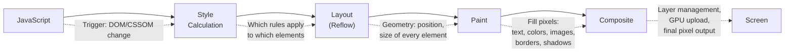
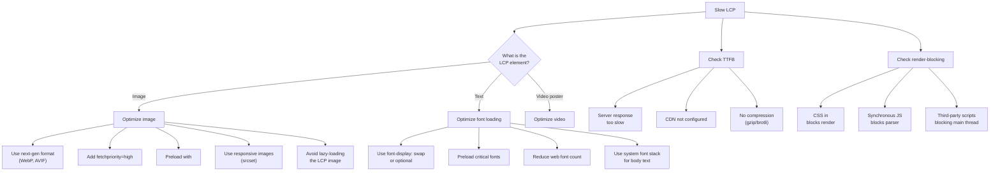

# Browser Profiling

The browser is one of the most complex execution environments in computing. Your JavaScript shares a single main thread with HTML parsing, CSS style calculation, layout, painting, and compositing. Understanding how to profile each stage of the rendering pipeline is essential for building interfaces that feel instantaneous. This page covers Chrome DevTools in depth, Lighthouse for automated auditing, Core Web Vitals for user-centric metrics, and techniques for finding the two most common browser performance killers: layout thrashing and memory leaks.

## The Browser Rendering Pipeline

Every frame the browser renders goes through this pipeline:



**Performance implications:**

| Change Type | Pipeline Steps Triggered | Cost |
|------------|-------------------------|------|
| Geometry change (`width`, `height`, `margin`, `top`) | Style → Layout → Paint → Composite | **Expensive** — triggers full pipeline |
| Paint-only change (`color`, `background`, `box-shadow`) | Style → Paint → Composite | **Moderate** — skips layout |
| Compositor-only change (`transform`, `opacity`) | Composite only | **Cheap** — skips layout AND paint |

This is why animations should use `transform` and `opacity` — they avoid the expensive layout and paint steps entirely and can be run on the GPU compositor thread, completely independent of the main thread.

## Chrome DevTools Performance Panel

### Recording a Performance Trace

1. Open DevTools (F12 or Cmd+Option+I).
2. Go to the **Performance** tab.
3. Check **Screenshots** for visual timeline.
4. Check **Web Vitals** for CWV event markers.
5. Click the **Record** button (or Ctrl+E).
6. Interact with your application (click, scroll, type — whatever is slow).
7. Click **Stop**.

::: tip CPU Throttling
For profiling, enable **4x slowdown** in the Performance panel's settings. This simulates a mid-range mobile device and makes performance problems visible that are invisible on your fast development machine. Many real users have devices 4-6x slower than your MacBook.
:::

### Reading the Performance Trace

The trace view has several lanes:

#### 1. Frames (FPS)

A bar chart showing frames per second. Green bars = good (60 fps). Red/yellow bars = dropped frames. Long gaps = the main thread was blocked.

```
60 fps ─────────────────────────────────────────────
       ▓▓▓▓▓▓▓▓▓▓▓▓░░░░░░▓▓▓▓▓▓▓▓▓▓▓▓▓▓▓▓▓▓▓▓▓▓▓▓
                   ^^^^^^^^
                   Dropped frames here — jank!
```

#### 2. Main Thread

The most important lane. Shows all JavaScript execution, style calculation, layout, and paint on the main thread. Each task is a colored block:

- **Yellow** — JavaScript (scripting)
- **Purple** — Style calculation and layout
- **Green** — Paint
- **Grey** — System/idle

**Long tasks** (> 50ms) are marked with a red corner triangle. These block user interaction and cause jank.

#### 3. Network

Waterfall of network requests showing DNS, connection, TTFB, and download times for each resource.

#### 4. Web Vitals

Shows when CWV events occur:
- **LCP** (Largest Contentful Paint) — green/yellow/red marker
- **FID/INP** — interaction events with delay measurements
- **CLS** — layout shift events with shift scores

#### 5. Summary Panel

When you click a block in the main thread, the bottom panel shows:
- **Summary** — total time broken down by category
- **Bottom-Up** — functions sorted by self time (where time is actually spent)
- **Call Tree** — top-down view of the call hierarchy
- **Event Log** — chronological list of events

### Finding the Bottleneck

**Step 1:** Look at the FPS lane. Find where frames are dropped.

**Step 2:** Click on the long task in the main thread at that point.

**Step 3:** Examine the Bottom-Up tab. Sort by "Self Time" to find the function consuming the most time.

**Step 4:** Click the function name to jump to the source code.

**Common patterns:**

| Pattern in Trace | Root Cause | Fix |
|-----------------|-----------|-----|
| Large yellow block | Expensive JS computation | Move to Web Worker, split into chunks with `requestIdleCallback` |
| Purple "Recalculate Style" after yellow | JS changes many class names | Batch DOM changes, use `classList` |
| Purple "Layout" after DOM read | Layout thrashing (read-write interleaving) | Batch reads then writes (see below) |
| Green "Paint" covering half the screen | Large paint area | Use `will-change`, promote to compositor layer |
| Many small yellow blocks in rapid succession | Too many event handlers firing | Debounce/throttle events |

## Lighthouse — Automated Performance Auditing

Lighthouse runs a series of audits and produces a score (0-100) with specific recommendations.

### Running Lighthouse

```bash
# CLI (most reproducible results)
npx lighthouse https://example.com \
  --output=html \
  --output-path=./lighthouse-report.html \
  --chrome-flags="--headless --no-sandbox" \
  --throttling.cpuSlowdownMultiplier=4

# Programmatic (in Node.js)
import lighthouse from 'lighthouse';
import chromeLauncher from 'chrome-launcher';

const chrome = await chromeLauncher.launch({ chromeFlags: ['--headless'] });
const options = {
  logLevel: 'info',
  output: 'json',
  port: chrome.port,
  onlyCategories: ['performance'],
};

const result = await lighthouse('https://example.com', options);
console.log('Performance score:', result.lhr.categories.performance.score * 100);

await chrome.kill();
```

### Lighthouse Metrics

| Metric | Weight | What It Measures | Target |
|--------|--------|-----------------|--------|
| **First Contentful Paint (FCP)** | 10% | Time until first text/image renders | < 1.8s |
| **Largest Contentful Paint (LCP)** | 25% | Time until largest content element renders | < 2.5s |
| **Total Blocking Time (TBT)** | 30% | Sum of blocking time (> 50ms per task) between FCP and TTI | < 200ms |
| **Cumulative Layout Shift (CLS)** | 25% | Sum of unexpected layout shifts | < 0.1 |
| **Speed Index** | 10% | How quickly content is visually populated | < 3.4s |

::: warning Lab vs. Field
Lighthouse measures **lab data** — synthetic tests under controlled conditions. Real users experience **field data** (Chrome UX Report, web-vitals library). Lab data is reproducible but may not reflect real-world performance. Always validate lab improvements with field data.
:::

### Lighthouse CI

Integrate Lighthouse into your CI pipeline to prevent performance regressions:

```yaml
# .github/workflows/lighthouse.yml
name: Lighthouse CI
on: [pull_request]

jobs:
  lighthouse:
    runs-on: ubuntu-latest
    steps:
      - uses: actions/checkout@v4
      - uses: actions/setup-node@v4
        with:
          node-version: 20
      - run: npm ci && npm run build
      - name: Run Lighthouse
        uses: treosh/lighthouse-ci-action@v11
        with:
          urls: |
            http://localhost:3000/
            http://localhost:3000/products
            http://localhost:3000/checkout
          budgetPath: ./lighthouse-budget.json
          uploadArtifacts: true
```

```json
// lighthouse-budget.json
[
  {
    "path": "/*",
    "timings": [
      { "metric": "interactive", "budget": 3000 },
      { "metric": "first-contentful-paint", "budget": 1500 },
      { "metric": "largest-contentful-paint", "budget": 2500 }
    ],
    "resourceSizes": [
      { "resourceType": "script", "budget": 300 },
      { "resourceType": "total", "budget": 500 }
    ]
  }
]
```

## Core Web Vitals (CWV)

Core Web Vitals are Google's user-centric performance metrics that directly influence search ranking. As of 2024, they are:

### LCP — Largest Contentful Paint

**Definition:** Time from navigation start until the largest image or text block is rendered in the viewport.

**Targets:**
- Good: < 2.5 seconds
- Needs improvement: 2.5 - 4.0 seconds
- Poor: > 4.0 seconds

**Common causes of slow LCP:**



**Measuring LCP in JavaScript:**

```typescript
import { onLCP, onINP, onCLS } from 'web-vitals';

// Report to analytics
onLCP((metric) => {
  console.log('LCP:', metric.value, 'ms');
  console.log('LCP element:', metric.entries[0]?.element);
  console.log('LCP source:', metric.attribution);
  // Send to your analytics endpoint
  sendToAnalytics({ name: 'LCP', value: metric.value, id: metric.id });
});
```

### INP — Interaction to Next Paint

**Definition:** The latency of the worst interaction (click, tap, keypress) during the page's lifetime. Specifically, it is the 98th percentile of all interaction latencies.

**Targets:**
- Good: < 200 milliseconds
- Needs improvement: 200 - 500 milliseconds
- Poor: > 500 milliseconds

**INP consists of three phases:**

```
User clicks button
       │
       ▼
┌──────────────┐
│ Input Delay  │ ← Time waiting for main thread to be free
│ (blocked by  │    (reduced by breaking up long tasks)
│  long tasks) │
└──────┬───────┘
       │
       ▼
┌──────────────┐
│ Processing   │ ← Time running event handlers
│ Time         │    (reduced by optimizing handler code)
│              │
└──────┬───────┘
       │
       ▼
┌──────────────┐
│ Presentation │ ← Time for style, layout, paint, composite
│ Delay        │    (reduced by minimizing DOM changes)
└──────────────┘
       │
       ▼
  Next paint
```

**Optimizing INP:**

```typescript
// BAD: Long task blocks main thread
button.addEventListener('click', () => {
  // This takes 300ms — blocks the main thread, causes high INP
  const result = expensiveComputation(data);
  updateDOM(result);
});

// GOOD: Break into smaller tasks with scheduler.yield()
button.addEventListener('click', async () => {
  // Show immediate visual feedback
  button.classList.add('loading');

  // Yield to let the browser paint the loading state
  await scheduler.yield();

  // Do expensive work in chunks
  const partialResult = computePartOne(data);
  await scheduler.yield();

  const fullResult = computePartTwo(partialResult);
  await scheduler.yield();

  updateDOM(fullResult);
  button.classList.remove('loading');
});

// GOOD: Move computation off main thread
const worker = new Worker('/compute-worker.js');

button.addEventListener('click', () => {
  button.classList.add('loading');
  worker.postMessage({ type: 'compute', data });
});

worker.addEventListener('message', (event) => {
  updateDOM(event.data.result);
  button.classList.remove('loading');
});
```

### CLS — Cumulative Layout Shift

**Definition:** The sum of all unexpected layout shift scores during the page's lifetime. A layout shift occurs when a visible element changes position between two frames.

**Targets:**
- Good: < 0.1
- Needs improvement: 0.1 - 0.25
- Poor: > 0.25

**Common causes of CLS:**

| Cause | Fix |
|-------|-----|
| Images without dimensions | Always set `width` and `height` attributes or use CSS `aspect-ratio` |
| Ads/iframes without reserved space | Reserve space with a placeholder container |
| Dynamically injected content above viewport | Insert below the fold, or reserve space |
| Web fonts causing FOUT/FOIT | Use `font-display: optional` or `size-adjust` |
| Late-loading third-party widgets | Reserve exact space in HTML |

**Measuring CLS with attribution:**

```typescript
import { onCLS } from 'web-vitals/attribution';

onCLS((metric) => {
  console.log('CLS:', metric.value);

  // Find the elements that shifted
  for (const entry of metric.entries) {
    for (const source of entry.sources || []) {
      console.log('Shifted element:', source.node);
      console.log('Previous rect:', source.previousRect);
      console.log('Current rect:', source.currentRect);
    }
  }
});
```

## Layout Thrashing — The Silent Performance Killer

Layout thrashing occurs when JavaScript reads layout properties (like `offsetHeight`, `getBoundingClientRect()`) and then writes to the DOM in rapid alternation. Each read forces the browser to synchronously calculate layout (a "forced reflow"), which is extremely expensive.

### Detecting Layout Thrashing

In the DevTools Performance panel, layout thrashing appears as:

- Many small purple "Layout" blocks interspersed with yellow "Script" blocks
- The Performance panel may show a warning: "Forced reflow is a likely performance bottleneck"

### Layout-Triggering Properties

Reading any of these properties forces a synchronous layout:

```
// Element dimensions and position
elem.offsetLeft, elem.offsetTop, elem.offsetWidth, elem.offsetHeight
elem.clientLeft, elem.clientTop, elem.clientWidth, elem.clientHeight
elem.scrollLeft, elem.scrollTop, elem.scrollWidth, elem.scrollHeight
elem.getBoundingClientRect()
elem.getComputedStyle()

// Window dimensions
window.innerWidth, window.innerHeight
window.scrollX, window.scrollY

// Focus-related
elem.focus() (may trigger layout to scroll element into view)
```

### The Problem — Read-Write Interleaving

```typescript
// BAD: Layout thrashing — O(n) forced reflows
function resizeAllBoxes(boxes: HTMLElement[]): void {
  for (const box of boxes) {
    // READ: Forces layout calculation
    const width = box.offsetWidth;

    // WRITE: Invalidates layout (dirties the layout tree)
    box.style.width = (width * 2) + 'px';

    // Next iteration: READ again → forces ANOTHER layout calculation
    // because the write invalidated the previous layout
  }
  // With 1000 boxes, this causes 1000 forced reflows!
}

// GOOD: Batch reads, then batch writes — 1 reflow total
function resizeAllBoxes(boxes: HTMLElement[]): void {
  // PHASE 1: Read all values (single layout calculation)
  const widths = boxes.map(box => box.offsetWidth);

  // PHASE 2: Write all values (layout is calculated once at the end)
  boxes.forEach((box, i) => {
    box.style.width = (widths[i] * 2) + 'px';
  });
}
```

### Using `requestAnimationFrame` for Write Batching

```typescript
// Read immediately, defer writes to the next frame
function animateElement(element: HTMLElement): void {
  // READ: happens now
  const currentHeight = element.offsetHeight;

  // WRITE: deferred to next frame (before paint)
  requestAnimationFrame(() => {
    element.style.height = (currentHeight + 10) + 'px';
  });
}
```

### Using `fastdom` for Automatic Read-Write Batching

```typescript
import fastdom from 'fastdom';

function resizeAllBoxes(boxes: HTMLElement[]): void {
  for (const box of boxes) {
    // fastdom batches all reads together, then all writes
    fastdom.measure(() => {
      const width = box.offsetWidth;

      fastdom.mutate(() => {
        box.style.width = (width * 2) + 'px';
      });
    });
  }
  // Result: 1 layout read, 1 layout write — no thrashing
}
```

## Paint Profiling

### Enabling Paint Flashing

DevTools > Rendering panel (More tools > Rendering) > Check "Paint flashing."

Green rectangles flash on screen whenever an area is repainted. This helps identify:

- **Unnecessary repaints** — areas that repaint when nothing visible changed
- **Large repaint areas** — a small change triggers repainting a large section
- **Frequent repaints** — animations or scrolling causing continuous repainting

### Layer Profiling

DevTools > Layers panel (More tools > Layers) shows all compositor layers. Each layer is painted independently and composited by the GPU.

**Why layers matter:**

Elements on their own compositor layer can be animated (transform, opacity) without triggering repaint of other elements. But too many layers waste GPU memory.

**What creates a new layer:**

```css
/* Explicit layer promotion */
.animated-element {
  will-change: transform; /* Promotes to own layer */
  /* OR */
  transform: translateZ(0); /* Hack — same effect */
}

/* Implicit layer creation */
.overlapping-element {
  position: fixed; /* Fixed elements get their own layer */
}

video, canvas, iframe { /* These always get their own layer */ }
```

**Layer budget:** Each layer uses GPU memory (roughly `width × height × 4 bytes`). A full-screen layer on a 1920x1080 display uses ~8 MB. Ten such layers = 80 MB of GPU memory. Monitor layer count in the Layers panel.

### Paint Profiler

DevTools > Performance panel > Enable "Advanced paint instrumentation" in settings.

After recording, click on a green "Paint" event. The Paint Profiler tab shows:

1. **Paint commands** — every draw call (drawRect, drawText, drawImage, etc.)
2. **Timing** — how long each command took
3. **Visual** — step through the paint process command by command

This helps identify which specific CSS property or element is causing expensive paints (e.g., `box-shadow`, `border-radius` on large elements, complex `clip-path`).

## Memory Leaks in Single-Page Applications

SPAs are particularly prone to memory leaks because pages are never fully unloaded. Memory that should be released when navigating between views accumulates over time.

### Detecting Memory Leaks in DevTools

**Technique 1: Performance Monitor**

DevTools > More tools > Performance Monitor. Watch the "JS heap size" counter while navigating between pages in your SPA. If it grows with each navigation and never comes back down, you have a leak.

**Technique 2: Memory panel heap snapshots**

1. Navigate to Page A.
2. Take Heap Snapshot 1.
3. Navigate to Page B.
4. Navigate back to Page A.
5. Force garbage collection (click the trash can icon).
6. Take Heap Snapshot 2.
7. In Snapshot 2, filter by "Objects allocated between Snapshot 1 and Snapshot 2."
8. These are objects that were created during the navigation but not cleaned up.

**Technique 3: Allocation instrumentation on timeline**

1. Memory panel > "Allocation instrumentation on timeline."
2. Click Start.
3. Navigate between pages several times.
4. Click Stop.
5. Blue bars in the timeline represent allocations. Blue bars that remain (not turned grey by GC) are potential leaks.

### Common SPA Memory Leak Patterns

#### 1. Detached DOM Trees

```typescript
// LEAKING: Reference to removed DOM element prevents GC
let cachedElement: HTMLElement | null = null;

function showModal(): void {
  const modal = document.createElement('div');
  modal.innerHTML = '<h1>Modal</h1><p>Content...</p>';
  document.body.appendChild(modal);
  cachedElement = modal; // Strong reference keeps it alive
}

function hideModal(): void {
  cachedElement?.remove(); // Removes from DOM...
  // But cachedElement still holds a reference!
  // The entire DOM subtree is "detached" but not GC'd
}

// FIXED: Clear the reference
function hideModal(): void {
  cachedElement?.remove();
  cachedElement = null; // Allow GC
}
```

In DevTools, search for "Detached" in the heap snapshot to find detached DOM trees.

#### 2. Event Listeners Not Removed

```typescript
// LEAKING: Listener on window is never removed when component unmounts
class InfiniteScrollComponent {
  private handleScroll = (): void => {
    // This closure captures `this`, which captures the entire component
    if (this.isNearBottom()) {
      this.loadMoreItems();
    }
  };

  mount(): void {
    window.addEventListener('scroll', this.handleScroll);
  }

  // Bug: unmount never called, or forgets to remove listener
  unmount(): void {
    // Missing: window.removeEventListener('scroll', this.handleScroll);
  }
}

// FIXED with AbortController (modern approach)
class InfiniteScrollComponent {
  private abortController = new AbortController();

  mount(): void {
    window.addEventListener('scroll', () => {
      if (this.isNearBottom()) {
        this.loadMoreItems();
      }
    }, { signal: this.abortController.signal });
  }

  unmount(): void {
    // Removes ALL listeners registered with this signal
    this.abortController.abort();
  }
}
```

#### 3. Forgotten Timers and Intervals

```typescript
// LEAKING: setInterval never cleared
function startPolling(component: Component): void {
  setInterval(() => {
    // This closure captures `component` — prevents GC
    component.refresh();
  }, 5000);
}

// FIXED: Clear on cleanup
function startPolling(component: Component): () => void {
  const intervalId = setInterval(() => {
    component.refresh();
  }, 5000);

  // Return cleanup function
  return () => clearInterval(intervalId);
}

// In React:
useEffect(() => {
  const intervalId = setInterval(() => {
    refresh();
  }, 5000);

  return () => clearInterval(intervalId); // Cleanup on unmount
}, []);
```

#### 4. Closures Capturing Large Scopes

```typescript
// LEAKING: Closure in Map captures entire scope
const cache = new Map<string, () => string>();

function processPage(pageData: LargeObject): void {
  // `pageData` is 50MB
  const summary = computeSummary(pageData);

  // This closure captures `pageData` through the scope chain
  // even though it only uses `summary`
  cache.set(pageData.id, () => `Summary: ${summary}`);

  // When we navigate away from this page, `pageData` cannot be GC'd
  // because the closure in the cache holds a reference to the scope
  // that contains `pageData`
}

// FIXED: Create closure in a new scope that doesn't include pageData
function createSummaryGetter(summary: string): () => string {
  return () => `Summary: ${summary}`;
}

function processPage(pageData: LargeObject): void {
  const summary = computeSummary(pageData);
  cache.set(pageData.id, createSummaryGetter(summary));
  // `pageData` can now be GC'd — closure only captures `summary`
}
```

#### 5. Framework-Specific Leaks

**React — Subscriptions in useEffect without cleanup:**

```tsx
// LEAKING
useEffect(() => {
  const subscription = eventBus.subscribe('update', handleUpdate);
  // No return — subscription is never cleaned up
}, []);

// FIXED
useEffect(() => {
  const subscription = eventBus.subscribe('update', handleUpdate);
  return () => subscription.unsubscribe();
}, []);
```

**Vue — Global event bus listeners:**

```typescript
// LEAKING
mounted() {
  this.$bus.$on('data-update', this.handleUpdate);
}
// Missing: beforeUnmount hook to remove listener

// FIXED
mounted() {
  this.$bus.$on('data-update', this.handleUpdate);
},
beforeUnmount() {
  this.$bus.$off('data-update', this.handleUpdate);
}
```

## Performance Observer API

The Performance Observer API lets you programmatically observe performance events in the browser:

```typescript
// Observe Long Tasks (> 50ms)
const longTaskObserver = new PerformanceObserver((list) => {
  for (const entry of list.getEntries()) {
    console.warn('Long Task detected:', {
      duration: entry.duration,
      startTime: entry.startTime,
      name: entry.name,
      // attribution tells you WHICH script caused the long task
      attribution: (entry as any).attribution,
    });
  }
});
longTaskObserver.observe({ type: 'longtask', buffered: true });

// Observe Layout Shifts
const clsObserver = new PerformanceObserver((list) => {
  for (const entry of list.getEntries() as LayoutShift[]) {
    if (!entry.hadRecentInput) { // Exclude user-initiated shifts
      console.warn('Layout shift:', {
        value: entry.value,
        sources: entry.sources?.map(s => ({
          node: s.node,
          previousRect: s.previousRect,
          currentRect: s.currentRect,
        })),
      });
    }
  }
});
clsObserver.observe({ type: 'layout-shift', buffered: true });

// Observe Largest Contentful Paint
const lcpObserver = new PerformanceObserver((list) => {
  const entries = list.getEntries();
  const lastEntry = entries[entries.length - 1]; // Last one is the actual LCP
  console.log('LCP:', {
    renderTime: lastEntry.renderTime,
    loadTime: lastEntry.loadTime,
    size: lastEntry.size,
    element: (lastEntry as any).element,
    url: (lastEntry as any).url,
  });
});
lcpObserver.observe({ type: 'largest-contentful-paint', buffered: true });

// Observe Resource Timing (for waterfall analysis)
const resourceObserver = new PerformanceObserver((list) => {
  for (const entry of list.getEntries() as PerformanceResourceTiming[]) {
    if (entry.duration > 1000) { // Log slow resources
      console.warn('Slow resource:', {
        name: entry.name,
        duration: entry.duration,
        transferSize: entry.transferSize,
        dnsTime: entry.domainLookupEnd - entry.domainLookupStart,
        connectTime: entry.connectEnd - entry.connectStart,
        ttfb: entry.responseStart - entry.requestStart,
        downloadTime: entry.responseEnd - entry.responseStart,
      });
    }
  }
});
resourceObserver.observe({ type: 'resource', buffered: true });
```

## Profiling Workflow Cheat Sheet

| Symptom | Tool | What to Look For |
|---------|------|-----------------|
| Page loads slowly | Lighthouse, Network panel | Large resources, render-blocking scripts, slow TTFB |
| Scrolling is janky | Performance panel, FPS counter | Long tasks during scroll, layout thrashing |
| Animations stutter | Performance panel, Layers panel | Layout/paint during animation (use transform instead) |
| Button click feels slow | Performance panel (INP) | Long event handler, input delay from long tasks |
| Content jumps around | CLS observer, Layout Shift regions | Images without dimensions, injected content |
| Memory grows over time | Memory panel, Performance Monitor | Detached DOM, leaked listeners, growing Maps |
| Tab crashes after hours | Memory panel heap snapshots | Compare snapshots to find growing allocations |

---

> *"The fastest code is the code that never runs on the main thread."*
