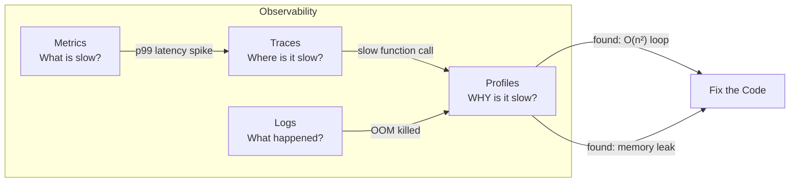
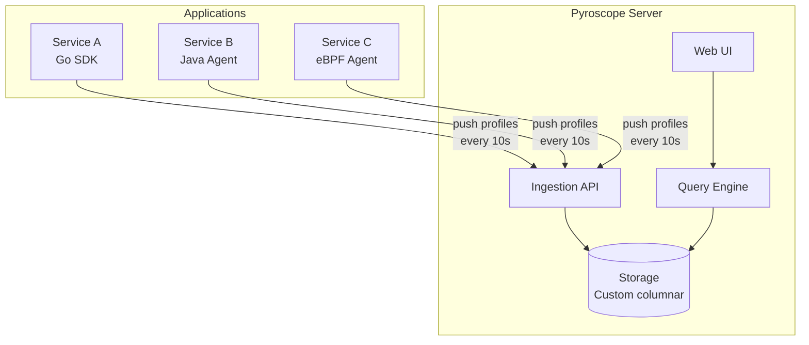

# Continuous Profiling

Traditional profiling is a snapshot — you attach a profiler, reproduce a problem, analyze the results, and detach. Continuous profiling flips this model: profiling runs **always**, in production, at low overhead, collecting data that is stored and queryable over time. When a performance regression appears in your metrics, you already have the profile data to explain it — no need to reproduce anything.

Continuous profiling is to CPU/memory what metrics are to request latency: an always-on observability signal.

**Related**: [Go Profiling](/performance/profiling/go-profiling) | [Node.js Profiling](/performance/profiling/nodejs-profiling) | [Database Profiling](/performance/profiling/database-profiling)

---

## Why Continuous Profiling

### The Problem with Ad-Hoc Profiling

| Ad-Hoc Profiling | Continuous Profiling |
|-----------------|---------------------|
| Must reproduce the problem | Data already collected |
| Adds overhead when attached | Constant low overhead (~2-5%) |
| Snapshot in time | Historical data (diff over time) |
| Usually in staging | Always in production |
| Manual trigger | Automatic |
| Forgotten after fixing | Catches regressions before users notice |

### The Three Pillars + Profiling



Metrics tell you something is wrong. Traces tell you where. **Profiles tell you why** — which function, which line, which allocation.

---

## Profile Types

| Profile | Question It Answers | When to Use |
|---------|-------------------|-------------|
| **CPU** | Where is CPU time spent? | High CPU usage, slow responses |
| **Heap (alloc_objects)** | Where are allocations happening? | High GC pressure, allocation rate |
| **Heap (inuse_space)** | What is holding memory? | Memory leaks, high RSS |
| **Goroutine** | What are goroutines doing? | Goroutine leaks, deadlocks (Go) |
| **Mutex** | Which locks are contended? | Lock contention, serialization |
| **Block** | Where do goroutines block? | Channel waits, I/O blocking (Go) |
| **Wall clock** | Where is wall time spent? | I/O-bound latency, sleep/wait |
| **Off-CPU** | Where is time spent NOT on CPU? | Disk I/O, network waits, locks |

---

## Flame Graphs

Flame graphs are the primary visualization for profile data. Reading them correctly is essential.

```
┌──────────────────────────────────────────────────────────┐
│                      main                                │  ← root
├──────────────────────────────────┬───────────────────────┤
│         handleRequest            │     backgroundJob      │
├──────────────┬───────────────────┤                       │
│  parseJSON   │   queryDatabase   │                       │
│              ├─────────┬─────────┤                       │
│              │ execute │ marshal │                       │
└──────────────┴─────────┴─────────┴───────────────────────┘
```

### How to Read a Flame Graph

- **X-axis**: NOT time. It is the **proportion of samples** (wider = more CPU time)
- **Y-axis**: Stack depth (bottom = root function, top = leaf function)
- **Width of a bar**: Percentage of total samples that include this function
- **Color**: Usually random or based on package/module (not meaningful by default)

::: warning Common Misreading
The X-axis is alphabetically sorted within each level, NOT chronological. Two bars side by side do not mean one runs after the other — they are simply two different call paths from the same parent.
:::

### Icicle vs. Flame

| View | Direction | Use |
|------|-----------|-----|
| **Flame** (bottom-up) | Root at bottom, leaves at top | "What functions consume the most CPU?" |
| **Icicle** (top-down) | Root at top, leaves at bottom | "What call paths lead to this function?" |
| **Sandwich** | Both | "Who calls this function AND what does it call?" |

---

## Continuous Profiling Tools

### Pyroscope (Grafana Pyroscope)

Pyroscope (now part of Grafana) is the most popular open-source continuous profiling platform.



#### Go SDK Integration

```go
package main

import (
    "os"
    "github.com/grafana/pyroscope-go"
)

func main() {
    pyroscope.Start(pyroscope.Config{
        ApplicationName: "order-service",
        ServerAddress:   "http://pyroscope:4040",
        Logger:          pyroscope.StandardLogger,
        Tags: map[string]string{
            "region":  os.Getenv("REGION"),
            "version": os.Getenv("APP_VERSION"),
        },
        ProfileTypes: []pyroscope.ProfileType{
            pyroscope.ProfileCPU,
            pyroscope.ProfileAllocObjects,
            pyroscope.ProfileAllocSpace,
            pyroscope.ProfileInuseObjects,
            pyroscope.ProfileInuseSpace,
            pyroscope.ProfileGoroutines,
            pyroscope.ProfileMutexCount,
            pyroscope.ProfileMutexDuration,
            pyroscope.ProfileBlockCount,
            pyroscope.ProfileBlockDuration,
        },
    })
    defer pyroscope.Stop()

    // Your application code
    startServer()
}
```

#### Node.js SDK Integration

```typescript
import Pyroscope from '@pyroscope/nodejs';

Pyroscope.init({
  serverAddress: 'http://pyroscope:4040',
  appName: 'api-gateway',
  tags: {
    region: process.env.REGION ?? 'us-east-1',
    version: process.env.APP_VERSION ?? 'unknown',
  },
});

Pyroscope.start();
```

### Parca — eBPF-Based Profiling

Parca uses eBPF to profile applications **without any code changes**. It attaches to the kernel and captures stack traces from any running process.

```yaml
# parca-agent config
node: "worker-01"
store_address: "parca-server:7070"
sampling_ratio: 1.0  # Sample every CPU cycle interrupt
# No application code changes needed!
```

| Feature | Pyroscope | Parca |
|---------|-----------|-------|
| SDK required | Yes (per-language) | No (eBPF) |
| Language support | Go, Java, Python, Ruby, Node, .NET | Any (kernel-level) |
| Overhead | ~2-5% | ~1-3% |
| Profile types | All | CPU, memory (language-dependent) |
| Symbolization | SDK handles it | Requires debug info |
| Kubernetes-native | Yes | Yes |
| Storage backend | Custom columnar | Custom columnar |

::: tip When to Use Which
- **Pyroscope**: When you want rich, language-specific profiles (goroutine, mutex, allocations) and can add an SDK
- **Parca**: When you cannot modify application code, or want uniform profiling across polyglot services
:::

---

## Sampling Strategies

Continuous profiling works by sampling, not tracing every function call. The sampling rate determines the balance between overhead and data quality.

### CPU Sampling

The profiler interrupts the application at a fixed frequency (e.g., 100 Hz = 100 times per second) and records the current stack trace.

$$
\text{Overhead} \approx \frac{\text{samples/sec} \times \text{stack walk cost}}{\text{CPU cycles/sec}}
$$

At 100 Hz with ~10 microseconds per stack walk:

$$
\text{Overhead} = \frac{100 \times 10\mu s}{1s} = 0.1\% \text{ CPU overhead}
$$

### Memory Sampling

Go's memory profiler samples every `N`th allocation (default: every 512 KB allocated). This means small, frequent allocations may be under-represented.

```go
// Adjust memory profiling rate (lower = more accurate, more overhead)
runtime.MemProfileRate = 512 * 1024  // Default: sample every 512 KB
runtime.MemProfileRate = 1           // Sample every allocation (VERY expensive)
```

::: warning Production Sampling Rates
| Profile Type | Recommended Rate | Overhead |
|-------------|-----------------|----------|
| CPU | 100 Hz | ~0.1-1% |
| Memory (Go) | 512 KB | ~1-2% |
| Goroutine | Every 10s snapshot | < 1% |
| Mutex | 1 (fraction) | ~1-2% |
| Block | 10000 (nanoseconds) | ~1% |
:::

---

## Production Workflows

### Workflow 1: Comparing Deployments

The killer feature of continuous profiling is **diff flame graphs** — comparing profiles between two time periods (e.g., before and after a deployment).

```
Before deploy (v1.2.3):
┌──────────────────────────────────────┐
│         handleRequest (40%)          │
├──────────┬───────────────────────────┤
│ parse    │     queryDB (30%)         │
│ (10%)    │                           │
└──────────┴───────────────────────────┘

After deploy (v1.2.4):
┌───────────────────────────────────────────────┐
│            handleRequest (55%)                 │  ← 15% increase!
├──────────┬────────────────────────────────────┤
│ parse    │     queryDB (30%)  │ newFeature    │
│ (10%)    │                    │ (15%)  ← NEW! │
└──────────┴────────────────────┴───────────────┘

Diff view shows: newFeature() added 15% CPU usage
```

### Workflow 2: Investigating Memory Leaks

```
1. Alert: RSS growing 100MB/hour
2. Open Pyroscope → select "inuse_space" profile
3. Compare 1-hour-ago vs now
4. Diff shows: cache.Store() holding 500MB more than before
5. Root cause: TTL eviction disabled in new config
6. Fix: Re-enable TTL, deploy
7. Verify: inuse_space stabilizes in post-deploy profile
```

### Workflow 3: Tag-Based Filtering

```go
// Add request-level tags for targeted profiling
pyroscope.TagWrapper(ctx, pyroscope.Labels(
    "endpoint", "/api/v1/orders",
    "customer_tier", "enterprise",
), func() {
    handleOrderRequest(ctx)
})
```

This lets you filter profiles by endpoint, customer tier, or any dimension — answering questions like "Why is the `/api/v1/orders` endpoint 2x slower for enterprise customers?"

---

## Deployment Patterns

### Sidecar Pattern (Kubernetes)

```yaml
apiVersion: apps/v1
kind: Deployment
metadata:
  name: order-service
spec:
  template:
    spec:
      containers:
        - name: order-service
          image: order-service:v1.2.3
          env:
            - name: PYROSCOPE_SERVER
              value: "http://pyroscope.monitoring:4040"
        # Parca agent as sidecar (eBPF)
        - name: parca-agent
          image: ghcr.io/parca-dev/parca-agent:latest
          securityContext:
            privileged: true  # Required for eBPF
          args:
            - "--store-address=parca-server.monitoring:7070"
            - "--node=order-service"
```

### Grafana Integration

Pyroscope integrates natively with Grafana, allowing you to correlate profiles with metrics and traces on the same dashboard:

```
Grafana Dashboard:
┌─────────────────────────────────────────┐
│ Request Rate    │  Error Rate           │  ← Metrics
├─────────────────┼───────────────────────┤
│ p99 Latency     │  CPU Usage            │  ← Metrics
├─────────────────┴───────────────────────┤
│ Trace Waterfall (Tempo)                 │  ← Traces
├─────────────────────────────────────────┤
│ CPU Flame Graph (Pyroscope)             │  ← Profiles
│ [Click any span in trace to see its     │
│  profile automatically]                 │
└─────────────────────────────────────────┘
```

---

## Cost and Overhead

| Factor | Impact | Mitigation |
|--------|--------|------------|
| CPU overhead | 1-5% per service | Lower sampling rate |
| Network bandwidth | ~1-10 KB/s per service | Compress, batch |
| Storage | ~1-5 GB/day per service (30-day retention) | Downsample old data |
| Memory (agent) | ~20-50 MB | Fixed overhead |

::: tip Total Cost of Ownership
For a 100-service deployment with 30-day retention:
- Storage: 100 services x 3 GB/day x 30 days = **9 TB**
- At $0.023/GB/month (S3): **~$207/month**
- Compare this to the cost of a single production incident caused by an undiagnosed performance regression — continuous profiling pays for itself quickly.
:::

---

## Summary

| Aspect | Detail |
|--------|--------|
| What | Always-on profiling in production |
| Why | "Why is it slow?" — the question metrics and traces cannot answer |
| Overhead | 1-5% CPU, ~1-10 KB/s network |
| Tools | Pyroscope (SDK), Parca (eBPF), Polar Signals Cloud |
| Profile types | CPU, heap, goroutine, mutex, block, wall clock |
| Killer feature | Diff flame graphs between deployments |
| Integration | Grafana (metrics + traces + profiles in one view) |
| Storage | 1-5 GB/day/service, 30-day retention typical |
