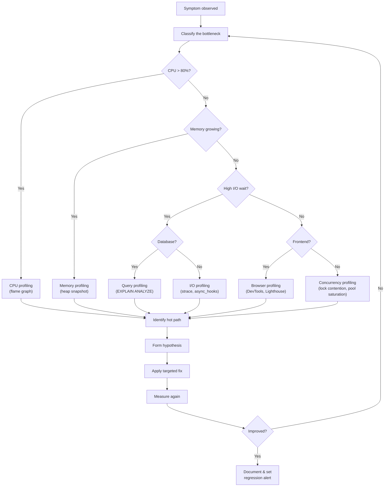

# Profiling & Measurement

Optimization without measurement is guesswork. Profiling is the discipline that turns "it feels slow" into "function X takes 47 ms on the hot path and is called 12,000 times per request." This section provides the tools, techniques, and mental models for finding bottlenecks across the entire stack — from V8 heap snapshots to PostgreSQL query plans.

## The Profiling Mindset

The single most important rule in performance work is:

> **Never optimize what you have not measured.**

This sounds obvious, yet developers routinely "optimize" code based on intuition. They micro-optimize a loop that runs once per request while ignoring a database query that runs 400 times. Profiling corrects these biases by providing data.

The second most important rule is:

> **Measure in the environment that matters.**

A function that is fast on your laptop with 10 rows may be catastrophically slow in production with 10 million rows. Profiling on synthetic data can miss the real bottleneck entirely. Whenever possible, profile against production-like datasets and traffic patterns.

## Profiling Categories

Different performance problems require different profiling tools:

| Category | What It Measures | Key Tools | When to Use |
|----------|-----------------|-----------|-------------|
| **CPU Profiling** | Where CPU time is spent | V8 profiler, pprof, `perf` | Application is CPU-bound (high CPU, low I/O wait) |
| **Memory Profiling** | Heap allocations, retention | Heap snapshots, allocation timelines | Memory grows over time, OOM kills, GC pauses |
| **I/O Profiling** | Disk reads/writes, network calls | `strace`, `dtrace`, async_hooks | Application is I/O-bound (low CPU, high wait) |
| **Database Profiling** | Query execution plans, lock waits | EXPLAIN ANALYZE, slow query log, pg_stat | Queries are slow, database CPU is high |
| **Browser Profiling** | Rendering, layout, paint | Chrome DevTools, Lighthouse, WebPageTest | Page load is slow, interactions feel sluggish |
| **Concurrency Profiling** | Lock contention, goroutine scheduling | Go pprof mutex/block, async_hooks | Throughput doesn't scale with CPU cores |

## Systematic Profiling Workflow



## The Observer Effect in Profiling

Every profiler adds overhead. The act of measuring changes what you are measuring. This is the profiling equivalent of the Heisenberg uncertainty principle, and it is a practical concern:

| Profiler Type | Typical Overhead | Impact |
|---------------|-----------------|--------|
| Sampling CPU profiler (1ms interval) | 1-5% | Minimal — safe for production |
| Instrumentation profiler (every function call) | 10-50x | Development only |
| Heap snapshot | Pauses the process for seconds | Never in production under load |
| Allocation tracking | 5-20% | Short bursts in production |
| `strace` (system call tracing) | 2-10x | Development only |
| `EXPLAIN ANALYZE` (per query) | 0% extra (runs the query) | Safe, but adds one query execution |

::: warning Sampling vs. Instrumentation
**Sampling profilers** periodically interrupt the program and record the current call stack. They have low overhead but can miss short functions. **Instrumentation profilers** hook into every function entry/exit. They capture everything but slow the program dramatically.

For production use, always prefer sampling profilers. For micro-benchmarks in development, instrumentation profilers give more precise results.
:::

## Flame Graphs — The Universal Visualization

Flame graphs, invented by Brendan Gregg, are the single most useful visualization in performance engineering. They compress thousands of stack traces into a single interactive image.

**How to read a flame graph:**

1. The **x-axis** is NOT time. It is the alphabetically sorted set of stack frames. Width represents the proportion of samples where that function was on the stack.
2. The **y-axis** is stack depth. The bottom is the entry point, the top is the leaf function where CPU time was actually spent.
3. **Wide plateaus at the top** are where time is spent. These are your optimization targets.
4. **Narrow towers** mean deep call stacks but little time — not worth optimizing.

```
┌─────────────────────────────────────────────────────────────────┐
│                         main()                                  │  ← entry point
├───────────────────────────────┬─────────────────────────────────┤
│        handleRequest()        │           gcSweep()             │
├──────────────┬────────────────┤                                 │
│  parseJSON() │  queryDB()     │                                 │
│              ├────────┬───────┤                                 │
│              │ encode │ wait  │                                 │
└──────────────┴────────┴───────┴─────────────────────────────────┘

parseJSON() is narrow → not much time spent
queryDB() is wide → significant time, look at its children
gcSweep() is wide → GC pressure, investigate allocations
```

## Key Metrics to Capture

Before you start profiling, decide which metrics matter:

| Metric | Definition | Target |
|--------|-----------|--------|
| **P50 latency** | Median response time | < 100 ms for APIs |
| **P99 latency** | 99th percentile response time | < 500 ms for APIs |
| **Throughput** | Requests per second (RPS) | Depends on capacity plan |
| **Error rate** | Percentage of 5xx responses | < 0.1% |
| **CPU utilization** | Percentage of CPU time used | 60-70% under normal load |
| **Memory RSS** | Resident set size of the process | Stable (no growth) |
| **GC pause time** | Time spent in garbage collection | < 10 ms per pause |
| **Event loop lag** | Delay between scheduled and actual tick | < 20 ms |
| **DB query time** | Time spent in database queries | Varies by query |
| **Connection pool wait** | Time waiting for a free connection | < 5 ms |

## Subsections

This section is divided by profiling domain:

- **[Node.js Profiling](./nodejs-profiling)** — V8 CPU profiling, heap snapshots, flame graphs with 0x and Clinic.js, async_hooks, production profiling
- **[Go Profiling](./go-profiling)** — pprof (CPU, memory, goroutine, block, mutex), runtime/trace, benchmarking with testing.B
- **[Browser Profiling](./browser-profiling)** — Chrome DevTools Performance panel, Lighthouse, Core Web Vitals, layout thrashing, memory leaks in SPAs
- **[Database Profiling](./database-profiling)** — EXPLAIN ANALYZE deep dive, slow query log, query plan visualization, pg_stat_statements

## Profiling Anti-Patterns

| Anti-Pattern | Why It Fails | Better Approach |
|-------------|-------------|-----------------|
| Profiling with debugger attached | Debugger pauses distort timing | Use sampling profiler independently |
| Profiling with tiny dataset | Misses O(n^2) behavior that only shows at scale | Use production-sized datasets |
| Profiling only happy path | Errors and retries are often the bottleneck | Profile under realistic error rates |
| Profiling once and declaring victory | Performance regresses over time | Continuous profiling in CI/CD |
| Profiling in development only | Production has different hardware, concurrency, data | Use production profiling with low overhead |

---

> *"Without data, you're just another person with an opinion." — W. Edwards Deming*
