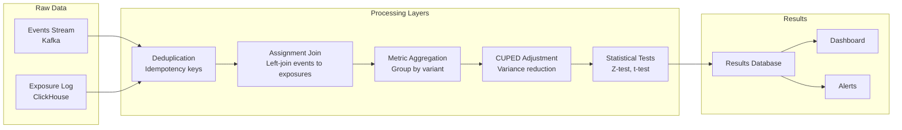

# A/B Test Analysis Pipeline

## Pipeline Architecture



## Data Pipeline Implementation

### Event-to-Assignment Join

The core of the analysis is joining user events to their experiment assignments. This must be a **left join on first exposure** — only events *after* a user was first exposed to an experiment should be counted.

```sql
-- ClickHouse: compute experiment metrics for a date range
-- Step 1: Get first exposure per user per experiment
WITH first_exposures AS (
  SELECT
    experiment_id,
    user_id,
    variant_id,
    min(timestamp) AS first_exposed_at
  FROM analytics.experiment_exposures
  WHERE
    experiment_id = {experimentId: String}
    AND timestamp >= {startDate: DateTime}
    AND timestamp <= {endDate: DateTime}
  GROUP BY experiment_id, user_id, variant_id
),

-- Step 2: Get conversion events AFTER first exposure
post_exposure_events AS (
  SELECT
    e.experiment_id,
    e.user_id,
    e.variant_id,
    e.first_exposed_at,
    -- Aggregate metrics per user
    count(CASE WHEN t.event = 'purchase_completed' THEN 1 END) AS purchase_count,
    sum(CASE WHEN t.event = 'purchase_completed'
        THEN JSONExtractFloat(t.properties, 'revenue')
        ELSE 0 END) AS revenue,
    countIf(t.event = 'page_viewed') AS pageviews,
    max(CASE WHEN t.event = 'purchase_completed' THEN 1 ELSE 0 END) AS converted
  FROM first_exposures e
  LEFT JOIN tracking.events t
    ON e.user_id = t.user_id
    AND t.timestamp >= e.first_exposed_at
    AND t.timestamp <= {endDate: DateTime}
  GROUP BY
    e.experiment_id, e.user_id, e.variant_id, e.first_exposed_at
)

-- Step 3: Aggregate by variant
SELECT
  variant_id,
  count(DISTINCT user_id) AS users,
  sum(purchase_count) AS total_purchases,
  avg(converted) AS conversion_rate,
  sum(revenue) / count(DISTINCT user_id) AS revenue_per_user,
  avg(revenue) AS avg_revenue_per_converter,
  varPop(converted) AS conversion_variance,
  varPop(revenue) AS revenue_variance,
  quantile(0.50)(pageviews) AS median_pageviews,
  quantile(0.95)(pageviews) AS p95_pageviews
FROM post_exposure_events
GROUP BY variant_id
ORDER BY variant_id;
```

### TypeScript Analysis Engine

```typescript
// src/analysis/experiment-analyzer.ts
import type { ClickHouseClient } from '@clickhouse/client';

interface ExperimentMetrics {
  variantId: string;
  users: number;
  conversionRate: number;
  conversionVariance: number;
  revenuePerUser: number;
  revenueVariance: number;
  totalRevenue: number;
}

interface AnalysisResult {
  experimentId: string;
  status: 'significant' | 'not-significant' | 'insufficient-data';
  controlMetrics: ExperimentMetrics;
  treatmentMetrics: ExperimentMetrics[];
  primaryMetric: MetricComparison;
  secondaryMetrics: MetricComparison[];
  guardrailViolations: GuardrailViolation[];
  segmentAnalysis?: SegmentResult[];
  runDate: string;
}

interface MetricComparison {
  metricName: string;
  control: { mean: number; ci95: [number, number] };
  treatment: { mean: number; ci95: [number, number] };
  absoluteChange: number;
  relativeChange: number;
  pValue: number;
  isSignificant: boolean;
  practicallySignificant: boolean;  // Effect size above minimum meaningful threshold
}

interface GuardrailViolation {
  metricName: string;
  controlValue: number;
  treatmentValue: number;
  relativeChange: number;
  threshold: number;
  severity: 'warning' | 'critical';
}

export class ExperimentAnalyzer {
  constructor(private clickhouse: ClickHouseClient) {}

  async analyze(
    experimentId: string,
    config: {
      startDate: Date;
      endDate: Date;
      primaryMetric: string;
      secondaryMetrics: string[];
      guardrails: Array<{
        metric: string;
        maxDegradation: number;
        severity: 'warning' | 'critical';
      }>;
      minPracticalEffect: number;   // Minimum relative change that matters
    }
  ): Promise<AnalysisResult> {
    // Fetch raw metrics from ClickHouse
    const metrics = await this.fetchMetrics(experimentId, config.startDate, config.endDate);

    const control = metrics.find((m) => m.variantId === 'control');
    if (!control) throw new Error('No control variant found');

    const treatments = metrics.filter((m) => m.variantId !== 'control');

    // Check for sufficient sample size
    const totalUsers = metrics.reduce((s, m) => s + m.users, 0);
    if (totalUsers < 100) {
      return {
        experimentId,
        status: 'insufficient-data',
        controlMetrics: control,
        treatmentMetrics: treatments,
        primaryMetric: this.emptyComparison(config.primaryMetric),
        secondaryMetrics: [],
        guardrailViolations: [],
        runDate: new Date().toISOString(),
      };
    }

    // Compute primary metric comparison for each treatment
    const primaryComparisons = treatments.map((treatment) =>
      this.compareMetric(
        config.primaryMetric,
        control,
        treatment,
        config.minPracticalEffect
      )
    );

    // Compute secondary metrics
    const secondaryComparisons = config.secondaryMetrics.flatMap((metric) =>
      treatments.map((treatment) =>
        this.compareMetric(metric, control, treatment, 0)
      )
    );

    // Apply Bonferroni correction for multiple comparisons
    const allPValues = [...primaryComparisons, ...secondaryComparisons].map(
      (c) => c.pValue
    );
    const correctedAlpha = 0.05 / allPValues.length;

    // Check guardrails
    const violations = this.checkGuardrails(config.guardrails, metrics);

    // Determine overall status
    const isSignificant = primaryComparisons.some(
      (c) => c.pValue < correctedAlpha && c.practicallySignificant
    );
    const hasViolation = violations.some((v) => v.severity === 'critical');

    return {
      experimentId,
      status:
        hasViolation ? 'not-significant'
        : isSignificant ? 'significant'
        : 'not-significant',
      controlMetrics: control,
      treatmentMetrics: treatments,
      primaryMetric: primaryComparisons[0] ?? this.emptyComparison(config.primaryMetric),
      secondaryMetrics: secondaryComparisons,
      guardrailViolations: violations,
      runDate: new Date().toISOString(),
    };
  }

  private compareMetric(
    metricName: string,
    control: ExperimentMetrics,
    treatment: ExperimentMetrics,
    minPracticalEffect: number
  ): MetricComparison {
    let controlMean: number;
    let treatmentMean: number;
    let controlVariance: number;
    let treatmentVariance: number;

    if (metricName === 'conversion_rate') {
      controlMean = control.conversionRate;
      treatmentMean = treatment.conversionRate;
      controlVariance = control.conversionVariance;
      treatmentVariance = treatment.conversionVariance;
    } else if (metricName === 'revenue_per_user') {
      controlMean = control.revenuePerUser;
      treatmentMean = treatment.revenuePerUser;
      controlVariance = control.revenueVariance;
      treatmentVariance = treatment.revenueVariance;
    } else {
      throw new Error(`Unknown metric: ${metricName}`);
    }

    // Welch's t-test
    const seDiff = Math.sqrt(
      controlVariance / control.users + treatmentVariance / treatment.users
    );

    const tStat = seDiff > 0 ? (treatmentMean - controlMean) / seDiff : 0;

    // Approximate p-value (large sample, use normal distribution)
    const pValue = 2 * (1 - normalCDF(Math.abs(tStat)));

    // 95% CI for the difference
    const diff = treatmentMean - controlMean;
    const ci95: [number, number] = [diff - 1.96 * seDiff, diff + 1.96 * seDiff];

    // Individual CIs
    const controlSE = Math.sqrt(controlVariance / control.users);
    const treatmentSE = Math.sqrt(treatmentVariance / treatment.users);

    const relativeChange = controlMean !== 0 ? diff / controlMean : 0;
    const practicallySignificant = Math.abs(relativeChange) >= minPracticalEffect;

    return {
      metricName,
      control: {
        mean: controlMean,
        ci95: [controlMean - 1.96 * controlSE, controlMean + 1.96 * controlSE],
      },
      treatment: {
        mean: treatmentMean,
        ci95: [treatmentMean - 1.96 * treatmentSE, treatmentMean + 1.96 * treatmentSE],
      },
      absoluteChange: diff,
      relativeChange,
      pValue,
      isSignificant: pValue < 0.05,
      practicallySignificant,
    };
  }

  private checkGuardrails(
    guardrails: Array<{
      metric: string;
      maxDegradation: number;
      severity: 'warning' | 'critical';
    }>,
    metrics: ExperimentMetrics[]
  ): GuardrailViolation[] {
    const violations: GuardrailViolation[] = [];
    const control = metrics.find((m) => m.variantId === 'control');
    if (!control) return violations;

    for (const treatment of metrics.filter((m) => m.variantId !== 'control')) {
      for (const guardrail of guardrails) {
        const controlValue = this.getMetricValue(guardrail.metric, control);
        const treatmentValue = this.getMetricValue(guardrail.metric, treatment);
        const relativeChange =
          controlValue !== 0
            ? (treatmentValue - controlValue) / controlValue
            : 0;

        // Guardrails trigger on degradation (negative relative change beyond threshold)
        if (relativeChange < -guardrail.maxDegradation) {
          violations.push({
            metricName: guardrail.metric,
            controlValue,
            treatmentValue,
            relativeChange,
            threshold: -guardrail.maxDegradation,
            severity: guardrail.severity,
          });
        }
      }
    }

    return violations;
  }

  private getMetricValue(metric: string, m: ExperimentMetrics): number {
    const map: Record<string, number> = {
      conversion_rate: m.conversionRate,
      revenue_per_user: m.revenuePerUser,
    };
    return map[metric] ?? 0;
  }

  private emptyComparison(metricName: string): MetricComparison {
    return {
      metricName,
      control: { mean: 0, ci95: [0, 0] },
      treatment: { mean: 0, ci95: [0, 0] },
      absoluteChange: 0,
      relativeChange: 0,
      pValue: 1,
      isSignificant: false,
      practicallySignificant: false,
    };
  }

  private async fetchMetrics(
    experimentId: string,
    startDate: Date,
    endDate: Date
  ): Promise<ExperimentMetrics[]> {
    // Query ClickHouse (shown above)
    const result = await this.clickhouse.query({
      query: METRICS_QUERY,
      query_params: {
        experimentId,
        startDate: startDate.toISOString(),
        endDate: endDate.toISOString(),
      },
      format: 'JSONEachRow',
    });

    return result.json<ExperimentMetrics>();
  }
}

const METRICS_QUERY = `/* SQL query from above */`;
```

## CUPED Variance Reduction

CUPED (Controlled-experiment Using Pre-Experiment Data) reduces variance by removing the component explained by pre-experiment behavior:

```typescript
// src/analysis/cuped.ts

interface CupedData {
  userId: string;
  variantId: string;
  preMetric: number;    // Metric value before experiment
  postMetric: number;   // Metric value during experiment
}

interface CupedResult {
  adjustedMeans: Record<string, number>;
  varianceReduction: number;
  theta: number;
  rho: number;
}

export function applyCuped(data: CupedData[]): CupedResult {
  // Calculate theta (regression coefficient) using all data
  const allPre = data.map((d) => d.preMetric);
  const allPost = data.map((d) => d.postMetric);

  const meanPre = mean(allPre);
  const meanPost = mean(allPost);

  const covPrePost =
    data.reduce(
      (s, d) => s + (d.preMetric - meanPre) * (d.postMetric - meanPost),
      0
    ) / data.length;

  const varPre =
    data.reduce((s, d) => s + Math.pow(d.preMetric - meanPre, 2), 0) /
    data.length;

  const varPost =
    data.reduce((s, d) => s + Math.pow(d.postMetric - meanPost, 2), 0) /
    data.length;

  const theta = varPre > 0 ? covPrePost / varPre : 0;
  const rho = Math.sqrt(varPre * varPost) > 0 ? covPrePost / Math.sqrt(varPre * varPost) : 0;

  // Apply CUPED adjustment per user
  const adjusted = data.map((d) => ({
    ...d,
    adjustedPost: d.postMetric - theta * (d.preMetric - meanPre),
  }));

  // Compute adjusted means per variant
  const byVariant = new Map<string, number[]>();
  for (const d of adjusted) {
    const arr = byVariant.get(d.variantId) ?? [];
    arr.push(d.adjustedPost);
    byVariant.set(d.variantId, arr);
  }

  const adjustedMeans: Record<string, number> = {};
  for (const [variantId, values] of byVariant.entries()) {
    adjustedMeans[variantId] = mean(values);
  }

  // Variance reduction factor
  const varianceReduction = 1 - Math.pow(rho, 2);

  return { adjustedMeans, varianceReduction, theta, rho };
}

function mean(arr: number[]): number {
  return arr.reduce((s, v) => s + v, 0) / arr.length;
}
```

### Fetching Pre-Experiment Data

```sql
-- Get pre-experiment metric values (2-week lookback before experiment start)
SELECT
  user_id,
  variant_id,  -- From experiment exposure
  -- Pre-experiment metric (before experiment started)
  countIf(
    t.timestamp < {experimentStartDate: DateTime}
    AND t.event = 'purchase_completed'
  ) AS pre_experiment_purchases,
  -- Post-experiment metric
  countIf(
    t.timestamp >= {experimentStartDate: DateTime}
    AND t.event = 'purchase_completed'
  ) AS post_experiment_purchases
FROM analytics.experiment_exposures e
LEFT JOIN tracking.events t
  ON e.user_id = t.user_id
  AND t.timestamp >= subtractDays({experimentStartDate: DateTime}, 14)  -- 14-day pre window
  AND t.timestamp <= {endDate: DateTime}
WHERE e.experiment_id = {experimentId: String}
GROUP BY e.user_id, e.variant_id
```

## Segment Analysis

Segment analysis breaks down results by user subgroups to understand heterogeneous treatment effects.

```typescript
// src/analysis/segment-analysis.ts

interface SegmentDefinition {
  name: string;
  attribute: string;
  values: string[];
}

interface SegmentResult {
  segment: string;
  value: string;
  controlUsers: number;
  treatmentUsers: number;
  controlConversionRate: number;
  treatmentConversionRate: number;
  relativeChange: number;
  pValue: number;
  isSignificant: boolean;
}

const DEFAULT_SEGMENTS: SegmentDefinition[] = [
  {
    name: 'device_type',
    attribute: 'deviceType',
    values: ['desktop', 'mobile', 'tablet'],
  },
  {
    name: 'subscription_tier',
    attribute: 'subscriptionTier',
    values: ['free', 'pro', 'enterprise'],
  },
  {
    name: 'new_vs_returning',
    attribute: 'isNewUser',
    values: ['true', 'false'],
  },
];

export async function runSegmentAnalysis(
  experimentId: string,
  clickhouse: ClickHouseClient,
  segments = DEFAULT_SEGMENTS
): Promise<SegmentResult[]> {
  const results: SegmentResult[] = [];

  for (const segment of segments) {
    const query = `
      WITH exposures AS (
        SELECT
          user_id,
          variant_id,
          JSONExtractString(properties, {attribute: String}) AS segment_value,
          first_exposed_at
        FROM analytics.experiment_exposures
        WHERE experiment_id = {experimentId: String}
      ),
      conversions AS (
        SELECT DISTINCT user_id
        FROM tracking.events
        WHERE event = 'purchase_completed'
      )
      SELECT
        e.variant_id,
        e.segment_value,
        count(DISTINCT e.user_id) AS users,
        countIf(c.user_id IS NOT NULL) AS converted,
        avg(c.user_id IS NOT NULL) AS conversion_rate
      FROM exposures e
      LEFT JOIN conversions c USING (user_id)
      WHERE e.segment_value IN {values: Array(String)}
      GROUP BY e.variant_id, e.segment_value
    `;

    const rows = await clickhouse.query({
      query,
      query_params: {
        experimentId,
        attribute: segment.attribute,
        values: segment.values,
      },
      format: 'JSONEachRow',
    }).then((r) => r.json<{
      variant_id: string;
      segment_value: string;
      users: number;
      converted: number;
      conversion_rate: number;
    }>());

    // For each segment value, compare control vs treatment
    for (const value of segment.values) {
      const segRows = rows.filter((r) => r.segment_value === value);
      const control = segRows.find((r) => r.variant_id === 'control');
      const treatment = segRows.find((r) => r.variant_id !== 'control');

      if (!control || !treatment || control.users < 50 || treatment.users < 50) {
        continue;
      }

      const testResult = twoProportionZTest(
        control.converted, control.users,
        treatment.converted, treatment.users
      );

      results.push({
        segment: segment.name,
        value,
        controlUsers: control.users,
        treatmentUsers: treatment.users,
        controlConversionRate: control.conversion_rate,
        treatmentConversionRate: treatment.conversion_rate,
        relativeChange: testResult.relativeChange,
        pValue: testResult.pValue,
        isSignificant: testResult.isSignificant,
      });
    }
  }

  return results;
}
```

### Interpreting Segment Analysis

::: warning
**Segment analysis is exploratory, not confirmatory.** With 10 segments × 5 values = 50 tests, you expect ~2.5 false positives at $\alpha = 0.05$ by chance. Do not use segment analysis to "find" significance when the overall test was not significant.

Use segments to generate hypotheses for *future* targeted experiments.
:::

## Automated Analysis Reports

```typescript
// src/analysis/report-generator.ts

interface ExperimentReport {
  summary: {
    winner: 'control' | 'treatment' | 'inconclusive' | 'guardrail-violated';
    confidence: number;
    primaryMetricLift: number;
    recommendedAction: 'ship' | 'investigate' | 'stop' | 'extend';
  };
  statisticalResults: AnalysisResult;
  segmentInsights: SegmentResult[];
  sampleSizeAdequacy: {
    current: number;
    required: number;
    percentComplete: number;
    daysRemaining: number;
  };
}

export function generateReport(
  analysis: AnalysisResult,
  segments: SegmentResult[],
  config: { requiredSampleSize: number; dailyUsers: number }
): ExperimentReport {
  const primaryLift = analysis.primaryMetric.relativeChange;
  const isSignificant = analysis.status === 'significant';
  const hasViolation = analysis.guardrailViolations.some(
    (v) => v.severity === 'critical'
  );

  const winner: ExperimentReport['summary']['winner'] =
    hasViolation ? 'guardrail-violated'
    : !isSignificant ? 'inconclusive'
    : primaryLift > 0 ? 'treatment'
    : 'control';

  const recommendedAction: ExperimentReport['summary']['recommendedAction'] =
    hasViolation ? 'stop'
    : winner === 'treatment' ? 'ship'
    : winner === 'control' ? 'investigate'
    : 'extend';

  const totalUsers = analysis.controlMetrics.users +
    analysis.treatmentMetrics.reduce((s, m) => s + m.users, 0);

  const daysRemaining = Math.max(
    0,
    Math.ceil((config.requiredSampleSize - totalUsers) / config.dailyUsers)
  );

  return {
    summary: {
      winner,
      confidence: isSignificant ? 1 - analysis.primaryMetric.pValue : 0,
      primaryMetricLift: primaryLift,
      recommendedAction,
    },
    statisticalResults: analysis,
    segmentInsights: segments,
    sampleSizeAdequacy: {
      current: totalUsers,
      required: config.requiredSampleSize,
      percentComplete: Math.min(100, (totalUsers / config.requiredSampleSize) * 100),
      daysRemaining,
    },
  };
}
```

## Performance Optimization

### Incremental Metric Computation

For experiments running for weeks, recomputing all metrics from scratch daily is expensive. Use incremental aggregation:

```sql
-- Incremental aggregation: only process yesterday's events
INSERT INTO analytics.experiment_daily_metrics
SELECT
  experiment_id,
  variant_id,
  toDate(timestamp) AS date,
  count(DISTINCT user_id) AS new_users,
  countIf(event = 'purchase_completed') AS purchases,
  sumIf(JSONExtractFloat(properties, 'revenue'), event = 'purchase_completed') AS revenue
FROM tracking.events
WHERE
  toDate(timestamp) = yesterday()
GROUP BY experiment_id, variant_id, date;

-- Cumulative roll-up
SELECT
  experiment_id,
  variant_id,
  sum(new_users) AS total_users,
  sum(purchases) AS total_purchases,
  sum(revenue) AS total_revenue
FROM analytics.experiment_daily_metrics
WHERE experiment_id = {experimentId: String}
GROUP BY experiment_id, variant_id;
```

### Caching Analysis Results

```typescript
// Cache analysis results for 1 hour (re-run nightly for accuracy)
const CACHE_TTL = 3600;

export async function getCachedAnalysis(
  redis: Redis,
  experimentId: string,
  analyzer: ExperimentAnalyzer,
  config: AnalysisConfig
): Promise<AnalysisResult> {
  const cacheKey = `analysis:${experimentId}:${config.endDate.toISOString().split('T')[0]}`;
  const cached = await redis.get(cacheKey);

  if (cached) {
    return JSON.parse(cached) as AnalysisResult;
  }

  const result = await analyzer.analyze(experimentId, config);
  await redis.setex(cacheKey, CACHE_TTL, JSON.stringify(result));

  return result;
}
```

::: info War Story
**The Segment That Wasn't Real**

An analyst found a striking result: in the "power users" segment (top 10% by engagement), the treatment showed a 35% conversion lift with $p = 0.001$. The overall result was neutral ($p = 0.42$).

They shipped the treatment to power users only. Revenue didn't change.

Post-mortem: the power user segment was identified by the analyst using behavior data from the experiment period — data that was correlated with the treatment by definition (treatment improved engagement, which affected who was classified as a "power user"). This is **endogeneity**: using an outcome-influenced variable to define segments.

Correct approach: define segments using pre-experiment data only. Power users should be identified by their behavior in the 2 weeks *before* the experiment started.
:::
