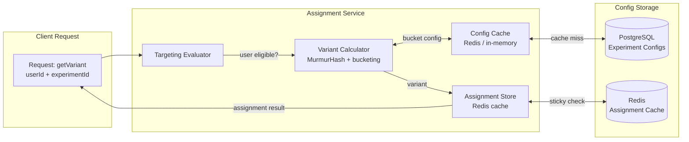
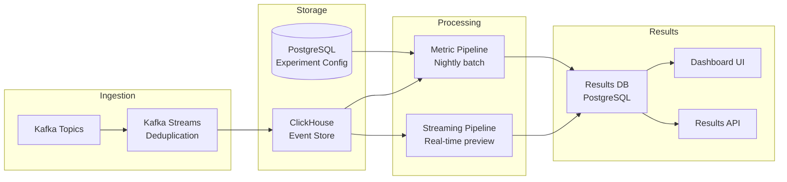

# A/B Testing Architecture

## System Design Principles

A production A/B testing system has three hard requirements:

1. **Low latency assignment** — variant lookup must be < 5ms P99 or it becomes a bottleneck on every page load
2. **No missed events** — every exposure and conversion must be captured reliably for statistical validity
3. **Reproducible analysis** — the same data must produce the same results, with full audit trail

These requirements pull in different directions. Low latency favors in-memory caching. No missed events favors synchronous writes. Reproducible analysis favors immutable event logs.

## Assignment Service

### Architecture



### Assignment Service Implementation

```typescript
// src/assignment/assignment-service.ts
import { createHash } from 'crypto';
import murmurhash from 'murmurhash';
import Redis from 'ioredis';
import type {
  Experiment,
  Variant,
  Assignment,
  TargetingRules,
  UserContext,
} from './types';

interface AssignmentServiceConfig {
  redis: Redis;
  configRefreshMs: number;
}

export class AssignmentService {
  private configCache = new Map<string, Experiment>();
  private configLastRefresh = 0;

  constructor(private config: AssignmentServiceConfig) {}

  async getVariant(
    experimentId: string,
    userId: string,
    userContext: UserContext
  ): Promise<Assignment> {
    const experiment = await this.getExperiment(experimentId);

    if (!experiment || experiment.status !== 'running') {
      return { variant: null, experimentId, userId, reason: 'experiment-inactive' };
    }

    // Check targeting rules
    const eligible = this.evaluateTargeting(experiment.targeting, userContext);
    if (!eligible) {
      return { variant: null, experimentId, userId, reason: 'not-targeted' };
    }

    // Check mutual exclusion
    const excluded = await this.checkExclusion(userId, experiment);
    if (excluded) {
      return { variant: null, experimentId, userId, reason: 'excluded' };
    }

    // Get or create sticky assignment
    const cached = await this.getCachedAssignment(experimentId, userId);
    if (cached) {
      return { variant: cached, experimentId, userId, reason: 'cached' };
    }

    // Compute deterministic assignment
    const variant = this.computeVariant(experimentId, userId, experiment.variants);

    // Cache the assignment
    await this.cacheAssignment(experimentId, userId, variant.id);

    return { variant: variant.id, experimentId, userId, reason: 'assigned' };
  }

  private computeVariant(
    experimentId: string,
    userId: string,
    variants: Variant[]
  ): Variant {
    // MurmurHash for uniform distribution
    const hashInput = `${experimentId}:${userId}`;
    const hash = murmurhash.v3(hashInput);
    const bucket = hash % 10000; // 0–9999 (basis points)

    // Assign to variant based on cumulative weights
    let cumulative = 0;
    for (const variant of variants) {
      cumulative += variant.weight * 10000;
      if (bucket < cumulative) {
        return variant;
      }
    }

    // Fallback to last variant (handles floating point imprecision)
    return variants[variants.length - 1];
  }

  private evaluateTargeting(
    rules: TargetingRules,
    context: UserContext
  ): boolean {
    if (rules.percentage !== undefined) {
      // Use hash of userId for deterministic percentage sampling
      const hash = murmurhash.v3(`percentage:${context.userId}`);
      if ((hash % 100) >= rules.percentage) return false;
    }

    if (rules.countries?.length) {
      if (!context.country || !rules.countries.includes(context.country)) {
        return false;
      }
    }

    if (rules.accountAgeMinDays !== undefined) {
      const accountAge = context.accountCreatedAt
        ? (Date.now() - new Date(context.accountCreatedAt).getTime()) / 86400000
        : 0;
      if (accountAge < rules.accountAgeMinDays) return false;
    }

    if (rules.deviceTypes?.length) {
      if (!context.deviceType || !rules.deviceTypes.includes(context.deviceType)) {
        return false;
      }
    }

    if (rules.userAttributes) {
      for (const [key, value] of Object.entries(rules.userAttributes)) {
        if (context.attributes?.[key] !== value) return false;
      }
    }

    return true;
  }

  private async getCachedAssignment(
    experimentId: string,
    userId: string
  ): Promise<string | null> {
    const key = `assignment:${experimentId}:${userId}`;
    return this.config.redis.get(key);
  }

  private async cacheAssignment(
    experimentId: string,
    userId: string,
    variantId: string
  ): Promise<void> {
    const key = `assignment:${experimentId}:${userId}`;
    // Cache for 30 days (experiment lifetime)
    await this.config.redis.setex(key, 30 * 86400, variantId);
  }

  private async checkExclusion(
    userId: string,
    experiment: Experiment
  ): Promise<boolean> {
    if (!experiment.exclusionGroups?.length) return false;

    for (const groupId of experiment.exclusionGroups) {
      const assigned = await this.config.redis.get(
        `exclusion:${groupId}:${userId}`
      );
      if (assigned && assigned !== experiment.id) {
        return true; // User is in this group for a different experiment
      }
    }

    // Register this experiment in the user's exclusion groups
    for (const groupId of experiment.exclusionGroups) {
      await this.config.redis.setex(
        `exclusion:${groupId}:${userId}`,
        30 * 86400,
        experiment.id
      );
    }

    return false;
  }

  private async getExperiment(id: string): Promise<Experiment | null> {
    // Cache in-process for 60 seconds
    const now = Date.now();
    if (now - this.configLastRefresh > this.config.configRefreshMs) {
      await this.refreshConfig();
    }
    return this.configCache.get(id) ?? null;
  }

  private async refreshConfig(): Promise<void> {
    // Fetch all active experiments from database
    const experiments = await fetchActiveExperiments();
    this.configCache.clear();
    for (const exp of experiments) {
      this.configCache.set(exp.id, exp);
    }
    this.configLastRefresh = Date.now();
  }
}
```

### Assignment API Endpoint

```typescript
// src/assignment/routes.ts
import { Router } from 'express';
import { AssignmentService } from './assignment-service';
import { z } from 'zod';

const AssignmentRequestSchema = z.object({
  experimentIds: z.array(z.string()).max(20),
  userId: z.string(),
  userContext: z.object({
    country: z.string().optional(),
    deviceType: z.enum(['desktop', 'mobile', 'tablet']).optional(),
    accountCreatedAt: z.string().datetime().optional(),
    attributes: z.record(z.unknown()).optional(),
  }),
});

export function createAssignmentRoutes(service: AssignmentService): Router {
  const router = Router();

  // Bulk assignment endpoint — minimize round trips
  router.post('/assignments', async (req, res) => {
    const parsed = AssignmentRequestSchema.safeParse(req.body);
    if (!parsed.success) {
      return res.status(400).json({ error: parsed.error.format() });
    }

    const { experimentIds, userId, userContext } = parsed.data;

    const assignments = await Promise.all(
      experimentIds.map((expId) =>
        service.getVariant(expId, userId, { userId, ...userContext })
      )
    );

    // Return only the experiment ID and variant — no internal details
    const result = Object.fromEntries(
      assignments.map((a) => [a.experimentId, a.variant])
    );

    // Cache-Control: private since assignments are user-specific
    res.setHeader('Cache-Control', 'private, max-age=300');
    return res.json({ assignments: result });
  });

  return router;
}
```

## Event Tracking Pipeline

### Event Schema

```typescript
// src/tracking/events.ts

interface BaseEvent {
  // Identity
  userId: string;
  anonymousId?: string;      // For unauthenticated users
  sessionId: string;

  // Classification
  event: string;             // "page_viewed", "button_clicked", "purchase_completed"
  category: string;          // "ui", "commerce", "auth"

  // Context
  timestamp: string;         // ISO 8601
  receivedAt?: string;       // Server timestamp (for clock skew detection)

  // Device/environment
  platform: 'web' | 'ios' | 'android' | 'server';
  userAgent?: string;
  ip?: string;               // For geo-lookup, then drop

  // Properties — event-specific data
  properties: Record<string, unknown>;

  // Experiment context
  experiments?: Record<string, string>; // experimentId → variantId
}

// Specific event types
interface ExperimentExposureEvent extends BaseEvent {
  event: 'experiment_viewed';
  properties: {
    experimentId: string;
    variantId: string;
    experimentName: string;
  };
}

interface PageViewEvent extends BaseEvent {
  event: 'page_viewed';
  properties: {
    url: string;
    path: string;
    title: string;
    referrer?: string;
  };
}

interface PurchaseEvent extends BaseEvent {
  event: 'purchase_completed';
  properties: {
    orderId: string;
    revenue: number;
    currency: string;
    items: Array<{ productId: string; price: number; quantity: number }>;
  };
}
```

### Tracking Service

```typescript
// src/tracking/tracking-service.ts
import { Kafka, Producer, CompressionTypes } from 'kafkajs';

export class TrackingService {
  private producer: Producer;
  private buffer: BaseEvent[] = [];
  private flushInterval: NodeJS.Timeout | null = null;

  constructor(
    private kafka: Kafka,
    private options = {
      topic: 'tracking-events',
      batchSize: 100,
      flushIntervalMs: 1000,
    }
  ) {
    this.producer = kafka.producer({
      allowAutoTopicCreation: false,
      maxInFlightRequests: 5,
      idempotent: true,         // Exactly-once semantics
      transactionTimeout: 30000,
    });
  }

  async initialize(): Promise<void> {
    await this.producer.connect();
    this.flushInterval = setInterval(
      () => this.flush(),
      this.options.flushIntervalMs
    );
  }

  async track(event: BaseEvent): Promise<void> {
    // Validate and enrich
    const enriched: BaseEvent = {
      ...event,
      receivedAt: new Date().toISOString(),
    };

    this.buffer.push(enriched);

    if (this.buffer.length >= this.options.batchSize) {
      await this.flush();
    }
  }

  private async flush(): Promise<void> {
    if (this.buffer.length === 0) return;

    const batch = this.buffer.splice(0, this.options.batchSize);

    try {
      await this.producer.send({
        topic: this.options.topic,
        compression: CompressionTypes.GZIP,
        messages: batch.map((event) => ({
          key: event.userId,     // Partition by userId for ordering
          value: JSON.stringify(event),
          headers: {
            'event-type': event.event,
            'timestamp': event.timestamp,
          },
        })),
      });
    } catch (err) {
      // Re-queue failed events
      this.buffer.unshift(...batch);
      console.error('[TrackingService] Failed to flush events:', err);
      throw err;
    }
  }

  async shutdown(): Promise<void> {
    if (this.flushInterval) clearInterval(this.flushInterval);
    await this.flush();
    await this.producer.disconnect();
  }
}
```

## Analysis Pipeline Architecture



### ClickHouse Schema

```sql
-- Events table: append-only, partitioned by day
CREATE TABLE tracking.events
(
    user_id         String,
    anonymous_id    Nullable(String),
    session_id      String,
    event           LowCardinality(String),
    category        LowCardinality(String),
    timestamp       DateTime64(3, 'UTC'),
    received_at     DateTime64(3, 'UTC'),
    platform        LowCardinality(String),
    properties      String,    -- JSON
    experiments     String,    -- JSON: {expId: variantId}
    -- Metadata
    _ingested_at    DateTime DEFAULT now()
)
ENGINE = MergeTree()
PARTITION BY toYYYYMMDD(timestamp)
ORDER BY (event, user_id, timestamp)
TTL timestamp + INTERVAL 2 YEAR;

-- Experiment exposures: denormalized for fast analysis
CREATE TABLE analytics.experiment_exposures
(
    experiment_id   String,
    variant_id      String,
    user_id         String,
    first_exposed   DateTime64(3, 'UTC'),
    -- Pre-computed for joins
    date            Date MATERIALIZED toDate(first_exposed)
)
ENGINE = ReplacingMergeTree(first_exposed)
PARTITION BY toYYYYMM(first_exposed)
ORDER BY (experiment_id, user_id);
```

### Metric Computation

```typescript
// src/analysis/metric-computer.ts
import { ClickHouseClient } from '@clickhouse/client';

interface MetricResult {
  experimentId: string;
  variantId: string;
  metric: string;
  mean: number;
  sampleSize: number;
  variance: number;
  confidenceInterval: [number, number];
  pValue: number;
  relativeChange: number;
  isSignificant: boolean;
}

export class MetricComputer {
  constructor(private clickhouse: ClickHouseClient) {}

  async computeConversionRate(
    experimentId: string,
    conversionEvent: string,
    windowDays = 14
  ): Promise<MetricResult[]> {
    const query = `
      WITH
        exposures AS (
          SELECT
            user_id,
            variant_id,
            first_exposed
          FROM analytics.experiment_exposures
          WHERE experiment_id = {experimentId: String}
        ),
        conversions AS (
          SELECT DISTINCT
            user_id,
            1 AS converted
          FROM tracking.events
          WHERE
            event = {conversionEvent: String}
            AND timestamp >= subtractDays(now(), {windowDays: UInt8})
        )
      SELECT
        e.variant_id,
        count(DISTINCT e.user_id) AS total_users,
        sum(coalesce(c.converted, 0)) AS converted_users,
        avg(coalesce(c.converted, 0)) AS conversion_rate,
        varPop(coalesce(c.converted, 0)) AS variance
      FROM exposures e
      LEFT JOIN conversions c USING (user_id)
      GROUP BY e.variant_id
    `;

    const result = await this.clickhouse.query({
      query,
      query_params: { experimentId, conversionEvent, windowDays },
      format: 'JSONEachRow',
    });

    const rows = await result.json<{
      variant_id: string;
      total_users: number;
      converted_users: number;
      conversion_rate: number;
      variance: number;
    }>();

    return this.computeSignificance(rows, experimentId, conversionEvent);
  }

  private computeSignificance(
    rows: Array<{
      variant_id: string;
      total_users: number;
      converted_users: number;
      conversion_rate: number;
      variance: number;
    }>,
    experimentId: string,
    metric: string
  ): MetricResult[] {
    const control = rows.find((r) => r.variant_id === 'control');
    if (!control) throw new Error('No control variant found');

    return rows.map((row) => {
      const isControl = row.variant_id === 'control';
      const relativeChange = isControl
        ? 0
        : (row.conversion_rate - control.conversion_rate) / control.conversion_rate;

      // Two-proportion z-test
      const pooledRate =
        (row.converted_users + control.converted_users) /
        (row.total_users + control.total_users);

      const se = Math.sqrt(
        pooledRate * (1 - pooledRate) * (1 / row.total_users + 1 / control.total_users)
      );

      const zScore = se > 0
        ? (row.conversion_rate - control.conversion_rate) / se
        : 0;

      const pValue = isControl ? 1 : 2 * (1 - normalCDF(Math.abs(zScore)));

      const marginOfError = 1.96 * Math.sqrt(row.variance / row.total_users);

      return {
        experimentId,
        variantId: row.variant_id,
        metric,
        mean: row.conversion_rate,
        sampleSize: row.total_users,
        variance: row.variance,
        confidenceInterval: [
          row.conversion_rate - marginOfError,
          row.conversion_rate + marginOfError,
        ],
        pValue,
        relativeChange,
        isSignificant: pValue < 0.05 && row.total_users >= 100,
      };
    });
  }
}

// Normal CDF approximation (Abramowitz and Stegun)
function normalCDF(z: number): number {
  const t = 1 / (1 + 0.2316419 * Math.abs(z));
  const d = 0.3989423 * Math.exp((-z * z) / 2);
  const p =
    d *
    t *
    (0.3193815 +
      t * (-0.3565638 + t * (1.781478 + t * (-1.821256 + t * 1.330274))));
  return z > 0 ? 1 - p : p;
}
```

## Production Deployment

### Kubernetes Architecture

```yaml
# k8s/assignment-service.yaml
apiVersion: apps/v1
kind: Deployment
metadata:
  name: assignment-service
spec:
  replicas: 3
  selector:
    matchLabels:
      app: assignment-service
  template:
    spec:
      containers:
        - name: assignment-service
          image: example/assignment-service:latest
          resources:
            requests:
              memory: "256Mi"
              cpu: "100m"
            limits:
              memory: "512Mi"
              cpu: "500m"
          env:
            - name: REDIS_URL
              valueFrom:
                secretKeyRef:
                  name: redis-credentials
                  key: url
          livenessProbe:
            httpGet:
              path: /health
              port: 3000
            initialDelaySeconds: 10
            periodSeconds: 10
          readinessProbe:
            httpGet:
              path: /ready
              port: 3000
            initialDelaySeconds: 5
            periodSeconds: 5
---
apiVersion: v1
kind: Service
metadata:
  name: assignment-service
spec:
  selector:
    app: assignment-service
  ports:
    - port: 80
      targetPort: 3000
```

### Latency Budget

For a page with 5 A/B experiment lookups:

| Component | Budget | Actual P99 |
|-----------|--------|-----------|
| Network (client → service) | 2ms | 1.2ms |
| Config cache lookup | 0.5ms | 0.3ms |
| Hash computation (MurmurHash) | 0.1ms | 0.05ms |
| Redis sticky check | 1ms | 0.8ms |
| Total per experiment | 3.6ms | 2.35ms |
| 5 experiments (parallel) | 18ms | 11.75ms |

Parallel experiment lookups are critical — 5 sequential lookups at 3.6ms each = 18ms added latency.

::: info War Story
**Assignment Pollution from Config Cache**

An engineering team updated an experiment configuration (changed variant weights from 50/50 to 70/30) while the experiment was running. Their config cache had a 5-minute TTL.

For 5 minutes, different assignment servers had different configs. Users who hit server A got the old 50/50 split; users on server B got 70/30. The assignment cache in Redis (keyed by `experimentId:userId`) preserved whatever the user got in their first request.

The result: permanently mixed traffic allocations. The analysis was contaminated — the "control" group had different proportions depending on when users enrolled.

Fix: version experiment configs. The assignment cache key should include the config version: `assignment:${experimentId}:${configVersion}:${userId}`. When config changes, existing assignments for the previous version are preserved (for already-enrolled users), while new users get the updated assignment.
:::
