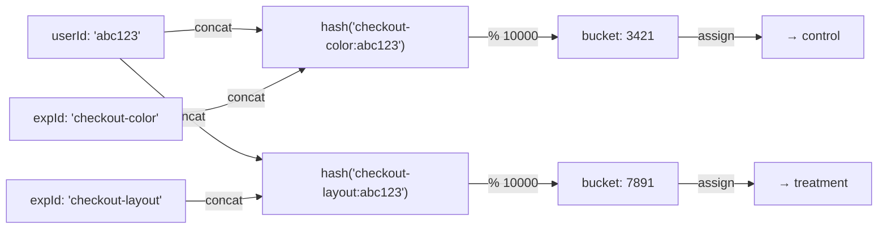

# Assignment Algorithms

## Requirements for a Good Assignment Algorithm

An A/B test assignment algorithm must satisfy:

1. **Deterministic** — same userId + experimentId always → same variant
2. **Uniform** — users are evenly distributed across buckets
3. **Independent** — assignment in experiment A has no correlation with experiment B
4. **Stateless** — no database lookup needed for assignment (pure computation)
5. **Fast** — < 0.1ms per evaluation

## Why Not Random?

The naive approach — randomly pick a variant and store the assignment — fails requirements 3 and 4. Every assignment needs a database write and lookup. At 100K users/day across 50 experiments, that's 5M database writes/day just for assignments.

Deterministic hashing eliminates storage. The hash is the assignment.

## MurmurHash: The Right Hash for Bucketing

### Why Not SHA-256 or MD5?

Cryptographic hashes (SHA-256, MD5) are designed for collision resistance and tamper detection. For bucketing, we need:
- **Speed** — SHA-256 is 10–100x slower than MurmurHash
- **Uniform distribution** — all hash functions provide this, but MurmurHash is provably uniform
- **Non-cryptographic** — we don't need security properties

### MurmurHash3 Properties

MurmurHash3 (finalized 2011, by Austin Appleby):
- Speed: ~2 GB/s throughput (vs ~250 MB/s for SHA-256)
- Produces 32-bit or 128-bit output
- Excellent avalanche effect — single-bit input change randomizes output
- Not suitable for cryptographic use (not our use case)

```typescript
// src/assignment/murmur.ts
// Pure TypeScript implementation of MurmurHash3 32-bit

function murmur3_32(str: string, seed = 0): number {
  let h = seed;
  const len = str.length;
  let i = 0;

  // Process 4 bytes at a time
  while (i <= len - 4) {
    let k =
      ((str.charCodeAt(i) & 0xff)) |
      ((str.charCodeAt(i + 1) & 0xff) << 8) |
      ((str.charCodeAt(i + 2) & 0xff) << 16) |
      ((str.charCodeAt(i + 3) & 0xff) << 24);

    k = Math.imul(k, 0xcc9e2d51);
    k = (k << 15) | (k >>> 17);
    k = Math.imul(k, 0x1b873593);

    h ^= k;
    h = (h << 13) | (h >>> 19);
    h = Math.imul(h, 5) + 0xe6546b64;

    i += 4;
  }

  // Handle remaining bytes
  let k = 0;
  switch (len & 3) {
    case 3: k ^= (str.charCodeAt(i + 2) & 0xff) << 16;
    // falls through
    case 2: k ^= (str.charCodeAt(i + 1) & 0xff) << 8;
    // falls through
    case 1:
      k ^= str.charCodeAt(i) & 0xff;
      k = Math.imul(k, 0xcc9e2d51);
      k = (k << 15) | (k >>> 17);
      k = Math.imul(k, 0x1b873593);
      h ^= k;
  }

  // Finalization
  h ^= len;
  h ^= h >>> 16;
  h = Math.imul(h, 0x85ebca6b);
  h ^= h >>> 13;
  h = Math.imul(h, 0xc2b2ae35);
  h ^= h >>> 16;

  return h >>> 0; // Convert to unsigned 32-bit
}

// Usage
const hash = murmur3_32('exp-checkout:user-12345');
const bucket = hash % 10000;  // 0–9999
```

### Distribution Verification

A critical property: the hash must produce a uniform distribution across buckets. Verify empirically:

```typescript
// Verify uniformity with chi-squared test
function verifyDistribution(
  numBuckets: number,
  numSamples = 100_000
): { chiSquared: number; pValue: number; isUniform: boolean } {
  const counts = new Array(numBuckets).fill(0);

  for (let i = 0; i < numSamples; i++) {
    const userId = `user-${i}`;
    const hash = murmur3_32(`exp-test:${userId}`);
    const bucket = hash % numBuckets;
    counts[bucket]++;
  }

  const expected = numSamples / numBuckets;
  const chiSquared = counts.reduce(
    (sum, count) => sum + Math.pow(count - expected, 2) / expected,
    0
  );

  // Chi-squared critical value for p=0.05 with (numBuckets-1) degrees of freedom
  // Approximate: df + 2*sqrt(df) as upper bound
  const df = numBuckets - 1;
  const criticalValue = df + 2 * Math.sqrt(df) * 1.96; // Rough approximation

  return {
    chiSquared,
    pValue: 1 - chiSquaredCDF(chiSquared, df),
    isUniform: chiSquared < criticalValue,
  };
}
```

## Bucketing Algorithm

### Basic Bucketing

```typescript
// src/assignment/bucketing.ts

export interface BucketingConfig {
  buckets: number;   // Total number of buckets (typically 10000)
  salt?: string;     // Additional salt for namespace isolation
}

export function getBucket(
  userId: string,
  experimentId: string,
  config: BucketingConfig = { buckets: 10000 }
): number {
  const salt = config.salt ?? '';
  const hashInput = `${salt}${experimentId}:${userId}`;
  const hash = murmur3_32(hashInput);
  return hash % config.buckets;
}

export function getVariant(
  bucket: number,
  variants: Array<{ id: string; weight: number }>  // weights sum to 1.0
): string {
  let cumulative = 0;

  for (const variant of variants) {
    cumulative += variant.weight;
    if (bucket / 10000 < cumulative) {
      return variant.id;
    }
  }

  // Fallback — shouldn't happen with valid weights
  return variants[variants.length - 1].id;
}

// Combined: get variant for user in experiment
export function assignVariant(
  userId: string,
  experimentId: string,
  variants: Array<{ id: string; weight: number }>
): string {
  const bucket = getBucket(userId, experimentId);
  return getVariant(bucket, variants);
}
```

### Weighted Assignment Verification

```typescript
// Verify variant assignment matches expected weights
function verifyWeights(
  experimentId: string,
  variants: Array<{ id: string; weight: number }>,
  numSamples = 100_000
): Record<string, number> {
  const counts: Record<string, number> = {};

  for (const variant of variants) {
    counts[variant.id] = 0;
  }

  for (let i = 0; i < numSamples; i++) {
    const userId = `user-${i}`;
    const variant = assignVariant(userId, experimentId, variants);
    counts[variant]++;
  }

  const percentages: Record<string, number> = {};
  for (const [id, count] of Object.entries(counts)) {
    percentages[id] = count / numSamples;
  }

  return percentages;
}

// Example:
const result = verifyWeights('checkout-test', [
  { id: 'control', weight: 0.5 },
  { id: 'treatment-a', weight: 0.3 },
  { id: 'treatment-b', weight: 0.2 },
]);
// Expected: { control: ~0.50, 'treatment-a': ~0.30, 'treatment-b': ~0.20 }
// Actual:   { control: 0.4998, 'treatment-a': 0.3001, 'treatment-b': 0.2001 }
```

## Namespace Isolation

Different experiments use the same userId but must produce independent assignments. Naively using `hash(userId) % 100` for both experiment A and B would assign the same users to the same percentages — introducing correlation.

The solution: include the experiment ID in the hash input, creating a unique "namespace" per experiment.



Because the hash inputs are different, the buckets are independent. The probability that bucket assignments are correlated is negligible.

### Verifying Independence

```typescript
// Test: are assignments in two experiments independent?
function testAssignmentIndependence(
  exp1Id: string,
  exp2Id: string,
  variants: Array<{ id: string; weight: number }>,
  numSamples = 100_000
): { correlation: number; isIndependent: boolean } {
  const assignments1: number[] = [];
  const assignments2: number[] = [];

  for (let i = 0; i < numSamples; i++) {
    const userId = `user-${i}`;
    const bucket1 = getBucket(userId, exp1Id);
    const bucket2 = getBucket(userId, exp2Id);
    assignments1.push(bucket1);
    assignments2.push(bucket2);
  }

  // Compute Pearson correlation
  const mean1 = assignments1.reduce((s, v) => s + v, 0) / numSamples;
  const mean2 = assignments2.reduce((s, v) => s + v, 0) / numSamples;

  let cov = 0;
  let var1 = 0;
  let var2 = 0;

  for (let i = 0; i < numSamples; i++) {
    const d1 = assignments1[i] - mean1;
    const d2 = assignments2[i] - mean2;
    cov += d1 * d2;
    var1 += d1 * d1;
    var2 += d2 * d2;
  }

  const correlation = cov / Math.sqrt(var1 * var2);

  // |r| < 0.01 considered independent for practical purposes
  return { correlation, isIndependent: Math.abs(correlation) < 0.01 };
}
```

## Sticky Assignment

The hash provides deterministic assignment, but what if experiment configuration changes (e.g., weights shift from 50/50 to 70/30)? Users' buckets are stable, but their variant changes because the bucket-to-variant mapping changed.

**Problem:** User was seeing "treatment-a" (bucket 4999), now sees "control" (new 70/30 split puts 4999 into control zone). Their behavior before and after the config change can't be compared.

**Solution 1: Sticky assignment with Redis cache**

Store the assignment in Redis keyed by `experimentId:userId:configVersion`. Config changes create new keys, but existing users keep their old assignments.

```typescript
// src/assignment/sticky-assignment.ts
import Redis from 'ioredis';

export class StickyAssignmentStore {
  constructor(private redis: Redis) {}

  async getOrAssign(
    experimentId: string,
    userId: string,
    configVersion: string,
    computeAssignment: () => string
  ): Promise<{ variant: string; isNew: boolean }> {
    // Version-aware key: changing config doesn't affect existing assignments
    const key = `assignment:${experimentId}:v${configVersion}:${userId}`;
    const cached = await this.redis.get(key);

    if (cached) {
      return { variant: cached, isNew: false };
    }

    const variant = computeAssignment();

    // Store with 90-day TTL (experiment max duration)
    await this.redis.setex(key, 90 * 86400, variant);

    return { variant, isNew: true };
  }

  async overrideAssignment(
    experimentId: string,
    userId: string,
    configVersion: string,
    variant: string
  ): Promise<void> {
    const key = `assignment:${experimentId}:v${configVersion}:${userId}`;
    await this.redis.setex(key, 90 * 86400, variant);
  }
}
```

**Solution 2: Freeze assignments on experiment start**

Simpler: once an experiment starts, never change its weights. If you want a different split, create a new experiment.

This is the approach used by most mature experimentation platforms. It avoids all sticky-assignment complexity.

## Traffic Splitting for Multi-Arm Experiments

### Equal Traffic Split

For 50/50 two-armed tests: straightforward.

### Unequal Splits

For 90/10 tests (ship treatment to most users early, keep small control):

```typescript
// 90/10 split: treatment gets buckets 0–8999, control gets 9000–9999
const variants90_10 = [
  { id: 'treatment', weight: 0.90 },
  { id: 'control', weight: 0.10 },
];

// Verify by counting assignments
const counts = { treatment: 0, control: 0 };
for (let i = 0; i < 100_000; i++) {
  const v = assignVariant(`user-${i}`, 'exp-90-10', variants90_10);
  counts[v as keyof typeof counts]++;
}
// counts: { treatment: ~90000, control: ~10000 }
```

### Multi-Armed Bandit Integration

For adaptive allocation (not pure A/B), update variant weights based on observed performance:

```typescript
// src/assignment/bandit.ts

interface ArmState {
  variantId: string;
  successes: number;
  trials: number;
}

// Thompson Sampling for multi-armed bandit
export function thompsonSampling(arms: ArmState[]): string {
  // Sample from Beta distribution for each arm
  const samples = arms.map((arm) => ({
    variantId: arm.variantId,
    sample: sampleBeta(arm.successes + 1, arm.trials - arm.successes + 1),
  }));

  // Select arm with highest sample
  const winner = samples.reduce((best, current) =>
    current.sample > best.sample ? current : best
  );

  return winner.variantId;
}

// Approximate Beta distribution sampling using Normal approximation
function sampleBeta(alpha: number, beta: number): number {
  // Use Gamma distribution: Beta(a,b) = Gamma(a) / (Gamma(a) + Gamma(b))
  const x = sampleGamma(alpha);
  const y = sampleGamma(beta);
  return x / (x + y);
}

function sampleGamma(shape: number): number {
  // Marsaglia-Tsang method (simplified)
  const d = shape - 1 / 3;
  const c = 1 / Math.sqrt(9 * d);
  while (true) {
    const x = randomNormal();
    const v = Math.pow(1 + c * x, 3);
    if (v > 0 && Math.log(Math.random()) < 0.5 * x * x + d - d * v + d * Math.log(v)) {
      return d * v;
    }
  }
}

function randomNormal(): number {
  // Box-Muller transform
  const u1 = Math.random();
  const u2 = Math.random();
  return Math.sqrt(-2 * Math.log(u1)) * Math.cos(2 * Math.PI * u2);
}
```

::: warning
Multi-armed bandits are not A/B tests. They optimize for reward, not statistical inference. Use bandits when you care more about minimizing regret than making a confident conclusion. Use A/B tests when you need a clean causal estimate of the treatment effect.
:::

## Mathematical Foundations

### Avalanche Effect Property

A good hash function should have the **strict avalanche criterion**: flipping any single input bit should flip each output bit with probability 0.5.

MurmurHash3's finalization step ensures this:

```
h ^= h >>> 16;          // Mix high bits into low bits
h *= 0x85ebca6b;        // Non-linear mixing
h ^= h >>> 13;          // Mix again
h *= 0xc2b2ae35;        // Another non-linear step
h ^= h >>> 16;          // Final mix
```

This creates the avalanche effect that makes MurmurHash suitable for bucketing.

### Assignment Uniformity Proof

For $N$ users distributed across $K$ buckets using a uniform hash:

$$P(\text{bucket} = k) = \frac{1}{K} \text{ for all } k \in \{0, \ldots, K-1\}$$

Expected users per bucket: $\mu = N/K$

Standard deviation: $\sigma = \sqrt{N/K \cdot (1 - 1/K)} \approx \sqrt{N/K}$

Coefficient of variation: $\sigma/\mu = 1/\sqrt{N}$

For $N = 10,000$ users and $K = 100$ buckets:
$$\sigma/\mu = 1/\sqrt{10000} = 0.01 = 1\%$$

Each bucket has approximately $100 \pm 10$ users (within 1% of expectation). This is excellent uniformity.

### Namespace Independence

For two experiments $A$ and $B$, the joint probability of assigning user $u$ to variant $i$ in $A$ and variant $j$ in $B$ should equal:

$$P(A=i, B=j) = P(A=i) \cdot P(B=j)$$

Since the hash function maps `expA:userId` and `expB:userId` to independent buckets (by the avalanche property), this independence holds approximately. The approximation error decreases with hash quality and is negligible for MurmurHash3.

::: info War Story
**The Correlated Assignment Bug**

A team used MD5 hashing but concatenated fields in the wrong order: `hash(userId + experimentId)`. Two experiments with IDs "exp-1" and "exp-2" had very similar hash inputs for the same user (only the last character differed).

Result: users in the treatment group of experiment A were systematically more likely to also be in the treatment group of experiment B. The correlation coefficient was ~0.12 (much higher than the ~0.001 expected from a good hash).

This inflated the treatment effect estimates for both experiments. The "positive" results from both were partially artifacts of this correlation.

The fix: use `hash(experimentId + ":" + userId)` — put the variable field (experimentId) first, and use a delimiter. With different experiment IDs as the prefix, the hash inputs diverge early and produce independent outputs.
:::
