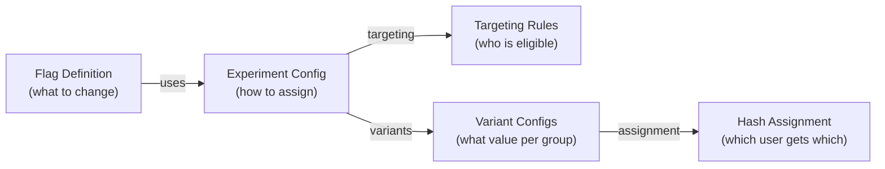
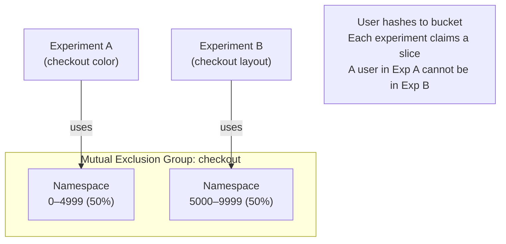
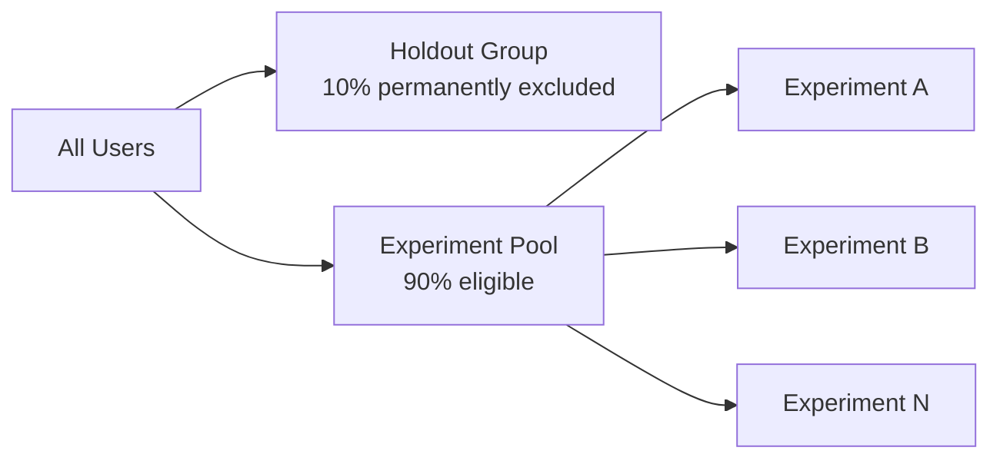
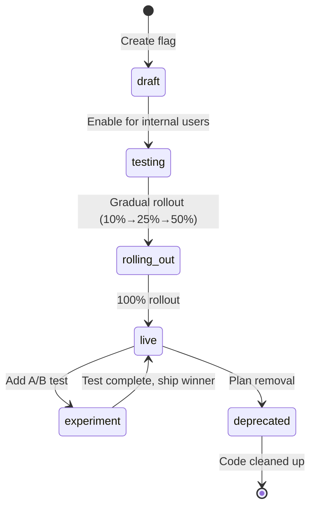

# Feature Flag Integration

## Feature Flags vs A/B Tests

Feature flags and A/B tests are complementary but distinct:

| Aspect | Feature Flag | A/B Test |
|--------|-------------|---------|
| Purpose | Control feature availability | Measure impact of a change |
| Assignment | Manual/targeted | Randomized |
| Duration | Indefinite | Fixed (until significance) |
| Metrics | Operational (errors, latency) | Product (conversion, revenue) |
| Rollback | Instant kill switch | Requires stopping experiment |

Modern experimentation platforms unify these — feature flags become the delivery mechanism for A/B test variants.

## Unified Flag/Experiment Model



```typescript
// src/flags/types.ts

interface FeatureFlag {
  key: string;             // "new-checkout-flow"
  type: 'boolean' | 'string' | 'number' | 'json';
  defaultValue: unknown;   // Value when no rule matches

  // Ordered list of rules (first match wins)
  rules: FlagRule[];

  // Optional experiment attachment
  experiment?: {
    id: string;
    metrics: string[];
    startDate: string;
    endDate?: string;
  };
}

interface FlagRule {
  id: string;
  enabled: boolean;
  priority: number;        // Lower = evaluated first

  // Targeting conditions (all must match)
  conditions: FlagCondition[];

  // How to serve to matching users
  serve: FlagServe;
}

interface FlagCondition {
  attribute: string;       // "country", "accountTier", "deviceType"
  operator: 'is' | 'isNot' | 'contains' | 'startsWith' | 'greaterThan' | 'lessThan';
  values: unknown[];
}

interface FlagServe {
  type: 'variant' | 'rollout' | 'percentage';
  // For variant: each variant gets a percentage of traffic
  variants?: Array<{
    value: unknown;
    weight: number;   // 0–100
  }>;
  // For percentage rollout
  percentage?: number;
}
```

### Flag Evaluation Engine

```typescript
// src/flags/flag-engine.ts
import murmurhash from 'murmurhash';

export class FlagEngine {
  evaluate(
    flag: FeatureFlag,
    userId: string,
    userAttributes: Record<string, unknown>
  ): { value: unknown; ruleId?: string; variantId?: string } {
    // Evaluate rules in priority order
    for (const rule of flag.rules.sort((a, b) => a.priority - b.priority)) {
      if (!rule.enabled) continue;

      // Check all conditions
      const matches = rule.conditions.every((condition) =>
        this.evaluateCondition(condition, userAttributes)
      );

      if (!matches) continue;

      // Rule matches — determine value
      const result = this.serveValue(rule.serve, userId, flag.key);
      if (result !== null) {
        return { ...result, ruleId: rule.id };
      }
    }

    // No rule matched — return default
    return { value: flag.defaultValue };
  }

  private evaluateCondition(
    condition: FlagCondition,
    attributes: Record<string, unknown>
  ): boolean {
    const attrValue = attributes[condition.attribute];

    switch (condition.operator) {
      case 'is':
        return condition.values.includes(attrValue);
      case 'isNot':
        return !condition.values.includes(attrValue);
      case 'contains':
        return typeof attrValue === 'string' &&
          condition.values.some(
            (v) => typeof v === 'string' && attrValue.includes(v)
          );
      case 'startsWith':
        return typeof attrValue === 'string' &&
          condition.values.some(
            (v) => typeof v === 'string' && attrValue.startsWith(v)
          );
      case 'greaterThan':
        return typeof attrValue === 'number' &&
          condition.values.some(
            (v) => typeof v === 'number' && attrValue > v
          );
      case 'lessThan':
        return typeof attrValue === 'number' &&
          condition.values.some(
            (v) => typeof v === 'number' && attrValue < v
          );
      default:
        return false;
    }
  }

  private serveValue(
    serve: FlagServe,
    userId: string,
    flagKey: string
  ): { value: unknown; variantId?: string } | null {
    if (serve.type === 'variant' && serve.variants) {
      const hash = murmurhash.v3(`${flagKey}:${userId}`);
      const bucket = hash % 10000;

      let cumulative = 0;
      for (const variant of serve.variants) {
        cumulative += variant.weight * 100; // 100 basis points per %
        if (bucket < cumulative) {
          return {
            value: variant.value,
            variantId: String(variant.value),
          };
        }
      }
    }

    if (serve.type === 'percentage' && serve.percentage !== undefined) {
      const hash = murmurhash.v3(`${flagKey}:${userId}`);
      const bucket = hash % 100;
      if (bucket < serve.percentage) {
        return { value: true };
      }
      return { value: false };
    }

    return null;
  }
}
```

## Targeting Rules

### Targeting Design Principles

1. **User attributes** — properties of the user (subscription tier, country, device)
2. **Behavioral attributes** — properties derived from past behavior (power user, churned)
3. **Context attributes** — properties of the current session (URL, referrer)
4. **Custom attributes** — any business-specific property

```typescript
// src/flags/targeting-attributes.ts

// Standard attributes available in all evaluations
interface StandardUserAttributes {
  userId: string;
  accountCreatedAt?: string;          // ISO date
  subscriptionTier?: 'free' | 'pro' | 'enterprise';
  country?: string;                    // ISO 3166-1 alpha-2
  language?: string;                   // BCP 47
  deviceType?: 'desktop' | 'mobile' | 'tablet';
  platform?: 'web' | 'ios' | 'android';
  betaTester?: boolean;
  internalUser?: boolean;
}

// Behavioral attributes (computed from analytics data)
interface BehavioralAttributes {
  daysSinceLastLogin?: number;
  totalPurchases?: number;
  lifetimeValue?: number;
  isActiveLast30Days?: boolean;
  cohort?: string;                     // e.g., "2024-Q1"
}

type UserContext = StandardUserAttributes & BehavioralAttributes & Record<string, unknown>;
```

### Targeting Examples

**Internal-only flag (for dogfooding):**
```json
{
  "key": "new-admin-dashboard",
  "rules": [
    {
      "conditions": [
        { "attribute": "internalUser", "operator": "is", "values": [true] }
      ],
      "serve": { "type": "percentage", "percentage": 100 }
    }
  ],
  "defaultValue": false
}
```

**Country-specific rollout:**
```json
{
  "key": "new-payment-method-sepa",
  "rules": [
    {
      "conditions": [
        { "attribute": "country", "operator": "is", "values": ["DE", "FR", "NL", "BE", "AT"] }
      ],
      "serve": { "type": "percentage", "percentage": 20 }
    }
  ],
  "defaultValue": false
}
```

**Tiered A/B test (enterprise users get different variant):**
```json
{
  "key": "checkout-redesign",
  "rules": [
    {
      "priority": 1,
      "conditions": [
        { "attribute": "subscriptionTier", "operator": "is", "values": ["enterprise"] }
      ],
      "serve": {
        "type": "variant",
        "variants": [
          { "value": "control", "weight": 50 },
          { "value": "enterprise-optimized", "weight": 50 }
        ]
      }
    },
    {
      "priority": 2,
      "conditions": [],
      "serve": {
        "type": "variant",
        "variants": [
          { "value": "control", "weight": 50 },
          { "value": "simplified", "weight": 50 }
        ]
      }
    }
  ],
  "defaultValue": "control"
}
```

## Mutual Exclusion Groups

When two experiments modify the same user experience, their effects can confound each other. Mutual exclusion ensures users are assigned to at most one experiment from a group.



### Namespace-Based Mutual Exclusion

```typescript
// src/flags/mutual-exclusion.ts

interface ExclusionGroup {
  id: string;
  name: string;
  experiments: Array<{
    experimentId: string;
    namespace: [number, number];  // Start and end bucket (0–9999)
  }>;
}

export class MutualExclusionManager {
  private groups: Map<string, ExclusionGroup> = new Map();

  registerGroup(group: ExclusionGroup): void {
    // Validate no namespace overlaps
    const namespaces = group.experiments.map((e) => e.namespace);
    for (let i = 0; i < namespaces.length; i++) {
      for (let j = i + 1; j < namespaces.length; j++) {
        const [a_start, a_end] = namespaces[i];
        const [b_start, b_end] = namespaces[j];
        if (a_start <= b_end && b_start <= a_end) {
          throw new Error(
            `Namespace overlap in group ${group.id}: ` +
              `${group.experiments[i].experimentId} and ${group.experiments[j].experimentId}`
          );
        }
      }
    }

    this.groups.set(group.id, group);
  }

  // Returns which experiment in the group a user belongs to
  getExperimentForUser(groupId: string, userId: string): string | null {
    const group = this.groups.get(groupId);
    if (!group) return null;

    // Use group ID + user ID for hash, not experiment ID
    const hash = murmurhash.v3(`${groupId}:${userId}`);
    const bucket = hash % 10000;

    for (const { experimentId, namespace: [start, end] } of group.experiments) {
      if (bucket >= start && bucket <= end) {
        return experimentId;
      }
    }

    return null;  // User is in the group's "holdout" (unassigned) namespace
  }
}
```

### Namespace Allocation Strategy

```typescript
// Allocate 100% of a group's namespace to experiments
const checkoutGroup: ExclusionGroup = {
  id: 'checkout-experiments',
  name: 'Checkout Flow Experiments',
  experiments: [
    {
      experimentId: 'checkout-color-test',
      namespace: [0, 2499],      // 25% of users
    },
    {
      experimentId: 'checkout-layout-test',
      namespace: [2500, 4999],   // 25% of users
    },
    // 5000–9999 (50%) unallocated — available for future experiments
    // or as a "holdout group"
  ],
};
```

## Holdout Groups

A holdout group is a percentage of users permanently excluded from all new features. They serve as a long-term control to measure cumulative impact of all experiments.



```typescript
// src/flags/holdout-manager.ts

export class HoldoutManager {
  constructor(
    private holdoutPercentage: number = 0.10,  // 10% holdout
    private holdoutKey = 'global-holdout'
  ) {}

  isInHoldout(userId: string): boolean {
    const hash = murmurhash.v3(`${this.holdoutKey}:${userId}`);
    const bucket = hash % 10000;
    return bucket < this.holdoutPercentage * 10000;
  }

  // Use in assignment service to exclude holdout users from all experiments
  checkAndExclude(userId: string): { excluded: boolean; reason?: string } {
    if (this.isInHoldout(userId)) {
      return {
        excluded: true,
        reason: 'holdout-group',
      };
    }
    return { excluded: false };
  }
}

// Integration in assignment service
class AssignmentServiceWithHoldout extends AssignmentService {
  private holdout = new HoldoutManager(0.10);

  async getVariant(experimentId: string, userId: string, context: UserContext) {
    const holdoutCheck = this.holdout.checkAndExclude(userId);
    if (holdoutCheck.excluded) {
      return {
        variant: 'control',  // Always see control
        experimentId,
        userId,
        reason: 'holdout',
        inHoldout: true,
      };
    }

    return super.getVariant(experimentId, userId, context);
  }
}
```

### Analyzing Holdout Group Impact

The holdout group enables computing the cumulative lift from all experiments:

```sql
-- Compare holdout vs non-holdout users over 90 days
WITH holdout_users AS (
  SELECT user_id
  FROM analytics.experiment_exposures
  WHERE variant_id = 'holdout'
    AND experiment_id = 'global-holdout'
),
non_holdout AS (
  SELECT user_id
  FROM analytics.user_activity
  WHERE user_id NOT IN (SELECT user_id FROM holdout_users)
)
SELECT
  CASE WHEN h.user_id IS NOT NULL THEN 'holdout' ELSE 'non-holdout' END AS group,
  COUNT(DISTINCT a.user_id) AS users,
  SUM(a.revenue) / COUNT(DISTINCT a.user_id) AS revenue_per_user,
  COUNT(DISTINCT CASE WHEN a.converted THEN a.user_id END) / COUNT(DISTINCT a.user_id) AS conversion_rate
FROM analytics.user_activity a
LEFT JOIN holdout_users h ON a.user_id = h.user_id
GROUP BY 1;
```

## Flag Lifecycle Management



```typescript
// src/flags/lifecycle.ts

type FlagStatus = 'draft' | 'testing' | 'rolling_out' | 'live' | 'experiment' | 'deprecated';

interface FlagLifecycleTransition {
  from: FlagStatus;
  to: FlagStatus;
  requiredApprovals: number;
  notifyChannels: string[];
  automationRules?: string[];
}

const LIFECYCLE_TRANSITIONS: FlagLifecycleTransition[] = [
  {
    from: 'draft',
    to: 'testing',
    requiredApprovals: 0,    // Self-service for internal testing
    notifyChannels: [],
  },
  {
    from: 'testing',
    to: 'rolling_out',
    requiredApprovals: 1,    // One engineering approval
    notifyChannels: ['#eng-deploys'],
  },
  {
    from: 'rolling_out',
    to: 'live',
    requiredApprovals: 2,    // Engineering + product approval
    notifyChannels: ['#eng-deploys', '#product-releases'],
  },
  {
    from: 'live',
    to: 'deprecated',
    requiredApprovals: 1,
    notifyChannels: ['#eng-tech-debt'],
    automationRules: ['create-cleanup-ticket', 'schedule-removal-reminder'],
  },
];
```

### Flag Cleanup Automation

Stale feature flags are a maintenance burden and code quality issue. Track flag age:

```typescript
// src/flags/staleness-detector.ts

export async function detectStaleFlags(
  flags: FeatureFlag[]
): Promise<Array<{ flag: FeatureFlag; daysOld: number; recommendation: string }>> {
  const stale = [];

  for (const flag of flags) {
    // Check if flag is fully rolled out (100% always-on)
    const isFullyRolledOut = isAlwaysOn(flag);
    const createdDate = new Date(flag.createdAt);
    const daysOld = (Date.now() - createdDate.getTime()) / 86400000;

    if (isFullyRolledOut && daysOld > 30) {
      stale.push({
        flag,
        daysOld: Math.floor(daysOld),
        recommendation: 'Remove flag — feature is fully deployed',
      });
    } else if (flag.status === 'deprecated' && daysOld > 14) {
      stale.push({
        flag,
        daysOld: Math.floor(daysOld),
        recommendation: 'Code cleanup overdue — deprecated 14+ days ago',
      });
    }
  }

  return stale;
}

function isAlwaysOn(flag: FeatureFlag): boolean {
  return (
    flag.rules.length === 1 &&
    flag.rules[0].conditions.length === 0 &&
    flag.rules[0].serve.type === 'percentage' &&
    flag.rules[0].serve.percentage === 100
  );
}
```

::: info War Story
**500 Feature Flags, 3 Engineers Who Understood Them**

A team had been running experiments for 3 years without a cleanup policy. They accumulated 500 feature flags, of which ~350 were permanently enabled but never removed from code.

The flags weren't just technical debt — they were active risk. Engineers were afraid to delete flags because they didn't know which dependencies existed. One flag controlled a behavior that 3 other flags depended on, but this wasn't documented anywhere.

The fix was a two-part program: (1) a staleness detector that automatically filed GitHub issues for flags older than 30 days at 100% rollout, and (2) a "flag registry" that required documenting dependencies when creating a flag. Over 6 months, they cleaned up 280 flags, reducing the cognitive overhead significantly.
:::

## Performance: Edge Cases in Flag Evaluation

### Targeting Rule Order Sensitivity

Rules are evaluated in priority order. A misconfigured priority can cause unexpected behavior:

```typescript
// BUG: These rules are in wrong priority order
const flagWithBug: FeatureFlag = {
  key: 'premium-feature',
  rules: [
    {
      priority: 2,  // This should be priority 1 (evaluated first)
      conditions: [
        { attribute: 'subscriptionTier', operator: 'is', values: ['enterprise'] }
      ],
      serve: { type: 'percentage', percentage: 100 },
    },
    {
      priority: 1,  // This catches all users before enterprise rule
      conditions: [],  // No conditions = matches everyone
      serve: { type: 'percentage', percentage: 0 },  // 0% = always disabled
    },
  ],
  defaultValue: false,
};
// Result: enterprise users see false (wrong!) because the catch-all rule fires first
```

Always validate that catch-all rules (empty conditions) have the lowest priority.

### Flag Evaluation Caching

For high-traffic applications, cache flag evaluations:

```typescript
// Cache per user per flag for 60 seconds
const cache = new Map<string, { value: unknown; expiresAt: number }>();

function cachedEvaluate(
  engine: FlagEngine,
  flag: FeatureFlag,
  userId: string,
  attributes: Record<string, unknown>
): unknown {
  const key = `${flag.key}:${userId}`;
  const cached = cache.get(key);

  if (cached && cached.expiresAt > Date.now()) {
    return cached.value;
  }

  const result = engine.evaluate(flag, userId, attributes);
  cache.set(key, {
    value: result.value,
    expiresAt: Date.now() + 60_000,
  });

  return result.value;
}
```

Flush cache entries when flag config changes:

```typescript
function invalidateFlagCache(flagKey: string): void {
  for (const key of cache.keys()) {
    if (key.startsWith(`${flagKey}:`)) {
      cache.delete(key);
    }
  }
}
```
