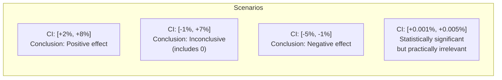
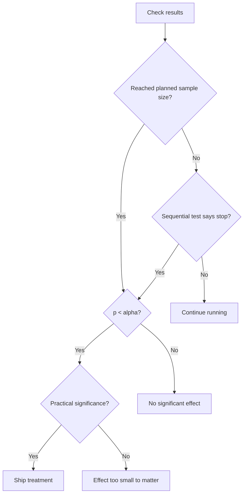

# Statistical Significance in A/B Testing

## The Problem with "Gut Feel" Analysis

Without statistical rigor, A/B test analysis is unreliable:

- **False positives** — concluding an effect exists when it doesn't (5% chance at $\alpha = 0.05$, but much higher if you peek)
- **False negatives** — missing real effects because the test was underpowered
- **Incorrect magnitude** — estimating the effect size incorrectly, leading to wrong projections

A team running 10 simultaneous tests, peeking daily, has roughly 65% chance of declaring at least one false positive winner.

## Hypothesis Testing Framework

### The Setup

Every A/B test is a hypothesis test:

- **Null hypothesis** $H_0$: Treatment has no effect (conversion rates are equal)
- **Alternative hypothesis** $H_1$: Treatment has an effect (rates differ)

The statistical test asks: "If $H_0$ were true, how likely is it that we'd observe data this extreme?"

$$p\text{-value} = P(\text{data this extreme} | H_0 \text{ is true})$$

If $p < \alpha$ (significance level, typically 0.05), we reject $H_0$.

::: warning
The p-value is **not** the probability that the null hypothesis is true, nor the probability that the treatment has no effect. It's the probability of observing this data if the null hypothesis were true.
:::

### Two-Proportion Z-Test

For conversion rate experiments (binary outcomes):

$$z = \frac{\hat{p}_t - \hat{p}_c}{\sqrt{\hat{p}(1-\hat{p})\left(\frac{1}{n_t} + \frac{1}{n_c}\right)}}$$

where:
- $\hat{p}_t$ = treatment conversion rate
- $\hat{p}_c$ = control conversion rate
- $\hat{p} = \frac{n_t \hat{p}_t + n_c \hat{p}_c}{n_t + n_c}$ = pooled rate
- $n_t, n_c$ = sample sizes

The p-value is:

$$p = 2 \cdot (1 - \Phi(|z|))$$

where $\Phi$ is the standard normal CDF.

```typescript
// src/statistics/hypothesis-test.ts

interface TwoProportionTestResult {
  zScore: number;
  pValue: number;
  isSignificant: boolean;
  relativeChange: number;
  absoluteChange: number;
  confidenceInterval95: [number, number];
}

export function twoProportionZTest(
  controlConversions: number,
  controlUsers: number,
  treatmentConversions: number,
  treatmentUsers: number,
  alpha = 0.05
): TwoProportionTestResult {
  const p_c = controlConversions / controlUsers;
  const p_t = treatmentConversions / treatmentUsers;

  const p_pooled =
    (controlConversions + treatmentConversions) / (controlUsers + treatmentUsers);

  const se = Math.sqrt(
    p_pooled * (1 - p_pooled) * (1 / controlUsers + 1 / treatmentUsers)
  );

  if (se === 0) {
    return {
      zScore: 0, pValue: 1, isSignificant: false,
      relativeChange: 0, absoluteChange: 0,
      confidenceInterval95: [p_t, p_t],
    };
  }

  const z = (p_t - p_c) / se;
  const pValue = 2 * (1 - normalCDF(Math.abs(z)));

  // 95% CI on the difference
  const se_diff = Math.sqrt(
    p_c * (1 - p_c) / controlUsers + p_t * (1 - p_t) / treatmentUsers
  );
  const diff = p_t - p_c;
  const ci: [number, number] = [diff - 1.96 * se_diff, diff + 1.96 * se_diff];

  return {
    zScore: z,
    pValue,
    isSignificant: pValue < alpha,
    relativeChange: (p_t - p_c) / p_c,
    absoluteChange: p_t - p_c,
    confidenceInterval95: ci,
  };
}
```

### T-Test for Continuous Metrics

For metrics like revenue per user, session duration:

$$t = \frac{\bar{X}_t - \bar{X}_c}{\sqrt{\frac{s_t^2}{n_t} + \frac{s_c^2}{n_c}}}$$

This is Welch's t-test — doesn't assume equal variances.

```typescript
export function welchTTest(
  treatmentMean: number,
  treatmentVariance: number,
  treatmentN: number,
  controlMean: number,
  controlVariance: number,
  controlN: number
): { tStat: number; degreesOfFreedom: number; pValue: number } {
  const se = Math.sqrt(treatmentVariance / treatmentN + controlVariance / controlN);
  const t = (treatmentMean - controlMean) / se;

  // Welch-Satterthwaite degrees of freedom
  const df =
    Math.pow(treatmentVariance / treatmentN + controlVariance / controlN, 2) /
    (Math.pow(treatmentVariance / treatmentN, 2) / (treatmentN - 1) +
      Math.pow(controlVariance / controlN, 2) / (controlN - 1));

  const pValue = 2 * (1 - tDistCDF(Math.abs(t), df));

  return { tStat: t, degreesOfFreedom: df, pValue };
}
```

## Confidence Intervals

A 95% confidence interval means: if we ran this experiment 100 times, approximately 95 of the resulting intervals would contain the true effect.

It does **not** mean there's a 95% probability the true effect is in this interval (a common misinterpretation).

### Interpreting CI vs p-value



Always report both the CI and practical significance. A statistically significant effect of 0.01% conversion lift is rarely worth shipping.

## Power Analysis

**Statistical power** = probability of detecting a real effect when it exists.

$$\text{Power} = 1 - \beta$$

where $\beta$ is the Type II error rate (false negative rate).

Typical targets: power = 0.80 (80%), $\alpha$ = 0.05.

### Minimum Sample Size Calculation

For a two-proportion z-test with equal sample sizes:

$$n = \frac{(z_{\alpha/2} + z_\beta)^2 \cdot (p_c(1-p_c) + p_t(1-p_t))}{(p_t - p_c)^2}$$

where:
- $z_{\alpha/2} = 1.96$ for $\alpha = 0.05$ (two-tailed)
- $z_\beta = 0.84$ for power = 0.80

```typescript
// src/statistics/power-analysis.ts

interface PowerAnalysisResult {
  requiredSampleSizePerVariant: number;
  estimatedDurationDays: number;
  detectedEffect: number;
  power: number;
  alpha: number;
}

export function calculateRequiredSampleSize(params: {
  baselineConversionRate: number;    // Current conversion rate (0–1)
  minimumDetectableEffect: number;   // Relative change to detect (e.g., 0.05 for 5%)
  alpha?: number;                    // Significance level (default 0.05)
  power?: number;                    // Statistical power (default 0.80)
  numVariants?: number;              // Including control (default 2)
  dailyUsers?: number;               // For estimating duration
}): PowerAnalysisResult {
  const {
    baselineConversionRate: p_c,
    minimumDetectableEffect: mde,
    alpha = 0.05,
    power = 0.80,
    numVariants = 2,
    dailyUsers,
  } = params;

  const p_t = p_c * (1 + mde);

  // z-scores for alpha and power
  const z_alpha = normalInv(1 - alpha / 2);  // 1.96 for alpha=0.05
  const z_beta = normalInv(power);            // 0.84 for power=0.80

  const n =
    Math.pow(z_alpha + z_beta, 2) *
    (p_c * (1 - p_c) + p_t * (1 - p_t)) /
    Math.pow(p_t - p_c, 2);

  const n_rounded = Math.ceil(n);

  // With multiple variants, all need n users
  const totalUsersNeeded = n_rounded * numVariants;

  const durationDays = dailyUsers
    ? Math.ceil(totalUsersNeeded / dailyUsers)
    : 0;

  return {
    requiredSampleSizePerVariant: n_rounded,
    estimatedDurationDays: durationDays,
    detectedEffect: mde,
    power,
    alpha,
  };
}

// Example usage
const analysis = calculateRequiredSampleSize({
  baselineConversionRate: 0.03,   // 3% baseline conversion
  minimumDetectableEffect: 0.10,  // Detect 10% relative improvement (3% → 3.3%)
  alpha: 0.05,
  power: 0.80,
  numVariants: 2,
  dailyUsers: 5000,
});

console.log(analysis);
// {
//   requiredSampleSizePerVariant: 13,576,
//   estimatedDurationDays: 6,
//   detectedEffect: 0.10,
//   power: 0.80,
//   alpha: 0.05,
// }
```

### MDE vs Duration Trade-off

$$\text{MDE} = \sqrt{\frac{(z_\alpha + z_\beta)^2 \cdot (p_c(1-p_c) + p_t(1-p_t))}{n}}$$

Given a fixed duration (and thus fixed $n$), the minimum detectable effect grows as $1/\sqrt{n}$. To detect a 5% relative change requires 4× the sample size of detecting a 10% change.

```typescript
// Sample size sensitivity table generator
function generateSensitivityTable(
  baselineRate: number,
  dailyUsers: number
): void {
  const effects = [0.02, 0.05, 0.10, 0.15, 0.20, 0.30];
  const powers = [0.80, 0.90];

  for (const power of powers) {
    console.log(`\nPower = ${power * 100}%`);
    console.log('MDE | Sample/variant | Duration (days)');
    for (const mde of effects) {
      const result = calculateRequiredSampleSize({
        baselineConversionRate: baselineRate,
        minimumDetectableEffect: mde,
        power,
        dailyUsers,
      });
      console.log(
        `${(mde * 100).toFixed(0)}% | ${result.requiredSampleSizePerVariant.toLocaleString()} | ${result.estimatedDurationDays}`
      );
    }
  }
}
```

## Sequential Testing (Optional Stopping)

Traditional tests require a fixed sample size determined upfront. Sequential testing allows valid inference at any time with optional stopping.

### Sequential Probability Ratio Test (SPRT)

The SPRT maintains a likelihood ratio statistic $\Lambda$ that grows when evidence favors $H_1$ and shrinks when evidence favors $H_0$:

$$\Lambda_n = \prod_{i=1}^{n} \frac{f_1(x_i)}{f_0(x_i)}$$

Stop when:
- $\Lambda_n \geq B = \frac{1-\beta}{\alpha}$ → Reject $H_0$ (treatment wins)
- $\Lambda_n \leq A = \frac{\beta}{1-\alpha}$ → Accept $H_0$ (no effect)

```typescript
// src/statistics/sequential-test.ts

interface SPRTResult {
  canStop: boolean;
  decision: 'reject-h0' | 'accept-h0' | 'continue';
  likelihoodRatio: number;
  boundUpper: number;
  boundLower: number;
}

export class SequentialTest {
  private logLikelihoodRatio = 0;
  private upperBound: number;
  private lowerBound: number;

  constructor(
    private alpha = 0.05,
    private beta = 0.20,   // 1 - power
    private effect = 0.10  // MDE as relative change
  ) {
    // Wald's bounds
    this.upperBound = Math.log((1 - beta) / alpha);
    this.lowerBound = Math.log(beta / (1 - alpha));
  }

  // Update with each new observation
  update(
    controlConversions: number,
    controlUsers: number,
    treatmentConversions: number,
    treatmentUsers: number
  ): SPRTResult {
    const p0 = controlConversions / Math.max(1, controlUsers);
    const p1 = p0 * (1 + this.effect);

    // Log-likelihood ratio for binomial observation
    const newTreatmentConv = treatmentConversions;
    const newTreatmentN = treatmentUsers;

    if (newTreatmentN > 0) {
      const logLR =
        newTreatmentConv * Math.log(p1 / p0) +
        (newTreatmentN - newTreatmentConv) * Math.log((1 - p1) / (1 - p0));

      this.logLikelihoodRatio += logLR;
    }

    const canStop =
      this.logLikelihoodRatio >= this.upperBound ||
      this.logLikelihoodRatio <= this.lowerBound;

    const decision = !canStop
      ? 'continue'
      : this.logLikelihoodRatio >= this.upperBound
      ? 'reject-h0'
      : 'accept-h0';

    return {
      canStop,
      decision,
      likelihoodRatio: Math.exp(this.logLikelihoodRatio),
      boundUpper: Math.exp(this.upperBound),
      boundLower: Math.exp(this.lowerBound),
    };
  }
}
```

### Always-Valid p-values (mSPRT)

The mixture Sequential Probability Ratio Test (mSPRT) provides valid p-values at any stopping time without pre-specifying the effect size:

$$p_{\text{valid}}(t) = \min\!\left(1,\ \frac{1}{\Lambda_t(h)}\right)$$

where $\Lambda_t(h)$ uses a mixture distribution over possible effect sizes $h$.

This is the approach used by Optimizely's Stats Engine and Statsig.

## Multiple Testing Correction

### Bonferroni Correction

For $m$ simultaneous tests:

$$\alpha_{\text{adj}} = \frac{\alpha}{m}$$

Conservative — controls family-wise error rate (FWER). At $m=20$ metrics, $\alpha_{\text{adj}} = 0.0025$.

### Benjamini-Hochberg (FDR Control)

Less conservative — controls the **false discovery rate** (expected proportion of false positives among rejections):

1. Order p-values: $p_{(1)} \leq p_{(2)} \leq \cdots \leq p_{(m)}$
2. Find largest $k$ where $p_{(k)} \leq \frac{k}{m} \cdot \alpha_{\text{FDR}}$
3. Reject all $H_{(i)}$ for $i \leq k$

```typescript
export function benjaminiHochberg(
  pValues: number[],
  alpha = 0.05
): boolean[] {
  const m = pValues.length;
  const indexed = pValues.map((p, i) => ({ p, i }));
  indexed.sort((a, b) => a.p - b.p);

  let lastSignificant = -1;
  for (let k = 0; k < m; k++) {
    if (indexed[k].p <= ((k + 1) / m) * alpha) {
      lastSignificant = k;
    }
  }

  const rejected = new Array(m).fill(false);
  for (let k = 0; k <= lastSignificant; k++) {
    rejected[indexed[k].i] = true;
  }

  return rejected;
}
```

## Variance Reduction: CUPED

**CUPED** (Controlled-experiment Using Pre-Experiment Data) reduces variance and increases statistical power by using pre-experiment data as a covariate.

For metric $Y$ (e.g., conversion rate), use pre-experiment value $X$ (e.g., conversion rate in 2 weeks before experiment):

$$Y^{\text{CUPED}} = Y - \theta X$$

where $\theta = \frac{\text{Cov}(Y, X)}{\text{Var}(X)}$.

The variance of $Y^{\text{CUPED}}$:

$$\text{Var}(Y^{\text{CUPED}}) = \text{Var}(Y)(1 - \rho^2)$$

where $\rho$ is the correlation between $Y$ and $X$.

If $\rho = 0.5$ (common for user engagement metrics):

$$\text{Var}(Y^{\text{CUPED}}) = \text{Var}(Y)(1 - 0.25) = 0.75 \cdot \text{Var}(Y)$$

This 25% variance reduction means you need 25% fewer users for the same power — or equivalently, 25% shorter experiment duration.

```typescript
// src/statistics/cuped.ts

export function applyC UPED(
  treatmentMetrics: number[],
  controlMetrics: number[],
  treatmentPre: number[],   // Pre-experiment values for treatment group
  controlPre: number[]      // Pre-experiment values for control group
): { adjustedTreatment: number[]; adjustedControl: number[]; theta: number; rho: number } {
  // Pool pre-experiment and experiment data to estimate theta
  const allY = [...treatmentMetrics, ...controlMetrics];
  const allX = [...treatmentPre, ...controlPre];

  const meanY = allY.reduce((s, v) => s + v, 0) / allY.length;
  const meanX = allX.reduce((s, v) => s + v, 0) / allX.length;

  const covXY =
    allX.reduce((s, x, i) => s + (x - meanX) * (allY[i] - meanY), 0) /
    allX.length;

  const varX =
    allX.reduce((s, x) => s + Math.pow(x - meanX, 2), 0) / allX.length;

  const varY =
    allY.reduce((s, y) => s + Math.pow(y - meanY, 2), 0) / allY.length;

  const theta = varX > 0 ? covXY / varX : 0;
  const rho = Math.sqrt(varX * varY) > 0 ? covXY / Math.sqrt(varX * varY) : 0;

  const meanPreAll = meanX;

  const adjustedTreatment = treatmentMetrics.map(
    (y, i) => y - theta * (treatmentPre[i] - meanPreAll)
  );

  const adjustedControl = controlMetrics.map(
    (y, i) => y - theta * (controlPre[i] - meanPreAll)
  );

  return { adjustedTreatment, adjustedControl, theta, rho };
}
```

## Mathematical Summary

### Key Formulas Reference

**Z-score for two proportions:**

$$z = \frac{\hat{p}_t - \hat{p}_c}{\sqrt{\hat{p}(1-\hat{p})\left(\frac{1}{n_t} + \frac{1}{n_c}\right)}}$$

**Minimum sample size per variant:**

$$n = \frac{(z_{\alpha/2} + z_\beta)^2 \cdot [p_c(1-p_c) + p_t(1-p_t)]}{(p_t - p_c)^2}$$

**CUPED variance reduction:**

$$\text{Var}(Y^{\text{CUPED}}) = \text{Var}(Y)(1 - \rho^2)$$

**Type I / Type II errors:**

| | $H_0$ true | $H_1$ true |
|--|------------|------------|
| Reject $H_0$ | False Positive ($\alpha$) | True Positive (Power) |
| Accept $H_0$ | True Negative ($1-\alpha$) | False Negative ($\beta$) |

::: info War Story
**The Underpowered Test That Shipped a Regression**

A team ran a checkout flow test for 5 days and saw $p = 0.04$ for a 2% lift. They shipped the treatment. Revenue fell 3% over the next month.

Post-mortem analysis revealed the test had only 40% power for a 2% effect (they needed 3 weeks for 80% power). The "positive" result was a false positive. The underpowered test couldn't detect the negative effect on a secondary metric (return rate increased by 8%, which they hadn't included in their analysis).

Lessons learned: (1) always compute required sample size before running, (2) include guardrail metrics (return rate, support tickets) in analysis, (3) use CUPED to reduce variance and achieve power faster.
:::

## Decision Framework

### When to Stop a Test



### Guardrail Metrics

Always monitor these even if they're not your primary metric:

| Guardrail | Threshold | Action |
|-----------|-----------|--------|
| Page load time | < +10% | Pause test |
| Error rate | < +20% relative | Pause test |
| Bounce rate | < +5% absolute | Flag for review |
| Support tickets | < +15% relative | Pause test |

A positive primary metric with degraded guardrails often indicates you're trading one thing for another — not a net win.
