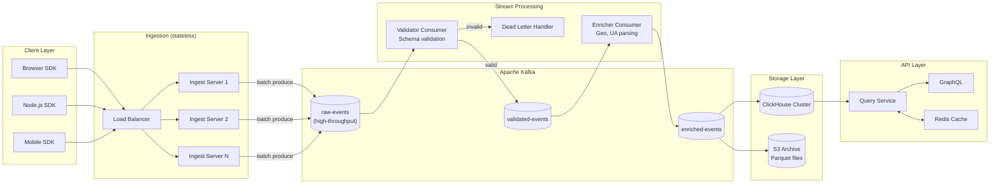
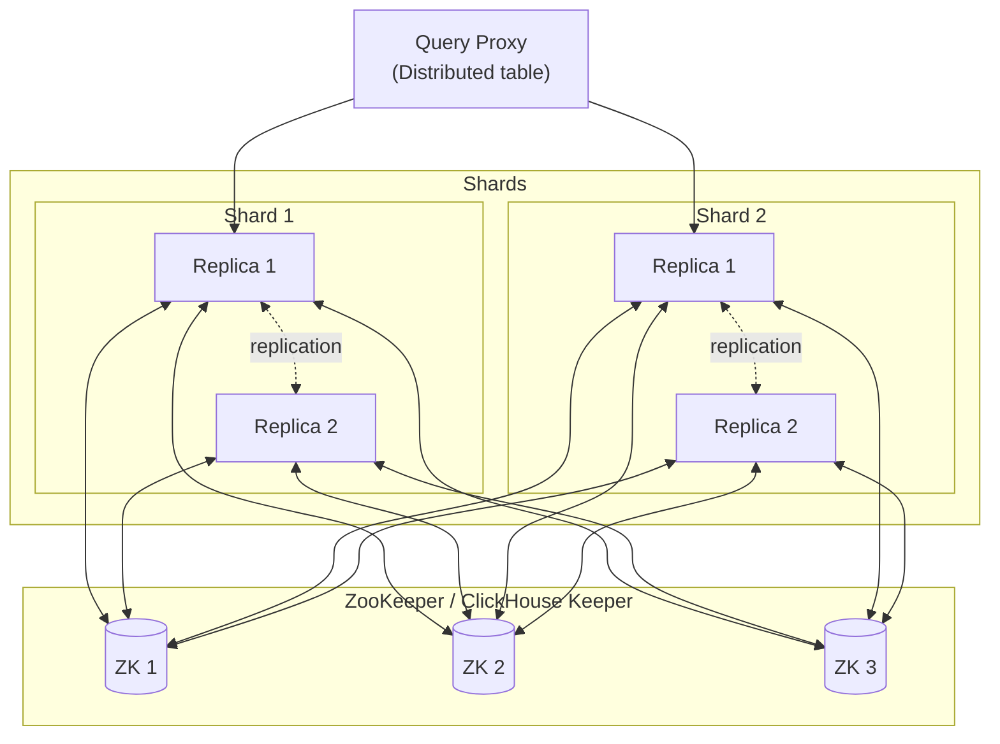

# Analytics Pipeline Architecture

## Data Flow



## Ingestion Service

The ingestion service is intentionally dumb — it validates the minimum required fields, authenticates the request, and produces to Kafka as fast as possible.

### Design Principles

1. **No processing in the hot path** — geo-lookup, user-agent parsing, and data enrichment happen in stream processors after Kafka
2. **Stateless** — horizontal scaling without coordination
3. **Durable acknowledgment** — only acknowledge to client after Kafka write confirmation
4. **Batching** — accumulate events client-side before sending, reduce HTTP overhead

### Ingestion Service Implementation

```typescript
// src/ingestion/server.ts
import Fastify from 'fastify';
import { Kafka, Producer, CompressionTypes } from 'kafkajs';
import { z } from 'zod';

const kafka = new Kafka({
  clientId: 'ingest-server',
  brokers: process.env.KAFKA_BROKERS?.split(',') ?? ['localhost:9092'],
  ssl: process.env.KAFKA_SSL === 'true',
});

let producer: Producer;

async function buildServer() {
  const app = Fastify({
    logger: true,
    trustProxy: true,  // Trust X-Forwarded-For
  });

  producer = kafka.producer({
    idempotent: true,
    maxInFlightRequests: 5,
    transactionTimeout: 30_000,
    allowAutoTopicCreation: false,
  });

  await producer.connect();

  // Batch events endpoint
  app.post<{
    Body: { writeKey: string; batch: unknown[] };
  }>('/v1/batch', {
    schema: {
      body: {
        type: 'object',
        required: ['writeKey', 'batch'],
        properties: {
          writeKey: { type: 'string' },
          batch: { type: 'array', maxItems: 1000 },
        },
      },
    },
  }, async (request, reply) => {
    const { writeKey, batch } = request.body;

    // Validate write key (fast — cached in memory)
    const sourceId = await validateWriteKey(writeKey);
    if (!sourceId) {
      return reply.code(401).send({ error: 'Invalid write key' });
    }

    // Validate basic event structure (minimal validation here)
    const validEvents = batch.filter(isValidEvent);

    if (validEvents.length === 0) {
      return reply.code(400).send({ error: 'No valid events in batch' });
    }

    const now = Date.now();
    const messages = validEvents.map((event: Record<string, unknown>) => ({
      key: String(event.userId ?? event.anonymousId ?? 'anonymous'),
      value: JSON.stringify({
        ...event,
        sourceId,
        receivedAt: new Date(now).toISOString(),
        ingestServerIp: request.ip,
      }),
      headers: {
        'source-id': sourceId,
        'content-type': 'application/json',
      },
    }));

    await producer.send({
      topic: 'raw-events',
      compression: CompressionTypes.GZIP,
      messages,
    });

    return reply.code(200).send({
      success: true,
      accepted: validEvents.length,
      rejected: batch.length - validEvents.length,
    });
  });

  return app;
}

function isValidEvent(event: unknown): event is Record<string, unknown> {
  if (!event || typeof event !== 'object') return false;
  const e = event as Record<string, unknown>;
  // Require at minimum: event type and at least one identity field
  return (
    typeof e.event === 'string' &&
    e.event.length > 0 &&
    (typeof e.userId === 'string' || typeof e.anonymousId === 'string')
  );
}
```

## Kafka Topic Design

### Topic Layout

```
raw-events                 → Everything ingested (high volume, short retention)
validated-events           → Schema-validated events (consumers can trust shape)
enriched-events            → Geo/UA enriched (final canonical form)
dead-letter-events         → Failed validation (manual review)
```

### Partition Strategy

```
Key: userId (or anonymousId)
Partitions: 32 (scale to 128 for > 1M events/s)
Replication factor: 3
```

Using `userId` as the partition key ensures:
- All events from one user land in the same partition (ordering per user)
- No hotspots (user IDs are uniformly distributed)

### Retention Configuration

```properties
# raw-events: short retention, high throughput
raw-events.retention.ms=86400000        # 1 day (re-ingest from S3 if needed)
raw-events.retention.bytes=107374182400 # 100 GB per partition

# enriched-events: longer retention for backfill
enriched-events.retention.ms=604800000  # 7 days
enriched-events.segment.bytes=134217728 # 128 MB segments
enriched-events.compression.type=gzip
```

## Stream Processing

### Validator Consumer

```typescript
// src/processing/validator.ts
import { Kafka, Consumer, Producer } from 'kafkajs';
import { z } from 'zod';

const EventSchema = z.object({
  event: z.string().min(1).max(255),
  userId: z.string().optional(),
  anonymousId: z.string().optional(),
  sessionId: z.string().optional(),
  timestamp: z.string().datetime().optional(),
  receivedAt: z.string().datetime(),
  sourceId: z.string(),
  properties: z.record(z.unknown()).optional().default({}),
  context: z.object({
    userAgent: z.string().optional(),
    ip: z.string().optional(),
    locale: z.string().optional(),
    timezone: z.string().optional(),
    page: z.object({
      url: z.string().optional(),
      title: z.string().optional(),
      referrer: z.string().optional(),
    }).optional(),
  }).optional(),
}).refine(
  (data) => data.userId !== undefined || data.anonymousId !== undefined,
  'Either userId or anonymousId must be present'
);

export class ValidatorConsumer {
  private consumer: Consumer;
  private validProducer: Producer;
  private dlqProducer: Producer;

  constructor(kafka: Kafka) {
    this.consumer = kafka.consumer({
      groupId: 'event-validator',
      sessionTimeout: 30_000,
      heartbeatInterval: 3_000,
    });
    this.validProducer = kafka.producer({ idempotent: true });
    this.dlqProducer = kafka.producer();
  }

  async start(): Promise<void> {
    await Promise.all([
      this.consumer.connect(),
      this.validProducer.connect(),
      this.dlqProducer.connect(),
    ]);

    await this.consumer.subscribe({ topic: 'raw-events', fromBeginning: false });

    await this.consumer.run({
      eachBatch: async ({ batch, resolveOffset, heartbeat }) => {
        const validMessages: Array<{ key: string; value: string }> = [];
        const dlqMessages: Array<{ key: string; value: string }> = [];

        for (const message of batch.messages) {
          try {
            const event = JSON.parse(message.value?.toString() ?? '{}');
            const parsed = EventSchema.safeParse(event);

            if (parsed.success) {
              // Normalize timestamp: use receivedAt if timestamp is missing
              const normalized = {
                ...parsed.data,
                timestamp: parsed.data.timestamp ?? parsed.data.receivedAt,
              };
              validMessages.push({
                key: message.key?.toString() ?? 'unknown',
                value: JSON.stringify(normalized),
              });
            } else {
              dlqMessages.push({
                key: message.key?.toString() ?? 'unknown',
                value: JSON.stringify({
                  originalEvent: event,
                  errors: parsed.error.errors,
                  receivedAt: new Date().toISOString(),
                }),
              });
            }
          } catch (err) {
            // Malformed JSON
            dlqMessages.push({
              key: message.key?.toString() ?? 'unknown',
              value: JSON.stringify({
                raw: message.value?.toString(),
                error: String(err),
                receivedAt: new Date().toISOString(),
              }),
            });
          }

          resolveOffset(message.offset);
          await heartbeat();
        }

        // Batch produce
        if (validMessages.length > 0) {
          await this.validProducer.send({
            topic: 'validated-events',
            messages: validMessages,
          });
        }

        if (dlqMessages.length > 0) {
          await this.dlqProducer.send({
            topic: 'dead-letter-events',
            messages: dlqMessages,
          });
        }
      },
    });
  }
}
```

### Enricher Consumer

```typescript
// src/processing/enricher.ts
import maxmind from 'maxmind';
import uaParser from 'ua-parser-js';

interface GeoLookup {
  country?: string;
  region?: string;
  city?: string;
  latitude?: number;
  longitude?: number;
}

export class EnricherConsumer {
  private geoDb: maxmind.Reader<maxmind.CityResponse>;

  async initialize(): Promise<void> {
    // MaxMind GeoLite2 database
    this.geoDb = await maxmind.open<maxmind.CityResponse>(
      process.env.MAXMIND_DB_PATH ?? '/data/GeoLite2-City.mmdb'
    );
  }

  enrich(event: ValidatedEvent): EnrichedEvent {
    const context = event.context ?? {};
    let geo: GeoLookup = {};
    let ua: uaParser.IResult | null = null;

    // Geo lookup from IP
    if (context.ip) {
      const result = this.geoDb.get(context.ip);
      if (result) {
        geo = {
          country: result.country?.iso_code,
          region: result.subdivisions?.[0]?.iso_code,
          city: result.city?.names.en,
          latitude: result.location?.latitude,
          longitude: result.location?.longitude,
        };
      }
    }

    // User-agent parsing
    if (context.userAgent) {
      ua = uaParser(context.userAgent);
    }

    return {
      ...event,
      // Derived fields — computed once, stored for efficiency
      $geo_country: geo.country,
      $geo_region: geo.region,
      $geo_city: geo.city,
      $browser: ua?.browser.name,
      $browser_version: ua?.browser.version,
      $os: ua?.os.name,
      $device_type: classifyDevice(ua),
      // Drop IP after geo-lookup (privacy)
      context: {
        ...context,
        ip: undefined,  // Removed for privacy
      },
    };
  }
}

function classifyDevice(ua: uaParser.IResult | null): string {
  if (!ua) return 'unknown';
  if (ua.device.type === 'mobile') return 'mobile';
  if (ua.device.type === 'tablet') return 'tablet';
  return 'desktop';
}
```

## ClickHouse Ingestion

### Consumer to ClickHouse

```typescript
// src/processing/clickhouse-consumer.ts
import { createClient } from '@clickhouse/client';
import { Kafka } from 'kafkajs';

export class ClickHouseConsumer {
  private clickhouse = createClient({
    host: process.env.CLICKHOUSE_HOST ?? 'http://localhost:8123',
    username: process.env.CLICKHOUSE_USER ?? 'default',
    password: process.env.CLICKHOUSE_PASSWORD,
    database: 'tracking',
  });

  private buffer: EnrichedEvent[] = [];
  private lastFlush = Date.now();

  async process(events: EnrichedEvent[]): Promise<void> {
    this.buffer.push(...events);

    const shouldFlush =
      this.buffer.length >= 10_000 ||  // Flush at 10K events
      Date.now() - this.lastFlush > 5_000;  // Or every 5 seconds

    if (shouldFlush) {
      await this.flush();
    }
  }

  private async flush(): Promise<void> {
    if (this.buffer.length === 0) return;

    const batch = this.buffer.splice(0, this.buffer.length);

    await this.clickhouse.insert({
      table: 'events',
      values: batch.map((e) => ({
        user_id: e.userId ?? '',
        anonymous_id: e.anonymousId ?? '',
        session_id: e.sessionId ?? '',
        event: e.event,
        timestamp: new Date(e.timestamp).getTime() / 1000,
        received_at: new Date(e.receivedAt).getTime() / 1000,
        source_id: e.sourceId,
        properties: JSON.stringify(e.properties ?? {}),
        geo_country: e.$geo_country ?? '',
        browser: e.$browser ?? '',
        os: e.$os ?? '',
        device_type: e.$device_type ?? 'unknown',
      })),
      format: 'JSONEachRow',
    });

    this.lastFlush = Date.now();
  }
}
```

## High Availability Design

### ClickHouse Cluster



- **2 shards × 2 replicas** = 4 ClickHouse nodes
- ZooKeeper (3 nodes) for replication coordination
- Distributed table on query proxy for transparent sharding
- Each shard has 50% of data, both replicas have identical data

## Operational Considerations

### Kafka Consumer Lag Monitoring

```typescript
// Monitor consumer lag as the leading indicator of pipeline health
const lagMetric = new Gauge({
  name: 'kafka_consumer_lag',
  help: 'Consumer lag by topic and partition',
  labelNames: ['topic', 'partition', 'consumer_group'],
});

async function collectKafkaLag(admin: Admin): Promise<void> {
  const groups = ['event-validator', 'event-enricher', 'clickhouse-consumer'];

  for (const group of groups) {
    const offsets = await admin.fetchOffsets({ groupId: group, topics: ['raw-events'] });
    const topicOffsets = await admin.fetchTopicOffsets('raw-events');

    for (const partition of offsets.flatMap((o) => o.partitions)) {
      const topicOffset = topicOffsets
        .find((t) => t.partitionId === partition.partition)?.offset ?? '0';

      const lag = parseInt(topicOffset) - parseInt(partition.offset);

      lagMetric.set(
        { topic: 'raw-events', partition: String(partition.partition), consumer_group: group },
        Math.max(0, lag)
      );
    }
  }
}
```

### Data Quality Metrics

```sql
-- Daily data quality report
SELECT
  toDate(received_at) AS date,
  source_id,
  count() AS total_events,
  countIf(user_id = '') AS events_missing_userid,
  countIf(length(event) = 0) AS events_missing_name,
  countIf(geo_country = '') AS events_missing_geo,
  countIf(timestamp < subtractDays(received_at, 1)) AS events_out_of_order,
  countIf(timestamp > addHours(received_at, 1)) AS events_from_future
FROM tracking.events
WHERE toDate(received_at) = yesterday()
GROUP BY date, source_id
ORDER BY date DESC, total_events DESC;
```

::: info War Story
**The 3-Hour Data Gap**

A ClickHouse node went offline for maintenance. The cluster continued writing (the shard had a surviving replica). When the node came back, it needed to catch up on 3 hours of missed writes via ZooKeeper-coordinated replication.

During catch-up, analytical queries showed inconsistent results — some queries hit the caught-up replica, others hit the lagging replica. Dashboards showed different numbers depending on which replica they queried.

The fix: add a `prefer_localhost_replica = 0` setting in ClickHouse query configuration, plus a "replica freshness check" in the query layer that routes queries to the most up-to-date replica only. ClickHouse's `system.replicas` table provides replication lag data.
:::
